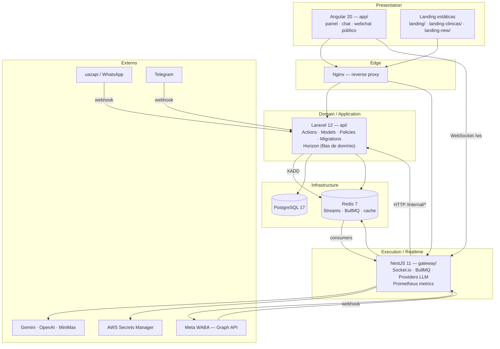

# Arquitetura — InteraZap

> Microservices: Laravel 12 concentra domínio e persistência; NestJS 11 executa realtime, filas e inferência de IA.
> api → gateway via **Redis Streams** (`XADD`); gateway → api via **HTTP interno** autenticado por `INTERNAL_API_KEY`.

## Camadas

| Camada | Onde vive | Responsabilidade |
|---|---|---|
| Presentation | `app/` | UI Angular, webchat público, painel de operador e super admin |
| Domain / Application | `api/src/Domain/{Contexto}` | Regras de negócio, Actions, Models, Policies, migrations, filas Horizon |
| Execution / Realtime | `gateway/src/domains/*` | WebSocket, BullMQ, chamadas a provedores de LLM, envio outbound, métricas |
| Infrastructure | PostgreSQL 17 · Redis 7 | Persistência, cache, Streams, filas |

## Fatos verificáveis

- O gateway **não tem driver de banco** — sem `pg`, `typeorm`, `prisma` ou `knex` no `gateway/package.json`.
- Webhooks de **uazapi** e **Telegram** entram na api (`api/src/Domain/Chat/Routes/chat.php`); webhook da **Meta** entra no gateway (`gateway/src/domains/chat/controllers/meta-webhook.controller.ts`).
- A api despacha trabalho de IA para o gateway via `RedisGatewayClient` (`api/src/Domain/Gateway/Services/RedisGatewayClient.php`), publicando no stream do domínio e aguardando resposta por `correlationId`.
- Existem **duas** infraestruturas de fila: Horizon (api, jobs de domínio) e BullMQ (gateway, execução/outbound).
