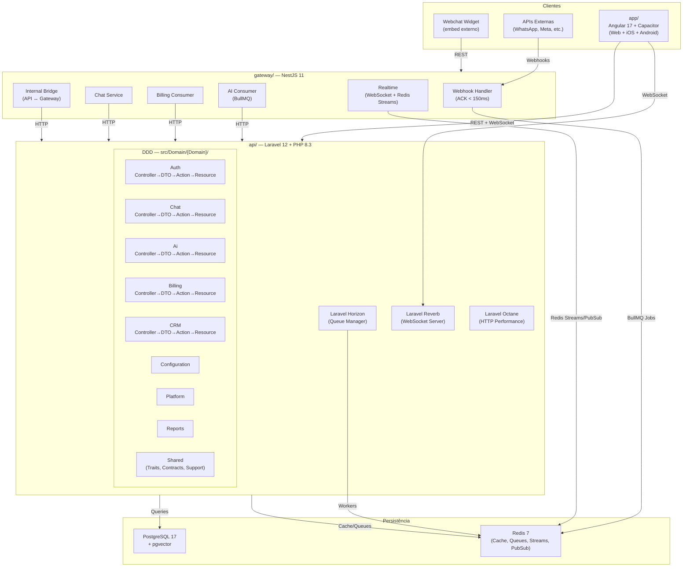

# Arquitetura InteraZap

> Plataforma multi-tenant SaaS para gestão de conversas via WhatsApp e outros canais.

```mermaid
graph TB
    subgraph Clients["Clientes"]
        APP["app/\nAngular 17 + Capacitor\n(Web + iOS + Android)"]
        WEBCHAT["Webchat Widget\n(embed externo)"]
        EXT["APIs Externas\n(WhatsApp, Meta, etc.)"]
    end

    subgraph Gateway["gateway/ — NestJS 11"]
        GW_WEBHOOK["Webhook Handler\n(ACK < 150ms)"]
        GW_AI["AI Consumer\n(BullMQ)"]
        GW_BILLING["Billing Consumer"]
        GW_CHAT["Chat Service"]
        GW_REALTIME["Realtime\n(WebSocket + Redis Streams)"]
        GW_INTERNAL["Internal Bridge\n(API ↔ Gateway)"]
    end

    subgraph API["api/ — Laravel 12 + PHP 8.3"]
        subgraph DDD["DDD — src/Domain/{Domain}/"]
            AUTH["Auth\nController→DTO→Action→Resource"]
            CHAT_D["Chat\nController→DTO→Action→Resource"]
            AI_D["Ai\nController→DTO→Action→Resource"]
            BILLING_D["Billing\nController→DTO→Action→Resource"]
            CRM_D["CRM\nController→DTO→Action→Resource"]
            CFG["Configuration"]
            PLATFORM["Platform"]
            REPORTS["Reports"]
            SHARED["Shared\n(Traits, Contracts, Support)"]
        end
        HORIZON["Laravel Horizon\n(Queue Manager)"]
        REVERB["Laravel Reverb\n(WebSocket Server)"]
        OCTANE["Laravel Octane\n(HTTP Performance)"]
    end

    subgraph Data["Persistência"]
        PG["PostgreSQL 17\n+ pgvector"]
        REDIS["Redis 7\n(Cache, Queues, Streams, PubSub)"]
    end

    APP -->|REST + WebSocket| API
    APP -->|WebSocket| REVERB
    WEBCHAT -->|REST| Gateway
    EXT -->|Webhooks| GW_WEBHOOK
    GW_WEBHOOK -->|BullMQ Jobs| REDIS
    GW_AI -->|HTTP| API
    GW_BILLING -->|HTTP| API
    GW_CHAT -->|HTTP| API
    GW_REALTIME -->|Redis Streams/PubSub| REDIS
    GW_INTERNAL -->|HTTP| API
    API -->|Queries| PG
    API -->|Cache/Queues| REDIS
    HORIZON -->|Workers| REDIS
```
