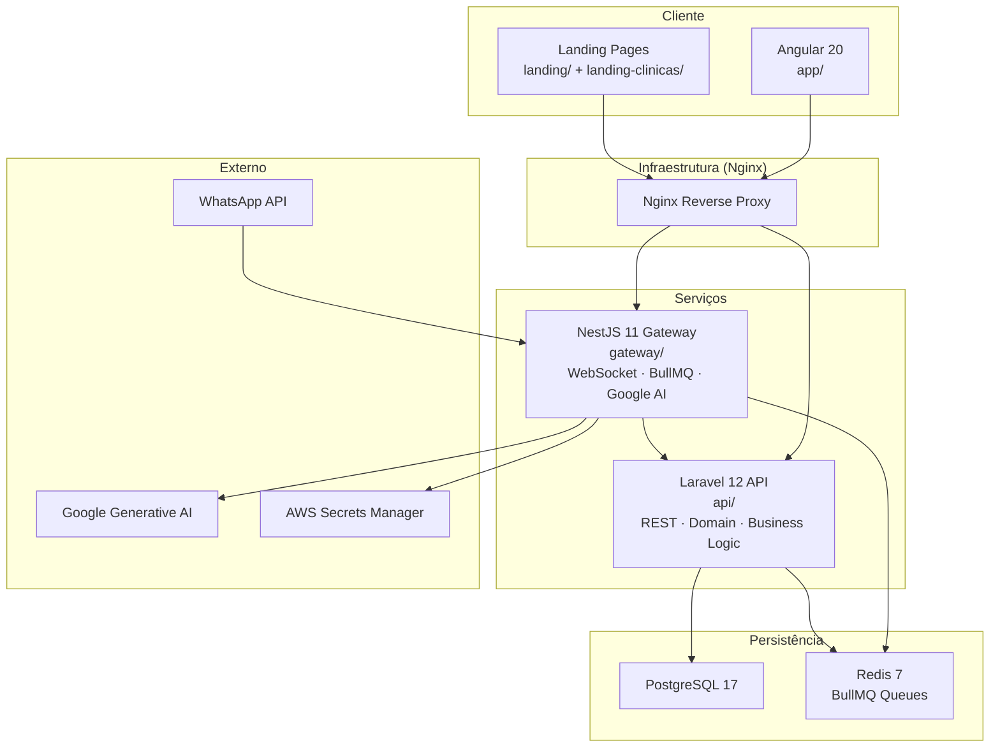

# Arquitetura — InteraZap

> Microservices com separação clara entre gateway de realtime/AI e API de negócio.

```mermaid
graph TB
    subgraph Client["Cliente"]
        APP["Angular 20<br/>app/"]
        LAND["Landing Pages<br/>landing/ + landing-clinicas/"]
    end

    subgraph Infra["Infraestrutura (Nginx)"]
        NGINX["Nginx Reverse Proxy"]
    end

    subgraph Services["Serviços"]
        GW["NestJS 11 Gateway<br/>gateway/<br/>WebSocket · BullMQ · Google AI"]
        API["Laravel 12 API<br/>api/<br/>REST · Domain · Business Logic"]
    end

    subgraph Data["Persistência"]
        PG["PostgreSQL 17"]
        REDIS["Redis 7<br/>BullMQ Queues"]
    end

    subgraph External["Externo"]
        WA["WhatsApp API"]
        GOOG["Google Generative AI"]
        AWS["AWS Secrets Manager"]
    end

    APP --> NGINX
    LAND --> NGINX
    NGINX --> GW
    NGINX --> API

    GW --> API
    GW --> REDIS
    GW --> GOOG
    GW --> AWS

    API --> PG
    API --> REDIS

    WA --> GW
```
