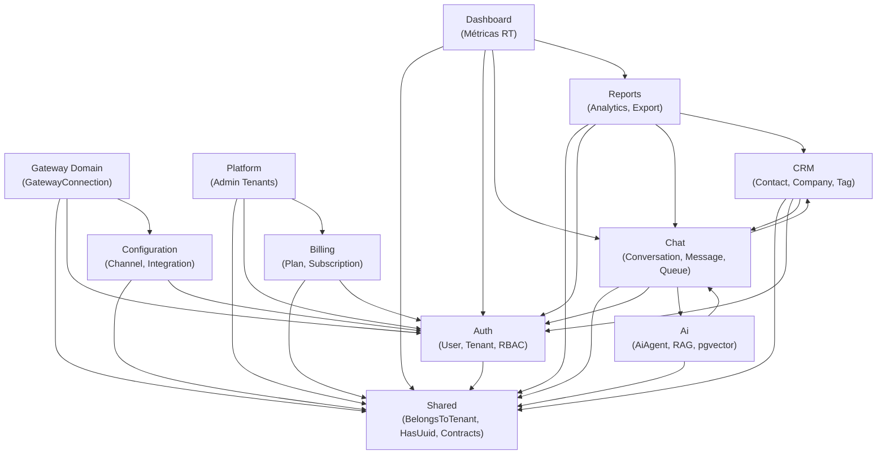

# Mapa de Módulos e Dependências — InteraZap

> Dependências entre domínios da API (Laravel). Seta = "pode importar".

```mermaid
graph TD
    Shared["Shared\n(BelongsToTenant, HasUuid, Contracts)"]

    Auth["Auth\n(User, Tenant, RBAC)"]
    Billing["Billing\n(Plan, Subscription)"]
    Gateway_D["Gateway Domain\n(GatewayConnection)"]
    Configuration["Configuration\n(Channel, Integration)"]
    Platform["Platform\n(Admin Tenants)"]

    CRM["CRM\n(Contact, Company, Tag)"]
    Chat["Chat\n(Conversation, Message, Queue)"]
    Ai["Ai\n(AiAgent, RAG, pgvector)"]

    Dashboard["Dashboard\n(Métricas RT)"]
    Reports["Reports\n(Analytics, Export)"]

    Auth --> Shared
    Billing --> Shared
    Billing --> Auth
    Gateway_D --> Shared
    Gateway_D --> Auth
    Gateway_D --> Configuration
    Configuration --> Shared
    Configuration --> Auth
    Platform --> Shared
    Platform --> Auth
    Platform --> Billing

    CRM --> Shared
    CRM --> Auth
    CRM --> Chat

    Chat --> Shared
    Chat --> Auth
    Chat --> Ai
    Chat --> CRM

    Ai --> Shared
    Ai --> Chat

    Dashboard --> Shared
    Dashboard --> Auth
    Dashboard --> Chat
    Dashboard --> Reports

    Reports --> Shared
    Reports --> Auth
    Reports --> Chat
    Reports --> CRM
```
