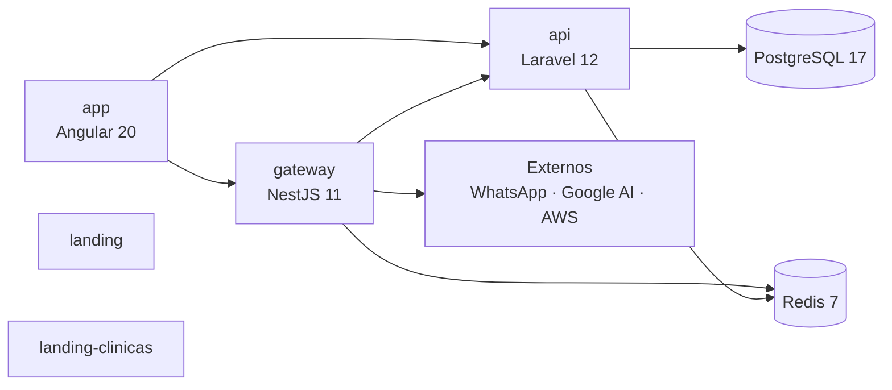

# Mapa de Módulos — InteraZap

> Dependências entre módulos. Setas = "consome".

```mermaid
graph LR
    APP["app<br/>Angular 20"]
    GW["gateway<br/>NestJS 11"]
    API["api<br/>Laravel 12"]
    LAND["landing"]
    LANDC["landing-clinicas"]
    PG[("PostgreSQL 17")]
    REDIS[("Redis 7")]
    EXT["Externos<br/>WhatsApp · Google AI · AWS"]

    APP --> GW
    APP --> API
    GW --> API
    GW --> REDIS
    GW --> EXT
    API --> PG
    API --> REDIS
```
