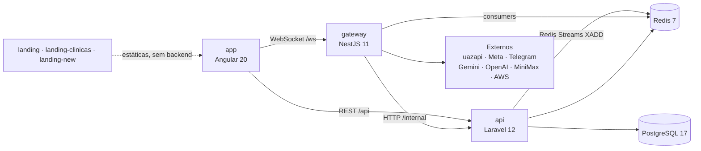
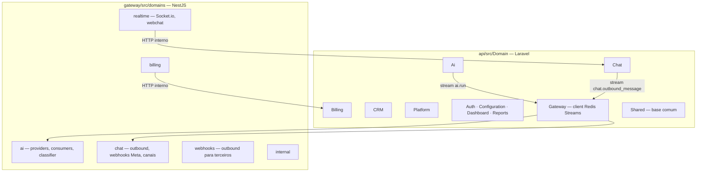

# Mapa de Módulos — InteraZap

> Setas = "consome". Definição formal em `modules.yaml`.

## Bounded contexts

## Regra de leitura

Todo módulo da api é `api/src/Domain/{Contexto}` com o mesmo esqueleto: `Actions/`, `Http/`, `Models/`, `DTOs/`, `Routes/`, `Jobs/`, `Services/`, `Policies/`.
Todo domínio do gateway é `gateway/src/domains/{contexto}` com `controllers/`, `services/`, `dto/`, `models/`, `consumers|processors/`.
