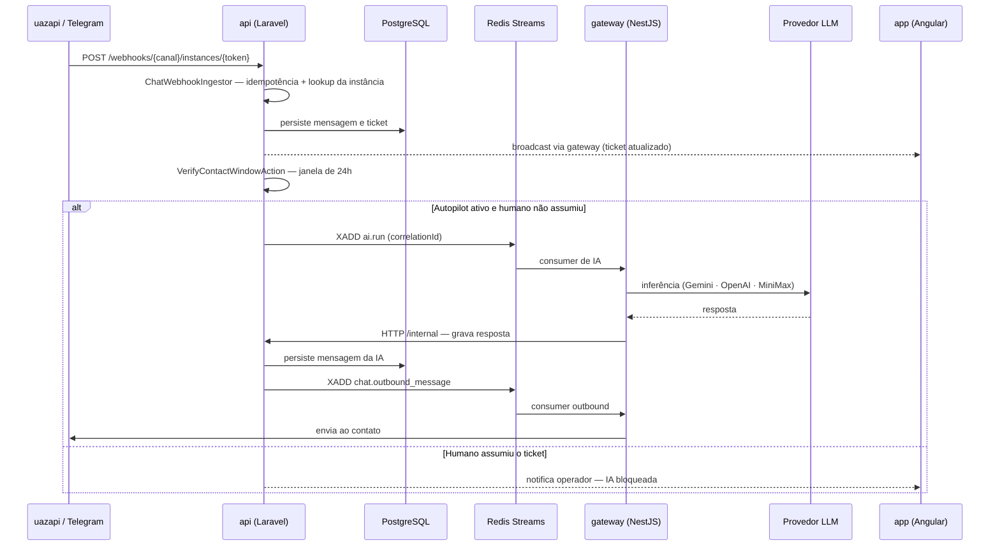
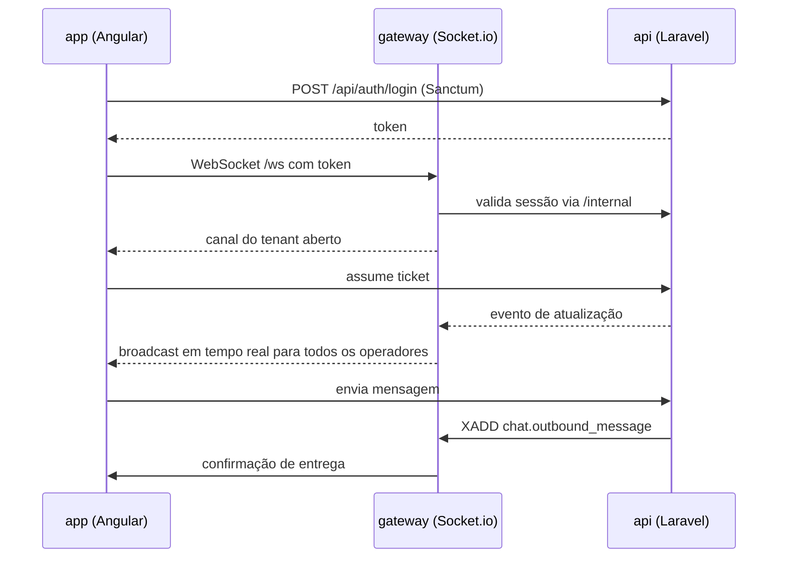
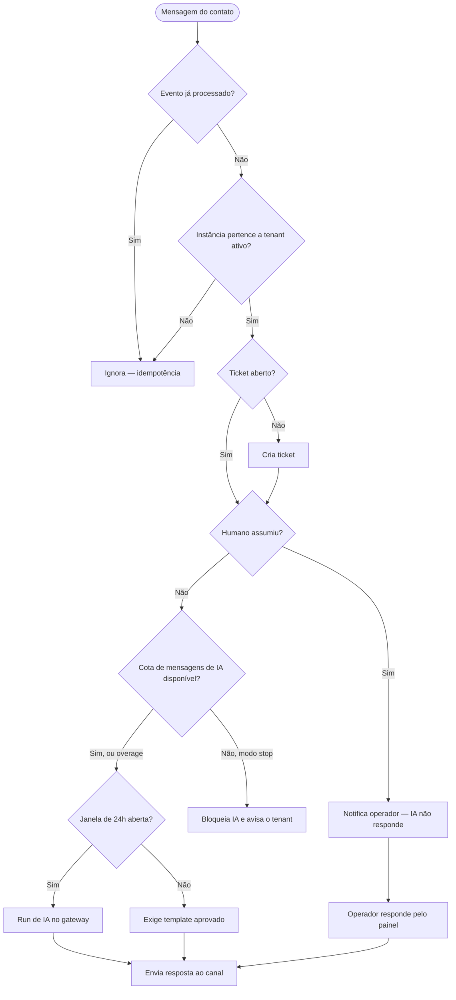

# Fluxos do Usuário — InteraZap

> Três fluxos que atravessam todas as camadas: mensagem recebida, resposta da IA e atendimento humano.

## Fluxo 1 — Mensagem recebida (uazapi / Telegram)

## Fluxo 2 — Operador no painel

## Fluxo 3 — Decisão de resposta

