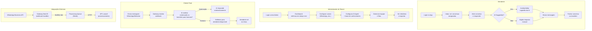

# Fluxos Principais do Usuário — InteraZap

> Fluxos de alto nível dos usuários da plataforma.

```mermaid
flowchart TD
    subgraph Atendente["Atendente"]
        A1["Login no App"] --> A2["Inbox: ver conversas\nassignadas"]
        A2 --> A3["Abrir conversa\ne responder"]
        A3 --> A4{"AI Suggestion?"}
        A4 -->|Sim| A5["Aceitar/editar\nsugestão da AI"]
        A4 -->|Não| A6["Digitar resposta\nmanual"]
        A5 --> A7["Enviar mensagem"]
        A6 --> A7
        A7 --> A8["Fechar conversa\nou transferir"]
    end

    subgraph Admin["Administrador do Tenant"]
        B1["Login como Admin"] --> B2["Dashboard:\nmétricas em tempo real"]
        B2 --> B3["Configurar canais\n(WhatsApp, etc.)"]
        B3 --> B4["Configurar AI Agent\n+ base de conhecimento"]
        B4 --> B5["Gerenciar equipe\ne filas"]
        B5 --> B6["Ver relatórios\ne exportar"]
    end

    subgraph Cliente["Cliente Final"]
        C1["Envia mensagem\nWhatsApp/Webchat"] --> C2["Gateway recebe\nwebhook"]
        C2 --> C3["AI analisa:\nautomação ou\ntransferir para humano?"]
        C3 -->|Automação| C4["AI responde\nautomaticamente"]
        C3 -->|Humano| C5["Enfileirar para\natendente disponível"]
        C5 --> C6["Atendente vê\nno inbox"]
    end

    subgraph Externo["Integrações Externas"]
        D1["WhatsApp Business API"] --> GW["Gateway NestJS\n(webhook handler)"]
        GW -->|BullMQ Job| D2["Processing Queue\n(Redis)"]
        D2 -->|HTTP| D3["API Laravel\n(processamento)"]
    end
```
