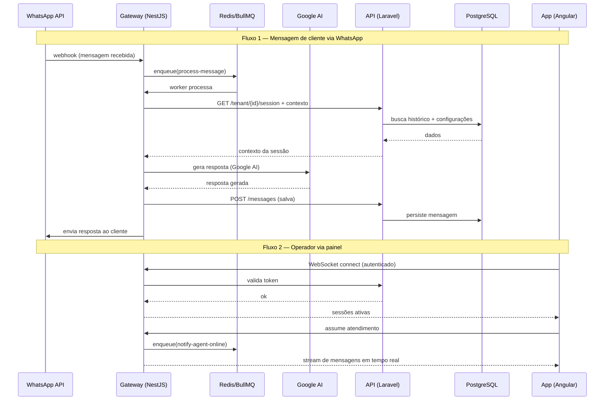
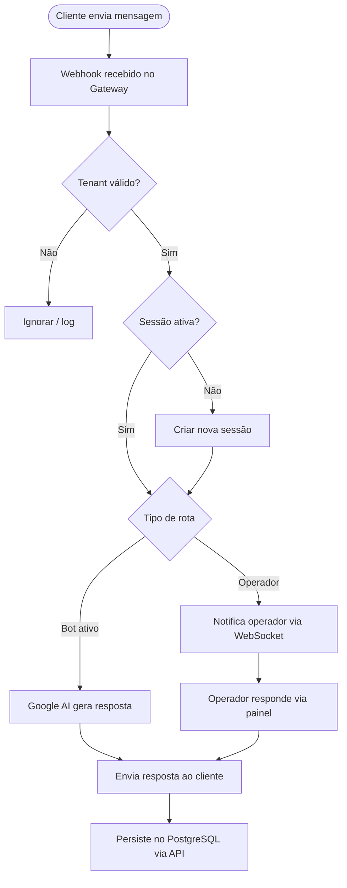

# Fluxos do Usuário — InteraZap

> Fluxos principais: mensagem WhatsApp, atendimento via webchat, painel admin.

```mermaid
sequenceDiagram
    participant WA as WhatsApp API
    participant GW as Gateway (NestJS)
    participant Q as Redis/BullMQ
    participant AI as Google AI
    participant API as API (Laravel)
    participant DB as PostgreSQL
    participant APP as App (Angular)

    Note over WA,APP: Fluxo 1 — Mensagem de cliente via WhatsApp

    WA->>GW: webhook (mensagem recebida)
    GW->>Q: enqueue(process-message)
    Q->>GW: worker processa
    GW->>API: GET /tenant/{id}/session + contexto
    API->>DB: busca histórico + configurações
    DB-->>API: dados
    API-->>GW: contexto da sessão
    GW->>AI: gera resposta (Google AI)
    AI-->>GW: resposta gerada
    GW->>API: POST /messages (salva)
    API->>DB: persiste mensagem
    GW->>WA: envia resposta ao cliente

    Note over WA,APP: Fluxo 2 — Operador via painel

    APP->>GW: WebSocket connect (autenticado)
    GW->>API: valida token
    API-->>GW: ok
    GW-->>APP: sessões ativas
    APP->>GW: assume atendimento
    GW->>Q: enqueue(notify-agent-online)
    GW-->>APP: stream de mensagens em tempo real
```

```mermaid
flowchart TD
    START([Cliente envia mensagem]) --> WEBHOOK[Webhook recebido no Gateway]
    WEBHOOK --> TENANT{Tenant válido?}
    TENANT -->|Não| REJECT[Ignorar / log]
    TENANT -->|Sim| SESSION{Sessão ativa?}
    SESSION -->|Não| NEWSESSION[Criar nova sessão]
    SESSION -->|Sim| ROUTE{Tipo de rota}
    NEWSESSION --> ROUTE
    ROUTE -->|Bot ativo| AI[Google AI gera resposta]
    ROUTE -->|Operador| NOTIFY[Notifica operador via WebSocket]
    AI --> SEND[Envia resposta ao cliente]
    NOTIFY --> OPERATOR[Operador responde via painel]
    OPERATOR --> SEND
    SEND --> SAVE[Persiste no PostgreSQL via API]
```
