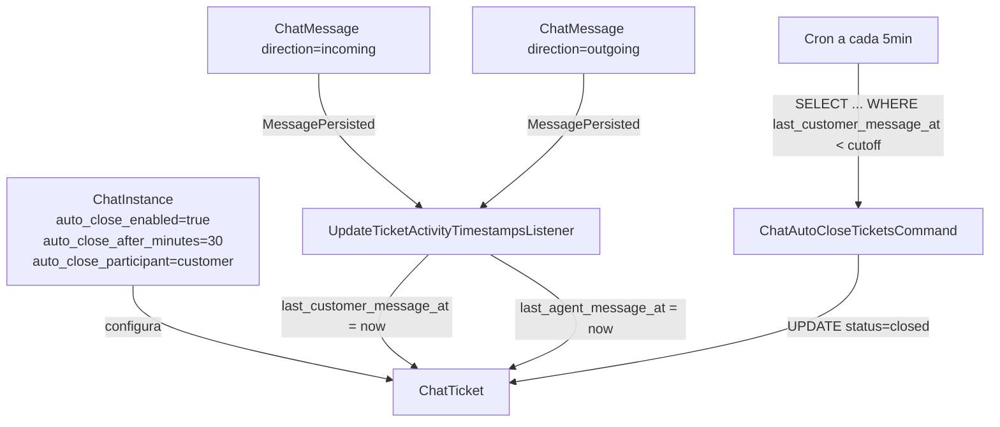

# Architecture Decision Records — InteraZap

> Arquivo vivo. Cada decisão é imutável após CONFIRM do PREVC.
> Novas decisões são anexadas no topo (mais recente primeiro).

---

## ADR-007: Auto-Close de Tickets por Inatividade de Participante

**Data:** 2026-05-01
**Status:** Proposed
**Domínio:** Chat
**Escopo:** API + Gateway + Frontend

### Contexto

O sistema possui mecanismo de auto-close global (`CHAT_AUTO_CLOSE_MINUTES` no `.env`) que:
- É único para toda a aplicação (não respeita tenant nem canal)
- Não distingue quem interagiu por último (cliente vs atendente)
- Não está agendado em nenhum ServiceProvider (comando só roda manualmente)
- Campos `auto_close_queue_after_minutes` e `auto_close_in_progress_after_minutes` em `chat_tickets_extended` existem no schema/model/factory mas **nenhuma lógica de negócio os utiliza** (campos fantasmas desde a migração de split da tabela extended)

O requisito do produto é permitir configurar **por canal** quantos minutos sem interação devem transcorrer antes do fechamento automático, com escolha de quem precisa estar inativo:
- **Cliente** (`incoming`): útil quando atendente respondeu e aguarda retorno
- **Atendente** (`outgoing`): útil para filas/overflow onde ninguém atendeu
- **Qualquer um** (`any`): nenhuma mensagem de ninguém há X minutos

### Decisão

#### 1. Configuração por Canal (não global)

Adicionar 3 colunas em `chat_instances`:

| Coluna | Tipo | Default | Significado |
|--------|------|---------|-------------|
| `auto_close_enabled` | boolean | false | Master switch do canal |
| `auto_close_after_minutes` | integer, nullable | null | Tempo de inatividade |
| `auto_close_participant` | enum('any','customer','agent') | 'any' | Quem precisa estar inativo |

**Raciocínio:**
- Diferentes canais servem propósitos diferentes (WhatsApp suporte vs Instagram vendas)
- Padrão do mercado (Zendesk, Intercom, Twilio Flex) é granularidade por canal com fallback global
- `evaluation_enabled` e `evaluation_cutoff_score` já são colunas dedicadas em `chat_instances` — auto-close merece o mesmo tratamento (regra de negócio, não conteúdo textual)
- Não colocar em `settings_json` porque é queryable (job precisa filtrar canais ativos) e é regra de negócio, não config técnica

#### 2. Denormalização de Timestamps no Ticket

Adicionar em `chat_tickets`:

| Coluna | Tipo | Significado |
|--------|------|-------------|
| `last_customer_message_at` | datetime, nullable | Última mensagem `direction='incoming'` |
| `last_agent_message_at` | datetime, nullable | Última mensagem `direction='outgoing'` |

Manter `last_message_at` existente (qualquer direção).

**Raciocínio:**
- O job de auto-close roda em intervalos regulares e consulta todos os tickets abertos
- Computar `MAX(created_at) FILTER (WHERE direction = 'incoming')` por ticket em tempo de execução é proibitivo em volume
- O projeto já denormaliza `last_message_at` — estendemos o padrão existente
- Índice composto `(tenant_id, status, last_customer_message_at)` / `(tenant_id, status, last_agent_message_at)` cobre a query do job

#### 3. Atualização via Evento `MessagePersisted`

O evento `Domain\Chat\Events\MessagePersisted` já é disparado após persistência de mensagens (`ChatWebhookIngestor`, etc.). O listener `MessagePersistorListener` já existe.

**Decisão:** Criar novo listener dedicado `UpdateTicketActivityTimestampsListener` registrado no mesmo evento `MessagePersisted`.

**Raciocínio:**
- Não espalhar lógica nos N lugares que criam mensagens (`SendChatMessageAction`, `SendTemplateMessageAction`, `WebChatMessageController`, etc.)
- Single source of truth: toda mensagem passa pelo evento
- Separação de concerns: `MessagePersistorListener` cuida de push/IA/summary; o novo listener cuida apenas de timestamps de atividade

**Nota sobre o evento atual:** O `MessagePersisted` hoje só é disparado para `direction === 'incoming'` no `ChatWebhookIngestor`. Precisa ser disparado para **todas** as direções, ou o novo listener precisa escutar outro evento. A decisão de implementação deve avaliar se estende `MessagePersisted` para outgoing ou usa outro hook (ex: Eloquent Observer em `ChatMessage`).

#### 4. Regra de Fechamento no Comando

Refatorar `ChatAutoCloseTicketsCommand`:

```
PARA CADA canal com auto_close_enabled = true:
  cutoff = now() - auto_close_after_minutos

  SE auto_close_participant = 'any':
    fecha tickets WHERE status != 'closed' AND last_message_at <= cutoff

  SE auto_close_participant = 'customer':
    fecha tickets WHERE status != 'closed' AND last_customer_message_at <= cutoff

  SE auto_close_participant = 'agent':
    fecha tickets WHERE status != 'closed' AND last_agent_message_at <= cutoff
```

**Raciocínio:**
- Mantém o comando existente, apenas evolui a lógica
- Não fecha tickets de canais sem config (resolve o problema de global único)
- Close reason deve indicar "Auto-close por inatividade de [participante]"

#### 5. Agendamento

Adicionar ao Laravel Schedule (`AppServiceProvider` ou `ConsoleServiceProvider`):
- `chat:auto-close` a cada 5 minutos

**Raciocínio:**
- O comando hoje é registrado em `bootstrap/app.php` mas **não está agendado** — é um gap crítico que torna a feature inoperante
- 5 min é granularidade suficiente para minutos de inatividade sem sobrecarregar

#### 6. Deprecação de Campos Fantasmas

Os campos `auto_close_queue_after_minutes` e `auto_close_in_progress_after_minutes` em `chat_tickets_extended` (e seus proxies em `ChatTicket`) devem ser **marcados como deprecated** e removidos em migration futura (fora do escopo desta decisão para não bloquear implementação).

**Raciocínio:**
- Nenhum código os utiliza; manter gera confusão
- Não removê-los agora para evitar migration destrutiva sem coordenação com DBA

### Alternativas Consideradas

| Alternativa | Por que descartada |
|-------------|--------------------|
| **Config global pura** (manter `.env`) | Não suporta heterogeneidade de canais; viola princípio de tenant isolation |
| **Config no `settings_json`** | Blob sem schema, não queryable, mistura concerns; quebra padrão de `evaluation_enabled` que é coluna dedicada |
| ** Computar timestamps de `chat_messages` em tempo real** | Proibitivo em volume; job consulta todos os tickets abertos frequentemente |
| **3 parâmetros separados** (customer_min, agent_min, both_min) | Over-engineering; o requisito é "um parâmetro de minutos + escolha de quem"; 3 parâmetros criam combinações conflitantes |
| **Snapshot da config no ticket** (imutável após abertura) | Prematuro; SLA é imutável, auto-close é regra operacional que pode mudar; se necessário no futuro, é fácil adicionar |

### Consequências

**Positivas:**
- Flexibilidade real por canal
- Query performática para o job de auto-close
- Padrão consistente com `evaluation_enabled`
- Remove dependência de `.env` para regra de negócio

**Negativas / Riscos:**
- 2 colunas novas em `chat_tickets` (tabela grande, particionada) — requer análise de DBA sobre impacto de índices
- O evento `MessagePersisted` precisa ser disparado para outgoing também (mudança de comportamento existente)
- Frontend de canal precisa de novos campos no form

### Schema de Impacto

```yaml
chat_instances:
  + auto_close_enabled: boolean, default false
  + auto_close_after_minutes: integer, nullable
  + auto_close_participant: enum('any','customer','agent'), default 'any'

chat_tickets:
  + last_customer_message_at: timestamp, nullable
  + last_agent_message_at: timestamp, nullable
  # last_message_at já existe

# Índices propostos (validar com DBA):
# chat_tickets: (tenant_id, status, last_customer_message_at)
# chat_tickets: (tenant_id, status, last_agent_message_at)
```

### Diagrama



### Dependências

- DBA: validar índices em `chat_tickets` (tabela particionada, alto volume)
- BACKEND: refactor do `MessagePersisted` para cobrir outgoing, novo listener, command
- FRONTEND: campos no `channel-form`
- QA: testes do job com diferentes escopos de participante

---

## ADR-006: [Anteriores serão adicionados aqui quando migrados dos arquivos individuais]

*(Este arquivo foi criado em 2026-05-01. Decisões anteriores estão dispersas em arquivos individuais em `.context/DOCS/MEMORY/`.)*
