# PRD-AI-001 — Agente de IA e Módulo Autopilot

> **Modulo:** AI
> **Status:** aprovado
> **Autor:** PM
> **Data:** 2026-03-28
> **Versao:** 1.0

---

## 1. CONTEXTO

### 1.1 Visao Geral do Modulo

O modulo AI e o cerebro inteligente do InteraZap, responsavel por toda a logica de
agentes de inteligencia artificial, automacao conversacional (Autopilot), gestao de
conhecimento (RAG), orquestracao de ferramentas e controle de custos. O modulo opera
em tres camadas sincronizadas: API (Laravel), Frontend (Angular) e Gateway (NestJS).

O InteraZap e um SaaS multi-tenant para comunicacao inteligente com clientes via
WhatsApp e outros canais, integrando CRM, Billing e IA. O modulo AI permite que cada
empresa (tenant) configure agentes de IA especializados, automatize processos com
Autopilots, e use uma base de conhecimento proprietaria (RAG) para respostas
contextualizadas. Tudo isso com controle rigoroso de custos, seguranca de prompts e
isolamento entre tenants.

### 1.2 Problema que Resolve

**Gestao descentralizada de IA:** Cada tenant precisa de agentes configurados de forma
independente, com prompts, modelos e ferramentas proprias, sem interferencia de outros
tenants. O modulo resolve isso com isolamento total via BelongsToTenant e UUIDs em
todas as entidades.

**Automacao de processos:** Tarefas repetitivas como qualificacao de leads, suporte
L1, follow-up pos-venda, agendamento e retencao de clientes devem ser automatizadas.
O Autopilot resolve isso com uma engine de gatilhos que reage a eventos do sistema
(INBOUND_MESSAGE, TICKET_CREATED, NEGOTIATION_WON, etc.) e executa playbooks
estruturados com ferramentas delegadas.

**Conhecimento proprietario:** Respostas genericas nao sao suficientes para empresas
que querem que a IA use seu proprio conteudo. O sistema RAG (Retrieval-Augmented
Generation) resolve isso permitindo que cada tenant carregue documentos (PDF, CSV, TXT,
Markdown, JSON, URL) que sao processados, fragmentados em chunks, embedded com
vetores e usados como contexto nas respostas.

**Controle de custos:** Uso descontrolado de LLMs pode gerar faturas inesperadas.
O modulo resolve isso com budgets de tokens por agente (input/output), precificacao
por modelo, logs de uso detalhados, alertas de threshold e purga automatica de logs.

**Seguranca de prompts:** Prompts podem ser injetados com指令maliciosas ou conter
dados sensiveis. O modulo resolve isso com o Prompt Guardian, que valida todos os
prompts via LLM antes da execucao, detectando injection, PII e violacoes de
seguranca, com quarentena automatica.

### 1.3 Arquitetura de Tres Camadas

```
┌─────────────────────────────────────────────────────────────────┐
│                     FRONTEND (Angular 20)                       │
│  /pages/ai/agent-form, knowledge-upload, usage-dashboard, etc.  │
│  Services: AiAgentService, AiKnowledgeService, AiPromptService   │
└──────────────────────────────┬────────────────────────────────┘
                               │ HTTPS + Auth Bearer
┌──────────────────────────────▼────────────────────────────────┐
│                      API (Laravel 12)                          │
│  Controllers: AiAgentController, AiKnowledgeController,         │
│               AiPromptMasterController, AiUsageController,     │
│               AiBudgetController, AiAutopilotController         │
│  Actions (DDD): AiAgentActions, AiKnowledgeActions, etc.       │
│  Models: AiAgent, AiAutopilotPlaybook, AiKnowledgeDocument     │
│  Events: AiRunRequested, AutopilotTriggerFired, etc.           │
│  Jobs: AiKnowledgeProcessJob, ProcessAIResponseJob, etc.      │
│  Enums: AiAgentRole, AutopilotTriggerType, AiProviderType      │
└──────────────────────────────┬────────────────────────────────┘
                               │ Redis Streams + WebSocket
┌──────────────────────────────▼────────────────────────────────┐
│                   GATEWAY (NestJS 11)                          │
│  AIController: POST /ai/openai/chat, /ai/openai/embeddings     │
│  Consumers: AiRunRequestConsumer (ai.run.request stream)      │
│  Services: AiRunOrchestratorService (main orchestrator)         │
│            ToolExecutorService (Redis RPC)                      │
│            GuardrailEvaluatorService (tool call safety)         │
│            PromptAssemblerService (layered assembly)            │
│            ContextWindowService (conversation context)          │
│            StreamHandlerService (SSE/WebSocket)                  │
│            AiMetricsService (token usage, costs)                 │
│  Tool Strategies: SendMessage, DelegateToAgent, ClassifyIntent, │
│                   SummarizeConversation, RequestHumanApproval   │
│  Providers: AIProviderFactory, OpenAIProviderAdapter            │
└─────────────────────────────────────────────────────────────────┘
```

### 1.4 Historico e Evolucao

O modulo AI foi construindo iterativamente sobre tres capacidades fundacionais:

**Iteracao 1 - Agentes Basicos:** Agentes configuraveis por tenant com system
prompt, modelo, parametros de temperatura/top_p/max_tokens. Execucao simples via
chat sem ferramentas.

**Iteracao 2 - RAG e Autopilot:** Introducao do sistema de knowledge base com
processamento de documentos e embeddings, e a engine de triggers para automacao
de processos baseados em eventos.

**Iteracao 3 - Orquestracao Avancada:** Gateway NestJS como orquestrador central,
Tool Call Loop com ate 5 iteracoes, Guardrails, Prompt Guardian, streaming SSE,
e controle de custos granular.

### 1.5 Posicionamento no Ecossistema

O modulo AI e consumido por todos os outros modulos do InteraZap:

| Modulo        | Relacao com AI                                                                          |
| ------------- | --------------------------------------------------------------------------------------- |
| Chat          | Origem das mensagens que disparam Autopilots; destino das respostas via SendMessageTool |
| CRM           | Gatilhos baseados em negociacoes (NEGOTIATION_WON, STAGE_CHANGED) e contatos            |
| Billing       | Logs de uso alimentar faturas; budgets limitam consumo                                  |
| Platform      | Gerenciamento de tenants e configuracao de modelos                                      |
| Dashboard     | Agregacao de metricas de uso e custos AI                                                |
| Configuration | Parametros globais de IA (providers, API keys, limits)                                  |
| Reports       | Relatorios detalhados de uso, transcriptions, top agents                                |

### 1.6 Conceitos Fundamentais

**Agent (AiAgent):** Instancia de IA configurada por tenant. Pode ter um papel
predefinido (AiAgentRole: sales_qualifier, support_l1, cs_retention, post_sales,
appointment, general) ou ser customizado. Cada agente tem seu proprio system prompt,
modelo, budgets de tokens, ferramentas habilitadas e canais.

**Autopilot (AiAutopilotPlaybook):** Playbook de automacao que define um fluxo de
passos executados quando um gatilho e disparado. Composto por steps que podem
invocar ferramentas, agentes ou esperar aprovacao humana.

**Run (AiAutopilotRun):** Execucao individual de um Autopilot triggered. Registra
o agente responsavel, contato, contexto, status e metricas.

**Tool (AiAutopilotTool):** Ferramenta callable pelo LLM durante uma run.
Strategies implementadas: send_message, delegate_to_agent, classify_intent,
summarize_conversation, request_human_approval.

**Knowledge (AiKnowledgeDocument + AiKnowledgeChunk):** Documento carregado
para RAG. Processado assincronamente: texto extraido, fragmentado em chunks de
~500 tokens, embedded com OpenAI ada-002 ou equivalente, armazenado com pgvector.

**Prompt Hierarchy:** Master (templates globais) -> Plan (parametrizacao) ->
Segment (segmento de cliente) -> Tenant (customizacao por tenant). Todos passam
pelo Prompt Guardian antes da execucao.

**Provider (AiProviderType):** OpenAI, Anthropic ou Gemini. Factory pattern
no gateway permite trocar provider sem mudar codigo de negocio.

### 1.7 Valor de Negocio

- Reducao de ate 70% no tempo de resposta inicial com agentes de qualificacao
- Aumento de 3x na capacidade de atendimento sem aumentar equipe
- Respostas contextualizadas com base em conhecimento proprietario
- Follow-up pos-venda automatizado (D+1, D+7, D+30) melhorando retencao
- Controle de custos com budgets e alertas proativos
- Compliance com LGPD atraves de anonimizacao de PII em logs e quarentena de prompts

---

## 2. OBJETIVO

Prover uma plataforma completa de agentes de IA multi-tenant com automacao
(Autopilot), gestao de conhecimento (RAG), orquestracao de ferramentas, controle
de custos, seguranca de prompts e metricas detalhadas de uso.

### 2.1 Objetivos Especificos

**OE-01:** Permitir que cada tenant configure multiplos agentes de IA especializados
com parametros customizaveis (modelo, temperatura, max_tokens, budgets).

**OE-02:** Implementar uma engine de automacao (Autopilot) que reaja a eventos do
sistema (triggers) e execute playbooks estruturados com ferramentas e agentes
delegados.

**OE-03:** Fornecer um sistema RAG completo para que cada tenant mantenha uma base
de conhecimento proprietaria, com upload de documentos, processamento assincrono,
busca semantica e uso como contexto em respostas.

**OE-04:** Estabelecer um sistema de controle de custos com budgets de tokens por
agente, precificacao por modelo, logs detalhados, alertas de threshold e purga
automatica.

**OE-05:** Garantir a seguranca de prompts com o Prompt Guardian, detectando injection,
PII e violacoes, com quarentena automatica e aprovacao manual.

**OE-06:** Orquestrar a execucao de AI via gateway NestJS com Tool Call Loop,
Guardrails, streaming SSE/WebSocket, e failover entre providers.

**OE-07:** Expor metricas de uso detalhadas via dashboards e APIs (summary, daily,
topAgents, monthlyHistory, transcriptionReport).

**OE-08:** Suportar fluxos de follow-up pos-venda automatizados com agendas
configuraveis (D+1, D+7, D+30).

**OE-09:** Implementar circuit breaker em chamadas a providers externos (OpenAI, Anthropic, Gemini) para evitar falhas em cascata e garantir resiliencia.

**OE-10:** Prover sistema de notificacoes para eventos criticos de AI (budget threshold, prompt quarantine, run failed, approval required) via in-app, email ou webhook.

**OE-11:** Permitir que tenants configurem multiplos providers de IA (OpenAI, Anthropic, Gemini) com failover automatico entre providers em caso de indisponibilidade.

**OE-12:** Implementar sistema de versionamento de playbooks de Autopilot, permitindo que alteracoes criem nova versao sem perder o historico de execucoes.

**OE-13:** Prover interface de gestao de knowledge base com suporte a upload bulk, reindexacao em lote e versionamento de documentos.

**OE-14:** Expor logs detalhados de execucao de runs (AiAutopilotRun) incluindo steps executados, tokens consumidos, latencia e eventuais erros para auditabilidade.

---

## 3. REGRAS DE NEGOCIO

### 3.1 Agentes de IA

| ID        | Regra                                                                                                                                                                                                                             | Prioridade |
| --------- | --------------------------------------------------------------------------------------------------------------------------------------------------------------------------------------------------------------------------------- | ---------- |
| RN-AI-001 | Todo AiAgent deve pertencer a exatamente um tenant (tenant_id obrigatorio), isolado via trait BelongsToTenant e escopo global.                                                                                                    | Critica    |
| RN-AI-002 | AiAgent usa UUID como chave primaria — nao usar auto-increment em nenhuma entidade do modulo AI.                                                                                                                                  | Critica    |
| RN-AI-003 | Cada agente pode ter um parent_agent_id, permitindo hierarquias de delegacao (agente pai delega para agentes filhos especializados).                                                                                              | Alta       |
| RN-AI-004 | AiAgentRole determina o comportamento default e as ferramentas disponiveis: sales_qualifier (qualificacao), support_l1 (suporte L1), cs_retention (retencao), post_sales (pos-venda), appointment (agendamento), general (geral). | Alta       |
| RN-AI-005 | Parametros de modelo: max_tokens (1-4096), temperature (0.0-2.0), top_p (0.0-1.0) devem ser validados e ter defaults seguros.                                                                                                     | Alta       |
| RN-AI-006 | Token budgets: token_budget_input e token_budget_output sao limites por run. Quando atingidos, a execucao e cortada e fallback_message e usado.                                                                                   | Critica    |
| RN-AI-007 | fallback_message e obrigatorio para agentes que usam budgets — evita resposta vazia quando budget e excedido.                                                                                                                     | Alta       |
| RN-AI-008 | Agentes podem ter classifiers dedicados (classifier_model) para intent classification antes da execucao do agente principal.                                                                                                      | Media      |
| RN-AI-009 | Voice: agentes podem ter stt_model, tts_model, tts_voice, tts_speed, stt_language para respostas de voz (futuro).                                                                                                                 | Media      |
| RN-AI-010 | AiAgent pode estar ativo ou inativo (is_active). Agentes inativos nao disparam triggers nem respondem a mensagens.                                                                                                                | Alta       |
| RN-AI-011 | Relacionamentos: AiAgent tem HasMany com AiAgentFile, AiAgentTrigger, AiAgentSkill, AiAgentChannel, AiAgentDelegation (source e target).                                                                                          | Alta       |
| RN-AI-012 | Soft delete obrigatorio em AiAgent — nunca exclusao fisica.                                                                                                                                                                       | Alta       |
| RN-AI-013 | Auditoria obrigatoria em todas as alteracoes de AiAgent (usar OwenIt\Auditing ou equivalente).                                                                                                                                    | Media      |
| RN-AI-014 | Campo metadata permite extensibilidade sem alteracao de schema (array JSON).                                                                                                                                                      | Media      |
| RN-AI-015 | Todo acesso a AiAgent deve passar por Policy com authorize('ai.agents.manage') ou authorize('ai.agents.view').                                                                                                                    | Critica    |

### 3.2 Autopilot e Triggers

| ID        | Regra                                                                                                                                                                                                                                                                        | Prioridade |
| --------- | ---------------------------------------------------------------------------------------------------------------------------------------------------------------------------------------------------------------------------------------------------------------------------- | ---------- |
| RN-AI-020 | AutopilotTriggerType define 14 tipos de gatilho: MANUAL, INBOUND_MESSAGE, TICKET_CREATED, TICKET_IDLE, NEGOTIATION_STAGE_CHANGED, NEGOTIATION_WON, NEGOTIATION_LOST, CONTACT_CREATED, HUMAN_TAKEOVER_ENDED, SCHEDULED, TAG_ADDED, LEAD_SCORE_THRESHOLD, NO_RESPONSE_TIMEOUT. | Alta       |
| RN-AI-021 | Gatilhos schedule-based (TICKET_IDLE, SCHEDULED, NO_RESPONSE_TIMEOUT) requerem scheduler ativo (comando ai:run-scheduled-triggers a cada minuto).                                                                                                                            | Alta       |
| RN-AI-022 | AiAutopilotPlaybook contem steps serializados como JSON array. Cada step tem: id, type (tool/agent/delay/condition/approval), config, guardrails.                                                                                                                            | Alta       |
| RN-AI-023 | Playbook tem version numerico. Quando alterado, nova versao e criada em vez de update in-place (imutabilidade).                                                                                                                                                              | Media      |
| RN-AI-024 | AiAutopilotRun registra cada execucao: agent_id, contact_id, trigger_type, playbook_id, status (pending/running/completed/failed/approved/timeout), started_at, completed_at, context (JSON).                                                                                | Alta       |
| RN-AI-025 | Guardrails em playbooks definem regras de seguranca: bloquear se sentimento negativo, bloquear se urgencia detectada, bloquear se tema fora de escopo. Avaliados antes de cada tool call.                                                                                    | Alta       |
| RN-AI-026 | AiAutopilotApproval registra aprovacoes manuais: run_id, step_id, approved_by (user), approved_at, notes. Aprova 1 step por vez.                                                                                                                                             | Alta       |
| RN-AI-027 | AiAutopilotTool registra definicoes de ferramentas: name, description, parameters_schema (JSON), return_schema, is_active.                                                                                                                                                   | Alta       |
| RN-AI-028 | Gatilho MANUAL permite que um agente dispare outro manualmente via SendMessageToolStrategy com parametro delegate_to_agent.                                                                                                                                                  | Media      |
| RN-AI-029 | Gatilho INBOUND_MESSAGE dispara quando uma mensagem e recebida em um canal configurado no agente.                                                                                                                                                                            | Alta       |
| RN-AI-030 | Gatilho HUMAN_TAKEOVER_ENDED reativa o Autopilot quando um humano encerra o atendimento manual.                                                                                                                                                                              | Media      |

### 3.3 RAG e Knowledge Base

| ID        | Regra                                                                                                                                                          | Prioridade                                                                                 |
| --------- | -------------------------------------------------------------------------------------------------------------------------------------------------------------- | ------------------------------------------------------------------------------------------ | ---- |
| RN-AI-040 | AiKnowledgeDocument suporta tipos: TXT, CSV, MARKDOWN, JSON, PDF, URL. PDF e processado via Smalot\PdfParser (sem suporte a PDF protegido).                    | Alta                                                                                       |
| RN-AI-041 | AiEmbeddingStatus define ciclo de vida: PENDING -> PROCESSING -> READY                                                                                         | FAILED. Somente READY pode ser usado em busca. Reprocessamento permitido apenas de FAILED. | Alta |
| RN-AI-042 | Chunking: documentos sao fragmentados em chunks de ~500 tokens com 50 tokens de overlap. ChunkingServiceInterface permite implementacoes alternativas.         | Alta                                                                                       |
| RN-AI-043 | Embeddings: cada chunk gera um vetor via AiEmbeddingServiceInterface (OpenAI ada-002 default). Vetores armazenados com pgvector (1536 dimensoes para ada-002). | Alta                                                                                       |
| RN-AI-044 | Jobs: AiKnowledgeProcessJob usa backoff [60, 300, 600] segundos, ate 3 tentativas, unique lock de 600s.                                                        | Alta                                                                                       |
| RN-AI-045 | Reindex: documento pode ser reindexado via POST /api/ai/knowledge/{id}/reindex. Nova versao e criada, chunks antigos marcados como inativos.                   | Alta                                                                                       |
| RN-AI-046 | Bulk delete: multiplos documentos podem ser deletados via POST /api/ai/knowledge/bulk-delete com array de IDs.                                                 | Media                                                                                      |
| RN-AI-047 | Bulk reindex: multiplos documentos podem ser reindexados via POST /api/ai/knowledge/bulk-reindex.                                                              | Media                                                                                      |
| RN-AI-048 | Ingestao de URL: POST /api/ai/knowledge/ingest-url extrai texto via scraping, salva como MARKDOWN e dispara processamento.                                     | Alta                                                                                       |
| RN-AI-049 | Versionamento: quando um documento e atualizado, o anterior e marcado como replaced_by. Antigos chunks permanecem para audit.                                  | Media                                                                                      |
| RN-AI-050 | is_active permite desativar documento sem deletar, preservando chunks para audit.                                                                              | Media                                                                                      |
| RN-AI-051 | metadata extraido automaticamente: titulo, autor, data, palavras-chave. Armazenado em metadata do documento.                                                   | Media                                                                                      |
| RN-AI-052 | Busca: AiKnowledgeController::search() faz similarity search via pgvector, filtra por tenant, retorna chunks ordenados por score.                              | Alta                                                                                       |
| RN-AI-053 | Chunk: AiKnowledgeChunk contem texto, embedding vector, chunk_index, document_id, token_count. Relaciona com documento via belongsTo.                          | Alta                                                                                       |

### 3.4 Orquestracao e Gateway

| ID        | Regra                                                                                                                                                           | Prioridade |
| --------- | --------------------------------------------------------------------------------------------------------------------------------------------------------------- | ---------- |
| RN-AI-060 | AiRunOrchestratorService e o maestro: hydrate prompt -> assemble context -> execute tool call loop -> record metrics.                                           | Critica    |
| RN-AI-061 | Tool Call Loop: maximo 5 iteracoes por padrao (configuravel via maxToolIterations). Se excedido, run e finalizada e marcada como loop_exceeded.                 | Alta       |
| RN-AI-062 | PromptAssemblerService: monta prompt em camadas — system_prompt global + prompt do tenant + segment context + relevant knowledge chunks + conversation history. | Alta       |
| RN-AI-063 | ContextWindowService: gerencia limite de contexto por modelo (ex: 128k tokens para GPT-4 Turbo). Chunks mais antigos sao truncados ou compactados.              | Alta       |
| RN-AI-064 | GuardrailEvaluatorService: avalia cada tool call antes da execucao. Avalia: PII detection, sentiment (bloquear se muito negativo), topic match, rate limits.    | Alta       |
| RN-AI-065 | ToolExecutorService: executa tools via Redis RPC. Cada tool strategy implementa ToolStrategyInterface com execute(context) -> Promise<ToolResult>.              | Alta       |
| RN-AI-066 | StreamHandlerService: suporta streaming SSE e WebSocket. Quando stream=true na request, retorna Server-Sent Events com tokens incremental.                      | Alta       |
| RN-AI-067 | AiMetricsService: registra a cada run — tokens_input, tokens_output, cost_input, cost_output, duration_ms, model, provider, run_id.                             | Alta       |
| RN-AI-068 | AIProviderFactory: factory que instancia provider correto (OpenAI/Claude/Gemini) baseado em AiProviderType. Adapter pattern isola SDK specifics.                | Alta       |
| RN-AI-069 | Circuit breaker: provider externo com mais de 5 falhas consecutivas entra em estado open por 30s (backoff exponencial ate 5 min).                               | Alta       |
| RN-AI-070 | Idempotency: webhooks e consumer de Redis Stream usam SETNX para evitar processamento duplicado. Chave: ai:run:{run_id}:processed.                              | Alta       |
| RN-AI-071 | Redis Streams: ai.run.request e o stream principal. AiRunRequestConsumer consome com XREADGROUP BLOCK 5000ms.                                                   | Alta       |
| RN-AI-072 | AiRunRequested event e disparado quando Chat recebe mensagem e deve ser processada por AI. Contem: tenant_id, agent_id, contact_id, message_id, channel.        | Alta       |
| RN-AI-073 | AutopilotTriggerFired event e disparado pela trigger engine quando um gatilho match. AiAutopilotRunDispatcherListener consome e despacha para Redis Stream.     | Alta       |

### 3.5 Custos e Orcamento

| ID        | Regra                                                                                                                                              | Prioridade |
| --------- | -------------------------------------------------------------------------------------------------------------------------------------------------- | ---------- |
| RN-AI-080 | AiModelPricing define preco por 1M tokens de input e output para cada combinacao de provider + model.                                              | Alta       |
| RN-AI-081 | AiUsageController summary retorna: total_tokens_input, total_tokens_output, total_cost_input, total_cost_output, currency, period.                 | Alta       |
| RN-AI-082 | AiUsageController daily retorna breakdown por dia (ultimos 30-90 dias). Inclui: date, tokens_input, tokens_output, cost, runs_count.               | Alta       |
| RN-AI-083 | AiUsageController topAgents retorna ranking de agentes por consumo (token + custo). Limite 10-50 via parametro limit.                              | Media      |
| RN-AI-084 | AiUsageController monthlyHistory retorna historico mensal (1-12 meses).                                                                            | Media      |
| RN-AI-085 | AiBudgetController mostra budget atual do tenant: input_used, input_limit, output_used, output_limit, reset_at, percent_used.                      | Alta       |
| RN-AI-086 | AiBudgetController update permite alterar limits de budget por tenant.                                                                             | Alta       |
| RN-AI-087 | AiBudgetThresholdExceeded event e disparado quando tenant atinge 80% do budget. Notificacao enviada ao owner do tenant.                            | Alta       |
| RN-AI-088 | AiBudgetThresholdExceeded event tambem e disparado em 90% e 100%. Comportamento diferente por threshold: 80% (warning), 90% (alert), 100% (block). | Alta       |
| RN-AI-089 | AiRunTrackerJob detecta runs stale (sem update por >5 min) e marca como TIMEOUT. Schedule: a cada 5 minutos via ai:detect-stale-runs.              | Alta       |
| RN-AI-090 | Purga: ai:purge-usage-logs deleta logs com mais de 90 dias (configuravel). Schedule: diario as 3am.                                                | Media      |
| RN-AI-091 | Transcriptions: custo separado para STT (speech-to-text). Relatorio em AiUsageController::transcriptionReport.                                     | Media      |

### 3.6 Prompts e Seguranca

| ID        | Regra                                                                                                                                                                                                          | Prioridade |
| --------- | -------------------------------------------------------------------------------------------------------------------------------------------------------------------------------------------------------------- | ---------- |
| RN-AI-100 | Hierarquia de prompts: AiPromptMaster (template global, admin de plataforma) -> AiPromptPlan (parametrizacao, variaveis) -> AiPromptSegment (segmento de cliente) -> AiPromptTenant (customizacao por tenant). | Alta       |
| RN-AI-101 | AiPromptGuardianJob valida prompt via LLM antes da execucao. Verifica: prompt injection, PII (email, CPF, telefone, cartao), violencia, temas bloqueados.                                                      | Alta       |
| RN-AI-102 | Prompts suspeitas vao para AiPromptQuarantine (status quarantined). Devem ser aprovados ou rejeitados por um admin antes de uso.                                                                               | Alta       |
| RN-AI-103 | AiPromptValidationStatus: pending, approved, rejected, quarantined. Aprovacao manual desbloqueia quarantined.                                                                                                  | Alta       |
| RN-AI-104 | Hash de prompt: AiPromptHashServiceInterface calcula hash SHA-256. Prompts ja validados sao cacheados para evitar re-validacao.                                                                                | Media      |
| RN-AI-105 | AiNotificationController gerencia notificacoes de AI: budget threshold, prompt quarantine, run failed, approval required.                                                                                      | Alta       |
| RN-AI-106 | AiNotificationChannel: in_app, email, webhook. Configurado por tenant.                                                                                                                                         | Media      |
| RN-AI-107 | RN-AI-015: authorize() em todo controller action — sem excecao.                                                                                                                                                | Critica    |
| RN-AI-108 | Rate limiting: max 60 req/min por tenant para endpoints de chat, 30 req/min para knowledge search.                                                                                                             | Alta       |
| RN-AI-109 | Logs nunca devem conter tokens, senhas, API keys ou PII. AiMetricsService deve sanitizar antes de persistir.                                                                                                   | Critica    |

### 3.7 Post-Sale e Follow-Up

| ID        | Regra                                                                                                     | Prioridade |
| --------- | --------------------------------------------------------------------------------------------------------- | ---------- |
| RN-AI-120 | AiPostSaleSchedule define follow-ups automaticos: D+1, D+7, D+30. Configurado por tenant e tipo de plano. | Alta       |
| RN-AI-121 | AiPostSaleFollowUpJob processa follow-ups pendentes. Verifica se contato ja respondeu (evita spam).       | Alta       |
| RN-AI-122 | Status: SCHEDULED -> SENT -> DELIVERED -> REPLIED. Se nao replied em 48h, marcar como FAILED e notificar. | Media      |
| RN-AI-123 | AiPostSaleScheduleType: thank_you, review_request, upsell, renewal_reminder, check_in.                    | Media      |

### 3.8 Integridade e Auditoria

| ID        | Regra                                                                                                                     | Prioridade |
| --------- | ------------------------------------------------------------------------------------------------------------------------- | ---------- |
| RN-AI-130 | Toda entidade do modulo AI deve usar BelongsToTenant trait para isolamento automatico de queries.                         | Critica    |
| RN-AI-131 | Eager loading obrigatorio em todas as queries — nunca N+1. Usar with() ou load() explicitamente.                          | Critica    |
| RN-AI-132 | DTOs devem ser readonly com fromRequest() e fromArray() quando aplicavel. Campos nullable devem ser Optional em PHP 8.1+. | Alta       |
| RN-AI-133 | AiAutopilotTriggerLog registra cada trigger firing: playbook_id, trigger_type, context, fired_at, matched, reason.        | Media      |
| RN-AI-134 | Soft delete + timestamp em todas as entidades mutaveis (is_active, deleted_at, created_at, updated_at).                   | Alta       |
| RN-AI-135 | AiAgentDelegation rastreia delegacoes entre agentes: source_agent_id, target_agent_id, reason, delegated_at, result.      | Media      |

### 3.9 Retencao de Dados e Monitoramento

| ID        | Regra                                                                                                                                        | Prioridade |
| --------- | -------------------------------------------------------------------------------------------------------------------------------------------- | ---------- |
| RN-AI-140 | Log de uso (ai_usage_logs) e retido por 90 dias por padrao. Apos isso, e purgado automaticamente pelo job `ai:purge-usage-logs`.             | Alta       |
| RN-AI-141 | Purgacao de logs: `ai:purge-usage-logs` deleta registros com `created_at` superior a 90 dias. Schedule: diario as 3:00 AM.                   | Media      |
| RN-AI-142 | Chunk de knowledge base e retido indefinidamente ate que o documento seja explicitamente deletado ou substituído.                            | Alta       |
| RN-AI-143 | AiAutopilotRun e retido por 12 meses. Apos isso, runs com status `completed` ou `failed` sao arquivados (soft delete).                       | Media      |
| RN-AI-144 | Runs com status `pending` ou `running` por mais de 5 minutos sem atualizacao sao marcados como `TIMEOUT` pelo job `ai:detect-stale-runs`.    | Alta       |
| RN-AI-145 | Logs de trigger (AiAutopilotTriggerLog) sao retidos por 6 meses. Apos isso, entradas com `matched = false` sao purgadas.                     | Media      |
| RN-AI-146 | AiMetricsService deve sanitizar todos os dados antes de persistir: remover tokens, senhas, API keys, emails, CPFs, telefones de payloads.    | Critica    |
| RN-AI-147 | Circuit breaker: provider com mais de 5 falhas consecutivas entra em estado `open` por 30 segundos. Backoff exponencial ate 5 minutos.       | Alta       |
| RN-AI-148 | AiRunRequestConsumer usa XREADGROUP com BLOCK 5000ms em Redis Stream. Se a mensagem for processada com sucesso, deve ser ACKed com XACK.     | Alta       |
| RN-AI-149 | Idempotencia em webhooks e consumers: SETNX com chave `ai:run:{run_id}:processed` e TTL de 24 horas para evitar duplicacao de processamento. | Alta       |

---

## 4. FLUXOS

### 4.1 Fluxo Principal — Mensagem de Entrada ate Resposta AI

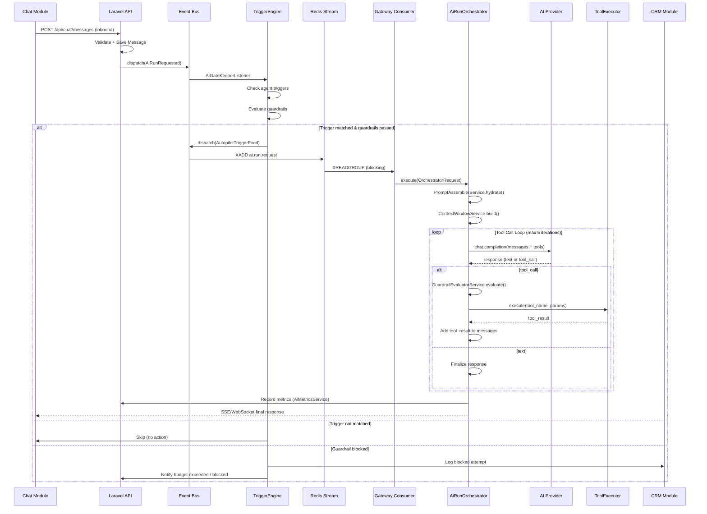

### 4.2 Fluxo de Upload e Processamento de Documento

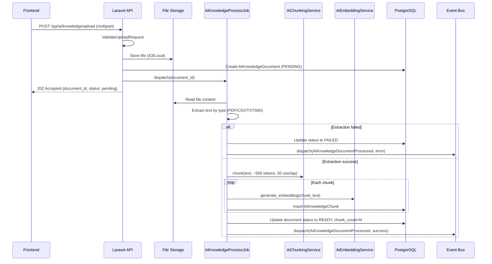

### 4.3 Fluxo de Trigger e Autopilot

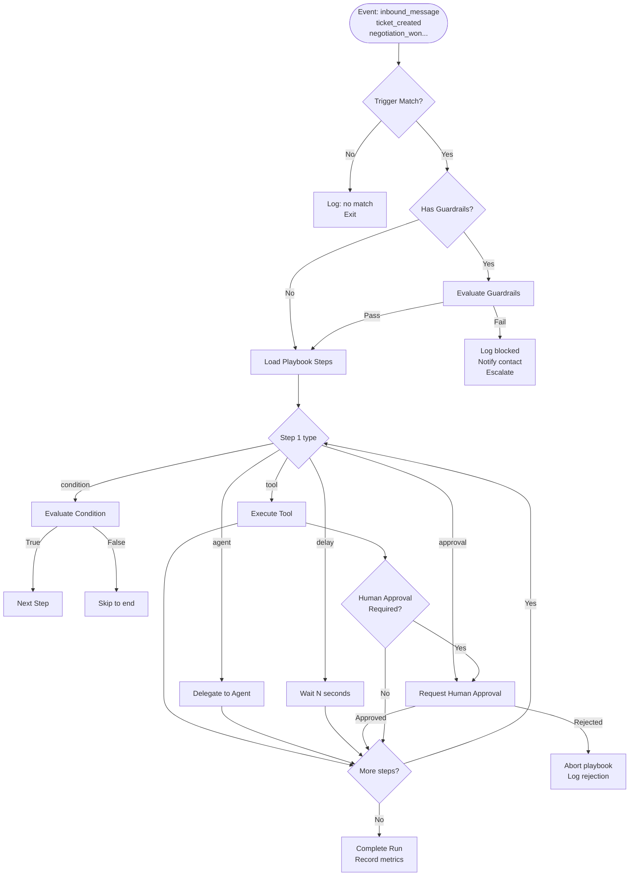

### 4.4 Fluxo de Delegacao entre Agentes

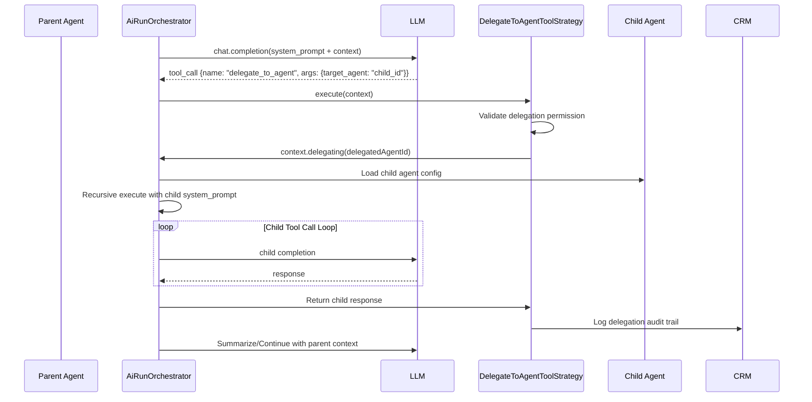

### 4.5 Fluxo de Prompt Guardian (Validacao de Seguranca)

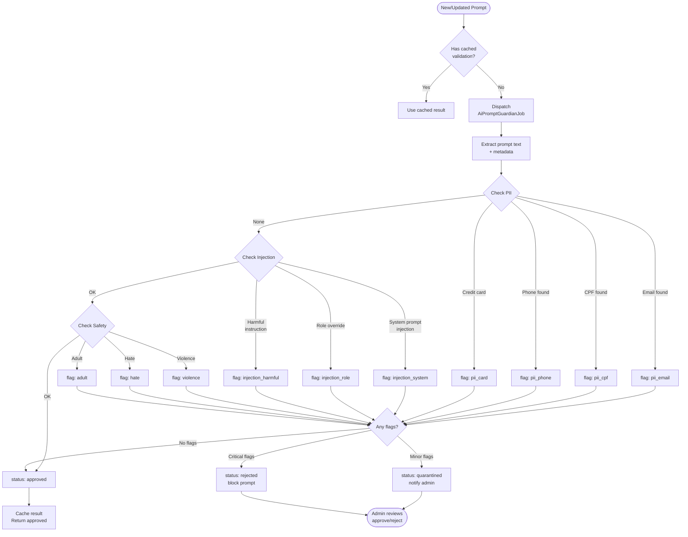

### 4.6 Fluxo de Budget e Limite de Custos

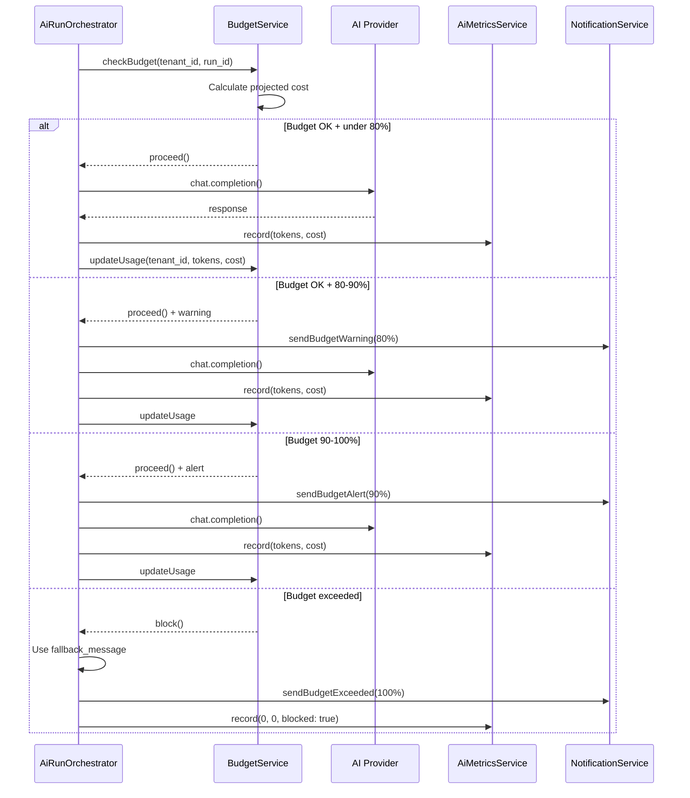

### 4.7 Fluxo de Follow-Up Pos-Venda

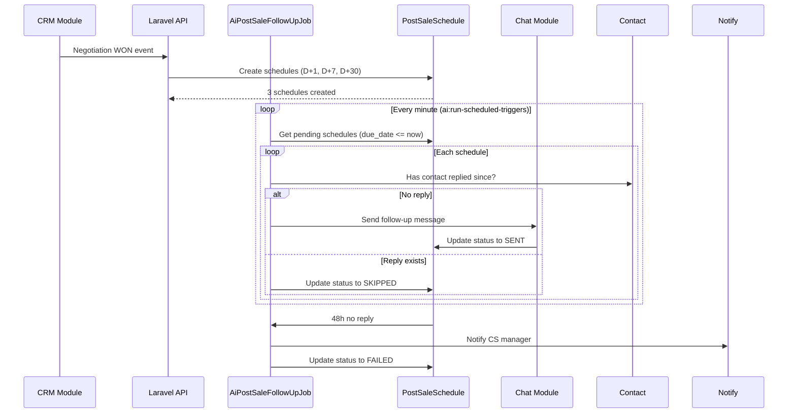

### 4.8 Arquitetura de Tool Call Loop (Gateway)

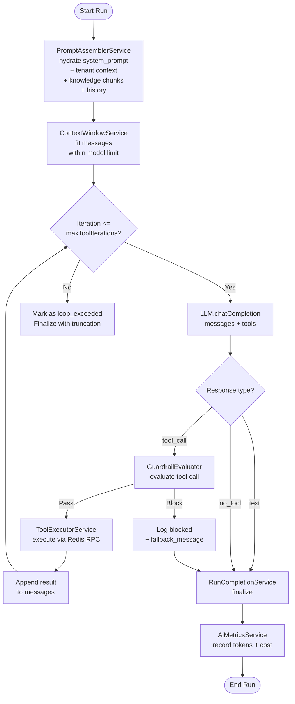

### 4.9 Fluxo de Circuit Breaker

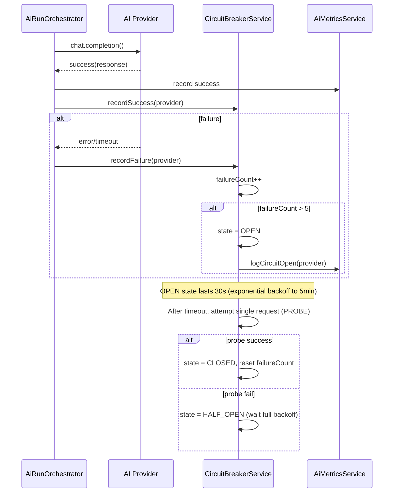

### 4.10 Fluxo de Purga de Logs de Uso

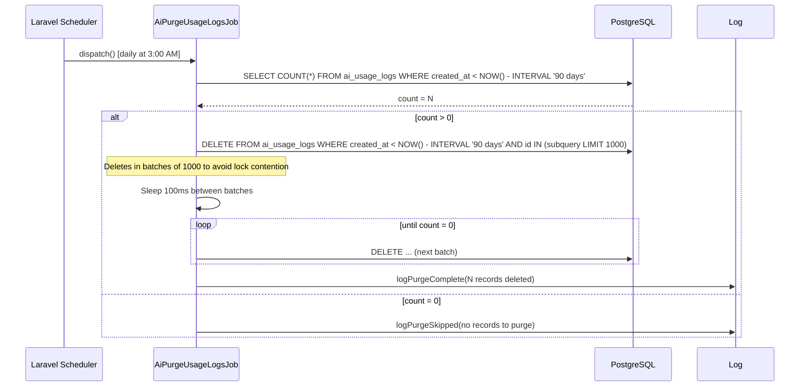

### 4.11 Fluxo de Versionamento de Playbook

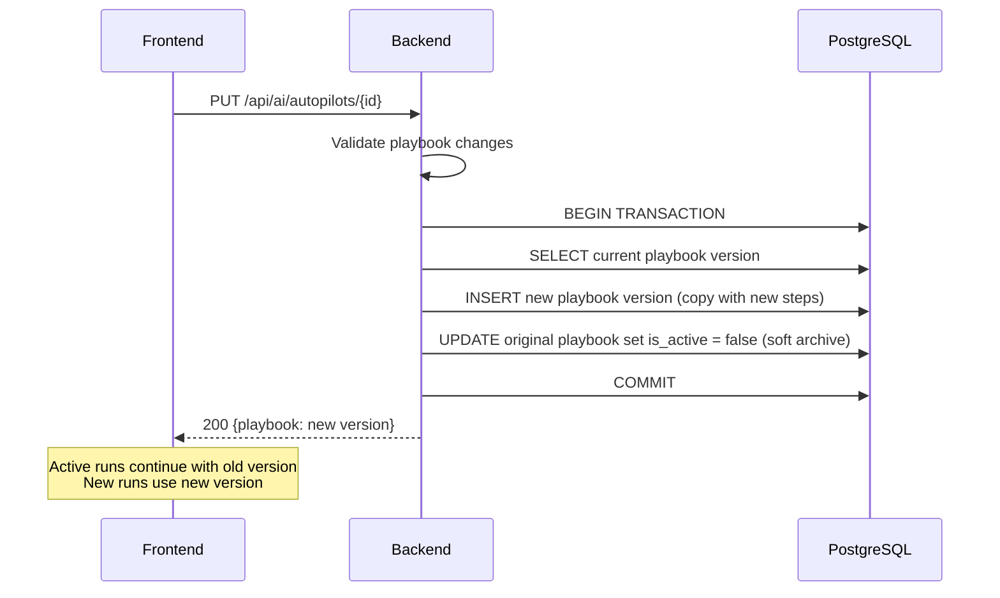

---

## 5. ENTIDADES E MODELOS

### 5.1 Diagrama de Entidades

```mermaid
erDiagram
    AiAgent ||--o{ AiAgentFile : "has many"
    AiAgent ||--o{ AiAgentTrigger : "has many"
    AiAgent ||--o{ AiAgentSkill : "has many"
    AiAgent ||--o{ AiAgentChannel : "has many"
    AiAgent ||--o{ AiAgentDelegation : "source"
    AiAgent ||--o{ AiAgentDelegation : "target"
    AiAgent ||--o| AiAgent : "parent (self)"
    AiAgent ||--o{ AiAutopilotRun : "has many runs"

    AiAutopilotPlaybook ||--o{ AiAutopilotRun : "generates"
    AiAutopilotPlaybook ||--o{ AiAutopilotTriggerLog : "logs"
    AiAutopilotPlaybook ||--o{ AiAutopilotGuardrail : "has guardrails"
    AiAutopilotPlaybook ||--o{ AiAutopilotTool : "uses tools"
    AiAutopilotRun ||--o| AiAutopilotApproval : "requires approval"
    AiAutopilotRun ||--o{ AiAutopilotTriggerLog : "logged as"

    AiKnowledgeDocument ||--o{ AiKnowledgeChunk : "chunks"
    AiKnowledgeDocument ||--o| AiKnowledgeDocument : "replaced_by"

    AiPromptMaster ||--o{ AiPromptPlan : "has plans"
    AiPromptPlan ||--o{ AiPromptSegment : "has segments"
    AiPromptSegment ||--o{ AiPromptTenant : "tenant customizations"
    AiPromptMaster ||--o| AiPromptMaster : "parent"
    AiPromptMaster ||--o| AiPromptQuarantine : "quarantined"

    AiPostSaleSchedule ||--o| CrmContact : "references"

    AiAgent {
        uuid id PK
        uuid tenant_id FK
        string name
        string type
        string model_id
        text system_prompt
        int max_tokens
        float temperature
        float top_p
        bool is_active
        uuid parent_agent_id FK
        string classifier_model
        int token_budget_input
        int token_budget_output
        text fallback_message
        jsonb metadata
        string voice_response_mode
        string stt_model
        string stt_language
        string tts_model
        string tts_voice
        float tts_speed
        timestamp created_at
        timestamp updated_at
        timestamp deleted_at
    }

    AiAutopilotPlaybook {
        uuid id PK
        uuid tenant_id FK
        string name
        text description
        AutopilotTriggerType trigger_type
        int version
        jsonb steps
        jsonb metadata
        bool is_active
        timestamp created_at
        timestamp updated_at
    }

    AiAutopilotRun {
        uuid id PK
        uuid tenant_id FK
        uuid agent_id FK
        uuid contact_id FK
        uuid playbook_id FK
        string trigger_type
        string status
        jsonb context
        timestamp started_at
        timestamp completed_at
        timestamp created_at
    }

    AiAutopilotApproval {
        uuid id PK
        uuid run_id FK
        string step_id
        uuid approved_by FK
        text notes
        timestamp approved_at
        timestamp created_at
    }

    AiAutopilotGuardrail {
        uuid id PK
        uuid playbook_id FK
        string name
        string type
        jsonb config
        bool is_active
    }

    AiAutopilotTool {
        uuid id PK
        uuid playbook_id FK
        string name
        text description
        jsonb parameters_schema
        jsonb return_schema
        bool is_active
    }

    AiKnowledgeDocument {
        uuid id PK
        uuid tenant_id FK
        string name
        string original_filename
        string file_path
        int file_size_bytes
        AiDocumentType file_type
        int version
        uuid replaced_by FK
        int chunk_count
        AiEmbeddingStatus embedding_status
        text error_message
        jsonb metadata
        bool is_active
        timestamp created_at
        timestamp updated_at
    }

    AiKnowledgeChunk {
        uuid id PK
        uuid document_id FK
        uuid tenant_id FK
        text content
        vector_embedding embedding
        int chunk_index
        int token_count
        bool is_active
        timestamp created_at
    }

    AiPromptMaster {
        uuid id PK
        uuid parent_id FK
        string name
        string role
        text content
        AiPromptValidationStatus status
        jsonb variables
        timestamp created_at
        timestamp updated_at
    }

    AiPromptPlan {
        uuid id PK
        uuid master_id FK
        uuid tenant_id FK
        string name
        text content
        jsonb parameters
        AiPromptValidationStatus status
    }

    AiPromptSegment {
        uuid id PK
        uuid plan_id FK
        string segment_key
        text content
        AiPromptValidationStatus status
    }

    AiPromptTenant {
        uuid id PK
        uuid segment_id FK
        uuid tenant_id FK
        text content
        AiPromptValidationStatus status
    }

    AiPromptQuarantine {
        uuid id PK
        uuid prompt_id FK
        string prompt_type
        text content
        jsonb detected_issues
        uuid quarantined_by FK
        string status
        uuid reviewed_by FK
        text review_notes
        timestamp reviewed_at
        timestamp created_at
    }

    AiModelPricing {
        uuid id PK
        AiProviderType provider
        string model
        float price_input_per_1m
        float price_output_per_1m
        string currency
        bool is_active
    }

    AiPostSaleSchedule {
        uuid id PK
        uuid tenant_id FK
        uuid contact_id FK
        AiPostSaleScheduleType type
        AiPostSaleStatus status
        timestamp scheduled_at
        timestamp sent_at
        timestamp replied_at
        jsonb metadata
        timestamp created_at
    }
```

### 5.2 Descricao Detalhada das Entidades

#### 5.2.1 AiAgent

O nucleo do modulo. Representa um agente de IA configurado por tenant.

**Campos:**

- `id` (UUID, PK): Identificador unico. Nao auto-increment.
- `tenant_id` (UUID, FK): Empresa proprietaria. BelongsToTenant.
- `name` (string): Nome amigavel do agente. Max 255 chars.
- `type` (string): Tipo do agente (custom ou um dos AiAgentRole).
- `model_id` (string): Modelo de IA (ex: gpt-4-turbo, claude-3-opus).
- `system_prompt` (text): Instrucoes de sistema. Pode ate 32k chars.
- `max_tokens` (int): Limite de tokens na resposta. Range 1-4096.
- `temperature` (float): Creatividade. Range 0.0-2.0. Default 0.7.
- `top_p` (float): Nucleus sampling. Range 0.0-1.0. Default 1.0.
- `is_active` (bool): Se false, agente ignora triggers e mensagens.
- `parent_agent_id` (UUID, FK, nullable): Hierarquia de delegacao.
- `classifier_model` (string, nullable): Modelo separado para intent classification.
- `token_budget_input` (int): Maximo de tokens de input por run.
- `token_budget_output` (int): Maximo de tokens de output por run.
- `fallback_message` (text): Mensagem quando budget excedido ou erro.
- `metadata` (JSON): Extensibilidade. Dados arbitrarios.
- Voice fields: `voice_response_mode`, `stt_model`, `stt_language`, `tts_model`, `tts_voice`, `tts_speed`.

**Relacionamentos:**

- `parentAgent`: BelongsTo(AiAgent::class). Agente pai na hierarquia.
- `files`: HasMany(AiAgentFile::class). Arquivos anexados ao agente.
- `triggers`: HasMany(AiAgentTrigger::class). Gatilhos configurados.
- `skills`: HasMany(AiAgentSkill::class). Habilidades do agente.
- `channels`: HasMany(AiAgentChannel::class). Canais ativos.
- `sourceDelegations`: HasMany(AiAgentDelegation::class, 'source_agent_id'). Delegacoes feitas.
- `targetDelegations`: HasMany(AiAgentDelegation::class, 'target_agent_id'). Delegacoes recebidas.

#### 5.2.2 AiAutopilotPlaybook

Define um playbook de automacao com steps sequenciais.

**Campos:**

- `id` (UUID, PK): Identificador unico.
- `tenant_id` (UUID, FK): Proprietario.
- `name` (string): Nome do playbook. Max 255.
- `description` (text): Descricao do proposito.
- `trigger_type` (AutopilotTriggerType): Quando dispara.
- `version` (int): Versionamento. Incrementa em cada alteracao.
- `steps` (JSON): Array de steps estruturados.
    ```json
    [
        { "id": "step1", "type": "tool", "tool": "classify_intent", "guardrails": [] },
        { "id": "step2", "type": "condition", "expression": "intent == 'support'" },
        { "id": "step2a", "type": "agent", "agent_id": "uuid", "guardrails": [] },
        { "id": "step3", "type": "approval", "timeout_seconds": 300 },
        { "id": "step4", "type": "tool", "tool": "send_message" }
    ]
    ```
- `metadata` (JSON): Configuracoes extras.
- `is_active` (bool): Se desativado, nao dispara.

#### 5.2.3 AiAutopilotRun

Registro de uma execucao individual.

**Campos:**

- `id` (UUID, PK): Identificador unico.
- `tenant_id` (UUID, FK): Proprietario.
- `agent_id` (UUID, FK): Agente responsavel.
- `contact_id` (UUID, FK): Contato relacionado.
- `playbook_id` (UUID, FK): Playbook executado.
- `trigger_type` (string): Tipo do gatilho que disparou.
- `status` (enum): pending, running, completed, failed, approved, timeout, loop_exceeded.
- `context` (JSON): Contexto acumulado durante a run.
- `started_at` (timestamp): Quando comecou.
- `completed_at` (timestamp, nullable): Quando terminou.

#### 5.2.4 AiKnowledgeDocument

Documento na base de conhecimento RAG.

**Campos:**

- `id` (UUID, PK): Identificador.
- `tenant_id` (UUID, FK): Proprietario.
- `name` (string): Nome do documento.
- `original_filename` (string): Nome original do arquivo.
- `file_path` (string): Path no storage (S3 ou local).
- `file_size_bytes` (int): Tamanho em bytes.
- `file_type` (AiDocumentType): TXT, CSV, MARKDOWN, JSON, PDF, URL.
- `version` (int): Numero da versao.
- `replaced_by` (UUID, FK, nullable): Substituido por nova versao.
- `chunk_count` (int): Numero de chunks gerados.
- `embedding_status` (AiEmbeddingStatus): PENDING, PROCESSING, READY, FAILED.
- `error_message` (text, nullable): Erro se falhou.
- `metadata` (JSON): Metadados extraidos (titulo, autor, datas).
- `is_active` (bool): Ativo ou desativado.

**Scopes:**

- `active()`: where is_active = true.
- `ready()`: where embedding_status = READY.
- `searchable()`: active() + ready().
- `forTenant(tenantId)`: filtro por tenant.

#### 5.2.5 AiKnowledgeChunk

Chunk individual de documento com embedding vetorial.

**Campos:**

- `id` (UUID, PK): Identificador.
- `document_id` (UUID, FK): Documento pai.
- `tenant_id` (UUID, FK): Proprietario.
- `content` (text): Texto do chunk.
- `embedding` (vector): Vetor de 1536 dimensoes (ada-002).
- `chunk_index` (int): Posicao no documento original.
- `token_count` (int): Numero de tokens do chunk.
- `is_active` (bool): Chunk ativo.

#### 5.2.6 Hierarquia de Prompts (Master -> Plan -> Segment -> Tenant)

**AiPromptMaster:**

- `parent_id` (UUID, FK, nullable): Master pai para heranca.
- `name` (string): Nome do template.
- `role` (string): Papel do prompt (ex: sales_qualifier, support_l1).
- `content` (text): Texto do template com variaveis {{variavel}}.
- `status` (AiPromptValidationStatus): pending, approved, rejected, quarantined.
- `variables` (JSON): Definicao de variaveis aceitas.

**AiPromptPlan:**

- `master_id` (UUID, FK): Master de origem.
- `tenant_id` (UUID, FK): Tenant proprietario.
- `name` (string): Nome do plano.
- `content` (text): Prompt parametrizado.
- `parameters` (JSON): Valores dos parametros.
- `status` (AiPromptValidationStatus).

**AiPromptSegment:**

- `plan_id` (UUID, FK): Plan de origem.
- `segment_key` (string): Chave do segmento (ex: vip, enterprise, free_trial).
- `content` (text): Prompt customizado para o segmento.
- `status` (AiPromptValidationStatus).

**AiPromptTenant:**

- `segment_id` (UUID, FK): Segment de origem.
- `tenant_id` (UUID, FK): Tenant.
- `content` (text): Prompt final do tenant.
- `status` (AiPromptValidationStatus).

#### 5.2.7 AiPromptQuarantine

Prompts suspeitos de injection ou PII.

**Campos:**

- `id` (UUID, PK).
- `prompt_id` (UUID): ID do prompt original.
- `prompt_type` (string): master | plan | segment | tenant.
- `content` (text): Texto do prompt em quarentena.
- `detected_issues` (JSON): Lista de problemas detectados.
    ```json
    {
        "pii_email": ["user@example.com"],
        "pii_cpf": ["123.456.789-00"],
        "injection_system": true,
        "violence": false
    }
    ```
- `quarantined_by` (UUID): Job ou usuario que quarentenou.
- `status` (string): quarantined, approved, rejected.
- `reviewed_by` (UUID, nullable): Usuario que revisou.
- `review_notes` (text, nullable): Justificativa da revisao.
- `reviewed_at` (timestamp, nullable).

#### 5.2.8 AiModelPricing

Tabela de precos por modelo e provider.

**Campos:**

- `id` (UUID, PK).
- `provider` (AiProviderType): OPENAI, ANTHROPIC, GEMINI.
- `model` (string): Identificador do modelo (ex: gpt-4-turbo, claude-3-opus-20240229).
- `price_input_per_1m` (float): Preco por 1M tokens de input.
- `price_output_per_1m` (float): Preco por 1M tokens de output.
- `currency` (string): BRL, USD. Default BRL.
- `is_active` (bool): Se ativo, usado para calculos.

#### 5.2.9 AiPostSaleSchedule

Agenda de follow-up pos-venda.

**Campos:**

- `id` (UUID, PK).
- `tenant_id` (UUID, FK).
- `contact_id` (UUID, FK): Contato a ser contactado.
- `type` (AiPostSaleScheduleType): thank_you, review_request, upsell, renewal_reminder, check_in.
- `status` (AiPostSaleStatus): scheduled, sent, delivered, replied, failed, skipped.
- `scheduled_at` (timestamp): Quando deve enviar.
- `sent_at` (timestamp, nullable): Quando foi enviado.
- `replied_at` (timestamp, nullable): Quando contato respondeu.
- `metadata` (JSON): Dados extras.

#### 5.2.10 Entidades de Suporte

**AiAutopilotApproval:** Aprovacao humana de steps kriticos.
**AiAutopilotGuardrail:** Regras de seguranca por playbook.
**AiAutopilotTool:** Definicao de ferramentas disponiveis.
**AiAutopilotTriggerLog:** Log de cada disparo de gatilho.
**AiAgentFile:** Arquivos anexados a agentes.
**AiAgentTrigger:** Configuracao de triggers por agente.
**AiAgentSkill:** Habilidades habilitadas por agente.
**AiAgentChannel:** Canais ativos por agente.
**AiAgentDelegation:** Trilha de auditoria de delegacoes.

---

## 6. ENDPOINTS

### 6.1 Visão Geral da API

| Prefixo               | Controlador              | Descricao                      |
| --------------------- | ------------------------ | ------------------------------ |
| /api/ai/agents        | AiAgentController        | CRUD de agentes                |
| /api/ai/autopilots    | AiAutopilotController    | CRUD de playbooks e runs       |
| /api/ai/knowledge     | AiKnowledgeController    | Upload, busca e gestao de docs |
| /api/ai/prompts       | AiPrompt\*Controller     | CRUD da hierarquia de prompts  |
| /api/ai/usage         | AiUsageController        | Metricas e custos              |
| /api/ai/budget        | AiBudgetController       | Gestao de budgets              |
| /api/ai/notifications | AiNotificationController | Notificacoes AI                |

### 6.2 Endpoints de Agentes

#### GET /api/ai/agents

Lista agentes do tenant.

**Request:** `?page=1&per_page=20&search=nome&is_active=1&role=sales_qualifier`

**Response 200:**

```json
{
    "success": true,
    "data": [
        {
            "id": "uuid",
            "name": "Sales Qualifier Brasil",
            "type": "sales_qualifier",
            "model_id": "gpt-4-turbo",
            "is_active": true,
            "parent_agent_id": null,
            "token_budget_input": 8000,
            "token_budget_output": 2000,
            "created_at": "2026-01-15T10:30:00Z"
        }
    ],
    "meta": { "current_page": 1, "per_page": 20, "total": 5 }
}
```

**Autorizacao:** `authorize('ai.agents.view')`

---

#### POST /api/ai/agents

Cria novo agente.

**Request:**

```json
{
    "name": "Support L1 Portugues",
    "type": "support_l1",
    "model_id": "gpt-4o-mini",
    "system_prompt": "Voce e um agente de suporte...",
    "max_tokens": 1500,
    "temperature": 0.7,
    "top_p": 1.0,
    "is_active": true,
    "parent_agent_id": null,
    "token_budget_input": 6000,
    "token_budget_output": 1500,
    "fallback_message": "Desculpe, nao consegui processar sua solicitacao.",
    "metadata": { "language": "pt-BR", "region": "brasil" }
}
```

**Response 201:** `AiAgentResource` com o agente criado.

**Autorizacao:** `authorize('ai.agents.manage')`

**Validacoes:**

- `name`: required, string, max:255
- `type`: required, in:sales_qualifier,support_l1,cs_retention,post_sales,appointment,general,custom
- `model_id`: required, string
- `system_prompt`: required, string, max:32768
- `max_tokens`: integer, min:1, max:4096
- `temperature`: numeric, min:0, max:2
- `top_p`: numeric, min:0, max:1
- `token_budget_input`: integer, min:100
- `token_budget_output`: integer, min:100
- `fallback_message`: required_if:token_budget_input,token_budget_output, string
- `parent_agent_id`: nullable, uuid, exists:ai_agents,id

---

#### GET /api/ai/agents/{id}

Detalhe de um agente.

**Response 200:** `AiAgentResource` com relationships incluidas (files, triggers, skills, channels).

**Autorizacao:** `authorize('ai.agents.view')`

**404:** Agente nao existe ou pertence a outro tenant.

---

#### PUT /api/ai/agents/{id}

Atualiza agente.

**Request:** Campos parciais do POST.

**Response 200:** `AiAgentResource` atualizado.

**Autorizacao:** `authorize('ai.agents.manage')`

---

#### DELETE /api/ai/agents/{id}

Soft delete de agente.

**Response 204:** Deletado com sucesso.

**Autorizacao:** `authorize('ai.agents.manage')`

---

#### POST /api/ai/agents/{id}/triggers

Asocia trigger a agente.

**Request:**

```json
{
    "trigger_type": "INBOUND_MESSAGE",
    "playbook_id": "uuid",
    "is_active": true,
    "priority": 10
}
```

---

#### POST /api/ai/agents/{id}/delegate

Delega manualmente para outro agente.

**Request:**

```json
{
    "target_agent_id": "uuid",
    "context": { "reason": "handoff", "priority": "high" }
}
```

### 6.3 Endpoints de Knowledge

#### GET /api/ai/knowledge

Lista documentos do tenant.

**Query params:** `?page=1&per_page=20&status=READY&search=nome&file_type=PDF`

**Response 200:** `AiKnowledgeDocumentResource` paginado.

**Autorizacao:** `authorize('ai.knowledge.view')`

---

#### POST /api/ai/knowledge/upload

Upload de documento para RAG.

**Request:** `multipart/form-data`

- `file`: required, file (max:50MB). Tipos: .pdf, .txt, .csv, .md, .json
- `name`: required, string, max:255
- `metadata`: optional, JSON

**Response 202:**

```json
{
    "success": true,
    "data": {
        "id": "uuid",
        "name": "Manual de Produto v2",
        "file_type": "PDF",
        "embedding_status": "PENDING",
        "chunk_count": 0
    },
    "message": "Documento enfileirado para processamento"
}
```

**Autorizacao:** `authorize('ai.knowledge.manage')`

**Processamento:** Job `AiKnowledgeProcessJob` e disparado. Status evolui PENDING -> PROCESSING -> READY | FAILED.

---

#### GET /api/ai/knowledge/{id}

Detalhe do documento com chunks.

**Query params:** `?include_chunks=1&page=1&per_page=50`

**Response 200:** `AiKnowledgeDocumentResource` com chunks.

---

#### DELETE /api/ai/knowledge/{id}

Soft delete de documento.

**Response 204.** Chunks asociados tambem sao deletados (cascade).

**Autorizacao:** `authorize('ai.knowledge.manage')`

---

#### POST /api/ai/knowledge/{id}/reindex

Reindexa documento existente.

**Request:** opcional `{ "chunk_size": 500, "overlap": 50 }`

**Response 202.** Nova versao e criada, chunks antigos marcados como inativos.

---

#### POST /api/ai/knowledge/bulk-delete

Deleta multiplos documentos.

**Request:**

```json
{
    "ids": ["uuid1", "uuid2", "uuid3"]
}
```

**Response 200:**

```json
{
    "success": true,
    "data": { "deleted": 3 }
}
```

---

#### POST /api/ai/knowledge/bulk-reindex

Reindexa multiplos documentos.

**Request:**

```json
{
    "ids": ["uuid1", "uuid2"]
}
```

---

#### GET /api/ai/knowledge/{id}/chunks

Lista chunks de um documento.

**Query params:** `?page=1&per_page=100`

---

#### POST /api/ai/knowledge/ingest-url

Ingesta conteudo de URL.

**Request:**

```json
{
    "url": "https://exemplo.com/pagina",
    "name": "Pagina de Precos"
}
```

**Response 202.** URL e processada, conteudo extraido como MARKDOWN, salvo como documento e enfileirado para chunking + embedding.

---

#### GET /api/ai/knowledge/stats

Estatisticas da knowledge base do tenant.

**Response 200:**

```json
{
    "success": true,
    "data": {
        "total_documents": 42,
        "active_documents": 38,
        "total_chunks": 1250,
        "ready_documents": 35,
        "pending_documents": 3,
        "failed_documents": 2,
        "total_size_bytes": 52428800,
        "average_chunk_size": 487
    }
}
```

---

#### GET /api/ai/knowledge/search

Busca semantica na knowledge base.

**Request:**

```json
{
    "query": "como fazer upgrade de plano?",
    "limit": 5,
    "min_score": 0.7,
    "document_ids": ["uuid1", "uuid2"] // opcional, filtra por docs
}
```

**Response 200:**

```json
{
    "success": true,
    "data": [
        {
            "chunk_id": "uuid",
            "document_id": "uuid",
            "document_name": "Manual de Planos",
            "content": "Para fazer upgrade...",
            "score": 0.92,
            "chunk_index": 3
        }
    ]
}
```

### 6.4 Endpoints de Autopilot

#### GET /api/ai/autopilots

Lista playbooks do tenant.

#### POST /api/ai/autopilots

Cria playbook.

**Request:**

```json
{
    "name": "Qualificacao de Lead",
    "description": "Playbook para qualificar leads automaticamente",
    "trigger_type": "INBOUND_MESSAGE",
    "is_active": true,
    "steps": [
        { "id": "classify", "type": "tool", "tool": "classify_intent" },
        { "id": "qualify", "type": "agent", "agent_id": "uuid" },
        { "id": "notify", "type": "tool", "tool": "send_message" }
    ],
    "guardrails": [{ "name": "block_negative_sentiment", "type": "sentiment", "config": { "threshold": -0.5 } }]
}
```

---

#### GET /api/ai/autopilots/{id}/runs

Lista runs de um playbook.

**Query params:** `?status=running&from=2026-03-01&to=2026-03-28`

---

#### POST /api/ai/autopilots/{id}/run

Dispara run manual.

**Request:**

```json
{
    "contact_id": "uuid",
    "agent_id": "uuid",
    "context": { "source": "manual", "priority": "high" }
}
```

**Response 202:**

```json
{
    "success": true,
    "data": {
        "run_id": "uuid",
        "status": "pending"
    }
}
```

---

#### GET /api/ai/autopilots/runs/{run_id}

Status de uma run.

**Response 200:**

```json
{
    "success": true,
    "data": {
        "id": "uuid",
        "status": "running",
        "agent_id": "uuid",
        "playbook_id": "uuid",
        "current_step": "qualify",
        "started_at": "2026-03-28T10:00:00Z",
        "context": {}
    }
}
```

---

#### POST /api/ai/autopilots/runs/{run_id}/approve

Aprova step pendente de aprovacao humana.

**Request:**

```json
{
    "step_id": "step3",
    "notes": "Aprovado, enviar proposta comercial"
}
```

---

#### POST /api/ai/autopilots/runs/{run_id}/reject

Rejeita step pendente.

**Request:**

```json
{
    "step_id": "step3",
    "reason": "Cliente nao quer ser contactado"
}
```

### 6.5 Endpoints de Prompts

#### GET /api/ai/prompts/master

Lista prompts master.

#### POST /api/ai/prompts/master

Cria prompt master.

**Autorizacao:** SuperAdmin (cross-tenant).

---

#### GET /api/ai/prompts/plans

Lista plans do tenant.

#### POST /api/ai/prompts/plans

Cria plan.

**Autorizacao:** `authorize('ai.prompts.manage')`

---

#### GET /api/ai/prompts/segments

Lista segments do tenant.

#### POST /api/ai/prompts/segments

Cria segment.

---

#### GET /api/ai/prompts/tenant

Lista prompts customizados do tenant.

#### PUT /api/ai/prompts/tenant/{id}

Atualiza customizacao do tenant.

---

#### GET /api/ai/prompts/quarantine

Lista prompts em quarentena.

#### POST /api/ai/prompts/quarantine/{id}/approve

Aprova prompt quarentenado.

#### POST /api/ai/prompts/quarantine/{id}/reject

Rejeita prompt quarentenado.

### 6.6 Endpoints de Usage

#### GET /api/ai/usage/summary

Resumo de uso do periodo atual.

**Response 200:**

```json
{
    "success": true,
    "data": {
        "period": { "from": "2026-03-01", "to": "2026-03-28" },
        "tokens_input": 1250000,
        "tokens_output": 450000,
        "cost_input": 1.875,
        "cost_output": 2.25,
        "total_cost": 4.125,
        "currency": "USD",
        "runs_count": 3500,
        "top_agent": { "id": "uuid", "name": "Sales Qualifier", "cost": 1.5 }
    }
}
```

**Autorizacao:** `authorize('ai.autopilots.manage')`

---

#### GET /api/ai/usage/daily

Breakdown diario.

**Query params:** `?days=30` (max 90)

**Response 200:**

```json
{
    "success": true,
    "data": [
        { "date": "2026-03-28", "tokens_input": 45000, "tokens_output": 16000, "cost": 0.15, "runs": 120 },
        { "date": "2026-03-27", "tokens_input": 52000, "tokens_output": 18000, "cost": 0.18, "runs": 145 }
    ]
}
```

---

#### GET /api/ai/usage/top-agents

Ranking de agentes por consumo.

**Query params:** `?limit=10` (max 50)

---

#### GET /api/ai/usage/monthly-history

Historico mensal.

**Query params:** `?months=6` (max 12)

---

#### GET /api/ai/usage/transcription-report

Relatorio de transcricoes (STT).

**Query params:** `?start_date=2026-03-01&end_date=2026-03-28`

**Response 200:**

```json
{
    "success": true,
    "data": {
        "total_minutes": 125.5,
        "total_cost": 0.62,
        "by_date": [{ "date": "2026-03-28", "minutes": 5.2, "cost": 0.026 }]
    }
}
```

### 6.7 Endpoints de Budget

#### GET /api/ai/budget

Mostra budget atual do tenant.

**Response 200:**

```json
{
    "success": true,
    "data": {
        "tenant_id": "uuid",
        "input_used": 800000,
        "input_limit": 1000000,
        "output_used": 300000,
        "output_limit": 500000,
        "total_used": 1100000,
        "total_limit": 1500000,
        "input_percent": 80,
        "output_percent": 60,
        "total_percent": 73.3,
        "reset_at": "2026-04-01T00:00:00Z",
        "alerts": { "input_threshold": 80, "output_threshold": 60 }
    }
}
```

---

#### PUT /api/ai/budget

Atualiza limits de budget.

**Request:**

```json
{
    "input_limit": 2000000,
    "output_limit": 1000000,
    "alert_thresholds": { "warning": 80, "critical": 90 }
}
```

### 6.8 Endpoints de Notifications

#### GET /api/ai/notifications

Lista notificacoes de AI do tenant.

**Query params:** `?read=false&reason=budget_exceeded&limit=20`

---

#### PUT /api/ai/notifications/{id}/read

Marca como lida.

---

#### PUT /api/ai/notifications/read-all

Marca todas como lidas.

---

#### DELETE /api/ai/notifications/{id}

Deleta notificacao.

### 6.9 Tabela de Autorizacoes

| Endpoint                       | Permissao             | Roles que tem  |
| ------------------------------ | --------------------- | -------------- |
| GET /api/ai/agents             | ai.agents.view        | admin, manager |
| POST/PUT/DELETE /api/ai/agents | ai.agents.manage      | admin          |
| GET /api/ai/knowledge          | ai.knowledge.view     | admin, manager |
| POST /api/ai/knowledge/upload  | ai.knowledge.manage   | admin          |
| DELETE /api/ai/knowledge       | ai.knowledge.manage   | admin          |
| GET /api/ai/autopilots         | ai.autopilots.view    | admin, manager |
| POST /api/ai/autopilots        | ai.autopilots.manage  | admin          |
| POST /api/ai/autopilots/\*/run | ai.autopilots.execute | admin, manager |
| GET /api/ai/usage/\*           | ai.autopilots.manage  | admin          |
| GET/PUT /api/ai/budget         | ai.autopilots.manage  | admin          |
| GET /api/ai/prompts/\*         | ai.prompts.view       | admin, manager |
| POST/PUT /api/ai/prompts/\*    | ai.prompts.manage     | admin          |
| GET /api/ai/notifications      | ai.notifications.view | admin, manager |

---

## 7. EVENTOS

### 7.1 Catalogo de Eventos

```mermaid
classDiagram
    class AiRunRequested {
        <<event>>
        +tenant_id: UUID
        +agent_id: UUID
        +contact_id: UUID
        +message_id: UUID
        +channel: string
        +metadata: array
    }

    class AutopilotTriggerFired {
        <<event>>
        +tenant_id: UUID
        +playbook_id: UUID
        +agent_id: UUID
        +trigger_type: AutopilotTriggerType
        +context: array
    }

    class AiRunCompleted {
        <<event>>
        +run_id: UUID
        +agent_id: UUID
        +tenant_id: UUID
        +status: string
        +duration_ms: int
        +tokens_used: int
        +cost: float
    }

    class AiRunDelegating {
        <<event>>
        +run_id: UUID
        +source_agent_id: UUID
        +target_agent_id: UUID
        +reason: string
    }

    class AiRunDelegated {
        <<event>>
        +run_id: UUID
        +source_agent_id: UUID
        +target_agent_id: UUID
        +result: array
    }

    class AiBudgetThresholdExceeded {
        <<event>>
        +tenant_id: UUID
        +budget_type: input|output|total
        +percent_used: int
        +threshold: int
        +used_tokens: int
        +limit_tokens: int
    }

    class AiKnowledgeDocumentProcessed {
        <<event>>
        +document_id: UUID
        +tenant_id: UUID
        +status: READY|FAILED
        +chunk_count: int
        +error_message: string|null
    }
```

### 7.2 Descricao Detalhada dos Eventos

#### 7.2.1 AiRunRequested

Disparado quando uma mensagem de entrada deve ser processada por AI.

**Payload:**

```php
[
    'tenant_id' => 'uuid',
    'agent_id' => 'uuid',
    'contact_id' => 'uuid',
    'message_id' => 'uuid',
    'channel' => 'whatsapp|webchat|instagram',
    'metadata' => [
        'conversation_id' => 'uuid',
        'trigger_type' => 'INBOUND_MESSAGE',
        'timestamp' => '2026-03-28T10:00:00Z',
    ]
]
```

**Origem:** Chat Module ao receber mensagem.
**Consumers:** AiGateKeeperListener, AiAutopilotTriggerFiredListener.

**Fluxo:**

1. Chat salva mensagem, dispatch AiRunRequested.
2. AiGateKeeperListener recebe, avalia triggers do tenant.
3. Se trigger match, dispatch AutopilotTriggerFired.
4. AiAutopilotRunDispatcherListener adiciona na Redis Stream.

---

#### 7.2.2 AutopilotTriggerFired

Disparado quando um gatilho do Autopilot e ativado.

**Payload:**

```php
[
    'tenant_id' => 'uuid',
    'playbook_id' => 'uuid',
    'agent_id' => 'uuid',
    'trigger_type' => 'NEGOTIATION_WON',
    'context' => [
        'contact_id' => 'uuid',
        'negotiation_id' => 'uuid',
        'stage' => 'closed_won',
        'value' => 15000.00,
    ]
]
```

**Origem:** AiGateKeeperListener.
**Consumer:** AiAutopilotRunDispatcherListener.

**Fluxo:**

1. Listener cria AiAutopilotRun com status=pending.
2. Listener adiciona mensagem na Redis Stream ai.run.request.
3. Gateway consome, orquestra, executa.

---

#### 7.2.3 AiRunCompleted

Disparado ao final de uma run (sucesso, falha, timeout).

**Payload:**

```php
[
    'run_id' => 'uuid',
    'agent_id' => 'uuid',
    'tenant_id' => 'uuid',
    'status' => 'completed|failed|timeout|loop_exceeded',
    'duration_ms' => 2340,
    'tokens_input' => 1200,
    'tokens_output' => 340,
    'cost_input' => 0.0018,
    'cost_output' => 0.0017,
    'total_cost' => 0.0035,
    'model' => 'gpt-4o-mini',
    'provider' => 'OPENAI',
    'steps_executed' => 3,
    'tool_calls' => 2,
]
```

**Origem:** AiRunOrchestratorService apos Tool Call Loop finalizar.
**Consumers:** Dashboard aggregation, Billing integration, Audit log.

---

#### 7.2.4 AiRunDelegating

Disparado quando um agente delega para outro.

**Payload:**

```php
[
    'run_id' => 'uuid',
    'source_agent_id' => 'uuid',
    'source_agent_name' => 'Sales Qualifier',
    'target_agent_id' => 'uuid',
    'target_agent_name' => 'CS Retention',
    'reason' => 'intent=retention',
    'context_snapshot' => [...],
]
```

**Origem:** DelegateToAgentToolStrategy.

---

#### 7.2.5 AiBudgetThresholdExceeded

Disparado quando o tenant atinge thresholds de budget.

**Payload:**

```php
[
    'tenant_id' => 'uuid',
    'budget_type' => 'input|output|total',
    'percent_used' => 80|90|100,
    'threshold' => 80|90|100,
    'used_tokens' => 800000,
    'limit_tokens' => 1000000,
    'period_start' => '2026-03-01',
    'period_end' => '2026-04-01',
    'action_taken' => 'warning|alert|block',
]
```

**Origem:** BudgetService apos cada run.
**Consumers:** AiNotificationController, Email/Webhook notification.

**Acoes por threshold:**

- 80%: WARNING — email ao owner, continuar execucao.
- 90%: ALERT — email + in-app notification, sugerir acao.
- 100%: BLOCK — bloquear novas runs, usar fallback_message.

---

#### 7.2.6 AiKnowledgeDocumentProcessed

Disparado quando o processamento de documento termina.

**Payload:**

```php
[
    'document_id' => 'uuid',
    'tenant_id' => 'uuid',
    'status' => 'READY|FAILED',
    'chunk_count' => 25,
    'processing_time_ms' => 4500,
    'file_type' => 'PDF',
    'file_size_bytes' => 1024000,
    'error_message' => null,
    'version' => 1,
]
```

**Origem:** Final do metodo handle() em AiKnowledgeProcessJob.
**Consumers:** Frontend polling/notification, Audit log.

---

### 7.3 Listeners Registrados

| Event                        | Listener                         | Acao                                           |
| ---------------------------- | -------------------------------- | ---------------------------------------------- |
| AiRunRequested               | AiGateKeeperListener             | Avalia triggers, dispara AutopilotTriggerFired |
| AutopilotTriggerFired        | AiAutopilotRunDispatcherListener | Cria run, adiciona na Redis Stream             |
| AiRunCompleted               | AiRunMetricsListener             | Atualiza agregados de uso, notifica dashboard  |
| AiRunCompleted               | AiRunAuditListener               | Registra em log de auditoria                   |
| AiBudgetThresholdExceeded    | AiBudgetNotificationListener     | Cria notificacao in-app, envia email/webhook   |
| AiKnowledgeDocumentProcessed | AiKnowledgeNotificationListener  | Notifica frontend que documento esta pronto    |
| AiRunDelegating              | AiDelegationAuditListener        | Registra em AiAgentDelegation                  |

### 7.4 Jobs Agendados (Scheduled Commands)

| Comando                     | Frequencia | Acao                                                         |
| --------------------------- | ---------- | ------------------------------------------------------------ |
| ai:purge-usage-logs         | Daily 3am  | Deleta logs de uso com mais de 90 dias                       |
| ai:run-scheduled-triggers   | Every 1min | Dispara gatilhos SCHEDULED, TICKET_IDLE, NO_RESPONSE_TIMEOUT |
| ai:generate-daily-summaries | Daily 2am  | Agrega metricas diarias para dashboards                      |
| ai:consume-run-responses    | Every 1min | Processa responses pendentes do AI provider                  |
| ai:consume-tool-requests    | Every 1min | Processa requisicoes de ferramentas pendentes                |
| ai:detect-stale-runs        | Every 5min | Marca runs sem update >5min como TIMEOUT                     |

---

## 8. SEGURANCA

### 8.1 Isolamento de Tenants

**Critico:** Todo acesso a entidades AI passa pelo filtro de tenant via BelongsToTenant trait. Queries automaticamente incluem `WHERE tenant_id = :current_tenant_id`.

```php
// Em Todo Model do modulo AI:
use Domain\Shared\Concerns\BelongsToTenant;

class AiAgent extends Model
{
    use BelongsToTenant; // Scope global automatico
}
```

**Verificacao:** Nenhuma excecao a este regra. Controllers chamam `$this->authorize()` que delega para Policy, que por sua vez verifica permissao + tenant.

### 8.2 Autorizacao e RBAC

**Politicas por recurso:**

| Modelo              | Policy               | Permissoes                                                      |
| ------------------- | -------------------- | --------------------------------------------------------------- |
| AiAgent             | AiAgentPolicy        | ai.agents.view, ai.agents.manage                                |
| AiAutopilotPlaybook | AiAutopilotPolicy    | ai.autopilots.view, ai.autopilots.manage, ai.autopilots.execute |
| AiKnowledgeDocument | AiKnowledgePolicy    | ai.knowledge.view, ai.knowledge.manage                          |
| AiPrompt\*          | AiPromptPolicy       | ai.prompts.view, ai.prompts.manage                              |
| AiBudget            | AiBudgetPolicy       | ai.autopilots.manage                                            |
| AiNotification      | AiNotificationPolicy | ai.notifications.view                                           |

**Implementacao:**

```php
// Todo controller action:
public function show(Request $request, string $id): JsonResponse
{
    $this->authorize('ai.agents.view'); // Policy + BelongsToTenant scope
    // ...
}
```

### 8.3 Seguranca de Prompts

**Prompt Guardian Pipeline:**

1. Antes de usar qualquer prompt, calcular SHA-256 hash.
2. Verificar cache de validacao. Se valido, usar.
3. Se nao cacheado, dispatch AiPromptGuardianJob.
4. Job analisa via LLM: injection patterns, PII, violencia.
5. Se critico: reject + notificar admin.
6. Se moderado: quarantine + notificar admin para revisao.
7. Se limpo: approved + cachear hash.

**Padroes de Injection Detectados:**

- Tentativas de override de system role
- Tentativas de ignore de instrucoes anteriores
- Pedidos de revelacao de configuracao interna
- Tentativas de code execution
- Bypass de guardrails via encoding

**PII Detectado:**

- Emails (regex + entropy)
- CPF (formato brasileiro validado)
- Telefones (mascaras BR)
- Cartoes de credito (Luhn algorithm)
- Enderecos IP
- RG, CNPJ

### 8.4 Rate Limiting

| Endpoint                       | Limite      | Janela  | Acao em Excesso   |
| ------------------------------ | ----------- | ------- | ----------------- |
| POST /api/ai/agents/\*/chat    | 60 req/min  | sliding | 429 + Retry-After |
| GET /api/ai/knowledge/search   | 30 req/min  | sliding | 429 + Retry-After |
| POST /api/ai/knowledge/upload  | 10 req/min  | sliding | 429 + Retry-After |
| GET /api/ai/usage/\*           | 120 req/min | sliding | 429               |
| POST /api/ai/autopilots/\*/run | 30 req/min  | sliding | 429               |

**Implementacao:** Laravel throttle middleware com Redis como backend.

### 8.5 Protecao de Dados em Logs

**Dados que NAO podem ser logados:**

- Tokens de autenticacao
- Senhas e API keys
- Numeros de cartao de credito
- CPF e RG
- Tokens de session

**Sanitizacao obrigatoria:**

```php
// AiMetricsService:
public function sanitizeForLogging(array $data): array
{
    return collect($data)->except([
        'authorization', 'x-api-key', 'password',
        'credit_card', 'cpf', 'token',
    ])->map(function ($value, $key) {
        if (str_contains($key, 'token') || str_contains($key, 'key')) {
            return '***REDACTED***';
        }
        return $value;
    })->toArray();
}
```

### 8.6 Validação de Input

**FormRequest em todos os endpoints:**

- AiAgentStoreRequest: valida campos obrigatorios, ranges, formatos
- AiKnowledgeUploadRequest: valida tipo e tamanho de arquivo
- SearchKnowledgeRequest: valida query, limit, min_score
- AiNotificationMarkAsReadRequest: valida ids

**DTOs readonly:**

```php
readonly final class AiAgentDTO
{
    public function __construct(
        public readonly ?string $id,
        public readonly string $name,
        public readonly string $modelId,
        public readonly string $systemPrompt,
        public readonly int $maxTokens = 1500,
        // ...
    ) {}

    public static function fromRequest(AiAgentStoreRequest $request): self
    {
        return new self(
            id: $request->validated('id'),
            name: $request->validated('name'),
            // ...
        );
    }

    public static function fromArray(array $data): self
    {
        return new self(...);
    }
}
```

### 8.7 Circuit Breaker e Idempotencia

**Circuit Breaker no Gateway:**

```typescript
// AiProviderFactory + CircuitBreakerService
const breaker = new CircuitBreaker({
    failureThreshold: 5, // 5 falhas = open
    resetTimeout: 30000, // 30s para retry
    maxTimeout: 300000, // 5min max backoff
});
```

**Idempotencia em Redis:**

```php
// Em AiRunRequestConsumer:
$key = "ai:run:{$runId}:processed";
$acquired = Redis::setnx($key, 1);

if (!$acquired) {
    Log::warning("Duplicate run request", ['run_id' => $runId]);
    return; // Skip, ja processado
}

Redis::expire($key, 86400); // 24h TTL
```

### 8.8 Auditoria

**Eventos auditados:**

- Criacao/alteracao/exclusao de agentes
- Execucao de runs (sem conteudo, apenas metadados)
- Aprovacao/rejeicao de prompts em quarentena
- Alteracao de budgets
- Upload/deletion de documentos
- Delegacoes entre agentes

**Campos de auditoria:**

- who: usuario ou job que executou
- what: acao performed
- when: timestamp
- where: IP, user agent
- which: UUID da entidade afetada

---

## 9. DTOs E RESOURCES

### 9.1 DTOs (Data Transfer Objects)

DTOs sao `readonly final class` em PHP 8.1+ com工厂method `fromRequest()` e `fromArray()`. Nunca expostos diretamente — sempre atraves de Resources na resposta.

#### 9.1.1 AiAgentDTO

```php
readonly final class AiAgentDTO
{
    public function __construct(
        public ?string $id,
        public string $name,
        public string $type,
        public string $modelId,
        public string $systemPrompt,
        public int $maxTokens = 1500,
        public float $temperature = 0.7,
        public float $topP = 1.0,
        public bool $isActive = true,
        public ?string $parentAgentId = null,
        public ?string $classifierModel = null,
        public int $tokenBudgetInput = 8000,
        public int $tokenBudgetOutput = 2000,
        public ?string $fallbackMessage = null,
        public ?array $metadata = null,
        public ?array $voiceConfig = null,
        public ?string $tenantId = null,
        public ?string $createdAt = null,
        public ?string $updatedAt = null,
    ) {}

    /**
     * @param array<string, mixed> $data
     */
    public static function fromArray(array $data): self
    {
        return new self(
            id: $data['id'] ?? null,
            name: $data['name'],
            type: $data['type'],
            modelId: $data['model_id'],
            systemPrompt: $data['system_prompt'],
            maxTokens: (int) ($data['max_tokens'] ?? 1500),
            temperature: (float) ($data['temperature'] ?? 0.7),
            topP: (float) ($data['top_p'] ?? 1.0),
            isActive: (bool) ($data['is_active'] ?? true),
            parentAgentId: $data['parent_agent_id'] ?? null,
            classifierModel: $data['classifier_model'] ?? null,
            tokenBudgetInput: (int) ($data['token_budget_input'] ?? 8000),
            tokenBudgetOutput: (int) ($data['token_budget_output'] ?? 2000),
            fallbackMessage: $data['fallback_message'] ?? null,
            metadata: $data['metadata'] ?? null,
            voiceConfig: isset($data['voice_config']) ? [
                'response_mode' => $data['voice_config']['response_mode'] ?? null,
                'stt_model' => $data['voice_config']['stt_model'] ?? null,
                'stt_language' => $data['voice_config']['stt_language'] ?? null,
                'tts_model' => $data['voice_config']['tts_model'] ?? null,
                'tts_voice' => $data['voice_config']['tts_voice'] ?? null,
                'tts_speed' => $data['voice_config']['tts_speed'] ?? null,
            ] : null,
            tenantId: $data['tenant_id'] ?? null,
            createdAt: $data['created_at'] ?? null,
            updatedAt: $data['updated_at'] ?? null,
        );
    }

    /**
     * @return array<string, mixed>
     */
    public function toArray(): array
    {
        return [
            'id' => $this->id,
            'name' => $this->name,
            'type' => $this->type,
            'model_id' => $this->modelId,
            'system_prompt' => $this->systemPrompt,
            'max_tokens' => $this->maxTokens,
            'temperature' => $this->temperature,
            'top_p' => $this->topP,
            'is_active' => $this->isActive,
            'parent_agent_id' => $this->parentAgentId,
            'classifier_model' => $this->classifierModel,
            'token_budget_input' => $this->tokenBudgetInput,
            'token_budget_output' => $this->tokenBudgetOutput,
            'fallback_message' => $this->fallbackMessage,
            'metadata' => $this->metadata,
            'voice_config' => $this->voiceConfig,
            'tenant_id' => $this->tenantId,
            'created_at' => $this->createdAt,
            'updated_at' => $this->updatedAt,
        ];
    }
}
```

#### 9.1.2 AiKnowledgeDocumentDTO

```php
readonly final class AiKnowledgeDocumentDTO
{
    public function __construct(
        public ?string $id,
        public string $name,
        public string $originalFilename,
        public string $filePath,
        public int $fileSizeBytes,
        public string $fileType,
        public int $version = 1,
        public ?string $replacedBy = null,
        public int $chunkCount = 0,
        public string $embeddingStatus = 'PENDING',
        public ?string $errorMessage = null,
        public ?array $metadata = null,
        public bool $isActive = true,
        public ?string $tenantId = null,
        public ?string $createdAt = null,
        public ?string $updatedAt = null,
    ) {}

    public static function fromArray(array $data): self
    {
        return new self(
            id: $data['id'] ?? null,
            name: $data['name'],
            originalFilename: $data['original_filename'],
            filePath: $data['file_path'],
            fileSizeBytes: (int) $data['file_size_bytes'],
            fileType: $data['file_type'],
            version: (int) ($data['version'] ?? 1),
            replacedBy: $data['replaced_by'] ?? null,
            chunkCount: (int) ($data['chunk_count'] ?? 0),
            embeddingStatus: $data['embedding_status'] ?? 'PENDING',
            errorMessage: $data['error_message'] ?? null,
            metadata: $data['metadata'] ?? null,
            isActive: (bool) ($data['is_active'] ?? true),
            tenantId: $data['tenant_id'] ?? null,
            createdAt: $data['created_at'] ?? null,
            updatedAt: $data['updated_at'] ?? null,
        );
    }
}
```

#### 9.1.3 AiUsageSummaryDTO

```php
readonly final class AiUsageSummaryDTO
{
    public function __construct(
        public string $periodStart,
        public string $periodEnd,
        public int $tokensInput,
        public int $tokensOutput,
        public float $costInput,
        public float $costOutput,
        public float $totalCost,
        public string $currency = 'USD',
        public int $runsCount = 0,
        public ?array $topAgent = null,
        public ?array $costTrend = null,
    ) {}

    public static function fromArray(array $data): self
    {
        return new self(
            periodStart: $data['period_start'],
            periodEnd: $data['period_end'],
            tokensInput: (int) $data['tokens_input'],
            tokensOutput: (int) $data['tokens_output'],
            costInput: (float) $data['cost_input'],
            costOutput: (float) $data['cost_output'],
            totalCost: (float) $data['total_cost'],
            currency: $data['currency'] ?? 'USD',
            runsCount: (int) ($data['runs_count'] ?? 0),
            topAgent: $data['top_agent'] ?? null,
            costTrend: $data['cost_trend'] ?? null,
        );
    }
}
```

#### 9.1.4 AiBudgetDTO

```php
readonly final class AiBudgetDTO
{
    public function __construct(
        public string $tenantId,
        public int $inputUsed,
        public int $inputLimit,
        public int $outputUsed,
        public int $outputLimit,
        public int $totalUsed,
        public int $totalLimit,
        public float $inputPercent,
        public float $outputPercent,
        public float $totalPercent,
        public string $resetAt,
        public ?array $alertThresholds = null,
    ) {}

    public static function fromArray(array $data): self
    {
        $inputUsed = (int) $data['input_used'];
        $inputLimit = (int) $data['input_limit'];
        $outputUsed = (int) $data['output_used'];
        $outputLimit = (int) $data['output_limit'];
        $totalUsed = $inputUsed + $outputUsed;
        $totalLimit = $inputLimit + $outputLimit;

        return new self(
            tenantId: $data['tenant_id'],
            inputUsed: $inputUsed,
            inputLimit: $inputLimit,
            outputUsed: $outputUsed,
            outputLimit: $outputLimit,
            totalUsed: $totalUsed,
            totalLimit: $totalLimit,
            inputPercent: $inputLimit > 0 ? ($inputUsed / $inputLimit) * 100 : 0,
            outputPercent: $outputLimit > 0 ? ($outputUsed / $outputLimit) * 100 : 0,
            totalPercent: $totalLimit > 0 ? ($totalUsed / $totalLimit) * 100 : 0,
            resetAt: $data['reset_at'],
            alertThresholds: $data['alert_thresholds'] ?? ['warning' => 80, 'critical' => 90],
        );
    }
}
```

#### 9.1.5 AiAutopilotRunDTO

```php
readonly final class AiAutopilotRunDTO
{
    public function __construct(
        public ?string $id,
        public string $agentId,
        public string $playbookId,
        public string $contactId,
        public string $triggerType,
        public string $status,
        public ?array $context = null,
        public ?string $startedAt = null,
        public ?string $completedAt = null,
        public ?string $currentStep = null,
        public ?int $durationMs = null,
        public ?array $metrics = null,
    ) {}

    public static function fromArray(array $data): self
    {
        return new self(
            id: $data['id'] ?? null,
            agentId: $data['agent_id'],
            playbookId: $data['playbook_id'],
            contactId: $data['contact_id'],
            triggerType: $data['trigger_type'],
            status: $data['status'],
            context: $data['context'] ?? null,
            startedAt: $data['started_at'] ?? null,
            completedAt: $data['completed_at'] ?? null,
            currentStep: $data['current_step'] ?? null,
            durationMs: isset($data['started_at'], $data['completed_at'])
                ? (new \DateTime($data['completed_at']))->diffInMilliseconds(new \DateTime($data['started_at']))
                : null,
            metrics: $data['metrics'] ?? null,
        );
    }
}
```

### 9.2 API Resources (Laravel API Resources)

Resources transformam DTOs/Models em JSON para resposta da API. Cada Resource extende JsonResource.

#### 9.2.1 AiAgentResource

```php
final class AiAgentResource extends JsonResource
{
    /**
     * @return array<string, mixed>
     */
    public function toArray(Request $request): array
    {
        return [
            'id' => $this->id,
            'name' => $this->name,
            'type' => $this->type,
            'model_id' => $this->model_id,
            'system_prompt' => $this->when(
                $request->user()->can('ai.agents.manage'),
                $this->system_prompt
            ),
            'max_tokens' => $this->max_tokens,
            'temperature' => $this->temperature,
            'top_p' => $this->top_p,
            'is_active' => $this->is_active,
            'parent_agent_id' => $this->parent_agent_id,
            'classifier_model' => $this->classifier_model,
            'token_budget_input' => $this->token_budget_input,
            'token_budget_output' => $this->token_budget_output,
            'fallback_message' => $this->when(
                $request->user()->can('ai.agents.manage'),
                $this->fallback_message
            ),
            'metadata' => $this->metadata,
            'voice_config' => $this->when(
                $this->voice_response_mode !== null,
                [
                    'response_mode' => $this->voice_response_mode,
                    'stt_model' => $this->stt_model,
                    'stt_language' => $this->stt_language,
                    'tts_model' => $this->tts_model,
                    'tts_voice' => $this->tts_voice,
                    'tts_speed' => $this->tts_speed,
                ]
            ),
            'relationships' => $this->when(
                $request->query('include') === 'relationships',
                fn() => [
                    'files' => AiAgentFileResource::collection($this->whenLoaded('files')),
                    'triggers' => AiAgentTriggerResource::collection($this->whenLoaded('triggers')),
                    'skills' => AiAgentSkillResource::collection($this->whenLoaded('skills')),
                    'channels' => AiAgentChannelResource::collection($this->whenLoaded('channels')),
                    'parent_agent' => new AiAgentResource($this->whenLoaded('parentAgent')),
                    'child_agents' => AiAgentResource::collection($this->whenLoaded('childAgents')),
                ]
            ),
            'created_at' => $this->created_at?->toIso8601String(),
            'updated_at' => $this->updated_at?->toIso8601String(),
        ];
    }
}
```

**Nota:** `system_prompt` e `fallback_message` sao ocultos para usuarios com apenas permissao `view` — expostos apenas para `manage`.

#### 9.2.2 AiKnowledgeDocumentResource

```php
final class AiKnowledgeDocumentResource extends JsonResource
{
    /**
     * @return array<string, mixed>
     */
    public function toArray(Request $request): array
    {
        return [
            'id' => $this->id,
            'name' => $this->name,
            'original_filename' => $this->original_filename,
            'file_size_bytes' => $this->file_size_bytes,
            'file_size_formatted' => $this->formatted_file_size,
            'file_type' => $this->file_type->value,
            'version' => $this->version,
            'replaced_by' => $this->replaced_by,
            'chunk_count' => $this->chunk_count,
            'embedding_status' => $this->embedding_status->value,
            'error_message' => $this->when(
                $this->embedding_status === AiEmbeddingStatus::FAILED,
                $this->error_message
            ),
            'metadata' => $this->metadata,
            'is_active' => $this->is_active,
            'is_ready' => $this->isReady(),
            'is_processing' => $this->isProcessing(),
            'is_failed' => $this->isFailed(),
            'chunks' => $this->when(
                $request->query('include_chunks') === '1',
                fn() => AiKnowledgeChunkResource::collection($this->whenLoaded('chunks'))
            ),
            'created_at' => $this->created_at?->toIso8601String(),
            'updated_at' => $this->updated_at?->toIso8601String(),
        ];
    }
}
```

#### 9.2.3 UsageSummaryResource

```php
final class UsageSummaryResource extends JsonResource
{
    /**
     * @return array<string, mixed>
     */
    public function toArray(Request $request): array
    {
        /** @var AiUsageSummaryDTO $this->resource */
        return [
            'period' => [
                'from' => $this->resource->periodStart,
                'to' => $this->resource->periodEnd,
            ],
            'tokens_input' => $this->resource->tokensInput,
            'tokens_output' => $this->resource->tokensOutput,
            'tokens_total' => $this->resource->tokensInput + $this->resource->tokensOutput,
            'cost_input' => round($this->resource->costInput, 6),
            'cost_output' => round($this->resource->costOutput, 6),
            'total_cost' => round($this->resource->totalCost, 6),
            'currency' => $this->resource->currency,
            'runs_count' => $this->resource->runsCount,
            'avg_cost_per_run' => $this->resource->runsCount > 0
                ? round($this->resource->totalCost / $this->resource->runsCount, 6)
                : 0,
            'top_agent' => $this->resource->topAgent,
        ];
    }
}
```

#### 9.2.4 UsageDailyResource

```php
final class UsageDailyResource extends JsonResource
{
    /**
     * @return array<string, mixed>
     */
    public function toArray(Request $request): array
    {
        return [
            'date' => $this['date'],
            'tokens_input' => $this['tokens_input'],
            'tokens_output' => $this['tokens_output'],
            'cost' => round($this['cost'], 6),
            'runs' => $this['runs_count'],
        ];
    }
}
```

#### 9.2.5 UsageAgentResource

```php
final class UsageAgentResource extends JsonResource
{
    /**
     * @return array<string, mixed>
     */
    public function toArray(Request $request): array
    {
        return [
            'agent_id' => $this['agent_id'],
            'agent_name' => $this['agent_name'],
            'tokens_input' => $this['tokens_input'],
            'tokens_output' => $this['tokens_output'],
            'total_cost' => round($this['total_cost'], 6),
            'runs_count' => $this['runs_count'],
            'rank' => $this['rank'],
        ];
    }
}
```

### 9.3 DTOs do Gateway (TypeScript)

#### 9.3.1 AiChatRequestDTO

```typescript
interface AiChatRequestDTO {
    agentId: string;
    tenantId: string;
    contactId: string;
    messageId: string;
    channel: 'whatsapp' | 'webchat' | 'instagram';
    message: string;
    context?: {
        conversationId?: string;
        metadata?: Record<string, unknown>;
    };
    stream?: boolean;
    maxTokens?: number;
    temperature?: number;
    runId?: string;
    correlationId?: string;
}
```

#### 9.3.2 AiChatResponseDTO

```typescript
interface AiChatResponseDTO {
    runId: string;
    status: 'completed' | 'streaming' | 'error' | 'blocked';
    message?: string;
    toolCalls?: ToolCallResult[];
    metrics?: {
        tokensInput: number;
        tokensOutput: number;
        costInput: number;
        costOutput: number;
        totalCost: number;
        durationMs: number;
        model: string;
        provider: string;
    };
    streamToken?: string; // for streaming responses
    blockedReason?: string;
    fallbackMessage?: string;
}
```

#### 9.3.3 ToolCallResult

```typescript
interface ToolCallResult {
    toolName: string;
    toolCallId: string;
    arguments: Record<string, unknown>;
    result: unknown;
    status: 'success' | 'error' | 'blocked';
    errorMessage?: string;
    executionTimeMs: number;
}
```

---

## 10. CRITERIOS DE ACEITACAO

### 10.1 Criterios Funcionais

#### CA-AI-01: Configuracao de Agente

| Criterio | Descricao                                                                    | Validacao                                                    |
| -------- | ---------------------------------------------------------------------------- | ------------------------------------------------------------ |
| CA-01.1  | Usuario pode criar agente com nome, tipo, model, system_prompt, parametros   | POST /api/ai/agents retorna 201 + recurso criado             |
| CA-01.2  | Sistema valida ranges de temperature (0-2), top_p (0-1), max_tokens (1-4096) | Request com valor fora do range retorna 422                  |
| CA-01.3  | Agente inativo (is_active=false) nao responde a triggers                     | Trigger disparado para agente inativo = ignorado             |
| CA-01.4  | Budget de tokens e respeitado — execucao cortada quando limite atingido      | Run com budget=1000 tokens cortada em ~1000 tokens           |
| CA-01.5  | Fallback message e usada quando budget excedido ou erro                      | Execucao bloqueada retorna fallback_message                  |
| CA-01.6  | Hierarquia de delegacao funciona — agente pai delega para filho              | SendMessageTool com delegate_to_agent executa no child agent |

#### CA-AI-02: RAG e Knowledge Base

| Criterio | Descricao                                                              | Validacao                                                         |
| -------- | ---------------------------------------------------------------------- | ----------------------------------------------------------------- |
| CA-02.1  | Upload de PDF gera documento com status PENDING -> PROCESSING -> READY | Status evolui corretamente em 5min para PDF de 1MB                |
| CA-02.2  | Documento com status FAILED pode ser reindexado                        | POST /api/ai/knowledge/{id}/reindex funciona para FAILED          |
| CA-02.3  | Busca semantica retorna chunks ordenados por score                     | query "preco plano" retorna chunks com "preco" e "plano" primeiro |
| CA-02.4  | Bulk delete remove multiplos documentos e seus chunks                  | 3 docs deletados = 3 docs + todos chunks removidos                |
| CA-02.5  | Ingestao de URL extrai texto e processa como MARKDOWN                  | URL processada gera documento com file_type=MARKDOWN              |
| CA-02.6  | Tenant ve apenas seus proprios documentos                              | Docs de Tenant A invisiveis para Tenant B                         |
| CA-02.7  | Documentos READY sao usados como contexto em prompts                   | Chat com knowledge ativa retorna respostas baseadas no doc        |

#### CA-AI-03: Autopilot e Triggers

| Criterio | Descricao                                                        | Validacao                                               |
| -------- | ---------------------------------------------------------------- | ------------------------------------------------------- |
| CA-03.1  | Trigger INBOUND_MESSAGE dispara playbook ao receber mensagem     | Mensagem em canal configura -> playbook executa         |
| CA-03.2  | Trigger NEGOTIATION_WON dispara ao marcar negociacao como ganha  | Update de negociacao para closed_won -> trigger dispara |
| CA-03.3  | Tool Call Loop executa max 5 iteracoes por padrao                | Loop com 5 tool_calls sem text final = loop_exceeded    |
| CA-03.4  | Guardrail de sentimento bloqueia execucao se sentimento negativo | Mensagem "estou muito irritado" = tool_call bloqueado   |
| CA-03.5  | Aprovacao humana pausa run ate aprovacao/rejeicao                | Step com approval=true pausa run, aguarda POST approve  |
| CA-03.6  | Execucao manual via POST /api/ai/autopilots/{id}/run funciona    | Run manual criada com status=pending -> executa         |
| CA-03.7  | Versao de playbook e incrementada em cada alteracao              | Update de playbook = versao +1, nunca overwrite         |

#### CA-AI-04: Custos e Budgets

| Criterio | Descricao                                            | Validacao                                                  |
| -------- | ---------------------------------------------------- | ---------------------------------------------------------- |
| CA-04.1  | Summary retorna totais de tokens e custos do periodo | GET /api/ai/usage/summary com dados corretos               |
| CA-04.2  | Budget 80% envia notificacao de warning              | Uso atingir 80% = evento AiBudgetThresholdExceeded         |
| CA-04.3  | Budget 100% bloqueia novas runs                      | Uso atingir 100% = novas runs retornam fallback_message    |
| CA-04.4  | Purga de logs deleta registros com mais de 90 dias   | Comando ai:purge-usage-logs remove logs > 90 dias          |
| CA-04.5  | Transcriptions reporta custo de STT separado         | GET /api/ai/usage/transcription-report com minutos + custo |
| CA-04.6  | Top agents ranking e ordenado por custo total        | GET /api/ai/usage/top-agents ordenado por total_cost DESC  |

#### CA-AI-05: Prompts e Seguranca

| Criterio | Descricao                                                           | Validacao                                                          |
| -------- | ------------------------------------------------------------------- | ------------------------------------------------------------------ |
| CA-05.1  | Prompt com injection e detectado e quarentenado                     | System prompt com "ignore all previous instructions" = quarantined |
| CA-05.2  | Prompt com PII e detectado e quarentenado                           | System prompt com email "joao@empresa.com" = quarantined           |
| CA-05.3  | Prompt quarentenado pode ser aprovado por admin                     | POST /api/ai/prompts/quarantine/{id}/approve = status=approved     |
| CA-05.4  | Hash de prompt cacheado evita re-validacao                          | Mesmo prompt validado twice = 1 chamada ao LLM Guardian            |
| CA-05.5  | Hierarquia de prompts funciona: Master -> Plan -> Segment -> Tenant | Execucao usa tenant prompt se existir, senao plan, senao master    |

#### CA-AI-06: Gateway e Orquestracao

| Criterio | Descricao                                          | Validacao                                            |
| -------- | -------------------------------------------------- | ---------------------------------------------------- |
| CA-06.1  | Gateway processa mensagem via Redis Stream         | XADD ai.run.request -> XREADGROUP consome -> executa |
| CA-06.2  | Tool Executor executa SendMessageTool corretamente | Tool send_message enviado ao Chat Module             |
| CA-06.3  | Streaming SSE retorna tokens incrementais          | POST com stream=true retorna SSE com tokens          |
| CA-06.4  | Circuit breaker abre apos 5 falhas consecutivas    | 6 falhas de provider = subsequent requests fail-fast |
| CA-06.5  | Idempotencia previne duplicate run processing      | Mesmo runId processado twice = 1 execucao            |
| CA-06.6  | Metricas registradas ao final de cada run          | AiMetricsService registra tokens, custo, duracao     |

### 10.2 Criterios NAO-Funcionais

#### CA-NF-01: Performance

| Criterio | Target                               | Validacao                   |
| -------- | ------------------------------------ | --------------------------- |
| NF-01.1  | Latencia P50 de run (sem tool calls) | < 2000ms para GPT-4o-mini   |
| NF-01.2  | Latencia P99 de run (sem tool calls) | < 5000ms para GPT-4o-mini   |
| NF-01.3  | Throughput de knowledge search       | > 100 req/s com 1000 chunks |
| NF-01.4  | Tempo de processamento de documento  | < 30s para PDF de 10MB      |
| NF-01.5  | Redis Stream consumer backlog        | < 100 mensagens pendentes   |

#### CA-NF-02: Confiabilidade

| Criterio | Target                                   | Validacao                                  |
| -------- | ---------------------------------------- | ------------------------------------------ |
| NF-02.1  | Uptime do gateway                        | 99.9% mensal                               |
| NF-02.2  | Job success rate (AiKnowledgeProcessJob) | > 95% em primeira tentativa                |
| NF-02.3  | Stale run detection                      | Runs > 5min sem update detectadas          |
| NF-02.4  | Fallback em provider failure             | Transbordo para provider alternativo < 30s |

#### CA-NF-03: Seguranca

| Criterio | Target                     | Validacao                               |
| -------- | -------------------------- | --------------------------------------- |
| NF-03.1  | Isolamento de tenant       | Cross-tenant query retorna 0 resultados |
| NF-03.2  | Rate limiting              | Excesso retorna 429 com Retry-After     |
| NF-03.3  | PII em logs                | Logs nao contem email, cpf, cartao      |
| NF-03.4  | Prompt injection detection | Falsos positivos < 5% em testes         |
| NF-03.5  | Autorizacao                | Acesso sem permissao retorna 403        |

#### CA-NF-04: Escalabilidade

| Criterio | Target                    | Validacao                                 |
| -------- | ------------------------- | ----------------------------------------- |
| NF-04.1  | Concorrencia de runs      | 100 runs simultaneas por tenant           |
| NF-04.2  | Tamanho de knowledge base | 1000 documentos / 50000 chunks por tenant |
| NF-04.3  | Context window            | ate 128k tokens para GPT-4 Turbo          |
| NF-04.4  | Redis connection pool     | 50 conexoes simultaneas                   |

### 10.3 Criterios de Teste

#### CT-01: Testes Unitarios (Backend)

| Entidade                  | Cobertura Minima | Testes Principais                       |
| ------------------------- | ---------------- | --------------------------------------- |
| AiAgentActions            | 80%              | create, update, delete, activate        |
| AiKnowledgeActions        | 80%              | upload, delete, reindex, search         |
| AiUsageSummaryAction      | 90%              | summary calculation, period filtering   |
| PromptAssemblerService    | 90%              | layered assembly, variable substitution |
| ContextWindowService      | 85%              | truncation, token counting              |
| GuardrailEvaluatorService | 85%              | PII detection, sentiment, blocking      |

#### CT-02: Testes de Integracao (Backend)

| Cenario | Descricao                                                   |
| ------- | ----------------------------------------------------------- |
| CI-01   | Upload PDF -> processamento completo -> chunks prontos      |
| CI-02   | Trigger INBOUND_MESSAGE -> playbook executa -> run completa |
| CI-03   | Budget 80% -> notification criada                           |
| CI-04   | Prompt injection -> quarentenado -> aprovado -> ativo       |
| CI-05   | Delegacao agente -> filho executa -> retorno ao pai         |

#### CT-03: Testes E2E (Frontend)

| Cenario | Descricao                                                        |
| ------- | ---------------------------------------------------------------- |
| CE-01   | Criar agente -> preencher todos campos -> salvar -> listar       |
| CE-02   | Upload documento -> ver progresso PENDING -> PROCESSING -> READY |
| CE-03   | Buscar knowledge -> ver resultados com scores                    |
| CE-04   | Ver usage dashboard -> summary, daily, top agents                |
| CE-05   | Verificar que tenant A nao ve docs de tenant B                   |

#### CT-04: Testes de Carga (Gateway)

| Cenario | Target                           | Duracao             |
| ------- | -------------------------------- | ------------------- |
| CL-01   | 100 runs/s por 10 min            | 0% errors, P99 < 3s |
| CL-02   | 50 concurrent knowledge searches | P99 < 500ms         |
| CL-03   | Provider failover                | < 30s de degradacao |

### 10.4 Checklists de Aceitacao

#### Checklist: Agente de IA

- [ ] Agente criado com todos os campos validos
- [ ] Campos invalidos retornam 422 com mensagens claras
- [ ] Agente inativo nao responde a triggers
- [ ] Budget de tokens e respeitado
- [ ] Fallback message usado em erro
- [ ] Hierarquia de delegacao funcional
- [ ] Soft delete remove agente sem perder dados
- [ ] Auditoria registra todas as alteracoes
- [ ] Tenant A nao ve agentes de Tenant B
- [ ] Permissao ai.agents.manage verificada em create/update/delete

#### Checklist: Knowledge Base

- [ ] PDF processado em < 30s (1MB)
- [ ] Status PENDING -> PROCESSING -> READY ou FAILED
- [ ] Chunks gerados com ~500 tokens
- [ ] Embeddings armazenados em pgvector
- [ ] Busca retorna resultados ordenados por score
- [ ] Bulk delete remove docs + chunks
- [ ] Reindex cria nova versao sem perder anterior
- [ ] URL ingestion extrai texto corretamente
- [ ] Tenant isolation verificado
- [ ] is_active permite desativar sem deletar

#### Checklist: Autopilot

- [ ] Trigger INBOUND_MESSAGE funciona
- [ ] Tool Call Loop respeita maximo de iteracoes
- [ ] Guardrails bloqueiam quando necessario
- [ ] Aprovacao humana pausa run corretamente
- [ ] Versao de playbook incrementada
- [ ] Run manual executa via POST
- [ ] Logs de trigger fire gravados
- [ ] Delegacao para agentes funciona
- [ ] Status de run atualizado em tempo real

#### Checklist: Custos e Budgets

- [ ] Summary retorna totais corretos
- [ ] Budget 80% = warning notification
- [ ] Budget 100% = block de novas runs
- [ ] Purga remove logs > 90 dias
- [ ] Transcription report mostra STT separado
- [ ] Top agents ranking ordenado corretamente

#### Checklist: Seguranca

- [ ] BelongsToTenant aplicado em todas as queries
- [ ] authorize() em todo controller action
- [ ] Prompt injection detectado
- [ ] PII em prompts detectado
- [ ] Rate limiting ativo em todos os endpoints
- [ ] Tokens/API keys nao em logs
- [ ] Circuit breaker funcional
- [ ] Idempotencia via Redis SETNX

---

## A. Glossario

| Termo           | Definicao                                                                                                         |
| --------------- | ----------------------------------------------------------------------------------------------------------------- |
| RAG             | Retrieval-Augmented Generation. Padrao onde um LLM consulta uma base de conhecimento vetorial antes de responder. |
| Tool Call       | Chamada de funcao feita pelo LLM durante a geracao. O LLM decide quando chamar tools baseado no contexto.         |
| Tool Call Loop  | Padrao onde o LLM faz tool calls em loop ate produzir uma resposta textual final.                                 |
| Guardrail       | Regra de seguranca que avalia tool calls antes da execucao, bloqueando se necessario.                             |
| Autopilot       | Automacao que reage a eventos do sistema (triggers) e executa playbooks com tools e agentes.                      |
| Playbook        | Sequencia de steps (tools, agents, delays, conditions, approvals) que compoe um Autopilot.                        |
| Run             | Execucao individual de um Autopilot triggered.                                                                    |
| Embedding       | Representacao vetorial numerica de texto, usada em busca semantica.                                               |
| Chunk           | Fragmento de documento RAG. Tipicamente 500 tokens com overlap.                                                   |
| Prompt Guardian | Sistema de validacao de prompts via LLM para detectar injection, PII e安全问题.                                   |
| Budget          | Limite de consumo de tokens por tenant, com alertas em 80% e 90% e block em 100%.                                 |
| Provider        | Implementacao de cliente LLM (OpenAI, Anthropic, Gemini).                                                         |
| Circuit Breaker | Padrao de resiliencia que abre o circuito quando um servico externo falha repetidamente.                          |

---

## B. Referencias

| Documento       | Path                                                           |
| --------------- | -------------------------------------------------------------- |
| PRD Auth        | `.context/DOCS/PRDS/PRD-AUTH-001-autenticacao-multi-tenant.md` |
| Workflow PREVC  | `.context/WORKFLOW/prevc.md`                                   |
| Task Template   | `.context/WORKFLOW/task-template.md`                           |
| Plan Template   | `.context/WORKFLOW/plan-template.md`                           |
| Validation Flow | `.context/WORKFLOW/validation-flow.md`                         |
| AGENTS.md       | `AGENTS.md` (root)                                             |

---

## C. Metadados

| Campo                 | Valor                              |
| --------------------- | ---------------------------------- |
| Versao                | 1.0                                |
| Status                | Aprovado                           |
| Data de criacao       | 2026-03-28                         |
| Ultima atualizacao    | 2026-03-28                         |
| Autor                 | PM                                 |
| Revisor(es)           | ARCHITECT, DOC                     |
| PRDs relacionados     | PRD-AUTH-001                       |
| Features relacionadas | 034-reports-module                 |
| Modulos dependentes   | Auth, CRM, Chat, Billing, Platform |
