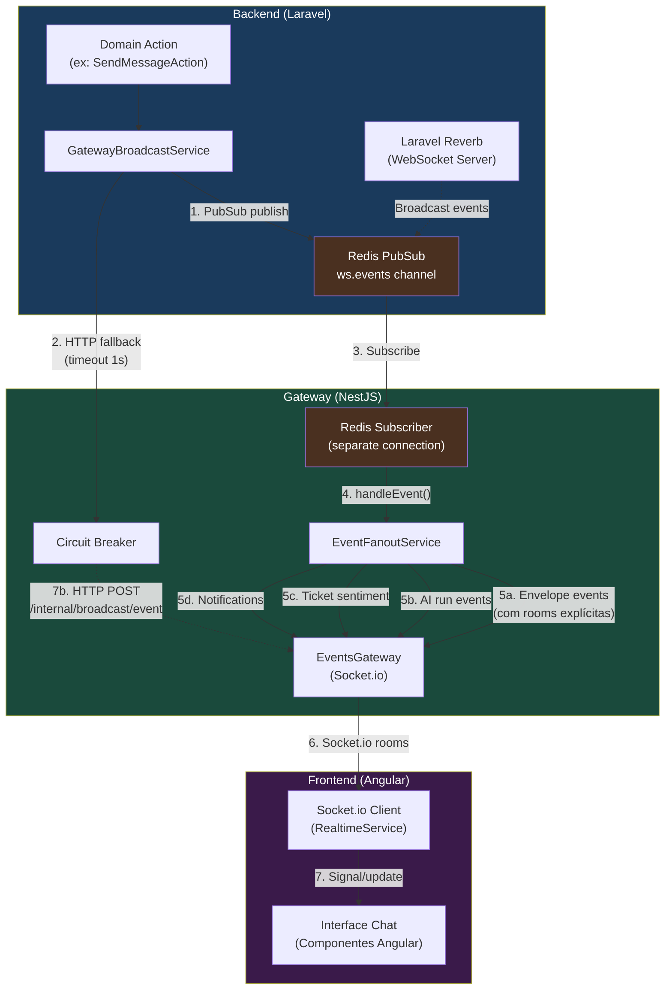
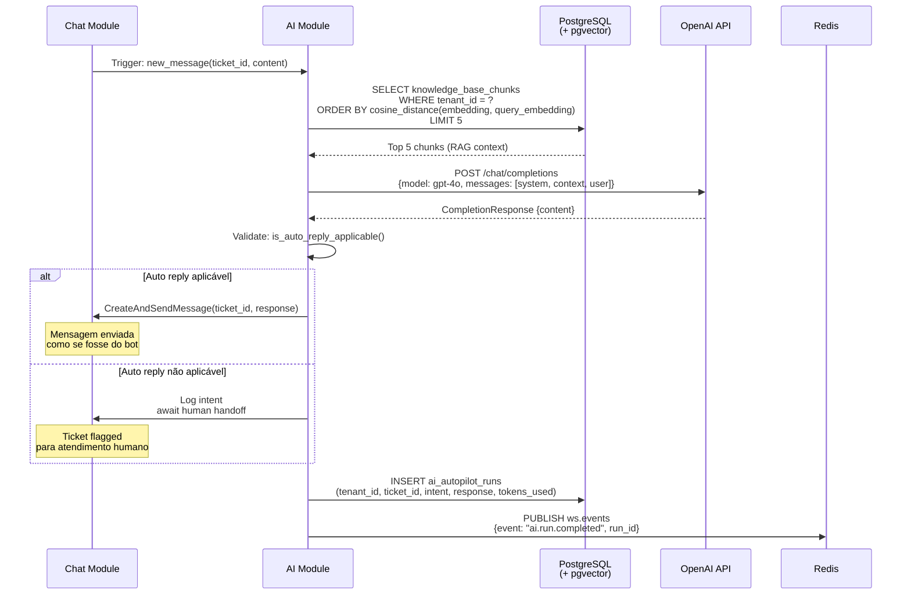
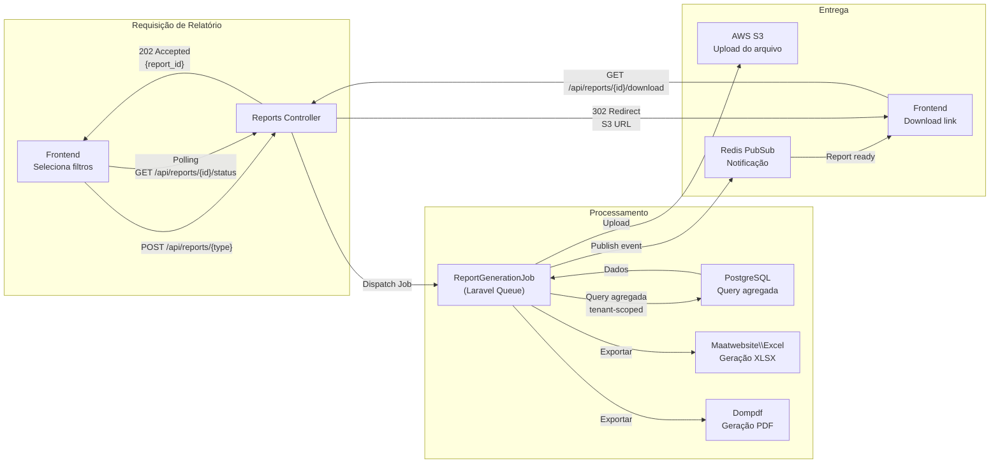
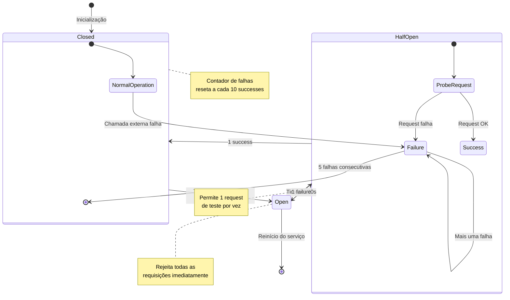

# PRD-ARCH-001 — Arquitetura do Sistema InteraZap

> **Tipo:** Product Requirements Document — Arquitetura Sistêmica
> **Módulo:** Architecture (cross-cutting)
> **Status:** approved
> **Autor:** PM / DOC
> **Data:** 2026-03-28
> **Versão:** 1.0
> **Stack:** Angular 20 | NestJS 11 | Laravel 12 | PostgreSQL 17 | Redis 7

---

## 1. CONTEXTO

### 1.1 Visão Geral do Sistema

InteraZap é uma plataforma SaaS multi-tenant para comunicação inteligente com clientes via WhatsApp, potencializada por inteligência artificial. A arquitetura do sistema é projetada para suportar 11 módulos de domínio independentes, com isolamento rigoroso entre tenants e comunicação em tempo real.

O sistema é composto por três camadas principais: **Frontend** (Angular SPA), **Gateway** (NestJS relay + WebSocket), e **Backend** (Laravel API), todas conectadas a um PostgreSQL 17 com extensão pgvector e Redis 7 para cache, filas e pub/sub.

### 1.2 Decisão Arquitetural Central

A decisão arquitetural mais fundamental do InteraZap é a adoção de um **monolito modular em 3 camadas** com relay de API via Gateway NestJS. Esta escolha equilibra a simplicidade operacional de um monolito com a capacidade de processamento assíncrono e comunicação em tempo real que um SaaS de chat demanda.

A camada de **Gateway** (NestJS) atua como um API relay entre o frontend Angular e o backend Laravel. Ela é responsável por:

- Gerenciar conexões WebSocket (Socket.io) com reconexão automática e rooms por tenant
- Processar webhooks de WhatsApp e Asaas de forma assíncrona via BullMQ
- Aplicar circuit breaker em chamadas a APIs externas (Z-API, UazAPI, Asaas, OpenAI)
- Rate limiting em endpoints públicos
- Validar autenticação WebSocket (JWT primário, Sanctum fallback)

A camada de **Backend** (Laravel) permanece como fonte da verdade para dados e lógica de negócio:

- APIs REST para todas as operações CRUD e transacionais
- Broadcasting de eventos via Laravel Reverb (WebSocket server)
- Processamento de filas via Laravel Horizon (jobs PHP)
- Autenticação via Sanctum + Spatie Permissions
- Integrações externas (OpenAI, Asaas, Z-API, UazAPI)

### 1.3 O Problema que a Arquitetura Resolve

O InteraZap enfrenta desafios típicos de SaaS multi-tenant com comunicação em tempo real:

1. **Isolamento de dados entre empresas**: Cada tenant deve ter seus dados completamente invisíveis para outros tenants, incluindo em queries, webhooks e eventos WebSocket.

2. **Comunicação em tempo real com WhatsApp**: Mensagens precisam aparecer no frontend em menos de 2 segundos após o webhook do provedor WhatsApp, mas o processamento completo (persistência, IA, CRM) é assíncrono.

3. **Resiliência em integrações externas**: Z-API e UazAPI são provedores de WhatsApp que podem ter indisponibilidade. O circuit breaker protege o sistema de falhas em cascata.

4. **Autenticação ubíqua**: Usuários se autenticam via Sanctum (HTTP API) e precisam de token válido para WebSocket. O Gateway valida tokens em duas etapas (JWT local, Sanctum API fallback) com cache LRU.

5. **Processamento assíncrono de webhooks**: Webhooks de WhatsApp precisam de ACK rápido (<150ms) para o provedor, mas o processamento completo pode levar mais tempo. BullMQ no Gateway permite essa separação.

6. **Escalabilidade horizontal do Gateway**: O Gateway NestJS é stateless (exceto cache LRU local), permitindo múltiplas instâncias via PM2.

### 1.4 stack Tecnológico Detalhada

| Camada            | Tecnologia                               | Versão   | Propósito                                         |
| ----------------- | ---------------------------------------- | -------- | ------------------------------------------------- |
| **Frontend**      | Angular + TypeScript + Tailwind CSS      | 20 / 5.9 | SPA responsiva com 35+ componentes compartilhados |
| **Gateway**       | NestJS + TypeScript + BullMQ + Socket.io | 11 / 5.7 | Relay de API, WebSocket server, BullMQ workers    |
| **Backend**       | Laravel + PHP + Sanctum + Spatie         | 12 / 8.3 | API REST, lógica de domínio, broadcasting         |
| **Database**      | PostgreSQL + pgvector                    | 17       | Dados relacionais + embeddings vetoriais para RAG |
| **Cache/Fila**    | Redis (Streams, PubSub, Cache)           | 7        | Cache, filas, pub/sub, streams                    |
| **Queue BE**      | Laravel Horizon                          | 5.x      | Monitoramento de filas PHP                        |
| **Queue GW**      | BullMQ                                   | 5.x      | Filas assíncronas no gateway                      |
| **WebSocket**     | Laravel Reverb + Socket.io               | -        | Broadcasting do backend + WebSocket do gateway    |
| **AI**            | OpenAI API (GPT-4o, embeddings)          | -        | Completions, embeddings, RAG                      |
| **Pagamentos**    | Asaas API                                | -        | Cobranças, assinaturas, invoices                  |
| **WhatsApp**      | Z-API + UazAPI                           | -        | Envio e recebimento de mensagens                  |
| **Storage**       | AWS S3                                   | -        | Uploads, avatares, arquivos                       |
| **Email**         | SMTP                                     | -        | Transacionais e notificações                      |
| **Monitoramento** | Prometheus + Grafana + Sentry            | -        | Métricas, alertas, error tracking                 |
| **Container**     | Docker Compose                           | -        | Desenvolvimento local                             |
| **Deploy**        | Ansible + GitHub Actions                 | -        | Deploy automatizado                               |

### 1.5 Arquitetura de Módulos (DDD)

O backend segue **Domain-Driven Design** com organização por pastas de domínio. Cada domínio contém:

```
src/Domain/{Domain}/
  ├── Actions/          # Lógica de negócio atômica (verbos)
  ├── Contracts/        # Interfaces de repositórios e serviços
  ├── DTOs/             # Data Transfer Objects (readonly, fromRequest, fromArray)
  ├── Enums/            # Tipos enumerados
  ├── Events/           # Domain Events (PHP events)
  ├── Http/
  │   ├── Controllers/  # Controladores (final class)
  │   ├── Requests/     # FormRequest de validação
  │   └── Resources/    # API Resources (transformação de saída)
  ├── Jobs/             # Laravel Queue Jobs
  ├── Listeners/        # Event Listeners
  ├── Models/           # Eloquent Models
  ├── Policies/         # Authorization Policies
  ├── Repositories/     # Repository implementations
  └── Routes/
      └── api.php       # Rotas do domínio
```

**11 módulos de domínio:**

| ID      | Módulo            | Descrição                                                 | Dependências                       |
| ------- | ----------------- | --------------------------------------------------------- | ---------------------------------- |
| MOD-001 | **Ai**            | Embeddings, RAG, completions OpenAI, autopilot            | Auth, Chat, CRM, Shared            |
| MOD-002 | **Auth**          | Sanctum tokens, Spatie RBAC, 2FA TOTP                     | Shared                             |
| MOD-003 | **Billing**       | Asaas: cobranças, assinaturas, invoices                   | Auth, Platform, Shared             |
| MOD-004 | **Chat**          | WhatsApp via Z-API/UazAPI, tickets, mensagens             | Auth, CRM, Gateway, Shared         |
| MOD-005 | **CRM**           | Contatos, empresas, deals, pipelines, campos customizados | Auth, Shared                       |
| MOD-006 | **Configuration** | Configurações por tenant, integrações                     | Auth, Shared                       |
| MOD-007 | **Dashboard**     | Métricas, KPIs agregados, widgets                         | Auth, Billing, Chat, CRM, Shared   |
| MOD-008 | **Gateway**       | Lógica de relay, webhooks, circuit breaker                | Auth, Shared                       |
| MOD-009 | **Platform**      | Tenants, planos, onboarding                               | Auth, Configuration, Shared        |
| MOD-010 | **Reports**       | Relatórios, exportação CSV/PDF                            | Auth, Chat, CRM, Dashboard, Shared |
| MOD-011 | **Shared**        | Traits, services, helpers cross-domain                    | (nenhuma)                          |

### 1.6 Camada Shared

O domínio `Shared` (MOD-011) é a fundação de todos os outros módulos. Contém:

- **Traits**: `BelongsToTenant` — aplica global scope de tenant em todos os models
- **Scopes**: `TenantScope` — filtra queries por `tenant_id` automaticamente
- **Services**:
    - `GatewayBroadcastService` — bridge entre backend e gateway (Redis PubSub + HTTP fallback)
    - `MetricsService` — métricas Prometheus
    - `CriticalDataCacheService` — cache de dados críticos
    - `HealthCheckService` — health checks de serviços externos
    - `CepLookupService` / `CnpjLookupService` — consulta de CEP/CNPJ
- **Logging**: `AuditLogger`, `BusinessEventLogger` — auditoria e logging de eventos
- **Base classes**: classes base para controllers, models e services compartilhados

### 1.7 Estratégia Multi-Tenant

O InteraZap utiliza **isolamento por tenant via filtro de coluna** (`tenant_id`):

- Campo `tenant_id` obrigatório em todas as tabelas que armazenam dados de tenant
- Trait `BelongsToTenant` aplica `TenantScope` global em todos os models automaticamente
- Métodos `scopeForTenant()` permitem bypass do global scope quando necessário
- `WsRoomAccessService` valida `tenant_id` no banco para rooms WebSocket
- `GatewayBroadcastService` valida correspondência entre `tenant_id` do payload e do usuário autenticado

### 1.8 Estratégia de Dados

- **Primary Keys**: UUID v4 em todas as tabelas — nunca auto-increment
- **Soft Deletes**: Todos os modelos principais suportam exclusão lógica (`deleted_at`)
- **Auditoria**: `OwenIt\Auditing` registra alterações em entidades sensíveis
- **Eager Loading**: Obrigatório — queries N+1 são detectadas via gate e corrigidas
- **pgvector**: Extensão para embeddings e busca semântica (RAG do módulo Ai)
- **Índices**: Índices compostos em `(tenant_id, id)` para todas as tabelas

### 1.9 Infraestrutura de Deploy

- **VPS**: 186.202.209.180 (interazap.com.br) — Ubuntu com kernel 6.8.0
- **PHP**: 8.5.3 com PHP-FPM + Swoole 6.2.0 + Octane
- **Node**: 18.19.1 + PM2 para serviços gateway
- **PostgreSQL**: 18.3 + pgvector 0.8.2
- **Nginx**: SSL em API e Gateway (portas diferentes para staging/production)
- **Supervisor**: Gerenciamento de processos Laravel (queue workers, Reverb)
- **GitHub Actions**: CI/CD com SSH deploy key para staging (develop) e production (main)

---

## 2. OBJETIVO

### 2.1 Objetivo Primário

Este PRD documenta a arquitetura completa do sistema InteraZap, servindo como **fonte canônica de verdade** para desenvolvedores, agentes de IA e stakeholders técnicos. O documento define:

1. A estrutura de camadas (Frontend → Gateway → Backend → Dados)
2. Os padrões arquiteturais obrigatórios (DDD, Multi-tenant, Event-driven)
3. As regras de negócio que a arquitetura deve satisfazer
4. Os fluxos de dados entre camadas (HTTP REST, WebSocket, Redis PubSub)
5. O modelo de dados completo com entidades e seus relacionamentos
6. A estratégia de segurança em todas as camadas
7. Os eventos de sistema que cruzam camadas
8. Os contratos de API (endpoints REST) entre frontend, gateway e backend
9. Os critérios de aceitação que validam a arquitetura

### 2.2 Objetivos Secundários

**Padronização de desenvolvimento**: Garantir que todos os desenvolvedores e agentes de IA sigam os mesmos padrões, reduzindo inconsistências e acelerando code review.

**Onboarding de novos membros**: Fornecer um documento que permita a qualquer desenvolvedor entender a arquitetura em profundidade sem precisar ler código.

**Comunicação com stakeholders**: Criar um artifact que possa ser compartilhado com integradores, auditores de segurança e parceiros técnicos.

**Base para evoluções futuras**: Documentar decisões arquiteturais (ADR) e suas justificativas para orientar decisões futuras (ex: microservices, RLS no PostgreSQL, troca de provedor WhatsApp).

### 2.3 Arquitetura de Comunicação entre Camadas

O sistema define três canais de comunicação distintos, cada um com seu propósito e constraints:

**Canal 1 — HTTP REST (Frontend ↔ Gateway ↔ Backend)**:

- Requisições síncronas para operações CRUD
- Autenticação via Bearer token (Sanctum)
- Rate limiting no Gateway
- Validação de input no Gateway (ValidationPipe) e Backend (FormRequest)

**Canal 2 — WebSocket (Frontend ↔ Gateway)**:

- Conexão persistente Socket.io via Gateway
- Autenticação via token no handshake
- Rooms por tenant, ticket e run
- Eventos de chat em tempo real, status de mensagens, notificações

**Canal 3 — Redis PubSub (Backend → Gateway → Frontend)**:

- Backend publica eventos no canal `ws.events` do Redis
- EventFanoutService no Gateway consome e distribui via Socket.io
- Suporte a broadcast para rooms específicas
- Fallback HTTP caso Redis esteja indisponível

### 2.4 Propriedades Arquiteturais

| Propriedade            | Implementação                                                   | Meta       |
| ---------------------- | --------------------------------------------------------------- | ---------- |
| **Disponibilidade**    | Multi-instância Gateway via PM2, health checks, circuit breaker | 99.5%      |
| **Latência P99 (API)** | PHP-FPM + Swoole + Octane + Redis cache                         | < 500ms    |
| **Latência WebSocket** | Socket.io rooms por tenant, ping/pong 15s/10s                   | < 100ms    |
| **Isolamento**         | BelongsToTenant + WsRoomAccessService + tenant_id validation    | 100%       |
| **Escalabilidade**     | Gateway stateless + PostgreSQL connection pooling               | Horizontal |
| **Observabilidade**    | Prometheus metrics + Grafana + Sentry                           | Full trace |

### 2.5 Restrições Arquiturias

- O Backend **nunca** se comunica diretamente com o Frontend — sempre via Gateway ou broadcasting
- O Gateway **nunca** persiste dados de negócio — apenas estado de conexão WebSocket e cache LRU
- O Frontend **nunca** acessa PostgreSQL ou Redis diretamente
- Todas as APIs externas (Z-API, UazAPI, Asaas, OpenAI) passam pelo Backend ou pelo Gateway com circuit breaker
- O `tenant_id` é **obrigatório** em todo payload de broadcast e em toda query de dados

---

## 3. REGRAS DE NEGÓCIO

### 3.1 Multi-Tenancy

| ID     | Regra                                                                                                          | Justificativa                                                             | Prioridade |
| ------ | -------------------------------------------------------------------------------------------------------------- | ------------------------------------------------------------------------- | ---------- |
| RN-001 | Todo model que armazena dados de tenant **deve** usar a trait `BelongsToTenant`                                | Garante que o global scope de tenant seja aplicado em todas as queries    | Crítica    |
| RN-002 | Toda requisição autenticada deve ter `tenant_id` do usuário autenticado como filtro obrigatório                | Previne IDOR e vazamento cross-tenant                                     | Crítica    |
| RN-003 | Broadcasts WebSocket **devem** incluir `tenant_id` no payload e a room deve ser validada                       | Garante que eventos vão apenas para rooms do tenant correto               | Crítica    |
| RN-004 | O `WsRoomAccessService` **deve** consultar o banco de dados para validar ownership de rooms `ticket:` e `run:` | Validação apenas em memória é insuficiente para tickets de outros tenants | Alta       |
| RN-005 | Roles e permissões do Spatie são **scoped por guard** (`sanctum`), não por tenant                              | Evita collisions entre tenants na tabela `roles`                          | Alta       |
| RN-006 | SuperAdmin (`role=super-admin`) é o único com capacidade de acessar dados cross-tenant                         | Operações de plataforma requerem privilégio elevado                       | Alta       |
| RN-007 | Soft delete é obrigatório para todos os modelos principais — exclusão física é proibida                        | Preserva histórico de auditoria e permite recuperação                     | Alta       |

### 3.2 Autenticação e Autorização

| ID     | Regra                                                                                          | Justificativa                                              | Prioridade |
| ------ | ---------------------------------------------------------------------------------------------- | ---------------------------------------------------------- | ---------- |
| RN-010 | Toda API request deve incluir `Authorization: Bearer {token}` ou retornar 401                  | Protege contra acesso não autenticado                      | Crítica    |
| RN-011 | Tokens Sanctum expiram conforme `SANCTUM_EXPIRATION` (env var, minutos)                        | Limita tempo de exposição de tokens comprometidos          | Alta       |
| RN-012 | Refresh de token **deve** invalidar o token anterior (single-use refresh)                      | Previne uso de tokens antigos após renovação               | Alta       |
| RN-013 | Rate limiting em rotas públicas de auth: máximo 5 requisições/minuto por IP                    | Mitiga ataques de força bruta                              | Alta       |
| RN-014 | WebSocket handshake **deve** conter token válido no `auth.token` ou no header `Authorization`  | Conexões anônimas não são permitidas                       | Crítica    |
| RN-015 | Validação de token WebSocket: JWT primário (HS256), fallback para Sanctum API (`/api/auth/me`) | Flexibiliza integração sem comprometer segurança           | Alta       |
| RN-016 | Cache LRU de tokens Sanctum no Gateway: máximo 5.000 entradas, TTL 5-10 minutos                | Reduz latência e carga no backend durante picos de conexão | Média      |
| RN-017 | `$this->authorize()` é **obrigatório** em toda action de controller                            | Delega verificação para Policy, evita lógica inline        | Alta       |
| RN-018 | Permissions verificadas via Spatie `hasPermissionTo()` na Policy, **não** no Controller        | Separação de concerns, testabilidade                       | Alta       |

### 3.3 Webhooks e Processamento Assíncrono

| ID     | Regra                                                                                             | Justificativa                                                            | Prioridade |
| ------ | ------------------------------------------------------------------------------------------------- | ------------------------------------------------------------------------ | ---------- |
| RN-020 | Webhooks de WhatsApp **devem** retornar ACK em < 150ms                                            | Provedores WhatsApp desconectam conexões que não recebem resposta rápida | Crítica    |
| RN-021 | Processamento completo de webhook **deve** ser assíncrono via BullMQ no Gateway                   | Permite ACK rápido sem bloquear em operações de banco                    | Crítica    |
| RN-022 | Idempotência de webhook **deve** usar Redis SETNX com TTL                                         | Evita processamento duplicado de mensagens WhatsApp                      | Crítica    |
| RN-023 | Normalização de payload de webhook **deve** ser feita no Gateway antes de publicar no stream      | Backend recebe dados em formato padronizado independente do provedor     | Alta       |
| RN-024 | Circuit breaker em chamadas externas: 5 falhas consecutivas = OPEN por 30s, HALF-OPEN após 30s    | Protege sistema de falhas em cascata de APIs externas                    | Alta       |
| RN-025 | Webhook Asaas **deve** validar assinatura HMAC do payload                                         | Previne webhooks forjados por atacantes                                  | Crítica    |
| RN-026 | Backend processa webhook via Laravel Queue Job (ChatWebhookIngressJob → ChatUazapiWebhookActions) | Garante que processamento pesado não bloqueia resposta                   | Alta       |

### 3.4 Comunicação em Tempo Real

| ID     | Regra                                                                                                     | Justificativa                                                          | Prioridade |
| ------ | --------------------------------------------------------------------------------------------------------- | ---------------------------------------------------------------------- | ---------- |
| RN-030 | Eventos WebSocket **devem** ser emitidos para room `tenant:{id}` automaticamente na conexão               | Garante que todo cliente recebe eventos do seu tenant                  | Crítica    |
| RN-031 | Room `ticket:{id}` só pode ser joinada após validação de `tenant_id` do ticket no banco                   | Impede que um tenant subscribe em tickets de outro                     | Crítica    |
| RN-032 | Room `run:{id}` (IA) só pode ser joinada após validação de `tenant_id` do run no banco                    | Isola execuções de IA por tenant                                       | Alta       |
| RN-033 | GatewayBroadcastService **deve** validar que `tenant_id` do payload corresponde ao do usuário autenticado | Previne broadcast cross-tenant no backend                              | Crítica    |
| RN-034 | Canal Redis PubSub `ws.events` é o canal primário para broadcast de eventos                               | Permite que múltiplas instâncias do Gateway consumam os mesmos eventos | Alta       |
| RN-035 | Fallback HTTP para broadcast **deve** ter timeout de 1s e não deve bloquear em caso de falha              | Garantia de graceful degradation se Redis PubSub falhar                | Média      |
| RN-036 | Ping/pong WebSocket: intervalo 15000ms, timeout 10000ms                                                   | Detecta conexões mortas sem TCP keepalive                              | Alta       |
| RN-037 | Reconexão Socket.io: 10 tentativas, delay 1s-5s (exponential backoff)                                     | Resiliência a desconexões transitórias                                 | Alta       |
| RN-038 | Frontend **deve** detectar slow network (> 60s sem eventos) e notificar o usuário                         | Feedback proativo em caso de problemas de conexão                      | Média      |

### 3.5 Dados e Persistência

| ID     | Regra                                                                                                      | Justificativa                                              | Prioridade |
| ------ | ---------------------------------------------------------------------------------------------------------- | ---------------------------------------------------------- | ---------- |
| RN-040 | UUID v4 como primary key em **todas** as tabelas — auto-increment é proibido                               | Não expõe contagem de registros, seguro para APIs públicas | Crítica    |
| RN-041 | `$fillable` **obrigatório** em todo Model — `$guarded = []` é proibido                                     | Previne mass assignment                                    | Crítica    |
| RN-042 | Eager loading (`with()`) é **obrigatório** — queries N+1 são detectadas nos gates                          | Performance e número de queries previsível                 | Alta       |
| RN-043 | Campos `$hidden` em Models: `password`, `remember_token`, `two_factor_secret`, `two_factor_recovery_codes` | Proteger dados sensíveis de exposição acidental em JSON    | Alta       |
| RN-044 | DTOs `readonly` com `fromRequest()` e `fromArray()` quando aplicável                                       | Imutabilidade e validação centralizada                     | Alta       |
| RN-045 | Todo FormRequest deve validar tipo, formato, required e range de campos externos                           | Primeira linha de defesa contra input malicioso            | Alta       |
| RN-046 | Índices compostos `(tenant_id, id)` em todas as tabelas tenant-scoped                                      | Performance em queries com filtro de tenant                | Alta       |

### 3.6 Segurança de Dados

| ID     | Regra                                                                                         | Justificativa                                     | Prioridade |
| ------ | --------------------------------------------------------------------------------------------- | ------------------------------------------------- | ---------- |
| RN-050 | **NUNCA** logar tokens, senhas, `two_factor_secret`, API keys ou segredos                     | Compliance LGPD e segurança                       | Crítica    |
| RN-051 | Headers de segurança HTTP (Helmet, CORS) em todas as respostas da API e Gateway               | Mitigar XSS, CSRF, clickjacking                   | Alta       |
| RN-052 | Validação de CORS restritiva — apenas origens permitidas configuradas                         | Previne Cross-Origin attacks                      | Alta       |
| RN-053 | Guard `internal` para rotas `/internal/*` — requer `X-API-Key` com segredo compartilhado      | Isola APIs de machine-to-machine do backend       | Alta       |
| RN-054 | Dados em cache Redis **devem** usar prefixo de namespace para evitar collisions               | Multi-instância e multi-tenant compartilham Redis | Média      |
| RN-055 | Uploads de arquivos **devem** ser validados (tipo MIME, tamanho, extensão) antes de persistir | Previne upload de arquivos maliciosos             | Alta       |

### 3.7 Observabilidade

| ID     | Regra                                                                                        | Justificativa                                        | Prioridade |
| ------ | -------------------------------------------------------------------------------------------- | ---------------------------------------------------- | ---------- |
| RN-060 | Métricas Prometheus **devem** ser expostas em `/metrics` no Backend e Gateway                | Monitoramento de SLOs e alertas                      | Alta       |
| RN-061 | Tracing com `X-Trace-Id` / `X-Request-Id` propagado em todas as camadas                      | Correlação de logs entre Frontend, Gateway e Backend | Alta       |
| RN-062 | Health check endpoint `/health` no Gateway e Backend com status de Redis, DB e APIs externas | Load balancer e monitoramento de infraestrutura      | Alta       |
| RN-063 | Sentry para error tracking em Backend e Gateway                                              | Debugging de exceções em produção                    | Média      |

### 3.8 Módulos Específicos

**CRM (MOD-005)**:

| ID     | Regra                                                                       | Prioridade |
| ------ | --------------------------------------------------------------------------- | ---------- |
| RN-070 | Todo contato **deve** pertencer a um tenant via `BelongsToTenant`           | Crítica    |
| RN-071 | Campos customizados de contato são serializados como JSON (`custom_fields`) | Alta       |
| RN-072 | Deals em pipeline **devem** rastrear estágio (`stage_id`) e valor monetário | Alta       |

**Chat (MOD-004)**:

| ID     | Regra                                                                        | Prioridade |
| ------ | ---------------------------------------------------------------------------- | ---------- |
| RN-075 | Ticket de chat **deve** pertencer a um contato CRM e a um tenant             | Crítica    |
| RN-076 | Status de mensagem: `pending` → `sent` → `delivered` → `read`                | Alta       |
| RN-077 | Mensagens de IA **devem** ter `ai_run_id` referenciando a execução que gerou | Alta       |
| RN-078 | Instâncias WhatsApp são scoped por tenant — cada tenant tem suas instâncias  | Crítica    |

**Billing (MOD-003)**:

| ID     | Regra                                                          | Prioridade |
| ------ | -------------------------------------------------------------- | ---------- |
| RN-080 | Assinaturas **devem** ser sincronizadas com Asaas via webhooks | Crítica    |
| RN-081 | Plano padrão é definido em `Configuration` do tenant           | Alta       |
| RN-082 | Tentativas de pagamento: 3 retries automáticos via Asaas       | Alta       |

**Reports (MOD-010)**:

| ID     | Regra                                                                                      | Prioridade |
| ------ | ------------------------------------------------------------------------------------------ | ---------- |
| RN-085 | Filtros de relatório **devem** incluir range de datas, tenant e opcionalmente CRM pipeline | Alta       |
| RN-086 | Exportação CSV/PDF é gerada em background via Laravel Job                                  | Alta       |
| RN-087 | Relatórios são scoped por tenant — não há acesso cross-tenant                              | Crítica    |

**AI (MOD-001)**:

| ID     | Regra                                                                          | Prioridade |
| ------ | ------------------------------------------------------------------------------ | ---------- |
| RN-090 | Embeddings armazenados via pgvector com dimensão 1536 (text-embedding-3-small) | Alta       |
| RN-091 | RAG busca top-5 chunks mais similares via `cosine distance`                    | Alta       |
| RN-092 | Runs de autopilot são scoped por tenant e por ticket                           | Crítica    |

---

## 4. FLUXOS

### 4.1 Fluxo de Autenticação (HTTP)

```mermaid
sequenceDiagram
    participant FE as Frontend (Angular)
    participant GW as Gateway (NestJS)
    participant API as Backend (Laravel)
    participant DB as PostgreSQL
    participant Redis as Redis (Cache)

    rect rgb(40, 60, 90)
        Note over FE, Redis: Fluxo de Login com 2FA Opcional
    end

    FE->>GW: POST /api/auth/login<br/>{email, password}
    GW->>API: Proxy request (connectTimeout 1s)
    API->>DB: SELECT * FROM auth_users<br/>WHERE email = ? AND tenant_id = ?

    alt Usuário não encontrado ou senha inválida
        DB-->>API: empty
        API-->>GW: 401 Unauthorized
        GW-->>FE: 401 {success: false, message: "Credenciais inválidas"}
    end

    alt Usuário desativado (is_active = false)
        DB-->>API: user record
        API-->>GW: 403 Forbidden
        GW-->>FE: 403 {success: false, message: "Conta desativada"}
    end

    alt 2FA habilitado (two_factor_secret != null)
        DB-->>API: user record
        API-->>GW: 200 {requires_2fa: true, user_id}
        GW-->>FE: 200 AuthTwoFactorChallengeDTO
        FE->>GW: POST /api/auth/login-with-2fa<br/>{email, password, two_factor_code}
        GW->>API: Proxy request
        API->>API: Validar TOTP code
        alt Código 2FA inválido
            API-->>GW: 422 {error: "Código 2FA inválido"}
            GW-->>FE: 422
        end
        API->>DB: UPDATE last_login_at
    end

    alt Credenciais válidas sem 2FA
        DB-->>API: user record
        API->>DB: SELECT roles, permissions<br/>FROM model_has_roles, role_has_permissions
        API->>Redis: Cache session data (TTL 60min)
        API->>DB: INSERT personal_access_token
        API-->>GW: 200 AuthSessionDTO<br/>{token, user, tenant, roles, permissions}
        GW-->>FE: 200 AuthSessionDTO
    end

    Note over FE: Armazena token em memory<br/>Conecta WebSocket
```



### 4.2 Fluxo de WebSocket — Conexão e Room Join

```mermaid
sequenceDiagram
    participant FE as Frontend (Angular)
    participant GW as Gateway (NestJS)
    participant API as Backend (Laravel)
    participant DB as PostgreSQL
    participant Redis as Redis (Cache LRU)

    rect rgb(20, 60, 40)
        Note over FE, Redis: Fluxo de Conexão WebSocket
    end

    FE->>GW: Socket.io handshake<br/>auth: {token: "sanctum_token"}
    GW->>GW: WsAuthenticationService.extractToken()

    alt Token Bearer no handshake.auth
        Note over GW: Extrai token do auth.token
    else Token no header Authorization
        Note over GW: Extrai do handshake.headers.authorization
    end

    GW->>GW: verifyToken(token)

    alt JWT válido
        GW->>GW: jwt.verify(token, secret, ['HS256'])
        Note over GW: Validação local, sem chamada externa
    else JWT inválido → Fallback Sanctum
        GW->>Redis: CHECK cache LRU
        alt Cache hit
            Redis-->>GW: JwtPayload {sub, tenant_id}
        end
        alt Cache miss
            GW->>API: GET /api/auth/me<br/>Authorization: Bearer {token}
            API->>DB: SELECT id, tenant_id FROM auth_users<br/>WHERE token = ?
            alt Token válido
                DB-->>API: user
                API-->>GW: 200 {user: {id, tenant_id}}
                GW->>Redis: SET cache (TTL 5-10min, max 5000 entries)
                Redis-->>GW: OK
            else Token inválido/expirado
                API-->>GW: 401
                GW-->>FE: Socket disconnect
            end
        end
    end

    GW->>GW: Client join room "tenant:{tenant_id}"
    GW->>FE: Socket.io connected<br/>{socket.id}
    FE->>GW: Socket.emit('join', {rooms: ["ticket:uuid-1", "ticket:uuid-2"]})
    GW->>GW: WsRoomAccessService.canJoinRoom()

    loop Para cada room
        alt room prefix = "tenant:"
            GW->>GW: Validar tenant_id na room = user.tenant_id
        end
        alt room prefix = "ticket:"
            GW->>DB: SELECT tenant_id FROM chat_tickets WHERE id = ?
            DB-->>GW: tenant_id
            GW->>GW: Comparar com user.tenant_id
        end
        alt room prefix = "run:"
            GW->>DB: SELECT tenant_id FROM ai_autopilot_runs WHERE id = ?
            DB-->>GW: tenant_id
            GW->>GW: Comparar com user.tenant_id
        end

        alt Acesso autorizado
            GW->>FE: join ack (emitido implicitamente)
            Note over GW, FE: Client entra na room
        else Acesso negado
            GW->>FE: Silently skip (room não é adicionada)
            Note over GW: Room join request ignorada
        end
    end
```



### 4.3 Fluxo de Webhook WhatsApp — Ingresso e Processamento

```mermaid
sequenceDiagram
    participant WA as WhatsApp Provider<br/>(Z-API / UazAPI)
    participant GW as Gateway (NestJS)
    participant Redis as Redis (Streams + PubSub)
    participant API as Backend (Laravel)
    participant DB as PostgreSQL
    participant FE as Frontend (Angular)

    rect rgb(80, 20, 20)
        Note over WA, DB: FASE 1: Ingresso Rápido (< 150ms)
    end

    WA->>GW: POST /webhooks/chat/{provider}/{instanceId}<br/>{event: "message", ...}
    GW->>GW: ChatWebhookController.ACK()

    rect rgb(20, 40, 20)
        Note over GW: Validações pré-processamento
    end

    GW->>GW: InstanceResolverService.resolveByWebhookToken()
    Note over GW: Extrai instanceId do path<br/>Busca token no DB/cache
    alt Token inválido
        GW-->>WA: 401 Unauthorized
    end

    GW->>GW: Normalizar payload (provider-specific)
    Note over GW: UazapiProvider.normalize()<br/>ou ZapiAdapter.normalizeWebhook()
    alt Falha na normalização
        GW-->>WA: 400 Bad Request
    end

    GW->>Redis: SETNX webhook:idempotency:{hash}<br/>TTL 5 minutos
    alt Mensagem já processada (idempotency hit)
        Redis-->>GW: 0 (already exists)
        GW-->>WA: 200 OK (ACK rápido)
        Note over GW: Descarta, não processa novamente
    end

    Redis-->>GW: 1 (novo, processa)

    rect rgb(20, 20, 60)
        Note over GW: Publicação assíncrona
    end

    GW->>Redis: XADD chatInboundStream * {payload}
    Note over Redis: Redis Stream para retry<br/>e processamento ordenado
    GW->>Redis: PUBLISH ws.events {event, tenant_id, rooms, data}
    Note over Redis: PubSub direto para<br/>EventFanoutService

    GW-->>WA: 200 OK<br/>ACK < 150ms ✓

    rect rgb(20, 60, 60)
        Note over GW, DB: FASE 2: Processamento Assíncrono (BullMQ)
    end

    Note over GW: BullMQ Worker<br/>(ChatWebhookIngressJob)
    GW->>GW: ChatUazapiWebhookActions.handle()
    GW->>API: POST /internal/webhooks/chat<br/>{normalizedPayload}
    API->>DB: BEGIN TRANSACTION
    API->>DB: INSERT/UPDATE chat_tickets<br/>(tenant_id = do instance)
    API->>DB: INSERT chat_messages
    API->>DB: COMMIT
    API->>DB: SELECT contact.crm_contact_id
    alt Contato encontrado no CRM
        API->>API: AI Autoresponder.check()
        Note over API: Gera resposta via OpenAI<br/>se configured
    end
    API->>Redis: PUBLISH ws.events<br/>{event: "chat.message.new", tenant_id, data}

    rect rgb(40, 20, 60)
        Note over Redis, FE: FASE 3: Distribuição para Clientes
    end

    Redis->>GW: EventFanoutService consome "ws.events"
    GW->>GW: processChatMessage()
    GW->>FE: Socket.io emit<br/>"chat.message.new"<br/>to room "tenant:{tenant_id}"
    Note over FE: Angular atualiza<br/>interface em tempo real
```



### 4.4 Fluxo de Broadcasting — Backend → Gateway → Frontend



### 4.5 Fluxo de Mensagem de Chat (Envio)

```mermaid
sequenceDiagram
    participant FE as Frontend (Angular)
    participant GW as Gateway (NestJS)
    participant API as Backend (Laravel)
    participant DB as PostgreSQL
    participant Redis as Redis (Cache)
    participant WA as WhatsApp Provider<br/>(Z-API / UazAPI)
    participant OpenAI as OpenAI API

    rect rgb(20, 60, 40)
        Note over FE, Redis: Fluxo de Envio de Mensagem
    end

    FE->>API: POST /api/chat/messages<br/>{ticket_id, content, type}
    API->>DB: SELECT ticket WHERE id = ? AND tenant_id = ?
    API->>API: $this->authorize('create', ChatMessagePolicy)
    API->>DB: INSERT chat_messages<br/>(status: pending, tenant_id)
    API->>Redis: PUBLISH ws.events<br/>{event: "chat.message.new"}
    API->>WA: POST /sendMessage<br/>(provider SDK)
    WA-->>API: 200 {messageId}

    alt WA disponível
        API->>DB: UPDATE chat_messages<br/>SET status = sent, sent_at = now()
        API->>Redis: PUBLISH ws.events<br/>{event: "chat.message.status", status: sent}
        API-->>FE: 201 ChatMessageResource
    end

    alt WA indisponível (circuit breaker OPEN)
        API->>API: Retry com backoff (3x)
        alt Falha após retries
            API->>DB: UPDATE chat_messages<br/>SET status = failed, error_message = ?
            API->>Redis: PUBLISH ws.events<br/>{event: "chat.message.status", status: failed}
            API-->>FE: 201 ChatMessageResource<br/>(com warning)
        end
    end

    Note over Redis: EventFanoutService<br/>distribui para room "tenant:{id}"
    Redis-->>FE: Socket.io: chat.message.status<br/>(sent/delivered/failed)
```



### 4.6 Fluxo de AI Autoresponder (RAG + GPT)



### 4.7 Fluxo de Billing (Asaas)

```mermaid
sequenceDiagram
    participant Billing as Billing Module
    participant DB as PostgreSQL
    participant Asaas as Asaas API
    participant Webhook as Gateway<br/>(Webhook Controller)

    rect rgb(40, 20, 20)
        Note over Billing, Asaas: Fluxo de Cobrança
    end

    Billing->>DB: SELECT tenant.plan
    Billing->>Asaas: POST /payments<br/>{customer_id, value, billingType}
    Asaas-->>Billing: {id: "pay_xxx", status: PENDING}
    Billing->>DB: INSERT billing_payments<br/>(asaas_id, tenant_id, status: pending)

    rect rgb(20, 20, 40)
        Note over Webhook, DB: Fluxo de Webhook Asaas
    end

    Asaas->>Webhook: POST /webhooks/billing/asaas<br/>{event: PAYMENT_RECEIVED, payment}
    Webhook->>Webhook: Validar HMAC signature
    alt Signature inválida
        Webhook-->>Asaas: 403 Forbidden
    end
    Webhook->>Webhook: SETNX billing:webhook:{payment_id}
    Webhook-->>Asaas: 200 OK (< 150ms)

    Note over Webhook: BullMQ Job<br/>(BillingWebhookJob)
    Webhook->>DB: UPDATE billing_payments<br/>SET status = RECEIVED, received_at = now()
    DB->>DB: Verificar se todas as parcelas pagas
    alt Assinatura ativada
        DB->>DB: UPDATE platform_tenants<br/>SET status = active
        Billing->>DB: INSERT billing_invoice
    end
    Billing->>Redis: PUBLISH ws.events<br/>{event: "billing.payment_received"}
```



### 4.8 Fluxo de Report Generation



### 4.9 Fluxo de Circuit Breaker



---

## 5. ENTIDADES E MODELOS

### 5.1 Visão Geral do Modelo de Dados

O modelo de dados do InteraZap é organizado em 11 domínios, cada um com suas tabelas. Todas as tabelas que armazenam dados de tenant seguem o padrão:

```
┌─────────────────────────────────────────────────────────────┐
│                  Entidade Tenant-Scoped                     │
├─────────────────────────────────────────────────────────────┤
│ id              UUID (PK)                                   │
│ tenant_id       UUID (FK → platform_tenants)               │
│ created_at      TIMESTAMP                                   │
│ updated_at      TIMESTAMP                                   │
│ deleted_at      TIMESTAMP (nullable, soft delete)           │
├─────────────────────────────────────────────────────────────┤
│ + campos específicos do domínio                            │
└─────────────────────────────────────────────────────────────┘
```

Índices:

- `PRIMARY KEY (id)`
- `INDEX (tenant_id, id)` — para queries tenant-scoped
- `INDEX (tenant_id, created_at)` — para ordenação temporal
- `UNIQUE (tenant_id, [unique_column])` — para unicidade por tenant

### 5.2 Domínio Platform (MOD-009)

#### platform_tenants

Tabela central de tenants (empresas). Uma tenant é o contêiner de mais alto nível.

| Campo           | Tipo         | Constraints               | Descrição                                  |
| --------------- | ------------ | ------------------------- | ------------------------------------------ |
| `id`            | UUID         | PK                        | Identificador único                        |
| `name`          | VARCHAR(255) | NOT NULL                  | Nome fantasia da empresa                   |
| `slug`          | VARCHAR(100) | UNIQUE, NOT NULL          | Slug para URLs e identificação             |
| `status`        | ENUM         | NOT NULL, DEFAULT 'trial' | `trial`, `active`, `suspended`, `inactive` |
| `plan_id`       | UUID         | FK → platform_plans       | Plano atual da assinatura                  |
| `settings`      | JSONB        | DEFAULT '{}'              | Configurações customizadas                 |
| `trial_ends_at` | TIMESTAMP    | NULLABLE                  | Data de fim do trial                       |
| `suspended_at`  | TIMESTAMP    | NULLABLE                  | Data de suspensão                          |
| `created_at`    | TIMESTAMP    | NOT NULL                  |                                            |
| `updated_at`    | TIMESTAMP    | NOT NULL                  |                                            |

**Índices**: `(slug) UNIQUE`, `(status)`, `(plan_id)`

#### platform_plans

Planos de assinatura disponíveis.

| Campo           | Tipo          | Constraints  | Descrição                                |
| --------------- | ------------- | ------------ | ---------------------------------------- |
| `id`            | UUID          | PK           |                                          |
| `name`          | VARCHAR(100)  | NOT NULL     | Nome do plano (Starter, Pro, Enterprise) |
| `slug`          | VARCHAR(50)   | UNIQUE       |                                          |
| `price_monthly` | DECIMAL(10,2) | NOT NULL     | Preço mensal em BRL                      |
| `price_yearly`  | DECIMAL(10,2) | NOT NULL     | Preço anual em BRL                       |
| `features`      | JSONB         | NOT NULL     | Feature flags do plano                   |
| `limits`        | JSONB         | NOT NULL     | Limites (users, contacts, messages)      |
| `is_active`     | BOOLEAN       | DEFAULT true |                                          |
| `asaas_plan_id` | VARCHAR(100)  | NULLABLE     | ID do plano no Asaas                     |
| `created_at`    | TIMESTAMP     |              |                                          |
| `updated_at`    | TIMESTAMP     |              |                                          |

### 5.3 Domínio Auth (MOD-002)

#### auth_users

Usuários do sistema. Sempre scoped a um tenant.

| Campo                       | Tipo         | Constraints   | Descrição                |
| --------------------------- | ------------ | ------------- | ------------------------ |
| `id`                        | UUID         | PK            |                          |
| `tenant_id`                 | UUID         | FK, NOT NULL  | Empresa a qual pertence  |
| `name`                      | VARCHAR(255) | NOT NULL      | Nome completo            |
| `email`                     | VARCHAR(255) | NOT NULL      | Email (único por tenant) |
| `phone`                     | VARCHAR(30)  | NULLABLE      | Telefone com DDI         |
| `password`                  | VARCHAR(255) | NOT NULL      | bcrypt hash              |
| `avatar_url`                | VARCHAR(500) | NULLABLE      | URL do avatar em S3      |
| `is_active`                 | BOOLEAN      | DEFAULT true  |                          |
| `two_factor_secret`         | VARCHAR(255) | NULLABLE      | Secret TOTP              |
| `two_factor_enabled`        | BOOLEAN      | DEFAULT false |                          |
| `two_factor_recovery_codes` | JSON         | NULLABLE      | Códigos de recuperação   |
| `last_login_at`             | TIMESTAMP    | NULLABLE      |                          |
| `remember_token`            | VARCHAR(100) | NULLABLE      |                          |
| `deleted_at`                | TIMESTAMP    | NULLABLE      | Soft delete              |
| `created_at`                | TIMESTAMP    |               |                          |
| `updated_at`                | TIMESTAMP    |               |                          |

**Índices**: `(tenant_id, email) UNIQUE`, `(tenant_id, is_active)`

**Relações**:

- `belongsTo → PlatformTenant (tenant_id)`
- `belongsToMany → AuthRole (model_has_roles)`
- `belongsToMany → AuthPermission (model_has_permissions)`

#### auth_roles

Papéis (roles) por tenant. Scoped pelo `guard_name = 'sanctum'`.

| Campo         | Tipo         | Constraints                 | Descrição                         |
| ------------- | ------------ | --------------------------- | --------------------------------- |
| `id`          | UUID         | PK                          |                                   |
| `name`        | VARCHAR(255) | NOT NULL                    | Nome do role (Gerente, Atendente) |
| `guard_name`  | VARCHAR(255) | NOT NULL, DEFAULT 'sanctum' |                                   |
| `description` | TEXT         | NULLABLE                    |                                   |
| `created_at`  | TIMESTAMP    |                             |                                   |
| `updated_at`  | TIMESTAMP    |                             |                                   |

**Índices**: `(guard_name, name) UNIQUE`

**Tabela auxiliar**: `role_has_permissions` (role_id, permission_id)

**Tabela auxiliar**: `model_has_roles` (model_type, model_id, role_id)

#### personal_access_tokens

Tokens Sanctum para autenticação API.

| Campo            | Tipo         | Constraints      | Descrição                  |
| ---------------- | ------------ | ---------------- | -------------------------- |
| `id`             | UUID         | PK               |                            |
| `tokenable_type` | VARCHAR(255) | NOT NULL         | Classe do model (AuthUser) |
| `tokenable_id`   | UUID         | NOT NULL, FK     | ID do usuário              |
| `name`           | VARCHAR(255) | NOT NULL         | Nome descritivo do token   |
| `token`          | VARCHAR(64)  | UNIQUE, NOT NULL | Hash SHA-256 do token      |
| `abilities`      | JSON         | DEFAULT '["*"]'  | Permissões do token        |
| `last_used_at`   | TIMESTAMP    | NULLABLE         |                            |
| `expires_at`     | TIMESTAMP    | NULLABLE         | Expiração opcional         |
| `created_at`     | TIMESTAMP    |                  |                            |
| `updated_at`     | TIMESTAMP    |                  |                            |

**Índices**: `(tokenable_type, tokenable_id)`, `(token)`

### 5.4 Domínio Chat (MOD-004)

#### chat_instances

Instâncias WhatsApp vinculadas a um tenant.

| Campo                  | Tipo         | Constraints      | Descrição                            |
| ---------------------- | ------------ | ---------------- | ------------------------------------ |
| `id`                   | UUID         | PK               |                                      |
| `tenant_id`            | UUID         | FK, NOT NULL     |                                      |
| `name`                 | VARCHAR(100) | NOT NULL         | Nome descritivo                      |
| `provider`             | ENUM         | NOT NULL         | `zapi`, `uazapi`                     |
| `provider_instance_id` | VARCHAR(255) | NOT NULL         | ID no provedor                       |
| `webhook_token`        | VARCHAR(64)  | UNIQUE, NOT NULL | Token para validar webhooks          |
| `phone_number`         | VARCHAR(30)  | NOT NULL         | Número WhatsApp                      |
| `status`               | ENUM         | NOT NULL         | `active`, `inactive`, `disconnected` |
| `settings`             | JSONB        | DEFAULT '{}'     | Configurações do provedor            |
| `deleted_at`           | TIMESTAMP    | NULLABLE         |                                      |
| `created_at`           | TIMESTAMP    |                  |                                      |
| `updated_at`           | TIMESTAMP    |                  |                                      |

**Índices**: `(tenant_id, status)`, `(provider_instance_id)`

#### chat_tickets

Conversas (tickets) entre um contato e a empresa.

| Campo             | Tipo         | Constraints                 | Descrição                               |
| ----------------- | ------------ | --------------------------- | --------------------------------------- |
| `id`              | UUID         | PK                          |                                         |
| `tenant_id`       | UUID         | FK, NOT NULL                |                                         |
| `contact_id`      | UUID         | FK → crm_contacts, NOT NULL |                                         |
| `instance_id`     | UUID         | FK → chat_instances         | Instância que recebe/envia              |
| `status`          | ENUM         | NOT NULL                    | `open`, `pending`, `closed`, `archived` |
| `priority`        | ENUM         | DEFAULT 'normal'            | `low`, `normal`, `high`, `urgent`       |
| `assigned_to`     | UUID         | FK → auth_users, NULLABLE   | Atendente atribuído                     |
| `last_message_at` | TIMESTAMP    | NULLABLE                    | Timestamp da última mensagem            |
| `unread_count`    | INTEGER      | DEFAULT 0                   | Mensagens não lidas                     |
| `sentiment`       | ENUM         | NULLABLE                    | `positive`, `neutral`, `negative` (AI)  |
| `sentiment_score` | DECIMAL(5,4) | NULLABLE                    | Score -1.0 a 1.0                        |
| `closed_at`       | TIMESTAMP    | NULLABLE                    |                                         |
| `closed_by`       | UUID         | FK → auth_users, NULLABLE   |                                         |
| `deleted_at`      | TIMESTAMP    | NULLABLE                    |                                         |
| `created_at`      | TIMESTAMP    |                             |                                         |
| `updated_at`      | TIMESTAMP    |                             |                                         |

**Índices**: `(tenant_id, status)`, `(tenant_id, assigned_to)`, `(tenant_id, last_message_at)`, `(contact_id)`

#### chat_messages

Mensagens individuais dentro de um ticket.

| Campo                 | Tipo         | Constraints                      | Descrição                                                            |
| --------------------- | ------------ | -------------------------------- | -------------------------------------------------------------------- |
| `id`                  | UUID         | PK                               |                                                                      |
| `tenant_id`           | UUID         | FK, NOT NULL                     |                                                                      |
| `ticket_id`           | UUID         | FK, NOT NULL                     |                                                                      |
| `sender_type`         | ENUM         | NOT NULL                         | `contact`, `agent`, `bot`, `system`                                  |
| `sender_id`           | UUID         | NULLABLE                         | auth_user_id ou contact_id                                           |
| `content`             | TEXT         | NOT NULL                         | Texto da mensagem                                                    |
| `type`                | ENUM         | DEFAULT 'text'                   | `text`, `image`, `audio`, `video`, `document`, `location`, `sticker` |
| `status`              | ENUM         | NOT NULL                         | `pending`, `sent`, `delivered`, `read`, `failed`                     |
| `provider_message_id` | VARCHAR(255) | NULLABLE                         | ID no WhatsApp provider                                              |
| `metadata`            | JSONB        | DEFAULT '{}'                     | Dados extras (URL do arquivo, etc.)                                  |
| `ai_run_id`           | UUID         | FK → ai_autopilot_runs, NULLABLE | Run de IA que gerou                                                  |
| `error_message`       | TEXT         | NULLABLE                         | Mensagem de erro se status = failed                                  |
| `sent_at`             | TIMESTAMP    | NULLABLE                         | Timestamp de envio                                                   |
| `delivered_at`        | TIMESTAMP    | NULLABLE                         |                                                                      |
| `read_at`             | TIMESTAMP    | NULLABLE                         |                                                                      |
| `created_at`          | TIMESTAMP    |                                  |                                                                      |
| `updated_at`          | TIMESTAMP    |                                  |                                                                      |

**Índices**: `(ticket_id, created_at)`, `(tenant_id, status)`, `(provider_message_id)`

#### chat_conversation_participants

Participantes de uma conversa (para suporte a grupos WhatsApp).

| Campo              | Tipo      | Constraints      | Descrição          |
| ------------------ | --------- | ---------------- | ------------------ |
| `id`               | UUID      | PK               |                    |
| `tenant_id`        | UUID      | FK, NOT NULL     |                    |
| `ticket_id`        | UUID      | FK, NOT NULL     |                    |
| `participant_id`   | UUID      | NOT NULL         | ID do participante |
| `participant_type` | ENUM      | NOT NULL         | `contact`, `agent` |
| `role`             | ENUM      | DEFAULT 'member' | `admin`, `member`  |
| `created_at`       | TIMESTAMP |                  |                    |

**Índice**: `(ticket_id, participant_id)`

### 5.5 Domínio CRM (MOD-005)

#### crm_contacts

Contatos do CRM vinculados a um tenant.

| Campo           | Tipo         | Constraints                  | Descrição                      |
| --------------- | ------------ | ---------------------------- | ------------------------------ |
| `id`            | UUID         | PK                           |                                |
| `tenant_id`     | UUID         | FK, NOT NULL                 |                                |
| `company_id`    | UUID         | FK → crm_companies, NULLABLE | Empresa vinculada              |
| `name`          | VARCHAR(255) | NOT NULL                     | Nome do contato                |
| `email`         | VARCHAR(255) | NULLABLE                     |                                |
| `phone`         | VARCHAR(30)  | NOT NULL                     |                                |
| `document`      | VARCHAR(20)  | NULLABLE                     | CPF ou CNPJ                    |
| `photo_url`     | VARCHAR(500) | NULLABLE                     |                                |
| `custom_fields` | JSONB        | DEFAULT '{}'                 | Campos customizados            |
| `tags`          | JSONB        | DEFAULT '[]'                 | Tags para segmentação          |
| `birthdate`     | DATE         | NULLABLE                     |                                |
| `address`       | JSONB        | DEFAULT '{}'                 | Endereço completo              |
| `metadata`      | JSONB        | DEFAULT '{}'                 | Dados extras                   |
| `source`        | VARCHAR(100) | NULLABLE                     | Origem (whatsapp, import, api) |
| `deleted_at`    | TIMESTAMP    | NULLABLE                     |                                |
| `created_at`    | TIMESTAMP    |                              |                                |
| `updated_at`    | TIMESTAMP    |                              |                                |

**Índices**: `(tenant_id, email)`, `(tenant_id, phone)`, `(tenant_id, company_id)`

#### crm_companies

Empresas/clientes corporativos no CRM.

| Campo           | Tipo         | Constraints  | Descrição     |
| --------------- | ------------ | ------------ | ------------- |
| `id`            | UUID         | PK           |               |
| `tenant_id`     | UUID         | FK, NOT NULL |               |
| `name`          | VARCHAR(255) | NOT NULL     | Razão social  |
| `trading_name`  | VARCHAR(255) | NULLABLE     | Nome fantasia |
| `document`      | VARCHAR(20)  | NOT NULL     | CNPJ          |
| `phone`         | VARCHAR(30)  | NULLABLE     |               |
| `email`         | VARCHAR(255) | NULLABLE     |               |
| `website`       | VARCHAR(255) | NULLABLE     |               |
| `address`       | JSONB        | DEFAULT '{}' |               |
| `custom_fields` | JSONB        | DEFAULT '{}' |               |
| `deleted_at`    | TIMESTAMP    | NULLABLE     |               |
| `created_at`    | TIMESTAMP    |              |               |
| `updated_at`    | TIMESTAMP    |              |               |

**Índices**: `(tenant_id, document) UNIQUE`

#### crm_deals

Negociações (deals) no pipeline de vendas.

| Campo                 | Tipo          | Constraints                        | Descrição                 |
| --------------------- | ------------- | ---------------------------------- | ------------------------- |
| `id`                  | UUID          | PK                                 |                           |
| `tenant_id`           | UUID          | FK, NOT NULL                       |                           |
| `title`               | VARCHAR(255)  | NOT NULL                           | Nome do negócio           |
| `contact_id`          | UUID          | FK → crm_contacts, NOT NULL        |                           |
| `company_id`          | UUID          | FK → crm_companies, NULLABLE       |                           |
| `pipeline_id`         | UUID          | FK → crm_pipelines, NOT NULL       |                           |
| `stage_id`            | UUID          | FK → crm_pipeline_stages, NOT NULL |                           |
| `value`               | DECIMAL(15,2) | DEFAULT 0                          | Valor monetário           |
| `currency`            | VARCHAR(3)    | DEFAULT 'BRL'                      |                           |
| `probability`         | INTEGER       | DEFAULT 0                          | Probabilidade 0-100       |
| `expected_close_date` | DATE          | NULLABLE                           |                           |
| `closed_at`           | TIMESTAMP     | NULLABLE                           |                           |
| `closed_reason`       | ENUM          | NULLABLE                           | `won`, `lost`, `outdated` |
| `deleted_at`          | TIMESTAMP     | NULLABLE                           |                           |
| `created_at`          | TIMESTAMP     |                                    |                           |
| `updated_at`          | TIMESTAMP     |                                    |                           |

**Índices**: `(tenant_id, stage_id)`, `(tenant_id, pipeline_id)`

#### crm_pipelines

Funis de vendas configuráveis por tenant.

| Campo         | Tipo         | Constraints   | Descrição     |
| ------------- | ------------ | ------------- | ------------- |
| `id`          | UUID         | PK            |               |
| `tenant_id`   | UUID         | FK, NOT NULL  |               |
| `name`        | VARCHAR(100) | NOT NULL      | Nome do funil |
| `description` | TEXT         | NULLABLE      |               |
| `is_default`  | BOOLEAN      | DEFAULT false |               |
| `deleted_at`  | TIMESTAMP    | NULLABLE      |               |
| `created_at`  | TIMESTAMP    |               |               |
| `updated_at`  | TIMESTAMP    |               |               |

#### crm_pipeline_stages

Etapas dentro de um pipeline.

| Campo         | Tipo         | Constraints       | Descrição          |
| ------------- | ------------ | ----------------- | ------------------ |
| `id`          | UUID         | PK                |                    |
| `pipeline_id` | UUID         | FK, NOT NULL      |                    |
| `name`        | VARCHAR(100) | NOT NULL          | Nome da etapa      |
| `position`    | INTEGER      | NOT NULL          | Ordem (1, 2, 3...) |
| `color`       | VARCHAR(7)   | DEFAULT '#6B7280' | Cor hex para UI    |
| `is_won`      | BOOLEAN      | DEFAULT false     | Etapa de ganho     |
| `is_lost`     | BOOLEAN      | DEFAULT false     | Etapa de perda     |
| `created_at`  | TIMESTAMP    |                   |                    |

#### crm_activities

Log de atividades (timeline) sobre contatos e deals.

| Campo           | Tipo         | Constraints               | Descrição                                                   |
| --------------- | ------------ | ------------------------- | ----------------------------------------------------------- |
| `id`            | UUID         | PK                        |                                                             |
| `tenant_id`     | UUID         | FK, NOT NULL              |                                                             |
| `activity_type` | ENUM         | NOT NULL                  | `note`, `call`, `email`, `meeting`, `task`, `status_change` |
| `subject`       | VARCHAR(255) | NULLABLE                  | Resumo da atividade                                         |
| `description`   | TEXT         | NULLABLE                  |                                                             |
| `contact_id`    | UUID         | FK, NULLABLE              |                                                             |
| `deal_id`       | UUID         | FK, NULLABLE              |                                                             |
| `user_id`       | UUID         | FK → auth_users, NULLABLE | Quem executou                                               |
| `metadata`      | JSONB        | DEFAULT '{}'              | Dados extras                                                |
| `created_at`    | TIMESTAMP    |                           |                                                             |

### 5.6 Domínio Billing (MOD-003)

#### billing_payments

Cobranças geradas via Asaas.

| Campo               | Tipo          | Constraints           | Descrição                                                            |
| ------------------- | ------------- | --------------------- | -------------------------------------------------------------------- |
| `id`                | UUID          | PK                    |                                                                      |
| `tenant_id`         | UUID          | FK, NOT NULL          |                                                                      |
| `asaas_id`          | VARCHAR(100)  | UNIQUE                | ID no Asaas                                                          |
| `asaas_customer_id` | VARCHAR(100)  | NOT NULL              | Cliente Asaas                                                        |
| `billing_type`      | ENUM          | NOT NULL              | `boleto`, `credit_card`, `pix`                                       |
| `value`             | DECIMAL(10,2) | NOT NULL              | Valor                                                                |
| `net_value`         | DECIMAL(10,2) | NULLABLE              | Valor líquido (descontos)                                            |
| `status`            | ENUM          | NOT NULL              | `pending`, `waiting`, `confirmed`, `received`, `overdue`, `refunded` |
| `due_date`          | DATE          | NOT NULL              | Vencimento                                                           |
| `payment_date`      | DATE          | NULLABLE              | Data do pagamento                                                    |
| `invoice_id`        | UUID          | FK → billing_invoices | Fatura relacionada                                                   |
| `asaas_response`    | JSONB         | DEFAULT '{}'          | Resposta bruta do Asaas                                              |
| `deleted_at`        | TIMESTAMP     | NULLABLE              |                                                                      |
| `created_at`        | TIMESTAMP     |                       |                                                                      |
| `updated_at`        | TIMESTAMP     |                       |                                                                      |

**Índices**: `(tenant_id, status)`, `(asaas_customer_id)`

#### billing_subscriptions

Assinaturas recorrentes.

| Campo         | Tipo         | Constraints                   | Descrição                                    |
| ------------- | ------------ | ----------------------------- | -------------------------------------------- |
| `id`          | UUID         | PK                            |                                              |
| `tenant_id`   | UUID         | FK, NOT NULL                  |                                              |
| `asaas_id`    | VARCHAR(100) | UNIQUE                        | ID no Asaas                                  |
| `plan_id`     | UUID         | FK → platform_plans, NOT NULL |                                              |
| `status`      | ENUM         | NOT NULL                      | `active`, `canceled`, `expired`, `suspended` |
| `billing_day` | INTEGER      | DEFAULT 1                     | Dia do mês para cobrança                     |
| `started_at`  | DATE         | NOT NULL                      | Início da assinatura                         |
| `canceled_at` | TIMESTAMP    | NULLABLE                      |                                              |
| `cycle`       | ENUM         | DEFAULT 'monthly'             | `monthly`, `yearly`                          |
| `deleted_at`  | TIMESTAMP    | NULLABLE                      |                                              |
| `created_at`  | TIMESTAMP    |                               |                                              |
| `updated_at`  | TIMESTAMP    |                               |                                              |

#### billing_invoices

Faturas (notas fiscais)emitidas.

| Campo              | Tipo          | Constraints                | Descrição                             |
| ------------------ | ------------- | -------------------------- | ------------------------------------- |
| `id`               | UUID          | PK                         |                                       |
| `tenant_id`        | UUID          | FK, NOT NULL               |                                       |
| `invoice_number`   | VARCHAR(50)   | UNIQUE                     | Número sequencial                     |
| `subscription_id`  | UUID          | FK → billing_subscriptions |                                       |
| `value`            | DECIMAL(10,2) | NOT NULL                   |                                       |
| `status`           | ENUM          | NOT NULL                   | `draft`, `issued`, `paid`, `canceled` |
| `due_date`         | DATE          | NOT NULL                   |                                       |
| `paid_at`          | TIMESTAMP     | NULLABLE                   |                                       |
| `asaas_invoice_id` | VARCHAR(100)  | NULLABLE                   |                                       |
| `pdf_url`          | VARCHAR(500)  | NULLABLE                   | URL do PDF da NF-e                    |
| `deleted_at`       | TIMESTAMP     | NULLABLE                   |                                       |
| `created_at`       | TIMESTAMP     |                            |                                       |
| `updated_at`       | TIMESTAMP     |                            |                                       |

### 5.7 Domínio AI (MOD-001)

#### ai_knowledge_bases

Bases de conhecimento para RAG.

| Campo         | Tipo         | Constraints        | Descrição                         |
| ------------- | ------------ | ------------------ | --------------------------------- | --- |
| `id`          | UUID         | PK                 |                                   |
| `tenant_id`   | UUID         | FK, NOT NULL       |                                   |
| `name`        | VARCHAR(255) | NOT NULL           | Nome da base                      |
| `description` | TEXT         | NULLABLE           |                                   |
| `source_type` | ENUM         | NOT NULL           | `file`, `web`, `text`, `crm_data` |     |
| `settings`    | JSONB        | DEFAULT '{}'       | Configurações de parsing          |
| `status`      | ENUM         | DEFAULT 'indexing' | `indexing`, `ready`, `error`      |
| `chunk_count` | INTEGER      | DEFAULT 0          | Número de chunks                  |
| `deleted_at`  | TIMESTAMP    | NULLABLE           |                                   |
| `created_at`  | TIMESTAMP    |                    |                                   |
| `updated_at`  | TIMESTAMP    |                    |                                   |

#### ai_knowledge_chunks

Chunks de documentos com embeddings vetoriais.

| Campo               | Tipo         | Constraints  | Descrição             |
| ------------------- | ------------ | ------------ | --------------------- |
| `id`                | UUID         | PK           |                       |
| `knowledge_base_id` | UUID         | FK, NOT NULL |                       |
| `content`           | TEXT         | NOT NULL     | Texto do chunk        |
| `embedding`         | VECTOR(1536) | NOT NULL     | Embedding pgvector    |
| `metadata`          | JSONB        | DEFAULT '{}' | Fonte, página, título |
| `token_count`       | INTEGER      | DEFAULT 0    |                       |
| `created_at`        | TIMESTAMP    |              |                       |

**Índice**: `(knowledge_base_id)` | GIN index em `embedding` para `cosine_distance`

#### ai_autopilot_runs

Registros de execuções do autopilot de IA.

| Campo            | Tipo         | Constraints                 | Descrição                                   |
| ---------------- | ------------ | --------------------------- | ------------------------------------------- |
| `id`             | UUID         | PK                          |                                             |
| `tenant_id`      | UUID         | FK, NOT NULL                |                                             |
| `ticket_id`      | UUID         | FK → chat_tickets, NOT NULL |                                             |
| `intent`         | VARCHAR(100) | NOT NULL                    | Intenção classificada                       |
| `input_message`  | TEXT         | NOT NULL                    | Mensagem que disparou                       |
| `context_chunks` | JSONB        | DEFAULT '[]'                | Chunks RAG utilizados                       |
| `response`       | TEXT         | NULLABLE                    | Resposta gerada                             |
| `model`          | VARCHAR(50)  | NOT NULL                    | Modelo OpenAI usado                         |
| `tokens_used`    | INTEGER      | DEFAULT 0                   |                                             |
| `cost_usd`       | DECIMAL(8,4) | DEFAULT 0                   | Custo em USD                                |
| `status`         | ENUM         | NOT NULL                    | `running`, `completed`, `failed`, `skipped` |
| `skipped_reason` | VARCHAR(255) | NULLABLE                    |                                             |
| `started_at`     | TIMESTAMP    |                             |                                             |
| `completed_at`   | TIMESTAMP    | NULLABLE                    |                                             |
| `created_at`     | TIMESTAMP    |                             |                                             |

**Índices**: `(tenant_id, status)`, `(ticket_id)`

#### ai_bot_configs

Configurações de bots de IA por tenant.

| Campo                | Tipo         | Constraints      | Descrição                        |
| -------------------- | ------------ | ---------------- | -------------------------------- |
| `id`                 | UUID         | PK               |                                  |
| `tenant_id`          | UUID         | FK, NOT NULL     |                                  |
| `name`               | VARCHAR(255) | NOT NULL         |                                  |
| `model`              | VARCHAR(50)  | DEFAULT 'gpt-4o' |                                  |
| `system_prompt`      | TEXT         | NOT NULL         |                                  |
| `temperature`        | DECIMAL(3,2) | DEFAULT 0.7      |                                  |
| `max_tokens`         | INTEGER      | DEFAULT 1000     |                                  |
| `knowledge_base_ids` | JSONB        | DEFAULT '[]'     | Bases RAG habilitadas            |
| `is_active`          | BOOLEAN      | DEFAULT true     |                                  |
| `auto_reply_enabled` | BOOLEAN      | DEFAULT true     |                                  |
| `handoff_threshold`  | DECIMAL(3,2) | DEFAULT 0.7      | Confiança mínima para auto reply |
| `deleted_at`         | TIMESTAMP    | NULLABLE         |                                  |
| `created_at`         | TIMESTAMP    |                  |                                  |
| `updated_at`         | TIMESTAMP    |                  |                                  |

### 5.8 Domínio Reports (MOD-010)

#### report_schedules

Agendamentos de relatórios.

| Campo         | Tipo         | Constraints   | Descrição                                                                       |
| ------------- | ------------ | ------------- | ------------------------------------------------------------------------------- |
| `id`          | UUID         | PK            |                                                                                 |
| `tenant_id`   | UUID         | FK, NOT NULL  |                                                                                 |
| `name`        | VARCHAR(255) | NOT NULL      | Nome do relatório                                                               |
| `report_type` | ENUM         | NOT NULL      | `sales_funnel`, `messages_volume`, `response_time`, `ai_performance`, `revenue` |
| `filters`     | JSONB        | NOT NULL      | Filtros default                                                                 |
| `schedule`    | VARCHAR(50)  | NOT NULL      | Cron expression                                                                 |
| `recipients`  | JSONB        | DEFAULT '[]'  | Emails dos destinatários                                                        |
| `format`      | ENUM         | DEFAULT 'pdf' | `pdf`, `xlsx`, `csv`                                                            |
| `is_active`   | BOOLEAN      | DEFAULT true  |                                                                                 |
| `last_run_at` | TIMESTAMP    | NULLABLE      |                                                                                 |
| `next_run_at` | TIMESTAMP    | NULLABLE      |                                                                                 |
| `deleted_at`  | TIMESTAMP    | NULLABLE      |                                                                                 |
| `created_at`  | TIMESTAMP    |               |                                                                                 |
| `updated_at`  | TIMESTAMP    |               |                                                                                 |

#### report_exports

Arquivos de relatórios gerados.

| Campo           | Tipo         | Constraints                     | Descrição                                      |
| --------------- | ------------ | ------------------------------- | ---------------------------------------------- |
| `id`            | UUID         | PK                              |                                                |
| `tenant_id`     | UUID         | FK, NOT NULL                    |                                                |
| `schedule_id`   | UUID         | FK → report_schedules, NULLABLE | Se gerado por schedule                         |
| `name`          | VARCHAR(255) | NOT NULL                        | Nome do arquivo                                |
| `report_type`   | ENUM         | NOT NULL                        | Tipo do relatório                              |
| `filters`       | JSONB        | NOT NULL                        | Filtros utilizados                             |
| `format`        | ENUM         | NOT NULL                        | `pdf`, `xlsx`, `csv`                           |
| `file_url`      | VARCHAR(500) | NOT NULL                        | URL S3 do arquivo                              |
| `file_size`     | BIGINT       | NOT NULL                        | Tamanho em bytes                               |
| `row_count`     | INTEGER      | DEFAULT 0                       | Número de linhas                               |
| `status`        | ENUM         | NOT NULL                        | `pending`, `processing`, `completed`, `failed` |
| `error_message` | TEXT         | NULLABLE                        |                                                |
| `generated_by`  | UUID         | FK → auth_users                 | Quem gerou (manual)                            |
| `expires_at`    | TIMESTAMP    | NULLABLE                        | Expiração do link                              |
| `deleted_at`    | TIMESTAMP    | NULLABLE                        |                                                |
| `created_at`    | TIMESTAMP    |                                 |                                                |
| `updated_at`    | TIMESTAMP    |                                 |                                                |

### 5.9 Domínio Configuration (MOD-006)

#### configuration_settings

Configurações key-value por tenant.

| Campo          | Tipo         | Constraints       | Descrição                             |
| -------------- | ------------ | ----------------- | ------------------------------------- |
| `id`           | UUID         | PK                |                                       |
| `tenant_id`    | UUID         | FK, NOT NULL      |                                       |
| `key`          | VARCHAR(255) | NOT NULL          | Chave (ex: `chat.auto_close_hours`)   |
| `value`        | JSONB        | NOT NULL          | Valor (qualquer tipo)                 |
| `type`         | ENUM         | DEFAULT 'string'  | `string`, `number`, `boolean`, `json` |
| `is_encrypted` | BOOLEAN      | DEFAULT false     | Se o valor é criptografado            |
| `group`        | VARCHAR(100) | DEFAULT 'general' | Grupo de configuração                 |
| `description`  | TEXT         | NULLABLE          | Descrição para admins                 |
| `created_at`   | TIMESTAMP    |                   |                                       |
| `updated_at`   | TIMESTAMP    |                   |                                       |

**Índice**: `(tenant_id, key) UNIQUE`, `(tenant_id, group)`

### 5.10 Domínio Dashboard (MOD-007)

O módulo Dashboard não possui tabelas próprias — consome dados agregados dos módulos Chat, CRM, Billing e AI em tempo real. Métricas são computadas via queries agregadas e cached em Redis com TTL de 5 minutos.

Dashboards disponíveis:

- **Overview**: Total de tickets, mensagens do dia, taxa de resposta, receita
- **Chat Analytics**: Volume de mensagens, tempo médio de resposta, tickets por status
- **CRM Pipeline**: Deals por estágio, valor total por estágio, taxa de conversão
- **AI Performance**: Taxa de auto-reply, custo de tokens, intents mais frequentes
- **Billing**: MRR, churn, inadimplência

---

interazap

## 6. ENDPOINTSinterazap

interazap

### 6.1 Convenções de API

**Base URLs**:

- Backend: `https://api.interazap.com.br`
- Gateway: `https://gateway.interazap.com.br`
- Frontend: `https://app.interazap.com.br`

**Autenticação**: Bearer token via `Authorization: Bearer {sanctum_token}`

**Formato de Request**: `Content-Type: application/json`

**Formato de Resposta**: Sempre envelope JSON padronizado:

```json
// Sucesso (listagem)
{
  "success": true,
  "message": "Operação realizada",
  "data": { ... },
  "meta": {
    "current_page": 1,
    "per_page": 15,
    "total": 100,
    "total_pages": 7
  }
}

// Sucesso (recurso único)
{
  "success": true,
  "message": "Recurso encontrado",
  "data": { ... }
}

// Erro (4xx / 5xx)
{
  "success": false,
  "message": "Descrição do erro",
  "errors": {
    "field": ["Mensagem de validação"]
  }
}
```

**Versionamento**: O header `Accept: application/json` é obrigatório. Versionamento via URL prefix `/api/v1/`.

**Rate Limiting**: Retornado nos headers:

- `X-RateLimit-Limit: 60`
- `X-RateLimit-Remaining: 59`
- `X-RateLimit-Reset: 1719500000`

### 6.2 Endpoints de Autenticação (Auth — MOD-002)

| Método | Rota                                  | Auth | Descrição                        |
| ------ | ------------------------------------- | ---- | -------------------------------- |
| POST   | `/api/auth/login`                     | Não  | Login com email + senha          |
| POST   | `/api/auth/login-with-2fa`            | Não  | Login com TOTP                   |
| POST   | `/api/auth/forgot-password`           | Não  | Solicitar reset de senha         |
| POST   | `/api/auth/reset-password`            | Não  | Resetar senha com token          |
| GET    | `/api/auth/me`                        | Sim  | Perfil do usuário autenticado    |
| POST   | `/api/auth/logout`                    | Sim  | Encerrar sessão (invalida token) |
| POST   | `/api/auth/refresh`                   | Sim  | Renovar token (single-use)       |
| GET    | `/api/auth/get-menu`                  | Sim  | Menu de navegação do usuário     |
| GET    | `/api/auth/profile`                   | Sim  | Ver perfil completo              |
| PUT    | `/api/auth/profile`                   | Sim  | Atualizar perfil                 |
| PUT    | `/api/auth/profile/password`          | Sim  | Alterar senha                    |
| POST   | `/api/auth/profile/avatar`            | Sim  | Upload de avatar                 |
| DELETE | `/api/auth/profile/avatar`            | Sim  | Remover avatar                   |
| GET    | `/api/auth/2fa/status`                | Sim  | Status do 2FA                    |
| POST   | `/api/auth/2fa/setup`                 | Sim  | Iniciar configuração 2FA         |
| POST   | `/api/auth/2fa/validate`              | Sim  | Validar código 2FA               |
| POST   | `/api/auth/2fa/disable`               | Sim  | Desabilitar 2FA                  |
| POST   | `/api/auth/2fa/recovery-codes`        | Sim  | Regenerar recovery codes         |
| GET    | `/api/auth/roles`                     | Sim  | Listar roles do tenant           |
| POST   | `/api/auth/roles`                     | Sim  | Criar role                       |
| GET    | `/api/auth/roles/permissions`         | Sim  | Listar permissões disponíveis    |
| GET    | `/api/auth/roles/{id}`                | Sim  | Detalhes de um role              |
| PUT    | `/api/auth/roles/{id}`                | Sim  | Atualizar role                   |
| DELETE | `/api/auth/roles/{id}`                | Sim  | Excluir role                     |
| GET    | `/api/auth/users`                     | Sim  | Listar usuários do tenant        |
| POST   | `/api/auth/users`                     | Sim  | Criar usuário                    |
| GET    | `/api/auth/users/{id}`                | Sim  | Detalhes de um usuário           |
| PUT    | `/api/auth/users/{id}`                | Sim  | Atualizar usuário                |
| DELETE | `/api/auth/users/{id}`                | Sim  | Soft delete de usuário           |
| POST   | `/api/auth/users/{id}/toggle`         | Sim  | Toggle is_active                 |
| POST   | `/api/auth/users/{id}/avatar`         | Sim  | Upload de avatar                 |
| DELETE | `/api/auth/users/{id}/avatar`         | Sim  | Remover avatar                   |
| POST   | `/api/auth/users/{id}/roles`          | Sim  | Atribuir roles a usuário         |
| DELETE | `/api/auth/users/{id}/roles/{roleId}` | Sim  | Remover role                     |

### 6.3 Endpoints de Chat (Chat — MOD-004)

| Método | Rota                                  | Auth | Descrição                       |
| ------ | ------------------------------------- | ---- | ------------------------------- |
| GET    | `/api/chat/instances`                 | Sim  | Listar instâncias WhatsApp      |
| POST   | `/api/chat/instances`                 | Sim  | Criar instância                 |
| GET    | `/api/chat/instances/{id}`            | Sim  | Detalhes de instância           |
| PUT    | `/api/chat/instances/{id}`            | Sim  | Atualizar instância             |
| DELETE | `/api/chat/instances/{id}`            | Sim  | Excluir instância               |
| POST   | `/api/chat/instances/{id}/connect`    | Sim  | Conectar instância              |
| POST   | `/api/chat/instances/{id}/disconnect` | Sim  | Desconectar instância           |
| GET    | `/api/chat/instances/{id}/qrcode`     | Sim  | Obter QR code para scan         |
| GET    | `/api/chat/tickets`                   | Sim  | Listar tickets (com filtros)    |
| POST   | `/api/chat/tickets`                   | Sim  | Criar ticket manualmente        |
| GET    | `/api/chat/tickets/{id}`              | Sim  | Detalhes do ticket              |
| PUT    | `/api/chat/tickets/{id}`              | Sim  | Atualizar ticket                |
| POST   | `/api/chat/tickets/{id}/close`        | Sim  | Fechar ticket                   |
| POST   | `/api/chat/tickets/{id}/assign`       | Sim  | Atribuir ticket a atendente     |
| POST   | `/api/chat/tickets/{id}/transfer`     | Sim  | Transferir para outro atendente |
| GET    | `/api/chat/tickets/{id}/messages`     | Sim  | Listar mensagens do ticket      |
| POST   | `/api/chat/tickets/{id}/messages`     | Sim  | Enviar mensagem                 |
| POST   | `/api/chat/messages/{id}/resend`      | Sim  | Reenviar mensagem failed        |
| POST   | `/api/chat/messages/{id}/read`        | Sim  | Marcar como lida                |
| GET    | `/api/chat/conversations`             | Sim  | Listar conversas (dashboard)    |
| GET    | `/api/chat/metrics`                   | Sim  | Métricas de chat (dashboard)    |
| GET    | `/api/chat/metrics/realtime`          | Sim  | Métricas em tempo real          |

### 6.4 Endpoints de CRM (CRM — MOD-005)

| Método | Rota                                       | Auth | Descrição                  |
| ------ | ------------------------------------------ | ---- | -------------------------- |
| GET    | `/api/crm/contacts`                        | Sim  | Listar contatos            |
| POST   | `/api/crm/contacts`                        | Sim  | Criar contato              |
| GET    | `/api/crm/contacts/{id}`                   | Sim  | Detalhes do contato        |
| PUT    | `/api/crm/contacts/{id}`                   | Sim  | Atualizar contato          |
| DELETE | `/api/crm/contacts/{id}`                   | Sim  | Soft delete                |
| GET    | `/api/crm/contacts/{id}/activities`        | Sim  | Timeline de atividades     |
| POST   | `/api/crm/contacts/{id}/activities`        | Sim  | Criar atividade            |
| POST   | `/api/crm/contacts/{id}/tags`              | Sim  | Adicionar tags             |
| DELETE | `/api/crm/contacts/{id}/tags/{tag}`        | Sim  | Remover tag                |
| GET    | `/api/crm/contacts/{id}/deals`             | Sim  | Deals do contato           |
| POST   | `/api/crm/contacts/import`                 | Sim  | Importar CSV               |
| GET    | `/api/crm/companies`                       | Sim  | Listar empresas            |
| POST   | `/api/crm/companies`                       | Sim  | Criar empresa              |
| GET    | `/api/crm/companies/{id}`                  | Sim  | Detalhes da empresa        |
| PUT    | `/api/crm/companies/{id}`                  | Sim  | Atualizar empresa          |
| DELETE | `/api/crm/companies/{id}`                  | Sim  | Soft delete                |
| GET    | `/api/crm/companies/{id}/contacts`         | Sim  | Contatos da empresa        |
| GET    | `/api/crm/pipelines`                       | Sim  | Listar pipelines           |
| POST   | `/api/crm/pipelines`                       | Sim  | Criar pipeline             |
| GET    | `/api/crm/pipelines/{id}`                  | Sim  | Detalhes do pipeline       |
| PUT    | `/api/crm/pipelines/{id}`                  | Sim  | Atualizar pipeline         |
| POST   | `/api/crm/pipelines/{id}/stages`           | Sim  | Adicionar etapa            |
| PUT    | `/api/crm/pipelines/{id}/stages/{stageId}` | Sim  | Atualizar etapa            |
| DELETE | `/api/crm/pipelines/{id}/stages/{stageId}` | Sim  | Remover etapa              |
| POST   | `/api/crm/pipelines/{id}/stages/reorder`   | Sim  | Reordenar etapas           |
| GET    | `/api/crm/deals`                           | Sim  | Listar deals               |
| POST   | `/api/crm/deals`                           | Sim  | Criar deal                 |
| GET    | `/api/crm/deals/{id}`                      | Sim  | Detalhes do deal           |
| PUT    | `/api/crm/deals/{id}`                      | Sim  | Atualizar deal             |
| DELETE | `/api/crm/deals/{id}`                      | Sim  | Soft delete                |
| POST   | `/api/crm/deals/{id}/move`                 | Sim  | Mover entre estágios       |
| POST   | `/api/crm/deals/{id}/close`                | Sim  | Fechar deal (won/lost)     |
| GET    | `/api/crm/activities/types`                | Sim  | Listar tipos de atividade  |
| GET    | `/api/crm/custom-fields`                   | Sim  | Listar campos customizados |
| POST   | `/api/crm/custom-fields`                   | Sim  | Criar campo customizado    |
| PUT    | `/api/crm/custom-fields/{id}`              | Sim  | Atualizar campo            |
| DELETE | `/api/crm/custom-fields/{id}`              | Sim  | Remover campo              |

### 6.5 Endpoints de Billing (Billing — MOD-003)

| Método | Rota                                         | Auth | Descrição                 |
| ------ | -------------------------------------------- | ---- | ------------------------- |
| GET    | `/api/billing/payments`                      | Sim  | Listar cobranças          |
| POST   | `/api/billing/payments`                      | Sim  | Criar cobrança avulsa     |
| GET    | `/api/billing/payments/{id}`                 | Sim  | Detalhes da cobrança      |
| POST   | `/api/billing/payments/{id}/retry`           | Sim  | Reenviar cobrança         |
| GET    | `/api/billing/subscriptions`                 | Sim  | Listar assinaturas        |
| POST   | `/api/billing/subscriptions`                 | Sim  | Criar assinatura          |
| GET    | `/api/billing/subscriptions/{id}`            | Sim  | Detalhes da assinatura    |
| POST   | `/api/billing/subscriptions/{id}/cancel`     | Sim  | Cancelar assinatura       |
| POST   | `/api/billing/subscriptions/{id}/reactivate` | Sim  | Reativar assinatura       |
| GET    | `/api/billing/invoices`                      | Sim  | Listar faturas            |
| GET    | `/api/billing/invoices/{id}`                 | Sim  | Detalhes da fatura        |
| GET    | `/api/billing/invoices/{id}/pdf`             | Sim  | Download PDF da fatura    |
| GET    | `/api/billing/metrics`                       | Sim  | Métricas de billing       |
| POST   | `/api/billing/payment-link`                  | Sim  | Criar link de pagamento   |
| GET    | `/api/billing/plans`                         | Sim  | Listar planos disponíveis |

### 6.6 Endpoints de AI (Ai — MOD-001)

| Método | Rota                                            | Auth | Descrição                     |
| ------ | ----------------------------------------------- | ---- | ----------------------------- |
| GET    | `/api/ai/knowledge-bases`                       | Sim  | Listar bases de conhecimento  |
| POST   | `/api/ai/knowledge-bases`                       | Sim  | Criar base                    |
| GET    | `/api/ai/knowledge-bases/{id}`                  | Sim  | Detalhes da base              |
| PUT    | `/api/ai/knowledge-bases/{id}`                  | Sim  | Atualizar base                |
| DELETE | `/api/ai/knowledge-bases/{id}`                  | Sim  | Excluir base                  |
| POST   | `/api/ai/knowledge-bases/{id}/upload`           | Sim  | Upload de documentos          |
| POST   | `/api/ai/knowledge-bases/{id}/index`            | Sim  | Reindexar base                |
| GET    | `/api/ai/knowledge-bases/{id}/chunks`           | Sim  | Listar chunks                 |
| DELETE | `/api/ai/knowledge-bases/{id}/chunks/{chunkId}` | Sim  | Remover chunk                 |
| GET    | `/api/ai/bots`                                  | Sim  | Listar configurações de bots  |
| POST   | `/api/ai/bots`                                  | Sim  | Criar bot config              |
| GET    | `/api/ai/bots/{id}`                             | Sim  | Detalhes do bot               |
| PUT    | `/api/ai/bots/{id}`                             | Sim  | Atualizar bot                 |
| DELETE | `/api/ai/bots/{id}`                             | Sim  | Excluir bot                   |
| POST   | `/api/ai/bots/{id}/test`                        | Sim  | Testar bot com mensagem       |
| GET    | `/api/ai/runs`                                  | Sim  | Listar execuções de autopilot |
| GET    | `/api/ai/runs/{id}`                             | Sim  | Detalhes de uma execução      |
| POST   | `/api/ai/search`                                | Sim  | Busca semântica em bases      |

### 6.7 Endpoints de Reports (Reports — MOD-010)

| Método | Rota                                 | Auth | Descrição                    |
| ------ | ------------------------------------ | ---- | ---------------------------- |
| GET    | `/api/reports/sales-funnel`          | Sim  | Relatório de funil de vendas |
| GET    | `/api/reports/messages-volume`       | Sim  | Volume de mensagens          |
| GET    | `/api/reports/response-time`         | Sim  | Tempo de resposta            |
| GET    | `/api/reports/ai-performance`        | Sim  | Performance de IA            |
| GET    | `/api/reports/revenue`               | Sim  | Receita                      |
| GET    | `/api/reports/chat-activity`         | Sim  | Atividade de chat            |
| GET    | `/api/reports/crm-summary`           | Sim  | Resumo CRM                   |
| POST   | `/api/reports/generate`              | Sim  | Gerar relatório sob demanda  |
| GET    | `/api/reports/exports`               | Sim  | Listar exports gerados       |
| GET    | `/api/reports/exports/{id}`          | Sim  | Status de um export          |
| GET    | `/api/reports/exports/{id}/download` | Sim  | Download do arquivo          |
| DELETE | `/api/reports/exports/{id}`          | Sim  | Excluir export               |
| GET    | `/api/reports/schedules`             | Sim  | Listar agendamentos          |
| POST   | `/api/reports/schedules`             | Sim  | Criar agendamento            |
| PUT    | `/api/reports/schedules/{id}`        | Sim  | Atualizar agendamento        |
| DELETE | `/api/reports/schedules/{id}`        | Sim  | Excluir agendamento          |
| POST   | `/api/reports/schedules/{id}/toggle` | Sim  | Ativar/desativar             |

### 6.8 Endpoints de Platform (Platform — MOD-009)

| Método | Rota                                  | Auth       | Descrição          |
| ------ | ------------------------------------- | ---------- | ------------------ |
| GET    | `/api/platform/tenants`               | SuperAdmin | Listar tenants     |
| POST   | `/api/platform/tenants`               | SuperAdmin | Criar tenant       |
| GET    | `/api/platform/tenants/{id}`          | SuperAdmin | Detalhes do tenant |
| PUT    | `/api/platform/tenants/{id}`          | SuperAdmin | Atualizar tenant   |
| POST   | `/api/platform/tenants/{id}/suspend`  | SuperAdmin | Suspender tenant   |
| POST   | `/api/platform/tenants/{id}/activate` | SuperAdmin | Ativar tenant      |
| GET    | `/api/platform/plans`                 | Sim        | Listar planos      |
| POST   | `/api/platform/plans`                 | SuperAdmin | Criar plano        |
| PUT    | `/api/platform/plans/{id}`            | SuperAdmin | Atualizar plano    |
| DELETE | `/api/platform/plans/{id}`            | SuperAdmin | Desativar plano    |

### 6.9 Endpoints de Dashboard (Dashboard — MOD-007)

| Método | Rota                      | Auth | Descrição            |
| ------ | ------------------------- | ---- | -------------------- |
| GET    | `/api/dashboard/overview` | Sim  | Visão geral          |
| GET    | `/api/dashboard/chat`     | Sim  | Dashboard de chat    |
| GET    | `/api/dashboard/crm`      | Sim  | Dashboard CRM        |
| GET    | `/api/dashboard/ai`       | Sim  | Dashboard de IA      |
| GET    | `/api/dashboard/billing`  | Sim  | Dashboard de billing |

### 6.10 Endpoints Internos (Gateway ↔ Backend)

| Método | Rota                               | Auth      | Descrição                      |
| ------ | ---------------------------------- | --------- | ------------------------------ |
| POST   | `/internal/webhooks/chat`          | X-API-Key | Webhook normalizado do Gateway |
| POST   | `/internal/webhooks/billing/asaas` | X-API-Key | Webhook de pagamento Asaas     |
| POST   | `/internal/broadcast/event`        | X-API-Key | Broadcast via HTTP fallback    |
| GET    | `/internal/health`                 | Não       | Health check interno           |

### 6.11 Endpoints do Gateway (Gateway — MOD-008)

| Método | Rota                                     | Auth              | Descrição                        |
| ------ | ---------------------------------------- | ----------------- | -------------------------------- |
| WS     | `/ws`                                    | Token (handshake) | WebSocket endpoint Socket.io     |
| POST   | `/api/gateway/health`                    | Não               | Health check do gateway          |
| GET    | `/api/gateway/metrics`                   | Não               | Métricas Prometheus              |
| POST   | `/webhooks/chat/{provider}/{instanceId}` | Não               | Webhook WhatsApp (Z-API, UazAPI) |
| POST   | `/webhooks/billing/asaas`                | Não               | Webhook Asaas                    |

---

## 7. EVENTOS

### 7.1 Visão Geral dos Eventos

O InteraZap utiliza três mecanismos de eventos:

1. **Domain Events (PHP)**: Eventos internos do Laravel que disparam Actions e Jobs. Usados para lógica de domínio (criar ticket ao receber mensagem, sincronizar com Asaas, etc.)
2. **WebSocket Events (Socket.io)**: Eventos em tempo real emitidos para o frontend via Socket.io rooms.
3. **Business Events (Redis PubSub)**: Eventos cross-layer que cruzam Backend → Gateway via Redis `ws.events` channel.

### 7.2 Eventos WebSocket (Frontend ← Gateway)

#### Família `chat.*`

| Evento                       | Payload                                           | Destino            | Descrição                                             |
| ---------------------------- | ------------------------------------------------- | ------------------ | ----------------------------------------------------- |
| `chat.message.new`           | `{ticket_id, message: {...}}`                     | Room `tenant:{id}` | Nova mensagem recebida ou enviada                     |
| `chat.message.status`        | `{message_id, ticket_id, status, error_message?}` | Room `tenant:{id}` | Atualização de status (sent, delivered, read, failed) |
| `chat.ticket.created`        | `{ticket: {...}}`                                 | Room `tenant:{id}` | Novo ticket criado                                    |
| `chat.ticket.updated`        | `{ticket_id, changes: {...}}`                     | Room `tenant:{id}` | Ticket atualizado (status, assignee)                  |
| `chat.ticket.closed`         | `{ticket_id, closed_by, closed_at}`               | Room `tenant:{id}` | Ticket fechado                                        |
| `chat.ticket.assigned`       | `{ticket_id, assigned_to}`                        | Room `tenant:{id}` | Ticket atribuído                                      |
| `chat.ticket.unread_updated` | `{ticket_id, unread_count}`                       | Room `tenant:{id}` | Contagem de não lidas mudou                           |

#### Família `ai.*`

| Evento             | Payload                                      | Destino                        | Descrição                      |
| ------------------ | -------------------------------------------- | ------------------------------ | ------------------------------ |
| `ai.run.started`   | `{run_id, ticket_id, intent}`                | Room `run:{id}`, `tenant:{id}` | Execução de autopilot iniciada |
| `ai.run.completed` | `{run_id, ticket_id, response, tokens_used}` | Room `run:{id}`, `tenant:{id}` | Execução concluída             |
| `ai.run.failed`    | `{run_id, error}`                            | Room `run:{id}`, `tenant:{id}` | Execução falhou                |
| `ai.run.skipped`   | `{run_id, reason}`                           | Room `run:{id}`, `tenant:{id}` | Auto-reply não aplicável       |

#### Família `ticket.*`

| Evento                     | Payload                                    | Destino            | Descrição                    |
| -------------------------- | ------------------------------------------ | ------------------ | ---------------------------- |
| `ticket.sentiment_updated` | `{ticket_id, sentiment, score, tenant_id}` | Room `tenant:{id}` | Sentimento atualizado via IA |

#### Família `notification.*`

| Evento             | Payload                            | Destino            | Descrição        |
| ------------------ | ---------------------------------- | ------------------ | ---------------- |
| `notification.new` | `{notification: {...}, tenant_id}` | Room `tenant:{id}` | Nova notificação |

#### Sistema

| Evento          | Payload           | Destino            | Descrição                                                     |
| --------------- | ----------------- | ------------------ | ------------------------------------------------------------- |
| `chat.activity` | `{type, payload}` | Room `tenant:{id}` | Atividade de debug (when `REALTIME_DEBUG_CHAT_ACTIVITY=true`) |

### 7.3 Eventos de Domain (Backend Laravel)

#### Auth (MOD-002)

| Evento            | Payload           | Ação Disparada                                 |
| ----------------- | ----------------- | ---------------------------------------------- |
| `UserCreated`     | `{user}`          | Enviar email de boas-vindas, criar notificação |
| `UserUpdated`     | `{user, changes}` | Invalidar cache de sessão                      |
| `UserDeactivated` | `{user}`          | Revogar tokens ativos, desconectar WebSocket   |
| `RoleAssigned`    | `{user, role}`    | Invalidar cache de permissões                  |
| `PasswordChanged` | `{user}`          | Enviar email de confirmação                    |

#### Chat (MOD-004)

| Evento            | Payload                      | Ação Disparada                        |
| ----------------- | ---------------------------- | ------------------------------------- |
| `MessageReceived` | `{ticket, message, contact}` | AI Autoresponder, CRM Activity        |
| `MessageSent`     | `{ticket, message}`          | Sync status via Provider API          |
| `TicketCreated`   | `{ticket}`                   | Notificação para atendente, WebSocket |
| `TicketClosed`    | `{ticket, closed_by}`        | Atualizar CRM metrics                 |
| `TicketAssigned`  | `{ticket, assigned_to}`      | Notificar atendente                   |

#### Billing (MOD-003)

| Evento                 | Payload          | Ação Disparada                         |
| ---------------------- | ---------------- | -------------------------------------- |
| `PaymentReceived`      | `{payment}`      | Ativar/atualizar assinatura, WebSocket |
| `PaymentOverdue`       | `{payment}`      | Notificar tenant, alterar status       |
| `SubscriptionCanceled` | `{subscription}` | Notificar, alterar tenant status       |
| `SubscriptionRenewed`  | `{subscription}` | Gerar invoice, notificar               |

#### AI (MOD-001)

| Evento                  | Payload             | Ação Disparada                         |
| ----------------------- | ------------------- | -------------------------------------- |
| `AutopilotRunStarted`   | `{run}`             | Broadcast WebSocket `ai.run.started`   |
| `AutopilotRunCompleted` | `{run}`             | Broadcast WebSocket `ai.run.completed` |
| `KnowledgeBaseIndexed`  | `{kb, chunk_count}` | Notificar admin                        |

### 7.4 Eventos de Business (Redis PubSub — Backend → Gateway)

O canal Redis `ws.events` transporta envelopes JSON com o formato:

```json
{
  "event": "chat.message.status",
  "tenant_id": "uuid-do-tenant",
  "rooms": ["tenant:uuid", "ticket:uuid-do-ticket"],
  "data": { "message_id": "...", "status": "delivered", "..." },
  "trace_id": "uuid-de-trace",
  "emitted_at": "2026-03-28T12:00:00.000Z",
  "version": "v1"
}
```

**Processamento no Gateway (EventFanoutService)**:

1. **Envelopes com `rooms` explícito** (`processEnvelopeEvent`): Valida que todas as rooms pertencem ao `tenant_id` do payload (proteção cross-tenant), emite para cada room.
2. **`chat.inbound_message_received`**: Mapeia payload normalizado do webhook para `chat.message.new` e emite na room `tenant:{id}`.
3. **`ai.run.*`**: Emite na room `tenant:{id}` e opcionalmente `run:{id}`.
4. **`ticket.sentiment_updated`**: Emite na room `tenant:{id}`.
5. **`notification.new`**: Emite na room `tenant:{id}`.

### 7.5 Eventos de Redis Streams (Chat Ingress)

O Redis Stream `chatInboundStream` garante ordenação e retry para processamento de webhooks:

```bash
XADD chatInboundStream * payload "{...}"
XREADGROUP group chatConsumerGroup consumer consumer-1 BLOCK 3000 COUNT 10
```

- **Consumer Group**: `chatConsumerGroup` com múltiplos consumers para load balancing
- **ACK**: `XACK` após processamento bem-sucedido
- **Retry**: Mensagens não reconhecidas voltam à fila após timeout do consumer
- **Dead Letter**: Após 5 tentativas, a mensagem é movida para `chatInboundStream.DLQ`

### 7.6 Eventos de Webhook (Provedores → Gateway)

#### Z-API Webhook

```json
// Instância收到消息
POST /webhooks/chat/zapi/{instanceId}
{
  "event": "message",
  "instanceId": "xxx",
  "data": {
    "key": { "id": "xxx", "remoteJid": "5511999887766@s.whatsapp.net" },
    "message": { "conversation": "Olá" },
    "pushName": "Cliente",
    "timestamp": 1719500000
  }
}
```

#### UazAPI Webhook

```json
// Instância收到消息
POST /webhooks/chat/uazapi/{instanceId}
{
  "event": "messages.upsert",
  "data": {
    "key": { "id": "xxx", "remoteJid": "5511999887766@s.whatsapp.net" },
    "message": { "conversation": "Olá" },
    "pushName": "Cliente"
  }
}
```

#### Asaas Webhook

```json
POST /webhooks/billing/asaas
{
  "event": "PAYMENT_RECEIVED",
  "payment": {
    "id": "pay_xxx",
    "customer": "cus_xxx",
    "value": 99.90,
    "netValue": 97.00,
    "status": "RECEIVED",
    "billingType": "PIX",
    "dueDate": "2026-03-28",
    "paymentDate": "2026-03-28"
  }
}
```

---

## 8. SEGURANCA

### 8.1 Modelo de Ameaças

**Ameaças identificadas e mitigadas**:

| Ameaça                           | Mitigação                                                      | Camada           |
| -------------------------------- | -------------------------------------------------------------- | ---------------- |
| Cross-tenant data access         | `BelongsToTenant` + WsRoomAccessService + tenant_id validation | Todas            |
| Token theft / reuse              | Token expiry + single-use refresh + rate limiting              | Backend          |
| Webhook spoofing                 | HMAC validation para Asaas, token validation para WhatsApp     | Gateway          |
| Mass assignment                  | `$fillable` explícito, nenhum `$guarded = []`                  | Backend          |
| SQL Injection                    | Eloquent ORM (parametrized queries)                            | Backend          |
| XSS                              | Output encoding Angular (padrão), CSP headers                  | Frontend/Gateway |
| CSRF                             | SameSite cookies + Sanctum token auth (no cookie)              | Backend          |
| Rate limit bypass                | Per-IP + per-user rate limiting, Redis counter                 | Gateway/Backend  |
| Sensitive data logging           | Sanitization middleware + Log::withoutContext()                | Backend          |
| SSRF                             | Allowlist de IPs para webhooks, validação de URL               | Backend          |
| WebSocket unauthorized room join | WsRoomAccessService valida no DB                               | Gateway          |
| Password brute force             | Rate limiting 5 req/min + lockout                              | Backend          |

### 8.2 Autenticação WebSocket

**Camada de autenticação dupla**:

```
1. JWT (primário) — verificado localmente no Gateway
   - Assinatura HS256 com GATEWAY_SECRET
   - Claims: { sub: user_id, tenant_id: uuid }
   - Latência: ~1ms (sem chamada externa)
   - Usado quando: Backend gera JWT junto com Sanctum token

2. Sanctum API fallback — verificado no Backend
   - GET /api/auth/me com Bearer token
   - Latência: ~50-150ms
   - Cache LRU: 5000 entries, 5-10 min TTL
   - Usado quando: Token não é JWT ou cache miss
```

**LRU Cache**: Evita chamadas repetidas ao backend para o mesmo token durante picos de conexão WebSocket.

### 8.3 Isolamento Multi-Tenant

**Três camadas de proteção**:

1. **Application layer**: Trait `BelongsToTenant` + Global Scope em todos os models
2. **Service layer**: `GatewayBroadcastService.validateTenantIsolation()` antes de qualquer broadcast
3. **Gateway layer**: `WsRoomAccessService.canJoinRoom()` valida no PostgreSQL para rooms `ticket:` e `run:`

**Regra absoluta**: Nenhum broadcast pode ser enviado para uma room `tenant:X` quando o payload pertence a `tenant:Y`.

### 8.4 Segredos e Configuração

| Segredo                       | Onde                  | Como                             | Rotate                     |
| ----------------------------- | --------------------- | -------------------------------- | -------------------------- |
| `APP_KEY`                     | Backend env           | Laravel encryption key           | `php artisan key:generate` |
| `SANCTUM_EXPIRATION`          | Backend env           | TTL de tokens em minutos         | Restart workers            |
| `jwt.secret`                  | Gateway env           | Assinatura HS256 de JWTs         | Restart gateway            |
| `GATEWAY_SECRET`              | Backend + Gateway env | Shared secret para `/internal/*` | Restart ambos              |
| `REVERB_APP_SECRET`           | Backend env           | Autenticação Reverb              | Restart reverb             |
| `ASAAS_API_KEY`               | Backend env           | API Asaas                        | Via dashboard Asaas        |
| `OPENAI_API_KEY`              | Backend env           | API OpenAI                       | Via dashboard OpenAI       |
| `UAZAPI_TOKEN` / `ZAPI_TOKEN` | Backend + Gateway env | Provedores WhatsApp              | Via portal do provedor     |

### 8.5 Headers de Segurança

**Backend (Laravel)**:

```
X-Frame-Options: DENY
X-Content-Type-Options: nosniff
X-XSS-Protection: 1; mode=block
Referrer-Policy: strict-origin-when-cross-origin
Content-Security-Policy: default-src 'self'; ...
Strict-Transport-Security: max-age=31536000; includeSubDomains
Permissions-Policy: camera=(), microphone=(), geolocation=()
```

**Gateway (NestJS — via Helmet)**:

```
X-Frame-Options: DENY
X-Content-Type-Options: nosniff
X-XSS-Protection: 1; mode=block
Referrer-Policy: strict-origin-when-cross-origin
Content-Security-Policy: default-src 'self'; ...
Strict-Transport-Security: max-age=31536000; includeSubDomains
```

### 8.6 CORS

- **Frontend → Gateway**: Originallowlist configurada (domínio do app)
- **Gateway → Backend**: Apenas chamadas internas (mesma rede Docker ou trusted IPs)
- **Backend API**: CORS configurado para origens permitidas

### 8.7 Auditoria

- `OwenIt\Auditing` registra alterações em entidades críticas (users, roles, payments, subscriptions)
- Tabela `audits` com campos: `user_id`, `tenant_id`, `auditable_type`, `auditable_id`, `event`, `old_values`, `new_values`, `ip_address`, `user_agent`
- Logs de negócio via `BusinessEventLogger`: cria registro em `business_events` table
- Traces correlacionados via `X-Trace-Id` propagado em todas as camadas

---

## 9. DTOs E RESOURCES

### 9.1 Padrão DTO

Todos os DTOs do InteraZap seguem o padrão:

```php
final readonly class ChatMessageDTO
{
    public function __construct(
        public string $id,
        public string $ticket_id,
        public string $sender_type,
        public string $content,
        public string $type,
        public string $status,
        // ...
    ) {}

    /** @param array<string, mixed> $data */
    public static function fromArray(array $data): self
    {
        return new self(
            id: $data['id'],
            ticket_id: $data['ticket_id'],
            sender_type: $data['sender_type'],
            content: $data['content'],
            type: $data['type'] ?? 'text',
            status: $data['status'] ?? 'pending',
        );
    }

    /** @param array<string, mixed> $request */
    public static function fromRequest(array $request): self
    {
        return new self(
            id: (string) Str::uuid(),
            ticket_id: $request['ticket_id'],
            sender_type: 'agent',
            content: $request['content'],
            type: $request['type'] ?? 'text',
            status: 'pending',
        );
    }
}
```

**Regras**:

- `final readonly class`
- Construtor com tipos explícitos
- `fromArray()` para criar a partir de dados do banco
- `fromRequest()` para criar a partir de input externo
- Sem lógica de negócio — apenas transporte de dados

### 9.2 Padrão API Resource

Resources transformam modelos Eloquent para resposta JSON:

```php
final class ChatTicketResource extends JsonResource
{
    public function toArray(Request $request): array
    {
        return [
            'id' => $this->id,
            'status' => $this->status->value,
            'priority' => $this->priority->value,
            'contact' => new CrmContactResource($this->whenLoaded('contact')),
            'assigned_to' => new AuthUserResource($this->whenLoaded('assignedTo')),
            'unread_count' => $this->unread_count,
            'last_message_at' => $this->last_message_at?->toIso8601String(),
            'created_at' => $this->created_at->toIso8601String(),
        ];
    }
}
```

**Coleções**: Usar `ChatTicketResource::collection($tickets)->resolve()` com meta de paginação.

### 9.3 DTOs Principais

#### Auth (MOD-002)

| DTO                         | Propriedades                                                       | Origem      |
| --------------------------- | ------------------------------------------------------------------ | ----------- |
| `AuthLoginDTO`              | `email`, `password`                                                | FormRequest |
| `AuthSessionDTO`            | `token`, `user`, `tenant`, `roles`, `permissions`                  | Resource    |
| `AuthTwoFactorChallengeDTO` | `requires_2fa`, `user_id`                                          | Resource    |
| `AuthProfileDTO`            | `id`, `name`, `email`, `phone`, `avatar_url`, `two_factor_enabled` | Model       |
| `AuthUserDTO`               | `id`, `name`, `email`, `phone`, `avatar_url`, `is_active`, `roles` | Model       |
| `AuthRoleDTO`               | `id`, `name`, `description`, `permissions`                         | Model       |
| `AuthMenuDTO`               | `label`, `icon`, `route`, `children[]`                             | Resource    |

#### Chat (MOD-004)

| DTO                        | Propriedades                                                                                                                            | Origem      |
| -------------------------- | --------------------------------------------------------------------------------------------------------------------------------------- | ----------- |
| `ChatMessageDTO`           | `id`, `ticket_id`, `sender_type`, `content`, `type`, `status`, `provider_message_id`, `sent_at`, `delivered_at`, `read_at`, `ai_run_id` | Model       |
| `ChatTicketDTO`            | `id`, `contact_id`, `instance_id`, `status`, `priority`, `assigned_to`, `unread_count`, `last_message_at`, `sentiment`                  | Model       |
| `ChatInstanceDTO`          | `id`, `name`, `provider`, `phone_number`, `status`, `webhook_token`                                                                     | Model       |
| `ChatWebhookNormalizedDTO` | `provider`, `instance_id`, `message_id`, `from`, `to`, `content`, `type`, `timestamp`                                                   | Webhook     |
| `ChatSendMessageDTO`       | `ticket_id`, `content`, `type`                                                                                                          | FormRequest |

#### CRM (MOD-005)

| DTO              | Propriedades                                                                                                                  | Origem |
| ---------------- | ----------------------------------------------------------------------------------------------------------------------------- | ------ |
| `CrmContactDTO`  | `id`, `name`, `email`, `phone`, `document`, `company_id`, `tags`, `custom_fields`, `photo_url`                                | Model  |
| `CrmCompanyDTO`  | `id`, `name`, `trading_name`, `document`, `phone`, `email`, `website`, `address`                                              | Model  |
| `CrmDealDTO`     | `id`, `title`, `contact_id`, `company_id`, `pipeline_id`, `stage_id`, `value`, `probability`, `expected_close_date`, `status` | Model  |
| `CrmPipelineDTO` | `id`, `name`, `description`, `stages[]`, `is_default`                                                                         | Model  |
| `CrmActivityDTO` | `id`, `type`, `subject`, `description`, `contact_id`, `deal_id`, `user_id`, `created_at`                                      | Model  |

#### Billing (MOD-003)

| DTO                      | Propriedades                                                                                   | Origem |
| ------------------------ | ---------------------------------------------------------------------------------------------- | ------ |
| `BillingPaymentDTO`      | `id`, `asaas_id`, `billing_type`, `value`, `net_value`, `status`, `due_date`, `payment_date`   | Model  |
| `BillingSubscriptionDTO` | `id`, `plan_id`, `status`, `billing_day`, `started_at`, `canceled_at`, `cycle`                 | Model  |
| `BillingInvoiceDTO`      | `id`, `invoice_number`, `subscription_id`, `value`, `status`, `due_date`, `paid_at`, `pdf_url` | Model  |

#### AI (MOD-001)

| DTO                  | Propriedades                                                                                                                         | Origem      |
| -------------------- | ------------------------------------------------------------------------------------------------------------------------------------ | ----------- |
| `AiKnowledgeBaseDTO` | `id`, `name`, `source_type`, `status`, `chunk_count`, `created_at`                                                                   | Model       |
| `AiChunkDTO`         | `id`, `content`, `metadata`, `token_count`                                                                                           | Model       |
| `AiRunDTO`           | `id`, `ticket_id`, `intent`, `input_message`, `response`, `model`, `tokens_used`, `cost_usd`, `status`, `started_at`, `completed_at` | Model       |
| `AiBotConfigDTO`     | `id`, `name`, `model`, `system_prompt`, `temperature`, `max_tokens`, `is_active`, `auto_reply_enabled`                               | Model       |
| `AiSearchDTO`        | `query`, `top_k`, `min_score`                                                                                                        | FormRequest |

#### Reports (MOD-010)

| DTO                    | Propriedades                                                            | Origem            |
| ---------------------- | ----------------------------------------------------------------------- | ----------------- |
| `ReportFilterDTO`      | `date_from`, `date_to`, `pipeline_id?`, `contact_id?`, `agent_id?`      | FormRequest       |
| `ReportSalesFunnelDTO` | `stages[]: {id, name, count, value, conversion_rate}`                   | Query aggregation |
| `ReportExportDTO`      | `id`, `name`, `format`, `status`, `file_url`, `row_count`, `expires_at` | Model             |

### 9.4 Resources Principais

| Resource              | Model            | Inclui                                                                                       | Exclui                                            |
| --------------------- | ---------------- | -------------------------------------------------------------------------------------------- | ------------------------------------------------- |
| `AuthUserResource`    | `AuthUser`       | `id`, `name`, `email`, `phone`, `avatar_url`, `is_active`, `roles`                           | `password`, `two_factor_secret`, `remember_token` |
| `AuthSessionResource` | DTO              | `token`, `user`, `tenant`, `roles`, `permissions`, `menu`                                    | —                                                 |
| `ChatTicketResource`  | `ChatTicket`     | `id`, `status`, `priority`, `contact`, `assigned_to`, `unread_count`, `last_message_at`      | `tenant_id`                                       |
| `ChatMessageResource` | `ChatMessage`    | `id`, `sender_type`, `content`, `type`, `status`, `metadata`, `timestamps`                   | `tenant_id`, `provider_message_id`                |
| `CrmContactResource`  | `CrmContact`     | `id`, `name`, `email`, `phone`, `company`, `tags`, `custom_fields`, `photo_url`              | —                                                 |
| `CrmDealResource`     | `CrmDeal`        | `id`, `title`, `value`, `probability`, `contact`, `pipeline`, `stage`, `dates`               | `tenant_id`                                       |
| `AiRunResource`       | `AiAutopilotRun` | `id`, `intent`, `input_message`, `response`, `tokens_used`, `cost_usd`, `status`, `duration` | `context_chunks` (pode ser grande)                |

---

## 10. CRITÉRIOS DE ACEITAÇÃO

### 10.1 Arquitetura Geral

| ID     | Critério                                                                                             | Método de Verificação                                 |
| ------ | ---------------------------------------------------------------------------------------------------- | ----------------------------------------------------- | --------------- |
| CA-001 | Sistema é composto por exatamente 3 camadas: Frontend (Angular), Gateway (NestJS), Backend (Laravel) | Revisão de arquitetura, inspeção de código            |
| CA-002 | Backend nunca se comunica diretamente com Frontend — sempre via Gateway ou broadcasting              | Revisão de código de todos os controllers             |
| CA-003 | Gateway nunca persiste dados de negócio — apenas estado WebSocket e cache LRU                        | Revisão de código do gateway                          |
| CA-004 | Frontend nunca acessa PostgreSQL ou Redis diretamente                                                | Revisão de código Angular (sem `pg`, `redis` imports) |
| CA-005 | Todas as APIs externas passam pelo Backend ou Gateway com circuit breaker                            | Revisão de `CircuitBreakerService`                    |
| CA-006 | O `tenant_id` é obrigatório em todo payload de broadcast                                             | Teste Feature: broadcast sem tenant_id → exception    |
| CA-007 | Health check endpoints `/health` disponíveis no Backend e Gateway                                    | `curl /api/health && curl gateway:3000/api/health`    |
| CA-008 | Métricas Prometheus expostas em `/metrics` no Backend e Gateway                                      | `curl /metrics                                        | grep -c "TYPE"` |

### 10.2 Multi-Tenancy

| ID     | Critério                                                                            | Método de Verificação                                                                             |
| ------ | ----------------------------------------------------------------------------------- | ------------------------------------------------------------------------------------------------- |
| CA-010 | Todo model com dados de tenant usa `BelongsToTenant` trait                          | `grep -r "BelongsToTenant" api/src/Domain/*/Models/`                                              |
| CA-011 | Queries N+1 são detectadas e corrigidas via gate PHPStan                            | `cd api && composer gate:all`                                                                     |
| CA-012 | Usuário do tenant A não consegue acessar dados do tenant B em nenhuma circunstância | Teste Feature: criar 2 tenants, user A → GET /api/chat/tickets → 0 tickets de B                   |
| CA-013 | Soft delete está implementado em todos os modelos principais                        | Teste Feature: DELETE /api/crm/contacts/{id} → GET /api/crm/contacts/{id} → 404, mas existe no DB |
| CA-014 | SuperAdmin (`role=super-admin`) consegue acessar dados cross-tenant                 | Teste Feature: super-admin → GET /api/chat/tickets → retorna tickets de todos os tenants          |
| CA-015 | Rooms WebSocket `ticket:{id}` e `run:{id}` são validadas contra DB no Gateway       | Teste: tentar join `ticket:uuid-do-outro-tenant` → room não adicionada                            |

### 10.3 Autenticação e WebSocket

| ID     | Critério                                                               | Método de Verificação                                                         |
| ------ | ---------------------------------------------------------------------- | ----------------------------------------------------------------------------- |
| CA-020 | Login com credenciais válidas retorna token Sanctum e dados do usuário | `POST /api/auth/login` → 200 com `token`                                      |
| CA-021 | Login com credenciais inválidas retorna 401                            | `POST /api/auth/login` com senha errada → 401                                 |
| CA-022 | Requisições sem token retornam 401                                     | `GET /api/auth/me` sem `Authorization` → 401                                  |
| CA-023 | Rate limiting bloqueia após 5 tentativas/minuto de login               | Teste: 6 chamadas POST /api/auth/login → 429                                  |
| CA-024 | Refresh de token invalida token anterior (single-use)                  | `POST /api/auth/refresh` → token anterior → 401                               |
| CA-025 | Conexão WebSocket sem token resulta em disconnect                      | Socket.io sem auth.token → `handleConnection` → `client.disconnect()`         |
| CA-026 | JWT token é verificado localmente no Gateway (sem chamada externa)     | `WsAuthenticationService.verifyJwt()` → sem axios                             |
| CA-027 | Sanctum token válido é cacheado no Gateway com TTL 5-10 min            | Teste: conectar 100 sockets com mesmo token → 1 chamada a `/api/auth/me`      |
| CA-028 | Mensagens 2FA são retornadas e validadas corretamente                  | Login com 2FA → `requires_2fa: true` → POST `/login-with-2fa` → 200 com token |

### 10.4 Webhooks e Processamento Assíncrono

| ID     | Critério                                                        | Método de Verificação                                                 |
| ------ | --------------------------------------------------------------- | --------------------------------------------------------------------- |
| CA-030 | Webhook WhatsApp retorna ACK em < 150ms                         | `time curl -X POST /webhooks/chat/...` → < 150ms                      |
| CA-031 | Webhook duplicado (idempotency hit) não é processado duas vezes | Enviar mesmo webhook 2x → 1 mensagem no DB                            |
| CA-032 | Circuit breaker abre após 5 falhas consecutivas                 | Simular 5 falhas → 6ª requisição → erro imediato (não tenta provider) |
| CA-033 | Circuit breaker volta para HALF-OPEN após 30s                   | Esperar 30s → 1 request de teste → se OK → CLOSED                     |
| CA-034 | Asaas webhook com assinatura HMAC inválida retorna 403          | Enviar webhook com HMAC errado → 403                                  |
| CA-035 | Mensagens de WhatsApp aparecem no frontend em < 3 segundos      | Cronômetro: webhook provider → mensagem visível no browser            |

### 10.5 Comunicação em Tempo Real

| ID     | Critério                                                                      | Método de Verificação                                                                 |
| ------ | ----------------------------------------------------------------------------- | ------------------------------------------------------------------------------------- |
| CA-040 | Cliente WebSocket entra automaticamente na room `tenant:{id}` ao conectar     | Socket.io handshake → `client.join(tenant:uuid)` chamado automaticamente              |
| CA-041 | Status de mensagem (`sent`, `delivered`, `read`) é broadcastado via WebSocket | Enviar mensagem → observar `chat.message.status` event no socket                      |
| CA-042 | Ticket criado é notificado em tempo real para todos os atendentes do tenant   | Criar ticket via API → socket event `chat.ticket.created`                             |
| CA-043 | Tentativa de join em room `ticket:uuid-de-outro-tenant` é rejeitada           | `socket.emit('join', {rooms: ['ticket:uuid-do-outro-tenant']})` → room não adicionada |
| CA-044 | Ping/pong WebSocket funciona com intervalo 15000ms e timeout 10000ms          | Inspect Socket.io traffic → `ping` frames a cada 15s                                  |
| CA-045 | Reconexão Socket.io tenta 10 vezes com backoff exponencial                    | Desconectar rede → observar 10 tentativas de reconnect                                |
| CA-046 | Slow network é detectada após 60s sem eventos                                 | Pausar eventos → verificar `isSlowNetwork()` retorna `true` após 60s                  |
| CA-047 | EventFanoutService valida que envelope inclui `tenant_id` e `tenant room`     | Sem tenant room no envelope → evento rejeitado no log                                 |

### 10.6 Dados e Persistência

| ID     | Critério                                                            | Método de Verificação                                                        |
| ------ | ------------------------------------------------------------------- | ---------------------------------------------------------------------------- |
| CA-050 | UUID v4 é usado como PK em todas as tabelas                         | `grep -r "id.*increments" api/database/migrations/` → não deve existir       |
| CA-051 | `$fillable` explícito em todos os Models                            | `grep -r "\$guarded\s*=\s*\[\]" api/src/Domain/*/Models/` → deve estar vazio |
| CA-052 | Todos os Models têm `$hidden` com campos sensíveis                  | Model User → `$hidden` contém `password`, `two_factor_secret`                |
| CA-053 | DTOs usam `readonly` e `fromRequest()`/`fromArray()`                | `grep -r "readonly class" api/src/Domain/*/DTOs/`                            |
| CA-054 | Índices `(tenant_id, id)` existem em todas as tabelas tenant-scoped | `\d auth_users` no PostgreSQL → verificar índices                            |
| CA-055 | GIN index existe na coluna `embedding` de `ai_knowledge_chunks`     | `\d ai_knowledge_chunks` → `USING gin (embedding)`                           |
| CA-056 | Tokens, senhas e API keys nunca aparecem em logs                    | `grep -r "password\|token\|secret" api/storage/logs/` → 0 matches            |

### 10.7 Módulos Funcionais

| ID     | Critério                                                                    | Método de Verificação                                                   |
| ------ | --------------------------------------------------------------------------- | ----------------------------------------------------------------------- |
| CA-060 | CRM: Contato criado pertence ao tenant do usuário                           | Criar contato como user A → query como user B → não encontra            |
| CA-061 | CRM: Deal movido entre estágios atualiza `probability` e `value`            | `POST /api/crm/deals/{id}/move` → stage `won` → `closed_at` setado      |
| CA-062 | Chat: Instância WhatsApp pode ser conectada e QR code obtido                | `POST /api/chat/instances/{id}/connect` → GET `/qrcode` → base64 image  |
| CA-063 | Chat: Ticket criado automaticamente ao receber mensagem de novo contato     | Webhook message → `chat_tickets` → novo registro criado                 |
| CA-064 | Billing: Cobrança criada sincroniza com Asaas                               | `interazap/billing/payments` → GET Asaas API → payment existe           |
| CA-065 | Billing: Webhook de pagamento ativa assinatura                              | POST Asaas `PAYMENT_RECEIVED` → `billing_subscriptions.status = active` |
| CA-066 | AI: Embeddings são gerados e armazenados via pgvector                       | Upload PDF → `ai_knowledge_chunks` → `embedding` com 1536 dimensões     |
| CA-067 | AI: Busca semântica retorna chunks ordenados por similaridade               | `POST /api/ai/search` → chunks com `cosine_distance` crescente          |
| CA-068 | Reports: Relatório gerado é exportado em XLSX e hospedado em S3             | `POST /api/reports/generate` → poll status → download URL S3            |
| CA-069 | Reports: Relatório é scoped por tenant — superadmin vê apenas do seu tenant | SuperAdmin → GET /api/reports/exports → apenas do tenant do superadmin  |

### 10.8 Infraestrutura e Observabilidade

| ID     | Critério                                                                 | Método de Verificação                                         |
| ------ | ------------------------------------------------------------------------ | ------------------------------------------------------------- |
| CA-070 | Prometheus expõe métricas HTTP em `/metrics`                             | `curl api:9000/metrics \| grep "interazap"`                   |
| CA-071 | `X-Trace-Id` é propagado entre Frontend → Gateway → Backend              | Log correlation em todas as camadas                           |
| CA-072 | Health check retorna status de Redis, PostgreSQL e APIs externas         | `GET /api/health` → `{"status": "ok", "services": {...}}`     |
| CA-073 | Sentry captura exceções não tratadas no Backend e Gateway                | Trigger 500 no Backend → verificar Sentry dashboard           |
| CA-074 | Deploy via GitHub Actions deploya staging (develop) e production (main)  | Merge em develop → CI/CD pipeline → staging deployado         |
| CA-075 | Docker Compose sobe todos os serviços localmente com `docker compose up` | `docker compose up -d` → `docker ps` → todos os containers UP |

---

## A. Glossário

| Termo               | Definição                                                                  |
| ------------------- | -------------------------------------------------------------------------- |
| **Tenant**          | Empresa/cliente que usa o InteraZap. Cada tenant tem dados isolados.       |
| **Instance**        | Instância WhatsApp vinculada a um tenant (pode ter múltiplas).             |
| **Ticket**          | Conversa entre um contato e a empresa, contém múltiplas mensagens.         |
| **Run**             | Execução individual do autopilot de IA dentro de um ticket.                |
| **Chunk**           | Trecho de documento indexado com embedding vetorial para RAG.              |
| **Room**            | Canal Socket.io para broadcast de eventos WebSocket.                       |
| **LSE**             | Laravel Sanctum — sistema de autenticação via tokens.                      |
| **Circuit Breaker** | Pattern que abre circuito após falhas consecutivas para evitar sobrecarga. |
| **BullMQ**          | Biblioteca de filas para Node.js baseada em Redis.                         |
| **pgvector**        | Extensão do PostgreSQL para armazenamento e busca de vetores.              |
| **RAG**             | Retrieval-Augmented Generation — busca contexto em base de conhecimento.   |

---

## B. Mapa de Arquivos-Chave

### Backend (Laravel)

| Artefato                | Caminho                                                  |
| ----------------------- | -------------------------------------------------------- |
| GatewayBroadcastService | `src/Domain/Shared/Services/GatewayBroadcastService.php` |
| BelongsToTenant trait   | `src/Domain/Shared/Concerns/BelongsToTenant.php`         |
| TenantScope             | `src/Domain/Shared/Scopes/TenantScope.php`               |
| Base Controller         | `src/Domain/Shared/Http/Controllers/BaseController.php`  |
| Domain Route API        | `src/Domain/{Domain}/Routes/api.php`                     |

### Gateway (NestJS)

| Artefato                | Caminho                                                               |
| ----------------------- | --------------------------------------------------------------------- |
| EventsGateway           | `gateway/src/domains/realtime/gateways/events.gateway.ts`             |
| EventFanoutService      | `gateway/src/domains/realtime/services/event-fanout.service.ts`       |
| WsAuthenticationService | `gateway/src/domains/realtime/services/ws-authentication.service.ts`  |
| WsRoomAccessService     | `gateway/src/domains/realtime/services/ws-room-access.service.ts`     |
| ChatWebhookController   | `gateway/src/domains/webhooks/controllers/chat-webhook.controller.ts` |
| CircuitBreakerService   | `gateway/src/domains/reliability/services/circuit-breaker.service.ts` |

### Frontend (Angular)

| Artefato          | Caminho                                           |
| ----------------- | ------------------------------------------------- |
| RealtimeService   | `app/src/app/core/services/realtime.service.ts`   |
| AuthStoreService  | `app/src/app/core/services/auth-store.service.ts` |
| Shared Components | `app/src/app/shared/components/`                  |
| Pages             | `app/src/app/pages/`                              |

---

## C. Histórico de Revisões

| Data       | Versão | Autor | Mudança                                            |
| ---------- | ------ | ----- | -------------------------------------------------- |
| 2026-03-28 | 1.0    | DOC   | Criação inicial — arquitetura completa documentada |
