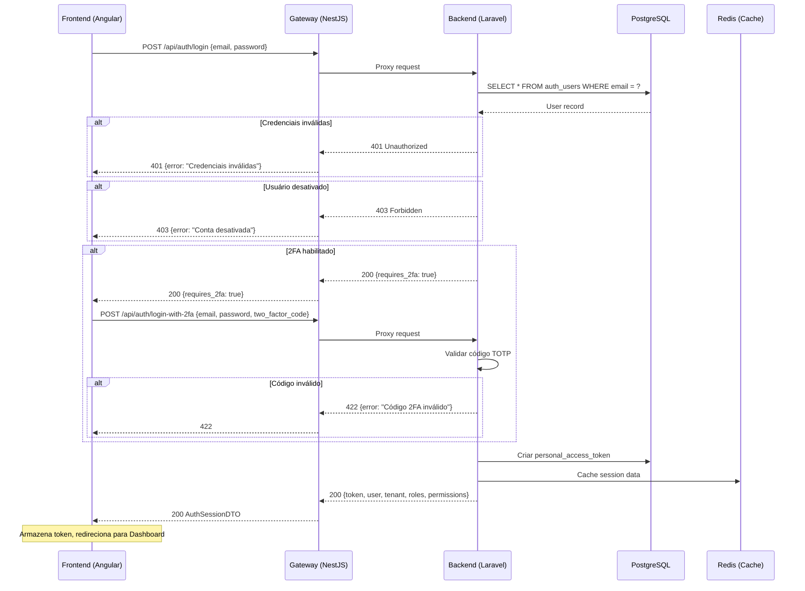
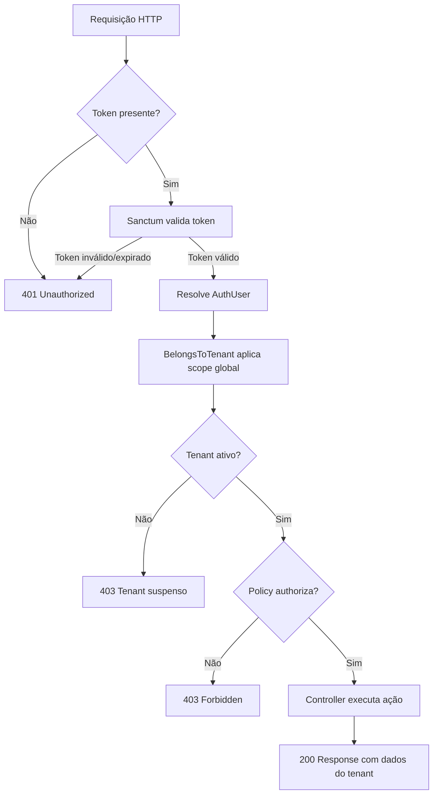

# PRD-AUTH-001 — Autenticação e Multi-Tenancy

> **Módulo:** Auth
> **Status:** aprovado
> **Autor:** PM
> **Data:** 2026-03-25
> **Versão:** 1.0

---

## 1. CONTEXTO

O módulo Auth é a fundação do AgentFlix — toda operação no sistema depende dele. Sem autenticação robusta e isolamento de dados entre empresas (tenants), nenhum outro módulo pode operar com segurança.

O AgentFlix é um SaaS multi-tenant para comunicação inteligente com clientes via WhatsApp, integrando CRM, billing e IA. Cada empresa (tenant) opera em total isolamento: seus contatos, conversas, cobranças e configurações são invisíveis para outras empresas. O módulo Auth garante que esse contrato de isolamento seja respeitado em toda requisição.

**Problema que resolve:**
- Autenticação segura de usuários e máquinas (API tokens) em ambiente multi-tenant
- Controle granular de acesso com RBAC (Role-Based Access Control) configurável por tenant
- Isolamento completo de dados entre empresas, prevenindo data leaks cross-tenant
- Suporte a 2FA (Two-Factor Authentication) para segurança adicional

**Valor de negócio:**
- Compliance com LGPD e políticas de segurança corporativas
- Possibilita onboarding self-service de novas empresas
- Base para todas as funcionalidades de billing (quem pode cobrar), CRM (quem pode ver contatos) e Chat (quem pode atender)

---

## 2. OBJETIVO

Prover autenticação segura com tokens Laravel Sanctum, controle de acesso baseado em roles e permissões (RBAC) via Spatie Permissions, autenticação de dois fatores (2FA via TOTP), gerenciamento de perfil e avatar, e isolamento completo de dados entre tenants.

---

## 3. REQUISITOS

### 3.1 Regras de Negócio

| ID | Regra | Prioridade |
|--------|-------|------------|
| RN-001 | Todo usuário deve pertencer a exatamente uma empresa (tenant), definido pelo campo `tenant_id` obrigatório e não-nulo | Alta |
| RN-002 | Tokens Sanctum devem ter expiração configurável via `SANCTUM_EXPIRATION` (env var, em minutos) | Alta |
| RN-003 | Cada empresa tem seu próprio conjunto de roles e permissões (scoped por `guard_name: sanctum`) | Alta |
| RN-004 | Usuários podem ter múltiplas roles simultaneamente | Média |
| RN-005 | Toda query de dados deve ser filtrada pelo `tenant_id` do usuário autenticado (trait `BelongsToTenant`) | Crítica |
| RN-006 | O role `super-admin` é o único que pode acessar dados cross-tenant e gerenciar a plataforma | Alta |
| RN-007 | Login deve usar email + senha, com suporte opcional a 2FA (TOTP) | Alta |
| RN-008 | Senhas devem usar bcrypt via cast `hashed` do Laravel (rounds configuráveis via `bcrypt.rounds`) | Alta |
| RN-009 | Email deve ser único dentro do mesmo tenant (permitido o mesmo email em tenants diferentes) | Alta |
| RN-010 | Usuários possuem estados `is_active` — quando desativado, o login deve ser recusado | Alta |
| RN-011 | Todas as alterações em entidades Auth devem gerar registros de auditoria (via `OwenIt\Auditing`) | Média |
| RN-012 | Soft delete obrigatório em `AuthUser` — exclusões lógicas, nunca físicas | Alta |
| RN-013 | UUIDs como chave primária em todas as tabelas do módulo — nunca auto-increment | Alta |
| RN-014 | Rate limiting agressivo em rotas públicas: máximo 5 requisições/minuto para login e reset de senha | Alta |
| RN-015 | 2FA usa TOTP (Time-based One-Time Password) com recovery codes para recuperação | Média |

### 3.2 Fluxos

#### Fluxo Principal — Login Simples

1. Usuário envia `POST /api/auth/login` com `{ email, password }`
2. `AuthLoginRequest` valida input (email obrigatório, formato válido; senha obrigatória)
3. `AuthLoginActions::login()` verifica credenciais via `Auth::attempt()`
4. Se usuário tem 2FA habilitado → retorna `AuthTwoFactorChallengeDTO` com status `2fa_required`
5. Se credenciais válidas sem 2FA → gera token Sanctum com abilities baseadas nas permissões do usuário
6. Retorna `AuthSessionDTO` contendo: token, dados do usuário, dados da empresa (tenant), roles e permissões
7. Frontend armazena token e inclui em todas as requisições subsequentes como `Authorization: Bearer {token}`

#### Fluxo de Login com 2FA

1. Após login retornar `2fa_required`, frontend exibe tela de código TOTP
2. Usuário envia `POST /api/auth/login-with-2fa` com `{ email, password, two_factor_code }`
3. `AuthTotpService` valida o código TOTP contra o `two_factor_secret` do usuário
4. Se código inválido → retorna 422 com mensagem de erro
5. Se código válido → gera token Sanctum e retorna `AuthSessionDTO`

#### Fluxo de Registro de Empresa (Onboarding via Platform)

1. SuperAdmin cria nova empresa via módulo Platform
2. Sistema cria registro `PlatformTenant` com UUID
3. Sistema cria `AuthUser` admin vinculado ao novo tenant
4. Sistema cria roles padrão para o tenant (Gerente, Atendente)
5. Sistema atribui role `Gerente` (admin do tenant) ao usuário criado
6. Novo admin recebe credenciais e pode convidar outros usuários

#### Fluxo de Autorização (Middleware Stack)

1. Requisição chega com header `Authorization: Bearer {token}`
2. Middleware `auth:sanctum` valida o token e resolve o `AuthUser`
3. Trait `BelongsToTenant` aplica scope global filtrando por `tenant_id` do usuário
4. Controller chama `$this->authorize()` que delega para a Policy correspondente
5. Policy verifica se o usuário possui a permissão necessária via Spatie
6. Se autorizado → Controller executa ação; Se não → retorna 403

#### Fluxo de Gestão de Perfil

1. Usuário autenticado chama `GET /api/auth/profile` para visualizar dados
2. Pode atualizar nome, email, telefone via `PUT /api/auth/profile`
3. Pode alterar senha via `PUT /api/auth/profile/password` (requer senha atual)
4. Pode fazer upload/delete de avatar via `POST/DELETE /api/auth/profile/avatar`

#### Fluxo de Refresh de Token

1. Frontend detecta token próximo da expiração
2. Envia `POST /api/auth/refresh` com token atual
3. Sistema invalida token atual e gera novo token
4. Retorna nova `AuthSessionDTO` com token renovado

#### Fluxo de Reset de Senha

1. Usuário envia `POST /api/auth/forgot-password` com `{ email }`
2. Sistema envia email com link/token de reset (se email existir — sem revelar existência)
3. Usuário clica no link e envia `POST /api/auth/reset-password` com `{ token, email, password, password_confirmation }`
4. Sistema valida token e atualiza senha

### 3.3 Validações

| Campo | Regras | Escopo |
|-------|--------|--------|
| `email` | Obrigatório, formato email válido, único por tenant | Login, Registro, Perfil |
| `password` | Obrigatório no login, mínimo 8 caracteres | Login, Registro, Reset |
| `password_confirmation` | Deve coincidir com `password` | Reset, Alteração de senha |
| `current_password` | Obrigatório e válido ao alterar senha | Perfil |
| `name` | Obrigatório, string, máximo 255 | Registro, Perfil |
| `phone` | Opcional, formato telefone válido | Registro, Perfil |
| `two_factor_code` | Obrigatório no fluxo 2FA, 6 dígitos numéricos | Login 2FA |
| `role_id` | UUID válido, role deve existir no tenant | Gestão de Usuários |
| `tenant_id` | UUID válido, tenant deve existir e estar ativo | Cadastro (interno) |
| `avatar` | Imagem (jpg, png, webp), máximo 2MB | Upload de Avatar |

### 3.4 Estados

#### Usuário (`AuthUser`)

| Estado | Campo | Descrição | Transições |
|--------|-------|-----------|------------|
| Ativo | `is_active = true` | Pode fazer login e operar | → Desativado (toggle) |
| Desativado | `is_active = false` | Login negado, dados preservados | → Ativo (toggle) |
| Deletado | `deleted_at != null` | Soft delete, invisível em queries | → Restaurado (admin) |

#### Empresa (PlatformTenant)

| Estado | Descrição | Transições |
|--------|-----------|------------|
| active | Empresa operando normalmente | → suspended, → inactive |
| suspended | Temporariamente bloqueada (inadimplência, violação) | → active, → inactive |
| inactive | Desativada permanentemente | → active (reativação manual) |

#### 2FA

| Estado | Descrição | Transições |
|--------|-----------|------------|
| disabled | 2FA não configurado | → setup (iniciar configuração) |
| setup | QR code gerado, aguardando validação | → enabled (validar código), → disabled (cancelar) |
| enabled | 2FA ativo e funcional | → disabled (desativar com senha) |

---

## 4. DIAGRAMA DE FLUXO

### 4.1 Fluxo de Autenticação



### 4.2 Fluxo de Autorização por Requisição



---

## 5. CRITÉRIOS DE ACEITAÇÃO

| ID | Critério | Verificação |
|--------|----------|-------------|
| CA-001 | Usuário consegue fazer login com email + senha e recebe token Sanctum válido | Teste Feature: `POST /api/auth/login` retorna 200 com `token` |
| CA-002 | Requisições sem token válido retornam 401 Unauthorized | Teste Feature: requisição sem header `Authorization` retorna 401 |
| CA-003 | Requisições sem permissão adequada retornam 403 Forbidden | Teste Feature: usuário sem role tenta acessar rota protegida → 403 |
| CA-004 | Dados de um tenant nunca são acessíveis por outro tenant | Teste Feature: criar 2 tenants, user A não vê dados do tenant B |
| CA-005 | Roles e permissões são configuráveis por empresa | Teste Feature: criar role custom com permissões específicas por tenant |
| CA-006 | Token expira conforme `SANCTUM_EXPIRATION` | Teste Feature: token expirado retorna 401 |
| CA-007 | SuperAdmin pode gerenciar múltiplos tenants | Teste Feature: `super-admin` acessa dados cross-tenant |
| CA-008 | Logout invalida o token do usuário | Teste Feature: `POST /api/auth/logout` → token anterior retorna 401 |
| CA-009 | Login com 2FA exige código TOTP válido | Teste Feature: login com 2FA sem código → 200 `requires_2fa`; com código → 200 `token` |
| CA-010 | Usuário desativado não consegue fazer login | Teste Feature: `is_active = false` → login retorna 403 |
| CA-011 | Refresh de token gera novo token e invalida o anterior | Teste Feature: `POST /api/auth/refresh` retorna novo token, antigo invalida |
| CA-012 | Rate limiting bloqueia após 5 tentativas/minuto em login | Teste Feature: 6ª tentativa retorna 429 |
| CA-013 | Alterações em usuários/roles geram registros de auditoria | Teste Feature: update em user → registro em `audits` table |
| CA-014 | Upload de avatar aceita jpg/png/webp até 2MB | Teste Feature: upload válido → 200; arquivo 3MB → 422 |

---

## 6. CONTRATOS E REGRAS EXPLÍCITAS

### Segurança (Invioláveis)

- **NUNCA** retornar dados de outro tenant em nenhuma resposta
- **NUNCA** logar tokens, senhas, `two_factor_secret` ou API keys
- **NUNCA** usar `$guarded = []` — sempre `$fillable` explícito
- **NUNCA** usar auto-increment — sempre UUIDs como PK

### Padrões de Código

- **SEMPRE** usar `$this->authorize()` em controllers (delega para Policy)
- **SEMPRE** aplicar trait `BelongsToTenant` em models com dados de tenant
- **SEMPRE** validar via FormRequest antes de processar qualquer input
- **SEMPRE** usar `declare(strict_types=1)` em todo arquivo PHP
- **SEMPRE** marcar Controllers, Actions e DTOs como `final class`
- **SEMPRE** usar eager loading — nunca queries N+1
- **SEMPRE** manter `$hidden` com campos sensíveis (`password`, `remember_token`, `two_factor_secret`, `two_factor_recovery_codes`)

### Fluxo DDD

```
Request → FormRequest (validação) → Controller → DTO::fromRequest() → Action → Resource (resposta)
```

---

## 7. FORMATO DE SAÍDA

### 7.1 Login Response (200)

```json
{
  "success": true,
  "message": "Login realizado com sucesso",
  "data": {
    "token": "1|abc123def456...",
    "user": {
      "id": "550e8400-e29b-41d4-a716-446655440000",
      "name": "Rafael Silva",
      "email": "rafael@empresa.com",
      "phone": "+5511999887766",
      "avatar_url": "https://storage.agentflix.com/avatars/550e8400.jpg",
      "is_active": true,
      "two_factor_enabled": false
    },
    "tenant": {
      "id": "660e8400-e29b-41d4-a716-446655440001",
      "name": "Empresa Exemplo",
      "status": "active"
    },
    "roles": ["Gerente"],
    "permissions": [
      "auth.users.list",
      "auth.users.create",
      "auth.users.update",
      "auth.roles.list",
      "crm.contacts.list",
      "chat.conversations.list"
    ]
  }
}
```

### 7.2 Me Response (200)

```json
{
  "success": true,
  "message": "Perfil carregado",
  "data": {
    "user": { "..." },
    "tenant": { "..." },
    "roles": ["Gerente"],
    "permissions": ["..."],
    "menu": [
      {
        "label": "Dashboard",
        "icon": "dashboard",
        "route": "/dashboard",
        "children": []
      },
      {
        "label": "CRM",
        "icon": "contacts",
        "route": "/crm",
        "children": [
          { "label": "Contatos", "route": "/crm/contacts" },
          { "label": "Pipeline", "route": "/crm/pipeline" }
        ]
      }
    ]
  }
}
```

### 7.3 2FA Challenge Response (200)

```json
{
  "success": true,
  "message": "2FA requerido",
  "data": {
    "requires_2fa": true,
    "user_id": "550e8400-e29b-41d4-a716-446655440000"
  }
}
```

### 7.4 Error Response (401 / 403 / 422 / 429)

```json
{
  "success": false,
  "message": "Credenciais inválidas",
  "errors": {
    "email": ["O campo email é obrigatório."]
  }
}
```

---

## 8. ENTIDADES E RELACIONAMENTOS

### Tabelas do Módulo Auth

| Tabela | PK | Tenant-scoped | Descrição |
|--------|-----|--------------|-----------|
| `auth_users` | UUID | Sim (`tenant_id`) | Usuários do sistema |
| `auth_roles` | UUID | Sim (via `Spatie`) | Roles (papéis) por tenant |
| `auth_permissions` | UUID | Não | Permissões globais do sistema |
| `model_has_roles` | Composta | — | Associação user ↔ role |
| `model_has_permissions` | Composta | — | Associação user ↔ permission (diretas) |
| `role_has_permissions` | Composta | — | Associação role ↔ permission |
| `personal_access_tokens` | UUID | Sim (`tokenable_id`) | Tokens Sanctum |
| `audits` | UUID | Sim | Registros de auditoria |

### Roles Padrão

| Constante | Valor | Descrição |
|-----------|-------|-----------|
| `SUPER_ADMIN` | `super-admin` | Acesso total cross-tenant (plataforma) |
| `MANAGER` | `Gerente` | Admin do tenant — gestão completa |
| `AGENT` | `Atendente` | Operador — acesso limitado |

---

## 9. ENDPOINTS

| Método | Rota | Auth | Descrição |
|--------|------|------|-----------|
| POST | `/api/auth/login` | Não | Login com email + senha |
| POST | `/api/auth/login-with-2fa` | Não | Login com 2FA |
| POST | `/api/auth/forgot-password` | Não | Solicitar reset de senha |
| POST | `/api/auth/reset-password` | Não | Resetar senha com token |
| GET | `/api/auth/me` | Sim | Dados do usuário autenticado |
| POST | `/api/auth/logout` | Sim | Encerrar sessão |
| POST | `/api/auth/refresh` | Sim | Renovar token |
| GET | `/api/auth/get-menu` | Sim | Menu de navegação |
| GET | `/api/auth/profile` | Sim | Ver perfil |
| PUT | `/api/auth/profile` | Sim | Atualizar perfil |
| PUT | `/api/auth/profile/password` | Sim | Alterar senha |
| POST | `/api/auth/profile/avatar` | Sim | Upload de avatar |
| DELETE | `/api/auth/profile/avatar` | Sim | Remover avatar |
| GET | `/api/auth/2fa/status` | Sim | Status do 2FA |
| POST | `/api/auth/2fa/setup` | Sim | Iniciar configuração 2FA |
| POST | `/api/auth/2fa/validate` | Sim | Validar setup 2FA |
| POST | `/api/auth/2fa/disable` | Sim | Desabilitar 2FA |
| POST | `/api/auth/2fa/recovery-codes` | Sim | Regenerar recovery codes |
| GET | `/api/auth/roles` | Sim | Listar roles do tenant |
| POST | `/api/auth/roles` | Sim | Criar role |
| GET | `/api/auth/roles/permissions` | Sim | Listar todas as permissões |
| GET | `/api/auth/roles/{id}` | Sim | Detalhes de um role |
| PUT | `/api/auth/roles/{id}` | Sim | Atualizar role |
| DELETE | `/api/auth/roles/{id}` | Sim | Excluir role |
| GET | `/api/auth/users` | Sim | Listar usuários do tenant |
| POST | `/api/auth/users` | Sim | Criar usuário |
| GET | `/api/auth/users/{id}` | Sim | Detalhes de um usuário |
| PUT | `/api/auth/users/{id}` | Sim | Atualizar usuário |
| DELETE | `/api/auth/users/{id}` | Sim | Excluir usuário (soft delete) |
| POST | `/api/auth/users/{id}/toggle` | Sim | Ativar/desativar usuário |
| POST | `/api/auth/users/{id}/avatar` | Sim | Upload de avatar do usuário |
| DELETE | `/api/auth/users/{id}/avatar` | Sim | Remover avatar do usuário |

---

## 10. DEPENDÊNCIAS

### Internas (Módulos AgentFlix)

| Módulo | Relação | Descrição |
|--------|---------|-----------|
| Platform | Auth depende de | `PlatformTenant` é o model de tenant referenciado por `AuthUser.tenant_id` |
| Shared | Auth depende de | `BelongsToTenant` trait, `BaseController`, utilitários |

### Externas (Pacotes)

| Pacote | Versão | Uso |
|--------|--------|-----|
| `laravel/sanctum` | ^4.x | Autenticação via API tokens |
| `spatie/laravel-permission` | ^6.x | RBAC — roles e permissões |
| `owen-it/laravel-auditing` | ^13.x | Auditoria de alterações |

---

## Histórico de Revisões

| Data | Versão | Autor | Mudança |
|------|--------|-------|---------|
| 2026-03-25 | 1.0 | PM | Criação inicial baseada em análise do código existente |
