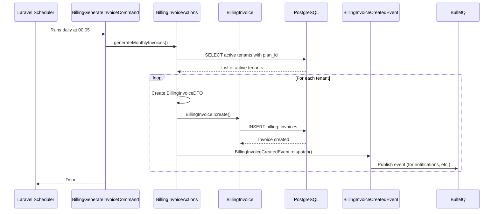
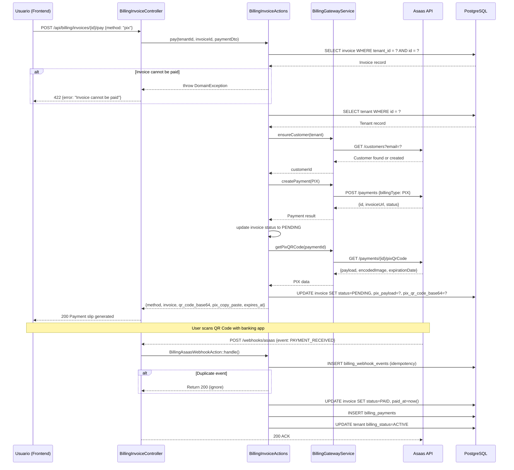
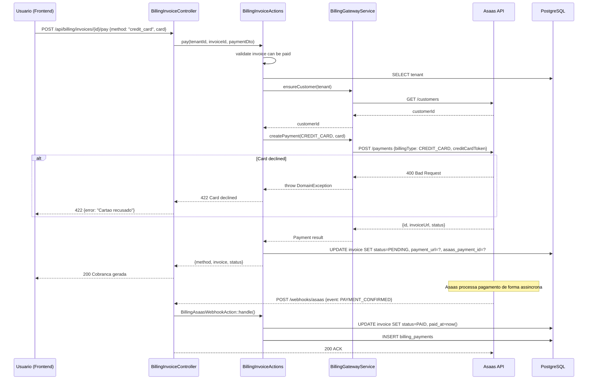
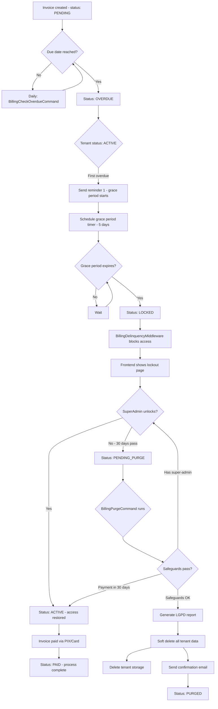
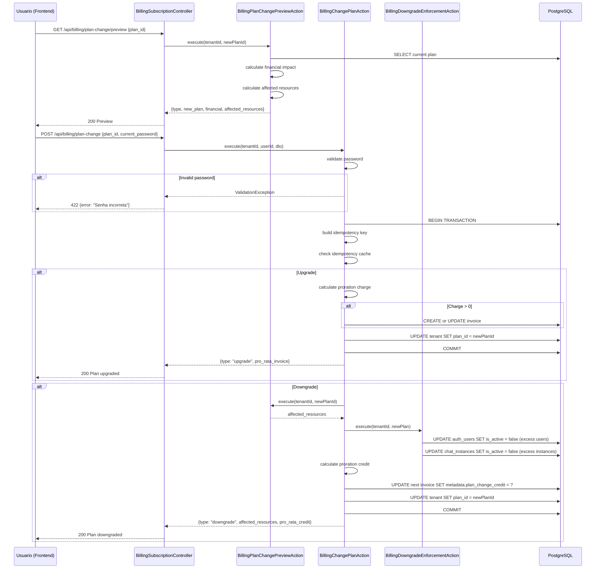
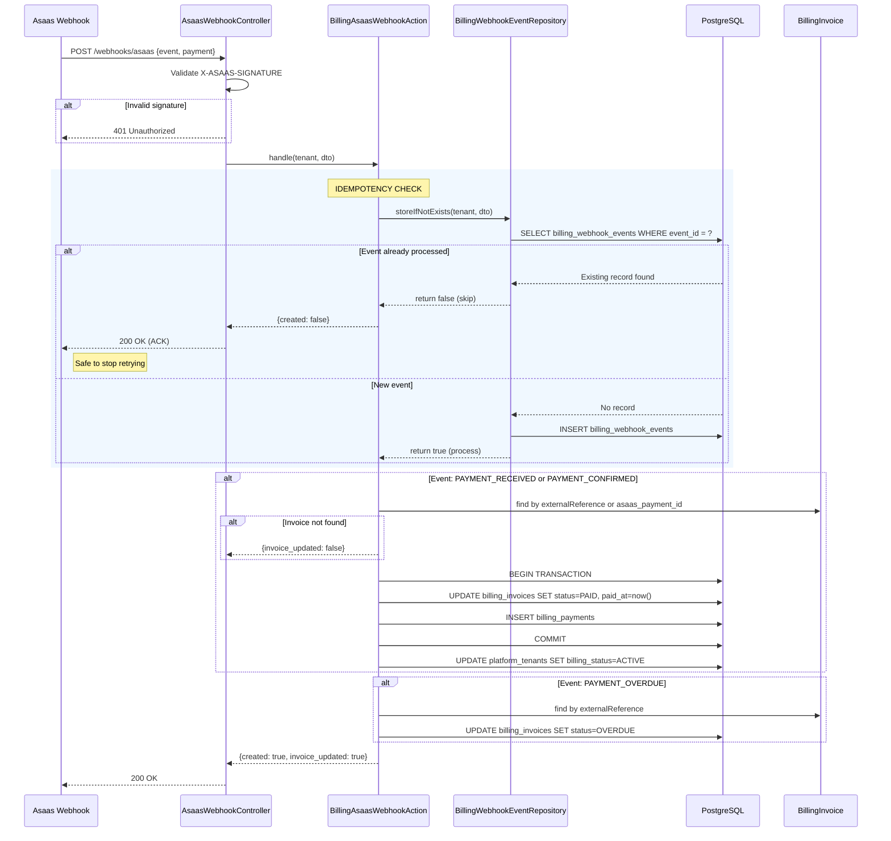
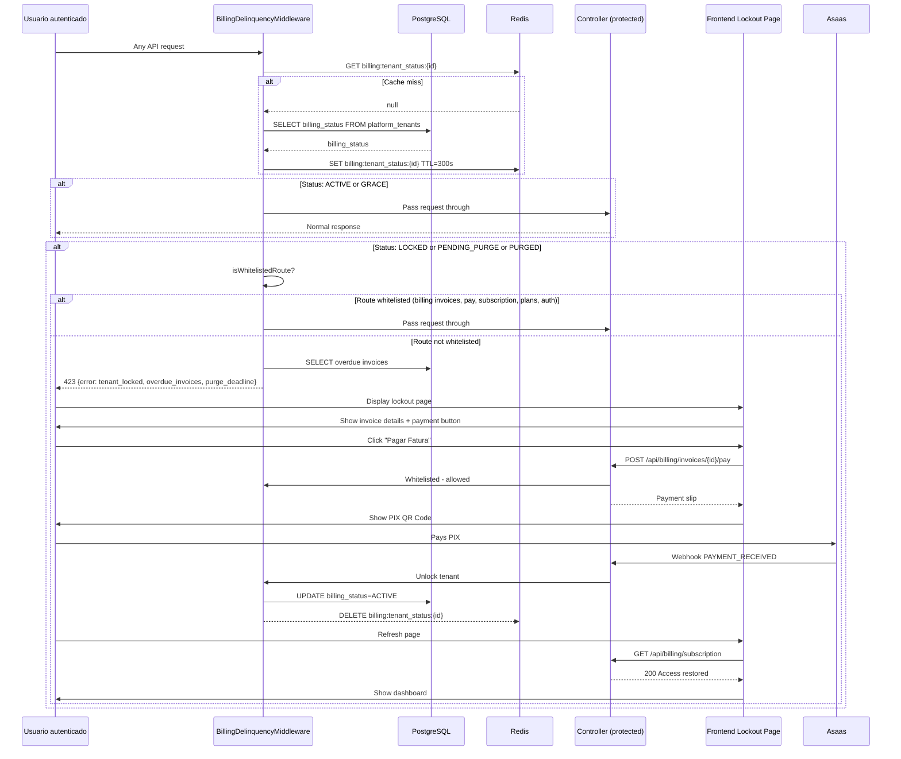
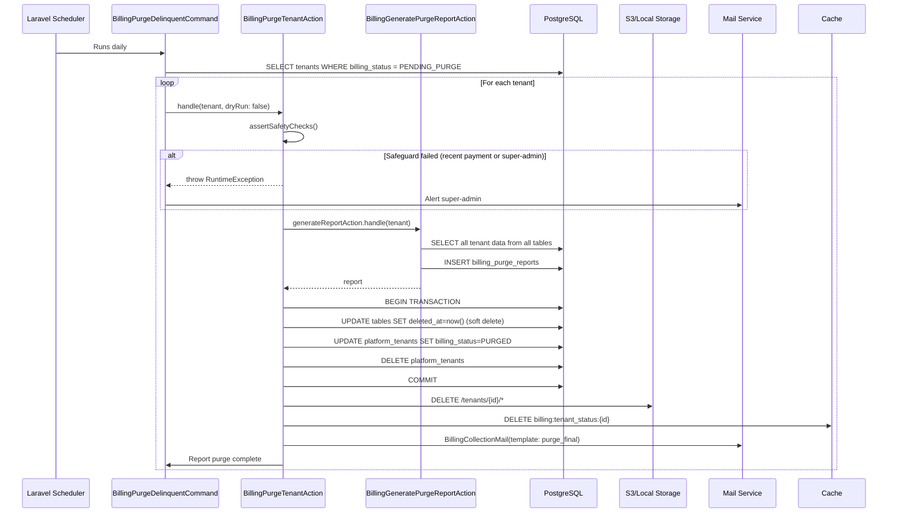
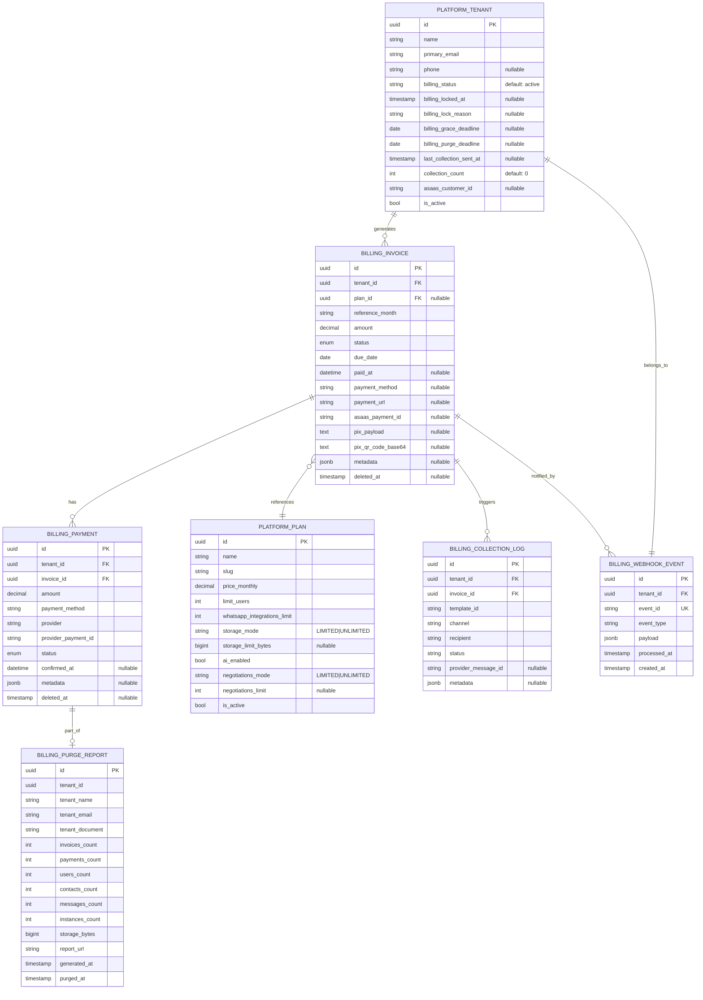
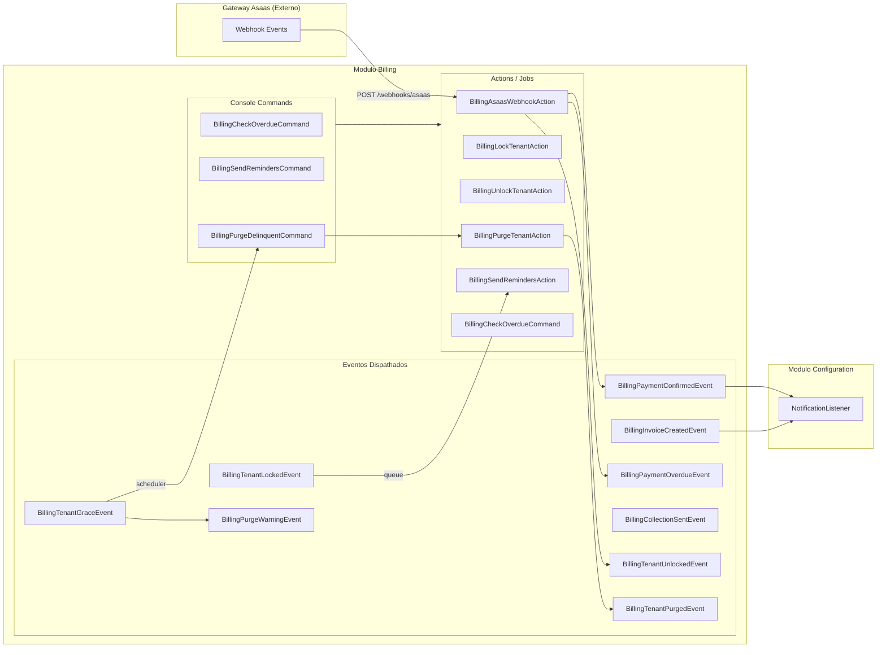

# PRD-BILLING-001 — Modulo de Billing AgentFlix

> **Modulo:** Billing
> **Status:** aprovado
> **Autor:** PM
> **Data:** 2026-03-28
> **Versao:** 1.0
> **Tags:** billing, cobrancas, inadimplencia, Asaas, PIX, cartao-de-credito, multi-tenant, RGPD-LGPD

---

## 1. CONTEXTO

O modulo de Billing (Cobranca) e o nucleo financeiro do AgentFlix. Ele gerencia todo o ciclo de vida da receita recorrente da plataforma: geracao de faturas mensais, processamento de pagamentos via gateway Asaas (PIX e Cartao de Credito), gestao de inadimplencia com politica progressiva de bloqueios, cambio de planos com prorata, e purgacao de tenants delinquentos em conformidade com a LGPD.

O AgentFlix e uma plataforma SaaS multi-tenant para comunicacao inteligente via WhatsApp com CRM, billing e IA integrados. O modulo Billing e responsavel por garantir a sustentabilidade financeira da operacao, cobrindo todo o processo desde a emissao da fatura mensal ate a remocao definitiva de dados de tenants que nao regularizam sua situacao.

### 1.1 Posicionamento no Ecossistema

O modulo Billing interage com praticamente todos os outros modulos da plataforma:

- **Auth**: Identifica o tenant atraves do `tenant_id` do usuario autenticado; bloqueia usuarios de tenants inadimplentes
- **Platform**: Leh e atualiza o plano ativo (`PlatformPlan`) e status de inadimplencia do tenant (`PlatformTenant.billing_status`)
- **CRM**: Conta negociacoes ativas para calcular uso no preview de troca de plano
- **Chat**: Conta instancias ativas de WhatsApp para limitar no downgrade de plano
- **Configuration**: Escuta eventos de fatura criada (`BillingInvoiceCreatedEvent`) e pagamento confirmado (`BillingPaymentConfirmedEvent`)
- **Shared**: Utiliza `BelongsToTenant` em todos os models, `AuditLogger` para auditoria de bloqueios e desbloqueios, e `BaseController` para padronizar respostas

O gateway Asaas (https://www.asaas.com) e o unico provedor de pagamento integrado. Ele fornece: geracao de cobranca PIX (com QR Code e payload), cobranca de cartao de credito, notificacoes de webhook para confirmacao de pagamento e aviso de vencimento, e gestao de clientes (criacao e recuperacao de customer_id por tenant).

### 1.2 Historico e Evolucao

O modulo Billing foi construindo em fases. Inicialmente, as faturas eram geradas manualmente e os pagamentos eram registrados de forma simplificada. Com a evolucao, o modulo passou a incluir:

- **Fase 1**: CRUD de faturas com status manual (draft, pending, paid, cancelled)
- **Fase 2**: Integracao com Asaas via `BillingGatewayService` para geracao automatica de cobranca PIX e cartao de credito
- **Fase 3**: Sistema de inadimplencia progressiva (grace period de 5 dias, bloqueio, purge em 30 dias)
- **Fase 4**: Troca de planos com prorata (upgrade gera cobranca proporcional; downgrade gera credito)
- **Fase 5**: Webhooks Asaas com idempotencia via `BillingWebhookEventRepository` para atualizacao automatica de status
- **Fase 6**: Purgacao de tenants com geracao de relatorio LGPD

A arquitetura atual e completamente DDD: Controllers delegates para Actions, Actions retornam DTOs, e Resources formatam a resposta. Nenhuma logica de negocio reside nos controllers.

### 1.3 Arquitetura Geral

A arquitetura do modulo Billing segue o padrao DDD com Actions puras e stateless:

```
HTTP Request
  -> FormRequest (validacao)
    -> Controller (autorizacao via Policy + delegate)
      -> DTO::fromRequest()
        -> Action::execute() (logica de negocio pura)
          -> Model::update() / Model::create()
          -> BillingGatewayService (chamada externa ao Asaas)
          -> Event::dispatch() (eventos internos)
        -> Resource::make() (formatacao de resposta)
  -> JsonResponse
```

Decisoes arquiteturais chave:

| Decisao | Justificativa |
|---------|--------------|
| Idempotencia via Redis SETNX e `billing_webhook_events` | Webhooks Asaas podem chegar multiplas vezes; idempotencia previne cobrancas duplicadas e atualizacoes inconsistentes |
| `BillingDelinquencyMiddleware` como middleware global | Garante que tenants bloqueados nunca acessem funcionalidades operacionais; whitelist permite apenas rotas de cobranca e autenticação basica |
| Plan Change com idempotency key em cache | Evita que o mesmo usuario confirme a troca de plano multiplas vezes por clique duplo |
| Downgrade enforcement desativa usuarios/instancias por "mais antigos primeiro" | Ordeana por `updated_at` e `created_at` para minimizar impacto operacional — usuarios que mais usam a plataforma sao protegidos |
| Purge com dry-run obrigatorio e safeguards | Gera relatorio LGPD antes de qualquer exclusao; bloqueia purge se houve pagamento nos ultimos 30 dias ou se existe super-admin |
| Rate limiting em `ProcessPaymentJob` via `RateLimitedJob::forPayment()` | Pagamentos sao operacoes criticas; rate limiting protege contra sobrecarga no gateway Asaas |

### 1.4 Modelo de Receita

O AgentFlix opera com receita recorrente mensal (MRR - Monthly Recurring Revenue). Cada tenant e cobrado mensalmente com base no plano ativo. O fluxo financeiro e:

1. No dia 1 de cada mes (ou data configurada), o sistema gera uma fatura (`BillingInvoice`) para cada tenant ativo com valor igual ao preco mensal do plano
2. A fatura tem vencimento em 7 dias (configuravel)
3. Se nao paga ate o vencimento, o tenant entra em inadimplencia progressiva
4. Se o tenant muda de plano no meio do mes, uma cobranca ou credito proporcional (prorata) e gerado

### 1.5 Modelo de Inadimplencia

A inadimplencia segue um modelo progressivo com 5 estagios:

```
ATIVO (sem dividas)
  |
  v [fatura vence e nao e paga]
GRACE (periodo de gracia - 5 dias)
  - Envio de lembretes por email e WhatsApp
  - Tenant continua com acesso total
  |
  v [5 dias sem pagamento]
BLOQUEADO (LOCKED)
  - Middleware bloqueia todas as rotas exceto whitelist
  - Frontend exibe tela de lockout com fatura em aberto
  - SuperAdmin pode desbloquear manualmente
  |
  v [30 dias sem pagamento apos bloqueio]
PENDENTE DE EXCLUSAO (PENDING_PURGE)
  - Purge agendado
  - Safeguards verificados
  - SuperAdmin pode desbloquear
  |
  v [prazo expirado ou acao manual]
EXCLUIDO (PURGED)
  - Soft delete de todos os dados do tenant
  - Relatorio LGPD gerado
  - Email de confirmacao enviado
  - Storage limpo
```

---

## 2. OBJETIVO

Prover um sistema completo de gestao financeira multi-tenant cobrindo: emissao e gestao de faturas mensais, processamento de pagamentos via Asaas (PIX e Cartao de Credito) com idempotencia, gestao de inadimplencia com politica progressiva de bloqueios e purga, cambio de planos com calculo de prorata, envios de lembretes de cobranca por email e WhatsApp, e purgacao de tenants em conformidade com a LGPD.

### 2.1 Objetivos Funcionais

| ID | Objetivo | Descricao |
|----|----------|-----------|
| OF-01 | Emissao de Faturas | Geracao automatica mensal de faturas para todos os tenants ativos |
| OF-02 | Cobranca PIX | Geracao de cobranca PIX com QR Code estatico e copia-e-cola |
| OF-03 | Cobranca Cartao | Geracao de cobranca de cartao via Asaas Hosted Checkout |
| OF-04 | Webhook Asaas | Processamentoconfiavel de webhooks de confirmacao e vencimento |
| OF-05 | Inadimplencia | Politica progressiva de 5 estagios (GRACE -> LOCKED -> PENDING_PURGE -> PURGED) |
| OF-06 | Troca de Planos | Upgrade/downgrade com calculo prorata e preview de impacto |
| OF-07 | Lembretes | Envio automatico de lembretes por email e WhatsApp |
| OF-08 | Purga LGPD | Exclusao de tenants inadimplentes com inventario e relatorio |

### 2.2 Objetivos de Seguranca

| ID | Objetivo | Descricao |
|----|----------|-----------|
| OS-01 | Idempotencia | Nenhum pagamento processado em duplicidade |
| OS-02 | RBAC | Autorizacao em todas as operacoes de billing |
| OS-03 | Rate Limiting | Protecao contra sobrecarga no gateway Asaas |
| OS-04 | Auditoria | Log completo de todas as acoes de bloqueio e desbloqueio |
| OS-05 | Mascaramento | Dados sensiveis (PIX payload, QR Code) nunca logados |

### 2.3 Objetivos de Compliance

| ID | Objetivo | Descricao |
|----|----------|-----------|
| OC-01 | LGPD | Purga de tenants com relatorio de inventario pre-exclusao |
| OC-02 | Safeguards | Bloqueio de purge para tenants com pagamento recente |
| OC-03 | SuperAdmin Protection | Bloqueio de purge para tenants com super-admin ativo |
| OC-04 | Audit Trail | Relatorio LGPD armazenado por 5 anos |

### 2.4 O Que Nao E

O modulo NAO tem como objetivo:
- Ser um sistema contabil completo ou ERP
- ProcessarNotas fiscais (NF-e, NFC-e)
- Gerenciar folha de pagamento ou recursos humanos
- Integrar com gateways de pagamento diferentes do Asaas
- Fornecer西斯cai de credito ou financiamento

---

## 3. REGRAS DE NEGOCIO

### 3.1 Regras de Faturamento

| ID | Regra | Prioridade |
|----|-------|-----------|
| RN-BILL-001 | Toda fatura deve pertencer a exatamente um tenant, definido pelo campo `tenant_id` obrigatorio e nao-nulo | Critica |
| RN-BILL-002 | Faturas usam UUID como chave primaria — nunca auto-increment | Alta |
| RN-BILL-003 | O campo `reference_month` segue o formato `YYYY-MM` (ex: `2026-03`) | Alta |
| RN-BILL-004 | O valor `amount` da fatura e sempre em reais brasileiros (BRL), com 2 casas decimais | Alta |
| RN-BILL-005 | O campo `due_date` e obrigatorio e deve ser uma data futura ou igual a hoje no momento da criacao | Alta |
| RN-BILL-006 | Faturas com status `PAID` ou `CANCELLED` nao podem ser editadas nem deletadas | Critica |
| RN-BILL-007 | Apenas faturas com status `DRAFT`, `PENDING` ou `OVERDUE` podem ter cobranca gerada (metodo `canBePaid()`) | Critica |
| RN-BILL-008 | A geracao de cobranca Asaas deve criar ou atualizar o cliente do tenant (metodo `ensureCustomer()`) antes de criar o pagamento | Alta |
| RN-BILL-009 | Ao gerar cobranca PIX, o sistema deve buscar o QR Code via `getPixQRCode()` e armazenar `pix_payload` e `pix_qr_code_base64` na fatura | Alta |
| RN-BILL-010 | O campo `asaas_payment_id` deve armazenar o ID do pagamento no Asaas para rastreabilidade de webhook | Alta |
| RN-BILL-011 | Ao atualizar o status de uma fatura, todos os campos relacionados (`paid_at`, `payment_method`) devem ser atualizados atomicamente na mesma transacao | Alta |
| RN-BILL-012 | O recibo de pagamento (`receipt`) so esta disponivel para faturas com status `PAID` | Alta |
| RN-BILL-013 | SuperAdmin pode listar e gerenciar faturas de qualquer tenant usando `listForAdmin()` e `findAdmin()` | Alta |
| RN-BILL-014 | Filtros de listagem de faturas incluem: `status`, `reference_month`, `search`, `payment_method`, `due_date_from`, `due_date_to` | Media |
| RN-BILL-015 | Rate limiting em publicacacao de webhooks: ACK do webhook Asaas deve ser inferior a 150ms | Critica |
| RN-BILL-016 | Nenhuma informacao de cartao de credito e armazenada no sistema — todo o processo de cartao e feito diretamente no Asaas | Critica |

### 3.2 Regras de Inadimplencia

| ID | Regra | Prioridade |
|----|-------|-----------|
| RN-BILL-020 | Inadimplencia so entra em vigor quando `config('billing.delinquency.enabled')` e `true` | Alta |
| RN-BILL-021 | O `BillingDelinquencyMiddleware` deve resolver o `billing_status` do tenant via cache Redis com TTL configuravel (padrao: 300s) | Alta |
| RN-BILL-022 | Middleware desbloqueia automaticamente tenants que receberam pagamento via webhook Asaas, mesmo que o status anterior fosse `LOCKED` ou `PENDING_PURGE` | Alta |
| RN-BILL-023 | SuperAdmin tem acesso total a qualquer rota mesmo com tenant bloqueado (verificado via `isSuperAdmin()`) | Critica |
| RN-BILL-024 | O desbloqueio manual por SuperAdmin deve limpar todos os campos de inadimplencia: `billing_locked_at`, `billing_lock_reason`, `billing_grace_deadline`, `billing_purge_deadline`, `last_collection_sent_at`, `collection_count` | Alta |
| RN-BILL-025 | O bloqueio de tenant deve invalidar o cache Redis do status de billing (`billing:tenant_status:{id}`) | Alta |
| RN-BILL-026 | O SuperAdmin pode listar todos os tenants inadimplentes (`GET /api/admin/billing/delinquent`) | Alta |
| RN-BILL-027 | A listagem de tenants inadimplentes deve mostrar: `tenant_id`, `tenant_name`, `billing_status`, `days_overdue`, `overdue_invoices`, `oldest_due_date` | Alta |
| RN-BILL-028 | O comando `BillingCheckOverdueCommand` (scheduler) deve verificar faturas pendentes/vencidas diariamente e atualizar o status para `OVERDUE` | Alta |
| RN-BILL-029 | O comando `BillingSendRemindersCommand` (scheduler) deve enviar lembretes apenas em dias configurados no `billing.delinquency.reminders` | Media |
| RN-BILL-030 | Lembretes nao sao enviados fora do horario de quiet hours (padrao: 18h as 9h) | Media |
| RN-BILL-031 | Cada tenant recebe no maximo um lembrete por dia (verificacao por `last_collection_sent_at`) | Media |
| RN-BILL-032 | Lembretes sao enviados via email (para todos os admins do tenant) e opcionalmente via WhatsApp | Media |
| RN-BILL-033 | Todos os envios de lembrete sao registrados em `BillingCollectionLog` | Media |
| RN-BILL-034 | SuperAdmin recebe `BillingPurgeWarningEvent` 7 dias antes do purge automatico | Alta |
| RN-BILL-035 | Purge nao pode ocorrer se houve pagamento confirmado nos ultimos 30 dias | Critica |
| RN-BILL-036 | Purge nao pode ocorrer se existir usuario `super-admin` no tenant | Critica |
| RN-BILL-037 | O purge gera um `BillingPurgeReport` com inventario de todos os dados do tenant antes da exclusao | Alta |
| RN-BILL-038 | O purge faz soft delete em tabelas com `deleted_at` e delete fisico em tabelas sem este campo | Alta |
| RN-BILL-039 | O purge limpa todo o storage do tenant em `tenants/{tenant_id}` | Alta |
| RN-BILL-040 | Todo purge envia email de confirmacao para o `primary_email` do tenant com o link do relatorio LGPD | Media |

### 3.3 Regras de Pagamento

| ID | Regra | Prioridade |
|----|-------|-----------|
| RN-BILL-050 | Processamento de pagamento via webhook Asaas deve ser idempotente: o mesmo evento processado multiplas vezes produz o mesmo resultado | Critica |
| RN-BILL-051 | A idempotencia de webhook e garantida pela tabela `billing_webhook_events` (repository `BillingWebhookEventRepository`) | Critica |
| RN-BILL-052 | Ao receber `PAYMENT_RECEIVED` ou `PAYMENT_CONFIRMED` do Asaas, o sistema deve: (1) atualizar status da fatura para `PAID`; (2) registrar em `BillingPayment`; (3) desbloquear tenant se aplicavel | Critica |
| RN-BILL-053 | Ao receber `PAYMENT_OVERDUE` do Asaas, o sistema deve atualizar o status da fatura para `OVERDUE` | Alta |
| RN-BILL-054 | Se a fatura ja estava com status `PAID`, o webhook de confirmacao nao deve re-disparar eventos nem criar pagamentos duplicados | Alta |
| RN-BILL-055 | `ProcessPaymentJob` implementa `Idempotent` trait com TTL de 7 dias para evitar reprocessamento | Alta |
| RN-BILL-056 | `ProcessPaymentJob` implementa `RetryableWithBackoff` com delays: [30, 120, 300, 600, 1800] segundos | Alta |
| RN-BILL-057 | `ProcessPaymentJob` usa rate limiting via `RateLimitedJob::forPayment()` | Alta |
| RN-BILL-058 | Falhas por cartao invalido, saldo insuficiente ou fraude facam o job falhar imediatamente (sem retry) | Alta |
| RN-BILL-059 | `ProcessPaymentAction` usa cache Redis para idempotencia com TTL de 24h (86400s) | Alta |
| RN-BILL-060 | Metodos de pagamento aceitos: `pix` e `credit_card` | Alta |
| RN-BILL-061 | O metodo de pagamento e normalizado para minusculo: `PIX` -> `pix`, `CREDIT_CARD` -> `credit_card` | Media |

### 3.4 Regras de Troca de Plano

| ID | Regra | Prioridade |
|----|-------|-----------|
| RN-BILL-070 | Troca de plano requer confirmacao com a senha atual do usuario (`current_password`) | Critica |
| RN-BILL-071 | A troca de plano e protegida por idempotency key baseada em `tenant_id + user_id + plan_id` com cache de 30 segundos | Alta |
| RN-BILL-072 | Upgrade: cobranca prorata = `(novo_preco - preco_atual) * (dias_restantes / dias_no_mes)` | Alta |
| RN-BILL-073 | Downgrade: credito prorata = `(preco_atual - novo_preco) * (dias_restantes / dias_no_mes)` | Alta |
| RN-BILL-074 | Upgrade que resulta em cobranca zero (同一 plano ou mesmo preco) nao gera fatura | Alta |
| RN-BILL-075 | Creditos de downgrade sao aplicados na proxima fatura pendente via `metadata.plan_change_credit` | Alta |
| RN-BILL-076 | Downgrade desativa usuarios excedentes (ordem: mais antigos primeiro por `updated_at` e `created_at`) | Alta |
| RN-BILL-077 | Downgrade desativa instancias de WhatsApp excedentes (ordem: mais antigas primeiro por `created_at`) | Alta |
| RN-BILL-078 | Usuarios protegidos de desativacao: (1) usuario com email igual ao `primary_email` do tenant; (2) usuarios com role `super-admin` | Critica |
| RN-BILL-079 | Preview de troca de plano retorna: tipo (upgrade/downgrade), novo plano, calculo financeiro, recursos afetados (usuarios, instancias, storage) | Alta |
| RN-BILL-080 | Preview de troca de plano para o mesmo plano atual lanca `DomainException` com codigo `plan_unchanged` | Media |
| RN-BILL-081 | Troca de plano e executada em transacao database para garantir consistencia | Alta |
| RN-BILL-082 | Upgrade cria ou atualiza fatura do mes corrente com valor prorata se houver cobranca | Alta |

### 3.5 Regras de Cobranca e Colecao

| ID | Regra | Prioridade |
|----|-------|-----------|
| RN-BILL-100 | O sistema de cobranca executa `BillingCheckOverdueCommand` diariamente as 00:05 para verificar faturas pendentes/vencidas | Alta |
| RN-BILL-101 | Quando uma fatura vence e permanece pendente, o sistema aguarda 5 dias de grace period antes de bloquear o tenant | Alta |
| RN-BILL-102 | Durante o grace period, o sistema envia lembretes automaticos a cada 2 dias | Media |
| RN-BILL-103 | O tenant entra em status `LOCKED` apos 5 dias de inadimplencia sem regularizacao | Critica |
| RN-BILL-104 | O tenant entra em status `PENDING_PURGE` apos 30 dias adicionais (total 35 dias) de inadimplencia | Critica |
| RN-BILL-105 | SuperAdmin recebe email de aviso 7 dias antes do purge programadowa | Alta |
| RN-BILL-106 | SuperAdmin pode desbloquear tenant manualmente a qualquer momento via `POST /api/admin/billing/delinquent/{id}/unlock` | Alta |
| RN-BILL-107 | Ao desbloquear, todos os campos de inadimplencia sao limpos: `billing_locked_at`, `billing_lock_reason`, `billing_grace_deadline`, `billing_purge_deadline` | Alta |
| RN-BILL-108 | O webhook de pagamento confirmado (`PAYMENT_RECEIVED`) desbloqueia o tenant automaticamente, mesmo se status anterior era `LOCKED` | Alta |
| RN-BILL-109 | O comando `BillingSendRemindersCommand` respeita quiet hours (18h as 9h) para envio de emails | Media |
| RN-BILL-110 | Lembretes sao enviados apenas uma vez por dia por tenant, verificado por `last_collection_sent_at` | Media |
| RN-BILL-111 | O template de lembrete inclui: valor da fatura, data de vencimento, link para pagamento | Alta |
| RN-BILL-112 | Todos os envios de lembrete sao registrados em `BillingCollectionLog` com status (sent/failed) | Media |
| RN-BILL-113 | Falhas no envio de email nao bloqueiam o processo; apenas o log e registrado | Baixa |
| RN-BILL-114 | O `BillingDelinquencyMiddleware` cacheia o status de billing em Redis com TTL de 300 segundos | Alta |
| RN-BILL-115 | O cache de billing e invalidado automaticamente quando o tenant e desbloqueado | Alta |
| RN-BILL-116 | Rate limiting em `ProcessPaymentJob` usa `RateLimitedJob::forPayment()` para evitar sobrecarga | Alta |

### 3.6 Regras de Precificacao e Modelo de Receita

| ID | Regra | Prioridade |
|----|-------|-----------|
| RN-BILL-120 | O preco mensal do plano e definido em `platform_plans.price_monthly` | Alta |
| RN-BILL-121 | Faturas sao geradas com valor igual ao `price_monthly` do plano ativo no mes de referencia | Alta |
| RN-BILL-122 | Troca de plano mid-month gera cobranca ou credito proporcional aos dias restantes | Alta |
| RN-BILL-123 | Calculo de prorata upgrade: `(novo_preco - preco_atual) * (dias_restantes / dias_no_mes)` | Alta |
| RN-BILL-124 | Calculo de prorata downgrade: `(preco_atual - novo_preco) * (dias_restantes / dias_no_mes)` | Alta |
| RN-BILL-125 | Creditos de downgrade sao armazenados em `metadata.plan_change_credit` da proxima fatura | Media |
| RN-BILL-126 | Creditos de downgrade expiram em 90 dias se nao utilizados | Media |
| RN-BILL-127 | Metodos de pagamento aceitos: PIX (prioridade), Cartao de Credito | Alta |
| RN-BILL-128 | Taxas de cartao de credito ( Asaas cobra ~3.99%) sao de responsabilidade do tenant | Media |

### 3.7 Regras de Seguranca e Auditoria

| ID | Regra | Prioridade |
|----|-------|-----------|
| RN-BILL-090 | Toda acao de bloqueio (`BillingLockTenantAction`) deve registrar em `AuditLogger` com campos: `reason`, `billing_status` | Alta |
| RN-BILL-091 | Toda acao de desbloqueio (`BillingUnlockTenantAction`) deve registrar em `AuditLogger` | Alta |
| RN-BILL-092 | Logs nao devem conter tokens, senhas, numeros de cartao, `pix_payload` ou QR codes | Critica |
| RN-BILL-093 | Soft delete obrigatorio em todos os models do modulo Billing — nunca delete fisico | Alta |
| RN-BILL-094 | Campos sensiveis (`pix_payload`, `pix_qr_code_base64`) devem estar no `$hidden` de qualquer Resource exposta | Alta |
| RN-BILL-095 | Webhooks Asaas devem retornar HTTP 200 dentro de 150ms; o processamento assincrono deve ser feito via job | Critica |
| RN-BILL-096 | A porta X-ASAAS-WEBHOOK-SIGNATURE deve ser validada em todas as requisicoes de webhook | Critica |
| RN-BILL-097 | Rate limiting no endpoint de webhook: max 60 requisicoes por minuto por IP | Alta |
| RN-BILL-098 | Todo tenant novo comecara com `billing_status = ACTIVE` | Alta |

---

## 4. FLUXOS

### 4.1 Fluxo Principal — Emissao de Fatura Mensal



### 4.2 Fluxo de Pagamento via PIX



### 4.3 Fluxo de Pagamento via Cartao de Credito



### 4.4 Fluxo de Inadimplencia Progressiva



### 4.5 Fluxo de Troca de Plano (Upgrade e Downgrade)



### 4.6 Fluxo de Webhook Asaas (Idempotencia)



### 4.7 Fluxo de Lockout (Tenant Bloqueado)



### 4.8 Fluxo de Purge de Tenant (LGPD)



---

## 5. ENTIDADES E MODELOS

### 5.1 Tabela `billing_invoices`

A entidade central do modulo. Representa uma fatura mensal emitida para um tenant.

| Campo | Tipo | Descricao | Restricoes |
|-------|------|-----------|-----------|
| `id` | UUID (PK) | Identificador unico da fatura | PK, NOT NULL, unique |
| `tenant_id` | UUID (FK) | Tenant emitente da fatura | FK -> `platform_tenants.id`, NOT NULL, index |
| `plan_id` | UUID (FK, nullable) | Plano associated a fatura | FK -> `platform_plans.id`, NULLABLE |
| `reference_month` | string(7) | Mes de referencia (YYYY-MM) | NOT NULL, index |
| `amount` | decimal(10,2) | Valor total da fatura | NOT NULL, >= 0 |
| `status` | enum BillingInvoiceStatus | Status atual da fatura | NOT NULL, default: PENDING |
| `due_date` | date | Data de vencimento | NOT NULL |
| `paid_at` | datetime | Data/hora do pagamento | NULLABLE |
| `payment_method` | string(20) | Metodo utilizado: pix, credit_card | NULLABLE |
| `payment_url` | string(500) | URL da cobranca no Asaas | NULLABLE |
| `asaas_payment_id` | string(100) | ID do pagamento no Asaas | NULLABLE, unique |
| `pix_payload` | text | Payload PIX copy-paste | NULLABLE |
| `pix_qr_code_base64` | text | QR Code PIX em base64 | NULLABLE |
| `metadata` | jsonb | Dados adicionais (creditos, prorata) | NULLABLE |
| `created_at` | timestamp | Data de criacao | auto |
| `updated_at` | timestamp | Data de atualizacao | auto |
| `deleted_at` | timestamp | Soft delete | NULLABLE |

**Relacionamentos:**
- `tenant()`: BelongsTo -> `PlatformTenant` (via `BelongsToTenant`)
- `plan()`: BelongsTo -> `PlatformPlan`
- `payments()`: HasMany -> `BillingPayment`

**Metodos de negocio:**
- `isPaid()`: Retorna `true` se status e PAID
- `canBePaid()`: Retorna `true` se status e DRAFT, PENDING ou OVERDUE
- `markAsPaid()`: Atualiza status para PAID e define `paid_at`

### 5.2 Tabela `billing_payments`

Registra cada pagamento efetuado, vinculado a uma fatura.

| Campo | Tipo | Descricao | Restricoes |
|-------|------|-----------|-----------|
| `id` | UUID (PK) | Identificador unico | PK, NOT NULL |
| `tenant_id` | UUID (FK) | Tenant do pagamento | FK, NOT NULL |
| `invoice_id` | UUID (FK) | Fatura associada | FK -> `billing_invoices.id`, NOT NULL |
| `amount` | decimal(10,2) | Valor pago | NOT NULL |
| `payment_method` | string(20) | Metodo: pix, credit_card, boleto | NOT NULL |
| `provider` | string(20) | Provedor: asaas | NOT NULL |
| `provider_payment_id` | string(100) | ID no provedor | NOT NULL |
| `status` | enum BillingPaymentStatus | CONFIRMED ou REFUNDED | NOT NULL |
| `confirmed_at` | datetime | Data de confirmacao | NULLABLE |
| `metadata` | jsonb | Dados adicionais do provedor | NULLABLE |
| `created_at` | timestamp | Data de criacao | auto |
| `updated_at` | timestamp | Data de atualizacao | auto |
| `deleted_at` | timestamp | Soft delete | NULLABLE |

**Relacionamentos:**
- `invoice()`: BelongsTo -> `BillingInvoice`

### 5.3 Tabela `billing_collection_logs`

Log de todos os envios de lembrete de cobranca.

| Campo | Tipo | Descricao |
|-------|------|-----------|
| `id` | UUID (PK) | Identificador unico |
| `tenant_id` | UUID (FK) | Tenant notificado |
| `invoice_id` | UUID (FK) | Fatura em atraso |
| `template_id` | string(50) | ID do template utilizado |
| `channel` | string(20) | Canal: email ou whatsapp |
| `recipient` | string(255) | Email ou telefone |
| `status` | string(20) | sent ou failed |
| `provider_message_id` | string(100) | ID da mensagem no provedor |
| `metadata` | jsonb | Dados adicionais |
| `created_at` | timestamp | Data de envio |

### 5.4 Tabela `billing_webhook_events`

Tabela de idempotencia para webhooks Asaas.

| Campo | Tipo | Descricao |
|-------|------|-----------|
| `id` | UUID (PK) | Identificador unico |
| `tenant_id` | UUID (FK) | Tenant afetado |
| `event_id` | string(100) | ID unico do evento no Asaas |
| `event_type` | string(50) | Tipo: PAYMENT_RECEIVED, PAYMENT_OVERDUE, etc. |
| `payload` | jsonb | Corpo completo do webhook |
| `processed_at` | timestamp | Data de processamento |
| `created_at` | timestamp | Data de recebimento |

**Indice unico**: `(tenant_id, event_id)` — garante que cada evento so seja processado uma vez.

### 5.5 Tabela `billing_purge_reports`

Relatorio LGPD gerado antes do purge de um tenant.

| Campo | Tipo | Descricao |
|-------|------|-----------|
| `id` | UUID (PK) | Identificador unico |
| `tenant_id` | UUID | ID do tenant purgado |
| `tenant_name` | string(255) | Nome do tenant |
| `tenant_email` | string(255) | Email principal |
| `tenant_document` | string(20) | CNPJ/CPF do tenant |
| `invoices_count` | integer | Total de faturas |
| `payments_count` | integer | Total de pagamentos |
| `users_count` | integer | Total de usuarios |
| `contacts_count` | integer | Total de contatos CRM |
| `messages_count` | integer | Total de mensagens Chat |
| `instances_count` | integer | Total de instancias |
| `storage_bytes` | bigint | Tamanho do storage |
| `report_url` | string(500) | URL do relatorio (JSON exportado) |
| `generated_at` | timestamp | Data de geracao |
| `purged_at` | timestamp | Data do purge |

### 5.6 Campos Adicionais em `platform_tenants`

O modulo Billing estende `PlatformTenant` com campos de inadimplencia:

| Campo | Tipo | Descricao |
|-------|------|-----------|
| `billing_status` | enum BillingTenantStatus | Status de inadimplencia |
| `billing_locked_at` | timestamp | Data do bloqueio |
| `billing_lock_reason` | string(255) | Motivo do bloqueio |
| `billing_grace_deadline` | date | Fim do periodo de gracia |
| `billing_purge_deadline` | date | Prazo para purge |
| `last_collection_sent_at` | timestamp | Ultimo lembrete enviado |
| `collection_count` | integer | Contagem de lembretes |

### 5.7 Diagrama de Entidade-Relacionamento



---

## 6. ENDPOINTS

### 6.1 Faturas (BillingInvoiceController)

| Metodo | Rota | Auth | Permissao | Descricao |
|--------|------|------|-----------|-----------|
| GET | `/api/billing/invoices` | Sim | `billing.invoices.view` | Lista faturas do tenant (com filtros) |
| POST | `/api/billing/invoices` | Sim | `billing.invoices.manage` | Cria nova fatura |
| GET | `/api/billing/invoices/{id}` | Sim | `billing.invoices.view` | Detalhes de uma fatura |
| PUT | `/api/billing/invoices/{id}` | Sim | `billing.invoices.manage` | Atualiza fatura |
| DELETE | `/api/billing/invoices/{id}` | Sim | `billing.invoices.manage` | Cancela fatura |
| POST | `/api/billing/invoices/{id}/pay` | Sim | `billing.invoices.manage` | Gera cobranca (PIX ou Cartao) |
| GET | `/api/billing/invoices/{id}/pix` | Sim | `billing.invoices.view` | Obtem dados PIX (payload + QR Code) |
| GET | `/api/billing/invoices/{id}/receipt` | Sim | `billing.invoices.view` | Obtem recibo de pagamento |

**Filtros GET `/api/billing/invoices`:**

| Parametro | Tipo | Descricao |
|-----------|------|-----------|
| `search` | string | Busca por referencia_month |
| `status` | enum | Filtrar por status: draft, pending, paid, overdue, cancelled |
| `reference_month` | string | Filtrar por mes: YYYY-MM |
| `payment_method` | string | pix ou credit_card |
| `due_date_from` | date | Data de vencimento inicial |
| `due_date_to` | date | Data de vencimento final |
| `per_page` | int | Itens por pagina (1-100, padrao: 15) |

**Body POST `/api/billing/invoices/{id}/pay`:**

```json
{
  "method": "pix | credit_card",
  "card": {
    "token": "string"
  }
}
```

**Response POST `/api/billing/invoices/{id}/pay` (PIX):**

```json
{
  "success": true,
  "message": "Cobranca gerada com sucesso",
  "data": {
    "method": "PIX",
    "invoice": { "...BillingInvoiceResource" },
    "qr_code_base64": "data:image/png;base64,...",
    "pix_copy_paste": "00020126580014br.gov.bcb.pix...",
    "expires_at": "2026-03-29T12:00:00Z"
  }
}
```

### 6.2 Assinatura e Planos (BillingSubscriptionController)

| Metodo | Rota | Auth | Permissao | Descricao |
|--------|------|------|-----------|-----------|
| GET | `/api/billing/subscription` | Sim | `billing.view` | Assinatura atual, uso de recursos e proxima fatura |
| GET | `/api/billing/plans` | Sim | `billing.view` | Lista planos disponiveis |
| GET | `/api/billing/plan-change/preview` | Sim | `billing.view` + `billing.plan.manage` | Preview de troca de plano |
| POST | `/api/billing/plan-change` | Sim | `billing.view` + `billing.plan.manage` | Confirmar troca de plano |

**Response GET `/api/billing/subscription`:**

```json
{
  "success": true,
  "data": {
    "current_plan": {
      "id": "uuid",
      "name": "Profissional",
      "slug": "profissional",
      "price_monthly": "199.90",
      "limit_users": 10,
      "whatsapp_integrations_limit": 5,
      "storage_mode": "LIMITED",
      "storage_limit_bytes": 5368709120,
      "ai_enabled": true,
      "negotiations_mode": "LIMITED",
      "negotiations_limit": 500
    },
    "usage": {
      "users": { "current": 7, "limit": 10, "percentage": 70.0 },
      "instances": { "current": 3, "limit": 5, "percentage": 60.0 },
      "storage": { "used_bytes": 2147483648, "limit_bytes": 5368709120, "used_formatted": "2.0 GB", "limit_formatted": "5.0 GB", "percentage": 40.0, "mode": "LIMITED", "is_full": false },
      "negotiations": { "current": 234, "limit": 500, "mode": "LIMITED", "percentage": 46.8 },
      "ai": { "enabled": true }
    },
    "next_invoice": {
      "due_date": "2026-04-07",
      "estimated_amount": "199.90",
      "credit_available": "0.00"
    }
  }
}
```

**Response GET `/api/billing/plan-change/preview` (Upgrade):**

```json
{
  "success": true,
  "data": {
    "type": "upgrade",
    "new_plan": { "id": "uuid", "name": "Empresarial", "price_monthly": "399.90" },
    "financial": {
      "pro_rata_charge": "233.28",
      "pro_rata_credit": null,
      "days_remaining": 24,
      "days_in_month": 31,
      "formula": "(399.90 - 199.90) × 24 / 31 = 154.84"
    },
    "affected_resources": {
      "users": { "will_deactivate": 0, "current": 7, "new_limit": 25 },
      "instances": { "will_deactivate": 0, "current": 3, "new_limit": 15 },
      "storage": { "is_over_limit": false },
      "negotiations": { "impact": "none" }
    }
  }
}
```

**Response GET `/api/billing/plan-change/preview` (Downgrade):**

```json
{
  "success": true,
  "data": {
    "type": "downgrade",
    "new_plan": { "id": "uuid", "name": "Basico", "price_monthly": "99.90" },
    "financial": {
      "pro_rata_charge": null,
      "pro_rata_credit": "77.42",
      "days_remaining": 24,
      "days_in_month": 31,
      "formula": "(199.90 - 99.90) × 24 / 31 = 77.42"
    },
    "affected_resources": {
      "users": {
        "will_deactivate": 2,
        "current": 7,
        "new_limit": 5,
        "affected": [
          { "id": "uuid", "name": "Usuario Antigo", "last_login_at": "2026-01-15" },
          { "id": "uuid", "name": "Usuario Media", "last_login_at": "2026-02-03" }
        ]
      },
      "instances": {
        "will_deactivate": 1,
        "current": 3,
        "new_limit": 2,
        "affected": [
          { "id": "uuid", "name": "Instancia Antiga", "created_at": "2026-01-10" }
        ]
      },
      "storage": { "is_over_limit": false },
      "negotiations": { "impact": "none" }
    }
  }
}
```

**Body POST `/api/billing/plan-change`:**

```json
{
  "plan_id": "uuid",
  "current_password": "senhaAtualDoUsuario"
}
```

### 6.3 Admin — Gestao de Inadimplencia (BillingAdminDelinquencyController)

| Metodo | Rota | Auth | Permissao | Descricao |
|--------|------|------|-----------|-----------|
| GET | `/api/admin/billing/delinquent` | Sim | `super-admin` only | Lista tenants inadimplentes |
| POST | `/api/admin/billing/delinquent/{tenantId}/unlock` | Sim | `super-admin` only | Desbloqueia tenant manualmente |

**Response GET `/api/admin/billing/delinquent`:**

```json
{
  "success": true,
  "data": [
    {
      "tenant_id": "uuid",
      "tenant_name": "Empresa Exemplo",
      "billing_status": "locked",
      "days_overdue": 12,
      "overdue_invoices": 2,
      "oldest_due_date": "2026-03-01"
    }
  ]
}
```

### 6.4 Webhook (AsaasWebhookController)

| Metodo | Rota | Auth | Descricao |
|--------|------|------|-----------|
| POST | `/api/webhooks/asaas` | X-ASAAS-SIGNATURE | Recebe notificacoes de pagamento |

**Headers obrigatorios:**
```
X-ASAAS-SIGNATURE: sha256={hash}
Content-Type: application/json
```

**Body (PAYMENT_RECEIVED):**

```json
{
  "event": "PAYMENT_RECEIVED",
  "payment": {
    "id": "asaas_payment_id",
    "customer": "asaas_customer_id",
    "subscription": null,
    "billingType": "PIX",
    "value": 199.90,
    "netValue": 197.90,
    "externalReference": "uuid_invoice",
    "status": "RECEIVED",
    "dueDate": "2026-03-15",
    "paymentDate": "2026-03-17",
    "customerPaymentToken": null,
    "estimatedCreditDate": "2026-03-18"
  }
}
```

**Response:** HTTP 200 em todos os casos (ACK dentro de 150ms)

### 6.5 Tabela Resumida de Endpoints

| # | Metodo | Rota | Modulo | Status Code Sucesso |
|---|--------|------|--------|---------------------|
| 1 | GET | /api/billing/invoices | Invoice | 200 |
| 2 | POST | /api/billing/invoices | Invoice | 201 |
| 3 | GET | /api/billing/invoices/{id} | Invoice | 200 |
| 4 | PUT | /api/billing/invoices/{id} | Invoice | 200 |
| 5 | DELETE | /api/billing/invoices/{id} | Invoice | 204 |
| 6 | POST | /api/billing/invoices/{id}/pay | Invoice | 200 |
| 7 | GET | /api/billing/invoices/{id}/pix | Invoice | 200 |
| 8 | GET | /api/billing/invoices/{id}/receipt | Invoice | 200 |
| 9 | GET | /api/billing/subscription | Subscription | 200 |
| 10 | GET | /api/billing/plans | Subscription | 200 |
| 11 | GET | /api/billing/plan-change/preview | Subscription | 200 |
| 12 | POST | /api/billing/plan-change | Subscription | 200 |
| 13 | GET | /api/admin/billing/delinquent | Admin | 200 |
| 14 | POST | /api/admin/billing/delinquent/{tenantId}/unlock | Admin | 200 |
| 15 | POST | /api/webhooks/asaas | Webhook | 200 |

---

## 7. EVENTOS

### 7.1 Eventos Dispathados pelo Modulo Billing

O modulo Billing dispathca eventos internos para comunicacao com outros modulos e para permitir extensibilidade:

| Evento | Classe | Payload | Disparado Quando |
|--------|--------|---------|-----------------|
| Fatura criada | `BillingInvoiceCreatedEvent` | tenant_id, invoice_id, amount, reference_month | Apos `BillingInvoice::create()` |
| Pagamento confirmado | `BillingPaymentConfirmedEvent` | tenant_id, invoice_id, amount, reference_month | Webhook PAYMENT_RECEIVED/PAYMENT_CONFIRMED |
| Pagamento vencido | `BillingPaymentOverdueEvent` | tenant_id, invoice_id, amount, reference_month | Webhook PAYMENT_OVERDUE |
| Colecao enviada | `BillingCollectionSentEvent` | tenant_id, invoice_id, template_id, channel, recipient, status | Apos envio de lembrete |
| Tenant bloqueado | `BillingTenantLockedEvent` | tenant_id, reason, locked_at | Apos `BillingLockTenantAction` |
| Tenant em gracia | `BillingTenantGraceEvent` | tenant_id, grace_deadline | Ao entrar em periodo de gracia |
| Tenant desbloqueado | `BillingTenantUnlockedEvent` | tenant_id, unlocked_at | Apos `BillingUnlockTenantAction` |
| Tenant purgado | `BillingTenantPurgedEvent` | tenant_id, report_id, purged_at | Apos `BillingPurgeTenantAction` |
| Aviso de purge | `BillingPurgeWarningEvent` | tenant_id, purge_deadline | 7 dias antes do purge |

### 7.2 Eventos Externos Consumidos

| Evento | Origem | Modulo | Handler/Listener |
|--------|--------|--------|------------------|
| `billing.webhook_received` | `BillingAsaasWebhookAction` | Configuration | Listener configuravel |
| `BillingInvoiceCreatedEvent` | Billing | Configuration | Geracao de notificacao |
| `BillingPaymentConfirmedEvent` | Billing | Configuration | Confirmacao de pagamento |
| `BillingPaymentOverdueEvent` | Billing | Billing | Atualizacao de status de inadimplencia |

### 7.3 Diagrama de Eventos



---

## 8. SEGURANCA

### 8.1 Autenticacao e Autorizacao

| Mecanismo | Implementacao |
|-----------|--------------|
| Autenticacao | Laravel Sanctum via middleware `auth:sanctum` |
| Autorizacao | Policies: `BillingInvoicePolicy`, `BillingSubscriptionPolicy` |
| RBAC | Permissoes `billing.view`, `billing.invoices.view`, `billing.invoices.manage`, `billing.plan.manage` |
| SuperAdmin | Override de Policies via `isSuperAdmin()` |
| Lockout | `BillingDelinquencyMiddleware` bloqueia tenants LOCKED/PENDING_PURGE/PURGED |

### 8.2 Protecao de Rotas Whitelisted para Tenants Bloqueados

O middleware permite as seguintes rotas mesmo para tenants bloqueados:

| Metodo | Padrao | Descricao |
|--------|--------|-----------|
| GET | `api/billing/invoices` | Ver faturas pendentes |
| POST | `api/billing/invoices/*/pay` | Pagar fatura |
| GET | `api/billing/invoices/*/pix` | Ver dados PIX |
| GET | `api/billing/subscription` | Ver assinatura e uso |
| GET | `api/billing/plans` | Ver planos disponiveis |
| POST | `api/billing/plan-change` | Trocar de plano |
| GET | `api/billing/plan-change/preview` | Preview de troca |
| POST | `api/auth/logout` | Encerrar sessao |
| GET | `api/auth/me` | Ver dados do usuario |

### 8.3 Protecao de Webhooks

| Protecao | Implementacao |
|----------|--------------|
| Assinatura | Validacao `X-ASAAS-SIGNATURE` (HMAC-SHA256) |
| Idempotencia | Tabela `billing_webhook_events` com indice unico em `(tenant_id, event_id)` |
| Rate limiting | 60 req/min por IP no endpoint de webhook |
| ACK rapido | Webhook retorna 200 imediatamente; processamento e feito via job assincrono |

### 8.4 Protecao de Dados

| Dado | Protecao |
|------|---------|
| Cartão de crédito | Nao armazenado; tokenizacao via Asaas |
| PIX payload | Armazenado na fatura; nao logado |
| QR Code base64 | Armazenado na fatura; nao logado |
| Senhas | Hash bcrypt; nunca logadas |
| Tokens | Nunca logados em producao |
| Relatorio LGPD | Armazenado em storage privado; link temporario |

### 8.5 Rate Limiting

| Endpoint | Limite | Janela | Implementacao |
|----------|--------|--------|--------------|
| `/api/auth/login` | 5 req | 1 min | Laravel default throttle |
| `/api/billing/invoices/{id}/pay` | 10 req | 1 min | Laravel throttle |
| `/api/webhooks/asaas` | 60 req | 1 min | nginx ou Laravel throttle |
| `ProcessPaymentJob` | RateLimitedJob | por IP | `RateLimitedJob::forPayment()` |

### 8.6 Auditoria

| Acao | Logado | Destino |
|------|--------|---------|
| Bloqueio de tenant | Sim | `AuditLogger` |
| Desbloqueio de tenant | Sim | `AuditLogger` |
| Pagamento confirmado | Sim | Log.INFO em job |
| Purge de tenant | Sim | `AuditLogger` + `BillingPurgeReport` |
| Tentativa de login em tenant bloqueado | Sim | Log.WARNING |
| Webhook invalido | Sim | Log.WARNING |

---

## 9. DTOs E RESOURCES

### 9.1 DTOs

**BillingInvoiceDTO** — Dados de entrada para criar/atualizar fatura

```php
readonly class BillingInvoiceDTO
{
    public function __construct(
        public readonly ?string $planId,
        public readonly string $referenceMonth,   // YYYY-MM
        public readonly float $amount,
        public readonly ?string $status,
        public readonly ?string $dueDate,         // Y-m-d
        public readonly ?string $paymentMethod,
        public readonly ?string $paymentUrl,
        public readonly ?string $asaasPaymentId,
        public readonly ?array $metadata,
    ) {}

    public static function fromRequest(Request $request): self { ... }
    public static function fromArray(array $data): self { ... }
    public function toArray(): array { ... }
}
```

**BillingInvoicePaymentDTO** — Dados para geracao de cobranca

```php
readonly class BillingInvoicePaymentDTO
{
    public function __construct(
        public readonly string $method,  // 'pix' | 'credit_card'
        public readonly ?array $card,    // ['token' => string] ou null
        public readonly ?array $holderInfo,
    ) {}

    public static function fromRequest(Request $request): self { ... }
}
```

**BillingChangePlanDTO** — Dados para troca de plano

```php
readonly class BillingChangePlanDTO
{
    public function __construct(
        public readonly string $planId,
        public readonly string $currentPassword,
    ) {}

    public static function fromRequest(Request $request): self { ... }
}
```

**BillingPaymentDTO** — Dados para processar pagamento

```php
readonly class BillingPaymentDTO
{
    public function __construct(
        public readonly string $invoiceId,
        public readonly float $amount,
        public readonly string $paymentMethod,
        public readonly string $provider,
        public readonly string $providerPaymentId,
        public readonly ?array $metadata,
    ) {}

    public static function fromArray(array $data): self { ... }
}
```

**BillingWebhookDTO** — Dados normalizados de webhook Asaas

```php
readonly class BillingWebhookDTO
{
    public function __construct(
        public readonly string $eventType,
        public readonly string $providerEventId,
        public readonly string $paymentId,
        public readonly array $payload,
        public readonly ?string $tenantId,
    ) {}

    public static function fromAsaasPayload(array $asaasPayload): self { ... }
}
```

### 9.2 Resources

**BillingInvoiceResource** — Resposta padrao de fatura

Campos expostos ao frontend:
```json
{
  "id": "uuid",
  "tenant_id": "uuid",
  "plan_id": "uuid",
  "reference_month": "2026-03",
  "amount": "199.90",
  "status": "pending",
  "status_label": "Pendente",
  "status_color": "primary",
  "due_date": "2026-04-07",
  "paid_at": null,
  "payment_method": "pix",
  "payment_url": "https://asaas.com/...",
  "asaas_payment_id": "asaas_id",
  "plan": { "id": "uuid", "name": "Profissional" },
  "created_at": "2026-04-01T00:05:00Z",
  "updated_at": "2026-04-01T00:05:00Z"
}
```

Campos NO `$hidden`:
- `pix_payload` (dado PIX, nao exposto)
- `pix_qr_code_base64` (dado PIX, nao exposto)

**BillingPaymentResource** — Resposta de pagamento

```json
{
  "id": "uuid",
  "invoice_id": "uuid",
  "amount": "199.90",
  "payment_method": "pix",
  "provider": "asaas",
  "status": "confirmed",
  "status_label": "Confirmado",
  "confirmed_at": "2026-04-03T14:30:00Z",
  "created_at": "2026-04-03T14:30:00Z"
}
```

**BillingPlanListResource** — Lista de planos

```json
{
  "id": "uuid",
  "name": "Profissional",
  "slug": "profissional",
  "price_monthly": "199.90",
  "limit_users": 10,
  "whatsapp_integrations_limit": 5,
  "storage_mode": "LIMITED",
  "storage_limit_bytes": 5368709120,
  "ai_enabled": true,
  "negotiations_mode": "LIMITED",
  "negotiations_limit": 500,
  "is_active": true,
  "is_current": false
}
```

**BillingPlanChangeResource** — Resultado de troca de plano

```json
{
  "type": "upgrade | downgrade",
  "new_plan": {
    "id": "uuid",
    "name": "Empresarial",
    "price_monthly": "399.90"
  },
  "pro_rata_invoice": {
    "id": "uuid",
    "amount": "154.84",
    "due_date": "2026-03-29",
    "status": "pending"
  },
  "pro_rata_credit": null,
  "affected_resources": {
    "users": { "will_deactivate": 0, "current": 7, "new_limit": 25 },
    "instances": { "will_deactivate": 0, "current": 3, "new_limit": 15 },
    "storage": { "is_over_limit": false },
    "negotiations": { "impact": "none" }
  },
  "message": "Upgrade para Empresarial realizado! Fatura de R$ 154,84 gerada."
}
```

**BillingSubscriptionResource** — Resumo da assinatura

Transforma o array de dados montado em `BillingSubscriptionController` em JSON padrao AgentFlix com `success/data`.

### 9.3 FormRequests (Validacao)

| Request | Descricao | Regras Chave |
|---------|-----------|-------------|
| `BillingInvoiceIndexRequest` | Listagem de faturas | status in enum; due_date_from/to validos; per_page 1-100 |
| `BillingInvoiceStoreRequest` | Criacao de fatura | reference_month YYYY-MM; amount >= 0; due_date futura |
| `BillingInvoiceUpdateRequest` | Atualizacao de fatura | Imutavel se PAID/CANCELLED |
| `BillingInvoicePayRequest` | Geracao de cobranca | method in [pix, credit_card]; card.token se credit_card |
| `BillingPlanChangePreviewRequest` | Preview de troca | plan_id UUID, exists in platform_plans |
| `BillingChangePlanRequest` | Confirmar troca | plan_id UUID; current_password obrigatorio e valido |

---

## 10. CRITÉRIOS DE ACEITAÇÃO

| ID | Critério | Condição de Sucesso | Teste |
|----|----------|---------------------|-------|
| CA-BILL-001 | Fatura criada automaticamente no vencimento mensal | Fatura criada com status PENDING e valor correto | Teste Feature: scheduler gera faturas |
| CA-BILL-002 | Cobranca PIX gera QR Code valido | POST pay com method=pix retorna payload e qr_code_base64 | Teste Feature: pay PIX |
| CA-BILL-003 | Cobranca Cartao de Credito gera URL de pagamento | POST pay com method=credit_card retorna payment_url | Teste Feature: pay credit_card |
| CA-BILL-004 | Webhook PAYMENT_RECEIVED atualiza fatura para PAID | Asaas envia webhook -> fatura status=PAID, paid_at definido | Teste Feature: webhook |
| CA-BILL-005 | Webhook duplicado e ignorado (idempotencia) | Mesmo event_id processado duas vezes -> um unico pagamento criado | Teste Feature: webhook idempotency |
| CA-BILL-006 | Tenant bloqueado acessa apenas rotas whitelisted | GET /api/dashboard -> 423; GET /api/billing/invoices -> 200 | Teste Feature: lockout middleware |
| CA-BILL-007 | SuperAdmin desbloqueia tenant inadimplente | POST /api/admin/billing/delinquent/{id}/unlock -> billing_status=ACTIVE | Teste Feature: admin unlock |
| CA-BILL-008 | Webhook PAYMENT_CONFIRMED desbloqueia tenant automaticamente | Pagamento confirmado em tenant LOCKED -> billing_status=ACTIVE | Teste Feature: auto unlock |
| CA-BILL-009 | Upgrade gera cobranca prorata correta | Troca de plano mid-month -> valor = (diff_preco * dias_restantes / dias_total) | Teste Unit: prorata calculation |
| CA-BILL-010 | Downgrade desativa usuarios excedentes | Troca de plano com mais users que limite -> usuarios mais antigos desativados | Teste Feature: downgrade enforcement |
| CA-BILL-011 | Downgrade protege email primario e super-admin | Usuario com primary_email nao e desativado | Teste Unit: protected users |
| CA-BILL-012 | Credito de downgrade aplicado na proxima fatura | metadata.plan_change_credit na proxima fatura | Teste Feature: downgrade credit |
| CA-BILL-013 | Purge bloqueado com pagamento recente | Tentativa de purge com pagamento em 30 dias -> RuntimeException | Teste Unit: purge safeguards |
| CA-BILL-014 | Purge gera relatorio LGPD antes da exclusao | billing_purge_reports criado com inventario completo | Teste Feature: purge report |
| CA-BILL-015 | Purge faca soft delete nas tabelas com deleted_at | DELETE fisico apenas em tabelas sem deleted_at | Teste Feature: purge soft delete |
| CA-BILL-016 | Lembrete nao enviado fora de quiet hours | Envio as 20h -> nenhum email enviado | Teste Feature: quiet hours |
| CA-BILL-017 | Lembrete enviado apenas uma vez por dia por tenant | Dois envios no mesmo dia -> apenas o primeiro | Teste Feature: reminder daily limit |
| CA-BILL-018 | Recibo disponivel apenas para faturas pagas | GET /api/billing/invoices/{id}/receipt em fatura nao-paga -> 422 | Teste Feature: receipt availability |
| CA-BILL-019 | Cambio de plano exige senha correta | POST plan-change com senha errada -> 422 | Teste Feature: password validation |
| CA-BILL-020 | Cambio de plano idempotente | Duas requisicoes identicas em 30s -> apenas uma troca efetiva | Teste Feature: plan change idempotency |
| CA-BILL-021 | Rate limiting bloqueia apos limite excedido | 11 tentativas de pay em 1 min -> 429 | Teste Feature: rate limiting |
| CA-BILL-022 | Fatura nao pode ser editadaapos pago | PUT /api/billing/invoices/{id} com status PAID -> 422 | Teste Feature: invoice immutability |
| CA-BILL-023 | SuperAdmin lista faturas de qualquer tenant | SuperAdmin chama GET /api/billing/invoices com tenant_id=A -> faturas do tenant A | Teste Feature: admin cross-tenant |
| CA-BILL-024 | PIX expirado retorna erro | Fatura com PIX expirado -> GET pix -> 404 | Teste Feature: PIX expiration |
| CA-BILL-025 | ProcessPaymentJob faca retry com backoff | Falha transitoria -> retries em 30s, 120s, 300s, 600s, 1800s | Teste Feature: job retry |
| CA-BILL-026 | Cartão recusado falha imediatamente sem retry | Webhook com cartao recusado -> job failed sem retry | Teste Feature: immediate fail |
| CA-BILL-027 | SuperAdmin pode listar todos os tenants inadimplentes | GET /api/admin/billing/delinquent -> lista todos os LOCKED/PENDING_PURGE | Teste Feature: delinquent list |
| CA-BILL-028 | Logs nao contem dados sensiveis | Search em logs por "pix_payload", "qr_code", "password" -> sem matches | Teste de seguranca: log audit |
| CA-BILL-029 | Campos PIX hidden em BillingInvoiceResource | GET /api/billing/invoices -> response NAO contem pix_payload | Teste Feature: data masking |
| CA-BILL-030 | Assinatura retorna uso correto de recursos | GET /api/billing/subscription -> users/instances/storage com percentuais | Teste Feature: subscription usage |
| CA-BILL-031 | Grace period comeca ao vencer fatura | Fatura vence -> tenant status = GRACE por 5 dias | Teste Feature: grace period |
| CA-BILL-032 | Bloqueio ocorre apos grace period | 5 dias sem pagamento -> tenant status = LOCKED | Teste Feature: auto lock |
| CA-BILL-033 | Desbloqueio via webhook automatico | PAYMENT_RECEIVED para tenant LOCKED -> status = ACTIVE | Teste Feature: auto unlock webhook |
| CA-BILL-034 | Purge protegido com safeguards | Tentativa de purge com pagamento em 30 dias -> RuntimeException | Teste Feature: purge safeguards |
| CA-BILL-035 | Purge protegido se tiver super-admin | Tentativa de purge tenant com super-admin -> RuntimeException | Teste Feature: purge safeguards |
| CA-BILL-036 | Purge gera relatorio LGPD | billing_purge_reports criado com inventario completo | Teste Feature: purge report |
| CA-BILL-037 | Purge limpa storage do tenant | /tenants/{id}/* deletado do storage | Teste Feature: purge storage |
| CA-BILL-038 | Lembrete nao enviado fora quiet hours | Envio as 20h -> nenhum email enviado | Teste Feature: quiet hours |
| CA-BILL-039 | Lembrete enviado apenas uma vez por dia | Dois envios no mesmo dia -> apenas o primeiro | Teste Feature: reminder daily limit |
| CA-BILL-040 | Idempotency key em plan change | Duas requisicoes identicas em 30s -> apenas uma troca | Teste Feature: plan change idempotency |
| CA-BILL-041 | SuperAdmin recibe aviso 7 dias antes purge | Purge scheduled -> email para superadmin | Teste Feature: purge warning |
| CA-BILL-042 | Cache de billing invalido ao desbloquear | Tenant desbloqueado -> cache deletado | Teste Feature: cache invalidation |
| CA-BILL-043 | Soft delete em todos models Billing | Todos os models tem deleted_at e usa SoftDeletes | Teste Feature: soft delete |

### 10.2 Critérios Não Funcionais

| ID | Critério | Limite | Metodo |
|----|---------|--------|--------|
| CNF-BILL-001 | Tempo de resposta webhook Asaas | < 150ms para ACK | Benchmark: curl -w "%time_total" |
| CNF-BILL-002 | Processamento de pagamento | < 5s para confirmacao PIX | Selenium/Playwright |
| CNF-BILL-003 | Geraçao de 100 faturas | < 30s para 100 tenants | Teste de carga |
| CNF-BILL-004 | Lockout middleware latency | < 10ms por request | APM profiling |

### 10.3 Cenários de Edge Case

| ID | Cenário | Comportamento Esperado |
|----|---------|---------------------|
| CE-BILL-001 | Fatura PIX expirou antes do pagamento | Sistema retorna erro ao consultar PIX; usuario deve solicitar novo PIX |
| CE-BILL-002 | Cartao recusado | Webhook retorna PAYMENT_CONFIRMED com status FAILED; fatura permanece OVERDUE |
| CE-BILL-003 | Webhook duplicado Asaas | Segundo webhook ignorado via idempotencia; apenas um pagamento criado |
| CE-BILL-004 | Downgrade com usuarios excedentes | Usuarios mais antigos desativados primeiro (ordenados por updated_at) |
| CE-BILL-005 | Upgrade com plano ja no maximo | Preview retorna tipo=upgrade e valor=0 (mesmo plano) |
| CE-BILL-006 | Tentativa de editarsa fatura paga | 422 Imutavelapos pagamento |
| CE-BILL-007 | SuperAdmin tenta purgear si mesmo | Safeguard bloqueia: super-admin encontrado |
| CE-BILL-008 | Pagamento com valor divergente | Asaas informa valor diferente -> log warning + aceite |
| CE-BILL-009 | Token de webhook invalido | 401 Unauthorized; log de tentativa de acesso |
| CE-BILL-010 | Tenant bloqueado acessa rota nao-whitelist | 423 Locked; resposta com fatura em aberto |

---

## Historico de Revisões

| Data | Versão | Autor | Mudanca |
|------|--------|-------|---------|
| 2026-03-28 | 1.0 | PM | Criacao inicial baseada em analise completa do codigo existente |
