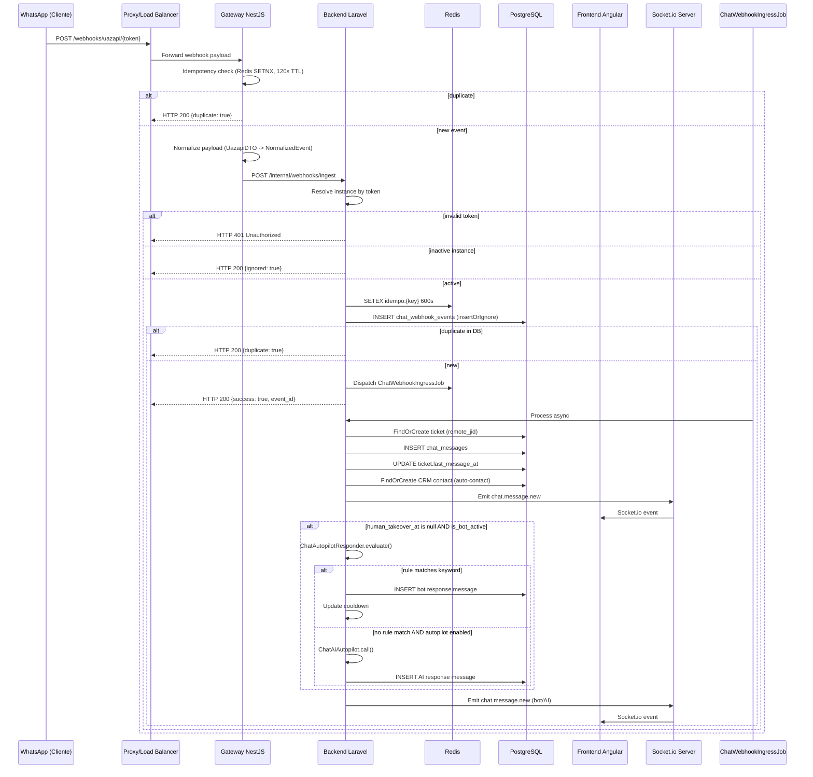
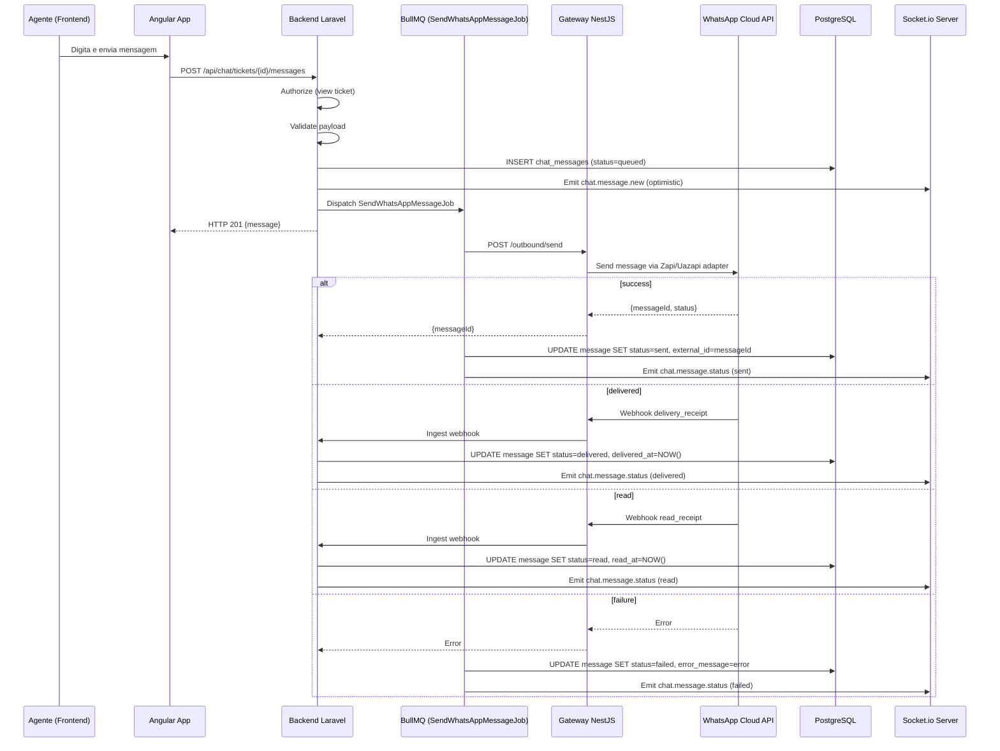
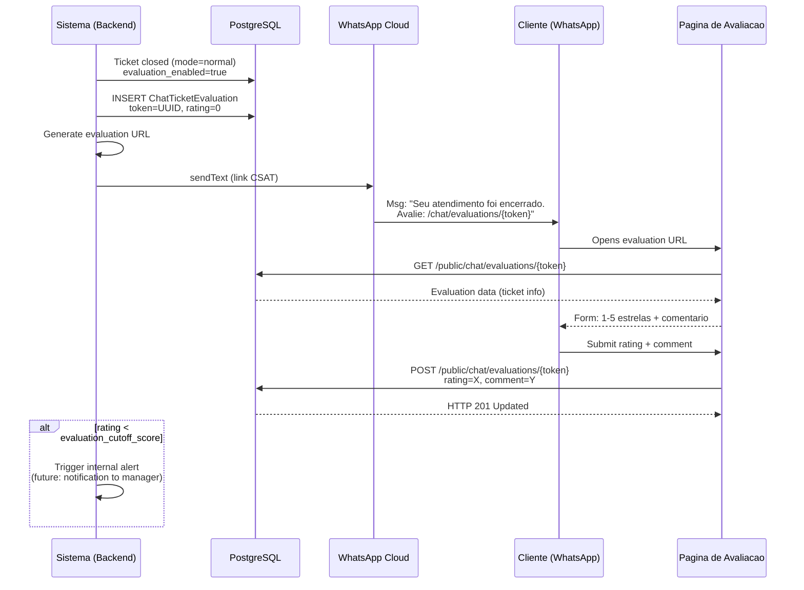
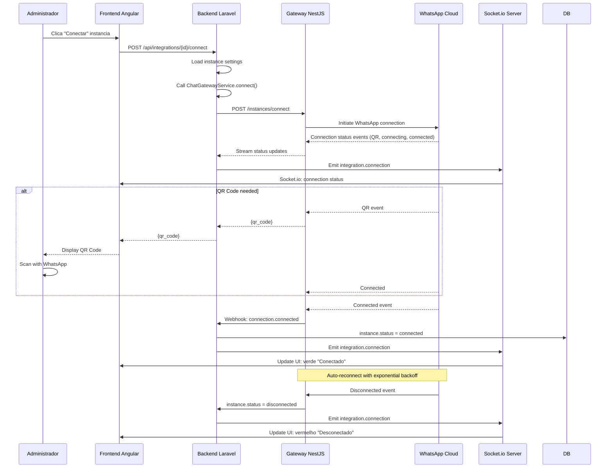
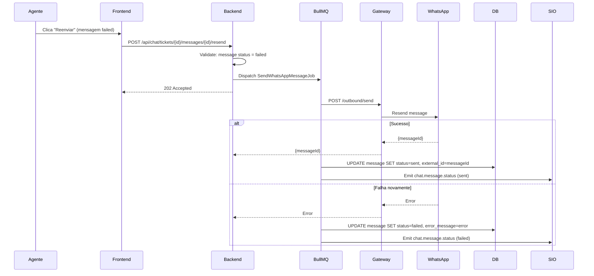
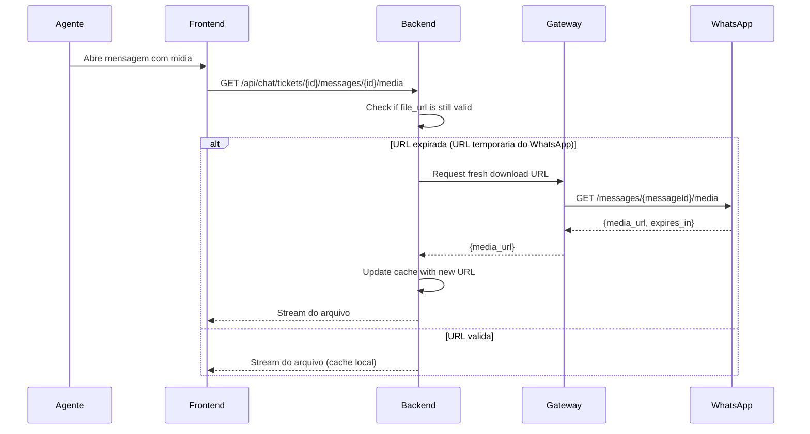
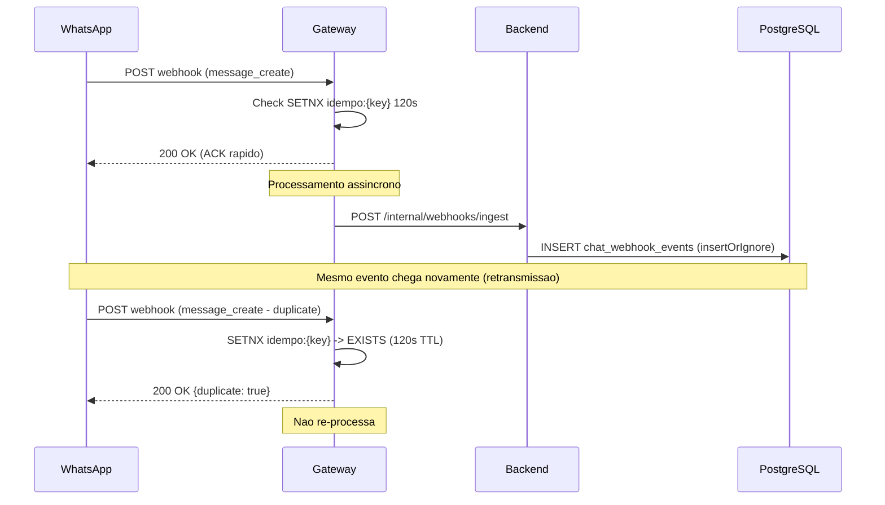
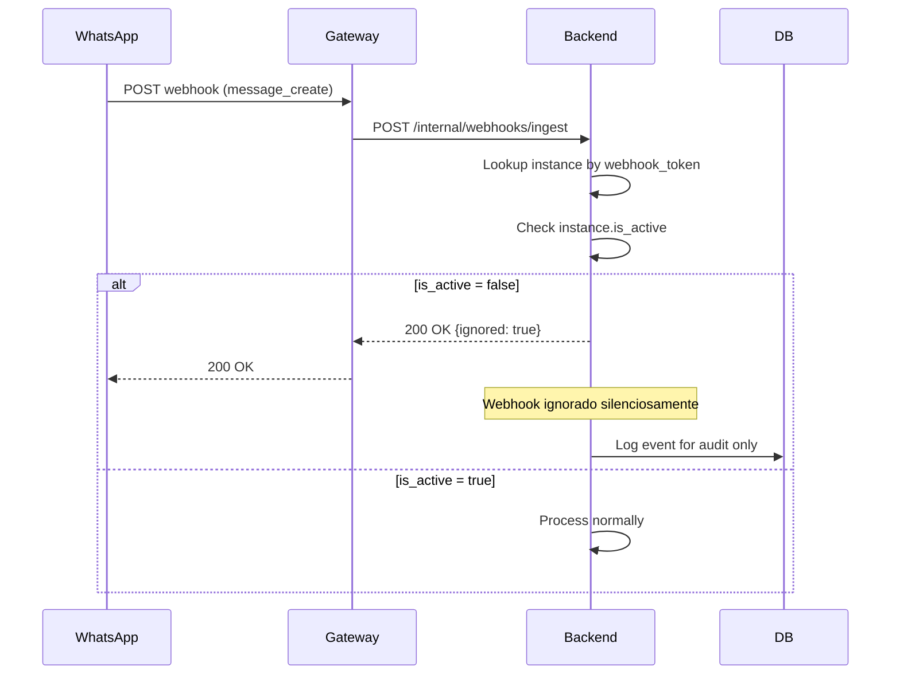
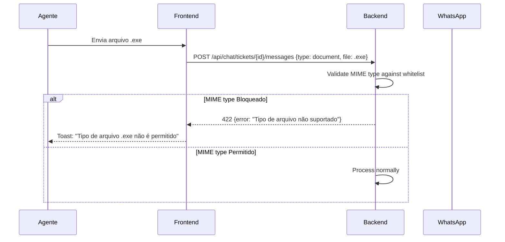

# PRD-CHAT-001 - Modulo de Chat (WhatsApp Omnichannel)

> **Modulo:** Chat
> **Status:** aprovado
> **Autor:** PM
> **Data:** 2026-03-28
> **Versao:** 1.0

---

## 1. CONTEXTO

O modulo Chat e o nucleo de comunicacao do InteraZap, viabilizando a gestao de conversas com clientes atraves do WhatsApp e provedores Omnichannel. Este modulo opera em tres camadas tecnologicas -- Laravel Backend (api/), NestJS Gateway (gateway/) e Angular Frontend (app/) -- e integra-se transversalmente com os modulos CRM, AI, Configuration e Billing.

O InteraZap e um SaaS multi-tenant projetado para equipes de atendimento e vendas que precisam de um sistema unificado de mensageria com automacao, IA conversacional e analytics. O modulo Chat e responsavel por toda a interacao entre a empresa e seus clientes externos, sendo tipicamente o primeiro ponto de contato e o principal canal de receita do produto.

**Problema que resolve:**

O InteraZap atende empresas que gerenciam alto volume de conversas WhatsApp com clientes. Sem um sistema estruturado, essas empresas enfrentam: (a) perda de contexto quando um cliente escreve em horarios diferentes; (b) distribuicao desigual de carga entre atendentes; (c) falta de rastreabilidade das conversa; (d) ausencia de automacao para respostas comuns; (e) dificuldade de escalar o atendimento sem aumentar proporcionalmente a equipe; e (f) ausencia de visibilidade sobre a qualidade do atendimento prestado.

O modulo Chat resolve esses problemas atraves de:

- **Tickets estruturados**: cada conversa e um ticket com estado (PENDING, OPEN, IN_PROGRESS, CLOSED), atribuicao a um agente, SLAs monitorados e historico completo de mensagens.
- **Human Takeover**: agentes humanos podem a qualquer momento assumir o controle de um ticket que estava sendo atendido por IA/bot, bloqueando a automacao.
- **Broadcast em tempo real**: eventos de nova mensagem, mudanca de status e indicacao de digitacao sao transmitidos via WebSocket/Socket.io para atualizacao imediata da interface.
- **Webhook idempotente**: provedores externos (Uazapi, Zapi) disparam eventos que sao normalizados, deduplicados e processados de forma assincrona sem perda de dados.
- **Avaliacao automatica (CSAT)**: ao encerrar um ticket normalmente, o sistema envia automaticamente um link de pesquisa de satisfacao ao cliente.
- **Analise de sentimento**: ao fechar um ticket, a ultima mensagem do cliente e enviada para o modulo AI para analise de sentimento (positivo/neutro/negativo), alimentando dashboards.
- **Campanhas em massa**: permite o disparo agendado ou imediato de mensagens para grupos de contatos selecionados via filtros do CRM.
- **Chatbot baseado em regras**: palavras-chave disparam respostas automaticas configuradas pelo tenant.
- **Respostas rapidas**: agentes utilizam atalhos de texto pre-configurados para responder com um clique.

**Posicionamento no ecossistema InteraZap:**

O modulo Chat depende de Auth (autenticacao Sanctum, tenant isolation via BelongsToTenant), Configuration (configuracoes de instancia, templates de mensagem), CRM (criacao automatica de contatos, busca por telefone, perfis), AI (autopilot, analise de sentimento, transcricao de audio), e Billing (rate limits, permissoes de uso por plano).

Simultaneamente, Chat gera dados para Dashboard (KPIs de atendimento, CSAT, tempo medio de resolucao), Reports (filtros de campanhas, exportacao de tickets e mensagens), e Billing (uso de mensagens, automacao de IA por volume).

**Provedores suportados:**

| Provedor | Tipo     | Status   |
| -------- | -------- | -------- |
| Uazapi   | WhatsApp | Producao |
| Zapi     | WhatsApp | Producao |

A arquitetura usa um padrao de Factory Provider (ProviderResolver) para permitir adicionar novos provedores sem impacto no codigo existente. Cada provedor tem seu adapter no gateway e seu normalizer de webhook.

**Volume esperado:**

Cada tenant pode ter N instancias WhatsApp conectadas simultaneamente. Cada instancia pode receber centenas de webhooks por minuto em horarios de pico. O gateway deve processar cada webhook com ACK < 150ms. O backend processa a logica de negocio de forma assincrona via BullMQ.

**Historico de銀发发版本:**

Este PRD consolida a documentacao de uma estrutura ja implementada em produção com as seguintes里程碑:

- Sprint 1: Core de tickets e mensagens com webhooks Uazapi
- Sprint 2: Transferencia, takeover e human takeover
- Sprint 3: Avaliacao CSAT e analise de sentimento
- Sprint 4: Campanhas e chatbot baseado em regras
- Sprint 5: Gateway NestJS com normalizacao e idempotencia
- Sprint 6: Respostas rapidas e prescencas

---

## 2. OBJETIVO

Fornecer um sistema completo de gestao de conversas WhatsApp multi-tenant que permita:

### 2.1 Objetivos Funcionais

**OF-01 — Recebimento de Mensagens:** Receber mensagens de provedores Omnichannel (Uazapi, Zapi) via webhooks normalizados, com idempotencia garantida para evitar duplicatas.

**OF-02 — Organizacao em Tickets:** Criar tickets automaticamente a partir de novas conversas, com ciclo de vida completo (PENDING -> OPEN -> IN_PROGRESS -> CLOSED) e agrupamento por contato.

**OF-03 — Gestao de Agentes:** Atribuir tickets a agentes humanos, permitir transferencia entre agentes, e implementar Human Takeover (intervencao humana que pausa automacao).

**OF-04 — Automacao:** Respostas automaticas via chatbot baseado em palavras-chave, automacao IA via Autopilot, e respostas rapidas pre-configuradas.

**OF-05 — Avaliacao de Satisfacao:** Pesquisa automatica de satisfacao (CSAT) apos fechamento de ticket, com link publico e analise de sentimento.

**OF-06 — Campanhas:** Disparo de mensagens em massa para grupos de contatos do CRM, com agendamento e rastreamento individual.

**OF-07 — Midia Enriched:** Envio de midia (imagens, audio, video, documentos), localizacao e contatos via API.

**OF-08 — Tempo Real:** Atualizacao immediata da interface via WebSocket (Socket.io) para mensagens, status e eventos de conexao.

**OF-09 — Rastreamento:** Eventos de leitura e entrega de mensagens, com atualizacao de status em tempo real.

### 2.2 Objetivos de Negocio

O modulo Chat busca como resultado de negocio:

| Objetivo                                         | Metrica                             | Impacto                          |
| ------------------------------------------------ | ----------------------------------- | -------------------------------- |
| Aumento da taxa de resolucao no primeiro contato | FCR (First Contact Resolution)      | Reduz custo de atendimento       |
| Reducao do tempo medio de resposta               | ART (Average Response Time)         | Melhora satisfacao do cliente    |
| Melhoria na distribuicao de carga                | Desvio padrao de tickets por agente | Evita burnout de agentes         |
| Visibilidade sobre satisfacao                    | NPS/CSAT medio                      | Identifica pontos de melhoria    |
| Escalabilidade sem aumento de equipe             | Tickets por agente/mês              | Automacao reduz custo por ticket |

### 2.3 O Que Nao E

O modulo Chat NAO tem como objetivo:

- Substituir um sistema de telefonia (voice, video)
- Ser uma plataforma de email marketing
- Fornecer relatorios analiticos avancados (isso e responsabilidade do modulo Reports)
- Processar pagamentos diretamente (integra com Billing para faturas)

---

## 3. REGRAS DE NEGOCIO

### 3.1 Tickets e Ciclo de Vida

| ID     | Regra                                                                                                                                                                                             | Prioridade |
| ------ | ------------------------------------------------------------------------------------------------------------------------------------------------------------------------------------------------- | ---------- |
| RN-001 | Todo ticket deve pertencer a exatamente um tenant, definido pelo campo `tenant_id` obrigatorio e nao-nulo                                                                                         | Critica    |
| RN-002 | Cada ticket possui um `ticket_number` sequencial unico no formato `TK-{SEQ}` gerado pela `ChatTicketSequence` dentro do escopo do tenant                                                          | Alta       |
| RN-003 | O status do ticket segue o enum `ChatTicketStatus`: `PENDING` (aguardando atribuicao), `OPEN` (atribuido, aguardando acao), `IN_PROGRESS` (em atendimento ativo por agente), `CLOSED` (encerrado) | Critica    |
| RN-004 | Um ticket em status `pending` ou `open` pode ser assumido por qualquer agente, mudando o status para `in_progress` e preenchendo `assigned_to`                                                    | Alta       |
| RN-005 | Um ticket em status `in_progress` pode ser transferido para outro agente via transferencia, alterando `assigned_to` mas mantendo o status                                                         | Alta       |
| RN-006 | Um ticket em qualquer status ativo (`pending`, `open`, `in_progress`) pode ser encerrado via `close`                                                                                              | Alta       |
| RN-007 | Um ticket encerrado (`closed`) nao pode ser reaberto; deve-se criar um novo ticket                                                                                                                | Alta       |
| RN-008 | O campo `closed_mode` registra se o fechamento foi `normal` (envia CSAT) ou `forced` (fecha silenciosamente, salta CSAT, ignora configuracao)                                                     | Alta       |
| RN-009 | O campo `close_reason` e obrigatorio ao fechar um ticket                                                                                                                                          | Media      |
| RN-010 | O campo `closed_by` registra o UUID do usuario que fechou o ticket (via extended)                                                                                                                 | Media      |
| RN-011 | Tickets sao agrupados por contato na listagem usando `ROW_NUMBER() OVER (PARTITION BY contact_id)` para exibir apenas a conversa mais recente                                                     | Alta       |
| RN-012 | O campo `last_message_at` e atualizado em toda nova mensagem (incoming ou outgoing) para ordenacao na inbox                                                                                       | Alta       |
| RN-013 | O campo `started_at` e preenchido automaticamente quando o ticket passa para `open` ou `in_progress` pela primeira vez                                                                            | Media      |
| RN-014 | O campo `first_response_at` marca quando o primeiro agente respondeu ao ticket (via message direction=outgoing)                                                                                   | Media      |
| RN-015 | O contador de tickets por status e cacheado em Redis por 15 segundos em `chat_counts:{tenant_id}`                                                                                                 | Media      |

### 3.2 Mensagens

| ID     | Regra                                                                                                                                                         | Prioridade |
| ------ | ------------------------------------------------------------------------------------------------------------------------------------------------------------- | ---------- |
| RN-016 | Toda mensagem pertence a exatamente um ticket                                                                                                                 | Critica    |
| RN-017 | Mensagens tem direcao `incoming` (cliente -> empresa) ou `outgoing` (empresa -> cliente)                                                                      | Critica    |
| RN-018 | Mensagens inbound sao criadas exclusivamente via webhook de provedores                                                                                        | Critica    |
| RN-019 | Mensagens outbound podem ser enviadas por agentes, automacao (chatbot/IA), ou sistema (CSAT, transferencia)                                                   | Alta       |
| RN-020 | O campo `source` indica a origem: `agent` (agente humano), `bot` (chatbot baseado em regras), `ai` (autopilot IA), `system` (mensagens automaticas como CSAT) | Alta       |
| RN-021 | Mensagens podem ter tipo: `text`, `image`, `audio`, `video`, `document`, `sticker`, `location`, `contact`, `reaction`, `template`                             | Alta       |
| RN-022 | O campo `status` de uma mensagem segue o pipeline: `queued` -> `sent` -> `delivered` -> `read` (ou `failed`)                                                  | Alta       |
| RN-023 | O `external_id` armazena o ID da mensagem no provedor WhatsApp, usado para rastrear ack/nack e normalizar deduplicacao                                        | Alta       |
| RN-024 | Mensagens de texto podem ser editadas pelo agente dentro de 15 minutos do envio, mantendo `edit_history` e `edited_at`                                        | Media      |
| RN-025 | Mensagens podem receber reacoes de emoji por agentes ou clientes, armazenadas como array em `reactions` via extended                                          | Media      |
| RN-026 | Mensagens podem ser excluidas logicamente (`is_deleted=true`, `deleted_at`, `deleted_by`) sem remocao fisica                                                  | Media      |
| RN-027 | Mensagens midia armazenam `file_url`, `file_name`, `mime_type`, `file_size` na tabela extended                                                                | Alta       |
| RN-028 | Mensagens de audio podem ser transcritas via AI (provedor configurado), populando `media_transcription` com custo em tokens e provider                        | Media      |
| RN-029 | A busca por mensagens no ticket aceita filtro por `search` no conteudo textual                                                                                | Media      |

### 3.3 Human Takeover e Automacao

| ID     | Regra                                                                                                                                                                 | Prioridade |
| ------ | --------------------------------------------------------------------------------------------------------------------------------------------------------------------- | ---------- |
| RN-030 | Quando um agente assume um ticket (`takeover`), o campo `human_takeover_at` e preenchido com o timestamp atual                                                        | Alta       |
| RN-031 | Enquanto `human_takeover_at` esta preenchido, o ChatAutopilotResponder nao dispara respostas automaticas para este ticket                                             | Critica    |
| RN-032 | Somente usuarios com permissao `chat.tickets.forceClose` podem acionar `releaseToAi` para devolver o ticket ao controle da IA                                         | Alta       |
| RN-033 | A libertacao de um ticket para IA (`releaseToAi`) dispara o gatilho `AutopilotTriggerType::HUMAN_TAKEOVER_ENDED` com duracao em minutos                               | Media      |
| RN-034 | Ao assumir um ticket (`open`), o sistema envia automaticamente a mensagem de inicio de atendimento se configurada em `start_service_message` na instance              | Media      |
| RN-035 | Ao transferir um ticket para outro departamento (nao-IA), o sistema envia automaticamente a mensagem de transferencia se configurada em `department_transfer_message` | Media      |
| RN-036 | O modo de IA com horario de expediente (`ai_business_hours`) so envia mensagens automaticas dentro do horario configurado                                             | Media      |

### 3.4 Avaliacao de Satisfacao (CSAT)

| ID     | Regra                                                                                                                                 | Prioridade |
| ------ | ------------------------------------------------------------------------------------------------------------------------------------- | ---------- |
| RN-037 | Ao fechar um ticket em modo `normal`, se `instance.evaluation_enabled=true`, o sistema cria um `ChatTicketEvaluation` com token unico | Alta       |
| RN-038 | O link de avaliacao e enviado automaticamente para o cliente via WhatsApp como mensagem de sistema                                    | Alta       |
| RN-039 | O link de avaliacao segue o formato `/public/chat/evaluations/{token}` e utiliza middleware `signed`                                  | Alta       |
| RN-040 | O endpoint publico de avaliacao (`submit`) rate-limits por IP via throttle `public`                                                   | Media      |
| RN-041 | O cliente avalia com nota de 1 a 5 estrelas e comentario opcional                                                                     | Alta       |
| RN-042 | Avaliacoes com nota abaixo de `instance.evaluation_cutoff_score` podem triggar alertas internos (configuracao futura)                 | Media      |
| RN-043 | O `closed_mode=forced` pula a criacao da avaliacao e o envio do link ao cliente                                                       | Alta       |
| RN-044 | A avaliacao esta vinculada ao ticket via `ticket_id` e ao tenant via `tenant_id`                                                      | Alta       |

### 3.5 Analise de Sentimento

| ID     | Regra                                                                                                                       | Prioridade |
| ------ | --------------------------------------------------------------------------------------------------------------------------- | ---------- |
| RN-045 | Ao fechar um ticket em modo `normal`, o sistema extrai a ultima mensagem inbound de texto e dispara `AiAnalyzeSentimentJob` | Alta       |
| RN-046 | O job analisa o sentimento e atualiza `ticket.sentiment` (positive/neutral/negative) e `ticket.sentiment_score`             | Alta       |
| RN-047 | Se nao houver mensagem inbound de texto, a analise de sentimento e pulada silenciosamente                                   | Media      |
| RN-048 | A analise de sentimento usa fila dedicada `sentiment` para nao impactar a fila principal de chat                            | Media      |

### 3.6 Webhooks e Idempotencia

| ID     | Regra                                                                                                                   | Prioridade |
| ------ | ----------------------------------------------------------------------------------------------------------------------- | ---------- |
| RN-049 | Todo webhook e protegido por rate limiting `throttle:webhooks`                                                          | Critica    |
| RN-050 | Webhooks de instancias inativas (`is_active=false`) sao ignorados silenciosamente (retornam 200 OK)                     | Alta       |
| RN-051 | Webhooks com token invalido retornam 401 Unauthorized                                                                   | Critica    |
| RN-052 | A idempotencia e garantida via chave `idempo:{provider}:{eventType}:{token}:{discriminator}` no Redis com TTL 600s      | Critica    |
| RN-053 | Eventos de conexao (connection.\*) sempre processam mesmo em caso de reconexao, mas atualizam a chave de idempotencia   | Alta       |
| RN-054 | Eventos duplicados retornam `{success:true, duplicate:true}` sem re-processamento                                       | Alta       |
| RN-055 | O `ChatWebhookEvent` persiste todos os eventos brutos para auditoria, usando `insertOrIgnore`                           | Alta       |
| RN-056 | O processamento pesado (criacao de ticket, mensagem, broadcast) e feito de forma assincrona via `ChatWebhookIngressJob` | Alta       |
| RN-057 | O gateway NestJS normaliza payloads de Uazapi e Zapi em um formato unificado antes de enviar ao backend                 | Critica    |
| RN-058 | O gateway implementa idempotencia local com Redis (TTL 120s pre-ACK, 600s pos-ACK) para garantir ACK < 150ms            | Critica    |
| RN-059 | O gateway aplica circuit breaker em chamadas externas (provedores WhatsApp) com retry em BullMQ                         | Alta       |

### 3.7 Instancias e Provedores

| ID     | Regra                                                                                                 | Prioridade |
| ------ | ----------------------------------------------------------------------------------------------------- | ---------- |
| RN-060 | Cada instancia pertence a exatamente um tenant e usa um provedor especifico (uazapi, zapi)            | Critica    |
| RN-061 | O campo `webhook_token` e gerado automaticamente na criacao e usado para validar eventos de entrada   | Critica    |
| RN-062 | O campo `settings_json` armazena configuracoes especificas do provedor (tokens, chaves, webhooks URL) | Alta       |
| RN-063 | O campo `mode` define o comportamento de atendimento: `chatbot`, `ia`, `human`, `hybrid`, etc         | Alta       |
| RN-064 | O campo `status` da instancia pode ser `connected`, `disconnected`, `connecting`, `error`             | Alta       |
| RN-065 | A conexao real com o provedor e feita via Gateway NestJS usando o adapter do provedor                 | Critica    |
| RN-066 | Arquitetura factory: `ProviderResolver` seleciona o adapter correto baseado no campo `provider`       | Alta       |
| RN-067 | O campo `evaluation_enabled` controla se a avaliacao CSAT e enviada ao fechar tickets                 | Media      |
| RN-068 | O campo `evaluation_cutoff_score` define o limiar de alerta (padrao: 3)                               | Media      |

### 3.8 Campanhas

| ID     | Regra                                                                                                                  | Prioridade |
| ------ | ---------------------------------------------------------------------------------------------------------------------- | ---------- |
| RN-069 | Campanhas tem ciclo de vida: `DRAFT` -> `SCHEDULED` -> `RUNNING` -> `COMPLETED` (ou `FAILED`, `CANCELLED`)             | Alta       |
| RN-070 | Campanhas em `DRAFT` podem ser editadas livremente                                                                     | Alta       |
| RN-071 | Campanhas em `SCHEDULED` tem `scheduled_at` no futuro e aguardam o job `ProcessCampaignJob`                            | Alta       |
| RN-072 | Campanhas em `RUNNING` disparam mensagens e nao podem ser editadas                                                     | Critica    |
| RN-073 | Campanhas podem ser canceladas manualmente se `RUNNING` ou `SCHEDULED`                                                 | Media      |
| RN-074 | O `filter_criteria` define quais contatos do CRM recebem a campanha (por tags, segmento, data, etc)                    | Alta       |
| RN-075 | O `audience` endpoint simula a contagem de contatos que receberiam a campanha sem dispara-la                           | Media      |
| RN-076 | Mensagens de campanha sao rastreadas em `ChatCampaignContact` com status individual (pending, sent, delivered, failed) | Alta       |
| RN-077 | O metadata da campanha armazena estatisticas: total, enviados, entregues, falhados                                     | Media      |

### 3.9 Chatbot Baseado em Regras

| ID     | Regra                                                                                                   | Prioridade |
| ------ | ------------------------------------------------------------------------------------------------------- | ---------- |
| RN-078 | Cada regra chatbot pertence a um tenant e tem um `trigger_text` (palavra-chave) e `response_text`       | Alta       |
| RN-079 | A validacao de palavras-chave (`validateKeyword`) verifica se o trigger_text ja esta em uso             | Media      |
| RN-080 | O campo `is_welcome=true` indica que a regra e enviada automaticamente na primeira interacao do contato | Alta       |
| RN-081 | O campo `cooldown_seconds` define o intervalo minimo entre envios da mesma regra para o mesmo contato   | Media      |
| RN-082 | `ChatChatbotCooldown` registra o ultimo disparo de cada regra por contato para evitar spam              | Media      |
| RN-083 | Somente uma regra welcome por tenant pode existir                                                       | Media      |
| RN-084 | Regras com `is_active=false` nao disparam mesmo se o texto bater                                        | Alta       |

### 3.10 Respostas Rapidas

| ID     | Regra                                                                                       | Prioridade |
| ------ | ------------------------------------------------------------------------------------------- | ---------- |
| RN-085 | Respostas rapidas pertencem a um tenant e tem um `shortcut` unico (ex: `/ola`, `/obrigado`) | Alta       |
| RN-086 | O shortcut deve comecar com `/` e ser unico dentro do tenant                                | Alta       |
| RN-087 | Respostas rapidas suportam `SoftDeletes` para permitir recuperacao                          | Media      |
| RN-088 | O campo `category` permite organizacao em grupos para exibicao no composer                  | Media      |
| RN-089 | Somente respostas com `is_active=true` sao retornadas na listagem                           | Media      |

### 3.11 Midia

| ID     | Regra                                                                                     | Prioridade |
| ------ | ----------------------------------------------------------------------------------------- | ---------- |
| RN-090 | Midias sao baixadas do provedor WhatsApp de forma assincrona via `ChatMediaDownloadJob`   | Alta       |
| RN-091 | O download usa o token da instancia e o messageId como referencia                         | Alta       |
| RN-092 | Midias expiradas (URL temporaria) sao re-baixadas sob demanda se necessario               | Media      |
| RN-093 | O endpoint de download usa `signed` URL com expiracao para evitar acessos nao autorizados | Alta       |
| RN-094 | O tipo MIME e detectado a partir do provedor e armazenado em `mime_type`                  | Media      |
| RN-095 | Arquivos de audio podem ser convertidos para MP3 e transcritos via AI se configurado      | Media      |

### 3.12 Integridade e Auditoria

| ID     | Regra                                                                                                                   | Prioridade |
| ------ | ----------------------------------------------------------------------------------------------------------------------- | ---------- |
| RN-096 | Toda acao de criacao, alteracao de status, transferencia e fechamento de ticket gera log de auditoria via `AuditLogger` | Alta       |
| RN-097 | Logs de auditoria armazenam: usuario, tenant, acao, recurso e metadados da operacao                                     | Alta       |
| RN-098 | Tokens, senhas e chaves de API nunca sao logados (ASCARISCO)                                                            | Critica    |
| RN-099 | O mapeamento `remote_jid -> ticket_id` e cacheado em Redis (`chat.ticket_by_jid:{normalized_jid}`) por 3600s            | Media      |
| RN-100 | Todas as queries de listagem e busca devem usar eager loading para evitar N+1                                           | Critica    |

---

## 4. FLUXOS

### 4.1 Fluxo: Recebimento de Mensagem Inbound via Webhook



### 4.2 Fluxo: Envio de Mensagem Outbound por Agente



### 4.3 Fluxo: Ciclo de Vida de um Ticket

```mermaid
stateDiagram-v2
    [*] --> PENDING: Nova mensagem inbound (webhook)

    PENDING --> OPEN: Agente abre/assume ticket

    OPEN --> IN_PROGRESS: Agente inicia atendimento
    OPEN --> CLOSED: Fechamento forcado (manager)

    IN_PROGRESS --> OPEN: Transferencia para outro agente
    IN_PROGRESS --> OPEN: Agente pausa atendimento
    IN_PROGRESS --> CLOSED: Encerramento normal (envia CSAT)

    CLOSED --> [*]: Ticket arquivado

    PENDING --> CLOSED: Fechamento forcado

    note right of PENDING: Human Takeover pode ser<br/>ativado a qualquer momento
    note right of OPEN: Takeover: human_takeover_at = now()
    note right of OPEN: is_bot_active = false
    note right of CLOSED: Normal: cria CSAT, envia link<br/>Forced: pula CSAT, fecha silencioso
    note right of CLOSED: Dispara AiAnalyzeSentimentJob
```

### 4.4 Fluxo: Human Takeover e Devolucao para IA

```mermaid
flowchart TD
    A([Ticket em atendimento<br/>por IA]) --> B{Agente clica<br/>'Assumir Ticket'}
    B --> C[POST /chat/tickets/{id}/takeover]
    C --> D[ChatTicketActions.activateHumanTakeover]
    D --> E[HumorTakeoverAt = NOW<br/>is_bot_active = false]
    E --> F[Emit ticket.updated<br/>human_takeover_activated]
    F --> G[AutopilotTriggerFired<br/>HUMAN_TAKEOVER_STARTED]
    G --> H([IA para de responder<br/>a este ticket])

    H --> I{Decisao do gestor}
    I -->|Transferir para outro agente| J[POST /chat/tickets/{id}/transfer]
    J --> K[assigned_to = novoAgente<br/>Envia msg de transferencia]
    I -->|Encerrar| L[POST /chat/tickets/{id}/close<br/>mode=normal]
    L --> M[Cria ChatTicketEvaluation<br/>Envia link CSAT]
    I -->|Devolver para IA| N[POST /chat/tickets/{id}/release-to-ai]
    N --> O[human_takeover_at = null]
    O --> P[AutopilotTriggerFired<br/>HUMAN_TAKEOVER_ENDED<br/>duration_minutes]
    P --> Q([IA retoma respostas<br/>automaticas])
```

### 4.5 Fluxo: Envio de Avaliacao CSAT



### 4.6 Fluxo: Execucao de Campanha

```mermaid
flowchart TD
    A([Campanha criada<br/>status=DRAFT]) --> B{Admin configura<br/>mensagem + audiencia}
    B --> C[POST /chat/campaigns/{id}/audience<br/>Simula contagem de contatos]

    C --> D[Admin ajusta filtros]
    D --> B

    B --> E[POST /chat/campaigns/{id}/send]
    E --> F{scheduled_at?}
    F -->|Nulo| G[ProcessCampaignJob<br/>dispara agora]
    F -->|Futuro| H[Campanha status=SCHEDULED<br/>Job agendado por cron]

    G --> I[status = RUNNING]
    H --> I

    I --> J[Para cada contato no filtro]
    J --> K[INSERT ChatCampaignContact<br/>status=pending]
    J --> L[Dispatch SendWhatsAppMessageJob]

    L --> M{Resultado do gateway}
    M -->|Sucesso| N[ChatCampaignContact<br/>status=sent]
    M -->|Entregue| O[ChatCampaignContact<br/>status=delivered]
    M -->|Falha| P[ChatCampaignContact<br/>status=failed<br/>error_message]

    J -->|Fim| Q{Todos contatos?}
    Q -->|Sim| R[status = COMPLETED<br/>metadata: estatisticas]

    Q -->|Nao| J

    R --> S([Campanha finalizada])
```

### 4.7 Fluxo: Conexao e Desconexao de Instancia



### 4.8 Fluxo: Reenvio de Mensagem



### 4.9 Fluxo: Expiracao e Re-download de Midia



**Regras de Expiracao:**

- URLs de midia do WhatsApp expiram em ~1 hora
- Sistema re-baix a midia sob demanda se necessario
- Cache local usa signed URLs com expiracao configuravel

### 4.10 Fluxo: Edge Case — Webhook Duplicado



### 4.11 Fluxo: Edge Case — Instancia Inativa



### 4.12 Fluxo: Edge Case — Midia Nao Suportada



**Tipos de Midia Suportados:**

- `image`: jpeg, png, gif, webp
- `video`: mp4, ogg
- `audio`: ogg, mp3, wav
- `document`: pdf, doc, docx, xls, xlsx, ppt, pptx, txt, csv, zip

---

## 5. ENTIDADES E MODELOS

### 5.1 ChatTicket

Representa uma conversa individual entre a empresa e um cliente. E a entidade central do modulo, gerenciando o ciclo de vida, atribuicao, SLAs e metadata.

**Tabela:** `chat_tickets`

**Campos:**

| Campo                  | Tipo                | Descricao                                        |
| ---------------------- | ------------------- | ------------------------------------------------ |
| `id`                   | uuid (PK)           | Identificador unico (ordered UUID)               |
| `tenant_id`            | uuid (FK)           | Tenant proprietario (BelongsToTenant)            |
| `contact_id`           | uuid (FK, nullable) | Contato CRM vinculado                            |
| `instance_id`          | uuid (FK, nullable) | Instancia WhatsApp que originou                  |
| `assigned_to`          | uuid (FK, nullable) | Agente atualmente responsavel                    |
| `ticket_number`        | string(20)          | Numero sequencial TK-000001                      |
| `protocol`             | string(20)          | Protocolo de atendimento (igual a ticket_number) |
| `channel`              | string(50)          | Canal (whatsapp, instagram, etc)                 |
| `remote_jid`           | string(255)         | JID do WhatsApp do cliente (normalizado)         |
| `phone`                | string(30)          | Telefone formatado original                      |
| `phone_e164`           | string(20)          | Telefone em formato E.164                        |
| `push_name`            | string(255)         | Nome do cliente no WhatsApp                      |
| `status`               | enum                | pending, open, in_progress, closed               |
| `priority`             | string(20)          | Prioridade (low, normal, high, urgent)           |
| `category`             | string(100)         | Categoria do atendimento                         |
| `is_group`             | boolean             | Se e um grupo WhatsApp                           |
| `is_bot_active`        | boolean             | Se o bot/IA esta ativo neste ticket              |
| `started_at`           | timestamp           | Quando o atendimento comecou                     |
| `first_response_at`    | timestamp           | Primeira resposta do agente                      |
| `last_message_at`      | timestamp           | Ultima atividade (para ordenacao)                |
| `closed_at`            | timestamp           | Data de encerramento                             |
| `closed_mode`          | string(20)          | Modo de fechamento (normal, forced)              |
| `sentiment`            | string(20)          | Sentimento (positive, neutral, negative)         |
| `sentiment_score`      | integer             | Score numerico (-100 a 100)                      |
| `sentiment_updated_at` | timestamp           | Ultima atualizacao de sentimento                 |
| `tags`                 | jsonb               | Tags livres para categorizacao                   |
| `metadata`             | jsonb               | Dados tecnicos adicionais                        |

**Relacionamentos:**

- `extended` (HasOne): Dados estendidos (SLAs, auto-close, profile picture, closed_by, close_reason)
- `messages` (HasMany): Mensagens do ticket
- `latestMessage` (HasOne): Mensagem mais recente (para display)
- `instance` (BelongsTo): Instancia WhatsApp
- `evaluation` (HasOne): Avaliacao CSAT
- `user` (BelongsTo): Agente responsavel
- `contact` (BelongsTo): Contato CRM

### 5.2 ChatTicketExtended

Armazena campos de baixa frequencia de acesso em tabela separada para otimizar queries de listagem no ticket core.

**Tabela:** `chat_tickets_extended`

| Campo                                  | Tipo        | Descricao                               |
| -------------------------------------- | ----------- | --------------------------------------- |
| `id`                                   | uuid (PK)   | Identificador                           |
| `ticket_id`                            | uuid (FK)   | Ticket relacionado                      |
| `subject`                              | string(255) | Assunto do ticket                       |
| `profile_picture_url`                  | string(500) | URL da foto do cliente                  |
| `human_takeover_at`                    | timestamp   | Quando o takeover foi ativado           |
| `closed_by`                            | uuid        | Usuario que fechou                      |
| `close_reason`                         | string(255) | Motivo do fechamento                    |
| `auto_close_queue_after_minutes`       | integer     | Auto-fechar se na fila por X min        |
| `auto_close_in_progress_after_minutes` | integer     | Auto-fechar se em atendimento por X min |
| `sla_first_response_due_at`            | timestamp   | Deadline SLA primeira resposta          |
| `sla_resolution_due_at`                | timestamp   | Deadline SLA resolucao                  |
| `sla_first_response_breached`          | boolean     | Se SLA primeira resposta foi violado    |
| `sla_resolution_breached`              | boolean     | Se SLA resolucao foi violado            |

**Nota:** A arquitetura usa padrao Attribute Proxy no modelo ChatTicket para transparentemente ler/escrever na tabela extended.

### 5.3 ChatMessage

Armazena o conteudo central de cada mensagem em uma conversa.

**Tabela:** `chat_messages`

| Campo               | Tipo                | Descricao                                                               |
| ------------------- | ------------------- | ----------------------------------------------------------------------- |
| `id`                | uuid (PK)           | Identificador                                                           |
| `tenant_id`         | uuid                | Tenant proprietario                                                     |
| `ticket_id`         | uuid (FK)           | Ticket vinculado                                                        |
| `user_id`           | uuid (FK, nullable) | Agente que enviou (se outbound)                                         |
| `contact_id`        | uuid (FK, nullable) | Contato CRM                                                             |
| `content`           | text                | Texto da mensagem                                                       |
| `type`              | string(30)          | Tipo (text, image, audio, video, document, location, contact, template) |
| `direction`         | string(20)          | incoming ou outgoing                                                    |
| `is_from_contact`   | boolean             | Se originou do cliente                                                  |
| `source`            | string(20)          | Origem (agent, bot, ai, system)                                         |
| `status`            | string(20)          | queued, sent, delivered, read, failed                                   |
| `transcription`     | text                | Transcricao (audio/video)                                               |
| `audio_duration_ms` | integer             | Duracao do audio em ms                                                  |
| `audio_mime_type`   | string(50)          | Tipo MIME do audio                                                      |
| `external_id`       | string(255)         | ID no provedor WhatsApp                                                 |
| `metadata`          | jsonb               | Dados tecnicos (kind, quoted_message_id, etc)                           |
| `sent_at`           | timestamp           | Quando foi enviada                                                      |
| `delivered_at`      | timestamp           | Quando foi entregue                                                     |
| `read_at`           | timestamp           | Quando foi lida                                                         |
| `is_deleted`        | boolean             | Exclusao logica                                                         |
| `deleted_at`        | timestamp           | Data da exclusao                                                        |
| `deleted_by`        | uuid                | Quem excluiu                                                            |

### 5.4 ChatMessageExtended

Armazena campos de midia, transcricao, reacoes e historico de edicao em tabela separada.

**Tabela:** `chat_messages_extended`

| Campo                          | Tipo        | Descricao                                          |
| ------------------------------ | ----------- | -------------------------------------------------- |
| `id`                           | uuid (PK)   | Identificador                                      |
| `message_id`                   | uuid (FK)   | Mensagem relacionada                               |
| `file_url`                     | string(500) | URL do arquivo de midia                            |
| `file_name`                    | string(255) | Nome original do arquivo                           |
| `mime_type`                    | string(100) | Tipo MIME                                          |
| `file_size`                    | integer     | Tamanho em bytes                                   |
| `media_transcription`          | text        | Texto transcrito da midia                          |
| `media_transcription_provider` | string(50)  | Provedor de transcricao                            |
| `media_transcription_status`   | string(30)  | Status da transcricao                              |
| `media_transcription_tokens`   | integer     | Tokens consumidos                                  |
| `media_transcription_cost`     | float       | Custo em USD                                       |
| `media_transcribed_at`         | timestamp   | Quando foi transcrito                              |
| `reactions`                    | jsonb       | Array de reacoes [{emoji, user_id, created_at}]    |
| `is_edited`                    | boolean     | Se foi editada                                     |
| `edited_at`                    | timestamp   | Data da edicao                                     |
| `edit_history`                 | jsonb       | Array de versoes anteriores [{content, edited_at}] |
| `error_message`                | string(500) | Mensagem de erro se failed                         |

### 5.5 ChatInstance

Representa uma conexao com um provedor WhatsApp.

**Tabela:** `chat_instances`

| Campo                     | Tipo        | Descricao                                     |
| ------------------------- | ----------- | --------------------------------------------- |
| `id`                      | uuid (PK)   | Identificador                                 |
| `tenant_id`               | uuid        | Tenant proprietario                           |
| `provider`                | string(30)  | Provedor (uazapi, zapi)                       |
| `name`                    | string(100) | Nome amigavel                                 |
| `mode`                    | string(50)  | Modo de operacao (chatbot, ia, human, hybrid) |
| `status`                  | string(30)  | connected, disconnected, connecting, error    |
| `is_active`               | boolean     | Se a instancia esta habilitada                |
| `evaluation_enabled`      | boolean     | Se CSAT esta ativo                            |
| `evaluation_cutoff_score` | integer     | Limiar de alerta CSAT (1-5)                   |
| `webhook_token`           | string(100) | Token unico para validacao de webhooks        |
| `settings_json`           | jsonb       | Configuracoes especificas do provedor         |
| `last_status_at`          | timestamp   | Ultima atualizacao de status                  |

### 5.6 ChatCampaign

Configuracao de uma campanha de envio em massa.

**Tabela:** `chat_campaigns`

| Campo             | Tipo        | Descricao                                               |
| ----------------- | ----------- | ------------------------------------------------------- |
| `id`              | uuid (PK)   | Identificador                                           |
| `tenant_id`       | uuid        | Tenant proprietario                                     |
| `instance_id`     | uuid (FK)   | Instancia para envio                                    |
| `name`            | string(255) | Nome da campanha                                        |
| `message`         | text        | Texto da mensagem                                       |
| `filter_criteria` | jsonb       | Filtros de audiencia (tags, segmentos, datas)           |
| `status`          | enum        | draft, scheduled, running, completed, failed, cancelled |
| `scheduled_at`    | timestamp   | Data/hora agendada (nullable)                           |
| `metadata`        | jsonb       | Estatisticas e configuracoes adicionais                 |

### 5.7 ChatCampaignContact

Rastreamento individual de envio por contato.

**Tabela:** `chat_campaign_contacts`

| Campo           | Tipo                | Descricao                        |
| --------------- | ------------------- | -------------------------------- |
| `id`            | uuid (PK)           | Identificador                    |
| `campaign_id`   | uuid (FK)           | Campanha relacionada             |
| `contact_id`    | uuid (FK)           | Contato CRM                      |
| `message_id`    | uuid (FK, nullable) | Mensagem disparada               |
| `status`        | string(20)          | pending, sent, delivered, failed |
| `sent_at`       | timestamp           | Quando foi enviada               |
| `delivered_at`  | timestamp           | Quando foi entregue              |
| `error_message` | string(500)         | Motivo da falha                  |

### 5.8 ChatChatbotRule

Regra de resposta automatica por palavra-chave.

**Tabela:** `chat_chatbot_rules`

| Campo              | Tipo        | Descricao                     |
| ------------------ | ----------- | ----------------------------- |
| `id`               | uuid (PK)   | Identificador                 |
| `tenant_id`        | uuid        | Tenant proprietario           |
| `name`             | string(255) | Nome da regra                 |
| `trigger_text`     | string(255) | Palavra-chave que dispara     |
| `response_text`    | text        | Resposta automatica           |
| `is_active`        | boolean     | Se a regra esta habilitada    |
| `is_welcome`       | boolean     | Se e regra de boas-vindas     |
| `cooldown_seconds` | integer     | Intervalo minimo entre envios |

### 5.9 ChatChatbotCooldown

Controle de cooldown por regra e contato.

**Tabela:** `chat_chatbot_cooldowns`

| Campo               | Tipo      | Descricao           |
| ------------------- | --------- | ------------------- |
| `id`                | uuid (PK) | Identificador       |
| `rule_id`           | uuid (FK) | Regra aplicada      |
| `contact_id`        | uuid (FK) | Contato que recebeu |
| `last_triggered_at` | timestamp | Ultimo disparo      |

### 5.10 ChatQuickAnswer

Resposta pre-configurada para agentes.

**Tabela:** `chat_quick_answers`

| Campo       | Tipo        | Descricao           |
| ----------- | ----------- | ------------------- |
| `id`        | uuid (PK)   | Identificador       |
| `tenant_id` | uuid        | Tenant proprietario |
| `name`      | string(255) | Nome identificador  |
| `shortcut`  | string(50)  | Atalho (ex: /ola)   |
| `content`   | text        | Texto completo      |
| `category`  | string(100) | Categoria           |
| `is_active` | boolean     | Se esta disponivel  |

### 5.11 ChatTicketEvaluation

Avaliacao de satisfacao do cliente.

**Tabela:** `chat_ticket_evaluations`

| Campo          | Tipo      | Descricao                     |
| -------------- | --------- | ----------------------------- |
| `id`           | uuid (PK) | Identificador                 |
| `tenant_id`    | uuid      | Tenant proprietario           |
| `ticket_id`    | uuid (FK) | Ticket avaliado               |
| `token`        | uuid      | Token unico para link publico |
| `rating`       | integer   | Nota 0-5 (0 = pendente)       |
| `comment`      | text      | Comentario opcional           |
| `submitted_at` | timestamp | Quando foi enviada            |

### 5.12 ChatWebhookEvent

Auditoria de todos os webhooks recebidos.

**Tabela:** `chat_webhook_events`

| Campo                    | Tipo        | Descricao                  |
| ------------------------ | ----------- | -------------------------- |
| `id`                     | uuid (PK)   | Identificador              |
| `tenant_id`              | uuid        | Tenant                     |
| `domain`                 | string(20)  | Dominio (chat)             |
| `stream_id`              | string(255) | ID da mensagem no provedor |
| `idempotency_key`        | string(255) | Chave de deduplicacao      |
| `provider`               | string(30)  | Provedor (uazapi, zapi)    |
| `instance_webhook_token` | string(100) | Token da instancia         |
| `event_type`             | string(50)  | Tipo de evento             |
| `direction`              | string(20)  | incoming/outgoing          |
| `payload`                | jsonb       | Payload bruto              |
| `created_at`             | timestamp   | Recebimento                |

### 5.13 ChatTicketSequence

Gerador de numeracao sequencial de tickets.

**Tabela:** `chat_ticket_sequences`

| Campo        | Tipo       | Descricao           |
| ------------ | ---------- | ------------------- |
| `id`         | uuid (PK)  | Identificador       |
| `tenant_id`  | uuid       | Tenant              |
| `prefix`     | string(10) | Prefixo (TK-)       |
| `last_value` | integer    | Ultimo numero usado |

### 5.14 ChatTicketTransfer

Historico de transferencias de tickets.

**Tabela:** `chat_ticket_transfers`

| Campo            | Tipo            | Descricao       |
| ---------------- | --------------- | --------------- |
| `id`             | uuid (PK)       | Identificador   |
| `ticket_id`      | uuid (FK)       | Ticket          |
| `from_user_id`   | uuid (nullable) | Agente anterior |
| `to_user_id`     | uuid (nullable) | Agente novo     |
| `department_id`  | uuid (nullable) | Departamento    |
| `transferred_by` | uuid            | Quem transferiu |
| `created_at`     | timestamp       | Quando          |

---

## 6. ENDPOINTS

### 6.1 Tickets

#### `GET /api/chat/init`

Carrega payload inicial agregado para a interface de chat. Retorna tickets, contadores por status e preferencias do usuario em uma unica chamada para minimizar round-trips.

**Autenticacao:** `auth:sanctum`

**Query Parameters:**

| Param              | Tipo   | Default           | Descricao                           |
| ------------------ | ------ | ----------------- | ----------------------------------- |
| `status`           | string | -                 | Filtrar por status                  |
| `contact_id`       | uuid   | -                 | Filtrar por contato                 |
| `instance_id`      | uuid   | -                 | Filtrar por instancia               |
| `user_id`          | uuid   | -                 | Filtrar por agente responsavel      |
| `search`           | string | -                 | Busca por nome, telefone, protocolo |
| `sentiment`        | string | -                 | Filtrar por sentimento              |
| `sort_by`          | string | `last_message_at` | Campo de ordenacao                  |
| `agent_id`         | uuid   | -                 | Alias para user_id                  |
| `from`             | date   | -                 | Data inicial de criacao             |
| `to`               | date   | -                 | Data final de criacao               |
| `per_page`         | int    | 15                | Itens por pagina                    |
| `group_by_contact` | bool   | true              | Agrupar por contato                 |

**Response 200:**

```json
{
  "success": true,
  "data": {
    "tickets": {
      "data": [ChatTicketResource],
      "meta": { "current_page": 1, "last_page": 5, "per_page": 15, "total": 72 },
      "links": { "first": "...", "last": "...", "prev": null, "next": "..." }
    },
    "counts": { "all": 72, "pending": 15, "open": 23, "in_progress": 4, "closed": 30 },
    "user_preferences": {
      "user_id": "uuid",
      "notifications_enabled": true,
      "sound_enabled": true,
      "enter_to_send": true,
      "show_internal_events": false
    }
  }
}
```

#### `GET /api/chat/tickets`

Lista tickets do tenant com paginacao e filtros.

**Autenticacao:** `auth:sanctum` + Policy `viewAny(ChatTicket::class)`

**Query Parameters:** Idem `/api/chat/init`

**Response 200:** Lista paginada de `ChatTicketResource` + `counts`

#### `POST /api/chat/tickets`

Cria um novo ticket manual.

**Autenticacao:** `auth:sanctum` + Policy `create(ChatTicket::class)`

**Body (ChatTicketStoreRequest):**

```json
{
    "instance_id": "uuid",
    "contact_id": "uuid (nullable)",
    "phone": "+5514999999999",
    "remote_jid": "5514999999999@s.whatsapp.net",
    "push_name": "Joao Silva",
    "profile_picture_url": "https://...",
    "channel": "whatsapp",
    "priority": "normal",
    "category": "suporte",
    "is_group": false,
    "metadata": {}
}
```

**Response 201:** `ChatTicketResource` + audit log

**RN:** Auto-cria CRMContact se `contact_id` nao fornecido e phone existe

#### `GET /api/chat/tickets/{id}`

Exibe um ticket com todas as relacoes carregadas.

**Autenticacao:** `auth:sanctum` + Policy `view(ChatTicket::class)`

**Response 200:** `ChatTicketResource` com extended, evaluation, instance, contact, user, latestMessage

#### `POST /api/chat/tickets/{id}/open`

Abre ou assume um ticket pendente, mudando status para `in_progress` e atribuindo ao usuario atual.

**Autenticacao:** `auth:sanctum`

**Body (opcional):** `{}`

**Response 200:** `ChatTicketResource` atualizado

**RN:** Lanca DomainException se ticket ja esta em atendimento ou fechado

#### `POST /api/chat/tickets/{id}/close`

Encerra o ticket.

**Autenticacao:** `auth:sanctum`

**Body (ChatTicketCloseRequest):**

```json
{
    "reason": "Problema resolvido",
    "mode": "normal"
}
```

| Campo    | Tipo   | Obrigatorio | Descricao                      |
| -------- | ------ | ----------- | ------------------------------ |
| `reason` | string | Sim         | Motivo do fechamento           |
| `mode`   | string | Nao         | `normal` (default) ou `forced` |

**Response 200:** `ChatTicketResource`

**RN-038 a RN-043:** Modo `normal` cria avaliacao CSAT. Modo `forced` fecha silenciosamente.

#### `POST /api/chat/tickets/{id}/transfer`

Transfere ticket para outro agente ou departamento.

**Autenticacao:** `auth:sanctum` + Policy `update(ChatTicket::class)`

**Body:**

```json
{
    "user_id": "uuid (nullable)",
    "department_id": "uuid (nullable)"
}
```

**Response 200:** `ChatTicketResource`

#### `POST /api/chat/tickets/{id}/read`

Marca todas as mensagens inbound do ticket como lidas.

**Autenticacao:** `auth:sanctum`

**Response 200:** `{}` (vazio, confirmacao)

**RN:** Atualiza `read_at` localmente e dispara `SyncReadReceiptJob` para gateway

#### `POST /api/chat/tickets/{id}/takeover`

Ativa modo de atendimento humano (Human Takeover).

**Autenticacao:** `auth:sanctum`

**Response 200:** `ChatTicketResource` + `human_takeover_at` preenchido

#### `POST /api/chat/tickets/{id}/release-to-ai`

Devolve ticket para controle da IA/Bot.

**Autenticacao:** `auth:sanctum` + Policy `forceClose`

**Response 200:** `ChatTicketResource`

### 6.2 Mensagens

#### `GET /api/chat/tickets/{ticketId}/messages`

Lista mensagens de um ticket com cursor pagination.

**Autenticacao:** `auth:sanctum`

**Query Parameters:**

| Param      | Tipo   | Default | Descricao             |
| ---------- | ------ | ------- | --------------------- |
| `cursor`   | string | -       | Cursor para paginacao |
| `per_page` | int    | 50      | Itens por pagina      |
| `search`   | string | -       | Busca no conteudo     |

**Response 200:** Cursor-paginated `ChatMessageResource` collection

#### `POST /api/chat/tickets/{ticketId}/messages`

Envia uma nova mensagem outbound.

**Autenticacao:** `auth:sanctum`

**Body (ChatMessageStoreRequest):**

```json
{
    "content": "Ola, como posso ajudar?",
    "type": "text",
    "contact_id": "uuid (nullable)",
    "metadata": { "quoted_message_id": "uuid" }
}
```

| Campo        | Tipo   | Obrigatorio | Descricao                           |
| ------------ | ------ | ----------- | ----------------------------------- |
| `content`    | string | Sim         | Texto da mensagem                   |
| `type`       | string | Sim         | text, image, audio, video, document |
| `contact_id` | uuid   | Nao         | Contato CRM                         |
| `metadata`   | object | Nao         | quoted_message_id, etc              |

**Response 201:** `ChatMessageResource` (status: queued)

**RN:** Dispara `SendWhatsAppMessageJob` de forma assincrona

#### `GET /api/chat/tickets/{ticketId}/messages/{messageId}/media`

Baixa midia de uma mensagem.

**Autenticacao:** `auth:sanctum` + Policy `view(ChatTicket::class)`

**Response:** Stream de arquivo ou redirect

**RN:** Se midia expirou, re-baixar do gateway e re-cachear

#### `POST /api/chat/tickets/{ticketId}/messages/{messageId}/react`

Reage a uma mensagem com emoji.

**Autenticacao:** `auth:sanctum`

**Body:**

```json
{
    "reaction": "\u2764\uFE0F"
}
```

**Response 200:** `ChatMessageResource`

#### `POST /api/chat/tickets/{ticketId}/messages/{messageId}/edit`

Edita o conteudo de uma mensagem de texto enviada.

**Autenticacao:** `auth:sanctum`

**Body (ChatMessageEditRequest):**

```json
{
    "content": "Novo texto corrigido"
}
```

**Response 200:** `ChatMessageResource` (is_edited=true, edit_history actualizado)

**RN:** Apenas agentes podem editar suas proprias mensagens

#### `DELETE /api/chat/tickets/{ticketId}/messages/{messageId}`

Remove logicamente uma mensagem.

**Autenticacao:** `auth:sanctum` + Policy `delete(ChatMessage::class)`

**Response 200:** `{}`

### 6.3 Instancias

#### `GET /api/integrations`

Lista todas as instancias do tenant.

**Autenticacao:** `auth:sanctum`

**Response 200:** Collection de `ChatInstanceResource`

#### `POST /api/integrations`

Cria uma nova instancia.

**Body:**

```json
{
    "provider": "uazapi",
    "name": "WhatsApp Principal",
    "mode": "ia",
    "settings_json": { "token": "...", "api_key": "..." },
    "is_active": true,
    "evaluation_enabled": true,
    "evaluation_cutoff_score": 3
}
```

**Response 201:** `ChatInstanceResource` + `webhook_token` gerado

#### `GET /api/integrations/{id}`

Detalhes de uma instancia.

#### `PUT /api/integrations/{id}`

Atualiza configuracao.

#### `DELETE /api/integrations/{id}`

Remove instancia.

#### `PATCH /api/integrations/{id}/toggle-active`

Ativa/desativa instancia.

#### `POST /api/integrations/{id}/connect`

Inicia conexao com o provedor WhatsApp.

**Response 200:** `{status: "connecting", qr_code: "..."}`

#### `GET /api/integrations/{id}/status`

Retorna status atual da conexao.

#### `POST /api/integrations/{id}/disconnect`

Desconecta instancia.

#### `POST /api/integrations/{id}/profile-image`

Atualiza foto de perfil da instancia.

#### `POST /api/integrations/{id}/presence`

Envia indicador de presenca (digitando).

### 6.4 Campanhas

#### `GET /api/chat/campaigns`

Lista campanhas do tenant.

#### `POST /api/chat/campaigns`

Cria campanha (status: draft).

#### `POST /api/chat/campaigns/preview`

Visualiza mensagem com variaveis resolvidas para 1 contato.

#### `POST /api/chat/campaigns/audience`

Simula contagem de contatos que receberiam a campanha.

**Body:**

```json
{
    "filter_criteria": { "tags": ["cliente-vip"], "created_after": "2026-01-01" }
}
```

#### `POST /api/chat/campaigns/{id}/send`

Dispara ou agenda a campanha.

**Body:**

```json
{
    "scheduled_at": "2026-03-30T10:00:00Z"
}
```

**Response 202:** `{message: "Campaign scheduled", campaign: ChatCampaignResource}`

#### `DELETE /api/chat/campaigns/{id}`

Cancela/remover campanha (apenas DRAFT).

### 6.5 Chatbot

#### `GET /api/chat/chatbot/rules`

Lista regras de chatbot.

#### `POST /api/chat/chatbot/rules`

Cria regra de chatbot.

#### `GET /api/chat/chatbot/rules/validate-keyword`

Valida se uma palavra-chave ja esta em uso.

**Query:** `?keyword=ola`

**Response 200:** `{available: true/false}`

#### `PUT/DELETE /api/chat/chatbot/rules/{id}`

Atualiza ou remove regra.

### 6.6 Respostas Rapidas

#### `GET /api/chat/quick-answers`

Lista respostas rapidas paginadas.

#### `GET /api/chat/quick-answers/all`

Lista todas respostas rapidas (sem paginacao) para carregamento em memoria no frontend.

#### `POST /api/chat/quick-answers`

Cria resposta rapida.

#### `PUT /api/chat/quick-answers/{id}`

Atualiza resposta rapida.

#### `DELETE /api/chat/quick-answers/{id}`

Remove (soft delete) resposta rapida.

### 6.7 Avaliacoes

#### `GET /api/chat/tickets/{ticketId}/evaluations`

Lista avaliacoes (tipicamente 0 ou 1).

#### `POST /api/chat/tickets/{ticketId}/evaluations`

Cria avaliacao (usado internamente pelo sistema).

### 6.8 Webhooks

#### `POST /api/webhooks/uazapi/instances/{token}`

Webhook de entrada do provedor Uazapi.

**Rate Limit:** `throttle:webhooks`

**Autenticacao:** Token URL (webhook_token)

**Response 200:** `{success: true, event_id: uuid}`

**RN-049 a RN-058:** Idempotencia, deduplicacao, normalizacao

### 6.9 Avaliacao Publica (Sem Autenticacao)

#### `GET /api/public/chat/evaluations/{token}`

Exibe formulario de avaliacao.

**Rate Limit:** `throttle:public`

**Response 200:** `{evaluation: {...}, ticket: {ticket_number, closed_at}}`

#### `POST /api/public/chat/evaluations/{token}`

Submete avaliacao.

**Body:**

```json
{
    "rating": 5,
    "comment": "Atendimento excelente!"
}
```

**Response 201:** `{success: true, message: "Avaliacao registrada"}`

### 6.10 Midia

#### `POST /api/chat/media`

Faz upload de midia para envio.

**Body:** Multipart form data (file)

**Response 201:** `{id, file_url, mime_type, file_size}`

#### `GET /api/chat/media/download`

Download de midia com URL temporaria.

**Autenticacao:** `signed` middleware

**Query:** `?file=...&expires=...&signature=...`

---

## 7. EVENTOS

### 7.1 Eventos WebSocket (Socket.io)

O frontend Angular escuta em namespaces e eventos dedicados. O backend Laravel utiliza `ChatActivityBroadcastService` para emitir eventos em tempo real.

**Namespace principal:** `chat`

**Eventos emitidos:**

#### `chat.message.new`

Disparado quando uma nova mensagem e persistida (incoming via webhook ou outbound via agente/bot).

```json
{
  "type": "chat.message.new",
  "data": {
    "message": ChatMessageResource,
    "ticket_id": "uuid",
    "ticket": ChatTicketResource (summary),
    "contact": CRMContactResource (summary),
    "is_own": false
  }
}
```

**Escopo:** `tenant:{tenant_id}` + `ticket:{ticket_id}`

**Frequencia:** Uma vez por mensagem nova

#### `chat.message.status`

Disparado quando o status de uma mensagem muda (sent -> delivered -> read, ou failed).

```json
{
    "type": "chat.message.status",
    "data": {
        "message_id": "uuid",
        "external_id": "string",
        "status": "delivered",
        "delivered_at": "2026-03-28T10:00:00Z",
        "read_at": null,
        "tenant_id": "uuid"
    }
}
```

**Escopo:** `tenant:{tenant_id}`

#### `chat.ticket.new`

Disparado quando um novo ticket e criado (webhook de nova conversa).

```json
{
  "type": "ticket.new",
  "data": {
    "ticket_id": "uuid",
    "tenant_id": "uuid",
    "ticket": ChatTicketResource
  }
}
```

**Escopo:** `tenant:{tenant_id}`

#### `chat.ticket.updated`

Disparado em qualquer atualizacao de ticket (status, atribuicao, takeover, close).

```json
{
  "type": "ticket.updated",
  "data": {
    "ticket_id": "uuid",
    "tenant_id": "uuid",
    "ticket": ChatTicketResource,
    "event_type": "ticket_opened|human_takeover_activated|released_to_ai|ticket_closed"
  }
}
```

**Escopo:** `tenant:{tenant_id}` + `ticket:{ticket_id}`

#### `chat.ticket.counts`

Disparado periodicamente ou apos mudanca de status para atualizar badges da UI.

```json
{
    "type": "chat.ticket.counts",
    "data": {
        "counts": { "all": 72, "pending": 15, "open": 23, "in_progress": 4, "closed": 30 }
    }
}
```

**Escopo:** `tenant:{tenant_id}`

#### `chat.typing`

Disparado quando um contato ou agente esta digitando.

```json
{
    "type": "chat.typing",
    "data": {
        "ticket_id": "uuid",
        "participant": "contact|agent",
        "participant_id": "uuid",
        "is_typing": true
    }
}
```

**Escopo:** `ticket:{ticket_id}`

#### `chat.message.reaction`

Disparado quando uma reacao e adicionada ou removida.

```json
{
    "type": "chat.message.reaction",
    "data": {
        "message_id": "uuid",
        "reactions": [{ "emoji": "\u2764\uFE0F", "user_id": "uuid" }],
        "tenant_id": "uuid"
    }
}
```

**Escopo:** `ticket:{ticket_id}`

#### `integration.connection`

Disparado quando o status de conexao de uma instancia muda.

```json
{
    "type": "integration.connection",
    "data": {
        "tenant_id": "uuid",
        "instance_id": "uuid",
        "token": "****-xxxxx",
        "status": "connected|disconnected|connecting|error",
        "raw": {}
    }
}
```

**Escopo:** `tenant:{tenant_id}`

### 7.2 Eventos Laravel (Domain Events)

O modulo Chat dispara eventos Domain para comunicacao com outros modulos.

#### `MessagePersisted`

Disparado apos persistir uma mensagem inbound ou outbound.

#### `AutopilotTriggerFired` (modulo AI)

Disparado em pontos-chave do ciclo de vida do ticket para que o modulo AI possa reagir:

- `TICKET_CREATED`: Ticket recem-criado
- `HUMAN_TAKEOVER_STARTED`: Agente assumiu o ticket
- `HUMAN_TAKEOVER_ENDED`: Agente devolveu para IA

#### `TicketCreatedEvent` (modulo Configuration)

Disparado quando um novo ticket e criado.

#### `TicketAssignedEvent` (modulo Configuration)

Disparado quando um ticket e atribuido a um agente.

#### `TicketClosedEvent` (modulo Configuration)

Disparado quando um ticket e encerrado.

### 7.3 Eventos Gateway (NestJS)

#### `webhook.received`

Log de todos webhooks recebidos (para debugging e audit).

#### `outbound.sent`

Notifica que uma mensagem outbound foi aceita pelo provedor.

#### `outbound.failed`

Notifica falha de envio com codigo de erro.

---

## 8. SEGURANCA

### 8.1 Autenticacao e Autorizacao

| Control           | Detalhe                                                                                                                                                                                  |
| ----------------- | ---------------------------------------------------------------------------------------------------------------------------------------------------------------------------------------- |
| Autenticacao      | Todos endpoints (exceto `/public/chat/evaluations/{token}`) exigem token Sanctum valido                                                                                                  |
| Tenant Isolation  | Trait `BelongsToTenant` em todos os modelos; queries sempre filtradas por `tenant_id`                                                                                                    |
| Policy Layer      | Laravel Policies para `ChatTicketPolicy`, `ChatMessagePolicy`, `ChatInstancePolicy`, `ChatCampaignPolicy`, `ChatChatbotRulePolicy`, `ChatQuickAnswerPolicy`, `ChatMessageTemplatePolicy` |
| Campo `tenant_id` | Obrigatorio em todas as entidades; nunca pode ser null ou manipulavel por input externo                                                                                                  |
| Rate Limiting     | `throttle:chat` para endpoints de API; `throttle:webhooks` para webhooks; `throttle:public` para avaliacao                                                                               |

### 8.2 Seguranca de Webhooks

| Control                     | Detalhe                                                                                   |
| --------------------------- | ----------------------------------------------------------------------------------------- |
| Token Validation            | Webhooks Uazapi/Zapi sao validados pelo `webhook_token` na URL                            |
| Rate Limiting               | `throttle:webhooks` (ex: 60 req/min por IP)                                               |
| Idempotency                 | Chave de deduplicacao no Redis previne reprocessamento de eventos duplicados              |
| Inactive Instance Rejection | Webhooks de instancias `is_active=false` sao rejeitados silenciosamente                   |
| Payload Sanitization        | Gateway normaliza payloads antes de enviar ao backend; campos nao esperados sao ignorados |
| Audit Log                   | Todo webhook e persistido em `chat_webhook_events` para rastreabilidade                   |

### 8.3 Seguranca de Midia

| Control              | Detalhe                                                                  |
| -------------------- | ------------------------------------------------------------------------ |
| Signed URLs          | Download de midia usa `signed` middleware com expiracao (URL temporaria) |
| Tipo MIME Validation | Midia enviada tem tipo MIME validado                                     |
| Tamanho Maximo       | Arquivos de midia tem limite configuravel                                |
| Token de Instancia   | Download de midia usa o token da instancia para autenticacao no provedor |

### 8.4 Seguranca de Avaliacoes Publicas

| Control             | Detalhe                                                                |
| ------------------- | ---------------------------------------------------------------------- |
| Token UUID          | Avaliacoes publicas usam token UUID unico, impossibilitando enumeracao |
| Rate Limiting       | `throttle:public` limita submissoes por IP                             |
| One-time Submission | Apos submit, avaliacao nao pode ser modificada                         |
| Dados Minimos       | Formulario de avaliacao nao expoe dados sensiveis                      |

### 8.5 Seguranca de Dados

| Control            | Detalhe                                                                                       |
| ------------------ | --------------------------------------------------------------------------------------------- |
| Nao Log de Secrets | Tokens, senhas e API keys nunca sao logados                                                   |
| Masking de Tokens  | Logs de webhook mascaram tokens (`****-xxxxx`)                                                |
| Exclusao Logica    | Mensagens e respostas rapidas usam `SoftDeletes`                                              |
| Criptografia       | `settings_json` pode conter tokens de API (criptografados em producao via Laravel encryption) |
| UUID Primary Keys  | Nenhum uso de auto-increment para evitar enumeracao                                           |

### 8.6 Seguranca de Rede e Infraestrutura

| Control                    | Detalhe                                                                                   |
| -------------------------- | ----------------------------------------------------------------------------------------- |
| ACK < 150ms                | Gateway processa webhooks com idempotencia local pre-ACK para garantir latencia           |
| Circuit Breaker            | Chamadas externas ao WhatsApp tem circuit breaker no gateway                              |
| Redis Connection Isolation | Cache de idempotencia usa conexao Redis dedicada ao gateway                               |
| Firewall                   | Portas de webhook expostas apenas no gateway NestJS, nunca no backend Laravel diretamente |

---

## 9. DTOs E RESOURCES

### 9.1 DTOs (Data Transfer Objects)

DTOs seguem o padrao `readonly class` com `fromRequest()` e `fromArray()` conforme convencao do AGENTS.md.

#### ChatTicketDTO

```php
readonly class ChatTicketDTO
{
    public function __construct(
        public ?string $instanceId,
        public ?string $contactId,
        public ?string $phone,
        public ?string $phoneE164,
        public ?string $remoteJid,
        public ?string $pushName,
        public ?string $profilePictureUrl,
        public ?string $channel,
        public ?string $priority,
        public ?string $category,
        public bool $isGroup,
        public bool $isBotActive,
        public ?string $subject,
        public array $metadata,
    ) {}

    public static function fromRequest(Request $request): self { ... }
    public static function fromArray(array $data): self { ... }
    public function toArray(): array { ... }
}
```

#### ChatMessageDTO

```php
readonly class ChatMessageDTO
{
    public function __construct(
        public string $ticketId,
        public ?string $userId,
        public ?string $contactId,
        public string $content,
        public string $type,
        public string $direction,
        public bool $isFromContact,
        public string $source,
        public ?string $externalId,
        public array $metadata,
        public ?string $fileUrl,
        public ?string $fileName,
        public ?string $mimeType,
        public ?int $fileSize,
    ) {}

    public static function fromRequest(Request $request, string $ticketId): self { ... }
    public static function fromArray(array $data): self { ... }
    public function toArray(): array { ... }
}
```

#### ChatWebhookEventDTO

```php
readonly class ChatWebhookEventDTO
{
    public function __construct(
        public string $eventType,
        public string $provider,
        public string $direction,
        public string $messageId,
        public ?string $messageType,
        public ?string $messageContent,
        public ?string $senderJid,
        public ?string $senderName,
        public ?string $senderPushName,
        public ?string $instanceToken,
        public ?string $timestamp,
        public array $raw,
        public ?string $tenantId,
        public ?string $instanceId,
    ) {}

    public static function fromNormalized(array $data): self { ... }
    public function toArray(): array { ... }
}
```

### 9.2 Resources (API Serializers)

Resources formatam as entidades para resposta JSON.

#### ChatTicketResource

```php
final class ChatTicketResource extends JsonResource
{
    public function toArray(Request $request): array
    {
        return [
            'id' => $this->id,
            'tenant_id' => $this->tenant_id,
            'ticket_number' => $this->ticket_number,
            'protocol' => $this->protocol,
            'status' => $this->status,
            'status_label' => $this->status->label(),
            'priority' => $this->priority,
            'category' => $this->category,
            'channel' => $this->channel,
            'remote_jid' => $this->remote_jid,
            'phone' => $this->phone,
            'phone_e164' => $this->phone_e164,
            'push_name' => $this->push_name,
            'is_group' => $this->is_group,
            'is_bot_active' => $this->is_bot_active,
            'started_at' => $this->started_at?->toIso8601String(),
            'first_response_at' => $this->first_response_at?->toIso8601String(),
            'last_message_at' => $this->last_message_at?->toIso8601String(),
            'closed_at' => $this->closed_at?->toIso8601String(),
            'closed_mode' => $this->closed_mode,
            'sentiment' => $this->sentiment,
            'sentiment_score' => $this->sentiment_score,
            'tags' => $this->tags,
            'metadata' => $this->metadata,
            'human_takeover_at' => $this->human_takeover_at?->toIso8601String(),

            // Relaciones
            'contact' => new CRMContactSummaryResource($this->whenLoaded('contact')),
            'instance' => new ChatInstanceSummaryResource($this->whenLoaded('instance')),
            'user' => new UserSummaryResource($this->whenLoaded('user')),
            'evaluation' => new ChatTicketEvaluationResource($this->whenLoaded('evaluation')),
            'latest_message' => new ChatMessageSummaryResource($this->whenLoaded('latestMessage')),
            'unread_count' => $this->unread_count ?? 0,
        ];
    }
}
```

#### ChatMessageResource

```php
final class ChatMessageResource extends JsonResource
{
    public function toArray(Request $request): array
    {
        return [
            'id' => $this->id,
            'ticket_id' => $this->ticket_id,
            'user_id' => $this->user_id,
            'contact_id' => $this->contact_id,
            'content' => $this->when($this->shouldShowContent(), $this->content),
            'type' => $this->type,
            'direction' => $this->direction,
            'is_from_contact' => $this->is_from_contact,
            'source' => $this->source,
            'status' => $this->status,
            'external_id' => $this->external_id,
            'metadata' => $this->metadata,
            'sent_at' => $this->sent_at?->toIso8601String(),
            'delivered_at' => $this->delivered_at?->toIso8601String(),
            'read_at' => $this->read_at?->toIso8601String(),
            'is_deleted' => $this->is_deleted,
            'is_edited' => $this->is_edited,
            'edited_at' => $this->edited_at?->toIso8601String(),
            'edit_history' => $this->whenLoaded('extended', fn () => $this->edit_history),
            'reactions' => $this->whenLoaded('extended', fn () => $this->reactions),
            'media' => $this->whenLoaded('extended', fn () => [
                'file_url' => $this->file_url,
                'file_name' => $this->file_name,
                'mime_type' => $this->mime_type,
                'file_size' => $this->file_size,
                'media_transcription' => $this->media_transcription,
            ]),
            'audio' => $this->when(
                $this->type === 'audio',
                fn () => [
                    'duration_ms' => $this->audio_duration_ms,
                    'mime_type' => $this->audio_mime_type,
                ]
            ),
            'created_at' => $this->created_at?->toIso8601String(),
            'user' => new UserSummaryResource($this->whenLoaded('user')),
            'contact' => new CRMContactSummaryResource($this->whenLoaded('contact')),
        ];
    }
}
```

#### ChatInstanceResource

```php
final class ChatInstanceResource extends JsonResource
{
    public function toArray(Request $request): array
    {
        return [
            'id' => $this->id,
            'tenant_id' => $this->tenant_id,
            'provider' => $this->provider,
            'name' => $this->name,
            'mode' => $this->mode,
            'status' => $this->status,
            'status_label' => $this->getStatusLabel(),
            'is_active' => $this->is_active,
            'evaluation_enabled' => $this->evaluation_enabled,
            'evaluation_cutoff_score' => $this->evaluation_cutoff_score,
            'webhook_token' => $this->when(
                $request->user()?->can('update', $this->resource),
                $this->webhook_token
            ),
            'last_status_at' => $this->last_status_at?->toIso8601String(),
            'created_at' => $this->created_at?->toIso8601String(),
        ];
    }
}
```

### 9.3 FormRequests (Validacao de Input)

| Request                             | Validacoes                                                                                                                                                                               |
| ----------------------------------- | ---------------------------------------------------------------------------------------------------------------------------------------------------------------------------------------- |
| `ChatTicketStoreRequest`            | `instance_id` (uuid), `contact_id` (uuid nullable), `phone` (nullable), `remote_jid` (nullable), `push_name` (nullable), `channel` (nullable), `priority` (nullable), `metadata` (array) |
| `ChatTicketCloseRequest`            | `reason` (required, string, max:255), `mode` (nullable, in:normal,forced)                                                                                                                |
| `ChatMessageStoreRequest`           | `content` (required string), `type` (required, in:text,image,audio,video,document), `contact_id` (nullable uuid), `metadata` (array)                                                     |
| `ChatMessageEditRequest`            | `content` (required string, max:1000)                                                                                                                                                    |
| `ChatMessageReactRequest`           | `reaction` (required string, max:10)                                                                                                                                                     |
| `ChatUazapiWebhookRequest`          | `event` (required), `instance` (required), payload variado                                                                                                                               |
| `ChatInstanceRequest`               | `provider` (required, in:uazapi,zapi), `name` (required), `mode` (nullable), `is_active` (bool), `evaluation_enabled` (bool), `evaluation_cutoff_score` (int 1-5)                        |
| `ChatCampaignRequest`               | `name` (required), `message` (nullable), `filter_criteria` (nullable array), `instance_id` (uuid nullable), `scheduled_at` (nullable datetime)                                           |
| `ChatChatbotRuleRequest`            | `name` (required), `trigger_text` (required), `response_text` (required), `is_active` (bool), `is_welcome` (bool), `cooldown_seconds` (int >= 0)                                         |
| `ChatQuickAnswerRequest`            | `name` (required), `shortcut` (required, regex:/^\/[a-z0-9_-]+$/), `content` (required), `category` (nullable), `is_active` (bool)                                                       |
| `ChatTicketEvaluationPublicRequest` | `rating` (required, int 1-5), `comment` (nullable, max:1000)                                                                                                                             |

---

## 10. CRITERIOS DE ACEITACAO

### 10.1 Tickets

| #      | Criterio                                                                                            | Metodo de Verificacao                                                                                |
| ------ | --------------------------------------------------------------------------------------------------- | ---------------------------------------------------------------------------------------------------- |
| CA-001 | Um webhook de nova mensagem cria um ticket PENDING se nenhum ticket ativo existir para o remote_jid | Enviar mensagem WhatsApp para numero da instancia; verificar `chat_tickets.status=pending`           |
| CA-002 | Um webhook de mensagem existente atualiza `last_message_at` do ticket                               | Enviar segunda mensagem; verificar que ticket nao duplicou e last_message_at e atual                 |
| CA-003 | Um agente pode abrir um ticket pendente e o status muda para IN_PROGRESS                            | POST /chat/tickets/{id}/open; verificar status=in_progress e assigned_to preenchido                  |
| CA-004 | Um agente pode transferir um ticket para outro; o novo agente recebe em sua inbox                   | POST /chat/tickets/{id}/transfer com user_id; verificar assigned_to e log de transferencia           |
| CA-005 | O fechamento normal cria avaliacao CSAT e envia link ao cliente                                     | POST /chat/tickets/{id}/close mode=normal; verificar ChatTicketEvaluation criado e mensagem outbound |
| CA-006 | O fechamento forcado fecha sem avaliacao e sem mensagem ao cliente                                  | POST /chat/tickets/{id}/close mode=forced; verificar ausencia de ChatTicketEvaluation                |
| CA-007 | A contagem de tickets por status e retornada corretamente                                           | GET /chat/tickets; verificar campo `counts` com todos os status                                      |
| CA-008 | A busca por telefone, nome ou protocolo retorna tickets corretos                                    | GET /chat/tickets?search=55149...; verificar resultado                                               |
| CA-009 | O agrupamento por contato exibe apenas a conversa mais recente                                      | GET /chat/tickets?group_by_contact=true; verificar ROW_NUMBER PARTITION BY                           |

### 10.2 Mensagens

| #      | Criterio                                                                                  | Metodo de Verificacao                                                                 |
| ------ | ----------------------------------------------------------------------------------------- | ------------------------------------------------------------------------------------- |
| CA-010 | Uma mensagem outbound e criada com status=queued e SendWhatsAppMessageJob e disparado     | POST /chat/tickets/{id}/messages; verificar DB status=queued e job na fila            |
| CA-011 | O job atualiza o status da mensagem para sent/delivered/read conforme feedback do gateway | Mock gateway responder sent/delivered; verificar status correto no DB                 |
| CA-012 | Mensagens inbound via webhook criam registro correto em chat_messages                     | Enviar mensagem do WhatsApp; verificar INSERT em chat_messages com direction=incoming |
| CA-013 | Reacoes a mensagens sao armazenadas e retornadas na listagem                              | POST react; GET messages; verificar reactions no response                             |
| CA-014 | Edicao de mensagem mantem historico e atualiza edited_at                                  | POST edit; GET message; verificar is_edited=true e edit_history populated             |
| CA-015 | Exclusao logica remove mensagem da listagem padrao                                        | DELETE message; GET messages; verificar is_deleted=true e mensagem oculta             |
| CA-016 | Midia de mensagem e baixada e URL e populada                                              | Enviar imagem; verificar file_url, mime_type, file_size em chat_messages_extended     |
| CA-017 | Transcricao de audio e disparada quando configurado                                       | Enviar audio; verificar media_transcription_status e posterior media_transcription    |

### 10.3 Human Takeover e IA

| #      | Criterio                                                             | Metodo de Verificacao                                                                        |
| ------ | -------------------------------------------------------------------- | -------------------------------------------------------------------------------------------- |
| CA-018 | Takeover preenche human_takeover_at e bloquia ChatAutopilotResponder | POST /chat/tickets/{id}/takeover; verificar extended.human_takeover_at e is_bot_active=false |
| CA-019 | ReleaseToAi limpa human_takeover_at e devolve para IA                | POST /chat/tickets/{id}/release-to-ai; verificar human_takeover_at=null                      |
| CA-020 | Regra chatbot responde quando palavra-chave bate e cooldown permite  | Enviar mensagem com trigger_text; verificar resposta automatica em chat_messages             |
| CA-021 | Cooldown impede re-envio da mesma regra dentro do intervalo          | Enviar 2x mesma trigger_text dentro de cooldown; verificar apenas 1 resposta                 |
| CA-022 | Regra welcome e disparada na primeira mensagem do contato            | Novo contato envia mensagem; verificar resposta da regra is_welcome=true                     |
| CA-023 | AutopilotTriggerFired e disparado com TICKET_CREATED ao criar ticket | Observar eventos Domain; verificar trigger type correto                                      |

### 10.4 Avaliacao e Sentimento

| #      | Criterio                                                        | Metodo de Verificacao                                                              |
| ------ | --------------------------------------------------------------- | ---------------------------------------------------------------------------------- |
| CA-024 | Avaliacao e criada automaticamente ao fechar ticket normalmente | POST close mode=normal; verificar INSERT em chat_ticket_evaluations                |
| CA-025 | Link de avaliacao funciona e submete nota                       | GET /public/chat/evaluations/{token}; POST com rating; verificar rating persistido |
| CA-026 | Nota abaixo do cutoff pode triggar alerta (interface)           | Submeter rating < cutoff; verificar log/alerta                                     |
| CA-027 | AiAnalyzeSentimentJob e disparado ao fechar ticket normalmente  | POST close mode=normal; verificar AiAnalyzeSentimentJob na fila sentiment          |
| CA-028 | Sentimento e atualizado no ticket apos analise                  | Job executa; verificar ticket.sentiment_score e ticket.sentiment preenchidos       |

### 10.5 Instancias e Webhooks

| #      | Criterio                                                     | Metodo de Verificacao                                                                       |
| ------ | ------------------------------------------------------------ | ------------------------------------------------------------------------------------------- |
| CA-029 | Webhook duplicado retorna 200 sem reprocessar                | Enviar mesmo webhook 2x; verificar INSERT apenas 1x em chat_webhook_events                  |
| CA-030 | Webhook de instancia inativa retorna 200 OK mas nao processa | Marcar instancia is_active=false; enviar webhook; verificar ausencia de ticket/mensagem     |
| CA-031 | Token invalido retorna 401                                   | POST /webhooks/uazapi/instances/token_invalido; verificar 401                               |
| CA-032 | Gateway normaliza payloads Uazapi e Zapi no mesmo formato    | Enviar webhook Zapi e Uazapi; verificar estrutura NormalizedEvent identica                  |
| CA-033 | ACK do webhook retorna em < 150ms                            | Medir tempo de resposta; verificar <= 150ms com idempotencia local pre-ACK                  |
| CA-034 | Conexao de instancia inicia processo e atualiza status       | POST /integrations/{id}/connect; verificar instance.status=connecting e posterior connected |
| CA-035 | Desconexao atualiza status e notifica frontend               | POST /integrations/{id}/disconnect; verificar status=disconnected e evento socket.io        |

### 10.6 Campanhas

| #      | Criterio                                            | Metodo de Verificacao                                                                 |
| ------ | --------------------------------------------------- | ------------------------------------------------------------------------------------- |
| CA-036 | Audience simula contagem de contatos corretos       | POST /chat/campaigns/{id}/audience; verificar count de contacts <= total CRM contacts |
| CA-037 | Campanha DRAFT pode ser editada                     | PUT /chat/campaigns/{id} (draft); verificar update                                    |
| CA-038 | Campanha SCHEDULED executa no horario               | Criar com scheduled_at; aguardar; verificar status=running e mensagens disparadas     |
| CA-039 | Campanha RUNNING nao pode ser editada               | PUT em campaign running; verificar erro 422                                           |
| CA-040 | Cancelamento de campanha muda status para CANCELLED | DELETE /chat/campaigns/{id} (RUNNING); verificar status=cancelled                     |

### 10.7 Integracao e Seguranca

| #      | Criterio                                                             | Metodo de Verificacao                                                                     |
| ------ | -------------------------------------------------------------------- | ----------------------------------------------------------------------------------------- |
| CA-041 | Endpoints devolvem 403 se usuario nao tem permissao                  | Autenticar como usuario sem RolechatAgent; chamar endpoints; verificar 403                |
| CA-042 | Contador de tickets e cacheado e invalido ao mudar status            | GET 2x rapido; verificar Redis cache hit; close ticket; verificar cache invalidado        |
| CA-043 | Soft delete de resposta rapida a oculta da listagem mas mantem no DB | DELETE quick-answer; GET list; verificar ausencia; buscar com trashed; verificar presente |
| CA-044 | Busca por ticket filtra corretamente por data (from/to)              | GET /chat/tickets?from=2026-03-01&to=2026-03-28; verificar range correto                  |
| CA-045 | Mapeamento remote_jid -> ticket_id e cacheado em Redis               | Nova mensagem inbound; verificar key `chat.ticket_by_jid:*` no Redis                      |
| CA-046 | Logs de auditoria registram todas acoes de ticket                    | Realizar operacoes (create, close, transfer); consultar logs de auditoria                 |
| CA-047 | Tokens de webhook sao mascarados em todos os logs                    | Verificar logs; nenhum token completo deve aparecer                                       |

### 10.8 Performance e Escalabilidade

| #      | Criterio                                                     | Metodo de Verificacao                                                              |
| ------ | ------------------------------------------------------------ | ---------------------------------------------------------------------------------- |
| CA-048 | Listagem de tickets nao causa N+1 (eager loading verificado) | N+1 query detector; verificar <= 5 queries na listagem                             |
| CA-049 | Processamento de webhook e totalmente assincrono             | POST webhook; verificar resposta imediata (< 200ms) antes do ChatWebhookIngressJob |
| CA-050 | Gateway aplica circuit breaker em falhas consecutivas        | Mock gateway falhar 5x; verificar circuit breaker open                             |

---

_Documento gerado em 2026-03-28.下一个版本:apos implementacao de metricas de SLA e dashboard de performance._
