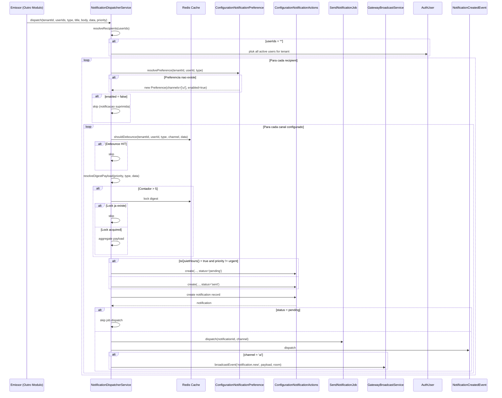
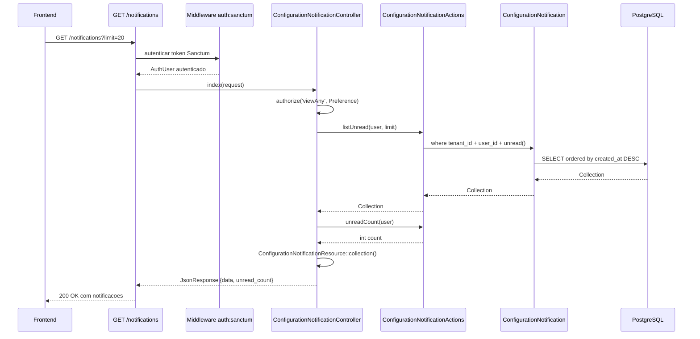
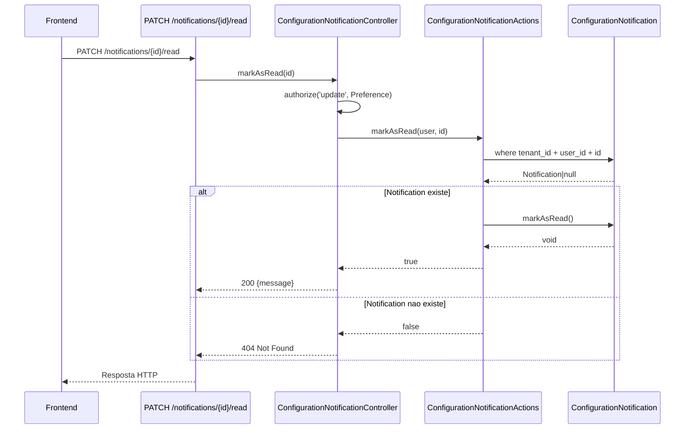
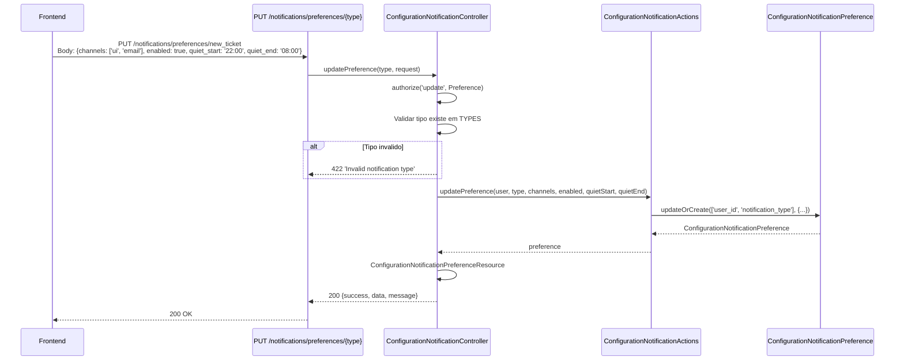
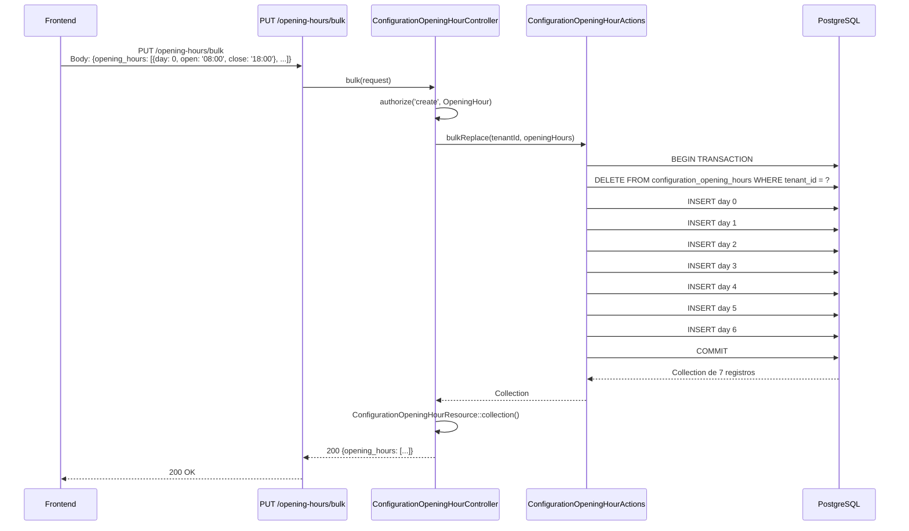
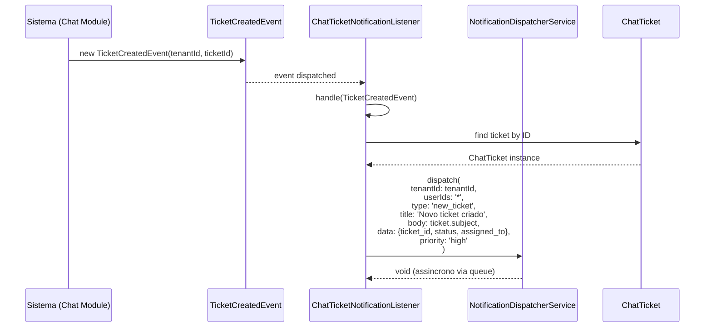
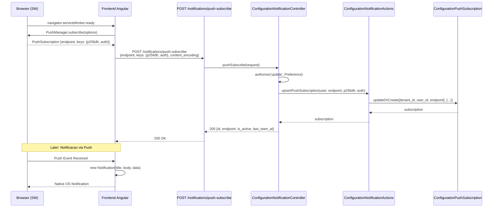
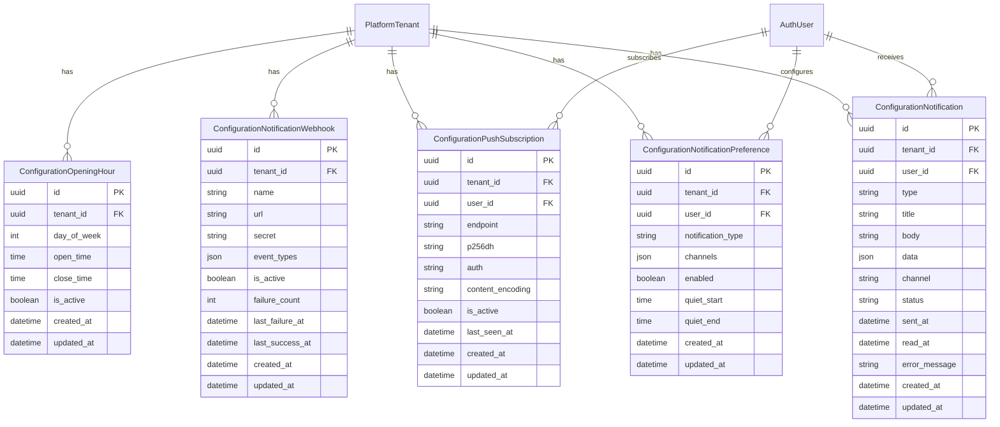

# PRD-CONFIG-001 — Modulo de Configuracao do AgentFlix

> **Modulo:** Configuration
> **Status:** rascunho
> **Autor:** PM / DOC
> **Data:** 2026-03-28
> **Versao:** 1.0
> **Stack:** Laravel 12 / Angular 20 / NestJS 11
> **Tenancy:** Multi-tenant com isolamento por `tenant_id`

---

## 1. CONTEXTO

O modulo Configuration e responsavel por centralizar todas as configuracoes operacionais e de sistema que dao suporte ao funcionamento dos demais modulos do AgentFlix. Diferentemente de modulos que encapsulam dominios de negocio (como CRM, Chat ou Billing), o modulo Configuration age como uma camada transversal que gerencia parametros de comportamento, preferencias de usuario, politicas de entrega de conteudo e disponibilidade de servicos.

O AgentFlix e uma plataforma SaaS multi-tenant para comunicacao inteligente com clientes via WhatsApp, combinando CRM, Chat, Billing e Inteligencia Artificial em um unico ecossistema. Cada empresa (tenant) opera com total isolamento: seus contatos, conversas, cobrancas e configuracoes sao absolutamente privadas em relacao a outros tenants. O modulo Configuration garante que os parametros de operacao e as politicas de entrega sejam respeitadas individualmente por tenant.

### 1.1 Historico e Evolucao

O modulo Configuration foi projetado para resolver tres problemas fundamentais na arquitetura do AgentFlix:

**Problema 1 — Fragmentacao de Configuracoes**: Em sistemas SaaS maduros, configuracoes tendem a se espalhar por multiplas tabelas e models sem nenhuma consolidacao. Inicialmente, parametros de funcionamento (horarios de atendimento, chaves de API, flags de funcionalidade) eram armazenados em colunas ad-hoc em tabelas de outros modulos. Isso gerava duplicacao de logica, dificuldade de manutencao e ausencia de auditabilidade. O modulo Configuration centraliza todas essas configuracoes em um dominio coeso com Models, Actions, Resources e Policies dedicados.

**Problema 2 — Ausencia de Preferencias Personalizaveis por Usuario**: O AgentFlix precisava de um mecanismo para que cada usuario pudesse controlar quais tipos de notificacao receberia e por quais canais (UI em tempo real, email, push web, WhatsApp, webhook). Alem disso, cada usuario precisava poder definir horarios de silencio (quiet hours) para evitar interrupcoes fora do expediente. O modulo Configuration implementa esse sistema completo de preferencias de notificacao com suporte a 5 canais distintos e 9 tipos de notificacao.

**Problema 3 — Logica de Disponibilidade de Atendimento**: A plataforma opera em um contexto onde o horario de funcionamento do tenant e critico para automacoes. Quando um cliente envia uma mensagem fora do horario de atendimento, o sistema precisa saber disso para rotear a mensagem para uma fila de atendimento humano, exibir uma mensagem de fora do expediente ou adiar o envio de uma notificacao ate o proximo dia util. O modulo Configuration fornece a logica de negocio para isso.

### 1.2 Arquitetura do Modulo

O modulo Configuration segue a arquitetura DDD (Domain-Driven Design) adotada pelo AgentFlix em todos os seus modulos. Cada entidade de configuracao segue um caminho previsivel:

```
Controller (final class, HTTP/JSON)
  -> Action (final class, logica de negocio)
  -> Model (final class, Eloquent)
  -> Resource (serializacao de resposta)
  -> Policy (autorizacao via Gates)
```

O modulo e composto por tres sub-dominios principais:

1. **Sub-dominio de Notificacoes** (`Configuration/Notification/`): Gerencia a entrega multi-canal de alertas e a configuracao de preferencias por usuario. Este e o sub-dominio mais complexo do modulo.

2. **Sub-dominio de Horarios de Atendimento** (`Configuration/OpeningHour/`): Define os periodos operacionais do tenant por dia da semana, usados para automacao e verificacao de disponibilidade.

3. **Sub-dominio de Transcricao de Midia** (`Configuration/MediaTranscription/`): Armazena configuracoes de transcricao automatica de audio, imagem e video por tenant, incluindo limites de uso.

### 1.3 Integracao com Outros Modulos

O modulo Configuration niao e isolado — ele se integra profundamente com praticamente todos os demais modulos da plataforma:

- **Modulo Chat**: Os eventos de ticket (TicketCreatedEvent, TicketAssignedEvent, TicketClosedEvent) disparam notificacoes configuradas no modulo Configuration via ChatTicketNotificationListener. Quando um ticket e criado, o sistema consulta as preferencias do usuario para decidir se deve ou niao enviar uma notificacao.

- **Modulo Billing**: Eventos de invoice e payment (BillingInvoiceCreatedEvent, BillingPaymentConfirmedEvent, BillingPaymentOverdueEvent) sao capturados por BillingNotificationListener, que despacha notificacoes atraves do NotificationDispatcherService. Notificacoes de pagamento em atraso tem prioridade urgente e ignoram quiet hours.

- **Modulo CRM**: Eventos de negociacao (NegotiationWonEvent, NegotiationLostEvent) sao capturados por CrmNotificationListener, permitindo que usuarios do CRM recebam alertas sobre evolucao de Pipeline.

- **Modulo AI**: Eventos de hot lead (AiHotLeadDetectedEvent) e escalacao (AiEscalationRequiredEvent) sao processados por AiNotificationListener. Alem disso, o sub-dominio de transcricao de midia depende de permissoes AI (Gate `ai.autopilots.manage`).

- **Modulo Gateway**: O NotificationDispatcherService utiliza GatewayBroadcastService para realizar broadcasts via WebSocket para o canal UI. O SendNotificationJob tambem usa ChatGatewayService para enviar mensagens via WhatsApp.

### 1.4 Decisoes Arquiteturais Chave

**Decisao 1 — Multi-canal nativo no dispatcher**: O NotificationDispatcherService foi projetado para ser o unico ponto de entrada para envio de notificacoes. Em vez de cada modulo implementar sua propria logica de envio, todos dispatcham atraves do servico central. Isso garante que preferencias de usuario, quiet hours e debounce sejam aplicados de forma consistente em toda a plataforma.

**Decisao 2 — Preferencias por tipo de notificacao, nao por canal**: O modelo de preferencias foi desenhado no nivel de "tipo de notificacao" (new_ticket, billing, system) onde cada tipo pode ter multiplos canais ativos simultaneamente. Isso permite, por exemplo, receber notificacoes de ticket por UI e email ao mesmo tempo, mas apenas alertas de billing por WhatsApp.

**Decisao 3 — Webhooks como configuracao de tenant**: Ao inves de cada usuario configurar webhooks individuais, os webhooks de notificacao sao configurados no nivel do tenant (ConfigurationNotificationWebhook). Isso permite que equipes de integracao configurem um endpoint unico que recebe todos os eventos de interesse.

**Decisao 4 — Horarios de funcionamento como replace-all**: A operacao bulk de horarios de funcionamento substitui todos os registros existentes. Isso foi intencional para simplificar a edicao de horarios — o frontend envia o estado completo desejado e o backend atomiza a substituicao dentro de uma transacao de banco de dados.

**Decisao 5 — Debounce por entidade**: Para evitar que o mesmo evento gere multiplas notificacoes repetidas para o mesmo usuario no mesmo canal, o dispatcher implementa debounce baseado em entity_type + entity_id com TTL de 5 minutos. Se o usuario receber 10 atualizacoes do mesmo ticket em 5 minutos, apenas a primeira gera uma notificacao.

---

## 2. OBJETIVO

O objetivo deste PRD e documentar de forma abrangente todos os requisitos funcionais e nao-funcionais do modulo Configuration do AgentFlix, estabelecendo as regras de negocio, fluxos de usuario e sistema, estrutura de entidades, contratos de API, modelo de eventos, politicas de seguranca e criterios de aceite para a implementacao e evolucao do modulo.

### 2.1 Objetivos Funcionais

O modulo Configuration deve prover as seguintes capacidades funcionais:

**Objetivo 1 — Sistema de Notificacoes Multi-Canal**: Implementar um sistema completo de notificacoes que entrega alertas aos usuarios atraves de 5 canais distintos (UI realtime via WebSocket, Email, Push Web, WhatsApp e Webhook), respeitando preferencias individuais por tipo de notificacao e horario de silencio.

**Objetivo 2 — Gestao de Preferencias de Usuario**: Permitir que cada usuario autenticado configure quais tipos de notificacao deseja receber, por quais canais, e em quais horarios. As preferencias devem ser persistidas, auditaveis e aplicadas automaticamente em todo dispatch de notificacao.

**Objetivo 3 — Configuracao de Webhooks**: Permitir que administradores de tenant configurem endpoints HTTP para receber payloads de eventos de notificacao, com suporte a filtro por tipo de evento, autenticacao HMAC e rastreamento de falhas.

**Objetivo 4 — Gestao de Horarios de Atendimento**: Fornecer CRUD completo de horarios operacionais por dia da semana, permitindo que o tenant defina sua janela de funcionamento e que o sistema consulte essa informacao em tempo real.

**Objetivo 5 — Verificacao de Disponibilidade em Tempo Real**: Expor um endpoint rapido que informa se o tenant esta atualmente em horario de atendimento, utilizado por automacoes de chat e sistemas de roteamento.

**Objetivo 6 — Configuracao de Transcricao de Midia**: Permitir que administradores com a permissao `ai.autopilots.manage` configurem quais tipos de midia (audio, imagem, video) devem ser transcritos automaticamente, incluindo limites de uso.

### 2.2 Objetivos Nao-Funcionais

**Objetivo 7 — Desempenho**: O dispatcher de notificacoes deve ser assincrono via fila (BullMQ). O tempo de resposta do endpoint de verificacao de abertura (isOpen) deve ser inferior a 100ms. O debounce deve previnir que o mesmo evento gere mais de 12 notificacoes por hora por entidade.

**Objetivo 8 — Confiabilidade**: Jobs de envio de notificacao devem ter retry com backoff exponencial (3 tentativas: 10s, 60s, 300s). Notificacoes que falham apos todas as tentativas devem ser marcadas como `failed` com mensagem de erro para auditabilidade.

**Objetivo 9 — Seguranca**: Todos os endpoints devem ser protegidos por autenticacao Sanctum. O secret de webhook deve ser armazenado de forma segura. Headers de assinatura HMAC-SHA256 devem ser incluidos em todas as entregas de webhook. Dados de push subscription (p256dh, auth) devem ser tratados como secretos.

**Objetivo 10 — Escalabilidade**: O sistema deve suportar multiplas instancias do job worker processando notificacoes em paralelo. O debounce e o contador de digest devem usar cache Redis para consistencia em ambiente distribuido.

---

## 3. REGRAS DE NEGOCIO

### 3.1 Regras de Notificacao

| ID | Regra | Prioridade | Categoria |
|----|-------|------------|-----------|
| RN-001 | Toda notificacao deve pertencer a um tenant (`tenant_id`) e a um usuario destinatario (`user_id`) | Critica | Isolamento |
| RN-002 | Notificacoes possuem status: `pending` (na fila), `sent` (enviada), `failed` (falhou), `read` (lida pelo usuario) | Critica | Ciclo de vida |
| RN-003 | O campo `status` deve ser alterado exclusivamente atraves dos metodos `markAsSent()`, `markAsFailed()` e `markAsRead()` do model | Critica | Imutabilidade |
| RN-004 | Apenas notificacoes com `status` diferente de `read` podem ser marcadas como lidas | Alta | Validacao |
| RN-005 | O campo `read_at` deve ser preenchido automaticamente no momento da marcacao como lida | Alta | Auditoria |
| RN-006 | Notificacoes pendentes durante quiet hours devem ter `status` = `pending` e `quiet_hours_blocked` = true nos dados | Alta | Quiet hours |
| RN-007 | Notificacoes com prioridade `urgent` ignoram quiet hours e sao sempre processadas | Alta | Quiet hours |
| RN-008 | O dispatcher deve verificar preferencias do usuario antes de criar registros de notificacao | Critica | Preferencias |
| RN-009 | Se um usuario nao possui preferencia configurada para um tipo de notificacao, usar defaults: canais `['ui']` e `enabled = true` | Media | Default |
| RN-010 | O debounce e aplicado por combinacao de: `tenant_id + user_id + type + channel + entity_type + entity_id` | Alta | Anti-spam |
| RN-011 | A janela de debounce e de 5 minutos (`DEBOUNCE_TTL_MINUTES = 5`) | Alta | Anti-spam |
| RN-012 | O modo digest e ativado quando o contador de notificacoes do mesmo tipo para o mesmo usuario excede 5 por minuto | Media | Agregacao |
| RN-013 | Notificacoes em modo digest substituem o titulo por "Resumo de notificacoes" e body por mensagem agregada | Media | Agregacao |
| RN-014 | O dispatcher suporta broadcast para todos os usuarios ativos do tenant quando `userIds = '*'` | Media | Broadcast |
| RN-015 | Cada canal de entrega deve verificar suas precondicoes antes de executar (ex: push precisa de assinatura ativa, whatsapp precisa de instancia ativa) | Alta | Entrega |

### 3.2 Regras de Canais de Entrega

| ID | Regra | Prioridade | Categoria |
|----|-------|------------|-----------|
| RN-016 | Canal `ui` utiliza broadcast WebSocket via GatewayBroadcastService para evento `notification.new` | Critica | Canal UI |
| RN-017 | Canal `email` requer que o usuario tenha email cadastrado. Falha se `recipient->email` for vazio | Alta | Canal Email |
| RN-018 | Canal `push` requer pelo menos uma assinatura ativa em `configuration_push_subscriptions` com `is_active = true` | Alta | Canal Push |
| RN-019 | Canal `whatsapp` requer instancia ativa do Chat Gateway e telefone do destinatario | Alta | Canal WhatsApp |
| RN-020 | Canal `webhook` delivers para todos os webhooks ativos do tenant que filtrem por `event_types` | Alta | Canal Webhook |
| RN-021 | Mensagens de webhook incluem headers `X-Notification-Id` e `X-Notification-Type` | Alta | Webhook |
| RN-022 | Se `webhook.secret` estiver configurado, incluir `X-Notification-Signature` com HMAC-SHA256 do payload | Alta | Webhook |
| RN-023 | Cada falha de webhook incrementa `failure_count` e registra `last_failure_at` | Media | Webhook |
| RN-024 | Cada sucesso de webhook reseta `failure_count` para 0 e registra `last_success_at` | Media | Webhook |
| RN-025 | Telefone em canal WhatsApp deve ser normalizado (apenas digitos) antes do envio | Alta | WhatsApp |
| RN-026 | Mensagem WhatsApp concatena titulo e body da notificacao em um texto unico | Media | WhatsApp |

### 3.3 Regras de Preferencias de Notificacao

| ID | Regra | Prioridade | Categoria |
|----|-------|------------|-----------|
| RN-027 | Cada usuario pode ter uma preferencia por tipo de notificacao | Critica | Preferencias |
| RN-028 | Tipos de notificacao disponiveis: `new_ticket`, `ticket_assigned`, `ticket_updated`, `ticket_closed`, `reminder`, `event`, `mention`, `system`, `billing` | Critica | Tipos |
| RN-029 | Canais disponiveis: `ui`, `email`, `push`, `whatsapp`, `webhook` | Critica | Canais |
| RN-030 | O campo `channels` e um array JSON que pode conter um ou mais canais | Alta | Canais |
| RN-031 | Se `channels` for array vazio ou null, usar `['ui']` como default | Media | Default |
| RN-032 | Quiet hours sao definidas por horario de inicio (`quiet_start`) e fim (`quiet_end`) no formato HH:MM | Media | Quiet hours |
| RN-033 | Quiet hours com `quiet_start > quiet_end` indicam periodo que cruza a meia-noite (ex: 22:00 a 06:00) | Media | Quiet hours |
| RN-034 | Metodo `isQuietHours()` deve corretamente tratar periodos que cruzam meia-noite | Alta | Quiet hours |
| RN-035 | Quiet hours apenas bloqueiam notificacoes nao-urgentes (`priority !== 'urgent'`) | Alta | Quiet hours |
| RN-036 | Preferencias sao atualizadas via `updateOrCreate` garantindo que apenas um registro exista por `user_id + notification_type` | Alta | Persistencia |
| RN-037 | Bulk update de preferencias deve ignorar tipos invalidos (nao presentes em `TYPES`) | Media | Validacao |

### 3.4 Regras de Horarios de Atendimento

| ID | Regra | Prioridade | Categoria |
|----|-------|------------|-----------|
| RN-038 | `day_of_week` deve ser um inteiro de 0 (Domingo) a 6 (Sabado), seguindo a convencao PHP Carbon | Critica | Validacao |
| RN-039 | `open_time` e `close_time` devem seguir o formato HH:MM (24 horas) | Critica | Validacao |
| RN-040 | `open_time` deve ser estritamente menor que `close_time` | Critica | Validacao |
| RN-041 | Um tenant pode ter no maximo 7 registros de horario (um por dia da semana) | Media | Cardinalidade |
| RN-042 | A operacao `bulkReplace` deleta todos os horarios existentes antes de inserir os novos dentro de transacao atomica | Alta | Operacao |
| RN-043 | Se nenhum horario estiver configurado para o dia atual, `is_open` deve retornar `false` | Alta | Verificacao |
| RN-044 | Apenas horarios com `is_active = true` sao considerados na verificacao de abertura | Alta | Filtro |
| RN-045 | O sistema deve considerar o timezone do tenant ao verificar abertura | Media | Timezone |

### 3.5 Regras de Push Subscription

| ID | Regra | Prioridade | Categoria |
|----|-------|------------|-----------|
| RN-046 | Cada push subscription deve pertencer a um tenant e um usuario | Critica | Isolamento |
| RN-047 | Push subscription e unica por combinacao de `tenant_id + user_id + endpoint` | Alta | Uniquiness |
| RN-048 | Campos `p256dh` e `auth` sao obrigatorios e devem ser armazenados verbatim | Alta | Dados |
| RN-049 | `content_encoding` default e `aes128gcm` | Media | Default |
| RN-050 | `last_seen_at` deve ser atualizado a cada re-inscricao (upsert) | Media | Auditoria |
| RN-051 | Ao desinscrever, `is_active` deve ser alterado para `false` — exclusao fisica proibida | Alta | Imutabilidade |

### 3.6 Regras de Transcricao de Midia

| ID | Regra | Prioridade | Categoria |
|----|-------|------------|-----------|
| RN-052 | Configuracoes de transcricao de midia sao armazenadas no nivel do tenant | Critica | Escopo |
| RN-053 | Apenas usuarios com permissao `ai.autopilots.manage` podem visualizar e alterar configuracoes de transcricao | Critica | Autorizacao |
| RN-054 | Configuracoes incluem flags para audio, imagem e video alem de limites de uso | Media | Granularidade |

### 3.7 Regras de Seguranca e Isolamento

| ID | Regra | Prioridade | Categoria |
|----|-------|------------|-----------|
| RN-055 | Todos os endpoints do modulo Configuration exigem autenticacao `auth:sanctum` | Critica | Autenticacao |
| RN-056 | Todo acesso a dados deve ser filtrado pelo `tenant_id` via trait `BelongsToTenant` | Critica | Isolamento |
| RN-057 | Soft delete e proibido em todas as entidades deste modulo — exclusao logica apenas quando explicitamente especificado | Alta | Imutabilidade |
| RN-058 | UUIDs como chave primaria em todas as entidades — nunca auto-increment | Critica | Identidade |
| RN-059 | Logs nunca devem conter tokens, passwords, API keys ou secrets de webhook | Critica | Seguranca |
| RN-060 | Rate limiting: maximo 60 requisicoes por minuto por usuario para endpoints de preferencia | Media | Rate limit |
| RN-061 | Secrets de webhook devem ser write-only — nunca retornados em responses da API | Critica | Seguranca |

---

## 4. FLUXOS

### 4.1 Fluxos de Notificacao

#### Fluxo Principal — Dispatch de Notificacao



#### Fluxo de Envio por Canal (SendNotificationJob)

```mermaid
flowchart TD
    Start([Inicio do Job]) --> Find[Buscar Notification por ID]
    Find --> NotFound{Notification<br/>existe?}
    NotFound -->|Sim| Route[match channel]
    NotFound -->|Nao| EndFail([Fim - exit])

    Route -->|ui| SendUI[sendViaUi]
    Route -->|email| SendEmail[sendViaEmail]
    Route -->|push| SendPush[sendViaPush]
    Route -->|whatsapp| SendWhatsApp[sendViaWhatsApp]
    Route -->|webhook| SendWebhook[sendViaWebhook]
    Route -->|default| MarkFailed[markAsFailed]

    SendUI --> BroadcastWS[GatewayBroadcastService<br/>notification:new + notification.sent]
    BroadcastWS --> MarkSentUI[markAsSent]
    MarkSentUI --> EndOk([Sucesso])

    SendEmail --> FindUser[Buscar AuthUser]
    FindUser --> EmailOk{Usuario tem<br/>email?}
    EmailOk -->|Nao| MarkFailEmail[markAsFailed<br/>Recipient email not found]
    EmailFailEmail --> EndOk
    EmailOk -->|Sim| SendMail[Mail::to()->send(NotificationMail)]
    SendMail --> MarkSentEmail[markAsSent]
    MarkSentEmail --> EndOk

    SendPush --> FindSubs[Buscar PushSubscriptions<br/>is_active=true]
    FindSubs --> SubsEmpty{Subscriptions<br/>existem?}
    SubsEmpty -->|Nao| MarkFailPush[markAsFailed<br/>No active subscription]
    SubsEmpty -->|Sim| BroadcastPush[GatewayBroadcastService<br/>notification.push]
    BroadcastPush --> MarkSentPush[markAsSent]
    MarkSentPush --> EndOk

    SendWhatsApp --> FindUserWP[Buscar AuthUser]
    FindUserWP --> PhoneOk{Telefone<br/>existe?}
    PhoneOk -->|Nao| MarkFailWP[markAsFailed<br/>Recipient phone not found]
    PhoneOk -->|Sim| FindInstance[Buscar ChatInstance ativa]
    FindInstance --> InstanceOk{Instancia<br/>ativa?}
    InstanceOk -->|Nao| MarkFailWP2[markAsFailed<br/>No active instance]
    InstanceOk -->|Sim| NormalizePhone[normalizePhone<br/>preg_replace D]
    NormalizePhone --> SendWAMessage[ChatGatewayService<br/>sendText]
    SendWAMessage --> MarkSentWP[markAsSent]
    MarkSentWP --> EndOk

    SendWebhook --> FindWebhooks[Buscar Webhooks ativos]
    FindWebhooks --> WebhooksEmpty{Webhooks<br/>existem?}
    WebhooksEmpty -->|Nao| MarkFailWH[markAsFailed<br/>No active webhook]
    WebhooksEmpty -->|Sim| LoopWebhook[Loop por webhook]
    LoopWebhook --> FilterType{Tipo filtra<br/>por event_types?}
    FilterType -->|Sim| LoopWebhook
    FilterType -->|Nao| BuildPayload
    BuildPayload --> BuildHeaders[Content-Type<br/>X-Notification-Id<br/>X-Notification-Type<br/>X-Notification-Signature<br/>HMAC-SHA256]
    BuildHeaders --> HTTPPost[HTTP POST<br/>timeout=10s]
    HTTPPost --> ResponseOk{Response<br/>200-299?}
    ResponseOk -->|Sim| Delivered[delivered=true<br/>reset failure_count]
    Delivered --> LoopWebhook
    ResponseOk -->|Nao| IncrementFail[failure_count++<br/>last_failure_at=now]
    IncrementFail --> LoopWebhook
    AllWebhooks --> DeliveredCheck{Todos<br/>falharam?}
    DeliveredCheck -->|Sim| MarkFailAll[markAsFailed<br/>All webhooks failed]
    MarkFailAll --> EndOk
    DeliveredCheck -->|Nao| MarkSentWH[markAsSent]
    MarkSentWH --> EndOk

    MarkFailed --> EndOk
    MarkFailEmail --> EndOk
    MarkFailPush --> EndOk
    MarkFailWP --> EndOk
    MarkFailWP2 --> EndOk
    MarkFailWH --> EndOk
```

#### Fluxo de Listagem de Notificacoes



#### Fluxo de Marcacao de Notificacao como Lida



#### Fluxo de Atualizacao de Preferencia



### 4.2 Fluxos de Horarios de Atendimento

#### Fluxo de Bulk Update de Horarios



#### Fluxo de Verificacao de Abertura

```mermaid
flowchart TD
    Start([FE: GET /opening-hours/is-open]) --> Auth{Middleware<br/>auth:sanctum}
    Auth -->|Falha| 401[401 Unauthorized]
    Auth -->|OK| Ctrl[OpeningHourController::isOpen]
    Ctrl --> Actions[OpeningHourActions::isOpen]
    Actions --> Now[now() - Carbon]
    Now --> DayOfWeek[dayOfWeek = 0-6]
    Now --> CurrentTime[currentTime = H:i]

    Actions --> Query[SELECT FROM opening_hours<br/>WHERE tenant_id = ?<br/>AND is_active = true<br/>AND day_of_week = ?<br/>AND open_time <= ?<br/>AND close_time >= ?]

    Query --> Found{Horario<br/>encontrado?}
    Found -->|Sim| Open[is_open = true<br/>opening_hour = registro]
    Found -->|Nao| Closed[is_open = false<br/>opening_hour = null]

    Open --> Response[{is_open: true,<br/>current_day: ?,<br/>current_time: ?,<br/>opening_hour: {...}}]

    Closed --> Response2[{is_open: false,<br/>current_day: ?,<br/>current_time: ?,<br/>opening_hour: null}]

    Response --> FE[FE: Exibir status<br/>"Aberto" ou "Fechado"]
    Response2 --> FE
```

### 4.3 Fluxos de Eventos e Listeners

#### Fluxo de Evento de Ticket -> Notificacao



### 4.4 Fluxos de Push Subscription

#### Fluxo de Inscricao e Envio Push



---

## 5. ENTIDADES E MODELOS

### 5.1 Diagrama de Entidades



### 5.2 ConfigurationNotification

**Resumo:** Registro individual de uma notificacao enviada ou pendente. Mantem o historico completo de entrega para auditoria.

**Namespace:** `Domain\Configuration\Models\ConfigurationNotification`

**Tabela:** `configuration_notifications`

**Campos:**

| Campo | Tipo | Nulavel | Descricao |
|-------|------|---------|-----------|
| `id` | UUID | Nao | Chave primaria, UUID v4 ordenado |
| `tenant_id` | UUID | Nao | FK para `platform_tenants` |
| `user_id` | UUID | Nao | FK para `auth_users` (destinatario) |
| `type` | string(100) | Nao | Tipo de notificacao (ex: `new_ticket`) |
| `title` | string(255) | Nao | Titulo da notificacao |
| `body` | text | Sim | Corpo/mensagem da notificacao |
| `data` | JSON | Sim | Payload adicional (entity_id, priority, etc) |
| `channel` | string(50) | Nao | Canal de entrega (ui, email, push, whatsapp, webhook) |
| `status` | string(20) | Nao | Status: `pending`, `sent`, `failed`, `read` |
| `sent_at` | datetime | Sim | Timestamp de envio efetivo |
| `read_at` | datetime | Sim | Timestamp de leitura pelo usuario |
| `error_message` | string(1000) | Sim | Mensagem de erro em caso de falha |
| `created_at` | datetime | Nao | Timestamp de criacao |
| `updated_at` | datetime | Nao | Timestamp de ultima alteracao |

**Constantes de Status:**

```php
public const STATUS_PENDING = 'pending';
public const STATUS_SENT    = 'sent';
public const STATUS_FAILED  = 'failed';
public const STATUS_READ    = 'read';
```

**Metodos de dominio:**

- `markAsSent(): void` — Altera status para `sent` e preenche `sent_at`
- `markAsFailed(string $error): void` — Altera status para `failed` e registra `error_message`
- `markAsRead(): void` — Altera status para `read` e preenche `read_at` (apenas se nao for `read`)
- `scopeUnread(Builder $query): Builder` — Escopo para filtrar notificacoes nao lidas

**Relacionamentos:**
- `tenant(): BelongsTo` — Tenant proprietario
- `user(): BelongsTo` — Usuario destinatario

**Traits utilizadas:**
- `BelongsToTenant` — Escopo automatico por tenant_id
- `HasUuids` — UUIDs como primary key

---

### 5.3 ConfigurationNotificationPreference

**Resumo:** Preferencia individual de notificacao por tipo e canal. Cada usuario pode customizar como e por onde deseja receber cada tipo de alerta.

**Namespace:** `Domain\Configuration\Models\ConfigurationNotificationPreference`

**Tabela:** `configuration_notification_preferences`

**Campos:**

| Campo | Tipo | Nulavel | Descricao |
|-------|------|---------|-----------|
| `id` | UUID | Nao | Chave primaria |
| `tenant_id` | UUID | Nao | FK para `platform_tenants` |
| `user_id` | UUID | Nao | FK para `auth_users` |
| `notification_type` | string(50) | Nao | Tipo de notificacao |
| `channels` | JSON | Nao | Array de canais ativos |
| `enabled` | boolean | Nao | Se notificacoes deste tipo estao habilitadas |
| `quiet_start` | time | Sim | Inicio do horario de silencio (HH:MM) |
| `quiet_end` | time | Sim | Fim do horario de silencio (HH:MM) |
| `created_at` | datetime | Nao | Timestamp de criacao |
| `updated_at` | datetime | Nao | Timestamp de alteracao |

**Tipos de notificacao disponiveis:**

```php
public const TYPES = [
    'new_ticket'      => 'Novo Ticket',
    'ticket_assigned' => 'Ticket Atribuido',
    'ticket_updated' => 'Ticket Atualizado',
    'ticket_closed'  => 'Ticket Fechado',
    'reminder'       => 'Lembrete',
    'event'           => 'Evento',
    'mention'        => 'Mencao',
    'system'         => 'Sistema',
    'billing'        => 'Faturamento',
];
```

**Canais de entrega disponiveis:**

```php
public const CHANNELS = [
    'ui'       => 'Interface (Realtime)',
    'email'    => 'Email',
    'push'     => 'Push (Web)',
    'whatsapp' => 'WhatsApp',
    'webhook'  => 'Webhook',
];
```

**Metodos de dominio:**

- `hasChannel(string $channel): bool` — Verifica se um canal esta na lista de canais ativos
- `isQuietHours(): bool` — Verifica se o momento atual esta dentro do horario de silencio

**Tratamento de timezone de quiet hours:**
- Se `quiet_start > quiet_end` (ex: 22:00 a 06:00), o periodo cruza meia-noite
- Nesses casos: retorna `true` se `now >= quiet_start OR now <= quiet_end`
- Caso contrario: retorna `true` se `now >= quiet_start AND now <= quiet_end`

---

### 5.4 ConfigurationNotificationWebhook

**Resumo:** Configuracao de endpoint HTTP para entrega de notificacoes a sistemas externos. Cada webhook pode filtrar por tipos de evento.

**Namespace:** `Domain\Configuration\Models\ConfigurationNotificationWebhook`

**Tabela:** `configuration_notification_webhooks`

**Campos:**

| Campo | Tipo | Nulavel | Descricao |
|-------|------|---------|-----------|
| `id` | UUID | Nao | Chave primaria |
| `tenant_id` | UUID | Nao | FK para `platform_tenants` |
| `name` | string(100) | Nao | Nome descritivo do webhook |
| `url` | string(500) | Nao | URL do endpoint |
| `secret` | string(255) | Sim | Secret para assinatura HMAC-SHA256 |
| `event_types` | JSON | Sim | Array de tipos a filtrar (vazio = todos) |
| `is_active` | boolean | Nao | Se o webhook esta ativo |
| `failure_count` | integer | Nao | Contador de falhas consecutivas |
| `last_failure_at` | datetime | Sim | Timestamp da ultima falha |
| `last_success_at` | datetime | Sim | Timestamp do ultimo sucesso |
| `created_at` | datetime | Nao | Timestamp de criacao |
| `updated_at` | datetime | Nao | Timestamp de alteracao |

**Relacionamentos:**
- `tenant(): BelongsTo` — Tenant proprietario

---

### 5.5 ConfigurationOpeningHour

**Resumo:** Define a janela de funcionamento do tenant por dia da semana. Usado para verificar disponibilidade em tempo real.

**Namespace:** `Domain\Configuration\Models\ConfigurationOpeningHour`

**Tabela:** `configuration_opening_hours`

**Campos:**

| Campo | Tipo | Nulavel | Descricao |
|-------|------|---------|-----------|
| `id` | UUID | Nao | Chave primaria |
| `tenant_id` | UUID | Nao | FK para `platform_tenants` |
| `day_of_week` | integer | Nao | Dia 0=Domingo a 6=Sabado |
| `open_time` | time | Nao | Hora de abertura (HH:MM) |
| `close_time` | time | Nao | Hora de fechamento (HH:MM) |
| `is_active` | boolean | Nao | Se este horario esta ativo |
| `created_at` | datetime | Nao | Timestamp de criacao |
| `updated_at` | datetime | Nao | Timestamp de alteracao |

**Escopos:**
- `scopeActive(Builder $query): Builder` — Filtra apenas horarios ativos (`is_active = true`)

**Validacoes de dominio:**
- `day_of_week` deve estar entre 0 e 6
- `open_time` deve ser menor que `close_time`
- Nao pode haver dois registros ativos para o mesmo dia do mesmo tenant

---

### 5.6 ConfigurationPushSubscription

**Resumo:** Armazena dados de inscricao do Web Push API para entrega de notificacoes push nativas no navegador.

**Namespace:** `Domain\Configuration\Models\ConfigurationPushSubscription`

**Tabela:** `configuration_push_subscriptions`

**Campos:**

| Campo | Tipo | Nulavel | Descricao |
|-------|------|---------|-----------|
| `id` | UUID | Nao | Chave primaria |
| `tenant_id` | UUID | Nao | FK para `platform_tenants` |
| `user_id` | UUID | Nao | FK para `auth_users` |
| `endpoint` | string(1000) | Nao | URL unica do endpoint push |
| `p256dh` | string(255) | Nao | Chave publica ECDH do assinante |
| `auth` | string(255) | Nao | Chave de autenticacao |
| `content_encoding` | string(50) | Nao | Encoding da payload (default: `aes128gcm`) |
| `is_active` | boolean | Nao | Se a assinatura esta ativa |
| `last_seen_at` | datetime | Sim | Ultima vez que o navegador confirmou a assinatura |
| `created_at` | datetime | Nao | Timestamp de criacao |
| `updated_at` | datetime | Nao | Timestamp de alteracao |

**Relacionamentos:**
- `tenant(): BelongsTo` — Tenant proprietario
- `user(): BelongsTo` — Usuario assinante

---

## 6. ENDPOINTS

### 6.1 Grupo — Notificacoes

Base path: `/api/notifications`

---

#### GET /api/notifications

**Resumo:** Lista notificacoes nao lidas do usuario autenticado com contagem total.

**Autenticacao:** Bearer Token (Sanctum)

**Politica:** `ConfigurationNotificationPreferencePolicy@viewAny`

**Query Parameters:**

| Parametro | Tipo | Default | Descricao |
|-----------|------|---------|-----------|
| `limit` | integer | 20 | Numero maximo de notificacoes (1-100) |

**Response 200:**

```json
{
  "data": [
    {
      "id": "550e8400-e29b-41d4-a716-446655440001",
      "tenant_id": "550e8400-e29b-41d4-a716-446655440000",
      "user_id": "550e8400-e29b-41d4-a716-446655440002",
      "type": "new_ticket",
      "title": "Novo ticket criado",
      "body": "Duvida sobre cobranca",
      "data": {
        "ticket_id": "660e8400-e29b-41d4-a716-446655440003",
        "status": "open",
        "assigned_to": "770e8400-e29b-41d4-a716-446655440004",
        "priority": "high",
        "quiet_hours_blocked": false
      },
      "channel": "ui",
      "status": "sent",
      "sent_at": "2026-03-28T10:00:00Z",
      "read_at": null,
      "created_at": "2026-03-28T10:00:00Z"
    }
  ],
  "unread_count": 15
}
```

**Response 401:** Nao autenticado

**Response 403:** Usuario sem permissao

---

#### PATCH /api/notifications/{id}/read

**Resumo:** Marca uma notificacao especifica como lida.

**Autenticacao:** Bearer Token (Sanctum)

**Politica:** `ConfigurationNotificationPreferencePolicy@update`

**Path Parameters:**

| Parametro | Tipo | Descricao |
|-----------|------|-----------|
| `id` | UUID | Identificador da notificacao |

**Response 200:**

```json
{
  "success": true,
  "message": "Notification marked as read"
}
```

**Response 404:** Notificacao nao encontrada ou pertence a outro tenant/usuario

---

#### POST /api/notifications/read-all

**Resumo:** Marca todas as notificacoes nao lidas do usuario como lidas.

**Autenticacao:** Bearer Token (Sanctum)

**Politica:** `ConfigurationNotificationPreferencePolicy@update`

**Request Body:** Vazio

**Response 200:**

```json
{
  "count": 15,
  "message": "Marked notifications as read"
}
```

---

#### GET /api/notifications/preferences

**Resumo:** Retorna todas as preferencias de notificacao do usuario, incluindo tipos nao configurados com valores default.

**Autenticacao:** Bearer Token (Sanctum)

**Politica:** `ConfigurationNotificationPreferencePolicy@viewAny`

**Response 200:**

```json
{
  "success": true,
  "data": [
    {
      "id": "550e8400-e29b-41d4-a716-446655440001",
      "notification_type": "new_ticket",
      "channels": ["ui", "email"],
      "enabled": true,
      "quiet_start": "22:00",
      "quiet_end": "08:00"
    }
  ],
  "types": {
    "new_ticket": "Novo Ticket",
    "ticket_assigned": "Ticket Atribuido",
    "ticket_updated": "Ticket Atualizado",
    "ticket_closed": "Ticket Fechado",
    "reminder": "Lembrete",
    "event": "Evento",
    "mention": "Mencao",
    "system": "Sistema",
    "billing": "Faturamento"
  },
  "channels": {
    "ui": "Interface (Realtime)",
    "email": "Email",
    "push": "Push (Web)",
    "whatsapp": "WhatsApp",
    "webhook": "Webhook"
  }
}
```

---

#### PUT /api/notifications/preferences/{type}

**Resumo:** Atualiza a preferencia de um tipo especifico de notificacao.

**Autenticacao:** Bearer Token (Sanctum)

**Politica:** `ConfigurationNotificationPreferencePolicy@update`

**Path Parameters:**

| Parametro | Tipo | Descricao |
|-----------|------|-----------|
| `type` | string | Tipo de notificacao (ex: `new_ticket`) |

**Request Body:**

```json
{
  "channels": ["ui", "email"],
  "enabled": true,
  "quiet_start": "22:00",
  "quiet_end": "08:00"
}
```

**Validacao:**
- `channels`: array com valores de `ConfigurationNotificationPreference::CHANNELS`
- `enabled`: boolean
- `quiet_start`: formato HH:MM, opcional
- `quiet_end`: formato HH:MM, opcional

**Response 200:**

```json
{
  "success": true,
  "data": {
    "id": "550e8400-e29b-41d4-a716-446655440001",
    "notification_type": "new_ticket",
    "channels": ["ui", "email"],
    "enabled": true,
    "quiet_start": "22:00",
    "quiet_end": "08:00"
  },
  "message": "Preference updated"
}
```

**Response 422:** Tipo de notificacao invalido

---

#### PUT /api/notifications/preferences

**Resumo:** Atualiza multiplas preferencias de uma vez (bulk update).

**Autenticacao:** Bearer Token (Sanctum)

**Politica:** `ConfigurationNotificationPreferencePolicy@update`

**Request Body:**

```json
{
  "preferences": [
    {
      "type": "new_ticket",
      "channels": ["ui"],
      "enabled": true,
      "quiet_start": null,
      "quiet_end": null
    },
    {
      "type": "billing",
      "channels": ["ui", "email", "whatsapp"],
      "enabled": true,
      "quiet_start": "22:00",
      "quiet_end": "07:00"
    }
  ]
}
```

**Validacao:**
- `preferences`: array de objetos com `type` (obrigatorio), `channels`, `enabled`, `quiet_start`, `quiet_end`
- Tipos nao existentes em `TYPES` sao ignorados silenciosamente

**Response 200:**

```json
{
  "success": true,
  "data": [
    {
      "id": "550e8400-e29b-41d4-a716-446655440001",
      "notification_type": "new_ticket",
      "channels": ["ui"],
      "enabled": true
    },
    {
      "id": "550e8400-e29b-41d4-a716-446655440002",
      "notification_type": "billing",
      "channels": ["ui", "email", "whatsapp"],
      "enabled": true,
      "quiet_start": "22:00",
      "quiet_end": "07:00"
    }
  ],
  "message": "Preferences updated"
}
```

---

#### POST /api/notifications/push-subscribe

**Resumo:** Registra ou atualiza uma inscricao de push web.

**Autenticacao:** Bearer Token (Sanctum)

**Politica:** `ConfigurationNotificationPreferencePolicy@update`

**Request Body:**

```json
{
  "endpoint": "https://fcm.googleapis.com/fcm/send/abc123...",
  "keys": {
    "p256dh": "BNc2eLx0Fl1BfRjD6xMP... ",
    "auth": "tBHItJI5svbpez7KI4UGXg=="
  },
  "content_encoding": "aes128gcm"
}
```

**Validacao:**
- `endpoint`: string, max 1000 caracteres, obrigatorio
- `keys.p256dh`: string, obrigatorio
- `keys.auth`: string, obrigatorio
- `content_encoding`: string, default `aes128gcm`

**Response 200:**

```json
{
  "success": true,
  "data": {
    "id": "550e8400-e29b-41d4-a716-446655440003",
    "endpoint": "https://fcm.googleapis.com/fcm/send/abc123...",
    "is_active": true,
    "last_seen_at": "2026-03-28T10:00:00Z"
  },
  "message": "Push subscription saved"
}
```

---

#### DELETE /api/notifications/push-subscribe

**Resumo:** Desativa uma inscricao push web.

**Autenticacao:** Bearer Token (Sanctum)

**Politica:** `ConfigurationNotificationPreferencePolicy@update`

**Request Body:**

```json
{
  "endpoint": "https://fcm.googleapis.com/fcm/send/abc123..."
}
```

**Validacao:**
- `endpoint`: string, max 1000 caracteres, obrigatorio

**Response 200:**

```json
{
  "success": true,
  "message": "Push subscription disabled"
}
```

### 6.2 Grupo — Horarios de Atendimento

Base path: `/api/opening-hours`

---

#### GET /api/opening-hours

**Resumo:** Lista todos os horarios configurados para o tenant.

**Autenticacao:** Bearer Token (Sanctum)

**Politica:** `ConfigurationOpeningHourPolicy@viewAny`

**Response 200:**

```json
{
  "success": true,
  "data": {
    "opening_hours": [
      {
        "id": "550e8400-e29b-41d4-a716-446655440010",
        "day_of_week": 0,
        "open_time": "08:00",
        "close_time": "18:00",
        "is_active": false,
        "created_at": "2026-03-28T10:00:00Z",
        "updated_at": "2026-03-28T10:00:00Z"
      },
      {
        "id": "550e8400-e29b-41d4-a716-446655440011",
        "day_of_week": 1,
        "open_time": "08:00",
        "close_time": "18:00",
        "is_active": true,
        "created_at": "2026-03-28T10:00:00Z",
        "updated_at": "2026-03-28T10:00:00Z"
      }
    ]
  }
}
```

---

#### POST /api/opening-hours

**Resumo:** Cria um novo registro de horario de atendimento.

**Autenticacao:** Bearer Token (Sanctum)

**Politica:** `ConfigurationOpeningHourPolicy@create`

**Request Body:**

```json
{
  "day_of_week": 1,
  "open_time": "08:00",
  "close_time": "18:00",
  "is_active": true
}
```

**Validacao:**
- `day_of_week`: integer entre 0 e 6
- `open_time`: formato HH:MM
- `close_time`: formato HH:MM, deve ser maior que `open_time`
- `is_active`: boolean, default true

**Response 201:**

```json
{
  "success": true,
  "data": {
    "id": "550e8400-e29b-41d4-a716-446655440012",
    "day_of_week": 1,
    "open_time": "08:00",
    "close_time": "18:00",
    "is_active": true
  },
  "message": "Horario criado"
}
```

**Response 422:** Validacao falhou (horario invalido, sobreposicao, etc)

---

#### PUT /api/opening-hours/bulk

**Resumo:** Substitui todos os horarios do tenant atomica e integralmente.

**Autenticacao:** Bearer Token (Sanctum)

**Politica:** `ConfigurationOpeningHourPolicy@create`

**Request Body:**

```json
{
  "opening_hours": [
    { "day_of_week": 0, "open_time": "00:00", "close_time": "00:00", "is_active": false },
    { "day_of_week": 1, "open_time": "08:00", "close_time": "18:00", "is_active": true },
    { "day_of_week": 2, "open_time": "08:00", "close_time": "18:00", "is_active": true },
    { "day_of_week": 3, "open_time": "08:00", "close_time": "18:00", "is_active": true },
    { "day_of_week": 4, "open_time": "08:00", "close_time": "18:00", "is_active": true },
    { "day_of_week": 5, "open_time": "08:00", "close_time": "18:00", "is_active": true },
    { "day_of_week": 6, "open_time": "09:00", "close_time": "13:00", "is_active": true }
  ]
}
```

**Comportamento:** Deleta todos os horarios existentes e insere os novos dentro de transacao. Se a transacao falhar, nenhum horario e alterado.

**Response 200:**

```json
{
  "success": true,
  "data": {
    "opening_hours": [...]
  },
  "message": "Horarios atualizados"
}
```

---

#### GET /api/opening-hours/is-open

**Resumo:** Verifica se o tenant esta aberto no momento atual.

**Autenticacao:** Bearer Token (Sanctum)

**Politica:** `ConfigurationOpeningHourPolicy@viewAny`

**Response 200:**

```json
{
  "success": true,
  "data": {
    "is_open": true,
    "current_day": 1,
    "current_time": "10:30",
    "opening_hour": {
      "id": "550e8400-e29b-41d4-a716-446655440011",
      "day_of_week": 1,
      "open_time": "08:00",
      "close_time": "18:00",
      "is_active": true
    }
  }
}
```

**Logica de verificacao:**
```
is_open = EXISTS(
  SELECT 1 FROM configuration_opening_hours
  WHERE tenant_id = :tenant
    AND is_active = true
    AND day_of_week = :currentDay
    AND open_time <= :currentTime
    AND close_time >= :currentTime
)
```

---

#### GET /api/opening-hours/{id}

**Resumo:** Exibe detalhes de um horario especifico.

**Autenticacao:** Bearer Token (Sanctum)

**Politica:** `ConfigurationOpeningHourPolicy@view`

**Response 200:** Objeto de horario individual

**Response 404:** Registro nao encontrado

---

#### PUT /api/opening-hours/{id}

**Resumo:** Atualiza um horario existente.

**Autenticacao:** Bearer Token (Sanctum)

**Politica:** `ConfigurationOpeningHourPolicy@update`

**Request Body:** Mesmo formato do POST

**Response 200:**

```json
{
  "success": true,
  "data": { ... },
  "message": "Horario atualizado"
}
```

---

#### DELETE /api/opening-hours/{id}

**Resumo:** Remove um horario de atendimento.

**Autenticacao:** Bearer Token (Sanctum)

**Politica:** `ConfigurationOpeningHourPolicy@delete`

**Response 204:** Sem conteudo (sucesso)

### 6.3 Grupo — Transcricao de Midia

Base path: `/api/media-transcription`

---

#### GET /api/media-transcription

**Resumo:** Obtem as configuracoes de transcricao de midia do tenant.

**Autenticacao:** Bearer Token (Sanctum)

**Gate:** `ai.autopilots.manage`

**Response 200:**

```json
{
  "success": true,
  "data": {
    "audio_transcription_enabled": true,
    "image_transcription_enabled": true,
    "video_transcription_enabled": false,
    "audio_transcription_limit": 100,
    "image_transcription_limit": 50,
    "video_transcription_limit": 10
  },
  "message": "Configuracoes de transcricao de midia"
}
```

---

#### PUT /api/media-transcription

**Resumo:** Atualiza as configuracoes de transcricao de midia do tenant.

**Autenticacao:** Bearer Token (Sanctum)

**Gate:** `ai.autopilots.manage`

**Request Body:**

```json
{
  "audio_transcription_enabled": true,
  "image_transcription_enabled": true,
  "video_transcription_enabled": true,
  "audio_transcription_limit": 200,
  "image_transcription_limit": 100,
  "video_transcription_limit": 20
}
```

**Response 200:**

```json
{
  "success": true,
  "data": {
    "audio_transcription_enabled": true,
    "image_transcription_enabled": true,
    "video_transcription_enabled": true,
    "audio_transcription_limit": 200,
    "image_transcription_limit": 100,
    "video_transcription_limit": 20
  },
  "message": "Configuracoes de transcricao atualizadas"
}
```

---

## 7. EVENTOS

### 7.1 Catalogo de Eventos

O modulo Configuration consome eventos de outros modulos e emite seus proprios eventos. Abaixo esta o catalogo completo.

#### 7.1.1 Eventos Consumidos (Integração de Entrada)

Estes eventos sao disparados por outros modulos e capturados por listeners do modulo Configuration:

| Evento | Origem | Payload | Acao |
|--------|--------|---------|------|
| `TicketCreatedEvent` | Modulo Chat | `tenantId`, `ticketId` | Despacha `new_ticket` para todos usuarios |
| `TicketAssignedEvent` | Modulo Chat | `tenantId`, `ticketId`, `userId` | Despacha `ticket_assigned` para usuario assignee |
| `TicketClosedEvent` | Modulo Chat | `tenantId`, `ticketId`, `assignedUserId` | Despacha `ticket_closed` para assignee |
| `BillingInvoiceCreatedEvent` | Modulo Billing | `tenantId`, `invoiceId`, `amount`, `referenceMonth` | Despacha `billing` para todos |
| `BillingPaymentConfirmedEvent` | Modulo Billing | `tenantId`, `invoiceId`, `amount`, `referenceMonth` | Despacha `billing` para todos |
| `BillingPaymentOverdueEvent` | Modulo Billing | `tenantId`, `invoiceId`, `amount`, `referenceMonth` | Despacha `billing` (urgent) para todos |
| `NegotiationWonEvent` | Modulo CRM | `tenantId`, `negotiationId` | Despacha notificacao para todos |
| `NegotiationLostEvent` | Modulo CRM | `tenantId`, `negotiationId` | Despacha notificacao para todos |
| `EvaluationLowScoreEvent` | Modulo Evaluation | `tenantId`, `evaluationId` | Despacha notificação de alerta |
| `AiHotLeadDetectedEvent` | Modulo AI | `tenantId`, `contactId`, `score` | Despacha hot lead alert |
| `AiEscalationRequiredEvent` | Modulo AI | `tenantId`, `contactId`, `reason` | Despacha escalation alert |
| `StorageLimitWarningEvent` | Modulo AI/Platform | `tenantId`, `currentUsage`, `limit` | Despacha warning para admins |

#### 7.1.2 Eventos Emitidos (Integração de Saida)

| Evento | Payload | Descricao |
|--------|---------|-----------|
| `NotificationCreatedEvent` | `notificationId`, `channel` | Disparado apos persistencia de uma notificação, antes do envio pelo job |

### 7.2 Modelos de Eventos

#### TicketCreatedEvent

```php
final class TicketCreatedEvent
{
    use Dispatchable;
    use SerializesModels;

    public function __construct(
        public readonly string $tenantId,
        public readonly string $ticketId,
    ) {}
}
```

#### TicketAssignedEvent

```php
final class TicketAssignedEvent
{
    use Dispatchable;
    use SerializesModels;

    public function __construct(
        public readonly string $tenantId,
        public readonly string $ticketId,
        public readonly string $userId,
    ) {}
}
```

#### TicketClosedEvent

```php
final class TicketClosedEvent
{
    use Dispatchable;
    use SerializesModels;

    public function __construct(
        public readonly string $tenantId,
        public readonly string $ticketId,
        public readonly ?string $assignedUserId = null,
    ) {}
}
```

#### NotificationCreatedEvent

```php
final class NotificationCreatedEvent
{
    use Dispatchable;
    use SerializesModels;

    public function __construct(
        public readonly string $notificationId,
        public readonly string $channel,
    ) {}
}
```

### 7.3 Listeners

#### ChatTicketNotificationListener

Responds to: `TicketCreatedEvent`, `TicketAssignedEvent`, `TicketClosedEvent`

Logica:
1. Recebe o evento e extrai o tipo
2. Busca o ticket no banco para enriquecer o conteudo
3. Determina os destinatarios (`*` para broadcast, userId especifico para assigned/closed)
4. Chama `NotificationDispatcherService::dispatch()` com prioridade apropriada

Prioridades usadas:
- `new_ticket`: high
- `ticket_assigned`: high
- `ticket_closed`: normal

#### BillingNotificationListener

Responds to: `BillingInvoiceCreatedEvent`, `BillingPaymentConfirmedEvent`, `BillingPaymentOverdueEvent`

Logica: Despacha para `userIds = '*'` (todos usuarios ativos do tenant)

Prioridades:
- `BillingInvoiceCreatedEvent`: normal
- `BillingPaymentConfirmedEvent`: normal
- `BillingPaymentOverdueEvent`: urgent (ignora quiet hours)

---

## 8. SEGURANCA

### 8.1 Autenticacao

Todos os endpoints REST do modulo Configuration exigem autenticacao via Laravel Sanctum. O token deve ser enviado no header `Authorization: Bearer {token}`.

O token e validado pelo middleware `auth:sanctum` aplicado globalmente na rota:

```php
Route::middleware(['auth:sanctum'])->group(function (): void {
    // todos os endpoints do modulo
});
```

### 8.2 Autorizacao por Politica

A autorizacao e implementada via Laravel Policies:

| Controller | Policy | Metodo | Descricao |
|------------|--------|--------|-----------|
| ConfigurationNotificationController | ConfigurationNotificationPreferencePolicy | `viewAny` | Listar notificacoes e preferencias |
| ConfigurationNotificationController | ConfigurationNotificationPreferencePolicy | `update` | Marcar como lida, atualizar preferencias |
| ConfigurationOpeningHourController | ConfigurationOpeningHourPolicy | `viewAny` | Listar horarios |
| ConfigurationOpeningHourController | ConfigurationOpeningHourPolicy | `view` | Ver horario especifico |
| ConfigurationOpeningHourController | ConfigurationOpeningHourPolicy | `create` | Criar horario individual |
| ConfigurationOpeningHourPolicy | `update` | Atualizar horario | |
| ConfigurationOpeningHourController | ConfigurationOpeningHourPolicy | `delete` | Remover horario |
| ConfigurationMediaTranscriptionController | Gate | `ai.autopilots.manage` | Vizualizar/alterar transcricao |

### 8.3 Isolamento de Tenant

O isolamento de dados entre tenants e garantido por tres camadas:

1. **Trait `BelongsToTenant`**: Aplica um global scope em todas as queries do model, automaticamente filtrando por `tenant_id`. Nenhuma query pode retornar dados de outro tenant.

2. **Middleware de contexto**: O `tenant_id` e resolvido a partir do usuario autenticado (`Auth::user()->tenant_id`) em todas as acoes.

3. **Validacao no Job**: O `SendNotificationJob` busca a notificacao dentro do escopo do tenant.

### 8.4 Seguranca de Webhook

**Assinatura HMAC**: Quando um secret esta configurado, todas as requisicoes POST para o endpoint do webhook incluem um header `X-Notification-Signature` com o HMAC-SHA256 do body JSON:

```php
$signature = hash_hmac('sha256', json_encode($payload), $webhook->secret);
$headers['X-Notification-Signature'] = $signature;
```

**Timeout**: Requisições webhook tem timeout de 10 segundos para previnir bloqueios.

**Retries limitados**: Jobs tem maximo 3 tentativas com backoff. Apos 3 falhas, a notificacao e marcada como `failed`.

**Secrets write-only**: O campo `secret` de webhook NUNCA e retornado em respostas da API. O frontend so pode enviar o secret na criacao/atualizacao, nunca recuper-lo.

### 8.5 Seguranca de Push Subscription

Os dados `p256dh` e `auth` sao considerados secretos do ponto de vista de privacidade do usuario. Sao armazenados verbatim no banco e transmitidos apenas entre o navegador e o backend.

A transmissao entre o backend e o Gateway de push (WebPush) usa o mesmo protocolo VAPID, onde as chaves publicas do servidor ja estao configuradas no ambiente.

### 8.6 Rate Limiting

Endpoints de preferencia de notificacao (listagem, update) estao sujeitos a rate limiting global do Laravel (60 requests/minuto/usuario). O endpoint `isOpen` e otimizado para ser rapido e pode ser chamado com maior frequencia sem impacto.

### 8.7 Logs e Auditoria

**Proibido em logs:**
- Tokens de autenticacao
- Senhas e password hashes
- API keys de servicos externos
- Secrets de webhook
- Chaves p256dh e auth de push subscription

**O que e logado:**
- IDs de entidade (tenant, user, notification)
- Tipos de operacao
- Parametros de configuracao (sem valores sensiveis)
- Codigos de erro para debugging (sem stack traces em producao)
- Tempo de execucao de jobs

---

## 9. DTOs E RESOURCES

### 9.1 DTOs (Data Transfer Objects)

O modulo Configuration nao define DTOs dedicados no caminho atual da implementacao. A validacao de entrada e feita diretamente via `FormRequest` classes. Abaixo esta a proposta de DTOs que devem ser criados para fortalecer a arquitetura:

#### ConfigurationNotificationDispatchDTO

```php
/**
 * DTO para o dispatcher de notificacoes.
 * Usado internamente pelo NotificationDispatcherService.
 */
final readonly class ConfigurationNotificationDispatchDTO
{
    public function __construct(
        public string $tenantId,
        public string|array $userIds,
        public string $type,
        public string $title,
        public string $body,
        public array $data,
        public string $priority,
    ) {}

    public static function fromArray(array $data): self
    {
        return new self(
            tenantId: $data['tenant_id'],
            userIds: $data['user_ids'],
            type: $data['type'],
            title: $data['title'],
            body: $data['body'],
            data: $data['data'] ?? [],
            priority: $data['priority'] ?? 'normal',
        );
    }
}
```

#### ConfigurationPreferenceUpdateDTO

```php
/**
 * DTO para atualizacao de preferencia individual.
 */
final readonly class ConfigurationPreferenceUpdateDTO
{
    public function __construct(
        public string $type,
        public array $channels,
        public bool $enabled,
        public ?string $quietStart,
        public ?string $quietEnd,
    ) {}

    public static function fromRequest(Request $request): self
    {
        return new self(
            type: $request->string('type')->value(),
            channels: $request->input('channels', ['ui']),
            enabled: (bool) $request->input('enabled', true),
            quietStart: $request->input('quiet_start'),
            quietEnd: $request->input('quiet_end'),
        );
    }
}
```

#### ConfigurationOpeningHourDTO

```php
/**
 * DTO para horario de atendimento.
 */
final readonly class ConfigurationOpeningHourDTO
{
    public function __construct(
        public int $dayOfWeek,
        public string $openTime,
        public string $closeTime,
        public bool $isActive,
    ) {}

    public static function fromArray(array $data): self
    {
        return new self(
            dayOfWeek: (int) $data['day_of_week'],
            openTime: (string) $data['open_time'],
            closeTime: (string) $data['close_time'],
            isActive: (bool) ($data['is_active'] ?? true),
        );
    }

    public function toArray(): array
    {
        return [
            'day_of_week' => $this->dayOfWeek,
            'open_time' => $this->openTime,
            'close_time' => $this->closeTime,
            'is_active' => $this->isActive,
        ];
    }
}
```

### 9.2 Resources (Serializacao de Resposta)

#### ConfigurationNotificationResource

```php
final class ConfigurationNotificationResource extends BaseJsonResource
{
    protected function data(Request $request): array
    {
        return [
            'id' => $this->id,
            'tenant_id' => $this->tenant_id,
            'user_id' => $this->user_id,
            'type' => $this->type,
            'title' => $this->title,
            'body' => $this->body,
            'data' => $this->data,
            'channel' => $this->channel,
            'status' => $this->status,
            'sent_at' => $this->iso($this->sent_at),
            'read_at' => $this->iso($this->read_at),
            'created_at' => $this->iso($this->created_at),
        ];
    }
}
```

**Mapeamento de campos:**
- Todos os campos do model sao expostos
- `data` (JSON) e serializado como objeto
- Timestamps convertidos para ISO 8601

#### ConfigurationNotificationPreferenceResource

```php
final class ConfigurationNotificationPreferenceResource extends BaseJsonResource
{
    protected function data(Request $request): array
    {
        return [
            'id' => $this->id,
            'notification_type' => $this->notification_type,
            'channels' => $this->channels,
            'enabled' => $this->enabled,
            'quiet_start' => $this->quiet_start?->format('H:i'),
            'quiet_end' => $this->quiet_end?->format('H:i'),
        ];
    }
}
```

**Nota:** O secret de webhook NAO e exposto nesta resource. Configuracao de webhook deve usar uma resource separada que omita o campo secret.

#### ConfigurationOpeningHourResource

```php
final class ConfigurationOpeningHourResource extends BaseJsonResource
{
    protected function data(Request $request): array
    {
        return [
            'id' => $this->id,
            'day_of_week' => $this->day_of_week,
            'open_time' => $this->open_time?->format('H:i'),
            'close_time' => $this->close_time?->format('H:i'),
            'is_active' => $this->is_active,
            'created_at' => $this->iso($this->created_at),
            'updated_at' => $this->iso($this->updated_at),
        ];
    }
}
```

#### ConfigurationMediaTranscriptionResource

```php
final class ConfigurationMediaTranscriptionResource extends BaseJsonResource
{
    protected function data(Request $request): array
    {
        return [
            'audio_transcription_enabled' => $this->resource->audio_transcription_enabled,
            'image_transcription_enabled' => $this->resource->image_transcription_enabled,
            'video_transcription_enabled' => $this->resource->video_transcription_enabled,
            'audio_transcription_limit' => $this->resource->audio_transcription_limit,
            'image_transcription_limit' => $this->resource->image_transcription_limit,
            'video_transcription_limit' => $this->resource->video_transcription_limit,
        ];
    }
}
```

### 9.3 FormRequests (Validacao de Entrada)

#### ConfigurationNotificationPreferenceRequest

Valida `PUT /notifications/preferences/{type}`:

- `channels`: array, obrigatorio
- `channels.*`: deve estar em `['ui', 'email', 'push', 'whatsapp', 'webhook']`
- `enabled`: boolean, default true
- `quiet_start`: formato HH:MM, nullable
- `quiet_end`: formato HH:MM, nullable

#### ConfigurationNotificationPreferenceBulkRequest

Valida `PUT /notifications/preferences`:

- `preferences`: array, obrigatorio
- `preferences.*.type`: string, obrigatorio, deve estar em TYPES
- `preferences.*.channels`: array
- `preferences.*.enabled`: boolean
- `preferences.*.quiet_start`: formato HH:MM, nullable
- `preferences.*.quiet_end`: formato HH:MM, nullable

#### ConfigurationOpeningHourRequest

Valida `POST/PUT /opening-hours`:

- `day_of_week`: integer, entre 0 e 6
- `open_time`: string, formato HH:MM
- `close_time`: string, formato HH:MM, apos `open_time`
- `is_active`: boolean, default true

#### ConfigurationOpeningHourBulkRequest

Valida `PUT /opening-hours/bulk`:

- `opening_hours`: array de 7 itens (ou menos se alguns dias forem inativos)
- Cada item: mesmo schema do `ConfigurationOpeningHourRequest`

#### ConfigurationPushSubscriptionRequest

Valida `POST /notifications/push-subscribe`:

- `endpoint`: string, max 1000, url valida
- `keys`: array obrigatorio
- `keys.p256dh`: string, obrigatoria
- `keys.auth`: string, obrigatoria
- `content_encoding`: string, default `aes128gcm`

---

## 10. CRITERIOS DE ACEITACAO

### 10.1 Criterios de Notificacao

| ID | Criterio | Metodo de Verificacao |
|----|----------|----------------------|
| CA-001 | Usuario autenticado consegue listar suas notificacoes nao lidas com paginacao | GET /notifications retorna 200 com array e unread_count |
| CA-002 | Sistema retorna 401 quando token e invalido ou ausente | GET /notifications sem token retorna 401 |
| CA-003 | Marcacao de notificacao como lida altera status para 'read' e preenche read_at | PATCH /notifications/{id}/read altera banco |
| CA-004 | Marcacao de todas como lidas atualiza todos os registros unread do usuario | POST /notifications/read-all retorna count > 0 |
| CA-005 | Atualizacao de preferencia persiste canais, enabled e quiet hours | PUT /preferences/{type} persiste no banco |
| CA-006 | Bulk update de preferencias processa todos os itens validos e ignora invalidos | PUT /preferences com 9 tipos atualiza corretamente |
| CA-007 | Push subscription e criada e retornada com id e is_active=true | POST /push-subscribe persiste subscription |
| CA-008 | Push unsubscribe desativa assinatura (is_active=false) sem deletar | DELETE /push-subscribe atualiza is_active |
| CA-009 | Notificacao criada via dispatcher tem tenant_id correto | Log/query do banco verifica tenant_id |
| CA-010 | Debounce impede segunda notificacao da mesma entidade em 5 minutos | Segunda chamada com mesmo entity_id+type+channel e ignorada |
| CA-011 | Quiet hours bloqueiam notificacoes non-urgent | Notificacao normal durante quiet hours fica com status=pending |
| CA-012 | Prioridade urgent ignora quiet hours | Dispatch urgent durante quiet hours cria com status=sent |
| CA-013 | Modo digest e ativado a partir da 6a notificacao do mesmo tipo | Log mostra payload agregado |
| CA-014 | Broadcast para '*' entrega para todos usuarios ativos do tenant | Query verifica registros para cada usuario |
| CA-015 | SendNotificationJob faz retry em caso de falha com backoff 10s, 60s, 300s | Log de job mostra tentativas em intervalos corretos |

### 10.2 Criterios de Canais de Entrega

| ID | Criterio | Metodo de Verificacao |
|----|----------|----------------------|
| CA-016 | Canal UI dispara broadcast WebSocket com evento notification.new | Frontend receives WebSocket event |
| CA-017 | Canal email envia email se usuario tem email cadastrado | Mail trap/intercept verifica email |
| CA-018 | Canal email falha graciosamente se email vazio | Status=failed com mensagem apropriada |
| CA-019 | Canal push verifica subscriptions ativas antes de enviar | Query verification no banco |
| CA-020 | Canal whatsapp normaliza telefone (remove caracteres nao-digiticos) | Teste com '(11) 99999-9999' vira '5511999999999' |
| CA-021 | Canal webhook inclui X-Notification-Signature quando secret existe | Request intercepted mostra header correto |
| CA-022 | Canal webhook entrega para todos webhooks ativos que filtram o tipo | Query verification de deliveries |
| CA-023 | Falha de webhook incrementa failure_count | Apos POST falho, failure_count++ |
| CA-024 | Sucesso de webhook reseta failure_count para 0 | Apos POST bem-sucedido, failure_count=0 |
| CA-025 | Todos os canais falhados apos 3 retries marcam notification como failed | Status=failed no banco |

### 10.3 Criterios de Horarios de Atendimento

| ID | Criterio | Metodo de Verificacao |
|----|----------|----------------------|
| CA-026 | CRUD completo de horarios funciona (create, read, update, delete) | Testes de cada operacao HTTP |
| CA-027 | Bulk replace deleta existentes e insere novos atomica | Verificar count antes e depois da operacao |
| CA-028 | Bulk dentro de transacao — falha parcial nao deixa dados inconsistentes | Simular erro na insercao e verificar rollback |
| CA-029 | isOpen retorna true durante horario configurado | Testar com horario atual do sistema |
| CA-030 | isOpen retorna false fora do horario configurado | Testar fora da janela ou em dia inativo |
| CA-031 | isOpen retorna false se nenhum horario configurado | Tabela vazia retorna is_open=false |
| CA-032 | Apenas horarios com is_active=true sao considerados | Horario inativo e ignorado na query |
| CA-033 | Validacao rejeita open_time >= close_time | POST com horario invalido retorna 422 |
| CA-034 | Validacao rejeita dia fora de 0-6 | POST com day_of_week=7 retorna 422 |

### 10.4 Criterios de Seguranca e Isolamento

| ID | Criterio | Metodo de Verificacao |
|----|----------|----------------------|
| CA-035 | Endpoint inacessivel sem token | Sem Authorization header retorna 401 |
| CA-036 | Usuario so ve notificacoes do proprio tenant | Query cross-tenant retorna vazio |
| CA-037 | Usuario so ve preferencias proprias | Not possible ver preferencias de outro user |
| CA-038 | Horarios de tenant A inacessiveis para tenant B | Query por tenant diferente retorna vazio |
| CA-039 | Secrets de webhook nunca retornados em GET de preferencias | Response nao contem campo secret |
| CA-040 | Logs nao contem tokens, senhas ou secrets | Log auditado por reviewer |
| CA-041 | Todos os IDs sao UUIDs (nenhum auto-increment) | Inspecionar tabela — sem integers sequenciais |
| CA-042 | Rate limiting funciona em endpoints de preferencia | Flood test verifica 429 apos 60 req/min |

### 10.5 Criterios de Integracao

| ID | Criterio | Metodo de Verificacao |
|----|----------|----------------------|
| CA-043 | TicketCreatedEvent dispara notificação new_ticket via listener | Dispatch event e verificar notification criada |
| CA-044 | BillingPaymentOverdueEvent dispara notificação com priority=urgent | Dispatch event e verificar priority no banco |
| CA-045 | NotificationCreatedEvent e disparado apos criacao | Event listener intercepta evento |
| CA-046 | GatewayBroadcastService recebe chamada correta do dispatcher | Mock/spy verification no teste |
| CA-047 | ChatGatewayService e chamado para canal whatsapp | Mock verification no teste de job |
| CA-048 | MediaTranscriptionController respeita gate ai.autopilots.manage | Usuario sem permissao recebe 403 |

### 10.6 Criterios de Frontend (Angular)

| ID | Criterio | Metodo de Verificacao |
|----|----------|----------------------|
| CA-049 | NotificationApiService.fetchUnread() retorna Observable com NotificationListResponse | Unit test com HttpTestingController |
| CA-050 | NotificationApiService.markAsRead() faz PATCH correto | Request verification |
| CA-051 | OpeningHourService.bulkUpdate() envia array de 7 dias | Request body inspection |
| CA-052 | OpeningHourService.isOpen() retorna is_open booleano | Response mapping verification |
| CA-053 | Notification model e NotificationTypeEnum exportados corretamente | Compilacao TypeScript sem erro |
| CA-054 | Componente dropdown de notificacao atualiza unread_count em tempo real | E2E test com WebSocket mock |

---

## A. APENDICES

### A.1 Resumo de Constantes

```php
// ConfigurationNotification
const STATUS_PENDING = 'pending';
const STATUS_SENT    = 'sent';
const STATUS_FAILED  = 'failed';
const STATUS_READ    = 'read';

// ConfigurationNotificationPreference
const TYPES = [
    'new_ticket', 'ticket_assigned', 'ticket_updated',
    'ticket_closed', 'reminder', 'event', 'mention',
    'system', 'billing'
];

const CHANNELS = ['ui', 'email', 'push', 'whatsapp', 'webhook'];

// NotificationDispatcherService
const DEBOUNCE_TTL_MINUTES = 5;
const DIGEST_THRESHOLD = 5;
const DIGEST_LOCK_TTL_MINUTES = 1;

// SendNotificationJob
public int $tries = 3;
public array $backoff = [10, 60, 300];
```

### A.2 Mapeamento de Rotas

| Metodo | URI | Controller@metodo | Nome |
|--------|-----|-------------------|------|
| GET | /api/notifications | ConfigurationNotificationController@index | notifications.index |
| PATCH | /api/notifications/{id}/read | ConfigurationNotificationController@markAsRead | notifications.markAsRead |
| POST | /api/notifications/read-all | ConfigurationNotificationController@markAllAsRead | notifications.markAllAsRead |
| GET | /api/notifications/preferences | ConfigurationNotificationController@preferences | notifications.preferences |
| PUT | /api/notifications/preferences/{type} | ConfigurationNotificationController@updatePreference | notifications.updatePreference |
| PUT | /api/notifications/preferences | ConfigurationNotificationController@updateAllPreferences | notifications.updateAllPreferences |
| POST | /api/notifications/push-subscribe | ConfigurationNotificationController@pushSubscribe | notifications.pushSubscribe |
| DELETE | /api/notifications/push-subscribe | ConfigurationNotificationController@pushUnsubscribe | notifications.pushUnsubscribe |
| GET | /api/opening-hours | ConfigurationOpeningHourController@index | opening-hours.index |
| POST | /api/opening-hours | ConfigurationOpeningHourController@store | opening-hours.store |
| PUT | /api/opening-hours/bulk | ConfigurationOpeningHourController@bulk | opening-hours.bulk |
| GET | /api/opening-hours/is-open | ConfigurationOpeningHourController@isOpen | opening-hours.isOpen |
| GET | /api/opening-hours/{id} | ConfigurationOpeningHourController@show | opening-hours.show |
| PUT | /api/opening-hours/{id} | ConfigurationOpeningHourController@update | opening-hours.update |
| DELETE | /api/opening-hours/{id} | ConfigurationOpeningHourController@destroy | opening-hours.destroy |
| GET | /api/media-transcription | ConfigurationMediaTranscriptionController@show | media-transcription.show |
| PUT | /api/media-transcription | ConfigurationMediaTranscriptionController@update | media-transcription.update |

### A.3 Tabelas do Banco de Dados

```sql
-- configuration_notifications
CREATE TABLE configuration_notifications (
    id UUID PRIMARY KEY DEFAULT gen_random_uuid(),
    tenant_id UUID NOT NULL REFERENCES platform_tenants(id),
    user_id UUID NOT NULL REFERENCES auth_users(id),
    type VARCHAR(100) NOT NULL,
    title VARCHAR(255) NOT NULL,
    body TEXT,
    data JSONB,
    channel VARCHAR(50) NOT NULL,
    status VARCHAR(20) NOT NULL DEFAULT 'pending',
    sent_at TIMESTAMPTZ,
    read_at TIMESTAMPTZ,
    error_message VARCHAR(1000),
    created_at TIMESTAMPTZ NOT NULL DEFAULT NOW(),
    updated_at TIMESTAMPTZ NOT NULL DEFAULT NOW()
);

-- configuration_notification_preferences
CREATE TABLE configuration_notification_preferences (
    id UUID PRIMARY KEY DEFAULT gen_random_uuid(),
    tenant_id UUID NOT NULL REFERENCES platform_tenants(id),
    user_id UUID NOT NULL REFERENCES auth_users(id),
    notification_type VARCHAR(50) NOT NULL,
    channels JSONB NOT NULL DEFAULT '["ui"]',
    enabled BOOLEAN NOT NULL DEFAULT TRUE,
    quiet_start TIME,
    quiet_end TIME,
    created_at TIMESTAMPTZ NOT NULL DEFAULT NOW(),
    updated_at TIMESTAMPTZ NOT NULL DEFAULT NOW(),
    UNIQUE(tenant_id, user_id, notification_type)
);

-- configuration_notification_webhooks
CREATE TABLE configuration_notification_webhooks (
    id UUID PRIMARY KEY DEFAULT gen_random_uuid(),
    tenant_id UUID NOT NULL REFERENCES platform_tenants(id),
    name VARCHAR(100) NOT NULL,
    url VARCHAR(500) NOT NULL,
    secret VARCHAR(255),
    event_types JSONB,
    is_active BOOLEAN NOT NULL DEFAULT TRUE,
    failure_count INTEGER NOT NULL DEFAULT 0,
    last_failure_at TIMESTAMPTZ,
    last_success_at TIMESTAMPTZ,
    created_at TIMESTAMPTZ NOT NULL DEFAULT NOW(),
    updated_at TIMESTAMPTZ NOT NULL DEFAULT NOW()
);

-- configuration_opening_hours
CREATE TABLE configuration_opening_hours (
    id UUID PRIMARY KEY DEFAULT gen_random_uuid(),
    tenant_id UUID NOT NULL REFERENCES platform_tenants(id),
    day_of_week INTEGER NOT NULL CHECK (day_of_week BETWEEN 0 AND 6),
    open_time TIME NOT NULL,
    close_time TIME NOT NULL,
    is_active BOOLEAN NOT NULL DEFAULT TRUE,
    created_at TIMESTAMPTZ NOT NULL DEFAULT NOW(),
    updated_at TIMESTAMPTZ NOT NULL DEFAULT NOW(),
    UNIQUE(tenant_id, day_of_week) WHERE is_active = TRUE
);

-- configuration_push_subscriptions
CREATE TABLE configuration_push_subscriptions (
    id UUID PRIMARY KEY DEFAULT gen_random_uuid(),
    tenant_id UUID NOT NULL REFERENCES platform_tenants(id),
    user_id UUID NOT NULL REFERENCES auth_users(id),
    endpoint VARCHAR(1000) NOT NULL,
    p256dh VARCHAR(255) NOT NULL,
    auth VARCHAR(255) NOT NULL,
    content_encoding VARCHAR(50) NOT NULL DEFAULT 'aes128gcm',
    is_active BOOLEAN NOT NULL DEFAULT TRUE,
    last_seen_at TIMESTAMPTZ,
    created_at TIMESTAMPTZ NOT NULL DEFAULT NOW(),
    updated_at TIMESTAMPTZ NOT NULL DEFAULT NOW(),
    UNIQUE(tenant_id, user_id, endpoint)
);
```

### A.4 Checklist de Implementacao

- [ ] NotificationDispatcherService — dispatcher multi-canal com debounce e digest
- [ ] SendNotificationJob — job assincrono com retry e backoff
- [ ] ChatTicketNotificationListener — eventos de ticket -> notificacao
- [ ] BillingNotificationListener — eventos de billing -> notificacao
- [ ] ConfigurationNotificationController — CRUD de notificacoes
- [ ] ConfigurationNotificationPreferenceController — preferencias
- [ ] ConfigurationNotificationWebhookController — CRUD de webhooks (futuro)
- [ ] ConfigurationOpeningHourController — CRUD + bulk + isOpen
- [ ] ConfigurationMediaTranscriptionController — config de transcricao
- [ ] NotificationApiService (Angular) — servico frontend
- [ ] OpeningHourService (Angular) — servico frontend
- [ ] NotificationDropdown component — componente UI
- [ ] Tests de unidade para Actions
- [ ] Tests de integracao para endpoints
- [ ] Tests de canal no SendNotificationJob
- [ ] Indexacao de banco: tenant_id em todas as tabelas
- [ ] Policy para ConfigurationNotificationPreference
- [ ] Policy para ConfigurationOpeningHour
- [ ] Gate para media-transcription (ai.autopilots.manage)

---

*Documento gerado pelo agente DOC — 2026-03-28*
