# PRD-CRM-001 — Módulo CRM AgentFlix

> **Modulo:** CRM (Customer Relationship Management)
> **Status:** Aprovado
> **Autor:** PM
> **Data:** 2026-03-28
> **Versao:** 1.0
> **Stack:** Laravel 12 / PHP 8.3 (Backend) + Angular 20 / TypeScript 5.9 (Frontend)
> **Domínio:** `api/src/Domain/CRM/` | `app/src/app/pages/crm/`

---

## 1. CONTEXTO

### 1.1 Introducao e Visao Geral

O modulo CRM (Customer Relationship Management) do AgentFlix e a espinha dorsal da gestao comercial de cada empresa (tenant) na plataforma. Diferentemente de CRMs genericos, o CRM do AgentFlix esta profundamente integrado com o ecossistema de comunicacao inteligente da plataforma: cada contato possui historico de conversas via WhatsApp, cada negociacao pode dispara automacoes de autopilot, e cada evento da agenda pode ser linkado a tickets de chat em tempo real.

O objetivo central do modulo e permitir que equipes comerciais gerenciem todo o ciclo de vida de um cliente — desde o primeiro contato ate o fechamento de uma venda — de forma organizada, rastreavel e automatizada. O CRM AgentFlix opera em um modelo multi-tenant onde cada empresa possui sua propria base de contatos, empresas, negociacoes, funis e propostas, sem qualquer vazamento de dados entre tenants.

O mercado de SaaS B2B para PMEs brasileiras exige solucoes que combinem praticidade com potencia. Um CRM excessivamente simples frustra equipes comerciais avancadas; um CRM excessivamente complexo afasta usuarios nao tecnicos. O CRM AgentFlix busca o ponto de equilibrio: uma interface Kanban visual para o pipeline de vendas, agenda integrada com calendario, propostas comerciais com link publico para clientes, e automacoes baseadas em eventos — tudo em uma unica plataforma integrada ao WhatsApp.

### 1.2 Problema que o Modulo Resolve

As empresas que utilizam o AgentFlix enfrentam desafios recorrentes na gestao comercial:

**Fragmentacao de informacoes:** Dados de clientes espalhados entre planilhas,WhatsApp e sistemas desorganizados. O CRM centraliza tudo em um unico local, com vinculacao entre contatos, empresas, negociacoes e eventos.

**Falta de visibilidade do pipeline:** Equipes comerciais nao sabem em qual estagio cada negociacao esta. A visualizacao Kanban resolve isso, permitindo ver de relance a saude do funil de vendas.

**Perda de follow-ups:** Reuniões sem registro, ligaçoes sem historico e tarefas esquecidas. A agenda CRM com notificacoes e eventos recorrentes garante que nenhum compromisso seja perdido.

**Processo de proposta lento:** Criar propostas manualmente em documentos externos toma tempo e gera erros. O sistema de propostas integrado permite criar, enviar e rastrear aceites/rejeicoes eletronicamente.

**Dificuldade de analise:** Sem metricas de vendas, a gestao e baseada em intuicao. O modulo CRM fornece dados sobre volume de negociacoes por estagio, taxa de conversao entre etapas e valor total do pipeline.

**Ausencia de automacao:** Equipes repetem manualmente acoes que poderiam ser automaticas. A integracao com o modulo Autopilot permite que mudanças de estagio de negociacao disparem sequencias de mensagens, alterem status de tickets e atualizem campos automaticamente.

### 1.3 Escopo do Modulo

O modulo CRM do AgentFlix abrange as seguintes areas funcionais:

**Gestao de Contatos:** Cadastro, edicao, busca e organizacao de pessoas (leads, clientes, parceiros) com informacoes de contato, documentos, cargos, notas, tags e campos personalizados. Contatos podem ser vinculados a empresas (relacionamento many-to-many) e possuem telefones adicionais alem do principal.

**Gestao de Empresas:** Cadastro de empresas (pessoas juridicas) com CNPJ, endereco, contatos asociados e tags. Empresas funcionam como containers para contatos e sessoes de negociacao.

**Pipeline de Negociacoes (Deals):** O nucleo do CRM comercial. Negociacoes representam oportunidades de venda, vinculadas a um contato, empresa, funil de vendas e etapa. Cada negociacao possui valor, responsavel, tarefas, produtos, propostas, arquivos e historico de alteracoes.

**Funis de Vendas:** Cada tenant pode criar multiplos funis de vendas customizados (ex: "Vendas B2B", "Onboarding de Cliente", "Upsell"). Cada funil contem etapas ordenadas com cores customizadas.

**Kanban Visual:** Visualizacao drag-and-drop do pipeline onde negociacoes podem ser movidas entre etapas, reorderadas dentro de cada etapa, marcadas como ganhas ou perdidas. A view Kanban filtra por funil, contato, empresa, responsavel e range de datas.

**Tarefas de Negociacao:** Sub-tarefas vinculadas a cada negociacao (criar proposta, agendar reuniao, enviar documento) com status (pendente, em andamento, concluida) e responsavel.

**Propostas Comerciais:** Geracao de propostas formais vinculadas a negociacoes, com itens (produtos/servicos), precificacao, desconto, validade e link publico para o cliente aceitar ou rejeitar eletronicamente.

**Agenda/Eventos:** Calendario de compromissos vinculado a negociacoes, com suporte a reunioes, ligaçoes, tarefas, prazos, lembretes e recorrencia (diaria, semanal, mensal, anual). Eventos podem ser linkados a qualquer entidade CRM.

**Tags e Categorizacao:** Sistema flexivel de tags para categorizar contatos, empresas e negociacoes por interesses, origens, campanhas ou qualquer criterio do tenant.

**Campos Personalizados:** Cada entidade CRM (contato, empresa, negociacao) pode ter campos adicionais definidos pelo tenant, suportando texto, numero, data, select e booleano.

**Motivos de Perda:** Catálogo de motivos para quando uma negociacao e marcada como perdida (concorrente, preco, timing, etc.), permitindo analise de lost deals.

**Departamentos:** Organizacao interna de equipes comerciais vinculadas aos usuarios do sistema.

**Notas e Historico:** Notas textuais vinculadas a contatos e negociacoes, alem do historico automatico de alteracoes em negociacoes (que etapa estava, quem alterou, quando).

### 1.4 Posicionamento no Ecossistema AgentFlix

O modulo CRM e o centro nervoso comercial do AgentFlix. Ele se integra profundamente com:

- **Chat (WhatsApp):** Contatos CRM podem abrir tickets de chat; alteracoes de status de negociacao disparam atualizacoes em tickets vinculados via WebSocket.
- **Autopilot (IA):** Eventos de negociacao (mudanca de etapa, ganho, perdido) disparam automacoes configuraveis pelo tenant.
- **Billing:** O valor total de negociacoes fechadas pode alimentar metricas de receita recorrente.
- **Dashboard:**KPIs de vendas sao agregados a partir dos dados do CRM para visualizacao gerencial.
- **Reports:** Relatorios dedicados analisam funil, conversao, motivos de perda e produtividade comercial.

---

## 2. OBJETIVO

### 2.1 Objetivo Geral

Prover um sistema de gestao de relacionamento com clientes (CRM) completo, multi-tenant e integrado ao ecossistema AgentFlix, permitindo que empresas gerenciem todo o ciclo de vida comercial — da captação de leads ao fechamento de vendas — com suporte a pipeline visual Kanban, propostas comerciais eletronicas, agenda integrada e automacoes baseadas em eventos.

### 2.2 Objetivos Especificos

**OE-01 — Gestao Centralizada de Contatos e Empresas:** Permitir cadastro, busca, organizacao e vinculacao de contatos e empresas com tags, campos personalizados e telefones adicionais.

**OE-02 — Pipeline Visual de Vendas:** Fornecer visualizacao Kanban do funil de vendas com drag-and-drop para mover negociacoes entre etapas, com filtros por funil, contato, empresa, responsavel e datas.

**OE-03 — Ciclos de Negociação Completos:** Rastrear negociacoes desde a criacao ate fechamento (ganho/perdido) com historico de alteracoes, tarefas vinculadas, produtos e propostas.

**OE-04 — Propostas Comerciais Eletronicas:** Permitir criacao de propostas com itens e precificacao, envio por link publico e rastreamento de aceite/rejeicao pelo cliente.

**OE-05 — Agenda Integrada:** Disponibilizar calendario de eventos vinculados a negociacoes e contatos, com suporte a recorrencia e participantes.

**OE-06 — Automacoes por Eventos:** Integrar com o modulo Autopilot para que mudancas de etapa, status de negociacao e outros eventos disparem acoes automatizadas.

**OE-07 — Multi-Tenancy Completo:** Garantir isolamento total de dados entre tenants — cada empresa ve apenas seus proprios contatos, negociacoes e propostas.

**OE-08 — Real-Time Updates:** Atualizar interfaces em tempo real via WebSocket quando o status de negociacao muda, com broadcasting para tickets de chat vinculados.

**OE-09 — Relatorios e Metricas:** Fornecer dados estruturados para alimentacao do modulo Reports, incluindo volume por etapa, taxa de conversao e motivos de perda.

**OE-10 — Campos Personalizados Flexiveis:** Permitir que cada tenant defina campos adicionais em qualquer entidade CRM sem alteracao de codigo.

**OE-11 — Gestao de Tarefas Vinculadas:** Permitir que cada negociacao tenha tarefas subsidiaries com responsavel, prazo e status, permitindo acompanhamento de acoes necesarias para fechar negocio.

**OE-12 — Reabertura de Negociacoes:** Permitir que negociacoes marcadas como ganhas ou perdidas sejam reabertas, limpando `closed_at`, `reason_loss_id` e restaurando status `open`.

**OE-13 — Sistema de Propostas com Itens:** Permitir que propostas comerciais contenham multiplos itens com quantidade, preco unitario e desconto, com total calculado automaticamente.

**OE-14 — Numeracao Sequencial de Propostas:** Atribuir numero sequencial unico a cada proposta dentro do tenant no formato "PRO-{0001}", com controle de proximo numero.

**OE-15 — Vinculacao de Arquivos:** Permitir anexar arquivos a negociacoes (propostas em PDF, contratos, imagens) com controle de tipo e tamanho.

**OE-16 — Historico Imutavel de Alteracoes:** Manter trilha de auditoria de todas as alteracoes em negociacoes (etapa anterior, proxima etapa, usuario responsavel, timestamp).

**OE-17 — Reordenacao em Lote de Negociacoes:** Permitir reordenar multiplas negociacoes dentro de uma etapa em uma unica transacao, atualizando todas as posicoes de uma vez.

---

## 3. REGRAS DE NEGOCIO

### 3.1 Contatos (CRMContact)

| ID | Regra | Prioridade |
|----|-------|------------|
| RN-001 | Todo contato deve pertencer a exatamente um tenant, definido por `tenant_id` obrigatorio | Critica |
| RN-002 | Campos `name`, `email` e `phone` sao recomendados mas nao obrigatorios; `email` deve ser unico dentro do tenant quando informado | Alta |
| RN-003 | Contatos utilizam soft delete — exclusao logica, nunca fisica | Alta |
| RN-004 | Contatos podem estar vinculados a multiplas empresas (relacionamento many-to-many via `crm_company_contacts`) | Alta |
| RN-005 | Contatos podem ter multiplos telefones adicionais via relacionamento `phones` (CRMContactPhone) | Media |
| RN-006 | Campo `whatsapp` armazena numero com formato internacional (incluir codigo do pais) | Alta |
| RN-007 | Campo `document` pode armazenar CPF ou CNPJ, validado por mascara no frontend | Media |
| RN-008 | Tags de contato sao vinculadas via pivot `crm_contact_tags` com escopo por `tenant_id` | Alta |
| RN-009 | Campos personalizados (`custom_fields`) sao armazenados como JSON e validados contra o schema de campos definidos em CRMCustomField | Media |
| RN-010 | Contatos inativos (`is_active = false`) permanecem no banco mas nao aparecem em listagens padrao | Media |
| RN-011 | A restauracao de contato (`restore`) reativa o registro e o torna visivel novamente em listagens | Alta |
| RN-012 | Contatos podem ser importados em lote via arquivo CSV, processado de forma assincrona por job | Media |
| RN-013 | Contatos podem ser exportados em CSV com colunas configuraveis | Media |
| RN-014 | Campo `avatar_url` armazena URL completa de avatar; se vazio, exibe iniciais do nome | Baixa |
| RN-015 | Ao adicionar telefone com `force_reassign = true`, o telefone principal do contato e atualizado para o novo valor | Media |

### 3.2 Empresas (CRMCompany)

| ID | Regra | Prioridade |
|----|-------|------------|
| RN-016 | Toda empresa deve pertencer a exatamente um tenant | Critica |
| RN-017 | Campo `name` e obrigatorio; campos `document`, `email`, `phone` sao opcionais | Alta |
| RN-018 | Empresas utilizam soft delete | Alta |
| RN-019 | Campo `document` pode armazenar CNPJ, validado por mascara no frontend | Media |
| RN-020 | Endereco completo e armazenado nos campos `address`, `city`, `state`, `zip_code` | Media |
| RN-021 | Empresas podem ter multiplos contatos vinculados (relacionamento many-to-many) | Alta |
| RN-022 | Empresas podem ter tags e campos personalizados assim como contatos | Media |
| RN-023 | Listagem de empresas filtra por `search` (nome) e `is_active` | Alta |

### 3.3 Negociacoes (CRMNegotiation)

| ID | Regra | Prioridade |
|----|-------|------------|
| RN-024 | Toda negociacao deve estar vinculada a um funil (`crm_negotiation_funnel_id`) | Critica |
| RN-025 | Toda negociacao deve estar vinculada a uma etapa do funil (`crm_negotiation_funnel_step_id`) | Critica |
| RN-026 | Toda negociacao deve estar vinculada a um contato (`crm_contact_id`) | Alta |
| RN-027 | Campo `status` e um enum com valores: `open` (aberta), `won` (ganha), `lost` (perdida) | Critica |
| RN-028 | Campo `amount` armazena valor monetario com precisao de 2 casas decimais | Alta |
| RN-029 | Posicao (`position`) comeca em 1 e representa a ordem da negociacao dentro da etapa; negociacoes em cada etapa sao ordenadas por `position` ascendente | Alta |
| RN-030 | `expected_close` armazena a data prevista de fechamento; e opcional | Media |
| RN-031 | `closed_at` e preenchido automaticamente quando status muda para `won` ou `lost` | Alta |
| RN-032 | `markWon`: define `closed_at = now()`, limpa `reason_loss_id`, dispara evento `NEGOTIATION_WON` | Critica |
| RN-033 | `markLost`: exige `reason_loss_id` obrigatorio; define `closed_at = now()`; dispara evento `NEGOTIATION_LOST` | Critica |
| RN-034 | `reopen`: redefine status para `open`, limpa `closed_at` e `reason_loss_id` | Alta |
| RN-035 | Ao mover negociacao para outra etapa, dispara trigger `NEGOTIATION_STAGE_CHANGED` com `from_step` e `to_step` | Alta |
| RN-036 | Movimentacao entre etapas recalcula posicoes da etapa de origem e destino | Alta |
| RN-037 | Criacao de negociacao atribui posicao automaticamente como `max(position) + 1` da etapa alvo | Alta |
| RN-038 | Reordenacao em batch atualiza multiplas posicoes em uma unica transacao | Media |
| RN-039 | Cada alteracao de campo rastreado gera nota no historico da negociacao (historyNotes) | Media |
| RN-040 | Campos rastreados no historico: title, funnel, step, contact, company, responsible, status, expected_close, notes | Media |
| RN-041 | Negociação pode ter multiplas tarefas (CRMNegotiationTask) com status: pending, in_progress, done | Alta |
| RN-042 | Negociação pode ter multiplas propostas (CRMProposal) | Alta |
| RN-043 | Negociação pode ter multiplos produtos vinculados (CRMNegotiationProduct) | Media |
| RN-044 | Negociação pode ter multiplos arquivos anexados (CRMNegotiationFile) | Baixa |
| RN-045 | Negociação pode ter multiplas tags vinculadas | Media |
| RN-046 | `lead_score` e inteiro de 0 a 100 representando a pontuacao do lead | Baixa |
| RN-047 | Filtros de listagem: status, funnel_id, step_id, contact_id, company_id, user_id (responsavel das tarefas), date_from, date_to, amount_min, amount_max, expected_close_from, expected_close_to, lead_score_min, lead_score_max, tag_ids, product_id, has_pending_tasks, search | Alta |
| RN-048 | View Kanban por padrao exibe apenas negociacoes com `status = open` | Alta |

### 3.4 Funis de Vendas (CRMNegotiationFunnel)

| ID | Regra | Prioridade |
|----|-------|------------|
| RN-049 | Nome do funil e unico dentro de um tenant | Alta |
| RN-050 | Funis podem ser ativados/desativados (`is_active`) — funis inativos nao aparecem no Kanban padrao | Media |
| RN-051 | Cada etapa (`CRMNegotiationFunnelStep`) pertence a um funil e tem `order` para sequenciamento | Alta |
| RN-052 | Etapas tem `name` e `color` (hexadecimal) customizaveis | Alta |
| RN-053 | Etapas podem ser reordenadas dentro de um funil via endpoint de reorder | Alta |
| RN-054 | Etapas podem ser desativadas independentemente do funil | Media |
| RN-055 | Exclusao de funil com etapas que contem negociacoes abertas deve ser bloqueada ou gerar erro | Alta |

### 3.5 Propostas (CRMProposal)

| ID | Regra | Prioridade |
|----|-------|------------|
| RN-056 | Proposta pertence a uma negociacao (`crm_negotiation_id`) | Critica |
| RN-057 | Proposta tem `status`: `draft` (rascunho), `sent` (enviada), `accepted` (aceita), `rejected` (rejeitada) | Critica |
| RN-058 | `public_token` e um UUID unico gerado na criacao para acesso sem autenticacao | Alta |
| RN-059 | `send` define `sent_at = now()` e muda status para `sent` | Alta |
| RN-060 | `publicView` marca `viewed_at = now()` na primeira visualizacao | Media |
| RN-061 | `publicAccept` define `accepted_at = now()` e status `accepted` | Alta |
| RN-062 | `publicReject` define `rejected_at = now()` e status `rejected` | Alta |
| RN-063 | `valid_until` e data de validade da proposta; propostas vencidas podem ser visualizadas mas nao aceitas | Media |
| RN-064 | `duplicate` cria uma nova proposta como rascunho copiando itens, titulo e notas | Media |
| RN-065 | `number` e o numero sequencial da proposta dentro do tenant; formatado como "PRO-001", "PRO-002", etc. | Media |
| RN-066 | `total` e calculado automaticamente a partir dos itens (soma de `quantity * unit_price - discount`) | Alta |
| RN-067 | Itens de proposta (CRMProposalItem) armazenam: name, quantity, unit_price, discount, crm_product_id (opcional) | Alta |
| RN-068 | Endereco publico (`/crm/proposals/view/{token}`) nao requer autenticacao | Alta |

### 3.6 Eventos da Agenda (CRMEvent)

| ID | Regra | Prioridade |
|----|-------|------------|
| RN-069 | Evento pertence a um usuario (`auth_user_id`) como proprietario | Alta |
| RN-070 | Eventos podem ser de tipo: `meeting`, `call`, `task`, `deadline`, `reminder`, `other` | Alta |
| RN-071 | Eventos tem `status`: `scheduled`, `completed`, `cancelled` | Alta |
| RN-072 | Eventos podem ser `is_all_day` (dia inteiro, sem hora especifica) | Media |
| RN-073 | Eventos suportam recorrencia: `none`, `daily`, `weekly`, `monthly`, `yearly` | Media |
| RN-074 | `recurrence_ends_at` define quando a recorrencia termina | Media |
| RN-075 | Eventos podem ter participantes adicionais (`CRMEventParticipant`) | Baixa |
| RN-076 | Eventos podem ter lembretes (`CRMEventReminder`) | Baixa |
| RN-077 | Eventos podem ser linkados a qualquer entidade CRM (contato, empresa, negociacao) via `CRMEventLink` | Media |
| RN-078 | View `calendar` retorna eventos dentro de um range de datas | Alta |
| RN-079 | View `upcoming` retorna os proximos N eventos do usuario | Alta |
| RN-080 | View `statistics` retorna contagem de eventos por tipo e status dentro de um periodo | Media |
| RN-081 | View `linked` retorna todos os eventos vinculados a uma entidade especifica | Media |
| RN-082 | Eventos utilizam soft delete | Alta |

### 3.7 Tags e Campos Personalizados

| ID | Regra | Prioridade |
|----|-------|------------|
| RN-083 | Tags tem `name`, `color` (hex) e `category` (opcional) | Alta |
| RN-084 | Tags sao scoped por tenant | Critica |
| RN-085 | Tags podem ser vinculadas a contatos, empresas e negociacoes | Alta |
| RN-086 | Campos personalizados (CRMCustomField) tem `entity_type` que define a qual entidade pertencem | Alta |
| RN-087 | Tipos de campo personalizado: `text`, `number`, `date`, `select`, `boolean` | Alta |
| RN-088 | Valores de campos personalizados sao armazenados em `CRMCustomFieldValue` via polimorfismo (`entity_type`, `entity_id`) | Alta |
| RN-089 | Cada tenant pode definir seu proprio conjunto de campos personalizados | Media |

### 3.8 Motivos de Perda e Departamentos

| ID | Regra | Prioridade |
|----|-------|------------|
| RN-090 | CRMReasonLoss contem: `name`, `description`, `is_active`; scoped por tenant | Alta |
| RN-091 | Campos `name` e `description` sao unicos dentro do tenant | Alta |
| RN-092 | CRMDepartment contem: `name`, `is_active`; scoped por tenant | Alta |
| RN-093 | Departamentos inativos nao podem ser vinculados a novos usuarios | Media |

### 3.9 Produtos e Catalogacao

| ID | Regra | Prioridade |
|----|-------|------------|
| RN-094 | CRMProduct contem: `name`, `description`, `unit_price`, `sku`, `is_active`; scoped por tenant | Alta |
| RN-095 | Produtos podem ser vinculados a multiplas negociacoes via `crm_negotiation_products` | Alta |
| RN-096 | O `unit_price` do produto pode ser sobreposto na negociacao (preco especifico do negocio) | Media |
| RN-097 | Produtos inativos (`is_active = false`) nao aparecem em listagens mas permanecem vinculados em negociacoes existentes | Media |
| RN-098 | Campos `name` e `sku` sao unicos dentro do tenant | Alta |

### 3.10 Notas e Auditoria

| ID | Regra | Prioridade |
|----|-------|------------|
| RN-099 | CRMNote contem: `content`, `entity_type` (polimorfico), `entity_id`, `auth_user_id`; scoped por tenant | Alta |
| RN-100 | Notas de negociacao geradas automaticamente pelo sistema (ex.: "moveu de Etapa A para Etapa B") tem `is_system = true` | Alta |
| RN-101 | Notas manuais de usuario tem `is_system = false` | Alta |
| RN-102 | Notas de negociacao sao imutaveis: nao podem ser editadas ou deletadas via API apos criacao | Critica |
| RN-103 | Historico de negociacao (historyNotes) registra alteracoes dos campos rastreados: `title`, `funnel`, `step`, `contact`, `company`, `responsible`, `status`, `expected_close` | Media |
| RN-104 | Cada alteracao de campo rastreado gera uma nota no historico com `old_value` e `new_value` | Media |

### 3.11 Arquivos Anexados

| ID | Regra | Prioridade |
|----|-------|------------|
| RN-105 | CRMNegotiationFile contem: `filename`, `file_path`, `mime_type`, `file_size_bytes`, `crm_negotiation_id`; scoped por tenant | Alta |
| RN-106 | Extensoes permitidas para upload: `pdf`, `png`, `jpg`, `jpeg`, `doc`, `docx`, `xls`, `xlsx` | Alta |
| RN-107 | Tamanho maximo por arquivo: 10MB. Total por negociacao: 50MB | Alta |
| RN-108 | Arquivos sao armazenados no storage configurado (S3 ou local) e nunca no banco de dados | Alta |
| RN-109 | Arquivos de negociacao podem ser baixados via endpoint autenticado com validacao de ownership | Alta |

### 3.12 Telefones Adicionais de Contato

| ID | Regra | Prioridade |
|----|-------|------------|
| RN-110 | CRMContactPhone contem: `phone`, `label` (ex.: "Comercial", "Residencial"), `is_primary`; vinculado a `crm_contact_id` | Media |
| RN-111 | Somente um telefone pode ter `is_primary = true` por contato. Ao definir um novo como primario, o anterior tem `is_primary = false` | Media |
| RN-112 | Ao adicionar telefone com `force_reassign = true`, o telefone principal do contato (`phone` em `crm_contacts`) e atualizado para o novo valor | Media |

### 3.13 Vinculacao de Eventos a Entidades

| ID | Regra | Prioridade |
|----|-------|------------|
| RN-113 | CRMEventLink contem: `crm_event_id`, `linkable_type` (polimorfico), `linkable_id`; scoped por tenant | Alta |
| RN-114 | Qualquer entidade CRM pode ser vinculada a um evento: contato, empresa, negociacao | Media |
| RN-115 | Exclusao de evento nao exclui os links — links sao deletados via cascade | Media |

### 3.14 Reabertura de Negociacao

| ID | Regra | Prioridade |
|----|-------|------------|
| RN-116 | `reopen()` redefine `status = 'open'`, limpa `closed_at` e `crm_reason_loss_id` | Alta |
| RN-117 | `reopen()` dispara evento `NEGOTIATION_REOPENED` para triggers de Autopilot | Media |
| RN-118 | `reopen()` reposiciona a negociacao ao final da etapa destino (nova `position = max + 1`) | Alta |

---

## 4. FLUXOS

### 4.1 Fluxo de Criacao de Negociacao

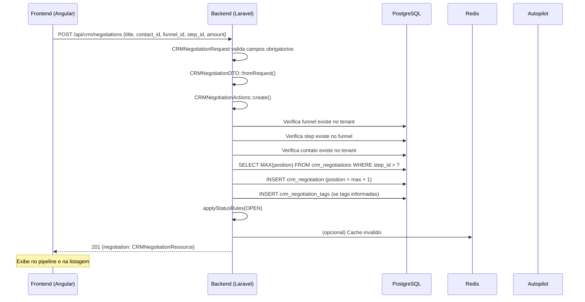

### 4.2 Fluxo de Movimentacao Kanban

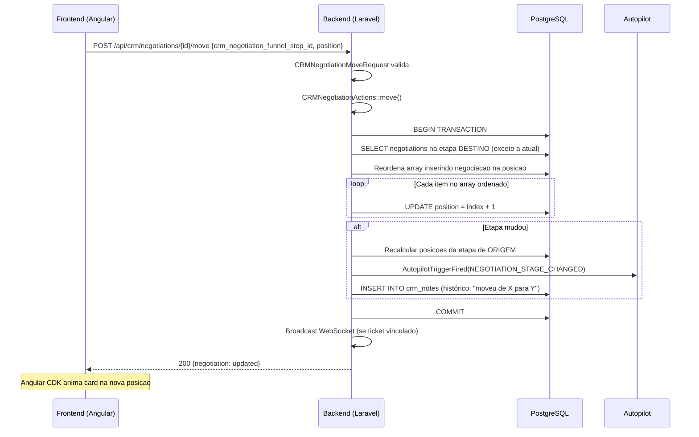

### 4.3 Fluxo de Marcar como Ganha

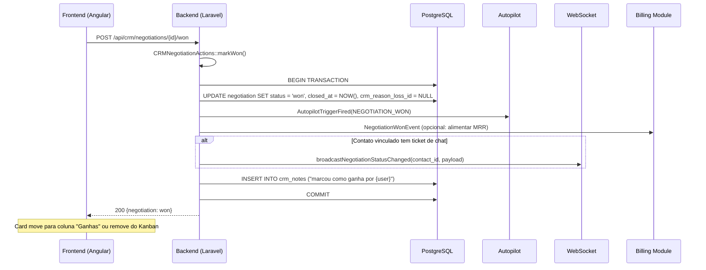

### 4.4 Fluxo de Marcar como Perdida

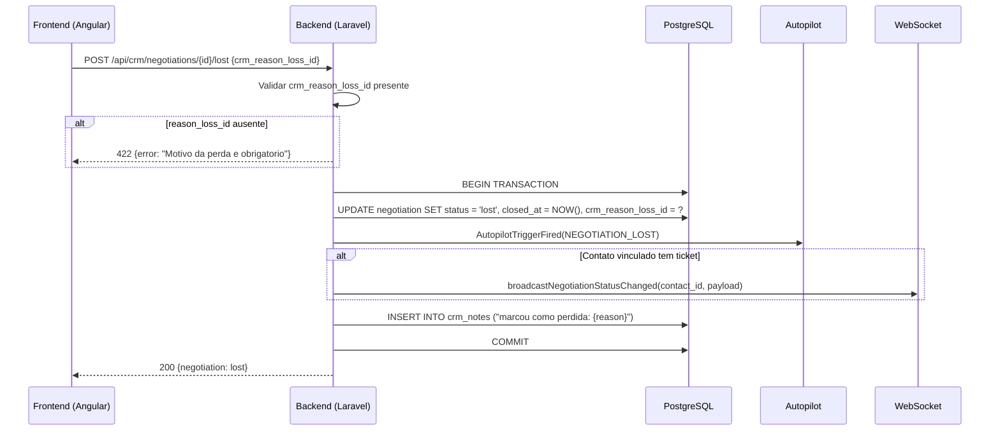

### 4.5 Fluxo de Proposta Publica (Cliente Externo)

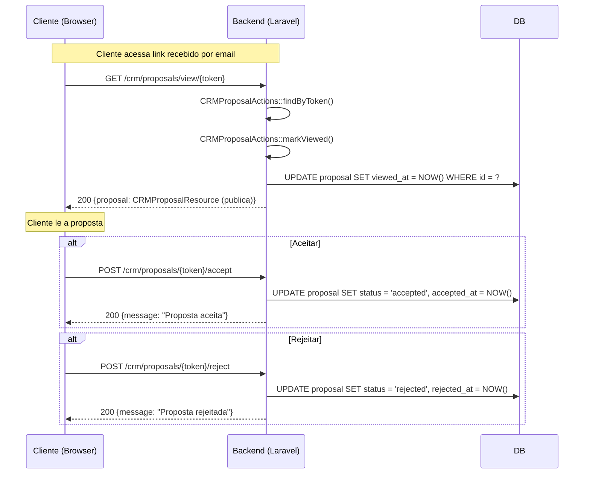

### 4.6 Fluxo de Agenda e Eventos

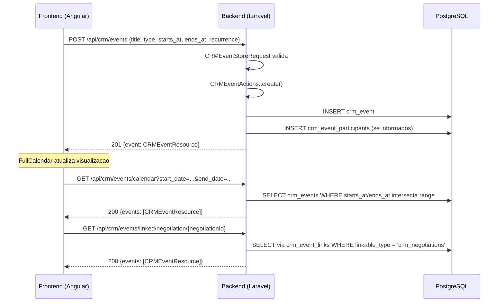

### 4.7 Diagrama de Estados — Negociacao

```mermaid
stateDiagram-v2
    [*] --> open: Criacao
    open --> won: markWon()
    open --> lost: markLost(reason_loss_id)
    lost --> open: reopen()
    won --> open: reopen()
    open --> [*]: Exclusao (soft delete)
    won --> [*]: Exclusao
    lost --> [*]: Exclusao

    note right of open: position pode mudar<br/>Kanban drag-and-drop
    note right of won: closed_at = now()<br/>NEGOTIATION_WON trigger
    note right of lost: closed_at = now()<br/>reason_loss_id setado<br/>NEGOTIATION_LOST trigger
    note right of reopen: status = open<br/>closed_at = null<br/>reason_loss_id = null
```

### 4.8 Diagrama de Estados — Proposta

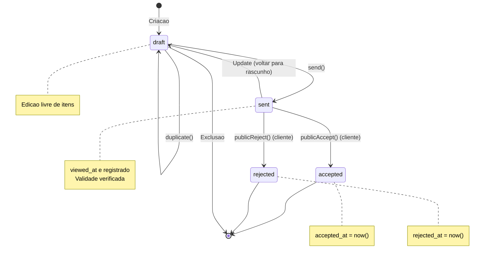

### 4.9 Fluxo de Importacao de Contatos (CSV)

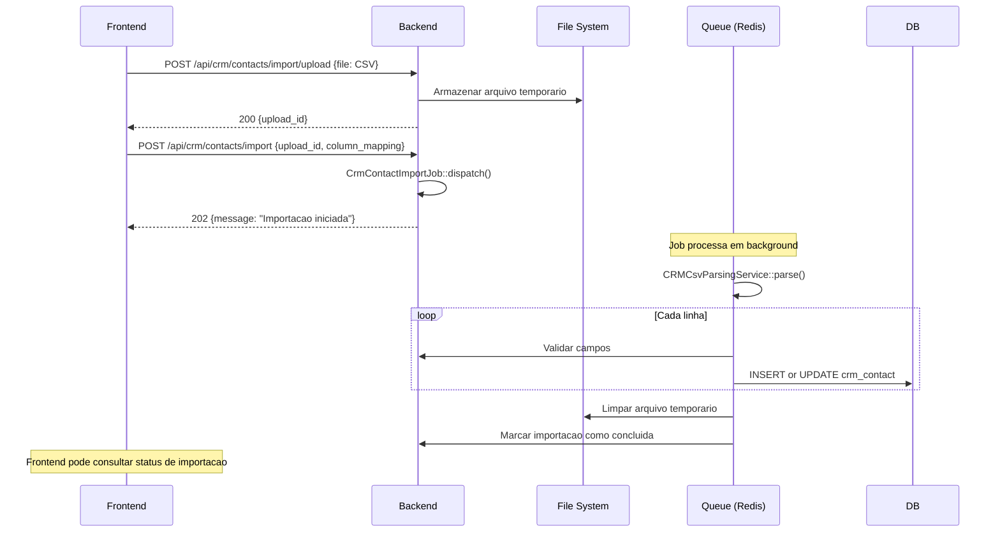

### 4.10 Fluxo de Upload de Arquivos em Negociacao

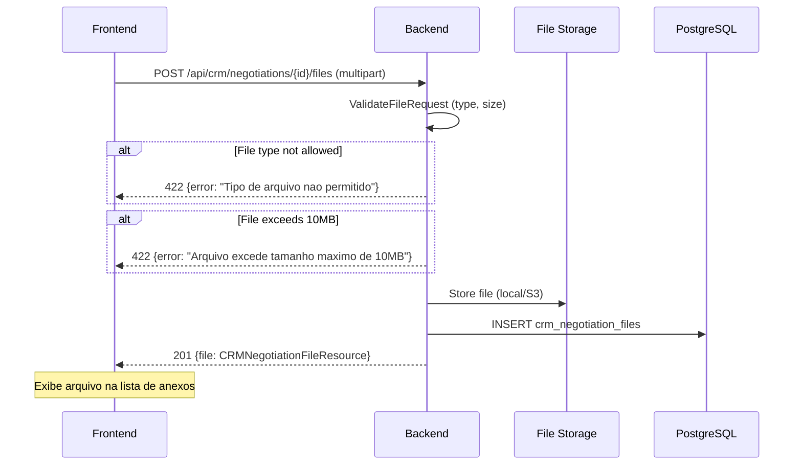

### 4.11 Fluxo de Reabertura de Negociacao

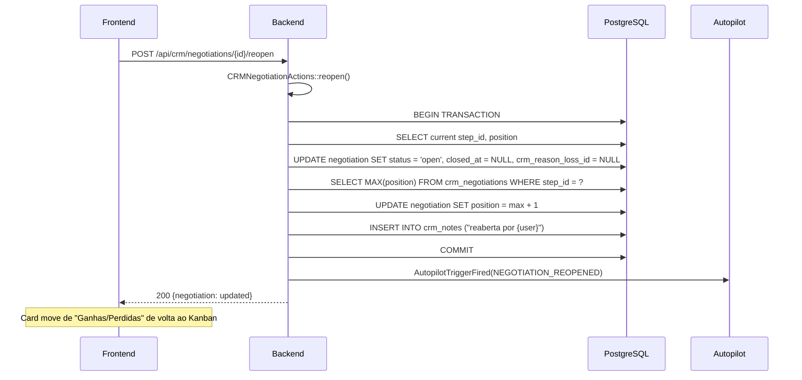

### 4.12 Fluxo de Reordenacao em Batch

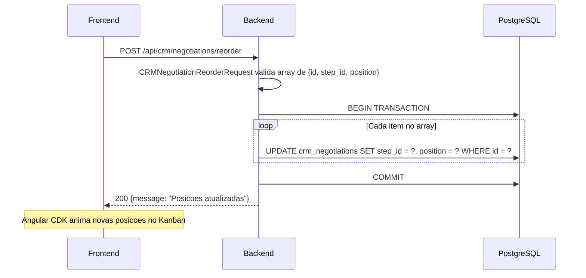

### 4.13 Fluxo de Restauracao de Contato Excluido

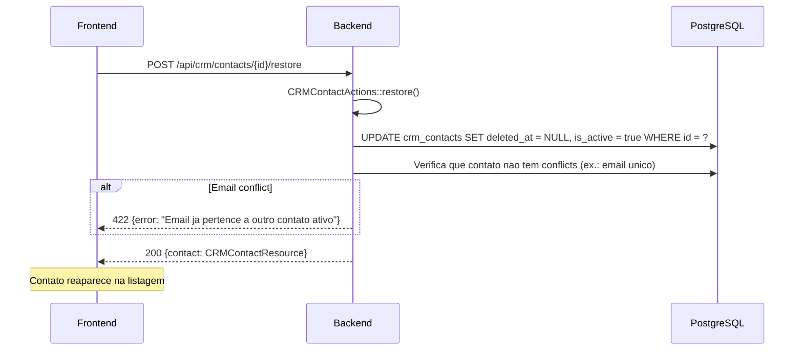

---

## 5. ENTIDADES E MODELOS

### 5.1 Modelo ER — Visao Geral

```
┌──────────────────────┐       ┌───────────────────────┐
│   crm_contacts       │       │   crm_companies        │
│──────────────────────│       │───────────────────────│
│ id (PK, UUID)        │◄──────│ id (PK, UUID)         │
│ tenant_id (FK)      │  1:N  │ tenant_id (FK)        │
│ name                 │       │ name                   │
│ email                │       │ document (CNPJ)       │
│ phone                │       │ email                  │
│ whatsapp             │       │ phone                  │
│ document (CPF)       │       │ address, city, state  │
│ position             │       │ is_active              │
│ is_active            │       │ deleted_at             │
│ deleted_at           │       └───────────┬───────────┘
└─────┬────────────────┘                   │ N:N
      │ 1:N                                 │ via crm_company_contacts
      │                                     │
      │ N:N (via crm_negotiations)          │
      │                                     │
┌─────▼────────────────┐   ┌───────────────▼───────────┐
│ crm_negotiations     │   │ crm_negotiation_funnels    │
│──────────────────────│   │───────────────────────────│
│ id (PK, UUID)        │   │ id (PK, UUID)              │
│ tenant_id (FK)       │   │ tenant_id (FK)            │
│ crm_contact_id (FK)  │   │ name (unique per tenant)  │
│ crm_company_id (FK) │   │ description               │
│ funnel_id (FK)      │◄──│ is_active                  │
│ step_id (FK)        │   └───────────────┬─────────────┘
│ reason_loss_id (FK) │                   │ 1:N
│ title                │   ┌───────────────▼─────────────┐
│ amount (decimal)     │   │crm_negotiation_funnel_steps│
│ status (enum)        │   │────────────────────────────│
│ position (int)       │   │ id (PK, UUID)              │
│ lead_score (int)     │   │ funnel_id (FK)            │
│ closed_at (datetime) │   │ name                      │
│ expected_close (date)│   │ color (hex)               │
│ deleted_at           │   │ order (int)               │
└─────┬────────────────┘   │ is_active                  │
      │                    └────────────────────────────┘
      │ 1:N
      │
      ├──────────┬──────────────┬──────────────┐
      │          │              │              │
      ▼          ▼              ▼              ▼
┌──────────┐ ┌──────────┐ ┌──────────────┐ ┌──────────┐
│crm_pro-  │ │crm_nego- │ │crm_negotia-  │ │crm_nego- │
│posals    │ │tiation_  │ │tion_products │ │tiation_  │
│          │ │tasks     │ │              │ │files     │
│id, tenant│ │          │ │              │ │          │
│negotia-  │ │id, tenant│ │id, tenant    │ │id, tenant│
│tion_id   │ │negotia-  │ │negotiation_id│ │negotia-  │
│title     │ │tion_id   │ │product_id   │ │tion_id   │
│total     │ │title     │ │quantity     │ │filename  │
│status    │ │due_date  │ │unit_price   │ │url       │
│valid_    │ │status    │ │discount     │ │          │
│until     │ │          │ │             │ │          │
│public_   │ └──────────┘ └──────────────┘ └──────────┘
│token     │
│sent_at   │
│viewed_at │
│accepted_ │
│at        │
│rejected_ │
│at        │
└──────────┘

┌──────────────────────┐   ┌──────────────────────────┐
│    crm_events         │   │   crm_custom_fields       │
│──────────────────────│   │───────────────────────────│
│ id (PK, UUID)        │   │ id (PK, UUID)             │
│ tenant_id (FK)       │   │ tenant_id (FK)           │
│ auth_user_id (FK)    │   │ entity_type (contact/     │
│ title                │   │   company/negotiation)    │
│ description          │   │ name                      │
│ location             │   │ field_type (text/number/  │
│ starts_at            │   │   date/select/boolean)    │
│ ends_at              │   │ options (JSON, se select) │
│ is_all_day           │   │ is_required               │
│ status (enum)        │   │ order                     │
│ type (enum)          │   └──────────────┬───────────┘
│ recurrence           │                  │ 1:N (polimorfico)
│ recurrence_ends_at   │                  │
│ deleted_at           │   ┌──────────────▼───────────┐
└──────────┬───────────┘   │ crm_custom_field_values   │
           │                │──────────────────────────│
           │                │ id (PK, UUID)            │
           │                │ tenant_id (FK)           │
           └────────┬───────│ entity_type (morph)      │
                    │       │ entity_id (morph)        │
                    │       │ field_id (FK)           │
                    │       │ value (text)             │
                    └───────┴──────────────────────────┘

┌──────────────────────┐   ┌──────────────────────────┐
│     crm_tags         │   │  crm_reason_losses        │
│──────────────────────│   │───────────────────────────│
│ id (PK, UUID)        │   │ id (PK, UUID)            │
│ tenant_id (FK)       │   │ tenant_id (FK)           │
│ name (unique/tenant)│   │ name (unique per tenant) │
│ color (hex)          │   │ description              │
│ category             │   │ is_active                │
│ is_active             │   └──────────────────────────┘
└──────────┬───────────┘
           │
           │ N:N (via pivot tables)
           │
    ┌──────┼──────┬──────────────┐
    │      │      │              │
    ▼      ▼      ▼              ▼
crm_con-  crm_com-  crm_nego-
tact_tags pany_tags tiation_tags
```

### 5.2 Tabela de Entidades

| Entidade | Tabela | PK | Tenant-scoped | SoftDeletes | Descricao |
|----------|--------|----|---------------|-------------|-----------|
| CRMContact | `crm_contacts` | UUID | Sim | Sim | Pessoas (leads, clientes) |
| CRMCompany | `crm_companies` | UUID | Sim | Sim | Empresas (pessoas juridicas) |
| CRMNegotiation | `crm_negotiations` | UUID | Sim | Sim | Oportunidades de venda |
| CRMNegotiationFunnel | `crm_negotiation_funnels` | UUID | Sim | Nao | Funis de vendas |
| CRMNegotiationFunnelStep | `crm_negotiation_funnel_steps` | UUID | Sim | Nao | Etapas de funil |
| CRMNegotiationTask | `crm_negotiation_tasks` | UUID | Sim | Nao | Tarefas vinculadas a negociacao |
| CRMProposal | `crm_proposals` | UUID | Sim | Nao | Propostas comerciais |
| CRMProposalItem | `crm_proposal_items` | UUID | Sim | Nao | Itens de proposta |
| CRMProduct | `crm_products` | UUID | Sim | Sim | Catalogo de produtos/servicos |
| CRMEvent | `crm_events` | UUID | Sim | Sim | Eventos da agenda |
| CRMEventLink | `crm_event_links` | UUID | Sim | Nao | Vinculos de evento a entidades |
| CRMEventParticipant | `crm_event_participants` | UUID | Sim | Nao | Participantes de evento |
| CRMEventReminder | `crm_event_reminders` | UUID | Sim | Nao | Lembretes de evento |
| CRMTag | `crm_tags` | UUID | Sim | Sim | Tags de categorizacao |
| CRMCustomField | `crm_custom_fields` | UUID | Sim | Sim | Definicoes de campos customizados |
| CRMCustomFieldValue | `crm_custom_field_values` | UUID | Sim | Nao | Valores de campos customizados |
| CRMReasonLoss | `crm_reason_losses` | UUID | Sim | Sim | Motivos de perda de negociacao |
| CRMDepartment | `crm_departments` | UUID | Sim | Sim | Departamentos internos |
| CRMContactPhone | `crm_contact_phones` | UUID | Sim | Nao | Telefones adicionais de contato |
| CRMNegotiationFile | `crm_negotiation_files` | UUID | Sim | Nao | Arquivos anexados a negociacao |
| CRMNegotiationProduct | `crm_negotiation_products` | UUID | Sim | Nao | Produtos em negociacao |
| CRMNote | `crm_notes` | UUID | Sim | Sim | Notas e historico |

### 5.3 Detalhamento dos Campos

#### crm_contacts

| Campo | Tipo | Obrigatorio | Descricao |
|-------|------|-------------|-----------|
| `id` | UUID | Sim | PK |
| `tenant_id` | UUID | Sim | FK para platform_tenants |
| `crm_company_id` | UUID | Nao | FK para empresa principal |
| `name` | string(255) | Recomendado | Nome completo |
| `email` | string(255) | Nao | Email (unico por tenant se presente) |
| `document` | string(20) | Nao | CPF |
| `phone` | string(20) | Recomendado | Telefone principal |
| `whatsapp` | string(20) | Nao | WhatsApp (formato internacional) |
| `avatar_url` | string(500) | Nao | URL da foto |
| `position` | string(100) | Nao | Cargo/Funcao |
| `notes` | text | Nao | Observacoes |
| `custom_fields` | JSON | Nao | Campos customizados inline |
| `is_active` | boolean | Sim | Ativo/inativo |
| `created_at` | timestamp | Sim | Criacao |
| `updated_at` | timestamp | Sim | Atualizacao |
| `deleted_at` | timestamp | Nao | Soft delete |

#### crm_companies

| Campo | Tipo | Obrigatorio | Descricao |
|-------|------|-------------|-----------|
| `id` | UUID | Sim | PK |
| `tenant_id` | UUID | Sim | FK |
| `name` | string(255) | Sim | Nome fantasia ou razao social |
| `document` | string(20) | Nao | CNPJ |
| `email` | string(255) | Nao | Email principal |
| `phone` | string(20) | Nao | Telefone |
| `address` | string(500) | Nao | Endereco completo |
| `city` | string(100) | Nao | Cidade |
| `state` | string(100) | Nao | Estado/UF |
| `zip_code` | string(20) | Nao | CEP |
| `is_active` | boolean | Sim | Ativo/inativo |
| `created_at` | timestamp | Sim | |
| `updated_at` | timestamp | Sim | |
| `deleted_at` | timestamp | Nao | Soft delete |

#### crm_negotiations

| Campo | Tipo | Obrigatorio | Descricao |
|-------|------|-------------|-----------|
| `id` | UUID | Sim | PK |
| `tenant_id` | UUID | Sim | FK |
| `auth_user_id` | UUID | Nao | Responsavel (usuario) |
| `crm_company_id` | UUID | Nao | FK empresa |
| `crm_contact_id` | UUID | Sim | FK contato |
| `crm_negotiation_funnel_id` | UUID | Sim | FK funil |
| `crm_negotiation_funnel_step_id` | UUID | Sim | FK etapa |
| `crm_reason_loss_id` | UUID | Nao | FK motivo de perda |
| `title` | string(255) | Sim | Titulo da negociacao |
| `amount` | decimal(15,2) | Nao | Valor total |
| `notes` | text | Nao | Observacoes |
| `status` | enum | Sim | open, won, lost |
| `lead_score` | integer | Nao | Pontuacao 0-100 |
| `position` | integer | Sim | Ordem na etapa |
| `expected_close` | date | Nao | Previsão de fechamento |
| `closed_at` | datetime | Nao | Data de fechamento |
| `created_at` | timestamp | Sim | |
| `updated_at` | timestamp | Sim | |
| `deleted_at` | timestamp | Nao | Soft delete |

#### crm_negotiation_funnels

| Campo | Tipo | Obrigatorio | Descricao |
|-------|------|-------------|-----------|
| `id` | UUID | Sim | PK |
| `tenant_id` | UUID | Sim | FK |
| `name` | string(255) | Sim | Nome do funil (unico por tenant) |
| `description` | text | Nao | Descricao |
| `is_active` | boolean | Sim | Ativo |
| `created_at` | timestamp | Sim | |
| `updated_at` | timestamp | Sim | |

#### crm_negotiation_funnel_steps

| Campo | Tipo | Obrigatorio | Descricao |
|-------|------|-------------|-----------|
| `id` | UUID | Sim | PK |
| `tenant_id` | UUID | Sim | FK |
| `crm_negotiation_funnel_id` | UUID | Sim | FK funil |
| `name` | string(255) | Sim | Nome da etapa |
| `color` | string(7) | Sim | Cor em hex (#RRGGBB) |
| `order` | integer | Sim | Sequencia |
| `is_active` | boolean | Sim | Ativo |

#### crm_proposals

| Campo | Tipo | Obrigatorio | Descricao |
|-------|------|-------------|-----------|
| `id` | UUID | Sim | PK |
| `tenant_id` | UUID | Sim | FK |
| `crm_negotiation_id` | UUID | Sim | FK |
| `title` | string(255) | Sim | Titulo |
| `number` | integer | Nao | Numero sequencial |
| `total` | decimal(15,2) | Sim | Total calculado |
| `status` | enum | Sim | draft, sent, accepted, rejected |
| `valid_until` | date | Nao | Validade |
| `public_token` | UUID | Sim | Token unico para acesso publico |
| `notes` | text | Nao | Observacoes |
| `sent_at` | datetime | Nao | Data de envio |
| `viewed_at` | datetime | Nao | Primeira visualizacao |
| `accepted_at` | datetime | Nao | Aceite |
| `rejected_at` | datetime | Nao | Rejeicao |
| `created_at` | timestamp | Sim | |
| `updated_at` | timestamp | Sim | |

#### crm_events

| Campo | Tipo | Obrigatorio | Descricao |
|-------|------|-------------|-----------|
| `id` | UUID | Sim | PK |
| `tenant_id` | UUID | Sim | FK |
| `auth_user_id` | UUID | Nao | Proprietario |
| `title` | string(255) | Sim | Titulo |
| `description` | text | Nao | Descricao |
| `location` | string(500) | Nao | Local |
| `starts_at` | datetime | Sim | Inicio |
| `ends_at` | datetime | Nao | Fim |
| `is_all_day` | boolean | Sim | Dia inteiro |
| `status` | enum | Sim | scheduled, completed, cancelled |
| `type` | enum | Sim | meeting, call, task, deadline, reminder, other |
| `recurrence` | enum | Sim | none, daily, weekly, monthly, yearly |
| `recurrence_ends_at` | datetime | Nao | Fim da recorrencia |
| `color` | string(7) | Nao | Cor em hex |
| `created_at` | timestamp | Sim | |
| `updated_at` | timestamp | Sim | |
| `deleted_at` | timestamp | Nao | Soft delete |

### 5.4 Enumerações

#### CRMNegotiationStatus

```php
enum CRMNegotiationStatus: string
{
    case OPEN = 'open';   // Em andamento
    case WON  = 'won';   // Fechada com sucesso
    case LOST = 'lost';  // Fechada sem sucesso
}
```

#### CRMProposalStatus

```php
enum CRMProposalStatus: string
{
    case DRAFT    = 'draft';    // Rascunho
    case SENT     = 'sent';     // Enviada
    case ACCEPTED = 'accepted'; // Aceita pelo cliente
    case REJECTED = 'rejected';  // Rejeitada pelo cliente
}
```

#### CRMTaskStatus

```php
enum CRMTaskStatus: string
{
    case PENDING    = 'pending';
    case IN_PROGRESS = 'in_progress';
    case DONE       = 'done';
}
```

#### CRMEventStatus

```php
const STATUS_SCHEDULED = 'scheduled';
const STATUS_COMPLETED = 'completed';
const STATUS_CANCELLED = 'cancelled';
```

#### CRMEventType

```php
const TYPE_MEETING  = 'meeting';
const TYPE_CALL     = 'call';
const TYPE_TASK     = 'task';
const TYPE_DEADLINE = 'deadline';
const TYPE_REMINDER = 'reminder';
const TYPE_OTHER    = 'other';
```

#### CRMEventRecurrence

```php
const RECURRENCE_NONE    = 'none';
const RECURRENCE_DAILY   = 'daily';
const RECURRENCE_WEEKLY  = 'weekly';
const RECURRENCE_MONTHLY = 'monthly';
const RECURRENCE_YEARLY  = 'yearly';
```

---

## 6. ENDPOINTS

### 6.1 Contatos

| Metodo | Rota | Auth | Descricao | Filtros |
|--------|------|------|-----------|---------|
| GET | `/api/crm/contacts` | Sim | Listar contatos paginados | `search`, `is_active`, `per_page`, `sort_by`, `sort_dir` |
| POST | `/api/crm/contacts` | Sim | Criar contato | body |
| GET | `/api/crm/contacts/{id}` | Sim | Detalhar contato | — |
| PUT | `/api/crm/contacts/{id}` | Sim | Atualizar contato (full) | body |
| PATCH | `/api/crm/contacts/{id}` | Sim | Atualizar parcialmente | body |
| DELETE | `/api/crm/contacts/{id}` | Sim | Excluir (soft delete) | — |
| POST | `/api/crm/contacts/{id}/restore` | Sim | Restaurar contato | — |
| POST | `/api/crm/contacts/{id}/phones` | Sim | Adicionar telefone | body |
| POST | `/api/crm/contacts/{id}/tags` | Sim | Vincular tags | body |
| DELETE | `/api/crm/contacts/{id}/tags/{tagId}` | Sim | Desvincular tag | — |
| POST | `/api/crm/contacts/{id}/custom-fields` | Sim | Upsert campos customizados | body |
| GET | `/api/crm/contacts/{id}/notes` | Sim | Listar notas do contato | — |
| POST | `/api/crm/contacts/{id}/notes` | Sim | Criar nota para contato | body |
| POST | `/api/crm/contacts/import/upload` | Sim | Upload CSV para importacao | form-data |
| POST | `/api/crm/contacts/import` | Sim | Iniciar importacao | body |
| GET | `/api/crm/contacts/export` | Sim | Exportar contatos em CSV | query params |

### 6.2 Empresas

| Metodo | Rota | Auth | Descricao |
|--------|------|------|-----------|
| GET | `/api/crm/companies` | Sim | Listar empresas |
| POST | `/api/crm/companies` | Sim | Criar empresa |
| GET | `/api/crm/companies/{id}` | Sim | Detalhar empresa |
| PUT | `/api/crm/companies/{id}` | Sim | Atualizar empresa |
| DELETE | `/api/crm/companies/{id}` | Sim | Excluir empresa |
| POST | `/api/crm/companies/{id}/tags` | Sim | Vincular tags |
| DELETE | `/api/crm/companies/{id}/tags/{tagId}` | Sim | Desvincular tag |
| POST | `/api/crm/companies/{id}/custom-fields` | Sim | Upsert campos customizados |

### 6.3 Negociacoes

| Metodo | Rota | Auth | Descricao | Filtros |
|--------|------|------|-----------|---------|
| GET | `/api/crm/negotiations` | Sim | Listar negociacoes | status, funnel_id, step_id, contact_id, company_id, user_id, date_from, date_to, amount_min, amount_max, expected_close_from, expected_close_to, lead_score_min, lead_score_max, tag_ids, product_id, has_pending_tasks, search, per_page |
| POST | `/api/crm/negotiations` | Sim | Criar negociacao | body |
| GET | `/api/crm/negotiations/{id}` | Sim | Detalhar negociacao | — |
| PUT | `/api/crm/negotiations/{id}` | Sim | Atualizar negociacao | body |
| DELETE | `/api/crm/negotiations/{id}` | Sim | Excluir negociacao | — |
| POST | `/api/crm/negotiations/{id}/tasks` | Sim | Adicionar tarefa | body |
| PATCH | `/api/crm/negotiations/{id}/tasks/{taskId}/status` | Sim | Atualizar status da tarefa | body |
| POST | `/api/crm/negotiations/{id}/tags` | Sim | Vincular tags | body |
| DELETE | `/api/crm/negotiations/{id}/tags/{tagId}` | Sim | Desvincular tag | — |
| GET | `/api/crm/negotiations/{id}/proposals` | Sim | Listar propostas | — |
| POST | `/api/crm/negotiations/{id}/proposals` | Sim | Criar proposta | body |
| GET | `/api/crm/negotiations/{id}/products` | Sim | Listar produtos | — |
| POST | `/api/crm/negotiations/{id}/products` | Sim | Adicionar produto | body |
| POST | `/api/crm/negotiations/{id}/move` | Sim | Mover para etapa/posicao | body |
| POST | `/api/crm/negotiations/reorder` | Sim | Reordenar em batch | body |
| POST | `/api/crm/negotiations/{id}/won` | Sim | Marcar como ganha | — |
| POST | `/api/crm/negotiations/{id}/lost` | Sim | Marcar como perdida | body |
| POST | `/api/crm/negotiations/{id}/reopen` | Sim | Reabrir negociacao | — |
| GET | `/api/crm/negotiations-kanban` | Sim | View Kanban | funnel_id, status, contact_id, user_id, date_from, date_to |
| POST | `/api/crm/negotiations/{id}/custom-fields` | Sim | Upsert campos customizados | body |
| GET | `/api/crm/negotiations/{id}/notes` | Sim | Listar notas | — |
| POST | `/api/crm/negotiations/{id}/notes` | Sim | Criar nota | body |
| GET | `/api/crm/negotiations/{id}/files` | Sim | Listar arquivos | — |
| POST | `/api/crm/negotiations/{id}/files` | Sim | Anexar arquivo | form-data |
| DELETE | `/api/crm/negotiations/{id}/files/{fileId}` | Sim | Remover arquivo | — |
| GET | `/api/crm/negotiations/tasks/user` | Sim | Tarefas do usuario logado | user_id, status |

### 6.4 Funis de Vendas

| Metodo | Rota | Auth | Descricao |
|--------|------|------|-----------|
| GET | `/api/crm/funnels` | Sim | Listar funis paginados |
| GET | `/api/crm/funnels/all` | Sim | Listar TODOS os funis (sem paginacao) |
| POST | `/api/crm/funnels` | Sim | Criar funil |
| PUT | `/api/crm/funnels/{id}` | Sim | Atualizar funil |
| DELETE | `/api/crm/funnels/{id}` | Sim | Excluir funil |
| GET | `/api/crm/funnels/{id}/steps` | Sim | Listar etapas do funil |
| POST | `/api/crm/funnels/{id}/steps` | Sim | Adicionar etapa |
| PUT | `/api/crm/funnels/{id}/steps/{stepId}` | Sim | Atualizar etapa |
| DELETE | `/api/crm/funnels/{id}/steps/{stepId}` | Sim | Remover etapa |
| POST | `/api/crm/funnels/{id}/steps/reorder` | Sim | Reordenar etapas |

### 6.5 Propostas

| Metodo | Rota | Auth | Descricao |
|--------|------|------|-----------|
| GET | `/api/crm/proposals/{id}` | Sim | Detalhar proposta |
| PUT | `/api/crm/proposals/{id}` | Sim | Atualizar proposta |
| DELETE | `/api/crm/proposals/{id}` | Sim | Excluir proposta |
| POST | `/api/crm/proposals/{id}/send` | Sim | Enviar proposta |
| POST | `/api/crm/proposals/{id}/duplicate` | Sim | Duplicar proposta |
| PUT | `/api/crm/negotiation-products/{itemId}` | Sim | Atualizar item de proposta |
| DELETE | `/api/crm/negotiation-products/{itemId}` | Sim | Remover item |
| GET | `/crm/proposals/view/{token}` | **Nao** | View publica (cliente) |
| POST | `/crm/proposals/{token}/accept` | **Nao** | Cliente aceita |
| POST | `/crm/proposals/{token}/reject` | **Nao** | Cliente rejeita |

### 6.6 Eventos/Agenda

| Metodo | Rota | Auth | Descricao |
|--------|------|------|-----------|
| GET | `/api/crm/events` | Sim | Listar eventos |
| GET | `/api/crm/events/calendar` | Sim | View calendario |
| GET | `/api/crm/events/upcoming` | Sim | Proximos eventos |
| GET | `/api/crm/events/statistics` | Sim | Estatisticas |
| GET | `/api/crm/events/linked/{type}/{id}` | Sim | Eventos vinculados |
| GET | `/api/crm/events/{id}` | Sim | Detalhar evento |
| POST | `/api/crm/events` | Sim | Criar evento |
| PUT | `/api/crm/events/{id}` | Sim | Atualizar evento |
| PATCH | `/api/crm/events/{id}/status` | Sim | Atualizar status |
| DELETE | `/api/crm/events/{id}` | Sim | Excluir evento |

### 6.7 Tags, Produtos, Campos, Departamentos

| Metodo | Rota | Auth | Escopo |
|--------|------|------|--------|
| GET | `/api/crm/tags` | Sim | Tags: listar todas |
| POST | `/api/crm/tags` | Sim | Tags: criar |
| PUT | `/api/crm/tags/{id}` | Sim | Tags: atualizar |
| DELETE | `/api/crm/tags/{id}` | Sim | Tags: excluir |
| GET | `/api/crm/products` | Sim | Produtos: listar |
| POST | `/api/crm/products` | Sim | Produtos: criar |
| GET | `/api/crm/products/{id}` | Sim | Produtos: detalhar |
| PUT | `/api/crm/products/{id}` | Sim | Produtos: atualizar |
| DELETE | `/api/crm/products/{id}` | Sim | Produtos: excluir |
| GET | `/api/crm/products-all` | Sim | Produtos: listar todos (sem filtro) |
| GET | `/api/crm/custom-fields` | Sim | Campos customizados: listar |
| POST | `/api/crm/custom-fields` | Sim | Campos customizados: criar |
| PUT | `/api/crm/custom-fields/{id}` | Sim | Campos customizados: atualizar |
| DELETE | `/api/crm/custom-fields/{id}` | Sim | Campos customizados: excluir |
| GET | `/api/crm/departments` | Sim | Departamentos: listar |
| GET | `/api/crm/departments/all` | Sim | Departamentos: listar todos |
| POST | `/api/crm/departments` | Sim | Departamentos: criar |
| GET | `/api/crm/departments/{id}` | Sim | Departamentos: detalhar |
| PUT | `/api/crm/departments/{id}` | Sim | Departamentos: atualizar |
| DELETE | `/api/crm/departments/{id}` | Sim | Departamentos: excluir |
| PATCH | `/api/crm/departments/{id}/toggle-active` | Sim | Departamentos: ativar/desativar |
| GET | `/api/crm/reason-losses` | Sim | Motivos de perda: listar |
| GET | `/api/crm/reason-losses/all` | Sim | Motivos: listar todos |
| POST | `/api/crm/reason-losses` | Sim | Motivos: criar |
| PUT | `/api/crm/reason-losses/{id}` | Sim | Motivos: atualizar |
| DELETE | `/api/crm/reason-losses/{id}` | Sim | Motivos: excluir |

---

## 7. EVENTOS

### 7.1 Eventos do Sistema (Laravel)

#### AutopilotTriggers Dispareados

O modulo CRM dispara os seguintes triggers do Autopilot, que podem ser configurados pelo tenant para executar sequencias automaticas:

| Trigger | Quando Dispara | Payload |
|---------|---------------|---------|
| `NEGOTIATION_STAGE_CHANGED` | Negociacao movida para outra etapa | `negotiation_id`, `from_step`, `to_step`, `funnel_id`, `source_type` |
| `NEGOTIATION_WON` | Negociacao marcada como ganha | `negotiation_id`, `contact_id`, `amount`, `funnel_id`, `source_type` |
| `NEGOTIATION_LOST` | Negociacao marcada como perdida | `negotiation_id`, `contact_id`, `amount`, `funnel_id`, `reason_loss_id`, `source_type` |

#### Eventos Laravel (Event Classes)

| Evento | Classe | Dispara Quando | handlers possiveis |
|--------|--------|---------------|-------------------|
| `NegotiationWonEvent` | `Domain\Configuration\Events\NegotiationWonEvent` | markWon | Atualizar billing, notificar equipe |
| `NegotiationLostEvent` | `Domain\Configuration\Events\NegotiationLostEvent` | markLost | Notificar equipe, arquivar |
| `AutopilotTriggerFired` | `Domain\Ai\Events\AutopilotTriggerFired` | Stage change, won, lost | Executar sequencias de autopilot |

#### Broadcast WebSocket

| Canal | Evento | Payload | Quando |
|-------|--------|---------|--------|
| Canal privado do contato | `negotiation.status.changed` | `negotiation_id`, `status`, `closed_at`, `reason_loss_id` | markWon, markLost, reopen, move |

### 7.2 Fluxo de Eventos

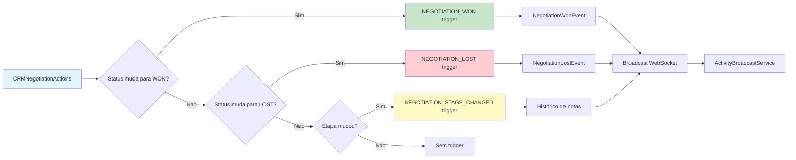

### 7.3 WebSocket — Detalhamento

O `ActivityBroadcastService` transmite eventos de status de negociacao para tickets de chat vinculados ao contato. Isso garante que quando uma negociacao e fechada, a interface de chat do cliente ja mostre o novo status automaticamente.

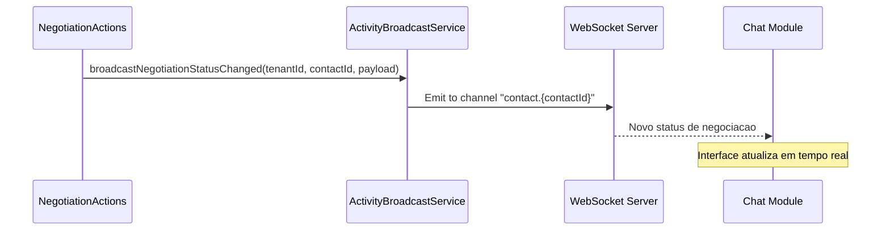

---

## 8. SEGURANCA

### 8.1 Regras de Seguranca (Inviolaveis)

| ID | Regra | Justificativa |
|----|-------|---------------|
| SEC-001 | **NUNCA** retornar dados de outro tenant em nenhuma resposta | Isolamento multi-tenant e compliance LGPD |
| SEC-002 | **SEMPRE** aplicar trait `BelongsToTenant` em todos os models CRM | Scope global automatico em todas as queries |
| SEC-003 | **SEMPRE** usar `$this->authorize()` em todos os controller actions | Delegacao para Policy, nao bypass |
| SEC-004 | **SEMPRE** usar UUIDs como PK em todas as tabelas CRM | Evita enumeracao de IDs e vazamento de dados |
| SEC-005 | **SEMPRE** usar `SoftDeletes` em entidades que podem ser restauradas | Contatos, empresas, negociacoes, eventos |
| SEC-006 | **SEMPRE** validar via FormRequest antes de processar qualquer input externo | Prevencao de injection e dados invalidos |
| SEC-007 | **SEMPRE** usar eager loading nos relationships | Prevencao de N+1 que pode vazar dados entre tenants |
| SEC-008 | Enderecos publicos de proposta (`/crm/proposals/view/{token}`) **NAO** requerem autenticacao, mas **DEVEM** validar que o token existe e pertence a um tenant valido | Acesso externo legitimate para clientes |
| SEC-009 | Rate limiting em endpoints publicos de proposta: 30 requests/minuto por IP | Prevencao de forca bruta em tokens |
| SEC-010 | Campos `public_token` das propostas devem ser UUIDs criptograficamente randomicos | Tokens previsiveis permitem acesso nao autorizado |
| SEC-011 | Arquivos anexados a negociacoes devem ser validados por tipo e tamanho no upload | Prevencao de upload de malware |
| SEC-012 | Historico de notas em negociacoes **NAO** pode ser editado ou excluido via API | Imutabilidade do historico comercial |
| SEC-013 | Log **NUNCA** deve conter `token`, `password`, `public_token`, `two_factor_secret` ou qualquer dado sensivel | Compliance de seguranca |
| SEC-014 | Campos `document` (CPF/CNPJ) devem ser mascarados em logs e respostas de listagem quando o tenant nao tem permissao de visualizacao | LGPD — dados pessoais sensiveis |
| SEC-015 | Endpoints de importacao CSV devem validar que o arquivo nao excede 5MB e processar em chunks para evitar DoS | Protecao contra arquivos maliciosos |
| SEC-016 | Upload de arquivos deve verificar `mime_type` real (nao apenas extensao) para evitar extencao de malware | Seguranca de arquivos |
| SEC-017 | Todos os endpoints de exclusao (soft delete) devem verificar que o recurso pertence ao tenant antes de marcar `deleted_at` | Isolamento multi-tenant |
| SEC-018 | Endpoint de restore deve verificar que o recurso nao conflita com dados existentes (ex.: email unico) antes de restaurar | Integridade de dados |

### 8.2 Politicas de Autorizacao (Policies)

| Policy | Regras |
|--------|--------|
| `CRMContactPolicy` | `viewAny`: role `crm.contacts.list`; `create`: `crm.contacts.create`; `view`: e do tenant; `update`: e do tenant; `delete`: `crm.contacts.delete` |
| `CRMCompanyPolicy` | Similar a ContactPolicy com permissao `crm.companies.*` |
| `CRMNegotiationPolicy` | `viewAny`: `crm.negotiations.list`; `create`: `crm.negotiations.create`; `view/update/delete`: e do tenant |
| `CRMProposalPolicy` | `viewAny`: `crm.proposals.list`; `create`: `crm.proposals.create` |
| `CRMEventPolicy` | `viewAny`: `crm.events.list`; `create`: `crm.events.create`; `view/update/delete`: proprietario ou `crm.events.manage` |
| `CRMFunnelPolicy` | `viewAny`: `crm.funnels.list`; `create`: `crm.funnels.create` |
| `CRMTagPolicy` | `viewAny`: `crm.tags.list`; `create`: `crm.tags.create` |
| `CRMProductPolicy` | `viewAny`: `crm.products.list`; `create`: `crm.products.create` |
| `CRMReasonLossPolicy` | `viewAny`: `crm.reason-losses.list`; `create`: `crm.reason-losses.create` |
| `CRMCustomFieldPolicy` | `viewAny`: `crm.custom-fields.list`; `create`: `crm.custom-fields.manage` |
| `CRMDepartmentPolicy` | `viewAny`: `crm.departments.list`; `create`: `crm.departments.manage` |
| `CRMNotePolicy` |viewAny/create: vinculado a entidade pai |

---

## 9. DTOs E RESOURCES

### 9.1 DTOs

#### CRMContactDTO

```php
readonly class CRMContactDTO
{
    public function __construct(
        public ?string $name,
        public ?string $email,
        public ?string $document,
        public ?string $phone,
        public ?string $whatsapp,
        public ?string $crm_company_id,
        public ?string $position,
        public ?string $notes,
        public ?array $custom_fields,
        public bool $is_active,
    ) {}

    public static function fromRequest(Request $request): self { ... }
    public static function fromArray(array $data): self { ... }
    public function toArray(): array { ... }
}
```

#### CRMNegotiationDTO

```php
readonly class CRMNegotiationDTO
{
    public function __construct(
        public ?string $title,
        public ?float $amount,
        public ?string $crm_contact_id,
        public ?string $crm_company_id,
        public ?string $crm_negotiation_funnel_id,
        public ?string $crm_negotiation_funnel_step_id,
        public ?string $auth_user_id,
        public ?string $notes,
        public string $status,
        public ?int $lead_score,
        public ?int $position,
        public ?string $expected_close,
        public ?string $crm_reason_loss_id,
    ) {}

    public static function fromRequest(Request $request): self { ... }
    public static function fromArray(array $data): self { ... }
    public function toArray(): array { ... }
}
```

#### CRMNegotiationTaskDTO

```php
readonly class CRMNegotiationTaskDTO
{
    public function __construct(
        public string $crm_negotiation_id,
        public string $title,
        public ?string $description,
        public ?string $auth_user_id,
        public ?string $due_date,
        public string $status,
    ) {}

    public static function fromRequest(Request $request, string $negotiationId): self { ... }
    public function toArray(): array { ... }
}
```

#### CRMProposalDTO

```php
readonly class CRMProposalDTO
{
    public function __construct(
        public string $crm_negotiation_id,
        public string $title,
        public ?int $number,
        public string $status,
        public ?string $valid_until,
        public ?string $notes,
        /** @var array<CRMProposalItemDTO> */
        public array $items,
    ) {}

    public static function fromRequest(Request $request, string $negotiationId, ?string $currentStatus = null): self { ... }
    public function toArray(): array { ... }
}
```

#### CRMProposalItemDTO

```php
readonly class CRMProposalItemDTO
{
    public function __construct(
        public string $name,
        public int $quantity,
        public float $unit_price,
        public ?float $discount,
        public int $position,
        public ?string $crm_product_id,
    ) {}
}
```

#### CRMEventDTO

```php
readonly class CRMEventDTO
{
    public function __construct(
        public string $title,
        public ?string $description,
        public ?string $location,
        public string $starts_at,
        public ?string $ends_at,
        public bool $is_all_day,
        public string $status,
        public string $type,
        public string $recurrence,
        public ?string $recurrence_ends_at,
        public ?string $color,
        public ?string $auth_user_id,
    ) {}

    public static function fromRequest(Request $request): self { ... }
    public function toArray(): array { ... }
}
```

#### CRMCompanyDTO, CRMTagDTO, CRMProductDTO, CRMReasonLossDTO, CrmDepartmentDTO, CrmCustomFieldDTO

Todas seguem o mesmo padrao `readonly class` com:
- `fromRequest(Request $request): self`
- `fromArray(array $data): self`
- `toArray(): array`

### 9.2 Resources (API Responses)

#### CRMContactResource

```json
{
  "id": "uuid",
  "name": "string",
  "email": "string|null",
  "document": "string|null",
  "phone": "string|null",
  "whatsapp": "string|null",
  "avatar_url": "string|null",
  "position": "string|null",
  "notes": "string|null",
  "custom_fields": {},
  "is_active": true,
  "company": { "id": "uuid", "name": "string" } | null,
  "companies": [{ "id": "uuid", "name": "string" }],
  "tags": [{ "id": "uuid", "name": "string", "color": "#hex" }],
  "phones": [{ "id": "uuid", "number": "string", "label": "string" }],
  "created_at": "ISO8601",
  "updated_at": "ISO8601"
}
```

#### CRMNegotiationResource

```json
{
  "id": "uuid",
  "title": "string",
  "amount": 15000.00,
  "status": "open|won|lost",
  "lead_score": 75,
  "position": 3,
  "expected_close": "2026-04-15",
  "closed_at": "ISO8601|null",
  "notes": "string|null",
  "contact": { "id": "uuid", "name": "string", "email": "string" },
  "company": { "id": "uuid", "name": "string" } | null,
  "funnel": { "id": "uuid", "name": "string" },
  "step": { "id": "uuid", "name": "string", "color": "#hex" },
  "reason_loss": { "id": "uuid", "name": "string" } | null,
  "user": { "id": "uuid", "name": "string" },
  "tags": [{ "id": "uuid", "name": "string", "color": "#hex" }],
  "tasks": [{ "id": "uuid", "title": "string", "status": "pending|in_progress|done" }],
  "custom_field_values": [{ "field": { "name": "string" }, "value": "string" }],
  "created_at": "ISO8601",
  "updated_at": "ISO8601"
}
```

#### CRMProposalResource

```json
{
  "id": "uuid",
  "title": "string",
  "number": 5,
  "total": 8500.00,
  "status": "draft|sent|accepted|rejected",
  "valid_until": "2026-04-30",
  "public_token": "uuid",
  "notes": "string|null",
  "sent_at": "ISO8601|null",
  "viewed_at": "ISO8601|null",
  "accepted_at": "ISO8601|null",
  "rejected_at": "ISO8601|null",
  "negotiation": { "id": "uuid", "title": "string" },
  "items": [
    {
      "id": "uuid",
      "name": "string",
      "quantity": 2,
      "unit_price": 4250.00,
      "discount": 0.00,
      "subtotal": 8500.00,
      "product": { "id": "uuid", "name": "string" } | null
    }
  ],
  "created_at": "ISO8601",
  "updated_at": "ISO8601"
}
```

#### CRMEventResource

```json
{
  "id": "uuid",
  "title": "string",
  "description": "string|null",
  "location": "string|null",
  "starts_at": "ISO8601",
  "ends_at": "ISO8601|null",
  "is_all_day": false,
  "status": "scheduled|completed|cancelled",
  "type": "meeting|call|task|deadline|reminder|other",
  "recurrence": "none|daily|weekly|monthly|yearly",
  "recurrence_ends_at": "ISO8601|null",
  "color": "#hex|null",
  "user": { "id": "uuid", "name": "string" },
  "participants": [{ "id": "uuid", "name": "string" }],
  "links": [{ "linkable_type": "string", "linkable_id": "uuid" }],
  "created_at": "ISO8601",
  "updated_at": "ISO8601"
}
```

### 9.3 Padrao de Response API

Todas as respostas seguem o formato padrao do AgentFlix:

```json
// Sucesso com dados
{
  "success": true,
  "message": "Negociação criada",
  "data": { ... }
}

// Sucesso paginado
{
  "success": true,
  "message": "Negociações listadas",
  "data": [ ... ],
  "meta": {
    "current_page": 1,
    "per_page": 15,
    "total": 48,
    "last_page": 4
  }
}

// Erro de validacao
{
  "success": false,
  "message": "Dados inválidos",
  "errors": {
    "crm_reason_loss_id": ["Motivo da perda é obrigatório ao marcar como perdida."]
  }
}

// Erro de autorizacao
{
  "success": false,
  "message": "Unauthorized",
  "errors": {}
}

// Sem conteudo (204)
(no body)
```

---

## 10. CRITERIOS DE ACEITACAO

### 10.1 Contatos

| ID | Criterio | Verificacao |
|----|----------|-------------|
| CA-001 | Contato e criado com sucesso via POST e retornado com ID UUID | Teste Feature: criar contato → 201 com `id` valido |
| CA-002 | Listagem de contatos filtra por `search` (nome/email) e `is_active` | Teste: buscar por nome existente retorna resultado; buscar por nome inexistente retorna vazio |
| CA-003 | Soft delete remove contato da listagem mas mantem no banco | Teste: DELETE → GET retorna 404; banco contem registro com `deleted_at` |
| CA-004 | Restore torna contato visivel novamente | Teste: DELETE → POST restore → GET retorna 200 |
| CA-005 | Telefone adicional e adicionado ao contato | Teste: POST phones → GET contact inclui phones[] |
| CA-006 | Tags sao vinculadas e desvinculadas com sucesso | Teste: POST tags/{id} → attached; DELETE → detached |
| CA-007 | Campos customizados sao salvos e retornados corretamente | Teste: POST custom-fields → GET retorna valores |
| CA-008 | Importacao CSV processa linhas e cria contatos | Teste: upload CSV → job processa → contatos criados |
| CA-009 | Exportacao CSV gera arquivo com colunas corretas | Teste: GET export → arquivo CSV com headers e dados |
| CA-010 | Contato de tenant A nunca aparece para tenant B | Teste: criar contato como tenant A → autenticar como tenant B → GET contacts nao contem |

### 10.2 Empresas

| ID | Criterio | Verificacao |
|----|----------|-------------|
| CA-011 | Empresa e criada e vinculada a contatos via many-to-many | Teste: criar empresa → vincular contato → GET empresa inclui contact |
| CA-012 | Soft delete remove empresa da listagem | Teste: DELETE empresa → GET retorna 404 |
| CA-013 | Campos `document`, `email`, `address` sao persistidos | Teste: criar empresa com campos → GET retorna campos iguais |

### 10.3 Negociacoes

| ID | Criterio | Verificacao |
|----|----------|-------------|
| CA-014 | Negociacao e criada com posicao `max(position) + 1` da etapa | Teste: criar 3 negociacoes na mesma etapa → posicoes 1, 2, 3 |
| CA-015 | markWon define `status = won`, `closed_at = now()`, limpa `reason_loss_id`, dispara trigger | Teste: POST won → GET retorna status won, closed_at setado, trigger disparado |
| CA-016 | markLost **exige** `reason_loss_id`; se ausente retorna 422 | Teste: POST lost sem reason → 422; com reason → 200 |
| CA-017 | reopen redefine status para `open` e limpa `closed_at` e `reason_loss_id` | Teste: won → reopen → status open, closed_at null |
| CA-018 | move entre etapas dispara NEGOTIATION_STAGE_CHANGED e recalcula posicoes | Teste: mover → trigger disparado, posicoes atualizadas |
| CA-019 | Kanban retorna estrutura com `funnel` + `steps` + `negotiations` agrupadas por etapa | Teste: GET kanban → estrutura correta com negotiations em cada step |
| CA-020 | Filtros de listagem (status, funnel, contact, date range, amount) funcionam corretamente | Teste: aplicar cada filtro → resultado corresponde ao filtro |
| CA-021 | Historico de alteracoes gera notas automaticas no crm_notes | Teste: alterar etapa → nota criada com mensagem correta |
| CA-022 | Tarefas sao criadas, listadas e tem status atualizado | Teste: POST task → GET tasks inclui; PATCH status → status atualizado |
| CA-023 | Produtos sao vinculados a negociacao com quantidade e preco | Teste: POST product → GET products inclui item com dados |

### 10.4 Funis

| ID | Criterio | Verificacao |
|----|----------|-------------|
| CA-024 | Funil com nome duplicado no mesmo tenant retorna erro de validacao | Teste: criar funil "Vendas" → criar novamente "Vendas" → 422 |
| CA-025 | Etapas sao ordenadas por `order` na listagem e no Kanban | Teste: criar etapas A, B, C com orders 3, 1, 2 → GET steps retorna [B, C, A] |
| CA-026 | Reorder de etapas atualiza `order` de todas as etapas | Teste: reorder [id3=1, id1=2, id2=3] → GET steps retorna ordens corretas |
| CA-027 | Exclusao de etapa com negociacoes abertas retorna erro | Teste: etapa com negociacao → DELETE etapa → 409 ou 422 |

### 10.5 Propostas

| ID | Criterio | Verificacao |
|----|----------|-------------|
| CA-028 | Proposta criada como draft com `public_token` gerado | Teste: POST proposal → status draft, public_token presente |
| CA-029 | send define `sent_at` e muda status para sent | Teste: POST send → sent_at setado, status sent |
| CA-030 | publicView (sem auth) retorna proposta e marca `viewed_at` | Teste: GET /crm/proposals/view/{token} → 200, viewed_at setado |
| CA-031 | publicAccept (sem auth) muda status para accepted e define `accepted_at` | Teste: POST accept → status accepted, accepted_at setado |
| CA-032 | publicReject (sem auth) muda status para rejected | Teste: POST reject → status rejected, rejected_at setado |
| CA-033 | duplicate cria nova proposta como draft copiando itens | Teste: POST duplicate → nova proposta draft com mesmos itens |
| CA-034 | Token invalido retorna 404 | Teste: GET /crm/proposals/view/invalid-token → 404 |
| CA-035 | Total da proposta e calculado corretamente a partir dos itens | Teste: proposta com 2 itens (10*100 + 5*50 = 1250) → total = 1250 |

### 10.6 Agenda/Eventos

| ID | Criterio | Verificacao |
|----|----------|-------------|
| CA-036 | Evento e criado e aparece na listagem | Teste: POST event → GET inclui evento |
| CA-037 | View calendar retorna eventos dentro do range de datas | Teste: GET calendar?start=...&end=... → apenas eventos no range |
| CA-038 | View upcoming retorna proximos eventos ordenados por data | Teste: GET upcoming?limit=5 → 5 proximos eventos |
| CA-039 | Eventos vinculados a negociacao aparecem na view linked | Teste: vincular evento → GET linked/negotiation/{id} inclui |
| CA-040 | Tipo e status do evento sao validados (enum) | Teste: POST event com type invalido → 422 |
| CA-041 | Evento recorrente gera instancias conforme recurrence | Teste: evento monthly → verificado no calendario |

### 10.7 Tags, Campos, Departamentos

| ID | Criterio | Verificacao |
|----|----------|-------------|
| CA-042 | Tags sao vinculadas a contatos, empresas e negociacoes | Teste: POST tags em cada entidade → pivot criado |
| CA-043 | Campos customizados funcionam via polimorfismo | Teste: upsert custom-field → GET entity inclui valor |
| CA-044 | Motivos de perda sao listados e utilizados em markLost | Teste: GET reason-losses → options; markLost com id → salvo |
| CA-045 | Departamentos sao gerenciados (CRUD + toggle) | Teste: CRUD + PATCH toggle-active → is_active alterna |

### 10.8 Seguranca e Multi-Tenancy

| ID | Criterio | Verificacao |
|----|----------|-------------|
| CA-046 | Qualquer entidade CRM e automaticamente filtrada pelo tenant do usuario | Teste: query direta no banco com tenant B nao retorna dados de tenant A |
| CA-047 | Requisicao sem token retorna 401 | Teste: qualquer endpoint CRM sem Bearer token → 401 |
| CA-048 | Requisicao com token invalido retorna 401 | Teste: Bearer token invalido → 401 |
| CA-049 | Policy nega acesso a entidades de outro tenant | Teste: token tenant A tentando GET negotiation de tenant B → 403 |
| CA-050 | Token de proposta (public_token) nao permite acesso a dados de outro tenant | Teste: proporal de tenant A com token → retorna dados apenas de tenant A |

### 10.9 Integracao e Performance

| ID | Criterio | Verificacao |
|----|----------|-------------|
| CA-051 | Gatilhos Autopilot disparam ao mudar etapa/fechar negociacao | Teste: ao mover/ganhar/perder → evento AutopilotTriggerFired dispatchado |
| CA-052 | WebSocket broadcast e chamado ao mudar status de negociacao | Teste: ao markWon/Lost → broadcastNegotiationStatusChanged chamado |
| CA-053 | Listagem com 1000 negociacoes carrega em menos de 2s (paginacao) | Teste: GET negotiations?per_page=15 → response < 200ms |
| CA-054 | Kanban de funil com 50 negociacoes carrega corretamente | Teste: GET kanban com 50 deals → response < 500ms com todos os dados |
| CA-055 | Campos `created_at` e `updated_at` sao preenchidos automaticamente | Teste: criar entidade → valores presentes em formato ISO8601 |

---

## 11. DEPENDENCIAS E INTEGRACOES

### 11.1 Modulos Internos

| Modulo | Relacao | Descricao |
|--------|---------|-----------|
| Auth | CRM depende de | `AuthUser` como responsavel de negociacao; Sanctum para autenticacao |
| Platform | CRM depende de | `PlatformTenant` como tenant raiz |
| Shared | CRM depende de | `BelongsToTenant` trait, `BaseController`, `ActivityBroadcastService`, `SearchSanitizer` |
| Autopilot (AI) | CRM dispara para | Eventos NEGOTIATION_WON, NEGOTIATION_LOST, NEGOTIATION_STAGE_CHANGED |
| Chat | CRM atualiza | Broadcasting de status para tickets vinculados ao contato |
| Billing | CRM alimenta | Eventos de fechamento para metricas de receita |
| Dashboard | CRM alimenta | KPIs de vendas agregados |
| Reports | CRM alimenta | Dados para relatorios de funil e conversao |

### 11.2 Fluxo de Integracao

```mermaid
flowchart TD
    subgraph CRM["Módulo CRM"]
        Contact[CRMContact]
        Company[CRMCompany]
        Negotiation[CRMNegotiation]
        Funnel[CRMNegotiationFunnel]
        Proposal[CRMProposal]
        Event[CRMEvent]
        Tag[CRMTag]
        CF[Campos Customizados]
    end

    subgraph AUTH["Auth"]
        User[AuthUser]
        Roles[Roles & Permissions]
    end

    subgraph PLATFORM["Platform"]
        Tenant[PlatformTenant]
    end

    subgraph SHARED["Shared"]
        Broadcast[ActivityBroadcastService]
        TenantScope[BelongsToTenant]
    end

    subgraph EXTERNAL["Externos"]
        Autopilot[Autopilot (AI)]
        Chat[Chat Module]
        Billing[Billing Module]
        Reports[Reports Module]
    end

    User --> Tenant
    Negotiation --> User
    Negotiation --> Contact
    Negotiation --> Company
    Negotiation --> Funnel
    Proposal --> Negotiation
    Event --> User
    Contact --> Tag
    Company --> Tag
    Negotiation --> Tag
    Contact --> CF
    Company --> CF
    Negotiation --> CF

    Negotiation -->|NEGOTIATION_WON/LOST| Autopilot
    Negotiation -->|Stage Changed| Autopilot
    Negotiation -->|Status Update| Broadcast
    Broadcast -->|WebSocket| Chat
    Negotiation -->|Closed| Billing
    Negotiation -->|Data| Reports

    Negotiation -.->|BelongsToTenant| TenantScope
    Proposal -.->|public_token| TenantScope

    style CRM fill:#e3f2fd
    style AUTH fill:#f3e5f5
    style PLATFORM fill:#e8f5e9
    style EXTERNAL fill:#fff3e0
```

---

## 12. FRONTEND — PAGES E COMPONENTES

### 12.1 Estrutura de Pages

```
app/src/app/pages/crm/
├── contacts/
│   ├── contacts.ts          # Listagem com CRUD
│   └── contacts.spec.ts
├── companies/
│   ├── companies.ts
│   └── companies.spec.ts
├── negotiations/
│   ├── negotiations.ts     # Dual view: List + Kanban
│   ├── negotiation-show.ts  # Detalhe da negociacao
│   └── negotiations.spec.ts
├── funnels/
│   ├── funnels.ts
│   └── funnels.spec.ts
├── proposals/
│   ├── proposals.ts
│   └── proposals.spec.ts
├── agenda/
│   ├── agenda.ts           # FullCalendar integration
│   └── agenda.spec.ts
├── tags/
│   ├── tags.ts
│   └── tags.spec.ts
├── departments/
│   ├── departments.ts
│   └── departments.spec.ts
├── products-services/
│   ├── products-services.ts
│   └── products-services.spec.ts
└── reason-losses/
    ├── reason-losses.ts
    └── reason-losses.spec.ts
```

### 12.2 Regras Frontend (Inviolaveis)

| ID | Regra | Justificativa |
|----|-------|---------------|
| FE-001 | Todos os componentes devem usar `ChangeDetectionStrategy.OnPush` | Performance |
| FE-002 | Estado local deve usar `signal()` e `computed()` | Angular 20 best practices |
| FE-003 | Injecao de dependencia via `inject()` | Angular 20 best practices |
| FE-004 | Todas as inscricoes devem usar `takeUntilDestroyed` | Prevencao de memory leaks |
| FE-005 | Todo `@for` deve ter `track` | Performance de renderizacao |
| FE-006 | Nunca usar `any` ou `unknown` | TypeScript strict mode |
| FE-007 | Componentes `CrudPageComponent` para todas as listagens CRUD | Consistência UI |
| FE-008 | Componentes compartilhados: status-badge, empty-state, skeleton-table-row, pagination | Reutilizacao |
| FE-009 | Kanban usa Angular CDK DragDrop | Acessibilidade e performance |
| FE-010 | Agenda usa FullCalendar | Calendario funcional completo |
| FE-011 | Propostas publicas tem UI separada (sem autenticacao) | Cliente externo |

---

## 13. TESTES

### 13.1 Backend (Pest)

| Arquivo | Cobertura |
|---------|-----------|
| `tests/Feature/CRMContactTest.php` | CRUD, soft delete, restore, phones, tags, custom fields |
| `tests/Feature/CRMCompanyTest.php` | CRUD, soft delete, vinculacao de contatos |
| `tests/Feature/CRMNegotiationTest.php` | CRUD, move, markWon, markLost, reopen, kanban, reorder, history |
| `tests/Feature/CRMFunnelTest.php` | CRUD, steps, reorder |
| `tests/Feature/CRMProposalTest.php` | CRUD, send, duplicate, public accept/reject |
| `tests/Feature/CRMEventTest.php` | CRUD, calendar, upcoming, linked, statistics |
| `tests/Feature/CRMTagTest.php` | CRUD, vinculacao |
| `tests/Feature/CRMReasonLossTest.php` | CRUD |
| `tests/Feature/CRMDepartmentTest.php` | CRUD, toggle |
| `tests/Feature/CRMProductTest.php` | CRUD |

### 13.2 Frontend (Vitest)

| Arquivo | Cobertura |
|---------|-----------|
| `app/src/app/pages/crm/contacts/contacts.spec.ts` | Listagem, filtros, CRUD actions |
| `app/src/app/pages/crm/negotiations/negotiations.spec.ts` | View switching, kanban drag |
| `app/src/app/pages/crm/negotiations/negotiation-show.spec.ts` | Detail view, tasks, proposals |

---

## 14. MIGRACOES DE BANCO

| Arquivo | Descricao |
|---------|-----------|
| `YYYY_MM_DD_HHMMSS_create_crm_contacts_table.php` | Contatos principais |
| `YYYY_MM_DD_HHMMSS_create_crm_companies_table.php` | Empresas |
| `YYYY_MM_DD_HHMMSS_create_crm_company_contacts_table.php` | Pivot N:N |
| `YYYY_MM_DD_HHMMSS_create_crm_negotiations_table.php` | Negociacoes |
| `YYYY_MM_DD_HHMMSS_create_crm_negotiation_funnels_table.php` | Funis |
| `YYYY_MM_DD_HHMMSS_create_crm_negotiation_funnel_steps_table.php` | Etapas |
| `YYYY_MM_DD_HHMMSS_create_crm_negotiation_tasks_table.php` | Tarefas |
| `YYYY_MM_DD_HHMMSS_create_crm_proposals_table.php` | Propostas |
| `YYYY_MM_DD_HHMMSS_create_crm_proposal_items_table.php` | Itens de proposta |
| `YYYY_MM_DD_HHMMSS_create_crm_products_table.php` | Catalogo |
| `YYYY_MM_DD_HHMMSS_create_crm_events_table.php` | Agenda |
| `YYYY_MM_DD_HHMMSS_create_crm_event_links_table.php` | Vinculos de eventos |
| `YYYY_MM_DD_HHMMSS_create_crm_event_participants_table.php` | Participantes |
| `YYYY_MM_DD_HHMMSS_create_crm_event_reminders_table.php` | Lembretes |
| `YYYY_MM_DD_HHMMSS_create_crm_tags_table.php` | Tags |
| `YYYY_MM_DD_HHMMSS_create_crm_contact_tags_table.php` | Pivot tags-contatos |
| `YYYY_MM_DD_HHMMSS_create_crm_company_tags_table.php` | Pivot tags-empresas |
| `YYYY_MM_DD_HHMMSS_create_crm_negotiation_tags_table.php` | Pivot tags-negociacoes |
| `YYYY_MM_DD_HHMMSS_create_crm_custom_fields_table.php` | Definicoes de campos |
| `YYYY_MM_DD_HHMMSS_create_crm_custom_field_values_table.php` | Valores (polimorfico) |
| `YYYY_MM_DD_HHMMSS_create_crm_reason_losses_table.php` | Motivos de perda |
| `YYYY_MM_DD_HHMMSS_create_crm_departments_table.php` | Departamentos |
| `YYYY_MM_DD_HHMMSS_create_crm_contact_phones_table.php` | Telefones adicionais |
| `YYYY_MM_DD_HHMMSS_create_crm_negotiation_files_table.php` | Arquivos anexados |
| `YYYY_MM_DD_HHMMSS_create_crm_negotiation_products_table.php` | Produtos em negociacao |
| `YYYY_MM_DD_HHMMSS_create_crm_notes_table.php` | Notas e historico |

---

## Historico de Revisoes

| Data | Versao | Autor | Mudanca |
|------|--------|-------|---------|
| 2026-03-28 | 1.0 | PM / DOC | Criacao inicial baseada em analise do codigo existente em `api/src/Domain/CRM/` e `app/src/app/pages/crm/` |
