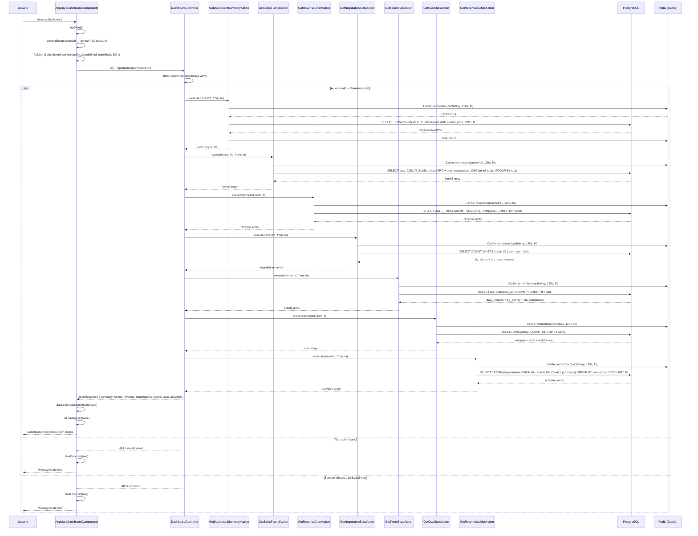
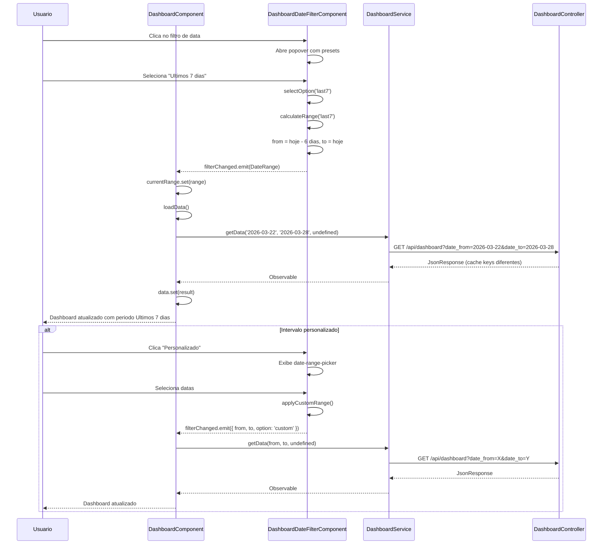
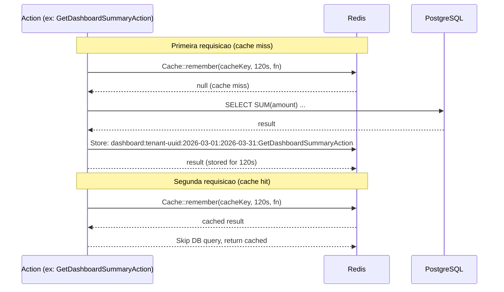
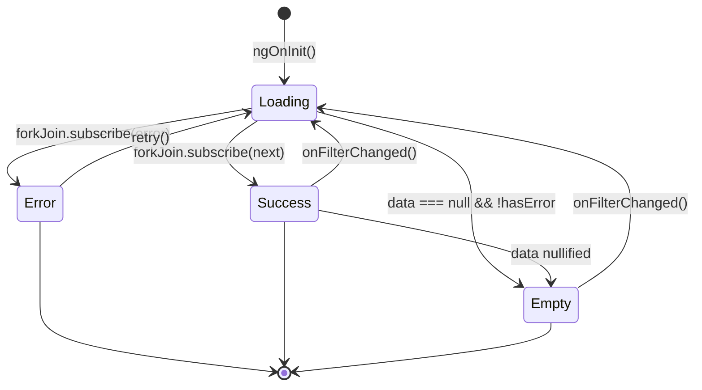
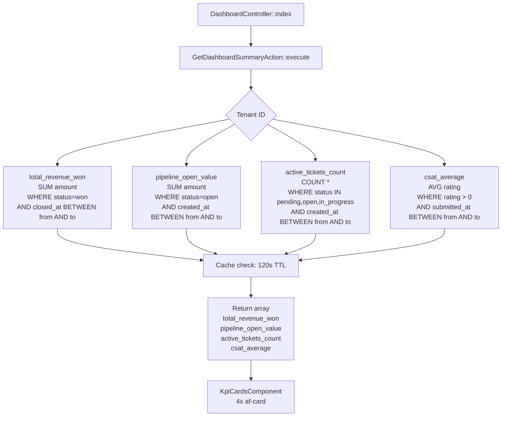
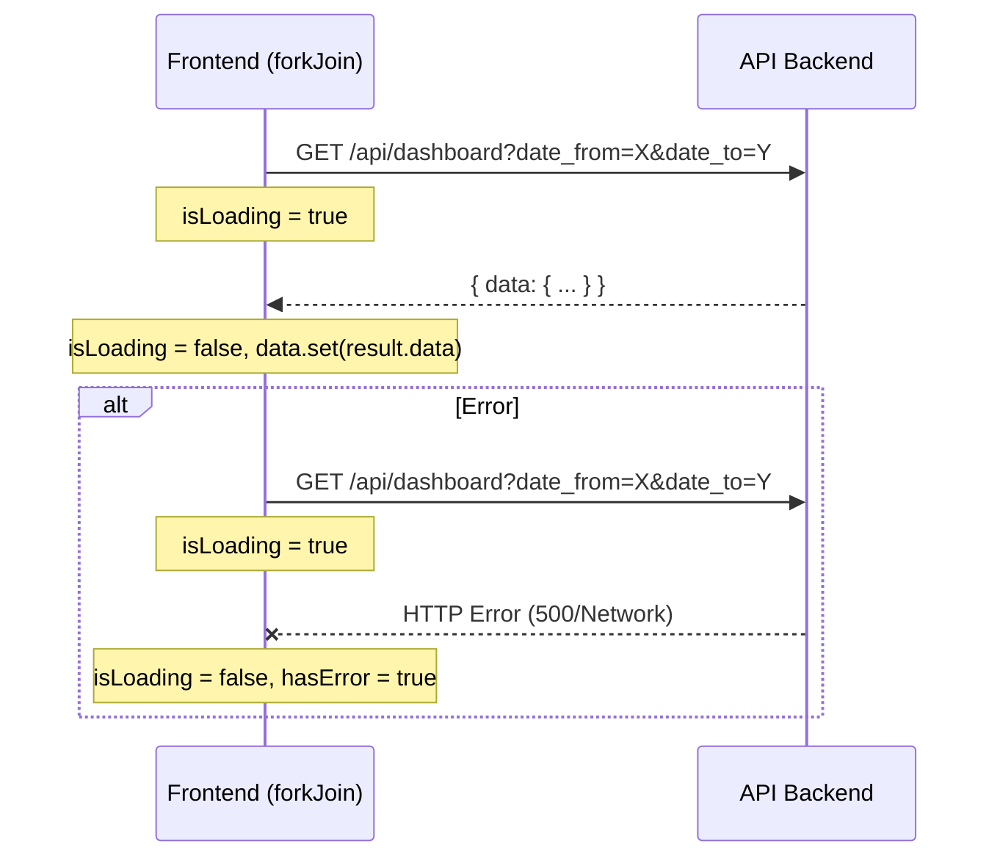

# PRD-DASHBOARD-001 — Modulo Dashboard AgentFlix

> **Modulo:** Dashboard
> **Status:** aprovado
> **Autor:** PM
> **Data:** 2026-03-28
> **Versao:** 1.0
> **Tags:** dashboard, kpi, crm, chat, csat, funil-de-vendas, inteligencia-de-negocios
> **Predecessor:** PRD-REPORTS-001 (modulo Reports)
> **Dominos integrados:** CRM, Chat

---

## 1. CONTEXTO

### 1.1 Posicionamento no Ecossistema AgentFlix

O modulo Dashboard do AgentFlix constitui a pagina inicial de referencia para todos os usuarios da plataforma. Diferentemente do modulo Reports (PRD-REPORTS-001), que oferece relatorios detalhados e exportaveis para analise profunda, o Dashboard concentra metricas de alto nivel — KPIs estrategicos — em uma unica visualizacao consolidada que permite ao usuario avaliar, em menos de 5 segundos, a saude operacional de sua empresa.

O AgentFlix e uma plataforma SaaS multi-tenant que integra comunicacao inteligente via WhatsApp, CRM completo, billing automatizado e inteligencia artificial. O modulo Dashboard e consumido diariamente por:

- **Proprietarios e socios de empresa** — visao executiva da saude do negocio sem precisar mergulhar em dados brutos
- **Gerentes de vendas** — acompanhamento de receita ganha, pipeline aberto e conversao do funil
- **Lideres de atendimento (chat)** — volume de tickets, compliance de SLA e indice de satisfacao (CSAT)
- **Equipe de sucesso do cliente** — tickets ativos e CSAT medio como proxy de saude do cliente
- **Administradores de plataforma** — visibilidade transversal das metricas de CRM e Chat

### 1.2 Historico e Evolucao

O modulo Dashboard foi construindo sobre as tabelas dos dominios CRM e Chat ja existentes. A primeira iteracao do modulo concentrou-se exclusivamente em metricas de vendas (CRM), incluindo receita, pipeline e funil. Uma segunda iteracao expandiu o escopo para incluir metricas de atendimento ao cliente, introduzindo tickets e CSAT no mesmo painel unificado.

A arquitetura foi projetada para ser extensivel: novas secoes de metricas podem ser adicionadas simplesmente criando uma nova Action e incluindo-a na resposta do `DashboardController`, sem modificacao no contrato da API — desde que a estrutura do JSON permaneca compatibilizada com o modelo existente.

Cada secao do Dashboard consulta tabelas de dominios ja existentes (CRM, Chat), refletindo a natureza integrada do AgentFlix. O isolamento entre tenants e garantido pelo `BelongsToTenant` em todas as queries, de modo que nenhuma query pode vazar dados entre empresas.

### 1.3 Arquitetura Geral

A arquitetura segue rigorosamente o padrao DDD do AgentFlix com Actions puras e isoladas:

```
HTTP Request (GET /api/dashboard)
  -> DashboardFilterRequest (validacao de periodo)
    -> DashboardController::index()
      -> GetDashboardSummaryAction::execute()
        -> Cache::remember(TTL=120s)
          -> DB: crm_negotiations + chat_tickets + chat_ticket_evaluations
      -> GetSalesFunnelAction::execute()
        -> Cache::remember(TTL=120s)
          -> DB: crm_negotiations + crm_negotiation_funnel_steps
      -> GetRevenueChartAction::execute()
        -> Cache::remember(TTL=120s)
          -> DB: crm_negotiations (DATE_TRUNC month)
      -> GetNegotiationStatsAction::execute()
        -> Cache::remember(TTL=120s)
          -> DB: crm_negotiations + crm_reason_losses
      -> GetTicketStatsAction::execute()
        -> Cache::remember(TTL=120s)
          -> DB: chat_tickets + chat_tickets_extended
      -> GetCsatStatsAction::execute()
        -> Cache::remember(TTL=120s)
          -> DB: chat_ticket_evaluations
      -> GetRecentActivitiesAction::execute()
        -> Cache::remember(TTL=120s)
          -> DB: crm_negotiations + chat_tickets + crm_proposals (UNION ALL)
  -> JsonResponse (data envelope)
```

### 1.4 Decisoes Arquiteturais Chave

| Decisao | Justificativa |
|---------|---------------|
| Cache centralizado com TTL=120s | Dashboard e recarregado frequentemente pelo usuario; 2 min de cache reduz carga no PostgreSQL sem comprometer a frescor dos dados. Menor que Reports (300s) porque o contexto e mais operacional |
| Single endpoint consolidado | Em vez de 7 endpoints separados, um unico `GET /dashboard` retorna todos os dados, permitindo que o frontend use `forkJoin` para carregamento paralelo. Reduz round-trips e simplifica a gesto de loading states |
| Cache key por tenant+dateRange+Action | Cada Action tem sua propria cache key. Filtros diferentes geram chaves diferentes, garantindo que mudancas de periodo nao retornem dados em cache do periodo anterior |
| UNION ALL para atividades | A query de atividades recentes executa UNION ALL entre 3 tabelas (negociacoes, tickets, propostas), mantendo tudo em uma unica execucao SQL em vez de 3 queries separadas |
| KPI summary isolado | O resumo de KPIs (4 numeros) e uma query separada para permitir que o frontend exiba os KPI cards imediatamente, mesmo se os graficos ainda estiverem carregando |
| Soft deletes em todas as tabelas | O Dashboard respeita `deleted_at` em todas as queries para garantir que registros logicamente removidos nao aparecam nas metricas |

### 1.5 Escopo do Modulo

O modulo Dashboard abrange as seguintes secoes de metricas:

1. **Resumo de KPIs** — 4 metricas consolidadas (receita ganha, pipeline aberto, tickets ativos, CSAT medio)
2. **Funil de Vendas** — distribuicao de negociacoes por etapa do funil
3. **Receita por Mes** — evolucao mensal de receita ganha vs aberta
4. **Estatisticas de Negociacoes** — contagem por status + motivos de perda
5. **Estatisticas de Tickets** — volume diario, distribuicao por prioridade, compliance de SLA
6. **Satisfacao do Cliente (CSAT)** — nota media, total de avaliacoes, distribuicao de estrelas
7. **Atividades Recentes** — feed unificado de negociacoes, tickets e propostas recentes

### 1.6 Integracao com Outros Modulos

| Modulo | Tipo de Integracao | Tabelas Consultadas |
|--------|--------------------|--------------------|
| CRM | Leitura | `crm_negotiations`, `crm_negotiation_funnel_steps`, `crm_reason_losses`, `crm_proposals` |
| Chat | Leitura | `chat_tickets`, `chat_tickets_extended`, `chat_ticket_evaluations` |
| Auth | Autorizacao | `permissions` (dashboard.view) |
| Platform | Multi-tenant | `tenants`, `BelongsToTenant` |

### 1.7 Limitacoes Conhecidas

- O Dashboard nao oferece exportacao de dados; para exportacao, o usuario deve acessar o modulo Reports (PRD-REPORTS-001)
- O Dashboard nao suporta filtragem por dimensoes secundarioas (ex.: filtrar por vendedor, canal, ou tag); essa capacidade pertence ao modulo Reports
- O CSAT average so considera avaliacoes com rating > 0; avaliacoes invalidas ou em branco sao ignoradas
- O calculo de SLA compliance usa as colunas `sla_first_response_breached` e `sla_resolution_breached` da tabela `chat_tickets_extended`; se o extended data nao estiver preenchido, o ticket nao entra no calculo
- Atividades recentes limitam-se a 10 itens por execucao (hard limit no codigo)

---

## 2. OBJETIVO

Prover uma pagina de Dashboard que apresente, em uma unica tela, metricas KPIs estrategicas consolidadas de CRM e Chat para todos os usuarios autenticados do AgentFlix. O modulo deve ser capaz de responder, instantaneamente, perguntas de negocio como:

- **Qual e a receita fechada no periodo atual?** (total_revenue_won)
- **Qual e o valor total em negociacao aberta?** (pipeline_open_value)
- **Quantos tickets de atendimento estao em andamento?** (active_tickets_count)
- **Qual e o indice de satisfacao medio dos clientes?** (csat_average)
- **Em quais etapas do funil de vendas as negociacoes estao concentradas?**
- **Como a receita evoluiu nos ultimos meses (ganha vs aberta)?**
- **Quais sao os principais motivos de perda de negociacoes?**
- **Qual e a taxa de compliance de SLA dos tickets?**
- **Quais foram as atividades mais recentes no sistema (negociacoes, tickets, propostas)?**

O modulo NAO tem como objetivo:

- Substituir o modulo Reports para analises profundas ou exportacao de dados
- Oferecer drill-down em metricas individuais (clique em um KPI para ver o detalhe)
- Agregar metricas de IA ou Billing no mesmo painel (escopo futuro)
- Permitir customizacao de layout por usuario (painel fixo para todos)

---

## 3. REGRAS DE NEGOCIO

### 3.1 Regras Gerais (Aplicadas a Todo o Dashboard)

| ID | Regra | Prioridade |
|----|-------|-----------|
| RN-D001 | Todo dado retornado pelo Dashboard deve ser filtrado pelo `tenant_id` do usuario autenticado via `auth:sanctum`. Nenhuma query pode retornar dados de outro tenant | Critica |
| RN-D002 | O endpoint `GET /api/dashboard` exige a permissao `dashboard.view` registrada no sistema RBAC do AgentFlix. Usuarios sem a permissao recebem `403 Forbidden` | Critica |
| RN-D003 | O parametro `period` aceita inteiros de 1 a 365. Se omitido, o padrao e 30 dias | Alta |
| RN-D004 | Os parametros `date_from` e `date_to` devem estar no formato ISO 8601 (`YYYY-MM-DD`). `date_to` deve ser igual ou posterior a `date_from` | Alta |
| RN-D005 | Quando ambos `date_from`/`date_to` e `period` sao fornecidos, `date_from`/`date_to` tem precedencia | Media |
| RN-D006 | Todas as queries de metricas respeitam `whereNull('deleted_at')` para soft deletes. Registros logicamente removidos nunca aparecem no Dashboard | Alta |
| RN-D007 | O cache de cada Action tem TTL de 120 segundos. A chave de cache segue o pattern `dashboard:{tenantId}:{from}:{to}:{ActionClassName}` | Alta |
| RN-D008 | Campos de data/hora em todas as respostas sao retornados como strings ISO 8601 | Media |
| RN-D009 | Valores monetarios (BRL) sao retornados como `float` com 2 casas decimais de precisao | Media |
| RN-D010 | O CSAT average arredonda para 2 casas decimais. Se nao houver avaliacoes, retorna `0.0` | Media |
| RN-D011 | O KPI `active_tickets_count` considera apenas tickets com status `pending`, `open` ou `in_progress` (status ativos, excluindo `closed`) | Alta |
| RN-D012 | O KPI `pipeline_open_value` soma o `amount` de todas as negociacoes com status `open` criadas no periodo | Alta |
| RN-D013 | O KPI `total_revenue_won` soma o `amount` de todas as negociacoes com status `won` fechadas (`closed_at`) no periodo | Alta |
| RN-D014 | O grafico de receita usa `COALESCE(closed_at, expected_close, created_at)` como data de referencia para agrupamento mensal | Alta |
| RN-D015 | O funil de vendas exibe apenas negociacoes com status `open` agrupadas por etapa (`crm_negotiation_funnel_step_id`) | Alta |
| RN-D016 | O calculo de SLA compliance usa apenas tickets com `closed_at` preenchido. Tickets em aberto nao sao considerados no calculo | Media |
| RN-D017 | O tempo medio de primeira resposta (`avg_first_response_minutes`) considera apenas tickets com `first_response_at` preenchido | Media |
| RN-D018 | A lista de atividades recentes retorna no maximo 10 itens, ordenados por `created_at` descendente | Media |
| RN-D019 | As atividades recentes sao compostas pela uniao de negociacoes, tickets e propostas. Se uma tabela nao tiver dados no periodo, ela contribui com 0 linhas | Media |
| RN-D020 | Nenhuma metricas do Dashboard inclui dados de testes ou usuarios de sandbox; apenas dados reais do tenant | Critica |

### 3.2 Regras de Calculo de KPIs

| ID | Regra | Detalhe |
|----|-------|---------|
| RN-D021 | `total_revenue_won` = `SUM(amount)` de `crm_negotiations` WHERE `status = 'won'` AND `closed_at BETWEEN :from AND :to` | Ignora soft deletes e negociacoes de outros tenants |
| RN-D022 | `pipeline_open_value` = `SUM(amount)` de `crm_negotiations` WHERE `status = 'open'` AND `created_at BETWEEN :from AND :to` | Apenas negociacoes abertas no periodo |
| RN-D023 | `active_tickets_count` = `COUNT(*)` de `chat_tickets` WHERE `status IN (pending, open, in_progress)` AND `created_at BETWEEN :from AND :to` | Exclui `closed` |
| RN-D024 | `csat_average` = `AVG(rating)` de `chat_ticket_evaluations` WHERE `rating > 0` AND `submitted_at BETWEEN :from AND :to` | Rating 0 e null sao excluidos |
| RN-D025 | `sla_compliance_rate` = (`tickets_compliant` / `total_closed`) * 100 | Onde `compliant` = `sla_first_response_breached = false` AND `sla_resolution_breached = false` |
| RN-D026 | `avg_first_response_minutes` = `AVG(EXTRACT(EPOCH FROM (first_response_at - created_at)) / 60)` | Calculado via PostgreSQL `EXTRACT` para precisao |

### 3.3 Regras de Visualizacao (Frontend)

| ID | Regra | Prioridade |
|----|-------|-----------|
| RN-D030 | O Dashboard deve exibir estados de loading, erro e vazio para cada secao de forma independente | Alta |
| RN-D031 | Os KPI cards devem exibir valores formatados em BRL (`pt-BR`) para valores monetarios e `number` formatado para contagens | Alta |
| RN-D032 | O grafico de funil de vendas exibe barras horizontais com cores por etapa (`step_color`) | Media |
| RN-D033 | O grafico de receita exibe barras empilhadas (stacked) com series `Ganhas` e `Em aberto` | Media |
| RN-D034 | O donut de negociacoes exibe 3 fatias: Ganhas (verde), Perdidas (vermelho), Abertas (amarelo) | Media |
| RN-D035 | O grafico de tickets exibe linha de tendencia com volume diario | Media |
| RN-D036 | O CSAT exibe grafico radial com nota media (0-100%) e distribuicao de estrelas (1-5) | Media |
| RN-D037 | O feed de atividades recentes exibe timestamp relativo formatado em `pt-BR` (ex.: "ha 2 horas", "em 3 dias") | Media |
| RN-D038 | O filtro de datas permite 5 presets (Hoje, Ontem, Ultimos 7, 15, 30 dias) mais intervalo personalizado | Alta |
| RN-D039 | A mudanca de filtro de datas recarrega todos os dados do Dashboard | Alta |

### 3.4 Regras de Cache

| ID | Regra | Prioridade |
|----|-------|-----------|
| RN-D040 | Cada Action e cacheada independentemente com TTL de 120 segundos | Alta |
| RN-D041 | A cache key inclui `tenant_id`, data de inicio, data de fim e nome da Action | Alta |
| RN-D042 | O cache e global (compartilhado entre usuarios do mesmo tenant com os mesmos filtros) | Media |
| RN-D043 | Nao ha invalidacao manual de cache; o cache expira naturalmente via TTL | Media |

---

## 4. FLUXOS

### 4.1 Fluxo Principal — Carregamento do Dashboard



### 4.2 Fluxo de Filtro de Data



### 4.3 Fluxo de Cache



### 4.4 Diagrama de Arquitetura de Componentes (Frontend)

```mermaid
componentDiagram
    component DashboardComponent {
        <<Page>>
        [OnInit] loadData()
        [Signal] isLoading
        [Signal] hasError
        [Signal] data
        [Signal] currentRange
    }

    component DashboardDateFilterComponent {
        [Output] filterChanged
        [Signal] selectedOption
        [Signal] currentLabel
        calculateRange()
        applyCustomRange()
    }

    component KpiCardsComponent {
        [Input] summary
        [Signal] —
    }

    component RevenueChartComponent {
        [Input] data
        [Computed] series
        [Computed] labels
        [Computed] hasData
    }

    component SalesFunnelChartComponent {
        [Input] steps
        [Computed] series
        [Computed] categories
        [Computed] colors
    }

    component NegotiationStatsComponent {
        [Input] stats
        [Computed] chartSeries
        [Computed] hasData
    }

    component TicketStatsComponent {
        [Input] stats
        [Computed] series
        [Computed] categories
        [Computed] hasData
    }

    component CsatChartComponent {
        [Input] stats
        [Computed] chartSeries
        [Computed] ratingRows
        [Computed] chartOptions
    }

    component RecentActivitiesComponent {
        [Input] activities
        [Computed] rows
        formatRelativeTime()
        resolveIcon()
    }

    DashboardComponent --> DashboardDateFilterComponent
    DashboardComponent --> KpiCardsComponent
    DashboardComponent --> RevenueChartComponent
    DashboardComponent --> SalesFunnelChartComponent
    DashboardComponent --> NegotiationStatsComponent
    DashboardComponent --> TicketStatsComponent
    DashboardComponent --> CsatChartComponent
    DashboardComponent --> RecentActivitiesComponent

    DashboardComponent --> DashboardService
    DashboardService --> HTTP GET /api/dashboard
```

### 4.5 Fluxo de Estados de UI



### 4.6 Fluxo de Calculo de KPI Summary



---

## 5. ENTIDADES E MODELOS

### 5.1 Entidades do Dominio CRM

#### 5.1.1 CRMNegotiation (crm_negotiations)

| Campo | Tipo | Descricao |
|-------|------|-----------|
| id | uuid | Chave primaria |
| tenant_id | uuid | FK para tenants |
| title | string | Titulo da negociacao |
| amount | decimal(18,2) | Valor da negociacao |
| status | enum | `open`, `won`, `lost` |
| crm_negotiation_funnel_step_id | uuid | FK para etapa do funil |
| crm_reason_loss_id | uuid nullable | FK para motivo de perda |
| closed_at | datetime nullable | Data de fechamento |
| expected_close | date nullable | Data esperada de fechamento |
| created_at | datetime | Data de criacao |
| updated_at | datetime | Data de atualizacao |
| deleted_at | datetime nullable | Soft delete |

**Status permitidos:**

| Valor | Label | Uso no Dashboard |
|-------|-------|-----------------|
| `open` | Aberta | Pipeline aberto, funil de vendas |
| `won` | Ganha | Receita ganha, calculo de total_revenue_won |
| `lost` | Perdida | Estatisticas de perda, motivos de perda |

#### 5.1.2 CRMNegotiationFunnelStep (crm_negotiation_funnel_steps)

| Campo | Tipo | Descricao |
|-------|------|-----------|
| id | uuid | Chave primaria |
| tenant_id | uuid | FK para tenants |
| name | string | Nome da etapa |
| color | string nullable | Hex color para UI |
| order | integer | Ordem de apresentacao |
| created_at | datetime | Data de criacao |
| updated_at | datetime | Data de atualizacao |
| deleted_at | datetime nullable | Soft delete |

#### 5.1.3 CRMReasonLoss (crm_reason_losses)

| Campo | Tipo | Descricao |
|-------|------|-----------|
| id | uuid | Chave primaria |
| tenant_id | uuid | FK para tenants |
| name | string | Nome do motivo de perda |
| created_at | datetime | Data de criacao |
| updated_at | datetime | Data de atualizacao |
| deleted_at | datetime nullable | Soft delete |

#### 5.1.4 CRMProposal (crm_proposals)

| Campo | Tipo | Descricao |
|-------|------|-----------|
| id | uuid | Chave primaria |
| tenant_id | uuid | FK para tenants |
| title | string | Titulo da proposta |
| status | string | Status da proposta |
| created_at | datetime | Data de criacao |
| updated_at | datetime | Data de atualizacao |
| deleted_at | datetime nullable | Soft delete |

**Status de proposta** (para feed de atividades):
`draft`, `sent`, `pending`, `accepted`, `rejected`, `open`, `closed`

### 5.2 Entidades do Dominio Chat

#### 5.2.1 ChatTicket (chat_tickets)

| Campo | Tipo | Descricao |
|-------|------|-----------|
| id | uuid | Chave primaria |
| tenant_id | uuid | FK para tenants |
| ticket_number | string | Numero legivel do ticket |
| channel | string | Canal de origem |
| status | enum | `pending`, `open`, `in_progress`, `closed` |
| priority | string | `low`, `normal`, `high`, `urgent` |
| created_at | datetime | Data de criacao |
| first_response_at | datetime nullable | Data da primeira resposta |
| closed_at | datetime nullable | Data de fechamento |
| updated_at | datetime | Data de atualizacao |
| deleted_at | datetime nullable | Soft delete |

**Status ativos** (ChatTicketStatus::active()):
- `pending` — Aguardando atribuicao
- `open` — Aberto aguardando acao
- `in_progress` — Em atendimento

**Status final:**
- `closed` — Encerrado

#### 5.2.2 ChatTicketsExtended (chat_tickets_extended)

| Campo | Tipo | Descricao |
|-------|------|-----------|
| id | uuid | Chave primaria |
| ticket_id | uuid | FK para chat_tickets |
| tenant_id | uuid | FK para tenants |
| subject | string nullable | Assunto do ticket |
| sla_first_response_breached | boolean | Indica se SLA de primeira resposta foi violado |
| sla_resolution_breached | boolean | Indica se SLA de resolucao foi violado |
| created_at | datetime | Data de criacao |
| updated_at | datetime | Data de atualizacao |

**Nota:** JOIN com `chat_tickets_extended` para calculo de SLA compliance.

#### 5.2.3 ChatTicketEvaluation (chat_ticket_evaluations)

| Campo | Tipo | Descricao |
|-------|------|-----------|
| id | uuid | Chave primaria |
| tenant_id | uuid | FK para tenants |
| ticket_id | uuid | FK para chat_tickets |
| rating | integer | Nota de 1 a 5 |
| submitted_at | datetime | Data de envio da avaliacao |
| created_at | datetime | Data de criacao |
| updated_at | datetime | Data de atualizacao |

**Regras:**
- `rating` deve estar entre 1 e 5
- `rating = 0` ou `NULL` sao ignorados no calculo de CSAT average

### 5.3 Modelos TypeScript (Frontend)

#### 5.3.1 DashboardSummary

```typescript
interface DashboardSummary {
  total_revenue_won: number;       // BRL com 2 casas
  pipeline_open_value: number;     // BRL com 2 casas
  active_tickets_count: number;    // Inteiro
  csat_average: number;           // 0.0 a 5.0 com 2 casas
}
```

#### 5.3.2 FunnelStep

```typescript
interface FunnelStep {
  step_name: string;      // Nome da etapa do funil
  step_color: string;     // Hex color (#RRGGBB)
  count: number;          // Quantidade de negociacoes
  total_amount: number;   // Soma dos valores
}
```

#### 5.3.3 RevenueMonth

```typescript
interface RevenueMonth {
  month: number;         // 1-12
  year: number;          // YYYY
  won_amount: number;    // Receita ganha no mes
  open_amount: number;   // Receita em aberto no mes
}
```

#### 5.3.4 NegotiationStats

```typescript
interface NegotiationStats {
  by_status: {
    open: number;
    won: number;
    lost: number;
  };
  top_loss_reasons: { name: string; count: number }[];
}
```

#### 5.3.5 TicketStats

```typescript
interface TicketStats {
  daily_volume: { date: string; count: number }[];
  by_priority: {
    low: number;
    normal: number;
    high: number;
    urgent: number;
  };
  sla_compliance_rate: number;         // 0.0 a 100.0
  avg_first_response_minutes: number;  // Minutos com 2 casas
}
```

#### 5.3.6 CsatStats

```typescript
interface CsatStats {
  average_rating: number;                        // 0.0 a 5.0
  total_evaluations: number;                     // Contagem
  distribution: Record<1 | 2 | 3 | 4 | 5, number>; // Frequencia por estrela
}
```

#### 5.3.7 RecentActivity

```typescript
interface RecentActivity {
  type: string;      // 'negotiation' | 'ticket' | 'proposal'
  title: string;    // Titulo da atividade
  description: string; // Descricao (ex: "Value: 5000.00")
  created_at: string;  // ISO 8601
  icon: string;     // Identificador do icone Lucide
}
```

#### 5.3.8 DashboardData (Envelope Completo)

```typescript
interface DashboardData {
  summary: DashboardSummary;
  funnel: FunnelStep[];
  revenue: RevenueMonth[];
  negotiations: NegotiationStats;
  tickets: TicketStats;
  csat: CsatStats;
  activities: RecentActivity[];
}
```

#### 5.3.9 DateRange

```typescript
type DashboardFilterOption = 'today' | 'yesterday' | 'last7' | 'last15' | 'last30' | 'custom';

interface DateRange {
  from: string;     // ISO date YYYY-MM-DD
  to: string;      // ISO date YYYY-MM-DD
  option: DashboardFilterOption;
  label: string;   // Label humanizado
}
```

### 5.4 Enums PHP

#### 5.4.1 CRMNegotiationStatus

```php
enum CRMNegotiationStatus: string
{
    case OPEN = 'open';   // Negociacao em andamento
    case WON  = 'won';    // Negociacao ganha
    case LOST = 'lost';   // Negociacao perdida

    public function label(): string  // Labels em pt-BR
    public function color(): string  // Cores para badge
}
```

#### 5.4.2 ChatTicketStatus

```php
enum ChatTicketStatus: string
{
    case PENDING     = 'pending';      // Aguardando
    case OPEN        = 'open';        // Aberto
    case IN_PROGRESS = 'in_progress'; // Em atendimento
    case CLOSED      = 'closed';      // Encerrado

    public static function active(): array  // [PENDING, OPEN, IN_PROGRESS]
    public function label(): string        // Labels em pt-BR
}
```

---

## 6. ENDPOINTS

### 6.1 GET /api/dashboard

**Descricao:** Retorna dados consolidados do dashboard com todas as secoes de metricas.

**Autenticacao:** `auth:sanctum` (Bearer token)

**Autorizacao:** Permissao `dashboard.view` via Spatie Permissions

**Metodo HTTP:** `GET`

**URL:** `/api/dashboard`

**Query Parameters:**

| Parametro | Tipo | Obrigatorio | Padrao | Descricao |
|-----------|------|-------------|--------|-----------|
| `period` | integer | Nao | `30` | Numero de dias para buscar (1-365) |
| `date_from` | string | Nao | Calculado | Data de inicio (YYYY-MM-DD) |
| `date_to` | string | Nao | Hoje | Data de fim (YYYY-MM-DD) |

**Logica de Precedencia de Filtros:**
1. Se `date_from` e `date_to` estao presentes: usa esses valores
2. Caso contrario: usa `period` (default: 30 dias)

**Resposta de Sucesso (200 OK):**

```json
{
  "data": {
    "summary": {
      "total_revenue_won": 125000.00,
      "pipeline_open_value": 340000.00,
      "active_tickets_count": 47,
      "csat_average": 4.32
    },
    "funnel": [
      {
        "step_name": "Contato Inicial",
        "step_color": "#2b7fff",
        "count": 28,
        "total_amount": 95000.00
      },
      {
        "step_name": "Proposta Enviada",
        "step_color": "#06b6d4",
        "count": 15,
        "total_amount": 125000.00
      },
      {
        "step_name": "Negociacao",
        "step_color": "#f59e0b",
        "count": 8,
        "total_amount": 120000.00
      }
    ],
    "revenue": [
      {
        "month": 1,
        "year": 2026,
        "won_amount": 35000.00,
        "open_amount": 12000.00
      },
      {
        "month": 2,
        "year": 2026,
        "won_amount": 45000.00,
        "open_amount": 18000.00
      }
    ],
    "negotiations": {
      "by_status": {
        "open": 51,
        "won": 23,
        "lost": 12
      },
      "top_loss_reasons": [
        { "name": "Preco elevado", "count": 5 },
        { "name": "Concorrente preferido", "count": 3 },
        { "name": "Sem presupuesto", "count": 2 }
      ]
    },
    "tickets": {
      "daily_volume": [
        { "date": "2026-03-01", "count": 12 },
        { "date": "2026-03-02", "count": 8 }
      ],
      "by_priority": {
        "low": 15,
        "normal": 25,
        "high": 5,
        "urgent": 2
      },
      "sla_compliance_rate": 88.50,
      "avg_first_response_minutes": 22.35
    },
    "csat": {
      "average_rating": 4.32,
      "total_evaluations": 156,
      "distribution": {
        "1": 3,
        "2": 5,
        "3": 18,
        "4": 65,
        "5": 65
      }
    },
    "activities": [
      {
        "type": "negotiation",
        "title": "Projeto Software XYZ",
        "description": "Value: 55000.00",
        "created_at": "2026-03-27T14:30:00Z",
        "icon": "lucideHandshake"
      },
      {
        "type": "ticket",
        "title": "Duvida sobre cobranca",
        "description": "Channel: whatsapp",
        "created_at": "2026-03-27T13:15:00Z",
        "icon": "lucideHeadset"
      },
      {
        "type": "proposal",
        "title": "Proposta Anual 2026",
        "description": "Status: sent",
        "created_at": "2026-03-27T10:00:00Z",
        "icon": "lucideFileText"
      }
    ]
  }
}
```

**Resposta de Erro (401 Unauthorized):**

```json
{
  "message": "Unauthenticated."
}
```

**Resposta de Erro (403 Forbidden):**

```json
{
  "message": "This action is unauthorized."
}
```

**Resposta de Erro (422 Validation Error):**

```json
{
  "message": "The given data was invalid.",
  "errors": {
    "period": ["The period field must be between 1 and 365."],
    "date_from": ["The date from field must be a valid date."],
    "date_to": ["The date to must be a date after or equal to date_from."]
  }
}
```

### 6.2 Taxonomia de Codigos HTTP

| Codigo | Cenario |
|--------|---------|
| 200 | Sucesso — dados retornados normalmente |
| 401 | Nao autenticado — token ausente ou invalido |
| 403 | Nao autorizado — falta permissao `dashboard.view` |
| 422 | Parametros de filtro invalidos |
| 500 | Erro interno do servidor |

### 6.3 Rate Limiting

| Limite | Janela | Aplicacao |
|--------|--------|-----------|
| 60 requisicoes | por minuto | por IP + usuario autenticado |
| 300 requisicoes | por hora | por IP + usuario autenticado |

---

## 7. EVENTOS

### 7.1 Eventos de Dashboard (Frontend)

O Dashboard Angular emite e responde aos seguintes eventos:

| Evento | Origem | Destino | Payload | Descricao |
|--------|--------|---------|---------|-----------|
| `filterChanged` | `DashboardDateFilterComponent` | `DashboardComponent` | `DateRange` | Emitido quando o usuario muda o filtro de periodo |
| `clicked` (retry) | `DashboardComponent` template | `DashboardComponent` | — | Recarrega os dados apos erro |
| `clicked` (applyCustomRange) | `DashboardDateFilterComponent` template | `DashboardDateFilterComponent` | — | Aplica intervalo personalizado |

### 7.2 Eventos de Dados (DashboardService)

| Metodo | Evento HTTP | Parametros | Resposta |
|--------|-----------|-----------|---------|
| `getData(dateFrom?, dateTo?, period?)` | `GET /api/dashboard` | `{ date_from, date_to }` ou `{ period }` | `{ data: DashboardData }` |

### 7.3 Eventos de Cache (Backend)

| Evento | Trigger | Acao |
|--------|---------|-------|
| Cache miss | `Cache::remember` retorna `null` na primeira chamada | Executa query no PostgreSQL e armazena resultado |
| Cache hit | `Cache::remember` retorna valor existente | Retorna dados em cache sem query |
| Cache expiry | TTL de 120 segundos expira | Proxima requisicao gera nova query |

### 7.4 Eventos de Erro

| Erro | Origem | Tratamento no Frontend |
|------|--------|----------------------|
| Network error (HTTP error) | `HttpClient.get()` throw | `hasError.set(true)` + exibe `af-alert` danger |
| 401 Unauthorized | Backend retorna erro | Redirecionar para login (via HttpInterceptor) |
| 403 Forbidden | Backend retorna erro | Exibir alert de acesso negado |
| 422 Validation | Backend retorna erro | Exibir mensagens de erro de validacao |
| Timeout | Observable timeout | Tratar como erro generico |
| Null response | API retorna `data: null` | Renderizar empty state |

### 7.5 Eventos de Requisicao Assincrona (forkJoin)



### 7.6 Eventos de Ciclos de Vida (Angular)

| Hook | Componente | Acao |
|------|-----------|------|
| `ngOnInit` | `DashboardComponent` | Chama `loadData()` |
| `ngOnInit` | `DashboardDateFilterComponent` | Emite filtro padrao `last30` |
| `OnChanges` | Todos os componentes filhos | Atualizam computed signals quando `data()` muda |
| `ngOnDestroy` | `DashboardComponent` | Assinaturas terminadas via `takeUntilDestroyed` |

---

## 8. SEGURANCA

### 8.1 Autenticacao

| Mecanismo | Implementacao | Escopo |
|-----------|--------------|--------|
| Bearer Token | `auth:sanctum` middleware | Todas as requisicoes ao `/api/dashboard` |
| Token validation | Laravel Sanctum valida token em cada requisicao | Token expiry, revogacao |

### 8.2 Autorizacao (RBAC)

| Permissao | Descricao | Quem recebe |
|-----------|-----------|-------------|
| `dashboard.view` | Visualizar o dashboard principal | Todos os perfis operacionais (gerente, lider, admin) |
| `dashboard.export` | Exportar dados do dashboard | (Futuro — nao implementado nesta versao) |

A verificacao e realizada via `$this->authorize('dashboard.view')` no `DashboardController::index()`.

### 8.3 Isolamento Multi-Tenant

| Camada | Mecanismo |
|--------|----------|
| Aplicacao | `tenant_id` extraido do token Sanctum e passado para cada Action |
| Queries | `where('tenant_id', $tenantId)` em TODAS as queries SQL |
| Middleware | `tenant` middleware (via BaseController::tenantId) |
| Cache | Chave de cache inclui `tenantId` — dados de um tenant nunca vazam para outro |

**Importante:** O `tenant_id` e extraido do usuario autenticado, NAO de um parametro da requisicao. Isso impede que um atacante injete um `tenant_id` via query string para acessar dados de outra empresa.

### 8.4 Validacao de Input

| Campo | Regra | Protecao contra |
|-------|-------|----------------|
| `period` | `integer`, `min:1`, `max:365` | DoS por range excessivamente largo |
| `date_from` | `date_format:Y-m-d` | Injection, format tampering |
| `date_to` | `date_format:Y-m-d`, `after_or_equal:date_from` | range reverso (from > to) |

### 8.5 Mapeamento de Seguranca

| Ameaca | Mitigacao |
|--------|----------|
| Cross-tenant data access | `tenant_id` via token Sanctum (nao via input) |
| Credential leakage | Tokens, senhas e API keys nunca sao logados |
| Cache poisoning | Cache key incluem `tenant_id` + hash de filtros |
| Excessive query range | `period` maximo de 365 dias |
| Soft delete bypass | `whereNull('deleted_at')` em todas as queries |
| Rate limiting | 60 req/min por usuario |

---

## 9. DTOs E RESOURCES

### 9.1 PHP FormRequest

#### DashboardFilterRequest

```php
/**
 * Validacao dos filtros do dashboard.
 */
final class DashboardFilterRequest extends FormRequest
{
    public function authorize(): bool  // true (autorizacao delegue ao controller)

    /**
     * @return array<string, array<int, string>>
     */
    public function rules(): array {
        return [
            'period'    => ['sometimes', 'integer', 'min:1', 'max:365'],
            'date_from'  => ['sometimes', 'date_format:Y-m-d'],
            'date_to'    => ['sometimes', 'date_format:Y-m-d', 'after_or_equal:date_from'],
        ];
    }

    /**
     * Obter o intervalo de datas do periodo solicitado.
     *
     * @return array{from: Carbon, to: Carbon}
     */
    public function period(): array {
        if ($this->has(['date_from', 'date_to'])) {
            return [
                'from' => Carbon::parse($this->input('date_from'))->startOfDay(),
                'to'   => Carbon::parse($this->input('date_to'))->endOfDay(),
            ];
        }
        $days = (int) $this->input('period', 30);
        return [
            'from' => Carbon::now()->subDays($days - 1)->startOfDay(),
            'to'   => Carbon::now()->endOfDay(),
        ];
    }
}
```

### 9.2 PHP Actions (Retorno)

#### GetDashboardSummaryAction::execute()

```php
/**
 * @return array<string, float|int>
 * [
 *   'total_revenue_won'     => float,
 *   'pipeline_open_value'  => float,
 *   'active_tickets_count'  => int,
 *   'csat_average'          => float,
 * ]
 */
```

#### GetSalesFunnelAction::execute()

```php
/**
 * @return array<int, array<string, float|int|string>>
 * [
 *   ['step_name' => string, 'step_color' => string, 'count' => int, 'total_amount' => float],
 *   ...
 * ]
 */
```

#### GetRevenueChartAction::execute()

```php
/**
 * @return array<int, array<string, float|int>>
 * [
 *   ['month' => int, 'year' => int, 'won_amount' => float, 'open_amount' => float],
 *   ...
 * ]
 */
```

#### GetNegotiationStatsAction::execute()

```php
/**
 * @return array<string, mixed>
 * [
 *   'by_status' => ['open' => int, 'won' => int, 'lost' => int],
 *   'top_loss_reasons' => [['name' => string, 'count' => int], ...],
 * ]
 */
```

#### GetTicketStatsAction::execute()

```php
/**
 * @return array<string, mixed>
 * [
 *   'daily_volume' => [['date' => string, 'count' => int], ...],
 *   'by_priority'  => ['low' => int, 'normal' => int, 'high' => int, 'urgent' => int],
 *   'sla_compliance_rate' => float,
 *   'avg_first_response_minutes' => float,
 * ]
 */
```

#### GetCsatStatsAction::execute()

```php
/**
 * @return array<string, mixed>
 * [
 *   'average_rating' => float,
 *   'total_evaluations' => int,
 *   'distribution' => [1 => int, 2 => int, 3 => int, 4 => int, 5 => int],
 * ]
 */
```

#### GetRecentActivitiesAction::execute()

```php
/**
 * @return array<int, array<string, string>>
 * [
 *   ['type' => string, 'title' => string, 'description' => string, 'created_at' => string, 'icon' => string],
 *   ...
 * ]
 */
```

### 9.3 TypeScript Service (Request DTO)

```typescript
interface DashboardGetDataParams {
  dateFrom?: string;  // YYYY-MM-DD
  dateTo?: string;   // YYYY-MM-DD
  period?: number;   // 1-365 (alternativa a dateFrom/dateTo)
}

// Metodo no DashboardService
getData(dateFrom?: string, dateTo?: string, period?: number): Observable<{ data: DashboardData }>
```

### 9.4 TypeScript Response Models (DashboardData Envelope)

```typescript
// app/src/app/pages/dashboard/models/dashboard.models.ts

export interface DashboardSummary {
  total_revenue_won: number;
  pipeline_open_value: number;
  active_tickets_count: number;
  csat_average: number;
}

export interface FunnelStep {
  step_name: string;
  step_color: string;
  count: number;
  total_amount: number;
}

export interface RevenueMonth {
  month: number;
  year: number;
  won_amount: number;
  open_amount: number;
}

export interface NegotiationStats {
  by_status: { open: number; won: number; lost: number };
  top_loss_reasons: { name: string; count: number }[];
}

export interface TicketStats {
  daily_volume: { date: string; count: number }[];
  by_priority: { low: number; normal: number; high: number; urgent: number };
  sla_compliance_rate: number;
  avg_first_response_minutes: number;
}

export interface CsatStats {
  average_rating: number;
  total_evaluations: number;
  distribution: Record<1 | 2 | 3 | 4 | 5, number>;
}

export interface RecentActivity {
  type: string;
  title: string;
  description: string;
  created_at: string;
  icon: string;
}

export interface DashboardData {
  summary: DashboardSummary;
  funnel: FunnelStep[];
  revenue: RevenueMonth[];
  negotiations: NegotiationStats;
  tickets: TicketStats;
  csat: CsatStats;
  activities: RecentActivity[];
}

export type DashboardFilterOption = 'today' | 'yesterday' | 'last7' | 'last15' | 'last30' | 'custom';

export interface DateRange {
  from: string;
  to: string;
  option: DashboardFilterOption;
  label: string;
}
```

### 9.5 Mapeamento de Tipo entre Camadas

| Conceito | PHP (Action return) | TypeScript (Model) |
|---------|--------------------|-------------------|
| KPI summary | `array` PHP | `DashboardSummary` |
| Etapa do funil | `array` PHP | `FunnelStep` |
| Mes de receita | `array` PHP | `RevenueMonth` |
| Status de negociacao | `array` PHP | `NegotiationStats` |
| Metricas de ticket | `array` PHP | `TicketStats` |
| Avaliacao CSAT | `array` PHP | `CsatStats` |
| Atividade recente | `array` PHP | `RecentActivity` |
| Envelope completo | `array` PHP | `DashboardData` |

---

## 10. CRITERIOS DE ACEITACAO

### 10.1 Criticos ( blocker — impedem deploy )

| ID | Criterio | Metodo de Verificacao | Cenario de Teste |
|----|----------|----------------------|-----------------|
| CA-D001 | Autenticacao: requisicao sem token retorna 401 | `curl -X GET /api/dashboard` | HTTP 401 |
| CA-D002 | Autorizacao: usuario sem `dashboard.view` retorna 403 | `curl -H "Authorization: Bearer {token}" /api/dashboard` (token sem permissao) | HTTP 403 |
| CA-D003 | Isolamento de tenant: usuario do Tenant A nao ve dados do Tenant B | Dashboard carrega com tenant A e verifica que nao ha dados do tenant B | Dados isolados |
| CA-D004 | Periodo padrao: `period=30` quando nenhum filtro fornecido | `GET /api/dashboard` sem params retorna dados dos ultimos 30 dias | last 30 days |
| CA-D005 | Filtro `period`: valores invalidos (< 1 ou > 365) retornam 422 | `GET /api/dashboard?period=500` | HTTP 422 |
| CA-D006 | Filtro `date_from`/`date_to`: `date_to` anterior a `date_from` retorna 422 | `GET /api/dashboard?date_from=2026-03-31&date_to=2026-03-01` | HTTP 422 |
| CA-D007 | KPI `total_revenue_won`: valor e maior ou igual a zero | GET dashboard e verifica `data.summary.total_revenue_won >= 0` | float >= 0 |
| CA-D008 | KPI `active_tickets_count`: tickets fechados (`closed`) nao sao contados | Criar ticket closed, chamar API, verificar que nao aparece no count | Count exclui closed |
| CA-D009 | Cache: mesma requisicao em menos de 120s retorna dados cacheados | Primeira chamada (cache miss), segunda chamada dentro de 120s (cache hit) | Tempo de resposta menor na 2a chamada |
| CA-D010 | Soft deletes: registros `deleted_at` preenchido nao aparecem em metricas | Criar negociacao, soft delete, chamar API, verificar que nao aparece | Dados filtrados |

### 10.2 Funcionais ( devem funcionar apos deploy )

| ID | Criterio | Metodo de Verificacao |
|----|----------|----------------------|
| CA-D011 | KPI cards exibem 4 cards: Receita Ganha, Pipeline Aberto, Tickets Ativos, CSAT Medio | Acessar dashboard e verificar que todos os 4 cards estao presentes |
| CA-D012 | KPI card de Receita Ganha formata valor em BRL com `pt-BR` | Visualizar dashboard em portugues, verificar formato `R$ 1.250,00` |
| CA-D013 | KPI card de CSAT Medio exibe nota com 1 casa decimal (ex.: `4.3 / 5`) | Visualizar card CSAT e verificar formatacao |
| CA-D014 | Grafico de receita exibe barras empilhadas (stacked) com series "Ganhas" e "Em aberto" | Verificar `af-apexchart` com `type="bar"` e `stacked: true` |
| CA-D015 | Funil de vendas exibe etapas ordenadas por `step_order` | Verificar ordem das etapas no grafico horizontal |
| CA-D016 | Estatisticas de negociacao exibem donut com 3 fatias (Ganhas/Perdidas/Abertas) | Verificar donut chart com 3 series |
| CA-D017 | Motivos de perda listam no maximo 5 itens (`TOP_LIMIT = 5`) | Verificar que `top_loss_reasons` tem maximo 5 entries |
| CA-D018 | Grafico de tickets exibe linha de volume diario | Verificar `af-apexchart` com `type="line"` |
| CA-D019 | Prioridades de tickets exibem 4 blocos: Baixa, Normal, Alta, Urgente | Verificar grid com 4 cards de prioridade |
| CA-D020 | CSAT exibe radial bar com nota media como percentage (0-100%) | Verificar `type="radialBar"` com valor `(average/5)*100` |
| CA-D021 | CSAT exibe distribuicao de estrelas (1 a 5) com barras proporcionais | Verificar 5 linhas com barra de largura proporcional |
| CA-D022 | Feed de atividades exibe no maximo 10 itens | Verificar `activities.length <= 10` |
| CA-D023 | Atividades mostram timestamps relativos em `pt-BR` (ex.: "ha 2 horas") | Visualizar feed e verificar formato em portugues |
| CA-D024 | Filtro de datas permite 5 presets + intervalo personalizado | Clicar no botao de filtro e verificar todas as opcoes |
| CA-D025 | Selecionar filtro recarrega todos os componentes do dashboard | Selecionar "Ultimos 7 dias" e verificar que todos os dados refletem 7 dias |
| CA-D026 | Aplicar intervalo personalizado recarrega dashboard | Selecionar datas customizadas e verificar reload |
| CA-D027 | Estado de loading mostra skeleton para todos os componentes | Observar estado entre `isLoading=true` e `isLoading=false` |
| CA-D028 | Estado de erro exibe alert danger + botao "Tentar novamente" | Simular erro de rede e verificar UI |
| CA-D029 | Estado vazio exibe empty state quando `data` e null | Sem dados no periodo, verificar empty state |
| CA-D030 | `Retry()` recarrega dados apos estado de erro | Clicar "Tentar novamente" e verificar nova requisicao |

### 10.3 Nao Funcionais

| ID | Criterio | Limite | Metodo |
|----|----------|--------|--------|
| CA-D031 | Tempo de resposta da API | < 2000ms (p95) | Teste de carga com k6 ou Artillery |
| CA-D032 | Tempo de renderizacao inicial | < 1500ms | Lighthouse CI |
| CA-D033 | Cache reduz queries ao banco | Cache hit < 50ms | APM / slow query log |
| CA-D034 | Sem N+1 queries | Cada Action executa exatamente 1 query | Laravel Query Log |
| CA-D035 | Mobile responsivo | Dashboard legivel em 375px+ | Chrome DevTools Mobile |
| CA-D036 | Acessibilidade | WCAG 2.1 AA para contraste de cores | axe DevTools |

### 10.4 Checklist de Gate (PREVC)

| Gate | Descricao | Responsavel |
|------|-----------|-------------|
| `composer gate:all` (API) | PHPStan L6 + tests passam | @BACKEND |
| `pnpm run gate:all` (APP) | ESLint + tests passam | @FRONTEND |
| Revisao de codigo | PR revisado por pelo menos 1 reviewer | @REVIEWER |
| QA sem critical blockers | Nenhum bug critico em aberto | @QA |

### 10.5 Cenarios de Edge Case

| ID | Cenario | Comportamento Esperado | Prioridade |
|----|---------|----------------------|------------|
| CA-D040 | Periodo com inicio apos fim (`date_from > date_to`) | Retornar 422 com mensagem de erro "date_to deve ser igual ou posterior a date_from" | Critica |
| CA-D041 | Periodo com range de 365 dias em tenant com muitos dados | Retornar dados normalmente; cache funciona; tempo de resposta < 2000ms | Alta |
| CA-D042 | Tenant sem nenhuma negociacao ou ticket no periodo | Retornar dados com valores zerados (`total_revenue_won: 0`, `activities: []`) | Alta |
| CA-D043 | Cache expirado durante requisicao subsequente | Primeira requisicao pos-expiry causa cache miss; proxima requisicao usa cache | Media |
| CA-D044 | CSAT medio com apenas avaliacoes de 1 estrela | Retornar `csat_average: 1.0`; grafico radial exibe 20% | Media |
| CA-D045 | CSAT medio com todas avaliacoes de 5 estrelas | Retornar `csat_average: 5.0`; grafico radial exibe 100% | Media |
| CA-D046 | Funil de vendas com etapa sem negociacoes | Exibir etapa no grafico com `count: 0` e `total_amount: 0` | Media |
| CA-D047 | Nome de etapa do funil muito longo (> 50 caracteres) | Truncar no grafico com reticencias (`...`) | Baixa |
| CA-D048 | Quantidade de atividades recentes maior que 10 | Limitar a 10 itens ordenados por `created_at` descendente | Alta |
| CA-D049 | Ticket com `first_response_at` null mas ja fechado | `avg_first_response_minutes` ignora esse ticket; SLA compliance nao o conta | Media |
| CA-D050 | Negociacao com amount null (nao informado) | Ignorada no calculo de `pipeline_open_value` e `total_revenue_won` | Media |
| CA-D051 | Date range que retorna dados de multiplos meses | `RevenueMonth` agrupa corretamente por mes/ano; grafico exibe barras para cada mes | Alta |
| CA-D052 | Tentativa de accesso com token de SuperAdmin (tenant interno) | Sistema verifica `dashboard.view` permission; se ausente, retorna 403 | Critica |
| CA-D053 | Cache Redis indisponivel | Backend cai para query direta ao PostgreSQL sem cache; alerta disparado | Alta |
| CA-D054 | Soft deleted contact com negociacao ativa | Negociacao nao aparece no dashboard; contato nao aparece em contatos | Critica |
| CA-D055 | Ticket com priority invalido (nao e low/normal/high/urgent) | Ignorado na contagem `by_priority`; nao quebra o grafico | Media |

---

## A. ANEXO — Rotas

### A.1 Definicao de Rota (api/src/Domain/Dashboard/Routes/dashboard.php)

```php
Route::middleware('auth:sanctum')->get('/dashboard', [DashboardController::class, 'index']);
```

**Middleware aplicados:**
1. `auth:sanctum` — Autenticacao Bearer token
2. `tenant` — Injecao automatica de `tenant_id` no BaseController
3. `verified` — Verificacao de email (se configurado)
4. `permission:dashboard.view` — Verificacao RBAC (via Spatie)

### A.2 Middleware Stack Completo

```
Request → Throttle (rate limit) → Auth (Sanctum) → Tenant (multi-tenant) → Permission (RBAC) → Controller
```

---

## B. ANEXO — Componentes Visuais

### B.1 Hierarquia de Componentes Frontend

```
DashboardComponent
├── DashboardDateFilterComponent
│   ├── AfPopoverComponent
│   ├── AfButtonComponent
│   └── AfDateRangePickerComponent
├── KpiCardsComponent
│   └── AfCardComponent (x4)
├── RevenueChartComponent
│   ├── AfCardComponent
│   ├── AfApexchartComponent
│   └── AfEmptyStateComponent
├── NegotiationStatsComponent
│   ├── AfCardComponent
│   ├── AfApexchartComponent
│   └── AfEmptyStateComponent
├── TicketStatsComponent
│   ├── AfCardComponent
│   ├── AfApexchartComponent
│   └── AfEmptyStateComponent
├── CsatChartComponent
│   ├── AfCardComponent
│   ├── AfApexchartComponent
│   └── AfEmptyStateComponent
├── SalesFunnelChartComponent
│   ├── AfCardComponent
│   ├── AfApexchartComponent
│   └── AfEmptyStateComponent
└── RecentActivitiesComponent
    ├── AfCardComponent
    ├── AfEmptyStateComponent
    ├── AfStatusBadgeComponent
    └── LucideAngularModule
```

---

*Documento gerado em 2026-03-28. Versao 1.0. Modulo Dashboard — AgentFlix.*
