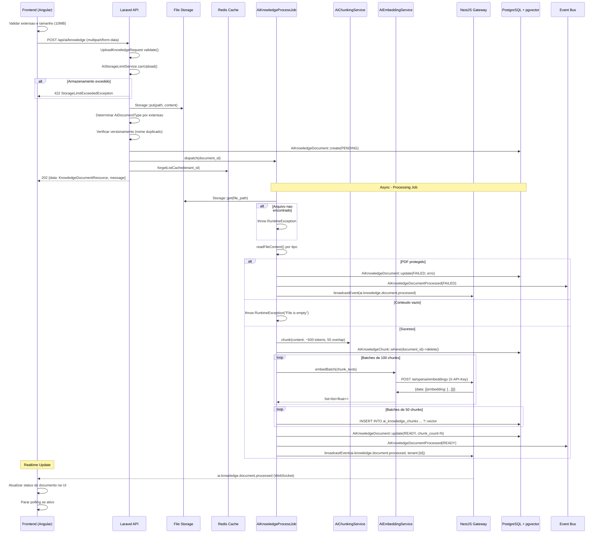
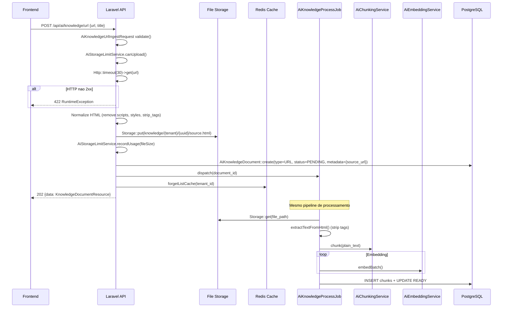
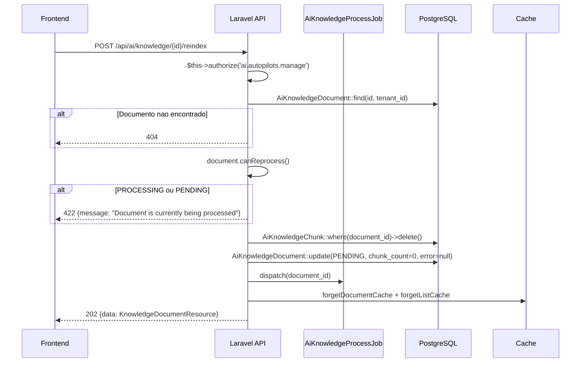
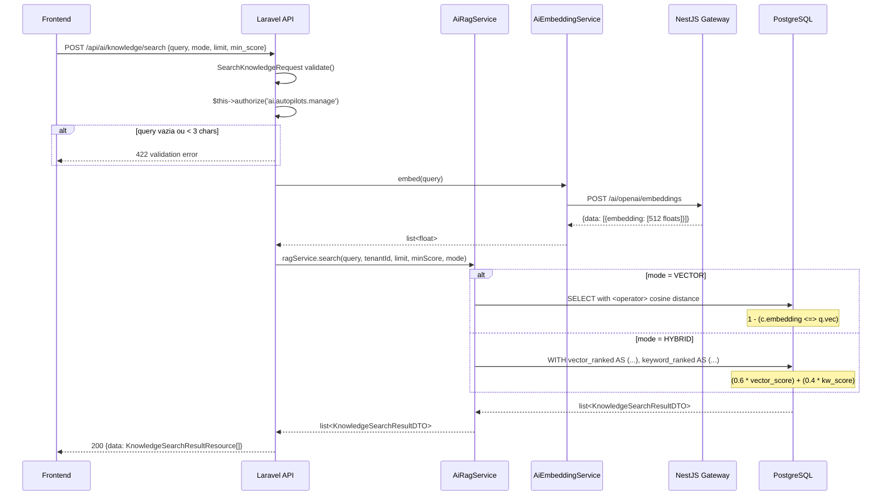
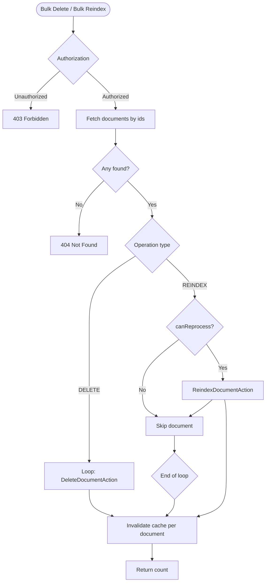
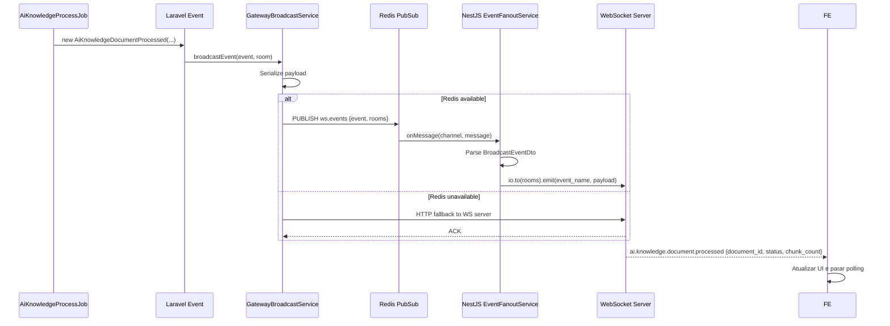
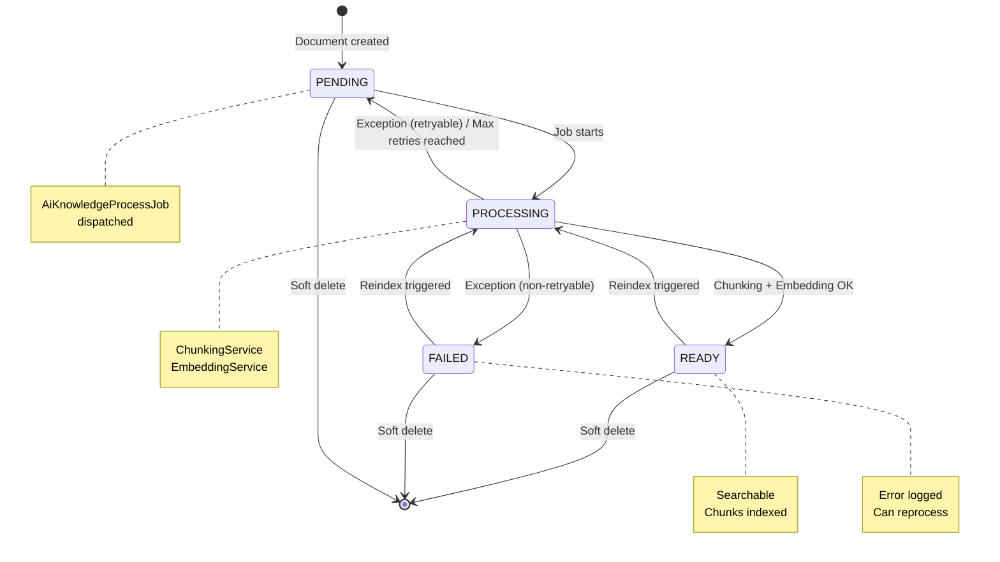
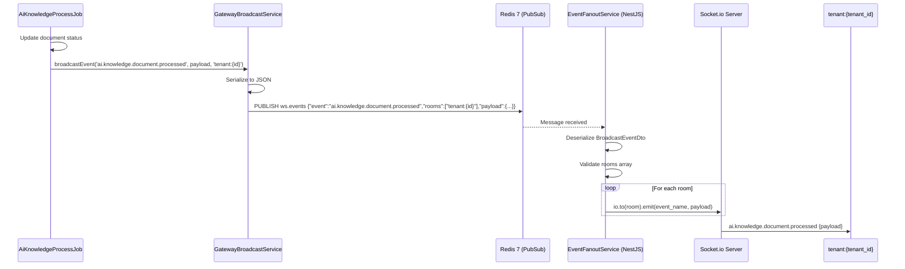

# PRD-KNOWLEDGE-001 — Modulo Knowledge Base (RAG)

> **Modulo:** AI / Knowledge Base
> **Status:** aprovado
> **Autor:** PM
> **Data:** 2026-03-28
> **Versao:** 1.0
> **Stack:** Laravel 12 (API) | Angular 20 (Frontend) | NestJS 11 (Gateway) | PostgreSQL 17 + pgvector | Redis 7

---

## 1. CONTEXTO

### 1.1 Visao Geral do Modulo

O modulo Knowledge Base e um subsistema do modulo AI responsavel pelo
armazenamento, processamento e busca semantica de documentos de conhecimento
proprietario de cada tenant. O sistema implementa o padrao RAG
(Retrieval-Augmented Generation), permitindo que agentes de IA consultem
documentos carregados para construir respostas contextualizadas e precisas.

O Knowledge Base opera como parte integrada do modulo AI em tres camadas
sincronizadas: API (Laravel 12), Frontend (Angular 20) e Gateway (NestJS 11).
Todos os dados sao estritamente isolados por tenant, garantindo que documentos
de uma empresa nunca sejam expostos a outra.

O pipeline RAG completo compreende seis etapas sequenciais: upload do documento,
extracao de texto, fragmentacao em chunks, geracao de embeddings vetoriais,
armazenamento no banco de dados vetorial (pgvector), e busca semantica na hora
da execucao do agente. Este pipeline e totalmente assincrono, com jobs em fila
para processamento pesado de chunks e geracao de vetores.

### 1.2 Problema que Resolve

**Conhecimento proprietario inacessivel:** Empresas积累了 grandes volumes de
documentos internos (manuais, FAQ, politicas, KBs de suporte, catlogos de
produtos) que nunca sao aproveitados pela IA porque esta gera respostas
genericas. O modulo resolve isso permitindo o upload desses documentos e sua
transformacao em contexto vetorial pesquisavel.

**Respostas desatualizadas ou imprecisas:** Sem uma base de conhecimento
confiavel, agentes de IA inventam informacoes (hallucinations). O modulo
fornece chunks de documentos como contexto verificavel para as respostas.

**Processamento de multiplos formatos:** Empresas armazenam conhecimento em
PDFs, planilhas CSV, arquivos de texto, JSONs de sistemas legados e paginas
web. O modulo processa todos esses formatos nativamente, extraindo texto
estruturado e indexavel.

**Escalabilidade do armazenamento vetorial:** Armazenar e buscar em milhares
de chunks por tenant exige um banco de dados vetorial eficiente. O modulo
usa pgvector com HNSW indexes para busca de similaridade rapida mesmo em
grandes volumes de dados.

**Lag de processamento:** O processamento de documentos grandes pode levar
minutos. O modulo implementa status em tempo real (PENDING, PROCESSING, READY,
FAILED) com broadcasting WebSocket para notificar o frontend assim que o
documento esta pronto para busca.

### 1.3 Arquitetura de Tres Camadas

```
┌─────────────────────────────────────────────────────────────────────┐
│                     FRONTEND (Angular 20)                            │
│  /pages/ai/knowledge/knowledge-list, knowledge-upload,                │
│              knowledge-detail, knowledge-search, knowledge-dashboard  │
│  Services: AiKnowledgeService (pages/ai/services/)                   │
│  Models: AiKnowledge, KnowledgeChunk, KnowledgeStats,                │
│          KnowledgeSearchResult (pages/ai/models/ai.models.ts)         │
└──────────────────────────────┬──────────────────────────────────────┘
                               │ HTTPS + Auth Bearer
┌──────────────────────────────▼──────────────────────────────────────┐
│                      API (Laravel 12)                                 │
│  Controller: AiKnowledgeController                                     │
│  Actions (DDD): UploadDocumentAction, IngestUrlAction,                 │
│                ReindexDocumentAction, DeleteDocumentAction,            │
│                GetKnowledgeStatsAction                                 │
│  Models: AiKnowledgeDocument, AiKnowledgeChunk                        │
│  Job: AiKnowledgeProcessJob (BullMQ, unique 600s, backoff 60/300/600) │
│  Services: AiRagService, AiEmbeddingService, AiChunkingService,        │
│            AiStorageLimitService                                       │
│  Events: AiKnowledgeDocumentProcessed                                 │
│  Enums: AiDocumentType, AiEmbeddingStatus, AiRagSearchModeEnum        │
└──────────────────────────────┬──────────────────────────────────────┘
                               │ Redis Streams + WebSocket + HTTP
┌──────────────────────────────▼──────────────────────────────────────┐
│                    GATEWAY (NestJS 11)                               │
│  AiController: POST /ai/openai/embeddings                            │
│  Routes OpenAI embedding requests to OpenAI API via X-API-Key auth    │
│  BroadcastService: relays ai.knowledge.document.processed events       │
└─────────────────────────────────────────────────────────────────────┘
```

### 1.4 Posicionamento no Ecossistema InteraZap

O modulo Knowledge Base e um componente-chave do modulo AI. Ele se integra
diretamente com os agentes de IA (AiAgent) atraves do AiRagService, que
fornece contexto semantico para o PromptAssemblerService durante a execucao
de runs de agentes. Quando um agente executa uma run, o RAG Service busca
os chunks mais relevantes da base de conhecimento do tenant e os injeta no
prompt do modelo de linguagem.

O modulo tambem se integra ao modulo Billing atraves do
AiStorageLimitService, que controla o espaco de armazenamento que cada
tenant pode utilizar. Quando o limite e excedido, uploads sao rejeitados
com uma excecao StorageLimitExceededException.

A interface WebSocket e gerenciada pelo Gateway via
GatewayBroadcastService, que transmite eventos de processamento de
documentos (ai.knowledge.document.processed) em tempo real para o frontend,
permitindo atualizacao instantanea da UI quando um documento termina de
ser processado.

### 1.5 Tecnologia de Banco de Dados

O Knowledge Base depende de PostgreSQL 17 com as seguintes extensoes:

**pgvector (vector type):** Permite armazenar vetores de floats de dimensao
fixa diretamente em colunas do PostgreSQL. No InteraZap, usa-se 512
dimensoes (otimizado para text-embedding-3-small da OpenAI, que suporta
dimension reduction nativa).

**HNSW Index:** Indice de proximidade vetorial (Hierarchical Navigable
Small World) para busca de similaridade por cosseno com m=16 e
ef_construction=64. Oferece queries O(log n) mesmo em milhoes de vetores.

**tsvector + plainto_tsquery:** Para busca hibrida, usa-se Full-Text Search
nativa do PostgreSQL com o dicionario portugues. A coluna `content_tsv`
e gerada automaticamente via generated column.

### 1.6 Comparativo: Vector vs Hybrid Search

| Aspecto              | Vector Search          | Hybrid Search             |
| -------------------- | ---------------------- | ------------------------- |
| Mecanismo            | Similaridade cosseno   | 60% vetor + 40% keyword   |
| Vetores              | text-embedding-3-small | text-embedding-3-small    |
| Keyword              | N/A                    | plainto_tsquery (PT-BR)   |
| Melhor para          | Conceitos abstratos    | Termos exatos e conceitos |
| Performance          | Rapida (HNSW index)    | Mais lenta (2 fontes)     |
| Tolerancia a typos   | Alta                   | Baixa                     |
| Precision em factual | Media                  | Alta                      |
| min_score padrao     | 0.30                   | 0.30                      |

### 1.7 Restricoes Conhecidas

**PDFs protegidos:** PDF protegidos por senha nao sao suportados. O job
detecta o erro "Secured pdf file" via Smalot/PdfParser e marca o
documento como FAILED com mensagem explicativa ao usuario.

**Limite de arquivo:** Frontend valida ate 10MB por arquivo no upload.
O backend tambem valida via UploadKnowledgeRequest.

**Armazenamento:** Cada tenant tem um limite de armazenamento definido
no plano de Billing. Exceder o limite bloqueia uploads.

**Timeout de URL:** Fetch de URLs usa timeout de 30 segundos.
URLs que nao respondem dentro desse prazo geram erro.

---

## 2. OBJETIVO

### 2.1 Proposito

O modulo Knowledge Base tem como objetivo permitir que cada tenant do
InteraZap carregue, processe e utilize seus proprios documentos como
contexto para as respostas dos agentes de IA. O sistema implementa um
pipeline RAG completo com busca semantica de alta performance.

### 2.2 Metas Funcionais

**OF-01:** Permitir upload de documentos em formatos TXT, CSV, MARKDOWN,
JSON, PDF e URL para a base de conhecimento do tenant.

**OF-02:** Processar documentos de forma assincrona, extraindo texto,
fragmentando em chunks e gerando embeddings vetoriais.

**OF-03:** Disponibilizar busca semantica por similaridade de cosseno
usando pgvector, retornando chunks relevantes ordenados por score.

**OF-04:** Oferecer busca hibrida combinando similaridade vetorial (60%)
com busca por palavras-chave Full-Text Search em Portugues (40%).

**OF-05:** Permitir ingestao de URLs publicas, extraindo e processando
o conteudo HTML automaticamente.

**OF-06:** Fornecer versionamento automatico de documentos, mantendo
historico quando um documento com o mesmo nome e recarregado.

**OF-07:** Exibir status de processamento em tempo real via WebSocket,
permitindo que o usuario saiba quando seu documento esta pronto.

**OF-08:** Oferecer reindexacao individual e em lote de documentos,
permitindo reprocessamento em caso de falhas ou atualizacoes.

**OF-09:** Exibir estatisticas de uso da base de conhecimento
(documentos, chunks, armazenamento, distribuicao por status).

**OF-10:** Permitir navegacao pelos chunks de um documento especifico,
exibindo preview do conteudo e indice de cada fragmento.

### 2.3 Metas Nao-Funcionais

**ONF-01:** Tempo de resposta para busca < 500ms (P95) em tenants com
ate 10.000 chunks.

**ONF-02:** Throughput de processamento: no minimo 100 chunks/minuto por
job de processamento, com batching de 50 inserts por transacao.

**ONF-03:** Isolamento de tenant: ZERO vazamento de dados entre tenants.
Todo acesso passa por tenant_id obrigatorio.

**ONF-04:** Idempotencia: jobs de processamento usam ShouldBeUnique
(600s) para evitar processamento duplicado do mesmo documento.

**ONF-05:** Confiabilidade: ate 3 tentativas com backoff progressivo
(60s, 300s, 600s) para falhas transitarias.

**ONF-06:** Cache: listagem de documentos com cache de 5 minutos,
invalidado automaticamente em qualquer mutacao.

---

## 3. REGRAS DE NEGOCIO

### 3.1 Upload e Tipos de Documento

| ID        | Regra                                                                                                                                                                                       | Prioridade |
| --------- | ------------------------------------------------------------------------------------------------------------------------------------------------------------------------------------------- | ---------- |
| RN-KB-001 | Todo documento deve pertencer a exatamente um tenant (tenant_id obrigatorio), isolado via trait BelongsToTenant e escopo global em todas as queries.                                        | Critica    |
| RN-KB-002 | AiKnowledgeDocument usa UUID como chave primaria — nao usar auto-increment em nenhuma entidade do modulo.                                                                                   | Critica    |
| RN-KB-003 | Tipos de arquivo suportados: TXT, CSV, MARKDOWN, JSON, PDF, URL. Extensoes validas: .txt, .csv, .md, .markdown, .json, .pdf. MIME types validados no backend.                               | Critica    |
| RN-KB-004 | CSV: colunas sao interpretadas como pares key:value. A primeira linha e tratada como cabecalho se todos os valores forem nao-numericos e nao-vazios.                                        | Alta       |
| RN-KB-005 | JSON: documentos sao achatados recursivamente. Valores escalares geram linhas "caminho: valor". Arrays sao expandidos recursivamente.                                                       | Alta       |
| RN-KB-006 | PDF: processado via Smalot\PdfParser. PDFs protegidos por senha geram erro permanente (nao-retry) com mensagem amigavel ao usuario.                                                         | Critica    |
| RN-KB-007 | URL: conteudo HTML e baixado (timeout 30s), scripts e styles sao removidos, texto e extraido via strip_tags, espacos repetidos normalizados.                                                | Alta       |
| RN-KB-008 | Limite de tamanho por arquivo: 10MB enforced no frontend (UploadKnowledgeRequest) e validado no backend via AiStorageLimitService.                                                          | Alta       |
| RN-KB-009 | Armazenamento: arquivos salvos em `knowledge/{tenant_id}/{uuid}/{filename}`. Caminho persistido no campo `file_path` do documento.                                                          | Alta       |
| RN-KB-010 | Versionamento: se um documento com o mesmo `name` ja existe (ativo), o novo upload incrementa `version` do novo documento e marca o anterior como `is_active=false`, `replaced_by=novo_id`. | Alta       |
| RN-KB-011 | Upload sem nome: se o parametro `name` nao e fornecido, usa-se o nome do arquivo sem extensao como titulo.                                                                                  | Media      |
| RN-KB-012 | Limite de armazenamento: verificado via AiStorageLimitService antes de qualquer upload ou ingest. Excecao StorageLimitExceededException se excedido.                                        | Critica    |

### 3.2 Status e Ciclo de Vida do Documento

| ID        | Regra                                                                                                                                                             | Prioridade |
| --------- | ----------------------------------------------------------------------------------------------------------------------------------------------------------------- | ---------- | ------- |
| RN-KB-020 | AiEmbeddingStatus segue o ciclo: PENDING -> PROCESSING -> READY                                                                                                   | FAILED.    | Critica |
| RN-KB-021 | PENDING: documento criado mas job ainda nao iniciado.                                                                                                             | Alta       |
| RN-KB-022 | PROCESSING: job em execucao. Chunking e embedding em andamento.                                                                                                   | Alta       |
| RN-KB-023 | READY: documento processado com sucesso. Chunk_count > 0. Chunks com embeddings gerados. Somente este status permite busca.                                       | Critica    |
| RN-KB-024 | FAILED: processamento falhou apos todas as retentativas. error_message contem a causa.                                                                            | Alta       |
| RN-KB-025 | canReprocess(): permite reprocessar apenas documentos com status READY ou FAILED. PROCESSING e PENDING nao podem ser reprocessados.                               | Alta       |
| RN-KB-026 | is_active: soft delete logico. Documentos inativos nao aparecem na listagem nem na busca. Chunks asociados sao removidos via cascade delete do Eloquent.          | Alta       |
| RN-KB-027 | Reindexacao: reseta status para PENDING, zera chunk_count, deleta chunks existentes, redespacha job. Novo documento recebe chunks atualizados.                    | Alta       |
| RN-KB-028 | Exclusao: soft delete via is_active=false. Chunks nao sao removidos imediatamente. Hard delete (forceDelete) remove chunks via cascade Eloquent e arquivo fisico. | Alta       |

### 3.3 Chunking e Tokenizacao

| ID        | Regra                                                                                                                                                 | Prioridade |
| --------- | ----------------------------------------------------------------------------------------------------------------------------------------------------- | ---------- |
| RN-KB-030 | Tamanho alvo do chunk: 500 tokens. Estimativa via `mb_strlen($text) / 3.5`.                                                                           | Alta       |
| RN-KB-031 | Overlap: 50 tokens de sobreposicao entre chunks consecutivos, taken from end of previous chunk (working backwards from last sentences).               | Alta       |
| RN-KB-032 | Algoritmo: split por paragrafos (\n\n+) primeiro. Se paragrafo > 500 tokens, faz split por sentenca. Sentencas sao agrupadas ate atingir ~500 tokens. | Alta       |
| RN-KB-033 | Sentencas: detectadas por pontuacao terminal (.!?) seguida de espaco.                                                                                 | Alta       |
| RN-KB-034 | Conteudo vazio: se a extracao de texto resulta em string vazia, o job lanca RuntimeException("File is empty or could not be read").                   | Alta       |
| RN-KB-035 | Chunks sem conteudo: se chunking gera zero chunks, o job lanca RuntimeException("No chunks generated from content").                                  | Alta       |
| RN-KB-036 | Batch insert: chunks inseridos em lotes de ate 50 registros por transacao para performance.                                                           | Alta       |
| RN-KB-037 | Chunk index: sequencial, 0-based, ordenado por chunk_index ASC.                                                                                       | Alta       |
| RN-KB-038 | Campo `content` no chunk: text, sem limite de tamanho alem do texto extraido.                                                                         | Alta       |
| RN-KB-039 | Campo `token_count` no chunk: estimado estaticamente na geracao (chars/3.5), nao recalculado posteriormente.                                          | Media      |
| RN-KB-040 | Campo `embedding`: array JSON de 512 floats. Armazenado como string '[,]' no PostgreSQL. Convertido na insercao via `?::vector`.                      | Alta       |

### 3.4 Embedding e Modelo Vetorial

| ID        | Regra                                                                                                                            | Prioridade |
| --------- | -------------------------------------------------------------------------------------------------------------------------------- | ---------- |
| RN-KB-050 | Modelo: text-embedding-3-small (OpenAI). Dimensoes: 512 (apos reduction nativa do modelo que suporta 256/512/1024/1536).         | Critica    |
| RN-KB-051 | Endpoint: /ai/openai/embeddings via Gateway (NestJS). Autenticacao: X-API-Key no header.                                         | Critica    |
| RN-KB-052 | Timeout: 60 segundos por batch. Se excedido, retry.                                                                              | Alta       |
| RN-KB-053 | Retry logic: 3 tentativas. HTTP 429 (rate limit): backoff exponencial. HTTP 5xx: backoff linear de 1s. HTTP 4xx: falha imediata. | Alta       |
| RN-KB-054 | Batching: chunks enviados em lotes configuraveis via `config('ai.embedding.batch_size', 100)`.                                   | Alta       |
| RN-KB-055 | Embedding vazio: chunks inseridos com embedding=null se a geracao falhar parcialmente.                                           | Alta       |
| RN-KB-056 | Validacao: vetores devem conter apenas valores finitos (is_finite). Valores NaN ou Inf geram excecao.                            | Alta       |
| RN-KB-057 | Chunks sem embedding: ignorados na busca (WHERE embedding IS NOT NULL).                                                          | Alta       |

### 3.5 Busca RAG (Semantic e Hybrid)

| ID        | Regra                                                                                                                                               | Prioridade           |
| --------- | --------------------------------------------------------------------------------------------------------------------------------------------------- | -------------------- | --------------------------- | ---- |
| RN-KB-060 | Busca semantica (VECTOR): usa operador de similaridade cosseno do pgvector: `1 - (c.embedding <=> q.vec)`.                                          | Critica              |
| RN-KB-061 | Busca hibrida (HYBRID): 60% peso vetorial + 40% peso keyword (plainto_tsquery 'portuguese'). Formula: (0.6 _ vector_score) + (0.4 _ keyword_score). | Alta                 |
| RN-KB-062 | Min score padrao: 0.30. Chunks com score inferior sao filtrados.                                                                                    | Alta                 |
| RN-KB-063 | Limite de resultados padrao: 5. Maximo: 20 via parametro limit.                                                                                     | Alta                 |
| RN-KB-064 | Filtros obrigatorios: tenant_id = tenant logado, is_active = true, embedding_status = 'ready', embedding IS NOT NULL.                               | Critica              |
| RN-KB-065 | getContextForLLM(): formata resultados como "Source: {doc}                                                                                          | Relevancia: {score}% | Chunk {n}]\n{content}\n\n". | Alta |
| RN-KB-066 | Query vazia: retorna array vazio, nao tenta embed.                                                                                                  | Alta                 |
| RN-KB-067 | Portuguese FTS: usa dicionario 'portuguese' do PostgreSQL para stemmization e stop words em PT-BR.                                                  | Alta                 |

### 3.6 Frontend e Interface

| ID        | Regra                                                                                                                                            | Prioridade |
| --------- | ------------------------------------------------------------------------------------------------------------------------------------------------ | ---------- |
| RN-KB-070 | Listagem: paginada, com cache de 5 minutos. Cache invalidado em create, delete, reindex.                                                         | Alta       |
| RN-KB-071 | Upload: suporte a drag-and-drop. Validacao de extensao no frontend antes do envio.                                                               | Alta       |
| RN-KB-072 | Modos de upload: arquivo (multipart/form-data) ou URL (JSON body).                                                                               | Alta       |
| RN-KB-073 | Status realtime: via WebSocket (ai.knowledge.document.processed). Fallback: polling HTTP a cada 5s se WS desconectado e ha documentos pendentes. | Alta       |
| RN-KB-074 | Bulk actions: delete em lote e reindex em lote com ate N documentos por requisicao.                                                              | Alta       |
| RN-KB-075 | Mapeamento de campos API <-> Frontend: embedding_status -> status (ready->indexed), file_type -> content_type, name -> title.                    | Alta       |
| RN-KB-076 | Campos hidden no chunk: embedding (vetor nao serializado para JSON, muito grande).                                                               | Alta       |
| RN-KB-077 | Dashboard: stat cards com document_count, storage_used_percent, total_chunks, distribuicao por status.                                           | Alta       |
| RN-KB-078 | Busca: toggle vector/hybrid com visualizacao de relevance_percent por resultado.                                                                 | Alta       |

### 3.7 Eventos e Broadcasting

| ID        | Regra                                                                                                                                                                        | Prioridade |
| --------- | ---------------------------------------------------------------------------------------------------------------------------------------------------------------------------- | ---------- |
| RN-KB-080 | Evento AiKnowledgeDocumentProcessed: disparado apos cada transicao de status terminal (READY ou FAILED). Contem: document_id, tenant_id, status, chunk_count, error_message. | Alta       |
| RN-KB-081 | WebSocket event: ai.knowledge.document.processed via GatewayBroadcastService. Broadcasted para room tenant:{tenant_id}.                                                      | Alta       |
| RN-KB-082 | Evento disparado em tres situacoes: sucesso final, falha permanente (PDF protegido), falha apos max retries.                                                                 | Alta       |
| RN-KB-083 | Frontend responde ao evento: atualiza a lista de documentos e fecha o polling se ativo.                                                                                      | Alta       |

### 3.8 Seguranca e Isolamento

| ID        | Regra                                                                                                             | Prioridade |
| --------- | ----------------------------------------------------------------------------------------------------------------- | ---------- |
| RN-KB-090 | Authorization: $this->authorize('ai.autopilots.manage') em todos os endpoints do controller.                      | Critica    |
| RN-KB-091 | Tenant isolation: todas as queries filtram por tenant_id. Scope forTenant() obrigatorio em todos os scopes.       | Critica    |
| RN-KB-092 | Arquivos de um tenant: armazenamento isolado por path `knowledge/{tenant_id}/...`.                                | Critica    |
| RN-KB-093 | Embeddings: vetores nao sao expostos na API. Campo hidden no modelo Eloquent.                                     | Alta       |
| RN-KB-094 | Logs: nunca registrar conteudo de documentos, embeddings ou URLs em logs. Apenas IDs, status e erros estruturais. | Critica    |
| RN-KB-095 | URL fetch: limitadas a GET. Sem suporte a POST/PUT. Sem autenticacao.                                             | Alta       |
| RN-KB-096 | Upload: content-type validado contra os MIME types suportados.                                                    | Alta       |

### 3.9 Versionamento e Armazenamento

| ID        | Regra                                                                                                                                                                         | Prioridade |
| --------- | ----------------------------------------------------------------------------------------------------------------------------------------------------------------------------- | ---------- |
| RN-KB-100 | Versionamento automatico: ao fazer upload de documento com nome identico a um existente ativo, o novo recebe version+1 e o anterior e marcado como inativo (is_active=false). | Alta       |
| RN-KB-101 | Campo replaced_by: documento inativo aponta para seu substituto via FK. O substituto aponta para null.                                                                        | Alta       |
| RN-KB-102 | Documento substituto: novo documento herda chunks do anterior? Nao — o novo upload inicia um job de processamento completamente novo.                                         | Alta       |
| RN-KB-103 | Reindexacao de documento ja versionado: se reindex e acionada, o job deleta chunks existentes e cria novos. Chunk_count e resetado.                                           | Alta       |
| RN-KB-104 | Historico de versoes: apenas o documento ativo aparece na listagem. Para consultar anteriores, usar endpoint GET /documents/{id} diretamente (mostra ate inativos).           | Media      |
| RN-KB-105 | Armazenamento fisico: arquivos deletados fisicamente apenas no forceDelete (hard delete). Soft delete mantem arquivo no disco.                                                | Alta       |
| RN-KB-106 | Caminho de arquivo: formato `knowledge/{tenant_id}/{document_uuid}/{original_filename}`. Tenant isolation garantida pelo caminho.                                             | Alta       |
| RN-KB-107 | Storage limit checking: verificado antes do upload via AiStorageLimitService. Cada tenant tem limite mensal/total definido pelo plano.                                        | Critica    |
| RN-KB-108 | Excecao StorageLimitExceededException: lancada quando uploads excedem limite. Mensagem amigavel retorna ao frontend. Http 413 Payload Too Large.                              | Critica    |
| RN-KB-109 | Cleanup de arquivos orfaos: job AgendadoKnowledgeCleanupJob executa semanalmente. Identifica documentos sem registro na tabela mas com arquivo no disco.                      | Media      |
| RN-KB-110 | Upload duplicado rapido: se dois uploads com mesmo hash de arquivo ocorrem em menos de 60 segundos, o segundo retorna erro 409 Conflict.                                      | Alta       |

### 3.10 Cache e Performance

| ID        | Regra                                                                                                                                                               | Prioridade |
| --------- | ------------------------------------------------------------------------------------------------------------------------------------------------------------------- | ---------- |
| RN-KB-120 | Cache de listagem: GET /documents usa cache Redis com TTL de 5 minutos. Chave: `knowledge:docs:list:{tenant_id}`.                                                   | Alta       |
| RN-KB-121 | Invalidade de cache: qualquer mutacao (upload, delete, reindex) invalida a chave de listagem do tenant. Nao ha invalidade seletiva.                                 | Alta       |
| RN-KB-122 | Cache de busca: resultados de busca nao sao cacheados (muito dinamico). Embedding da query tambem nao e cacheado.                                                   | Alta       |
| RN-KB-123 | Batch insert de chunks: maximo 50 chunks por transacao. Transacao com savepoint para rollback parcial em caso de falha no meio do batch.                            | Alta       |
| RN-KB-124 | Batch embedding: configurado via `config('ai.embedding.batch_size', 100)`.默认值 100 chunks por request ao Gateway de embedding.                                    | Alta       |
| RN-KB-125 | Concurrent job processing: AiKnowledgeProcessJob usa singleton lock por document_id (Redis). Evita processamento duplicado do mesmo documento.                      | Critica    |
| RN-KB-126 | Lock timeout: lock de processamento expira em 30 minutos. Se job e morto, lock e liberado automaticamente.                                                          | Alta       |
| RN-KB-127 | Index HNSW: usado para busca vetorial com m=16 e ef_construction=64. Balance entre velocidade de escrita e qualidade de busca.                                      | Alta       |
| RN-KB-128 | GIN index em content_tsv: criado para busca full-text hibrida. Usa dicionario 'portuguese' para stemmization em PT-BR.                                              | Alta       |
| RN-KB-129 | Embedding dimensionamento: vector(512) nativo do text-embedding-3-small. Reduz de 1536 para 512 para economizar armazenamento sem perda significativa de qualidade. | Alta       |

### 3.11 Rate Limiting e Limites de Uso

| ID        | Regra                                                                                                                                               | Prioridade |
| --------- | --------------------------------------------------------------------------------------------------------------------------------------------------- | ---------- |
| RN-KB-130 | Upload endpoint: limite de 10 uploads por minuto por tenant. Excessos retornam 429 Too Many Requests.                                               | Alta       |
| RN-KB-131 | Search endpoint: limite de 60 requisicoes por minuto por tenant. Sem limite diario (e operacao de leitura).                                         | Alta       |
| RN-KB-132 | Search endpoint: rate limit counter usa sliding window de 1 minuto no Redis. Chave: `ratelimit:knowledge:search:{tenant_id}`.                       | Alta       |
| RN-KB-133 | Bulk reindex: maximo 10 documentos por requisicao. Excesso retorna 422 Unprocessable Entity.                                                        | Alta       |
| RN-KB-134 | Bulk delete: maximo 20 documentos por requisicao. Excesso retorna 422 Unprocessable Entity.                                                         | Alta       |
| RN-KB-135 | Timeout de URL fetch: 30 segundos. Apos timeout, job marca documento como FAILED com mensagem "URL fetch timeout".                                  | Alta       |
| RN-KB-136 | Tamanho maximo de URL: 2048 caracteres. URLs maiores retornam 422 Unprocessable Entity.                                                             | Alta       |
| RN-KB-137 | Concurrent processing limit: no maximo 3 jobs AiKnowledgeProcessJob simultaneos por tenant para evitar sobrecarga do Gateway de embedding.          | Alta       |
| RN-KB-138 | Budget constraint: cada tenant tem limite mensal de tokens de embedding (configurado via AiTenantConfig). Exceder o limite bloqueia novos uploads.  | Critica    |
| RN-KB-139 | Notificacao de limite: quando 80% do budget de tokens e atingido, um evento AiBudgetThresholdReached e disparado. Dashboard exibe aviso ao usuario. | Alta       |
| RN-KB-140 | Exceeded budget action: uploads subsequentes apos esgotamento retornam 402 Payment Required com mensagem indicando que o plano foi excedido.        | Critica    |
| RN-KB-141 | Armazenamento em disco: limite de 500MB por tenant para arquivos de conhecimento (configuravel). Exceder retorna 507 Insufficient Storage.          | Alta       |
| RN-KB-142 | Contagem de chunks: limite maximo de 50.000 chunks ativos por tenant. Exceder bloqueia novos processamentos.                                        | Alta       |

---

## 4. FLUXOS

### 4.1 Fluxo: Upload de Documento



### 4.2 Fluxo: Ingestao de URL



### 4.3 Fluxo: Reindexacao de Documento



### 4.4 Fluxo: Busca Semantica



### 4.5 Fluxo: Bulk Delete e Bulk Reindex



### 4.6 Fluxo: Broadcast em Tempo Real



### 4.7 Diagrama de Estados do Documento



---

## 5. ENTIDADES E MODELOS

### 5.1 Tabela: ai_knowledge_documents

Tabela principal que armazena metadados de cada documento da base de
conhecimento. Representa um documento carregado por um tenant para uso
no sistema RAG. Suporta versionamento e controle de status de
processamento.

| Campo             | Tipo        | Nulo | Padrao       | Descricao                                                                      |
| ----------------- | ----------- | ---- | ------------ | ------------------------------------------------------------------------------ |
| id                | uuid (PK)   | N    | ordered_uuid | UUID primaria, sem auto-increment.                                             |
| tenant_id         | uuid (FK)   | N    | —            | FK para platform_tenants. Cascade on delete.                                   |
| name              | string(255) | N    | —            | Titulo do documento. Unico por tenant + name + is_active.                      |
| original_filename | string(255) | N    | —            | Nome original do arquivo enviado.                                              |
| file_path         | string(500) | N    | —            | Caminho de armazenamento em disco (knowledge/{tenant}/{uuid}/{filename}).      |
| file_size_bytes   | bigint      | N    | —            | Tamanho em bytes. Usado para controle de armazenamento.                        |
| file_type         | string(20)  | N    | —            | AiDocumentType: txt, csv, markdown, json, pdf, url.                            |
| version           | integer     | N    | 1            | Numero de versao. Incrementa quando um documento com mesmo nome e reenviado.   |
| replaced_by       | uuid (FK)   | S    | null         | Aponta para o documento que substituiu este. Self-reference.                   |
| chunk_count       | integer     | N    | 0            | Quantidade de chunks gerados. Zero enquanto PENDING/PROCESSING.                |
| embedding_status  | string(20)  | N    | pending      | AiEmbeddingStatus: pending, processing, ready, failed.                         |
| error_message     | text        | S    | null         | Mensagem de erro quando status=failed.                                         |
| metadata          | jsonb       | S    | null         | Metadados extras em JSON. Para URLs, contem source_url.                        |
| is_active         | boolean     | N    | true         | Soft delete logico. Documentos inativos nao aparecem na listagem nem na busca. |
| created_at        | timestamp   | S    | now()        | Data de criacao.                                                               |
| updated_at        | timestamp   | S    | now()        | Data de ultima atualizacao.                                                    |

**Indexes:**

- `idx_docs_tenant_active` em (tenant_id, is_active) — para listagem filtrada
- `idx_docs_tenant_status` em (tenant_id, embedding_status) — para estatisticas
- `idx_docs_tenant_name` em (tenant_id, name) — para verificacao de versao
- FK em tenant_id -> platform_tenants.id (cascade delete)
- FK em replaced_by -> ai_knowledge_documents.id (null on delete)

**Scopes Eloquent:**

- `scopeActive($query)` — where is_active = true
- `scopeReady($query)` — where embedding_status = 'ready'
- `scopeForTenant($query, $tenantId)` — where tenant_id = $tenantId
- `scopeSearchable($query)` — active() + ready()

**Metodos de Instancia:**

- `isReady(): bool` — embedding_status === AiEmbeddingStatus::READY
- `isProcessing(): bool` — embedding_status === AiEmbeddingStatus::PROCESSING
- `isFailed(): bool` — embedding_status === AiEmbeddingStatus::FAILED
- `isPending(): bool` — embedding_status === AiEmbeddingStatus::PENDING
- `canReprocess(): bool` — status === READY || FAILED
- `getFormattedFileSize(): string` — bytes formatados (B/KB/MB/GB)

**Relacionamentos:**

- `$this->hasMany(AiKnowledgeChunk::class, 'document_id')` — chunks do documento
- `$this->belongsTo(self::class, 'replaced_by')` — documento substituto
- `$this->belongsTo(PlatformTenant::class)` — via BelongsToTenant

**Eventos Eloquent:**

- `creating`: gera UUID se id vazio
- `deleting`: deleta chunks em cascade via chunks()->delete()

---

### 5.2 Tabela: ai_knowledge_chunks

Tabela que armazena fragmentos de texto processados de cada documento,
cada um com seu embedding vetorial de 512 dimensoes.

| Campo       | Tipo        | Nulo | Padrao       | Descricao                                                                       |
| ----------- | ----------- | ---- | ------------ | ------------------------------------------------------------------------------- |
| id          | uuid (PK)   | N    | ordered_uuid | UUID primaria.                                                                  |
| document_id | uuid (FK)   | N    | —            | FK para ai_knowledge_documents. Cascade on delete.                              |
| tenant_id   | uuid (FK)   | N    | —            | FK para platform_tenants. Cascade on delete.                                    |
| chunk_index | integer     | N    | —            | Indice sequencial do chunk dentro do documento (0-based).                       |
| content     | text        | N    | —            | Texto do chunk. Sem limite alem do conteudo do documento.                       |
| token_count | integer     | N    | —            | Contagem estimada de tokens (chars/3.5).                                        |
| embedding   | vector(512) | S    | null         | Vetor de 512 floats gerado pelo text-embedding-3-small. NULL se geracao falhou. |
| created_at  | timestamp   | N    | now()        | Data de criacao do chunk.                                                       |

**Indexes:**

- `idx_chunks_doc_order` em (document_id, chunk_index) — para navegacao ordenada
- `idx_chunks_tenant` em (tenant_id) — para busca filtrada por tenant
- `idx_chunks_embedding` HNSW em (embedding) com m=16, ef_construction=64
- GIN index em (content_tsv) para Full-Text Search hibrida
- FK em document_id -> ai_knowledge_documents.id (cascade delete)
- FK em tenant_id -> platform_tenants.id (cascade delete)

**Generated Columns:**

- `content_tsv tsvector` gerado por `to_tsvector('portuguese', coalesce(content, ''))`

**Scopes Eloquent:**

- `scopeForDocument($query, $documentId)` — where document_id = $documentId
- `scopeWithEmbedding($query)` — where embedding IS NOT NULL

**Metodos de Instancia:**

- `hasEmbedding(): bool` — embedding !== null
- `getContentPreview(int $length = 100): string` — primeiros N caracteres

**Hidden Fields:**

- `embedding` esta em $hidden — nao serializado em JSON para evitar
  vazamento de dados vetoriais grandes para o cliente.

---

### 5.3 Diagrama ER

```mermaid
erDiagram
    PLATFORM_TENANT ||--o{ AI_KNOWLEDGE_DOCUMENT : "belongsTo"
    AI_KNOWLEDGE_DOCUMENT ||--o{ AI_KNOWLEDGE_CHUNK : "hasMany (cascade delete)"
    AI_KNOWLEDGE_DOCUMENT ||--o| AI_KNOWLEDGE_DOCUMENT : "replaced_by (self-ref)"

    PLATFORM_TENANT {
        uuid id PK
        string name
        uuid plan_id FK
        timestamp created_at
        timestamp updated_at
    }

    AI_KNOWLEDGE_DOCUMENT {
        uuid id PK "ordered_uuid"
        uuid tenant_id FK "platform_tenants"
        string name
        string original_filename
        string file_path
        bigint file_size_bytes
        string file_type "AiDocumentType enum"
        int version "default 1"
        uuid replaced_by FK "ai_knowledge_documents"
        int chunk_count "default 0"
        string embedding_status "AiEmbeddingStatus enum"
        text error_message "nullable"
        jsonb metadata "nullable"
        boolean is_active "default true"
        timestamp created_at
        timestamp updated_at
    }

    AI_KNOWLEDGE_CHUNK {
        uuid id PK "ordered_uuid"
        uuid document_id FK "ai_knowledge_documents"
        uuid tenant_id FK "platform_tenants"
        int chunk_index
        text content
        int token_count
        vector(512) embedding "nullable"
        timestamp created_at
    }

    AI_KNOWLEDGE_CHUNK {
        "content_tsv: tsvector (generated)"
    }
```

---

## 6. ENDPOINTS

### 6.1 Resumo dos Endpoints

| Metodo | Rota                       | Auth   | Descricao                             | Cache | Rate Limit |
| ------ | -------------------------- | ------ | ------------------------------------- | ----- | ---------- |
| GET    | /ai/knowledge              | Bearer | Lista documentos do tenant (paginado) | 5 min | 60/min     |
| POST   | /ai/knowledge              | Bearer | Upload arquivo (multipart/form-data)  | —     | 30/min     |
| GET    | /ai/knowledge/{id}         | Bearer | Busca documento por ID                | 5 min | 60/min     |
| DELETE | /ai/knowledge/{id}         | Bearer | Soft delete documento                 | —     | 30/min     |
| POST   | /ai/knowledge/{id}/reindex | Bearer | Reprocessa documento                  | —     | 30/min     |
| GET    | /ai/knowledge/stats        | Bearer | Estatisticas da base de conhecimento  | —     | 30/min     |
| POST   | /ai/knowledge/search       | Bearer | Busca semantica/hibrida               | —     | 30/min     |
| POST   | /ai/knowledge/url          | Bearer | Ingesta URL publica                   | —     | 10/min     |
| DELETE | /ai/knowledge/bulk         | Bearer | Bulk delete por IDs                   | —     | 10/min     |
| POST   | /ai/knowledge/bulk-reindex | Bearer | Bulk reindex por IDs                  | —     | 10/min     |
| GET    | /ai/knowledge/{id}/chunks  | Bearer | Lista chunks do documento (paginado)  | —     | 60/min     |

---

### 6.2 GET /ai/knowledge — Listar Documentos

**Descricao:** Lista todos os documentos ativos da base de conhecimento
do tenant, com paginacao e busca por nome.

**Autenticacao:** Bearer Token (Sanctum)

**Authorization:** `authorize('ai.autopilots.manage')`

**Query Parameters:**

| Parametro | Tipo    | Obrigatorio | Padrao | Descricao                          |
| --------- | ------- | ----------- | ------ | ---------------------------------- |
| page      | integer | N           | 1      | Numero da pagina. Min 1.           |
| per_page  | integer | N           | 20     | Itens por pagina. Entre 1 e 100.   |
| search    | string  | N           | —      | Busca ILIKE por nome do documento. |

**Response 200:**

```json
{
    "data": [
        {
            "id": "uuid",
            "name": "FAQ de Produtos",
            "original_filename": "faq-produtos.pdf",
            "file_type": "pdf",
            "file_type_label": "PDF",
            "file_size_bytes": 1048576,
            "file_size_formatted": "1.00 MB",
            "version": 1,
            "chunk_count": 42,
            "embedding_status": "ready",
            "embedding_status_label": "Ready",
            "embedding_status_color": "green",
            "error_message": null,
            "is_ready": true,
            "is_processing": false,
            "is_failed": false,
            "can_reprocess": true,
            "metadata": null,
            "created_at": "2026-03-28T10:00:00Z",
            "updated_at": "2026-03-28T10:05:00Z"
        }
    ],
    "meta": {
        "current_page": 1,
        "last_page": 3,
        "per_page": 20,
        "total": 42
    }
}
```

**Caching:** Lista cacheada por 5 minutos em
`ai.knowledge.documents.{tenant}.page.{page}.per_page.{per}.search.{hash}`.
Cache invalidado em qualquer mutacao.

---

### 6.3 POST /ai/knowledge — Upload de Arquivo

**Descricao:** Recebe um arquivo multipart e inicia o processamento
assincrono via AiKnowledgeProcessJob.

**Autenticacao:** Bearer Token (Sanctum)

**Content-Type:** multipart/form-data

**Body (form-data):**

| Campo | Tipo   | Obrigatorio | Descricao                                            |
| ----- | ------ | ----------- | ---------------------------------------------------- |
| file  | File   | S           | Arquivo ate 10MB. Extensoes validas.                 |
| name  | string | N           | Titulo do documento. Usa nome do arquivo se ausente. |

**Extensions validas:** .txt, .csv, .md, .markdown, .json, .pdf

**Response 202 (sucesso):**

```json
{
  "message": "Document uploaded and queued for processing.",
  "data": {
    "id": "uuid",
    "name": "FAQ de Produtos",
    "embedding_status": "pending",
    ...
  }
}
```

**Response 422 (erro de validacao):**

```json
{
    "message": "The given data was invalid.",
    "errors": {
        "file": ["The file field is required."],
        "file.*.extensao": ["The file must be a file of type: txt, csv, md, markdown, json, pdf."]
    }
}
```

**Response 422 (armazenamento excedido):**

```json
{
    "message": "Storage limit exceeded.",
    "current_usage_bytes": 524288000,
    "limit_bytes": 524288000,
    "requested_bytes": 1048576
}
```

---

### 6.4 GET /ai/knowledge/{id} — Detalhe do Documento

**Descricao:** Retorna os dados completos de um documento especifico.

**Autenticacao:** Bearer Token (Sanctum)

**Path Parameters:**

| Parametro | Tipo   | Descricao         |
| --------- | ------ | ----------------- |
| id        | string | UUID do documento |

**Response 200:** KnowledgeDocumentResource (mesmo formato do list)

**Response 404:** `{ "message": "Document not found." }`

**Cache:** Individual, 5 minutos.

---

### 6.5 DELETE /ai/knowledge/{id} — Excluir Documento

**Descricao:** Soft delete logico (is_active = false). Chunks sao
removidos via cascade delete do Eloquent.

**Autenticacao:** Bearer Token (Sanctum)

**Path Parameters:**

| Parametro | Tipo   | Descricao         |
| --------- | ------ | ----------------- |
| id        | string | UUID do documento |

**Response 200:** `{ "message": "Document deleted successfully." }`

**Response 404:** `{ "message": "Document not found." }`

**Efeitos colaterais:** Invalida cache de listagem e documento individual.

---

### 6.6 POST /ai/knowledge/{id}/reindex — Reprocessar Documento

**Descricao:** Reseta o documento para PENDING, deleta chunks existentes
e redespacha o job de processamento. Funciona apenas para status
READY ou FAILED.

**Autenticacao:** Bearer Token (Sanctum)

**Path Parameters:**

| Parametro | Tipo   | Descricao         |
| --------- | ------ | ----------------- |
| id        | string | UUID do documento |

**Response 202:** `{ "message": "Document queued for reindexing.", "data": {...} }`

**Response 422 (em processamento):**

```json
{
    "message": "Document is currently being processed."
}
```

**Response 404:** `{ "message": "Document not found." }`

---

### 6.7 GET /ai/knowledge/stats — Estatisticas

**Descricao:** Agrega metricas da base de conhecimento do tenant:
contagem por status, uso de armazenamento, total de chunks.

**Autenticacao:** Bearer Token (Sanctum)

**Response 200:**

```json
{
    "success": true,
    "data": {
        "document_count": 42,
        "total_storage_bytes": 104857600,
        "storage_limit_bytes": 524288000,
        "storage_used_percent": 20.0,
        "storage_formatted": "100.00 MB",
        "storage_limit_formatted": "500.00 MB",
        "total_chunks": 1250,
        "documents_ready": 38,
        "documents_processing": 2,
        "documents_pending": 1,
        "documents_failed": 1
    }
}
```

---

### 6.8 POST /ai/knowledge/search — Busca Semantica/Hibrida

**Descricao:** Executa busca na base de conhecimento do tenant usando
similaridade vetorial ou busca hibrida.

**Autenticacao:** Bearer Token (Sanctum)

**Body (JSON):**

| Campo     | Tipo    | Obrigatorio | Padrao | Descricao                                   |
| --------- | ------- | ----------- | ------ | ------------------------------------------- |
| query     | string  | S           | —      | Termo de busca. Min 3, max 1000 caracteres. |
| limit     | integer | N           | 5      | Maximo de resultados. Entre 1 e 20.         |
| min_score | float   | N           | 0.30   | Score minimo (0.0 a 1.0).                   |
| mode      | string  | N           | vector | Modo: "vector" ou "hybrid".                 |

**Response 200:**

```json
{
    "success": true,
    "data": [
        {
            "chunk_id": "uuid",
            "document_id": "uuid",
            "document_name": "FAQ de Produtos",
            "content": "Os produtos podem ser devolvidos em até 30 dias...",
            "chunk_index": 3,
            "score": 0.8542,
            "relevance_percent": 85.4
        }
    ]
}
```

**Validacoes:**

- query: required, string, min:3, max:1000
- limit: nullable, integer, min:1, max:20
- min_score: nullable, numeric, min:0, max:1
- mode: nullable, string, in:vector,hybrid

---

### 6.9 POST /ai/knowledge/url — Ingestar URL

**Descricao:** Baixa o conteudo HTML de uma URL publica, extrai o
texto e inicia o processamento RAG.

**Autenticacao:** Bearer Token (Sanctum)

**Body (JSON):**

| Campo | Tipo   | Obrigatorio | Descricao                         |
| ----- | ------ | ----------- | --------------------------------- |
| url   | string | S           | URL publica. Max 2048 caracteres. |
| title | string | S           | Titulo do documento. Max 255.     |

**Response 202:** `{ "message": "URL queued for processing.", "data": {...} }`

**Response 422 (HTTP error):** `{ "message": "Could not fetch URL content (HTTP 404)." }`

---

### 6.10 DELETE /ai/knowledge/bulk — Bulk Delete

**Descricao:** Exclui varios documentos de uma vez via soft delete.

**Autenticacao:** Bearer Token (Sanctum)

**Body (JSON):**

| Campo | Tipo             | Obrigatorio | Descricao                     |
| ----- | ---------------- | ----------- | ----------------------------- |
| ids   | array of strings | S           | Array de UUIDs dos documentos |

**Response 200:** `{ "message": "Bulk delete completed.", "deleted_count": 5 }`

---

### 6.11 POST /ai/knowledge/bulk-reindex — Bulk Reindex

**Descricao:** Reprocessa varios documentos de uma vez. Docuentos
em PROCESSING ou PENDING sao ignorados (skip).

**Autenticacao:** Bearer Token (Sanctum)

**Body (JSON):**

| Campo | Tipo             | Obrigatorio | Descricao                     |
| ----- | ---------------- | ----------- | ----------------------------- |
| ids   | array of strings | S           | Array de UUIDs dos documentos |

**Response 202:** `{ "message": "Bulk reindex queued.", "queued_count": 3 }`

---

### 6.12 GET /ai/knowledge/{id}/chunks — Listar Chunks

**Descricao:** Lista chunks de um documento especifico com paginacao,
ordenados por chunk_index.

**Autenticacao:** Bearer Token (Sanctum)

**Path Parameters:**

| Parametro | Tipo   | Descricao         |
| --------- | ------ | ----------------- |
| id        | string | UUID do documento |

**Query Parameters:**

| Parametro | Tipo    | Padrao | Descricao                  |
| --------- | ------- | ------ | -------------------------- |
| page      | integer | 1      | Numero da pagina           |
| per_page  | integer | 20     | Itens por pagina (max 100) |

**Response 200:**

```json
{
    "data": [
        {
            "id": "uuid",
            "document_id": "uuid",
            "chunk_index": 0,
            "content": "Texto completo do primeiro chunk...",
            "content_preview": "Texto completo do primeiro chunk...",
            "token_count": 487,
            "created_at": "2026-03-28T10:00:00Z"
        }
    ],
    "meta": { "current_page": 1, "last_page": 3, "per_page": 20, "total": 42 }
}
```

**Nota:** Campo `embedding` NAO e retornado (esta em $hidden).

---

## 7. EVENTOS

### 7.1 Evento: AiKnowledgeDocumentProcessed

**Classe:** `Domain\Ai\Events\AiKnowledgeDocumentProcessed`

**Descricao:** Evento domain disparado quando um documento da base
de conhecimento atinge um estado terminal de processamento (READY ou
FAILED). E fired tanto no handle() quanto no failed() do job.

**Localizacao:** `api/src/Domain/Ai/Events/AiKnowledgeDocumentProcessed.php`

**Propriedades:**

| Campo        | Tipo              | Descricao                              |
| ------------ | ----------------- | -------------------------------------- |
| documentId   | string            | UUID do documento processado           |
| tenantId     | string            | UUID do tenant proprietario            |
| status       | AiEmbeddingStatus | READY ou FAILED                        |
| chunkCount   | int               | Numero de chunks gerados (0 se falhou) |
| errorMessage | string\|null      | Mensagem de erro (apenas se FAILED)    |

**Quando e disparado:**

1. Sucesso: quando todos os chunks sao gerados e inseridos com
   embedding, status atualizado para READY.
2. Falha permanente: quando PDF protegido e detectado (non-retryable).
3. Falha apos max retries: quando todas as 3 tentativas se esgotam.

**Uso no Frontend:** O componente KnowledgeListComponent se inscreve
no WebSocket event `ai.knowledge.document.processed` para atualizar
a UI em tempo real e encerrar o polling.

### 7.2 Evento WebSocket: ai.knowledge.document.processed

**Nome:** `ai.knowledge.document.processed`

**Canal:** Redis PubSub `ws.events` -> Gateway -> Socket.io room `tenant:{tenant_id}`

**Payload:**

```json
{
    "document_id": "uuid",
    "tenant_id": "uuid",
    "status": "ready",
    "chunk_count": 42,
    "error_message": null
}
```

**Origem:** `GatewayBroadcastService::broadcastEvent()` chamado
dentro do job de processamento.

**Consumer:** `EventFanoutService` no NestJS Gateway subscreve no
canal Redis `ws.events`, parseia o `BroadcastEventDto` e emite
para as rooms corretas via Socket.io.

### 7.3 Pipeline de Broadcast (Detalhado)



### 7.4 Falha do Job e Tratamento

Quando o job falha apos 3 tentativas:

1. Laravel executa o metodo `failed(Throwable $exception)` do job.
2. `AiKnowledgeProcessJob::failed()` normaliza a mensagem de erro.
3. Atualiza `embedding_status = FAILED` e `error_message` no documento.
4. Dispara `AiKnowledgeDocumentProcessed` event com status FAILED.
5. Chama `GatewayBroadcastService::broadcastEvent()` para notify frontend.
6. Frontend exibe mensagem de erro no card do documento.

**Erros nao-retryaveis (fail-fast):**

- PDF protegido por senha: marcados como FAILED na primeira tentativa,
  sem retry. Mensagem amigavel: "PDF protegido por senha".

**Erros retryaveis:**

- Timeout de embedding (>60s)
- HTTP 429 (rate limit)
- HTTP 5xx do Gateway/OpenAI
- Excessao de rede

---

## 8. SEGURANCA

### 8.1 Ameacas e Mitigacoes

| Ameaca                          | Mitigacao                                                                                         | Severidade |
| ------------------------------- | ------------------------------------------------------------------------------------------------- | ---------- |
| Vazamento de dados cross-tenant | BelongsToTenant em todas as entidades. Queries sempre filtram tenant_id. FKs em todas as tabelas. | Critica    |
| Acesso nao autorizado           | $this->authorize('ai.autopilots.manage') em todos os controller actions.                          | Critica    |
| Upload de arquivos maliciosos   | MIME type validation. Extensoes whitelist. Tamanho max 10MB. Content-type verificado.             | Alta       |
| SSRF via URL ingestion          | Apenas GET. Sem autenticacao. Timeout 30s hard-coded. Sem suporte a protocolo file://.            | Alta       |
| Injeccao de comandos            | Prepared statements (Eloquent/QB). Sanitizacao de JSON para content_tsv.                          | Alta       |
| Rate limiting                   | 60/min para reads, 30/min para writes, 10/min para URL ingestion.                                 | Alta       |
| Expostao de vetores             | Campo embedding em $hidden no modelo Eloquent. NULL para chunks sem embedding.                    | Alta       |
| Log de dados sensiveis          | Proibido log de tokens, URLs de arquivo, conteudo de chunks ou embeddings.                        | Alta       |
| Enumeracao de documentos        | IDs sao UUID. Listagem so retorna docs do tenant autenticado.                                     | Media      |

### 8.2 Autenticacao e Autorizacao

**Autenticacao:** Bearer Token via Laravel Sanctum.
Token emitido no login e validado em cada requisicao.

**Autorizacao:** Policy Spatie em todas as actions do controller:

```
authorize('ai.autopilots.manage')
```

Esta permission e verificada contra o tenant do usuario autenticado.

**Tenant Isolation:**

```php
// Sempre filtrar por tenant
AiKnowledgeDocument::query()
    ->where('tenant_id', $tenantId)
    ->where('is_active', true)
    ->...
```

### 8.3 Headers de Seguranca

| Header                    | Valor                           | Proposito                      |
| ------------------------- | ------------------------------- | ------------------------------ |
| X-Content-Type-Options    | nosniff                         | Prevenir MIME type sniffing    |
| X-Frame-Options           | DENY                            | Prevenir clickjacking          |
| Content-Security-Policy   | default-src 'self'              | Prevenir XSS                   |
| Strict-Transport-Security | max-age=31536000                | Forcar HTTPS                   |
| Referrer-Policy           | strict-origin-when-cross-origin | Controlar informacao de origem |

### 8.4 Rate Limiting por Endpoint

| Categoria     | Endpoints                                                                      | Limite | Window |
| ------------- | ------------------------------------------------------------------------------ | ------ | ------ |
| Read          | GET /ai/knowledge, GET /ai/knowledge/{id}, GET /ai/knowledge/{id}/chunks       | 60 req | 1 min  |
| Write         | POST /ai/knowledge, DELETE /ai/knowledge/{id}, POST /ai/knowledge/{id}/reindex | 30 req | 1 min  |
| Search        | POST /ai/knowledge/search                                                      | 30 req | 1 min  |
| Bulk          | DELETE /ai/knowledge/bulk, POST /ai/knowledge/bulk-reindex                     | 10 req | 1 min  |
| URL Ingestion | POST /ai/knowledge/url                                                         | 10 req | 1 min  |
| Stats         | GET /ai/knowledge/stats                                                        | 30 req | 1 min  |

Rate limiting implementado via Laravel middleware com Redis como store.

---

## 9. DTOs E RESOURCES

### 9.1 DTOs (Backend)

#### KnowledgeStatsDTO

```php
final readonly class KnowledgeStatsDTO
{
    public function __construct(
        public int $documentCount,
        public int $totalStorageBytes,
        public int $storageLimitBytes,
        public float $storageUsedPercent,
        public int $totalChunks,
        public int $documentsReady,
        public int $documentsProcessing,
        public int $documentsPending = 0,
        public int $documentsFailed = 0,
    ) {}

    public function toArray(): array { /* ... */ }
}
```

Metodo `toArray()` retorna:

```json
{
    "document_count": 42,
    "total_storage_bytes": 104857600,
    "storage_limit_bytes": 524288000,
    "storage_used_percent": 20.0,
    "total_chunks": 1250,
    "documents_ready": 38,
    "documents_processing": 2,
    "documents_pending": 1,
    "documents_failed": 1
}
```

#### ChunkDTO

```php
final readonly class ChunkDTO
{
    public function __construct(
        public int $index,
        public string $content,
        public int $tokenCount,
    ) {}

    public function toArray(): array { /* ... */ }
}
```

Instanciado pelo AiChunkingService para cada chunk gerado.
Usado internamente no job para insercao em batch.

#### KnowledgeSearchResultDTO

```php
final readonly class KnowledgeSearchResultDTO
{
    public function __construct(
        public string $chunkId,
        public string $documentId,
        public string $documentName,
        public string $content,
        public int $chunkIndex,
        public float $score,
    ) {}

    public function toArray(): array { /* ... */ }
}
```

Retornado pelo AiRagService apos busca.score e a similaridade
de cosseno (0.0 a 1.0), onde 1.0 = identico.

---

### 9.2 API Resources (Serializacao)

#### KnowledgeDocumentResource

Serializa um AiKnowledgeDocument para resposta da API.

```php
final class KnowledgeDocumentResource extends JsonResource
{
    public function toArray(Request $request): array
    {
        return [
            'id' => $this->id,
            'name' => $this->name,
            'original_filename' => $this->original_filename,
            'file_type' => $this->file_type->value,
            'file_type_label' => $this->file_type->label(),
            'file_size_bytes' => $this->file_size_bytes,
            'file_size_formatted' => $this->getFormattedFileSize(),
            'version' => $this->version,
            'chunk_count' => $this->chunk_count,
            'embedding_status' => $this->embedding_status->value,
            'embedding_status_label' => $this->embedding_status->label(),
            'embedding_status_color' => $this->embedding_status->badgeColor(),
            'error_message' => $this->error_message,
            'is_ready' => $this->isReady(),
            'is_processing' => $this->isProcessing(),
            'is_failed' => $this->isFailed(),
            'can_reprocess' => $this->canReprocess(),
            'metadata' => $this->metadata,
            'created_at' => $this->created_at?->toISOString(),
            'updated_at' => $this->updated_at?->toISOString(),
        ];
    }
}
```

#### KnowledgeChunkResource

Serializa um AiKnowledgeChunk para resposta da API. Omite
o campo `embedding` (hidden no modelo Eloquent).

```php
final class KnowledgeChunkResource extends JsonResource
{
    public function toArray(Request $request): array
    {
        return [
            'id' => $this->id,
            'document_id' => $this->document_id,
            'chunk_index' => $this->chunk_index,
            'content' => $this->content,
            'content_preview' => $this->getContentPreview(),
            'token_count' => $this->token_count,
            'created_at' => $this->created_at?->toISOString(),
        ];
    }
}
```

#### KnowledgeSearchResultResource

Serializa KnowledgeSearchResultDTO para resposta da API.

```php
final class KnowledgeSearchResultResource extends JsonResource
{
    public function toArray(Request $request): array
    {
        return [
            'chunk_id' => $this->chunkId,
            'document_id' => $this->documentId,
            'document_name' => $this->documentName,
            'content' => $this->content,
            'chunk_index' => $this->chunkIndex,
            'score' => round($this->score, 4),
            'relevance_percent' => round($this->score * 100, 1),
        ];
    }
}
```

#### KnowledgeStatsResource

Serializa KnowledgeStatsDTO com formatacao de bytes.

```php
final class KnowledgeStatsResource extends JsonResource
{
    public function toArray(Request $request): array
    {
        return [
            'document_count' => $this->documentCount,
            'total_storage_bytes' => $this->totalStorageBytes,
            'storage_limit_bytes' => $this->storageLimitBytes,
            'storage_used_percent' => round($this->storageUsedPercent, 2),
            'storage_formatted' => $this->formatBytes($this->totalStorageBytes),
            'storage_limit_formatted' => $this->storageLimitBytes > 0
                ? $this->formatBytes($this->storageLimitBytes)
                : 'Unlimited',
            'total_chunks' => $this->totalChunks,
            'documents_ready' => $this->documentsReady,
            'documents_processing' => $this->documentsProcessing,
            'documents_pending' => $this->documentsPending,
            'documents_failed' => $this->documentsFailed,
        ];
    }

    private function formatBytes(int $bytes): string { /* B/KB/MB/GB */ }
}
```

---

### 9.3 Modelos TypeScript (Frontend)

#### AiKnowledge

```typescript
export interface AiKnowledge {
    id: string;
    name: string;
    original_filename: string;
    file_type: 'txt' | 'csv' | 'markdown' | 'json' | 'pdf' | 'url';
    embedding_status: 'pending' | 'processing' | 'ready' | 'failed';
    file_size_bytes: number;
    file_size_formatted: string;
    version: number;
    error_message?: string | null;
    is_ready?: boolean;
    is_processing?: boolean;
    is_failed?: boolean;
    can_reprocess?: boolean;
    metadata?: Record<string, unknown> | null;

    // Compatibility aliases
    title: string; // maps from API: name
    content_type: 'text' | 'pdf' | 'url' | 'csv'; // maps from API: file_type
    status: 'pending' | 'processing' | 'indexed' | 'failed'; // maps from API: embedding_status (ready->indexed)
    chunk_count: number;
    token_count: number;
    file_path?: string | null;
    source_url?: string | null;
    created_at?: string;
    updated_at?: string;
}
```

**Nota de mapeamento:** O servico `AiKnowledgeService` aplica
transformacoes em `mapKnowledge()`:

- `embedding_status: 'ready'` -> `status: 'indexed'`
- `file_type: 'txt|markdown|json'` -> `content_type: 'text'`
- `name` -> `title`

#### KnowledgeStats

```typescript
export interface KnowledgeStats {
    document_count: number;
    total_storage_bytes: number;
    storage_limit_bytes: number;
    storage_used_percent: number;
    storage_formatted: string;
    storage_limit_formatted: string;
    total_chunks: number;
    documents_ready: number;
    documents_processing: number;
    documents_pending: number;
    documents_failed: number;
}
```

#### KnowledgeSearchResult

```typescript
export interface KnowledgeSearchResult {
    chunk_id: string;
    document_id: string;
    document_name: string;
    content: string;
    chunk_index: number;
    score: number;
    relevance_percent: number;
}
```

#### KnowledgeChunk

```typescript
export interface KnowledgeChunk {
    id: string;
    document_id: string;
    chunk_index: number;
    content: string;
    token_count: number;
    created_at?: string;
}
```

#### KnowledgeSearchMode

```typescript
export type KnowledgeSearchMode = 'vector' | 'hybrid';
```

---

## 10. CRITERIOS DE ACEITACAO

### 10.1 Upload e Processamento

| ID        | Criterio de Aceite                                                                                                                         | Prioridade | Teste                    |
| --------- | ------------------------------------------------------------------------------------------------------------------------------------------ | ---------- | ------------------------ |
| CA-KB-001 | Dado um arquivo PDF valido de ate 10MB, quando o usuario faz upload, entao o documento aparece na listagem com status PENDING em < 1s.     | Critica    | Feature: upload PDF      |
| CA-KB-002 | Dado um documento com 1000 tokens, quando processado, entao sao gerados entre 1 e 3 chunks, cada um com aproximadamente 500 tokens.        | Critica    | Unit: AiChunkingService  |
| CA-KB-003 | Dado um chunk de 500 tokens, quando gerado embedding, entao e retornado um vetor de 512 floats finitos.                                    | Critica    | Unit: AiEmbeddingService |
| CA-KB-004 | Dado um PDF protegido por senha, quando feito upload, entao o documento aparece com status FAILED e mensagem "PDF protegido por senha".    | Alta       | Feature: PDF secured     |
| CA-KB-005 | Dado um CSV com cabecalho, quando processado, entao cada linha e formatada como "coluna: valor".                                           | Alta       | Unit: CSV parsing        |
| CA-KB-006 | Dado um JSON aninhado, quando processado, entao valores sao achatados com caminho "pai.filho: valor".                                      | Alta       | Unit: JSON flattening    |
| CA-KB-007 | Dado um documento ja existente com o mesmo nome, quando feito upload, entao o documento anterior e marcado como replaced_by com versao +1. | Alta       | Feature: versioning      |
| CA-KB-008 | Dado que o tenant atingiu o limite de armazenamento, quando tenta fazer upload, entao recebe erro 422 com mensagem de limite excedido.     | Critica    | Feature: storage limit   |
| CA-KB-009 | Dado um documento CSV de 5MB, quando processado em job, entao completa em < 5 minutos (incluindo embedding).                               | Alta       | Performance              |

### 10.2 Busca Semantica

| ID        | Criterio de Aceite                                                                                                                         | Prioridade | Teste                  |
| --------- | ------------------------------------------------------------------------------------------------------------------------------------------ | ---------- | ---------------------- |
| CA-KB-010 | Dada uma base com 100 chunks READY, quando busco "politica de devolucao", entao os resultados com score >= 0.30 sao retornados em < 500ms. | Critica    | Integration: search    |
| CA-KB-011 | Dada uma busca com query vazia, quando enviada, entao retorna 422 com erro de validacao (min:3).                                           | Alta       | Feature: validation    |
| CA-KB-012 | Dada uma busca hibrida (mode=hybrid), quando executada, entao a formula usa 60% vetor + 40% keyword ordenando por score combinado.         | Alta       | Unit: hybrid SQL       |
| CA-KB-013 | Dado um chunk com score 0.85, quando formatado para LLM, entao o texto contem "Relevancia: 85%".                                           | Alta       | Unit: getContextForLLM |
| CA-KB-014 | Dado que um documento esta com status PROCESSING, quando busco, entao ele NAO aparece nos resultados.                                      | Critica    | Integration: filter    |
| CA-KB-015 | Dada uma busca com min_score=0.8, quando executada, entao apenas chunks com score >= 0.8 sao retornados.                                   | Alta       | Feature: min_score     |

### 10.3 Reindexacao e Bulk

| ID        | Criterio de Aceite                                                                                                                   | Prioridade | Teste                 |
| --------- | ------------------------------------------------------------------------------------------------------------------------------------ | ---------- | --------------------- |
| CA-KB-016 | Dado um documento READY, quando reindexado, entao chunk_count zera, status vira PENDING e novo job e disparado.                      | Critica    | Feature: reindex      |
| CA-KB-017 | Dado um documento PROCESSING, quando reindex e chamado, entao retorna 422 sem alterar o status.                                      | Alta       | Feature: reindex lock |
| CA-KB-018 | Dado um documento FAILED, quando reindexado, entao erro e limpo e job e disparado.                                                   | Alta       | Feature: reindex fail |
| CA-KB-019 | Dado 10 documentos selecionados, quando bulk delete e acionado, entao todos sao soft deleted e cache invalidado.                     | Alta       | Feature: bulk delete  |
| CA-KB-020 | Dado 10 documentos (5 READY + 3 FAILED + 2 PROCESSING), quando bulk reindex e acionado, entao apenas READY e FAILED sao reindexados. | Alta       | Feature: bulk reindex |

### 10.4 Ingestao de URL

| ID        | Criterio de Aceite                                                                                                          | Prioridade | Teste                 |
| --------- | --------------------------------------------------------------------------------------------------------------------------- | ---------- | --------------------- |
| CA-KB-021 | Dada uma URL valida (retorna 200), quando ingestada, entao documento aparece com tipo URL e metadata.source_url preenchido. | Critica    | Feature: URL ingest   |
| CA-KB-022 | Dada uma URL que retorna 404, quando ingestada, entao retorna 422 com "Could not fetch URL content (HTTP 404)".             | Alta       | Feature: URL error    |
| CA-KB-023 | Dada uma URL com timeout > 30s, quando ingestada, entao retorna erro de timeout.                                            | Alta       | Feature: URL timeout  |
| CA-KB-024 | Dado HTML com tags script/style, quando processado, entao script/style sao removidos e apenas texto e extraido.             | Alta       | Unit: HTML extraction |

### 10.5 Realtime e Frontend

| ID        | Criterio de Aceite                                                                                              | Prioridade | Teste                 |
| --------- | --------------------------------------------------------------------------------------------------------------- | ---------- | --------------------- |
| CA-KB-025 | Dado um documento PENDING, quando job termina, entao frontend recebe WebSocket event em < 2s apos status READY. | Critica    | E2E: realtime update  |
| CA-KB-026 | Dado WebSocket desconectado, quando documento esta PENDING, entao polling HTTP inicia a cada 5s.                | Alta       | Feature: polling      |
| CA-KB-027 | Dado que polling esta ativo e documento vira READY, entao polling para e UI atualiza.                           | Alta       | Feature: polling stop |
| CA-KB-028 | Dado dashboard carregado, quando ha documentos PENDING, entao polling inicia automaticamente.                   | Alta       | Feature: auto-poll    |
| CA-KB-029 | Dado um documento deletado, quando listagem e recarregada, entao documento nao aparece mais.                    | Alta       | Feature: delete       |
| CA-KB-030 | Dado que ha 500 chunks, quando usuario abre pagina de detalhes, entao chunks sao paginados com 20 por pagina.   | Alta       | Feature: pagination   |

### 10.6 Seguranca e Isolamento

| ID        | Criterio de Aceite                                                                                                       | Prioridade | Teste                  |
| --------- | ------------------------------------------------------------------------------------------------------------------------ | ---------- | ---------------------- |
| CA-KB-031 | Dado token de tenant A, quando tenta acessar documento de tenant B por ID, entao retorna 404 (documento nao encontrado). | Critica    | Integration: isolation |
| CA-KB-032 | Dado que usuario nao tem permissao ai.autopilots.manage, quando tenta qualquer endpoint, entao retorna 403.              | Critica    | Feature: authorization |
| CA-KB-033 | Dado upload de arquivo .exe, quando enviado, entao retorna 422 com erro de tipo invalido.                                | Alta       | Feature: file type     |
| CA-KB-034 | Dado arquivo de 15MB, quando enviado, entao retorna 422 com erro de tamanho.                                             | Alta       | Feature: file size     |
| CA-KB-035 | Dado rate limit excedido (60 req/min), quando nova requisicao chega, entao retorna 429 Too Many Requests.                | Alta       | Feature: rate limit    |

### 10.7 Interface e UX

| ID        | Criterio de Aceite                                                                                       | Prioridade | Teste                |
| --------- | -------------------------------------------------------------------------------------------------------- | ---------- | -------------------- |
| CA-KB-036 | Dado que usuario abre listagem vazia, entao exibe empty state com mensagem "Base de conhecimento vazia". | Media      | Feature: empty state |
| CA-KB-037 | Dado loading da listagem, entao exibe skeleton rows (5 linhas).                                          | Media      | Feature: loading     |
| CA-KB-038 | Dado documento com status FAILED, entao card exibe mensagem de erro e botao "Reindexar" ativo.           | Media      | Feature: error state |
| CA-KB-039 | Dado upload em progresso, entao modal exibe botao loading e campos desabilitados.                        | Media      | Feature: upload UX   |
| CA-KB-040 | Dado drag-and-drop de arquivo valido, entao upload inicia automaticamente.                               | Media      | Feature: drag-drop   |
