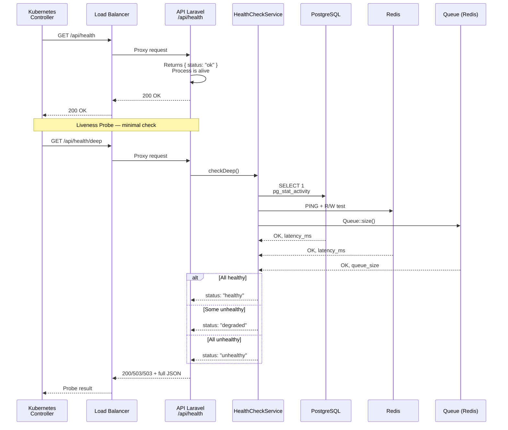
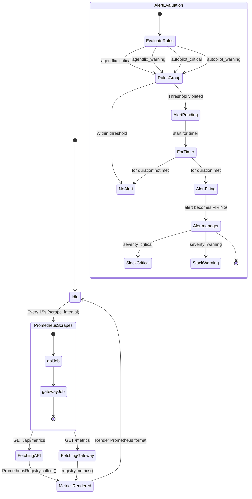
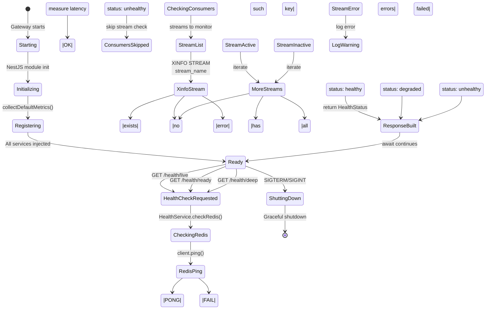
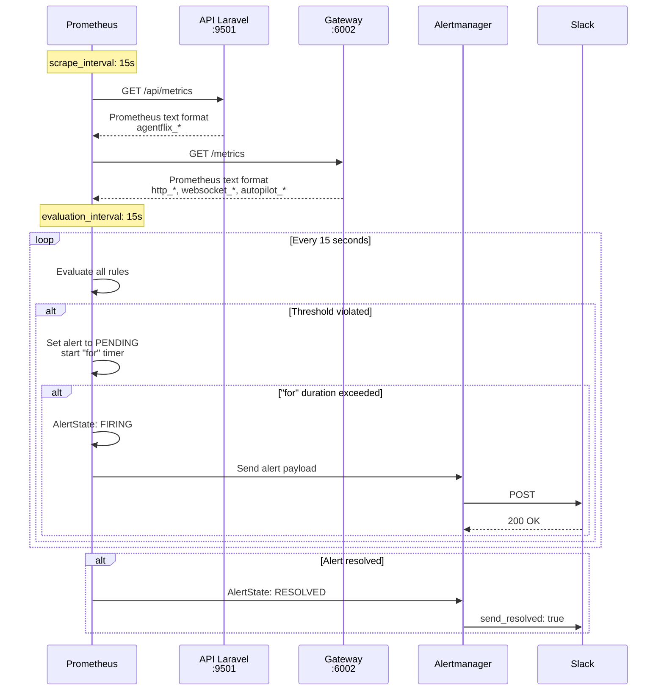

# PRD-MONITORING-001 — AgentFlix Monitoring / Observability Module

**Versao:** 1.0.0
**Data:** 2026-03-28
**Status:** Draft
**Autor:** Product Management
**Stack:** Laravel 12 (API) | NestJS 11 (Gateway) | Prometheus | Alertmanager

---

## 1. CONTEXTO

### 1.1 O que e Monitoring/Observability

Monitoring e Observability sao disciplineas complementares que permitem que equipes de engenharia entendam o comportamento interno de um sistema atraves de dados externos. Enquanto o Monitoring tradicional foca em metricas pre-definidas e alertas sobre valores conhecidos, a Observability busca responder perguntas sobre o sistema mesmo quando ainda nao foram anticipadas. No contexto do AgentFlix, ambas as abordagens sao necessarias para garantir disponibilidade, performance e confiabilidade em um sistema distribuido composto por tres camadas principais: a API Laravel (backend PHP), o Gateway NestJS, e os servicos externos integrados (Redis, PostgreSQL, filas de mensageria).

O modulo de Monitoring/Observability do AgentFlix e responsavel por:

- Expor endpoints de health check para probes de orquestracao (Kubernetes liveness, readiness)
- Fornecer metricas no formato Prometheus para scraping continuo
- Definir regras de alerting que disparam notificacoes via Slack quando thresholds sao violados
- Permitir que engenheiros diagnostiquem incidentes rapidamente atravess de dashboards e dados historicos
- Garantir que o sistema seja observavel em todas as suas camadas sem impactar performance

### 1.2 Estado Atual

O AgentFlix ja possui implementacoes parciais de monitoramento em ambas as camadas:

**API (Laravel) — `api/src/Domain/Shared/Services/`:**

O `MetricsService.php` implementa a coleta de metricas orientadas a aplicacao usando a biblioteca `promphp/prometheus_client`. Ele coleta metricas de cinco categorias principais:

- **Autopilot:** duracao de webhooks (`autopilot_webhook_duration_seconds`), blocos de guardrails (`autopilot_guardrail_blocks_total`), e razao de uso do budget (`autopilot_budget_usage_ratio`)
- **HTTP:** contador de requisicoes total (`http_requests_total`) e histograma de latencia (`http_request_duration_seconds`) com labels de method, path e status
- **Queue:** total de jobs (`queue_jobs_total`), jobs pendentes (`queue_jobs_pending`), e jobs falhados (`queue_jobs_failed_total`)
- **Database:** conexoes ativas (`database_connections_active`) via `pg_stat_activity`
- **Redis:** status de conexao (`redis_connected`) e memoria usada em bytes (`redis_memory_used_bytes`)
- **System:** memoria PHP em uso e pico (`php_memory_usage_bytes`, `php_memory_peak_bytes`)
- **Business:** tickets de chat por status, mensagens por direcao, e metricas de negociacoes CRM

O `HealthCheckService.php` implementa health checks profundos que verificam conectividade com Database, Redis e Queue. O status retornado e `healthy` quando todos os servicos respondem, `degraded` quando alguns falham, e `unhealthy` quando todos falham.

**Gateway (NestJS) — `gateway/src/health/` e `gateway/src/metrics/`:**

O `HealthService.ts` e `HealthController.ts` implementam um sistema de health check granular com quatro endpoints:

- `GET /health` — resposta simples `{ status: 'ok' }` para liveness probe
- `GET /health/deep` — verificacao completa de Redis (ping + read/write) e streams Redis ativos (`chat.inbound_message_received`, `chat.outbound_message`, `billing.payment_received`, `ai.run.request`, `ai.chat_request`, `ai.embedding_request`)
- `GET /health/ready` — readiness probe que retorna `{ ready: true }` quando o status consolidado e `healthy`
- `GET /health/live` — liveness probe que retorna `{ alive: true }` sempre que o processo esta ativo

O `MetricsService.ts` coleta metricas usando `prom-client` e expõe um endpoint `GET /metrics` que retorna o formato Prometheus. As metricas incluem contadores e histogramas para HTTP, WebSocket, Redis streams, chat events, webhook ACK latency, e um conjunto completo de metricas Autopilot (duracao de runs, chamadas de ferramentas, tokens, custo em dolares, decisoes de classifier, chunks de streaming, delegacoes, e cache hits).

**Infraestrutura de Observabilidade — `observability/`:**

O `prometheus.yml` configura scraping de metricas de dois jobs:

- `api` em `127.0.0.1:9501` no path `/api/metrics`
- `gateway` em `127.0.0.1:6002` no path `/metrics`

O `alert_rules.yml` define grupos de alertas organizados por severidade:

- `agentflix_critical`: `HighErrorRate` (erros HTTP 5xx > 1% por 5min), `ServiceDown` (up == 0 por 1min)
- `agentflix_warning`: `SlowResponses` (P95 > 0.5s por 5min), `HighLatencyP99` (P99 > 1s), `QueueBacklog` (jobs pendentes > 100 por 10min), `HighFailedJobs` (> 10 falhas em 1h), `DatabaseConnectionsHigh` (> 80 conexoes), `RedisDown`, `HighMemoryUsage`, `BackupMissing`
- `autopilot_critical`: `AutopilotHighCostRate` (projetado > $500/dia), `AutopilotBudgetExceeded`, `AutopilotHighGuardrailBlocks`
- `autopilot_warning`: `AutopilotSlowRuns`, `AutopilotBudgetWarning` (> 80%), `AutopilotHighToolFailureRate` (> 10%), `AutopilotLowCacheHitRate` (< 50%)

O `alertmanager.yml` configura roteamento de alertas para dois canais Slack:

- `#alerts-critical` para alertas com `severity: critical`, com repeat_interval de 1 hora
- `#alerts` para alertas com `severity: warning`, com repeat_interval de 4 horas

### 1.3 Lacunas Identificadas

Apesar da estrutura existente, o modulo de monitoring apresenta lacunas significativas que este PRD endereca:

**Lacunas de Health Check:**

1. **Ausencia de endpoint de health check no Laravel API:** Nao existe `GET /api/health` nem `GET /api/health/deep`. O `HealthCheckService` existe mas nao e exposto via controller HTTP, impossibilitando que load balancers e Kubernetes facam verificacoes de saude da API.
2. **Sem health check de filesystem:**备份 e storage local nao sao verificados.
3. **Sem health check de servicos externos:** Nao ha verificacao de conectividade com servicos de email (SMTP), provedores de IA (OpenAI, Anthropic), ou gateways de pagamento.
4. **Sem health check de tenants isolados:** Nao ha verificacao de que tenant isolation esta funcionando corretamente.
5. **Ausencia de deep check no Gateway:** O endpoint `/health/deep` verifica apenas Redis e streams, mas nao verifica Database, Queue connection, ou servicos externos.

**Lacunas de Metricas:**

1. **Metricas Autopilot incompletas no Laravel API:** Existem metricas de webhooks, guardrails e budget usage ratio, mas faltam metricas de runs, tokens, custo em dolares, classifier decisions, streaming chunks, delegacoes e cache hits que existem no Gateway.
2. **Metricas de Business Intelligence ausentes:** Nao ha metricas de conversao de vendas, pipeline CRM, ou uso por tenant que sejam relevantes para o negocio.
3. **Sem metricas de autenticação:** Nao ha metricas de login attempts, taxa de falha de autenticacao, ou uso de tokens Sanctum.
4. **Metricas de Billing ausentes:** Nao ha metricas de transacoes, faturas geradas, ou uso de creditos por tenant.
5. **Sem metricas de alerting interno:** Quantos alertas dispararam, tempo medio de resolucao, etc.

**Lacunas de Alerting:**

1. **Sem группировка de alertas por tenant:** Alertas criticos de um tenant podem mascarar alertas de outros tenants.
2. **Ausencia de alert de budget Autopilot por tenant:** O budget alerting atual e global, mas o sistema e multi-tenant.
3. **Ausencia de alerta de dependência:** Se o Redis cair, nao ha alerta que propagacao para downstream services.
4. **Sem alertas de SLO/SLA:** Nao ha verificacao automatica de que os SLAs prometidos estao sendo cumpridos.
5. **Falta de runbook links para todos os alertas:** Alguns alertas do `alert_rules.yml` nao tem `runbook_url` preenchido.

**Lacunas de Infraestrutura:**

1. **Sem high availability para Prometheus:** O Prometheus esta rodando em modo standalone, sem replicacao.
2. **Ausencia de long-term storage:** Metricas do Prometheus tem retencao limitada (tipicamente 15 dias).
3. **Sem alerting para o proprio monitoramento:** Se o Prometheus ou Alertmanager falharem, nao ha alerta.
4. **Falta de dashboard pre-configurado:** Nao ha Grafana dashboard documentado ou pre-configurado para o AgentFlix.

### 1.4 Por que Monitoring e Essencial

O AgentFlix e um sistema B2B SaaS multi-tenant que processa dados sensiveis de clientes. A disponibilidade e confiabilidade do sistema tem impacto direto na experiencia do usuario e na receita da empresa. Os motivos strategicos para investir em monitoring robusto incluem:

**Prevencao de incidentes:** Com alerting proativo, a equipe de engenharia pode ser notificada sobre degradacao de servico antes que usuarios finais sejam impactados. Por exemplo, um `QueueBacklog` crescente pode indicar que workers nao estao processando jobs corretamente, e Intervention precoce evita perda de dados.

**Diagnostico rapido de incidentes:** Quando um incidente ocorre, metricas e logs estruturados permitem que engenheiros identifiquem a causa raiz em minutos ao inves de horas. Health checks granulares indicam exatamente qual componente falhou.

**Planejamento de capacidade:** Metricas de uso (tokens consumidos, jobs na fila, conexoes de banco) permitem que a equipe planeje escalonamento de forma baseada em dados, evitando tanto sub-utilizacao quanto sobrecarga.

**Confianca operacional:** Equipes de suporte e sucesso do cliente podem usar dashboards de monitoring para responder perguntas como "qual e o status atual do sistema?" sem precisar escalar para engenharia.

**Conformidade e auditoria:** Em sistemas que processam dados de saúde ou financeiros, a capacidade de demonstrar que metricas de availability foram cumpridas e um requisito de conformidade.

---

## 2. OBJETIVO

### 2.1 Meta Geral

Estabelecer um sistema de Monitoring e Observability completo e confiavel para o AgentFlix, cobrindo todas as camadas da arquitetura (API Laravel, Gateway NestJS, serviços externos), com health checks precisos, metricas abrangentes, alertas acionáveis, e dashboards que permitam diagnostico rapido de incidentes.

### 2.2 Metas Especificas

**MC-001 — Health Checks Unificados:**
Implementar health checks que cubram todas as dependências de cada servico (Database, Redis, Queue, Filesystem, Servicos Externos) e sejam expostos via HTTP para uso por load balancers, Kubernetes probes, e sistemas de monitoramento externos.

**MC-002 — Metricas Completas:**
Expandir a coleta de metricas para incluir todas as areas funcionais do sistema (Auth, Billing, CRM, Chat, AI, Platform) com labels adequados para filtragem por tenant, ambiente, e versao.

**MC-003 — Alerting Acionavel:**
Implementar regras de alerting que minimizem falsos positivos, maximizem a razao sinal-ruido, e fornecam contexto suficiente (runbooks, contexto de tenant, metricas relacionadas) para que engenheiros possam responder rapidamente.

**MC-004 — Observabilidade Autopilot:**
Implementar um conjunto abrangente de metricas e alertas especificos para o modulo Autopilot, cobrindo custo, budget, performance, guardrails, e integracao de agentes.

**MC-005 — Infraestrutura de Monitoring Resiliente:**
Garantir que a infraestrutura de monitoring (Prometheus, Alertmanager) seja confiavel e nao seja um ponto unico de falha.

### 2.3 Metricas de Sucesso

O sucesso do modulo de Monitoring/Observability sera medido pelos seguintes indicadores:

| Indicador | Meta | Metodo de Medicao |
|-----------|------|-------------------|
| Tempo medio de deteccao de incidente (MTTD) | < 5 minutos | Tempo entre ocorrencia e primeiro alerta |
| Tempo medio de resolucao de incidente (MTTR) | < 30 minutos | Tempo entre primeiro alerta e resolucao |
| Cobertura de health checks | 100% das dependencias | Auditoria de endpoints /health |
| Taxa de falsos positivos de alertas | < 10% | Revisao mensal de alertas disparados |
| Disponibilidade de metricas | > 99.9% | Uptime do endpoint /api/metrics e /metrics |
| Latencia de health check | < 200ms (P95) | Histograma de latencia dos endpoints |

### 2.4 Escopo

**In Scope:**

- Endpoints de health check para API (Laravel) e Gateway (NestJS)
- Servicos de health check e metrics em ambas as camadas
- DTOs e models para representacao de dados de monitoring
- Configuracao de Prometheus scrape jobs (API porta 9501, Gateway porta 6002)
- Regras de alerting em `alert_rules.yml`
- Configuracao de Alertmanager com Slack receivers (#alerts-critical, #alerts)
- Eventos de dominio relacionados a monitoring (AlertFired, AlertResolved, HealthCheckFailed)
- DTOs paraHealthCheckResult, MetricSnapshot, e AlertPayload
- Interfaces TypeScript para HealthStatus, ServiceStatus, e MetricSeries

**Out of Scope:**

- Implementacao de Grafana dashboards (documentado em PRD separado)
- Implementacao de log aggregation centralizado (ELK/Loki)
- Implementacao de distributed tracing (OpenTelemetry/Jaeger)
- Alteracoes na infraestrutura de deployment (Kubernetes)
- Implementacao de SLO/SLA tracking automatico
- Backup e restore de metricas Prometheus

---

## 3. REGRAS DE NEGOCIO

### 3.1 Identificacao e Estrutura das Regras

Todas as regras de negocio deste modulo utilizam o prefixo `RN-MON-` seguido de um numero sequencial. As regras estao organizadas em categorias logicas: Health Checks, Metricas, Alertas, e Seguranca. Cada regra deve ser implementada e testada isoladamente.

### 3.2 Regras de Health Check

**RN-MON-001 — Health Check Basico da API**
O endpoint `GET /api/health` da API Laravel deve retornar um JSON com `status: 'ok'` quando o processo PHP esta ativo e respondendo. Este endpoint nao verifica dependencias externas. Tempo de resposta maximo: 100ms. Nao requer autenticacao. Rate limit: 60 req/min por IP.

**RN-MON-002 — Health Check Profundo da API**
O endpoint `GET /api/health/deep` da API Laravel deve verificar todas as dependencias: Database (PostgreSQL), Redis, Queue connection. O retorno deve incluir `status: 'healthy' | 'degraded' | 'unhealthy'`, `timestamp` ISO 8601, e `services` com o status individual de cada dependencia incluindo `latency_ms` quando saudavel. Status 'degraded' significa que pelo menos uma dependencia falhou mas as principais estao operacionais. Nao requer autenticacao. Rate limit: 30 req/min por IP.

**RN-MON-003 — Health Check de Database**
A verificacao de Database deve executar `SELECT 1` no PostgreSQL e medir latencia. Deve ser considerado saudavel se a latencia for inferior a 100ms. Deve retornar o numero de conexoes ativas via `pg_stat_activity`. Threshold de advertencia: > 50 conexoes. Threshold critico: > 80 conexoes.

**RN-MON-004 — Health Check de Redis**
A verificacao de Redis deve executar operacao de ping e verificacao de read/write (write de uma chave temporaria + read + delete). Deve ser considerado saudavel se latencia for inferior a 50ms. Threshold de advertencia: > 20ms. Threshold critico: > 50ms ou conexao perdida.

**RN-MON-005 — Health Check de Queue**
A verificacao de Queue deve confirmar que a conexao com o driver de queue esta funcional e retornar o tamanho atual da fila. Driver padrao: Redis. Deve ser considerado saudavel se queue_size < 100 jobs. Threshold de advertencia: >= 100 jobs. Threshold critico: >= 500 jobs ou conexao falhada.

**RN-MON-006 — Health Check de Filesystem**
O health check profundo deve incluir verificacao de espaco em disco no path de storage configurado. Deve retornar espaco disponivel em bytes. Threshold de advertencia: < 1GB livre. Threshold critico: < 100MB livre.

**RN-MON-007 — Health Check de Servicos Externos**
Opcionalmente, o health check profundo pode verificar conectividade com servicos externos críticos: SMTP (para email), provedores de IA (OpenAI, Anthropic). Estas verificacoes devem ser configuraveis via ambiente e executadas apenas se habilitadas. Timeout maximo: 5s por servico. Nao devem bloquear o retorno do health check se falharem (executar em paralelo com timeout).

**RN-MON-008 — Health Check Gateway — Liveness**
O endpoint `GET /health/live` do Gateway deve retornar `{ alive: true }` sempre que o processo Node.js estiver ativo. Verificacao interna minima ou inexistente. Nao requer autenticacao.

**RN-MON-009 — Health Check Gateway — Readiness**
O endpoint `GET /health/ready` do Gateway deve retornar `{ ready: true }` apenas quando Redis estiver saudavel. Se Redis falhar, deve retornar `{ ready: false }`.其他的 servicos podem estar degraded sem bloquear readiness.

**RN-MON-010 — Health Check Gateway — Deep**
O endpoint `GET /health/deep` do Gateway deve verificar Redis (connectividade + ping) e todos os streams Redis monitorados: `chat.inbound_message_received`, `chat.outbound_message`, `billing.payment_received`, `ai.run.request`, `ai.chat_request`, `ai.embedding_request`. Cada stream deve ser verificado individualmente. Streams ausentes (no such key) sao considerados `active: false`, mas nao causam `unhealthy` — apenas erros de conexao ou timeout causam `unhealthy`. Latencia maxima: 200ms por verificacao individual de stream.

**RN-MON-011 — Determinacao de Status Consolidade**
O status consolidado de um health check profundo deve seguir a logica: se todas as verificacoes retornam `healthy` → `healthy`; se todas retornam `unhealthy` → `unhealthy`; caso contrario → `degraded`. Esta logica se aplica tanto ao HealthCheckService da API quanto ao HealthService do Gateway.

### 3.3 Regras de Metricas

**RN-MON-012 — Formato de Metricas**
Todas as metricas expostas pela API e pelo Gateway devem seguir o formato Prometheus text exposition format (versao 0.0.4). O Content-Type deve ser `text/plain; version=0.0.4; charset=utf-8`.

**RN-MON-013 — Metricas HTTP da API**
A API deve expor as seguintes metricas HTTP:

- `http_requests_total` (Counter) com labels: `method`, `path`, `status`. Paths com UUIDs ou IDs numericos devem ser normalizados para `{id}`.
- `http_request_duration_seconds` (Histogram) com labels: `method`, `path`, `status` e buckets padrao: [0.05, 0.1, 0.25, 0.5, 1.0, 2.5, 5.0, 10.0].

**RN-MON-014 — Metricas de Queue da API**
A API deve expor:

- `agentflix_queue_jobs_total` (Gauge): total de jobs trackers (pending + failed)
- `agentflix_queue_jobs_pending` (Gauge): jobs pendentes
- `agentflix_queue_jobs_failed_total` (Gauge): jobs falhados

**RN-MON-015 — Metricas de Database da API**
A API deve expor:

- `agentflix_database_connections_active` (Gauge): conexoes PostgreSQL ativas via `pg_stat_activity`

**RN-MON-016 — Metricas de Redis da API**
A API deve expor:

- `agentflix_redis_connected` (Gauge): 1 se conectado, 0 se nao
- `agentflix_redis_memory_used_bytes` (Gauge): memoria usada pelo Redis em bytes

**RN-MON-017 — Metricas de System da API**
A API deve expor:

- `agentflix_php_memory_usage_bytes` (Gauge): memoria atual do processo PHP
- `agentflix_php_memory_peak_bytes` (Gauge): pico de memoria do processo PHP
- `agentflix_app_info` (Gauge) com labels `version` e `env`: valor fixo 1

**RN-MON-018 — Metricas de Business da API**
A API deve expor:

- `agentflix_chat_tickets_total` (Gauge) com label `status`: total de tickets por status
- `agentflix_chat_messages_total` (Gauge) com label `direction`: total de mensagens por direcao (inbound/outbound)
- `agentflix_crm_negotiations_value_total` (Gauge): valor total de negociacoes CRM
- `agentflix_crm_negotiations_total` (Gauge): quantidade de negociacoes CRM

**RN-MON-019 — Metricas de Autopilot da API**
A API deve expor:

- `autopilot_webhook_duration_seconds` (Histogram) com labels configuraveis e buckets [0.05, 0.1, 0.25, 0.5, 1.0, 2.5, 5.0, 10.0]
- `autopilot_guardrail_blocks_total` (Counter) com labels configuraveis
- `autopilot_budget_usage_ratio` (Gauge) com labels configuraveis: valor entre 0.0 e 1.0+

**RN-MON-020 — Metricas HTTP do Gateway**
O Gateway deve expor:

- `http_requests_total` (Counter) com labels: `method`, `path`, `status`
- `http_request_duration_seconds` (Histogram) com labels: `method`, `path` e buckets [0.01, 0.05, 0.1, 0.25, 0.5, 1, 2.5, 5, 10]

**RN-MON-021 — Metricas WebSocket do Gateway**
O Gateway deve expor:

- `websocket_connections_active` (Gauge): numero de conexoes WebSocket ativas
- `websocket_messages_total` (Counter) com labels: `event`, `direction` (in/out)

**RN-MON-022 — Metricas Redis Streams do Gateway**
O Gateway deve expor:

- `redis_stream_messages_total` (Counter) com labels: `stream`, `action` (read/write)

**RN-MON-023 — Metricas Chat do Gateway**
O Gateway deve expor:

- `gateway_chat_events_total` (Counter) com label: `event_type`

**RN-MON-024 — Metricas Webhook do Gateway**
O Gateway deve expor:

- `gateway_webhook_ack_latency_seconds` (Histogram) com labels: `provider`, `tenant`, `outcome` e buckets [0.005, 0.01, 0.025, 0.05, 0.1, 0.15, 0.25, 0.5, 1]
- `gateway_webhook_acks_total` (Counter) com labels: `provider`, `tenant`, `outcome`

**RN-MON-025 — Metricas Autopilot do Gateway**
O Gateway deve expor um conjunto completo de metricas Autopilot:

- `autopilot_run_duration_seconds` (Histogram) labels: `agent_id`, `model`, `status`, buckets [0.5, 1, 2, 5, 10, 20, 30, 60]
- `autopilot_tool_calls_total` (Counter) labels: `agent_id`, `tool_name`, `status`
- `autopilot_tokens_total` (Counter) labels: `agent_id`, `model`, `token_type`
- `autopilot_cost_dollars` (Counter) labels: `agent_id`, `model`
- `autopilot_classifier_decisions_total` (Counter) label: `decision`
- `autopilot_stream_chunks_total` (Counter) label: `agent_id`
- `autopilot_delegation_total` (Counter) labels: `source_agent_id`, `target_agent_id`, `status`
- `autopilot_cache_hits_total` (Counter) labels: `cache_type`, `hit`
- `autopilot_iterations_per_run` (Histogram) label: `agent_id`, buckets [0, 1, 2, 3, 5, 8, 10, 15, 20]
- `autopilot_early_exits_total` (Counter) labels: `agent_id`, `reason`
- `autopilot_truncated_responses_total` (Counter) label: `agent_id`
- `autopilot_run_tokens_per_run` (Histogram) labels: `agent_id`, `model`, buckets [100, 500, 1000, 2000, 3000, 5000, 8000, 12000, 20000]

**RN-MON-026 — Metricas de Default do Gateway**
O Gateway deve coletar metricas default do Node.js (heap, event loop lag, active handles) via `collectDefaultMetrics` na inicializacao do modulo.

**RN-MON-027 — Normalizacao de Paths**
Todos os paths em metricas HTTP devem ser normalizados: UUIDs v4 substituitos por `{id}` e IDs numericos tambem substituitos por `{id}`. Isso evita explosao cardinal dos label values.

**RN-MON-028 — Normalizacao de Labels**
Labels de metricas (tenant, provider, etc.) devem ser normalizados: lowercase, trimmed, e valores vazios substituitos por `unknown`.

### 3.4 Regras de Alerting

**RN-MON-029 — Alerta HighErrorRate**
Disparar quando a taxa de erros HTTP 5xx for superior a 1% em um periodo de 5 minutos. Avaliacao: `for: 5m`. Severidade: `critical`. Runbook: `docs/runbooks/high-error-rate.md`.

**RN-MON-030 — Alerta ServiceDown**
Disparar quando `up == 0` (Prometheus target down) por mais de 1 minuto. Avaliacao: `for: 1m`. Severidade: `critical`. Runbook: `docs/runbooks/service-down.md`.

**RN-MON-031 — Alerta SlowResponses**
Disparar quando o P95 de latencia HTTP exceder 500ms por mais de 5 minutos. Avaliacao: `for: 5m`. Severidade: `warning`. Runbook: `docs/runbooks/slow-responses.md`.

**RN-MON-032 — Alerta HighLatencyP99**
Disparar quando o P99 de latencia HTTP exceder 1 segundo por mais de 5 minutos. Avaliacao: `for: 5m`. Severidade: `warning`.

**RN-MON-033 — Alerta QueueBacklog**
Disparar quando `queue_jobs_pending > 100` por mais de 10 minutos. Avaliacao: `for: 10m`. Severidade: `warning`.

**RN-MON-034 — Alerta HighFailedJobs**
Disparar quando o numero de jobs falhados em 1 hora exceder 10. Avaliacao: `for: 5m`. Severidade: `warning`.

**RN-MON-035 — Alerta DatabaseConnectionsHigh**
Disparar quando `database_connections_active > 80` por mais de 5 minutos. Avaliacao: `for: 5m`. Severidade: `warning`.

**RN-MON-036 — Alerta RedisDown**
Disparar quando `redis_connected == 0` por mais de 1 minuto. Avaliacao: `for: 1m`. Severidade: `critical`.

**RN-MON-037 — Alerta HighMemoryUsage**
Disparar quando `php_memory_usage_bytes / php_memory_peak_bytes > 0.9` por mais de 5 minutos. Avaliacao: `for: 5m`. Severidade: `warning`.

**RN-MON-038 — Alerta BackupMissing**
Disparar quando `time() - backup_last_success_timestamp > 86400` (24 horas sem backup). Avaliacao: `for: 1h`. Severidade: `warning`. Runbook: `docs/runbooks/database-backup.md`.

**RN-MON-039 — Alerta AutopilotHighCostRate**
Disparar quando o custo projetado do Autopilot exceder $500/dia. Formula: `rate(autopilot_cost_dollars[1h]) * 24 > 500`. Avaliacao: `for: 15m`. Severidade: `critical`. Runbook: `docs/runbooks/autopilot-high-cost.md`.

**RN-MON-040 — Alerta AutopilotBudgetExceeded**
Disparar quando `autopilot_budget_usage_ratio > 1.0` por mais de 5 minutos. Avaliacao: `for: 5m`. Severidade: `critical`. Runbook: `docs/runbooks/autopilot-budget.md`.

**RN-MON-041 — Alerta AutopilotHighGuardrailBlocks**
Disparar quando a taxa de blocos de guardrail exceder 0.5 por segundo. Formula: `rate(autopilot_guardrail_blocks_total[5m]) > 0.5`. Avaliacao: `for: 10m`. Severidade: `critical`. Runbook: `docs/runbooks/autopilot-guardrail.md`.

**RN-MON-042 — Alerta AutopilotSlowRuns**
Disparar quando P95 de duracao de runs do Autopilot exceder 10 segundos. Avaliacao: `for: 10m`. Severidade: `warning`. Runbook: `docs/runbooks/autopilot-slow.md`.

**RN-MON-043 — Alerta AutopilotBudgetWarning**
Disparar quando `autopilot_budget_usage_ratio > 0.8` por mais de 5 minutos. Avaliacao: `for: 5m`. Severidade: `warning`. Runbook: `docs/runbooks/autopilot-budget.md`.

**RN-MON-044 — Alerta AutopilotHighToolFailureRate**
Disparar quando a taxa de falhas de ferramentas exceder 10%. Formula: `rate(autopilot_tool_calls_total{status="error"}[5m]) / rate(autopilot_tool_calls_total[5m]) > 0.1`. Avaliacao: `for: 10m`. Severidade: `warning`. Runbook: `docs/runbooks/autopilot-tools.md`.

**RN-MON-045 — Alerta AutopilotLowCacheHitRate**
Disparar quando a taxa de cache hits for menor que 50%. Formula: `rate(autopilot_cache_hits_total{hit="true"}[5m]) / rate(autopilot_cache_hits_total[5m]) < 0.5`. Avaliacao: `for: 15m`. Severidade: `warning`. Runbook: `docs/runbooks/autopilot-cache.md`.

### 3.5 Regras de Seguranca

**RN-MON-046 — Autenticacao em Endpoints de Metricas**
Os endpoints de metricas (`GET /api/metrics` e `GET /metrics`) devem ser acessiveis sem autenticacao quando o ambiente for `local` ou `staging`. Em ambiente `production`, deve ser necessario Bearer token de service-to-service authentication. O token deve ser configurado via variavel de ambiente `METRICS_TOKEN`.

**RN-MON-047 — Autenticacao em Endpoints de Health Check**
Os endpoints basicos de health check (`GET /api/health`, `GET /health/live`, `GET /health`) devem ser publicos (sem autenticacao) para permitir que load balancers e orchestrators os acessem. Endpoints profundos (`/api/health/deep`, `/health/deep`, `/health/ready`) devem exigir autenticacao Bearer token de service-to-service em production.

**RN-MON-048 — Rate Limiting em Endpoints de Monitoring**
Endpoints de health check e metricas devem ter rate limiting especifico:

- `GET /api/health`: 60 req/min por IP
- `GET /api/health/deep`: 30 req/min por IP
- `GET /api/metrics`: 30 req/min por IP
- `GET /health`, `/health/live`: 120 req/min por IP
- `GET /health/deep`, `/health/ready`: 30 req/min por IP
- `GET /metrics`: 30 req/min por IP

**RN-MON-049 — Validacao de Webhook de Alertmanager**
Se o Alertmanager for configurado para enviar webhooks para o AgentFlix (em vez de apenas Slack), o AgentFlix deve validar a assinatura do webhook usando um segredo compartilhado configurado via `ALERTMANAGER_WEBHOOK_SECRET`.

**RN-MON-050 — Logging de metricas**
Nao deve ser permitido fazer logging de valores de metricas que contenham dados sensiveis (tokens, passwords, chaves de API). Labels de metricas devem ser normalizados e validados antes da exposicao. Esta regra e verificada estaticamente via PHPStan e ESLint.

---

## 4. FLUXOS

### 4.1 Health Check Flow — Sequence Diagram



### 4.2 Metric Collection Flow — State Diagram



### 4.3 Alert Firing Flow — Flowchart

```mermaid
flowchart TB
    A([Prometheus scrape<br/>every 15s]) --> B{Evaluate<br/>alert_rules.yml}
    B --> C{HighErrorRate<br/>5xx > 1% for 5m?}
    B --> D{ServiceDown<br/>up == 0 for 1m?}
    B --> E{SlowResponses<br/>P95 > 0.5s for 5m?}
    B --> F{QueueBacklog<br/>> 100 for 10m?}
    B --> G{AutopilotBudget<br/>> 100% for 5m?}

    C --> |No| Z[No alert]
    D --> |No| Z
    E --> |No| Z
    F --> |No| Z
    G --> |No| Z

    C --> |Yes| H[AlertState: PENDING]
    D --> |Yes| H
    E --> |Yes| H
    F --> |Yes| H
    G --> |Yes| H

    H --> I{"for" timer<br/>duration met?}
    I --> |No| Z
    I --> |Yes| J[AlertState: FIRING]

    J --> K{HttpResponse<br/>code?}
    J --> L{Webhook<br/>payload?}
    J --> M{Slack<br/>notification?}

    K --> |200| N[/alertmanager/webhook<br/>POST /alerts]
    L --> |200| O[Alert persisted<br/>in history]
    M --> |#alerts-critical| P["Slack #alerts-critical<br/>🚨 AlertName<br/>Description<br/>Runbook URL"]
    M --> |#alerts| Q["Slack #alerts<br/>⚠️ AlertName<br/>Description"]

    N --> R[Alertmanager<br/>processes alert]
    O --> S[/api/alerts<br/>Mark as acknowledged]
    P --> T([Engineer<br/>responds])
    Q --> T
    S --> T

    T --> U{Resolved?}
    U --> |Yes| V[AlertState: RESOLVED<br/>Slack: send_resolved]
    U --> |No| W[Investigate<br/>escalate]
    V --> Z
    W --> T
```

### 4.4 Gateway Health Check Lifecycle — State Diagram



### 4.5 Prometheus Scrape and Alert Flow — Sequence Diagram



---

## 5. ENTIDADES E MODELOS

### 5.1 HealthCheckService — API Laravel

**Localizacao:** `api/src/Domain/Shared/Services/HealthCheckService.php`
**Classe:** `final class HealthCheckService`
**Responsabilidade:** Executar verificacoes de saude profundas em todas as dependencias do sistema

**Metodo `check(): array`:**
Executa verificacoes em `database`, `redis`, e `queue` em paralelo (via sequencial simples, nao Promise). Determina status consolidado. Retorna array com:

```php
[
    'status' => 'healthy' | 'degraded' | 'unhealthy',
    'timestamp' => '2026-03-28T12:00:00.000Z', // ISO 8601
    'services' => [
        'database' => ['status' => 'healthy', 'latency_ms' => 12.34],
        'redis'    => ['status' => 'healthy', 'latency_ms' => 3.21],
        'queue'    => ['status' => 'healthy', 'latency_ms' => 5.67, 'queue_size' => 42, 'connection' => 'redis'],
    ]
]
```

**Metodo `checkDatabase(): array`:**
1. Marca tempo inicial com `microtime(true)`
2. Executa `DB::connection()->getPdo()` e `DB::select('SELECT 1')`
3. Calcula latencia em milissegundos
4. Retorna `['status' => 'healthy', 'latency_ms' => float]` ou `['status' => 'unhealthy', 'message' => string]`

**Metodo `checkRedis(): array`:**
1. Marca tempo inicial
2. Escreve chave temporaria `health_check_{uniqid()}` com valor `'ok'`
3. Le a chave de volta
4. Deleta a chave
5. Verifica se o valor lido e `'ok'`
6. Retorna status com latencia ou mensagem de erro

**Metodo `checkQueue(): array`:**
1. Marca tempo inicial
2. Executa `Queue::size()` para obter tamanho da fila
3. Obtem `queue.default` de config
4. Retorna status com `queue_size` e `connection`

### 5.2 MetricsService — API Laravel

**Localizacao:** `api/src/Domain/Shared/Services/MetricsService.php`
**Classe:** `final class MetricsService`
**Responsabilidade:** Coletar e renderizar metricas no formato Prometheus

**Metodo `collect(): string`:**
1. Cria um `CollectorRegistry` transient com `InMemory` storage
2. Chama `ensureHttpBaseline()` para garantir que metricas base existam
3. Executa `recordAppInfo()`, `recordQueueMetrics()`, `recordDatabaseMetrics()`, `recordRedisMetrics()`, `recordSystemMetrics()`, `recordBusinessMetrics()`
4. Faz merge das metricas do registry persistente com o snapshot
5. Renderiza usando `RenderTextFormat` e retorna string

**Metodo `incrementCounter(string $name, int $value, array $labels): void`:**
Incrementa um contador dinamico com labels fornecidos. Cria o contador no registry se nao existir.

**Metodo `setGauge(string $name, float $value, array $labels): void`:**
Define valor de um gauge dinamico com labels.

**Metodo `observeHistogram(string $name, float $value, array $labels): void`:**
Observa um valor em um histograma dinamico.

**Metodo `recordAutopilotWebhookDuration(float $durationSeconds, array $labels): void`:**
Registra duracao de processamento de webhook Autopilot. Histograma `autopilot_webhook_duration_seconds` com buckets [0.05, 0.1, 0.25, 0.5, 1.0, 2.5, 5.0, 10.0].

**Metodo `recordAutopilotGuardrailBlock(array $labels): void`:**
Incrementa contador `autopilot_guardrail_blocks_total` quando um guardrail bloqueia uma acao.

**Metodo `setAutopilotBudgetUsageRatio(float $ratio, array $labels): void`:**
Define o gauge `autopilot_budget_usage_ratio` com a razao de uso do budget (0.0 a 1.0+).

**Metodo `recordQueueMetrics(CollectorRegistry $registry): void`:**
Coleta metricas de queue via `getQueueMetrics()` e registra gauges: `agentflix_queue_jobs_total`, `agentflix_queue_jobs_pending`, `agentflix_queue_jobs_failed_total`.

**Metodo `recordDatabaseMetrics(CollectorRegistry $registry): void`:**
Coleta metricas de database via `getDatabaseMetrics()` e registra gauge `agentflix_database_connections_active`.

**Metodo `recordRedisMetrics(CollectorRegistry $registry): void`:**
Coleta metricas de Redis via `getRedisMetrics()` e registra gauges: `agentflix_redis_connected`, `agentflix_redis_memory_used_bytes`.

**Metodo `recordSystemMetrics(CollectorRegistry $registry): void`:**
Registra `agentflix_php_memory_usage_bytes` e `agentflix_php_memory_peak_bytes` usando `memory_get_usage(true)` e `memory_get_peak_usage(true)`.

**Metodo `recordBusinessMetrics(CollectorRegistry $registry): void`:**
Coleta metricas de negocio via `getBusinessMetrics()`:
- `agentflix_chat_tickets_total` com label `status` por grupo
- `agentflix_chat_messages_total` com label `direction` por grupo
- `agentflix_crm_negotiations_value_total`
- `agentflix_crm_negotiations_total`

**Metodo `getQueueMetrics(): array`:**
Executa `Queue::size()` e `DB::table('failed_jobs')->count()`. Em caso de erro, retorna zeros.

**Metodo `getDatabaseMetrics(): array`:**
Executa query `SELECT count(*) as count FROM pg_stat_activity WHERE datname = current_database()`. Em caso de erro, retorna zero.

**Metodo `getRedisMetrics(): array`:**
Acessa `Cache::store('redis')`, obtem conexao Redis, executa `info()` para obter `used_memory`. Em caso de erro, retorna `connected: 0`.

**Metodo `getBusinessMetrics(): array`:**
Executa queries agregadas em `chat_tickets`, `chat_messages`, e `crm_negotiations`. Mapeia resultados para arrays indexados por status/direction. Em caso de erro, retorna arrays vazios.

### 5.3 HealthService — Gateway NestJS

**Localizacao:** `gateway/src/health/health.service.ts`
**Classe:** `HealthService`
**Responsabilidade:** Verificacao granular de Redis e streams Redis

**Metodo `checkAll(): Promise<HealthStatus>`:**
Executa `checkRedis()` e `checkConsumers()` em paralelo via `Promise.all`. Determina status consolidado. Retorna `HealthStatus`.

**Metodo `checkRedis(): Promise<ServiceStatus>`:**
1. Obtem cliente Redis via `redisService.getClient()`
2. Executa `client.ping()`
3. Se resposta !== 'PONG', retorna `unhealthy`
4. Calcula latencia em milissegundos
5. Retorna `status: 'healthy', latency_ms: number`

**Metodo `checkConsumers(): Promise<ServiceStatus>`:**
1. Lista de streams monitorados: `chat.inbound_message_received`, `chat.outbound_message`, `billing.payment_received`, `ai.run.request`, `ai.chat_request`, `ai.embedding_request`
2. Executa `XINFO STREAM` para cada stream em paralelo
3. Classifica cada stream como `active` (existe) ou `active: false`
4. Erros de conexao sao reportados como `error`
5. Se todos os erros sao "no such key", status e `healthy`
6. Se ha erros de conexao, status e `unhealthy`
7. Retorna `details` com `monitored_streams`, `active_streams`, `stream_errors`

**Metodo `checkStreamExists(stream: string): Promise`:**
Executa `client.xinfo('STREAM', stream)`. Trata erro "no such key" como `active: false` (stream nao existe ainda, mas nao e erro). Outros erros sao reportados como `error`.

### 5.4 MetricsService — Gateway NestJS

**Localizacao:** `gateway/src/metrics/metrics.service.ts`
**Classe:** `MetricsService implements OnModuleInit`
**Responsabilidade:** Coleta centralizada de metricas Prometheus para o Gateway

**Propriedades (Prometheus Metrics):**

| Metric | Type | Labels | Description |
|--------|------|--------|-------------|
| `http_requests_total` | Counter | method, path, status | Total HTTP requests |
| `http_request_duration_seconds` | Histogram | method, path | HTTP latency |
| `websocket_connections_active` | Gauge | — | Active WS connections |
| `websocket_messages_total` | Counter | event, direction | WS messages |
| `redis_stream_messages_total` | Counter | stream, action | Redis stream operations |
| `gateway_chat_events_total` | Counter | event_type | Chat events processed |
| `gateway_webhook_ack_latency_seconds` | Histogram | provider, tenant, outcome | Webhook ACK latency |
| `gateway_webhook_acks_total` | Counter | provider, tenant, outcome | Webhook ACKs |
| `autopilot_run_duration_seconds` | Histogram | agent_id, model, status | Autopilot run duration |
| `autopilot_tool_calls_total` | Counter | agent_id, tool_name, status | Tool call counts |
| `autopilot_tokens_total` | Counter | agent_id, model, token_type | Token usage |
| `autopilot_cost_dollars` | Counter | agent_id, model | Cost tracking |
| `autopilot_classifier_decisions_total` | Counter | decision | Classifier routing |
| `autopilot_stream_chunks_total` | Counter | agent_id | Streaming chunks |
| `autopilot_delegation_total` | Counter | source_agent_id, target_agent_id, status | Agent delegations |
| `autopilot_cache_hits_total` | Counter | cache_type, hit | Cache hits/misses |
| `autopilot_iterations_per_run` | Histogram | agent_id | Loop iterations |
| `autopilot_early_exits_total` | Counter | agent_id, reason | Early exits |
| `autopilot_truncated_responses_total` | Counter | agent_id | Truncated responses |
| `autopilot_run_tokens_per_run` | Histogram | agent_id, model | Tokens per run |

**Metodo `onModuleInit(): void`:**
Chama `collectDefaultMetrics({ register: this.registry })` para coletar metricas default do Node.js/V8.

**Metodo `getMetrics(): Promise<string>`:**
Retorna `this.registry.metrics()` — serializa todas as metricas no formato Prometheus.

**Metodo `normalizePath(path: string): string`:**
Substitui UUIDs v4 (`[0-9a-f]{8}-[0-9a-f]{4}-[0-9a-f]{4}-[0-9a-f]{4}-[0-9a-f]{12}`) e IDs numericos (`/\d+`) por `{id}`.

**Metodo `normalizeMetricLabel(value: string): string`:**
Aplica lowercase, trim, e retorna `unknown` se vazio.

### 5.5 Prometheus Configuration

**Localizacao:** `observability/prometheus/prometheus.yml`

**Global Configuration:**

```yaml
global:
    scrape_interval: 15s
    evaluation_interval: 15s

alerting:
    alertmanagers:
        - static_configs:
              - targets:
                    - alertmanager:9093

rule_files:
    - /etc/prometheus/alert_rules.yml
```

**Scrape Jobs:**

```yaml
scrape_configs:
    - job_name: 'prometheus'
      static_configs:
          - targets: ['localhost:9090']

    - job_name: 'api'
      metrics_path: '/api/metrics'
      static_configs:
          - targets: ['127.0.0.1:9501']
      relabel_configs:
          - source_labels: [__address__]
            target_label: instance
            replacement: 'agentflix-api'

    - job_name: 'gateway'
      metrics_path: '/metrics'
      static_configs:
          - targets: ['127.0.0.1:6002']
      relabel_configs:
          - source_labels: [__address__]
            target_label: instance
            replacement: 'agentflix-gateway'
```

**Notas sobre scrape configuration:**

- A API Laravel roda na porta 9501 (configuravel via `SERVER_PORT` ou `.env`)
- O Gateway NestJS roda na porta 6002 (configuravel via `PORT` no bootstrap)
- O relabel config substitui o IP:port por um nome legivel em `instance`
- O Prometheus esta configurado para escutar Alertmanager em `alertmanager:9093` (Docker network hostname)

### 5.6 Alert Rules — Prometheus

**Localizacao:** `observability/prometheus/alert_rules.yml`

**Grupos de Alertas:**

1. **agentflix_critical** (avaliacao: 15s)
   - `HighErrorRate`: Erros HTTP 5xx > 1% por 5min
   - `ServiceDown`: Target down por 1min

2. **agentflix_warning** (avaliacao: 15s)
   - `SlowResponses`: P95 > 0.5s por 5min
   - `HighLatencyP99`: P99 > 1s por 5min
   - `QueueBacklog`: Jobs pending > 100 por 10min
   - `HighFailedJobs`: Falhas > 10 em 1h por 5min
   - `DatabaseConnectionsHigh`: Conexoes > 80 por 5min
   - `RedisDown`: Redis desconectado por 1min
   - `HighMemoryUsage`: Memoria > 90% do pico por 5min
   - `BackupMissing`: Backup ausente por 24h por 1h

3. **autopilot_critical** (avaliacao: 15s)
   - `AutopilotHighCostRate`: Custo projetado > $500/dia por 15min
   - `AutopilotBudgetExceeded`: Budget > 100% por 5min
   - `AutopilotHighGuardrailBlocks`: Taxa > 0.5/s por 10min

4. **autopilot_warning** (avaliacao: 15s)
   - `AutopilotSlowRuns`: P95 > 10s por 10min
   - `AutopilotBudgetWarning`: Budget > 80% por 5min
   - `AutopilotHighToolFailureRate`: Falhas > 10% por 10min
   - `AutopilotLowCacheHitRate`: Cache hits < 50% por 15min

### 5.7 Alertmanager Configuration

**Localizacao:** `observability/alertmanager/alertmanager.yml`

**Route Configuration:**

```yaml
route:
    group_by: ['alertname', 'severity']
    group_wait: 30s          # Aguarda 30s para agrupar alertas
    group_interval: 5m       # Intervalo entre re-envios de grupo
    repeat_interval: 4h      # Repete alerta se ainda firing
    receiver: 'slack-notifications'
    routes:
        - match:
              severity: critical
          receiver: 'slack-critical'
          repeat_interval: 1h  # Críticos repetem mais frequentemente
        - match:
              severity: warning
          receiver: 'slack-notifications'
          repeat_interval: 4h
```

**Receivers:**

| Receiver | Channel | send_resolved | Titulo |
|----------|---------|---------------|--------|
| `slack-critical` | #alerts-critical | true | 🚨 {alertname} |
| `slack-notifications` | #alerts | true | ⚠️ {alertname} |

**Inhibit Rules:**

Alertas `critical` inibem alertas `warning` com o mesmo `alertname`. Isso previne que alertas de warning sejam disparados quando ja existe um alerta critico ativo para o mesmo problema.

---

## 6. ENDPOINTS

### 6.1 Tabela de Endpoints de Monitoring

| Metodo | Path | Servico | Descricao | Autenticacao | Rate Limit |
|--------|------|---------|-----------|--------------|------------|
| GET | `/api/health` | API (Laravel) | Health check basico (liveness) | Nenhuma | 60 req/min/IP |
| GET | `/api/health/deep` | API (Laravel) | Health check profundo (readiness) | Bearer Token (prod) | 30 req/min/IP |
| GET | `/api/metrics` | API (Laravel) | Metricas Prometheus | Bearer Token (prod) | 30 req/min/IP |
| GET | `/health` | Gateway (NestJS) | Health check basico | Nenhuma | 120 req/min/IP |
| GET | `/health/deep` | Gateway (NestJS) | Health check profundo | Bearer Token (prod) | 30 req/min/IP |
| GET | `/health/ready` | Gateway (NestJS) | Readiness probe K8s | Nenhuma | 30 req/min/IP |
| GET | `/health/live` | Gateway (NestJS) | Liveness probe K8s | Nenhuma | 120 req/min/IP |
| GET | `/metrics` | Gateway (NestJS) | Metricas Prometheus | Bearer Token (prod) | 30 req/min/IP |
| POST | `/api/alerts` | API (Laravel) | Webhook para alertas do Alertmanager | HMAC Signature | 100 req/min |

### 6.2 GET /api/health — API Laravel Liveness

**Proposito:** Verificar se o processo PHP esta ativo e respondendo. Utilizado por load balancers e Kubernetes liveness probe.

**Request:** Nenhum body.

**Response 200 OK:**
```json
{
  "status": "ok",
  "timestamp": "2026-03-28T12:00:00.000Z"
}
```

**Response 503 Service Unavailable (processo em shutdown):**
```json
{
  "status": "shutting_down",
  "timestamp": "2026-03-28T12:00:00.000Z"
}
```

### 6.3 GET /api/health/deep — API Laravel Deep Health

**Proposito:** Verificar saude de todas as dependencias. Utilizado para readiness probe e monitoramento detalhado.

**Request:** Nenhum body. Header `Authorization: Bearer {token}` necessario em production.

**Response 200 OK (healthy):**
```json
{
  "status": "healthy",
  "timestamp": "2026-03-28T12:00:00.000Z",
  "services": {
    "database": {
      "status": "healthy",
      "latency_ms": 12.34,
      "connections": 15
    },
    "redis": {
      "status": "healthy",
      "latency_ms": 3.21
    },
    "queue": {
      "status": "healthy",
      "latency_ms": 5.67,
      "queue_size": 42,
      "connection": "redis"
    },
    "filesystem": {
      "status": "healthy",
      "free_bytes": 53687091200,
      "threshold_warning_bytes": 1073741824,
      "threshold_critical_bytes": 104857600
    }
  }
}
```

**Response 503 Service Unavailable (unhealthy/degraded):**
```json
{
  "status": "degraded",
  "timestamp": "2026-03-28T12:00:00.000Z",
  "services": {
    "database": {
      "status": "healthy",
      "latency_ms": 12.34,
      "connections": 15
    },
    "redis": {
      "status": "unhealthy",
      "message": "Connection refused"
    },
    "queue": {
      "status": "healthy",
      "latency_ms": 5.67,
      "queue_size": 42,
      "connection": "redis"
    },
    "filesystem": {
      "status": "healthy",
      "free_bytes": 53687091200,
      "threshold_warning_bytes": 1073741824,
      "threshold_critical_bytes": 104857600
    }
  }
}
```

### 6.4 GET /api/metrics — API Laravel Prometheus Metrics

**Proposito:** Expor metricas no formato Prometheus para scraping pelo Prometheus.

**Request:** Nenhum body. Header `Authorization: Bearer {token}` necessario em production.

**Response 200 OK (text/plain):**
```
# HELP agentflix_app_info Application information
# TYPE agentflix_app_info gauge
agentflix_app_info{version="1.0.0",env="production"} 1
# HELP agentflix_queue_jobs_total Total queue jobs tracked
# TYPE agentflix_queue_jobs_total gauge
agentflix_queue_jobs_total 142
# HELP agentflix_queue_jobs_pending Pending jobs in queue
# TYPE agentflix_queue_jobs_pending gauge
agentflix_queue_jobs_pending 140
# HELP agentflix_queue_jobs_failed_total Failed queue jobs
# TYPE agentflix_queue_jobs_failed_total gauge
agentflix_queue_jobs_failed_total 2
# HELP agentflix_database_connections_active Active database connections
# TYPE agentflix_database_connections_active gauge
agentflix_database_connections_active 15
# HELP agentflix_redis_connected Redis connection status
# TYPE agentflix_redis_connected gauge
agentflix_redis_connected 1
# HELP agentflix_redis_memory_used_bytes Redis memory usage in bytes
# TYPE agentflix_redis_memory_used_bytes gauge
agentflix_redis_memory_used_bytes 1048576
# HELP agentflix_php_memory_usage_bytes PHP memory usage in bytes
# TYPE agentflix_php_memory_usage_bytes gauge
agentflix_php_memory_usage_bytes 20971520
# HELP agentflix_php_memory_peak_bytes PHP peak memory usage in bytes
# TYPE agentflix_php_memory_peak_bytes gauge
agentflix_php_memory_peak_bytes 41943040
# HELP http_requests_total Total HTTP requests
# TYPE http_requests_total counter
http_requests_total{method="GET",path="/api/health",status="200"} 1523
# HELP http_request_duration_seconds HTTP request latency in seconds
# TYPE http_request_duration_seconds histogram
http_request_duration_seconds_bucket{method="GET",path="/api/health",status="200",le="0.05"} 1200
http_request_duration_seconds_bucket{method="GET",path="/api/health",status="200",le="0.1"} 1490
http_request_duration_seconds_bucket{method="GET",path="/api/health",status="200",le="0.25"} 1520
http_request_duration_seconds_bucket{method="GET",path="/api/health",status="200",le="0.5"} 1522
http_request_duration_seconds_bucket{method="GET",path="/api/health",status="200",le="1.0"} 1523
http_request_duration_seconds_bucket{method="GET",path="/api/health",status="200",le="2.5"} 1523
http_request_duration_seconds_bucket{method="GET",path="/api/health",status="200",le="5.0"} 1523
http_request_duration_seconds_bucket{method="GET",path="/api/health",status="200",le="10.0"} 1523
http_request_duration_seconds_bucket{method="GET",path="/api/health",status="200",le="+Inf"} 1523
http_request_duration_seconds_sum{method="GET",path="/api/health",status="200"} 45.67
http_request_duration_seconds_count{method="GET",path="/api/health",status="200"} 1523
# HELP autopilot_webhook_duration_seconds Autopilot webhook processing duration in seconds
# TYPE autopilot_webhook_duration_seconds histogram
autopilot_webhook_duration_seconds_bucket{le="0.05"} 10
autopilot_webhook_duration_seconds_bucket{le="0.1"} 45
autopilot_webhook_duration_seconds_bucket{le="0.25"} 120
autopilot_webhook_duration_seconds_bucket{le="0.5"} 200
autopilot_webhook_duration_seconds_bucket{le="1.0"} 230
autopilot_webhook_duration_seconds_bucket{le="2.5"} 240
autopilot_webhook_duration_seconds_bucket{le="5.0"} 245
autopilot_webhook_duration_seconds_bucket{le="10.0"} 247
autopilot_webhook_duration_seconds_bucket{le="+Inf"} 250
autopilot_webhook_duration_seconds_sum 87.34
autopilot_webhook_duration_seconds_count 250
# HELP autopilot_guardrail_blocks_total Total guardrail blocks
# TYPE autopilot_guardrail_blocks_total counter
autopilot_guardrail_blocks_total{} 12
# HELP autopilot_budget_usage_ratio Autopilot budget usage ratio (0.0-1.0)
# TYPE autopilot_budget_usage_ratio gauge
autopilot_budget_usage_ratio{} 0.72
```

### 6.5 GET /health — Gateway NestJS Basic Health

**Proposito:** Health check basico para liveness probe do Kubernetes.

**Response 200 OK:**
```json
{
  "status": "ok"
}
```

### 6.6 GET /health/live — Gateway NestJS Liveness

**Proposito:** Liveness probe separada para Kubernetes. Sempre retorna `alive: true` enquanto o processo estiver ativo.

**Response 200 OK:**
```json
{
  "alive": true
}
```

### 6.7 GET /health/ready — Gateway NestJS Readiness

**Proposito:** Readiness probe que verifica se o Gateway pode receber tráfego. Retorna `ready: true` apenas quando todas as dependencias principais estao saudaveis.

**Response 200 OK:**
```json
{
  "ready": true
}
```

**Response 503 Service Unavailable:**
```json
{
  "ready": false
}
```

### 6.8 GET /health/deep — Gateway NestJS Deep Health

**Proposito:** Health check completo com verificacao de Redis e streams.

**Response 200 OK (healthy):**
```json
{
  "status": "healthy",
  "timestamp": "2026-03-28T12:00:00.000Z",
  "services": {
    "redis": {
      "status": "healthy",
      "latency_ms": 2
    },
    "consumers": {
      "status": "healthy",
      "latency_ms": 45,
      "details": {
        "monitored_streams": [
          "chat.inbound_message_received",
          "chat.outbound_message",
          "billing.payment_received",
          "ai.run.request",
          "ai.chat_request",
          "ai.embedding_request"
        ],
        "active_streams": [
          "chat.inbound_message_received",
          "chat.outbound_message",
          "ai.chat_request"
        ],
        "stream_errors": []
      }
    }
  }
}
```

**Response 503 Service Unavailable (unhealthy):**
```json
{
  "status": "unhealthy",
  "timestamp": "2026-03-28T12:00:00.000Z",
  "services": {
    "redis": {
      "status": "unhealthy",
      "message": "Connection refused"
    },
    "consumers": {
      "status": "healthy",
      "latency_ms": 45,
      "details": {
        "monitored_streams": [
          "chat.inbound_message_received",
          "chat.outbound_message",
          "billing.payment_received",
          "ai.run.request",
          "ai.chat_request",
          "ai.embedding_request"
        ],
        "active_streams": [],
        "stream_errors": []
      }
    }
  }
}
```

### 6.9 GET /metrics — Gateway NestJS Prometheus Metrics

**Proposito:** Expor metricas Prometheus do Gateway para scraping.

**Response 200 OK (text/plain):**
```
# HELP http_requests_total Total HTTP requests
# TYPE http_requests_total counter
http_requests_total{method="POST",path="/v1/chat",status="200"} 5423
http_requests_total{method="POST",path="/v1/chat",status="500"} 12
# HELP http_request_duration_seconds HTTP request duration in seconds
# TYPE http_request_duration_seconds histogram
http_request_duration_seconds_bucket{method="POST",path="/v1/chat",le="0.01"} 3200
http_request_duration_seconds_bucket{method="POST",path="/v1/chat",le="0.05"} 4800
http_request_duration_seconds_bucket{method="POST",path="/v1/chat",le="0.1"} 5300
http_request_duration_seconds_bucket{method="POST",path="/v1/chat",le="0.25"} 5400
http_request_duration_seconds_bucket{method="POST",path="/v1/chat",le="0.5"} 5415
http_request_duration_seconds_bucket{method="POST",path="/v1/chat",le="1"} 5420
http_request_duration_seconds_bucket{method="POST",path="/v1/chat",le="2.5"} 5422
http_request_duration_seconds_bucket{method="POST",path="/v1/chat",le="5"} 5423
http_request_duration_seconds_bucket{method="POST",path="/v1/chat",le="+Inf"} 5423
http_request_duration_seconds_sum{method="POST",path="/v1/chat"} 234.56
http_request_duration_seconds_count{method="POST",path="/v1/chat"} 5423
# HELP websocket_connections_active Number of active WebSocket connections
# TYPE websocket_connections_active gauge
websocket_connections_active 127
# HELP websocket_messages_total Total WebSocket messages
# TYPE websocket_messages_total counter
websocket_messages_total{event="message",direction="in"} 89234
websocket_messages_total{event="message",direction="out"} 89401
# HELP redis_stream_messages_total Total Redis stream messages processed
# TYPE redis_stream_messages_total counter
redis_stream_messages_total{stream="chat.inbound_message_received",action="read"} 45230
redis_stream_messages_total{stream="chat.outbound_message",action="write"} 23450
# HELP gateway_chat_events_total Total chat events processed by gateway
# TYPE gateway_chat_events_total counter
gateway_chat_events_total{event_type="message.created"} 23450
gateway_chat_events_total{event_type="message.updated"} 1230
# HELP gateway_webhook_ack_latency_seconds Webhook ACK latency in seconds
# TYPE gateway_webhook_ack_latency_seconds histogram
gateway_webhook_ack_latency_seconds_bucket{provider="whatsapp",tenant="tenant_abc",outcome="success",le="0.005"} 1200
gateway_webhook_ack_latency_seconds_bucket{provider="whatsapp",tenant="tenant_abc",outcome="success",le="0.01"} 2400
gateway_webhook_ack_latency_seconds_bucket{provider="whatsapp",tenant="tenant_abc",outcome="success",le="0.025"} 3540
gateway_webhook_ack_latency_seconds_bucket{provider="whatsapp",tenant="tenant_abc",outcome="success",le="0.05"} 3600
gateway_webhook_ack_latency_seconds_bucket{provider="whatsapp",tenant="tenant_abc",outcome="success",le="0.1"} 3600
gateway_webhook_ack_latency_seconds_bucket{provider="whatsapp",tenant="tenant_abc",outcome="success",le="0.15"} 3600
gateway_webhook_ack_latency_seconds_bucket{provider="whatsapp",tenant="tenant_abc",outcome="success",le="0.25"} 3600
gateway_webhook_ack_latency_seconds_bucket{provider="whatsapp",tenant="tenant_abc",outcome="success",le="0.5"} 3600
gateway_webhook_ack_latency_seconds_bucket{provider="whatsapp",tenant="tenant_abc",outcome="success",le="1"} 3600
gateway_webhook_ack_latency_seconds_bucket{provider="whatsapp",tenant="tenant_abc",outcome="success",le="+Inf"} 3600
gateway_webhook_ack_latency_seconds_sum{provider="whatsapp",tenant="tenant_abc",outcome="success"} 45.67
gateway_webhook_ack_latency_seconds_count{provider="whatsapp",tenant="tenant_abc",outcome="success"} 3600
# HELP autopilot_run_duration_seconds Autopilot run duration in seconds
# TYPE autopilot_run_duration_seconds histogram
autopilot_run_duration_seconds_bucket{agent_id="agent_001",model="gpt-4",status="success",le="0.5"} 100
autopilot_run_duration_seconds_bucket{agent_id="agent_001",model="gpt-4",status="success",le="1"} 250
autopilot_run_duration_seconds_bucket{agent_id="agent_001",model="gpt-4",status="success",le="2"} 400
autopilot_run_duration_seconds_bucket{agent_id="agent_001",model="gpt-4",status="success",le="5"} 480
autopilot_run_duration_seconds_bucket{agent_id="agent_001",model="gpt-4",status="success",le="10"} 495
autopilot_run_duration_seconds_bucket{agent_id="agent_001",model="gpt-4",status="success",le="20"} 499
autopilot_run_duration_seconds_bucket{agent_id="agent_001",model="gpt-4",status="success",le="30"} 500
autopilot_run_duration_seconds_bucket{agent_id="agent_001",model="gpt-4",status="success",le="60"} 500
autopilot_run_duration_seconds_bucket{agent_id="agent_001",model="gpt-4",status="success",le="+Inf"} 500
autopilot_run_duration_seconds_sum{agent_id="agent_001",model="gpt-4",status="success"} 1234.56
autopilot_run_duration_seconds_count{agent_id="agent_001",model="gpt-4",status="success"} 500
# HELP autopilot_cost_dollars Total cost in dollars for autopilot operations
# TYPE autopilot_cost_dollars counter
autopilot_cost_dollars{agent_id="agent_001",model="gpt-4"} 234.56
# HELP autopilot_cache_hits_total Total cache hits/misses
# TYPE autopilot_cache_hits_total counter
autopilot_cache_hits_total{cache_type="prompt",hit="true"} 1234
autopilot_cache_hits_total{cache_type="prompt",hit="false"} 456
```

### 6.10 POST /api/alerts — Alertmanager Webhook

**Proposito:** Receber webhooks de alertas do Alertmanager para persistencia e acknowledgement.

**Request Body (Alertmanager v2 payload):**
```json
{
  "version": "4",
  "groupKey": "{}/{severity=~"^(?:critical|warning)$"}:",
  "status": "firing",
  "receiver": "slack-critical",
  "groupLabels": {
    "alertname": "HighErrorRate"
  },
  "commonLabels": {
    "alertname": "HighErrorRate",
    "severity": "critical"
  },
  "commonAnnotations": {
    "summary": "High error rate detected",
    "description": "Error rate is 2.3% over the last 5 minutes",
    "runbook_url": "https://github.com/agentflix/agentflix/blob/main/docs/runbooks/high-error-rate.md"
  },
  "externalURL": "http://alertmanager:9093",
  "alerts": [
    {
      "status": "firing",
      "labels": {
        "alertname": "HighErrorRate",
        "severity": "critical",
        "instance": "agentflix-api"
      },
      "annotations": {
        "summary": "High error rate detected",
        "description": "Error rate is 2.3% over the last 5 minutes"
      },
      "startsAt": "2026-03-28T12:00:00.000Z",
      "endsAt": "0001-01-01T00:00:00Z"
    }
  ]
}
```

**Response 200 OK:**
```json
{
  "status": "received",
  "alert_count": 1
}
```

---

## 7. EVENTOS

### 7.1 Visão Geral dos Eventos

O modulo de Monitoring/Observability emite e consome eventos de dominio que permitem:
- Rastreamento de cambios de estado de saude
- Auditoria de alertas disparados e resolvidos
- Integração com sistemas externos (Slack, PagerDuty, etc.)
- Historico de metricas e tendencias

### 7.2 Evento — AlertFired

**Identificador:** `monitoring.alert.fired`
**Tipo:** Domain Event
**Emissor:** Alertmanager (via webhook) ou HealthCheckService
**Data:** Ocorre quando uma regra de alerting é satisfeita (alert state transitions to FIRING)

**Payload:**
```php
[
    'event' => 'monitoring.alert.fired',
    'alert_id' => 'uuid-v4',
    'alert_name' => 'HighErrorRate',
    'severity' => 'critical', // critical | warning
    'service' => 'api', // api | gateway
    'instance' => 'agentflix-api',
    'summary' => 'High error rate detected',
    'description' => 'Error rate is 2.3% over the last 5 minutes',
    'runbook_url' => 'https://github.com/agentflix/agentflix/blob/main/docs/runbooks/high-error-rate.md',
    'labels' => [
        'alertname' => 'HighErrorRate',
        'severity' => 'critical',
        'instance' => 'agentflix-api',
    ],
    'starts_at' => '2026-03-28T12:00:00.000Z',
    'fired_at' => '2026-03-28T12:05:00.000Z', // when "for" duration was met
]
```

** consumer:** NotificationService (Slack), AlertHistoryService (database persistence)

### 7.3 Evento — AlertResolved

**Identificador:** `monitoring.alert.resolved`
**Tipo:** Domain Event
**Emissor:** Alertmanager (via webhook)
**Data:** Ocorre quando uma regra de alerting volta ao estado normal (alert state transitions to RESOLVED)

**Payload:**
```php
[
    'event' => 'monitoring.alert.resolved',
    'alert_id' => 'uuid-v4',
    'alert_name' => 'HighErrorRate',
    'severity' => 'critical',
    'service' => 'api',
    'instance' => 'agentflix-api',
    'summary' => 'High error rate detected',
    'starts_at' => '2026-03-28T12:00:00.000Z',
    'resolved_at' => '2026-03-28T12:45:00.000Z',
    'duration_seconds' => 2700, // time in seconds from fired to resolved
]
```

**Consumer:** AlertHistoryService (update record), NotificationService (send resolution notification)

### 7.4 Evento — HealthCheckFailed

**Identificador:** `monitoring.health_check.failed`
**Tipo:** Domain Event
**Emissor:** HealthCheckService (API), HealthService (Gateway)
**Data:** Ocorre quando um health check individual falha ou retorna status unhealthy

**Payload:**
```php
[
    'event' => 'monitoring.health_check.failed',
    'service' => 'api', // api | gateway
    'check_type' => 'deep', // basic | deep
    'failed_service' => 'redis', // database | redis | queue | filesystem
    'status' => 'unhealthy',
    'message' => 'Connection refused',
    'latency_ms' => null,
    'timestamp' => '2026-03-28T12:00:00.000Z',
    'correlation_id' => 'uuid-v4', // for tracing related events
]
```

**Consumer:** AlertService (may trigger AlertFired if threshold exceeded), NotificationService

### 7.5 Evento — HealthCheckRecovered

**Identificador:** `monitoring.health_check.recovered`
**Tipo:** Domain Event
**Emissor:** HealthCheckService (API), HealthService (Gateway)
**Data:** Ocorre quando um health check que estava falhando volta ao estado healthy

**Payload:**
```php
[
    'event' => 'monitoring.health_check.recovered',
    'service' => 'api',
    'check_type' => 'deep',
    'recovered_service' => 'redis',
    'previous_status' => 'unhealthy',
    'current_status' => 'healthy',
    'latency_ms' => 3.21,
    'timestamp' => '2026-03-28T12:15:00.000Z',
]
```

**Consumer:** NotificationService (optional recovery notification), AlertHistoryService

### 7.6 Evento — MetricThresholdBreached

**Identificador:** `monitoring.metric.threshold_breached`
**Tipo:** Domain Event
**Emissor:** Alerting subsystem (derived from Prometheus evaluation)
**Data:** Ocorre quando uma metrica atravessa um threshold configurado

**Payload:**
```php
[
    'event' => 'monitoring.metric.threshold_breached',
    'metric_name' => 'autopilot_budget_usage_ratio',
    'threshold_type' => 'warning', // warning | critical
    'threshold_value' => 0.8,
    'current_value' => 0.85,
    'service' => 'api',
    'labels' => [
        'agent_id' => 'agent_001',
        'model' => 'gpt-4',
    ],
    'duration_seconds' => 300, // how long the threshold has been breached
    'timestamp' => '2026-03-28T12:00:00.000Z',
]
```

**Consumer:** AlertService, NotificationService

### 7.7 Evento — AutopilotBudgetWarning

**Identificador:** `monitoring.autopilot.budget_warning`
**Tipo:** Domain Event (derived from MetricThresholdBreached for Autopilot)
**Emissor:** Alerting subsystem
**Data:** Ocorre quando o budget usage do Autopilot excede 80%

**Payload:**
```php
[
    'event' => 'monitoring.autopilot.budget_warning',
    'agent_id' => 'agent_001',
    'tenant_id' => 'tenant_abc',
    'budget_usage_ratio' => 0.82,
    'threshold' => 0.8,
    'severity' => 'warning',
    'estimated_daily_cost' => 420.50,
    'budget_limit_dollars' => 500.00,
    'timestamp' => '2026-03-28T12:00:00.000Z',
]
```

### 7.8 Tabela Resumo de Eventos

| Evento | Emissor | Quando | Severidade |
|--------|---------|--------|------------|
| `monitoring.alert.fired` | Alertmanager | Regra de alerta transitiona para FIRING | varies |
| `monitoring.alert.resolved` | Alertmanager | Regra de alerta transitiona para RESOLVED | varies |
| `monitoring.health_check.failed` | HealthCheckService | Health check individual falha | critical |
| `monitoring.health_check.recovered` | HealthCheckService | Health check volta a ser healthy | info |
| `monitoring.metric.threshold_breached` | Alerting | Metrica cruza threshold | warning/critical |
| `monitoring.autopilot.budget_warning` | Alerting | Budget Autopilot > 80% | warning |
| `monitoring.autopilot.budget_exceeded` | Alerting | Budget Autopilot > 100% | critical |

---

## 8. SEGURANCA

### 8.1 Autenticacao em Endpoints Publicos

Os endpoints basicos de health check devem ser publicos para permitir que sistemas externos (Kubernetes, load balancers) os acessem sem configuracao de credenciais:

- `GET /api/health` — API Laravel liveness (publico)
- `GET /health` — Gateway basic (publico)
- `GET /health/live` — Gateway liveness (publico)

Estes endpoints retornam informacao minima e nao exponem dados sensiveis. O risco de acceso publico e mitigado pela natureza read-only das operacoes.

### 8.2 Autenticacao em Endpoints Protegidos

Os seguintes endpoints devem exigir autenticacao Bearer token em ambientes de production:

- `GET /api/health/deep` — Expoe detalhes de configuracao de infraestrutura
- `GET /api/metrics` — Expoe metricas que podem revelar patrones de uso
- `GET /health/deep` — Expoe detalhes de streams Redis
- `GET /health/ready` — Pode ser usado para inferir estado de infraestrutura
- `GET /metrics` — Expoe metricas detalhadas de aplicacao

**Mecanismo de Autenticacao:**

```
Authorization: Bearer {METRICS_TOKEN}
```

O token deve ser configurado via variavel de ambiente `METRICS_TOKEN` em todos os servicos. O mesmo token pode ser usado para API e Gateway ja que e um token de service-to-service.

**Logica de Verificacao:**

```php
// API Laravel (middleware)
if (app()->environment('production')) {
    $token = $request->bearerToken();
    if ($token !== env('METRICS_TOKEN')) {
        abort(401, 'Unauthorized');
    }
}
```

```typescript
// Gateway NestJS (guard)
if (process.env.NODE_ENV === 'production') {
    const token = request.headers.authorization?.replace('Bearer ', '');
    if (token !== process.env.METRICS_TOKEN) {
        throw new UnauthorizedException();
    }
}
```

### 8.3 Rate Limiting

Rate limiting protege os endpoints de monitoring contra abuso e garantir disponibilidade para probes criticos:

| Endpoint | Limite | Janela | Key |
|----------|--------|--------|-----|
| `/api/health` | 60 | 1 minuto | IP |
| `/api/health/deep` | 30 | 1 minuto | IP |
| `/api/metrics` | 30 | 1 minuto | IP |
| `/health` | 120 | 1 minuto | IP |
| `/health/deep` | 30 | 1 minuto | IP |
| `/health/ready` | 30 | 1 minuto | IP |
| `/health/live` | 120 | 1 minuto | IP |
| `/metrics` | 30 | 1 minuto | IP |
| `/api/alerts` (webhook) | 100 | 1 minuto | IP |

**Implementacao API Laravel:**
```php
// routes/api.php
Route::middleware(['throttle:health-basic'])->group(function () {
    Route::get('/health', [HealthController::class, 'check']);
});

Route::middleware(['throttle:health-deep'])->group(function () {
    Route::get('/health/deep', [HealthController::class, 'deepCheck']);
});

Route::middleware(['throttle:metrics'])->group(function () {
    Route::get('/metrics', [MetricsController::class, 'index']);
});
```

**Implementacao Gateway NestJS:**
```typescript
// ThrottlerModule config
{
  ttl: 60000,
  limit: 30,
}
```

### 8.4 Validacao de Webhook — Alertmanager

Se o AgentFlix receber webhooks diretamente do Alertmanager (além do Slack), a validacao de assinatura deve ser implementada:

**Header:** `X-Alertmanager-Webhook-Signature`
**Algoritmo:** HMAC-SHA256
**Secret:** `ALERTMANAGER_WEBHOOK_SECRET`

```php
$payload = file_get_contents('php://input');
$signature = hash_hmac('sha256', $payload, env('ALERTMANAGER_WEBHOOK_SECRET'));

if (! hash_equals($signature, $request->header('X-Alertmanager-Webhook-Signature'))) {
    abort(401, 'Invalid webhook signature');
}
```

### 8.5 Validação de Labels de Metricas

Labels de metricas sao fornecidos por dados de request e devem ser validados para evitar:

1. **Explosao cardinal:** Labels com alta cardinalidade (UUIDs unicos, timestamps) devem ser normalizados
2. **Dados sensiveis:** Labels nunca devem conter passwords, tokens, ou chaves de API

**Regras de Validacao:**

```php
// PHP — normalizar labels antes de registrar
$normalizedLabels = [];
foreach ($labels as $key => $value) {
    $normalizedLabels[$key] = $this->normalizeLabel((string) $value);
}

// Nao permitir labels vazios
if (empty($normalizedLabels[$key])) {
    $normalizedLabels[$key] = 'unknown';
}

// Maximo de labels por metric: 10
if (count($normalizedLabels) > 10) {
    throw new \InvalidArgumentException('Too many labels');
}
```

```typescript
// TypeScript — normalizar antes de incrementar
private normalizeLabel(value: string): string {
    const normalized = value.trim().toLowerCase();
    return normalized.length > 0 ? normalized : 'unknown';
}
```

### 8.6 Protecao contra Denial of Service

Endpoints de metricas podem ser alvo de ataques de DoS atraves de:

1. **Requisicoes excessivas:** Mitigado por rate limiting
2. **Scraping de alta cardinalidade:** Mitigado por normalizacao de labels
3. **Webhooks maliciouses:** Mitigado por validacao de assinatura HMAC

Adicionalmente, o Prometheus deve ser configurado para:
- Ignorar metricas com mais de 10000 series por metric (`max_samples`)
- Timeout de scrape de 30 segundos
- Cache de metricas para evitar re-calculo excessivo

---

## 9. DTOs E RESOURCES

### 9.1 PHP DTOs — API Laravel

#### HealthCheckResultDTO

**Localizacao:** `api/src/Domain/Shared/DTOs/HealthCheckResultDTO.php`
**Tipo:** Data Transfer Object — readonly

```php
declare(strict_types=1);

namespace Domain\Shared\DTOs;

/**
 * DTO representing a single service health check result.
 */
final readonly class HealthCheckResultDTO
{
    public function __construct(
        public string $status,
        public ?float $latencyMs = null,
        public ?string $message = null,
        public ?int $connections = null,
        public ?int $queueSize = null,
        public ?string $connection = null,
        public ?int $freeBytes = null,
    ) {}

    /**
     * @param  array{status: string, latency_ms?: float, message?: string, connections?: int, queue_size?: int, connection?: string, free_bytes?: int}  $data
     */
    public static function fromArray(array $data): self
    {
        return new self(
            status: $data['status'],
            latencyMs: $data['latency_ms'] ?? null,
            message: $data['message'] ?? null,
            connections: $data['connections'] ?? null,
            queueSize: $data['queue_size'] ?? null,
            connection: $data['connection'] ?? null,
            freeBytes: $data['free_bytes'] ?? null,
        );
    }

    public function toArray(): array
    {
        $result = ['status' => $this->status];

        if ($this->latencyMs !== null) {
            $result['latency_ms'] = $this->latencyMs;
        }

        if ($this->message !== null) {
            $result['message'] = $this->message;
        }

        if ($this->connections !== null) {
            $result['connections'] = $this->connections;
        }

        if ($this->queueSize !== null) {
            $result['queue_size'] = $this->queueSize;
        }

        if ($this->connection !== null) {
            $result['connection'] = $this->connection;
        }

        if ($this->freeBytes !== null) {
            $result['free_bytes'] = $this->freeBytes;
        }

        return $result;
    }
}
```

#### HealthStatusDTO

**Localizacao:** `api/src/Domain/Shared/DTOs/HealthStatusDTO.php`

```php
declare(strict_types=1);

namespace Domain\Shared\DTOs;

/**
 * DTO representing the overall health check status response.
 */
final readonly class HealthStatusDTO
{
    /**
     * @param  array<string, HealthCheckResultDTO>  $services
     */
    public function __construct(
        public string $status,
        public string $timestamp,
        public array $services,
    ) {}

    /**
     * @param  array{status: string, timestamp: string, services: array<string, array{status: string, latency_ms?: float, message?: string}>}  $data
     */
    public static function fromArray(array $data): self
    {
        $services = [];
        foreach ($data['services'] as $key => $value) {
            $services[$key] = HealthCheckResultDTO::fromArray($value);
        }

        return new self(
            status: $data['status'],
            timestamp: $data['timestamp'],
            services: $services,
        );
    }

    /**
     * @return array{status: string, timestamp: string, services: array<string, array{status: string, latency_ms?: float, message?: string}>}
     */
    public function toArray(): array
    {
        $services = [];
        foreach ($this->services as $key => $dto) {
            $services[$key] = $dto->toArray();
        }

        return [
            'status' => $this->status,
            'timestamp' => $this->timestamp,
            'services' => $services,
        ];
    }
}
```

#### MetricSnapshotDTO

**Localizacao:** `api/src/Domain/Shared/DTOs/MetricSnapshotDTO.php`

```php
declare(strict_types=1);

namespace Domain\Shared\DTOs;

/**
 * DTO representing a point-in-time snapshot of a metric.
 */
final readonly class MetricSnapshotDTO
{
    public function __construct(
        public string $name,
        public string $type, // counter | gauge | histogram | summary
        public float $value,
        public array $labels = [],
        public ?string $help = null,
    ) {}

    /**
     * @param  array{name: string, type: string, value: float, labels?: array<string, string>, help?: string}  $data
     */
    public static function fromArray(array $data): self
    {
        return new self(
            name: $data['name'],
            type: $data['type'],
            value: $data['value'],
            labels: $data['labels'] ?? [],
            help: $data['help'] ?? null,
        );
    }

    /**
     * @return array{name: string, type: string, value: float, labels: array<string, string>, help?: string}
     */
    public function toArray(): array
    {
        $result = [
            'name' => $this->name,
            'type' => $this->type,
            'value' => $this->value,
            'labels' => $this->labels,
        ];

        if ($this->help !== null) {
            $result['help'] = $this->help;
        }

        return $result;
    }
}
```

#### AlertPayloadDTO

**Localizacao:** `api/src/Domain/Shared/DTOs/AlertPayloadDTO.php`

```php
declare(strict_types=1);

namespace Domain\Shared\DTOs;

/**
 * DTO representing an alert payload received from Alertmanager.
 */
final readonly class AlertPayloadDTO
{
    /**
     * @param  array<int, AlertDTO>  $alerts
     * @param  array<string, string>  $commonLabels
     * @param  array<string, string>  $commonAnnotations
     * @param  array<string, string>  $groupLabels
     */
    public function __construct(
        public string $version,
        public string $groupKey,
        public string $status, // firing | resolved
        public string $receiver,
        public array $groupLabels,
        public array $commonLabels,
        public array $commonAnnotations,
        public string $externalURL,
        public array $alerts,
    ) {}

    /**
     * @param  array{version: string, groupKey: string, status: string, receiver: string, groupLabels: array<string, string>, commonLabels: array<string, string>, commonAnnotations: array<string, string>, externalURL: string, alerts: array<int, array<string, mixed>>}  $data
     */
    public static function fromArray(array $data): self
    {
        return new self(
            version: $data['version'],
            groupKey: $data['groupKey'],
            status: $data['status'],
            receiver: $data['receiver'],
            groupLabels: $data['groupLabels'],
            commonLabels: $data['commonLabels'],
            commonAnnotations: $data['commonAnnotations'],
            externalURL: $data['externalURL'],
            alerts: $data['alerts'],
        );
    }

    public function isFiring(): bool
    {
        return $this->status === 'firing';
    }

    public function isResolved(): bool
    {
        return $this->status === 'resolved';
    }

    public function getAlertName(): string
    {
        return $this->groupLabels['alertname'] ?? 'unknown';
    }

    public function getSeverity(): string
    {
        return $this->commonLabels['severity'] ?? 'warning';
    }
}
```

### 9.2 TypeScript Interfaces — Gateway NestJS

#### HealthStatus (gateway/src/health/models/health.model.ts)

```typescript
/**
 * Overall gateway health status.
 */
export interface HealthStatus {
  /** Consolidated status: healthy, degraded, or unhealthy */
  status: 'healthy' | 'degraded' | 'unhealthy';
  /** ISO 8601 timestamp of the check */
  timestamp: string;
  /** Individual status of each dependent service */
  services: {
    /** Redis health status */
    redis: ServiceStatus;
    /** Stream consumers health status */
    consumers: ServiceStatus;
  };
}

/**
 * Health status of an individual service.
 */
export interface ServiceStatus {
  /** Service status: healthy or unhealthy */
  status: 'healthy' | 'unhealthy';
  /** Measured latency in milliseconds */
  latency_ms?: number;
  /** Descriptive status message */
  message?: string;
  /** Additional service details */
  details?: {
    /** List of monitored stream names */
    monitored_streams: string[];
    /** Streams that are currently active (exist and have data) */
    active_streams: string[];
    /** Any stream inspection errors */
    stream_errors: Array<{ stream: string; error: string }>;
  };
}
```

#### MetricsInterfaces (gateway/src/metrics/models/metrics.model.ts)

```typescript
/**
 * HTTP request metric entry.
 */
export interface HttpRequestMetric {
  method: string;
  path: string;
  status: number;
  durationMs: number;
  timestamp: string;
}

/**
 * WebSocket connection event.
 */
export interface WebSocketConnectionEvent {
  type: 'connected' | 'disconnected';
  connectionsDelta: 1 | -1;
  timestamp: string;
}

/**
 * WebSocket message metric.
 */
export interface WebSocketMessageMetric {
  event: string;
  direction: 'in' | 'out';
  count: number;
}

/**
 * Redis stream operation metric.
 */
export interface RedisStreamMetric {
  stream: string;
  action: 'read' | 'write';
  count: number;
}

/**
 * Chat event metric.
 */
export interface ChatEventMetric {
  eventType: string;
  count: number;
}

/**
 * Webhook ACK metric with latency.
 */
export interface WebhookAckMetric {
  provider: string;
  tenant: string;
  outcome: 'success' | 'error';
  latencyMs: number;
  count: number;
}

/**
 * Autopilot run summary.
 */
export interface AutopilotRunMetric {
  agentId: string;
  model: string;
  status: 'success' | 'error' | 'timeout';
  durationSeconds: number;
  tokenCount?: number;
  costDollars?: number;
}

/**
 * Autopilot tool call metric.
 */
export interface AutopilotToolCallMetric {
  agentId: string;
  toolName: string;
  status: 'success' | 'error';
  count: number;
}

/**
 * Classifier decision metric.
 */
export interface ClassifierDecisionMetric {
  decision: 'RESPOND' | 'SKIP' | 'DEBOUNCE' | 'HUMAN_ONLY';
  count: number;
}
```

### 9.3 Resource — API Laravel

#### HealthCheckResource

**Localizacao:** `api/src/Domain/Shared/Http/Resources/HealthCheckResource.php`

```php
declare(strict_types=1);

namespace Domain\Shared\Http\Resources;

use Illuminate\Http\Request;
use Illuminate\Http\Resources\Json\JsonResource;

/**
 * @mixin \Domain\Shared\DTOs\HealthStatusDTO
 */
final class HealthCheckResource extends JsonResource
{
    /**
     * @param  \Domain\Shared\DTOs\HealthStatusDTO  $resource
     */
    public function toArray(Request $request): array
    {
        return $this->resource->toArray();
    }
}
```

#### AlertHistoryResource

**Localizacao:** `api/src/Domain/Shared/Http/Resources/AlertHistoryResource.php`

```php
declare(strict_types=1);

namespace Domain\Shared\Http\Resources;

use Illuminate\Http\Request;
use Illuminate\Http\Resources\Json\JsonResource;

/**
 * Resource for alert history records stored in database.
 */
final class AlertHistoryResource extends JsonResource
{
    public function toArray(Request $request): array
    {
        return [
            'id' => $this->id,
            'alert_name' => $this->alert_name,
            'severity' => $this->severity,
            'status' => $this->status,
            'summary' => $this->summary,
            'description' => $this->description,
            'service' => $this->service,
            'instance' => $this->instance,
            'started_at' => $this->started_at?->toIso8601String(),
            'resolved_at' => $this->resolved_at?->toIso8601String(),
            'duration_seconds' => $this->duration_seconds,
            'acknowledged_at' => $this->acknowledged_at?->toIso8601String(),
            'acknowledged_by' => $this->acknowledged_by,
            'created_at' => $this->created_at?->toIso8601String(),
            'updated_at' => $this->updated_at?->toIso8601String(),
        ];
    }
}
```

---

## 10. CRITÉRIOS DE ACEITAÇÃO

### 10.1 Visão Geral

Os criterios de aceitacao (CA) definem as condicoes de aceite para o modulo de Monitoring/Observability. Cada criterio e verificavel e possui uma condicao de sucesso mensuravel. Os IDs seguem o formato `CA-MON-XXX`.

### 10.2 Health Checks

**CA-MON-001 — Health Check Basico da API**
Condicao: GET /api/health retorna HTTP 200 com JSON `{ status: "ok" }` em menos de 100ms quando o processo PHP esta ativo.
Verificacao: `curl -w "%{time_total}" http://api:9501/api/health`

**CA-MON-002 — Health Check Profundo da API**
Condicao: GET /api/health/deep retorna status detalhado de database, redis e queue com latencias medidas.
Verificacao: Response contem campos `status`, `timestamp`, `services.database`, `services.redis`, `services.queue`

**CA-MON-003 — Status Consolidade Correto — All Healthy**
Condicao: Quando todas as dependencias estao saudaveis, GET /api/health/deep retorna `status: "healthy"`.
Verificacao: Simular todas as dependencias saudaveis e verificar response.status === "healthy"

**CA-MON-004 — Status Consolidade Correto — All Unhealthy**
Condicao: Quando todas as dependencias falham, GET /api/health/deep retorna `status: "unhealthy"`.
Verificacao: Simular todas as dependencias falhando e verificar response.status === "unhealthy"

**CA-MON-005 — Status Consolidade Correto — Degraded**
Condicao: Quando algumas dependencias falham mas nao todas, GET /api/health/deep retorna `status: "degraded"`.
Verificacao: Simular apenas Redis falhando e verificar response.status === "degraded"

**CA-MON-006 — Health Check Gateway — Liveness**
Condicao: GET /health/live retorna `{ alive: true }` independente do estado das dependencias.
Verificacao: `curl http://gateway:6002/health/live` retorna 200 com `{ alive: true }`

**CA-MON-007 — Health Check Gateway — Readiness**
Condicao: GET /health/ready retorna `{ ready: true }` apenas quando Redis esta saudavel.
Verificacao: Redis saudavel → ready: true; Redis falhando → ready: false

**CA-MON-008 — Health Check Gateway — Deep Streams**
Condicao: GET /health/deep verifica todos os 6 streams Redis e retorna `active_streams` corretos.
Verificacao: Response.services.consumers.details.monitored_streams contem todos os 6 streams

**CA-MON-009 — Autenticacao em Endpoints de Health Deep**
Condicao: GET /api/health/deep retorna 401 quando requisitado sem Bearer token em ambiente production.
Verificacao: curl sem Authorization header retorna 401 em production

**CA-MON-010 — Rate Limiting em Health Check**
Condicao: Apos exceder 60 requisicoes por minuto em /api/health, subsequentes retornam 429.
Verificacao: Teste de carga com mais de 60 req/min deve retornar 429

### 10.3 Metricas

**CA-MON-011 — Metricas no Formato Prometheus**
Condicao: GET /api/metrics e GET /metrics retornam formato valido do Prometheus text exposition format.
Verificacao: Parser Prometheus consegue fazer parse da resposta sem erros

**CA-MON-012 — Metricas HTTP da API**
Condicao: GET /api/metrics contem metricas `http_requests_total` e `http_request_duration_seconds` com labels method, path, status.
Verificacao: grep das metricas no output de /api/metrics

**CA-MON-013 — Metricas Queue da API**
Condicao: GET /api/metrics contem `agentflix_queue_jobs_total`, `agentflix_queue_jobs_pending`, `agentflix_queue_jobs_failed_total`.
Verificacao: grep das metricas no output de /api/metrics

**CA-MON-014 — Metricas Database da API**
Condicao: GET /api/metrics contem `agentflix_database_connections_active` com valor numerico.
Verificacao: grep e verificacao de valor > 0 quando banco esta ativo

**CA-MON-015 — Metricas Redis da API**
Condicao: GET /api/metrics contem `agentflix_redis_connected` (1 ou 0) e `agentflix_redis_memory_used_bytes`.
Verificacao: grep das metricas no output de /api/metrics

**CA-MON-016 — Metricas System da API**
Condicao: GET /api/metrics contem `agentflix_php_memory_usage_bytes` e `agentflix_php_memory_peak_bytes`.
Verificacao: grep das metricas no output de /api/metrics

**CA-MON-017 — Metricas Autopilot da API**
Condicao: GET /api/metrics contem `autopilot_webhook_duration_seconds`, `autopilot_guardrail_blocks_total`, `autopilot_budget_usage_ratio`.
Verificacao: grep das metricas no output de /api/metrics

**CA-MON-018 — Metricas HTTP do Gateway**
Condicao: GET /metrics contem `http_requests_total` e `http_request_duration_seconds` com labels method e path.
Verificacao: grep das metricas no output de /metrics

**CA-MON-019 — Metricas WebSocket do Gateway**
Condicao: GET /metrics contem `websocket_connections_active` e `websocket_messages_total`.
Verificacao: grep das metricas no output de /metrics

**CA-MON-020 — Metricas Autopilot do Gateway**
Condicao: GET /metrics contem todas as 12+ metricas Autopilot listadas em RN-MON-025.
Verificacao: Lista de metricas deve incluir `autopilot_run_duration_seconds`, `autopilot_tool_calls_total`, `autopilot_cost_dollars`, `autopilot_cache_hits_total`, etc.

**CA-MON-021 — Normalizacao de Paths**
Condicao: Paths com UUIDs ou IDs numericos sao substituidos por {id} nas metricas HTTP.
Verificacao: GET /api/metrics nao contem UUIDs reais nos labels de path

**CA-MON-022 — Prometheus Scrape — API**
Condicao: Prometheus consegue fazer scrape de GET /api/metrics em 127.0.0.1:9501 com intervalo de 15s.
Verificacao: Prometheus targets mostra "api" job como UP

**CA-MON-023 — Prometheus Scrape — Gateway**
Condicao: Prometheus consegue fazer scrape de GET /metrics em 127.0.0.1:6002 com intervalo de 15s.
Verificacao: Prometheus targets mostra "gateway" job como UP

### 10.4 Alerting

**CA-MON-024 — Alerta HighErrorRate**
Condicao: Quando taxa de erros HTTP 5xx > 1% por 5 minutos, alerta deve disparar e notificar #alerts-critical via Slack.
Verificacao: Injetar metricas de erro via remote_write ou testar com `promtool test rules`

**CA-MON-025 — Alerta QueueBacklog**
Condicao: Quando jobs pendentes > 100 por 10 minutos, alerta deve disparar para #alerts.
Verificacao: Aumentar queue_size artificialmente e esperar 10 minutos

**CA-MON-026 — Alerta AutopilotBudgetExceeded**
Condicao: Quando budget usage ratio > 1.0 por 5 minutos, alerta deve disparar para #alerts-critical.
Verificacao: Ajustar metric value no Prometheus e verificar disparo

**CA-MON-027 — Alerta ServiceDown**
Condicao: Quando um target Prometheus fica DOWN por 1 minuto, alerta dispara para #alerts-critical.
Verificacao: Parar servico da API e aguardar 1 minuto

**CA-MON-028 — Alertmanager Roteamento Critical**
Condicao: Alertas com severity=critical sao roteados para #alerts-critical com repeat_interval de 1h.
Verificacao: Verificar configuracao alertmanager.yml e triggerar alerta critical

**CA-MON-029 — Alertmanager Roteamento Warning**
Condicao: Alertas com severity=warning sao roteados para #alerts com repeat_interval de 4h.
Verificacao: Verificar configuracao alertmanager.yml e triggerar alerta warning

**CA-MON-030 — Alertmanager Inhibit Rules**
Condicao: Alertas critical inibem alertas warning com mesmo alertname.
Verificacao: Triggerar alerta critical e depois warning do mesmo tipo; apenas critical deve aparecer

**CA-MON-031 — Alertmanager Send Resolved**
Condicao: Quando alerta resolve, Slack recebe notificacao de resolved com `send_resolved: true`.
Verificacao: Resolver alerta e verificar mensagem no Slack correspondente

### 10.5 Segurança

**CA-MON-032 — Bearer Token para Metricas em Production**
Condicao: GET /api/metrics retorna 401 sem Authorization header em ambiente production.
Verificacao: curl http://api:9501/api/metrics sem token retorna 401

**CA-MON-033 — Bearer Token para Health Deep em Production**
Condicao: GET /api/health/deep retorna 401 sem Authorization header em ambiente production.
Verificacao: curl http://api:9501/api/health/deep sem token retorna 401

**CA-MON-034 — Endpoints Publicos sem Autenticacao**
Condicao: GET /api/health, GET /health, GET /health/live retornam 200 sem Authorization header.
Verificacao: curl para todos os endpoints publicos retorna 200 OK

**CA-MON-035 — Validacao de Webhook Alertmanager**
Condicao: POST /api/alerts com assinatura HMAC invalida retorna 401.
Verificacao: curl -X POST com signature incorreta retorna 401

**CA-MON-036 — Rate Limiting Prometheus Scrapes**
Condicao: Prometheus scrapes bem-sucedidos nao sao rate limited (estao em diferente contexto).
Verificacao: Scrapes continuas a cada 15s sempre retornam 200

### 10.6 Eventos

**CA-MON-037 — Evento AlertFired Emitido**
Condicao: Quando alerta dispara, evento `monitoring.alert.fired` e processado pelo NotificationService.
Verificacao: Log ou banco de dados contem entrada para evento fired

**CA-MON-038 — Evento AlertResolved Emitido**
Condicao: Quando alerta resolve, evento `monitoring.alert.resolved` e processado.
Verificacao: Log ou banco de dados contem entrada para evento resolved

**CA-MON-039 — Evento HealthCheckFailed Emitido**
Condicao: Quando health check individual falha, evento `monitoring.health_check.failed` e emitido.
Verificacao: Evento contem campos alert_name, severity, service, failed_service

### 10.7 Infraestrutura

**CA-MON-040 — Prometheus Config Valido**
Condicao: O arquivo prometheus.yml faz parse corretamente pelo Prometheus sem erros.
Verificacao: `promtool check config observability/prometheus/prometheus.yml`

**CA-MON-041 — Alert Rules Validas**
Condicao: O arquivo alert_rules.yml passa validacao do Promtool sem erros.
Verificacao: `promtool check rules observability/prometheus/alert_rules.yml`

**CA-MON-042 — Alertmanager Config Valido**
Condicao: O arquivo alertmanager.yml faz parse corretamente e passa validacao.
Verificacao: `amtool check-config observability/alertmanager/alertmanager.yml`

**CA-MON-043 — Scrape Interval Configurado**
Condicao: Prometheus scrape_interval global esta configurado para 15s.
Verificacao: prometheus.yml contem `scrape_interval: 15s` em global

**CA-MON-044 — Alertmanager Acessivel**
Condicao: Prometheus consegue enviar alertas para Alertmanager em alertmanager:9093.
Verificacao: Prometheus alerting config aponta para target correto

---

*Documento gerado em 2026-03-28. Atualizar quando houver mudancas significativas na arquitetura ou nos requisitos.*
