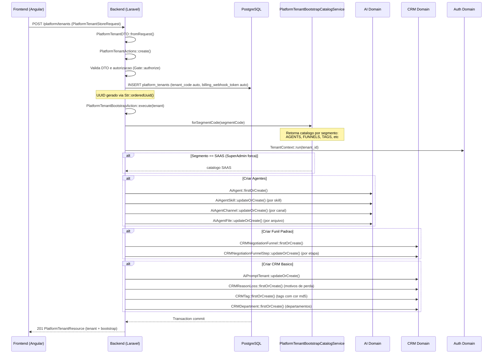
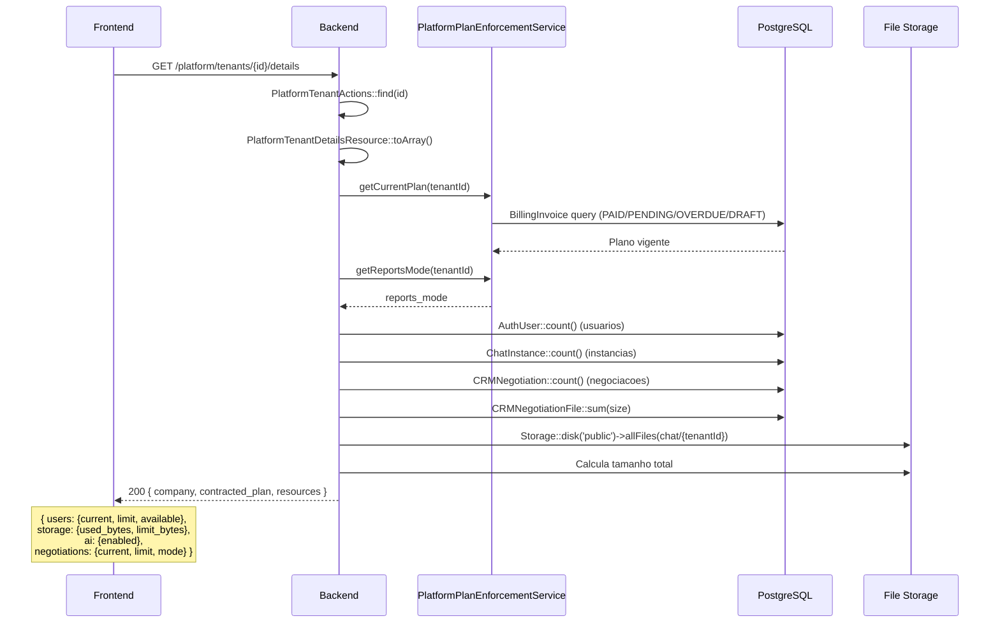
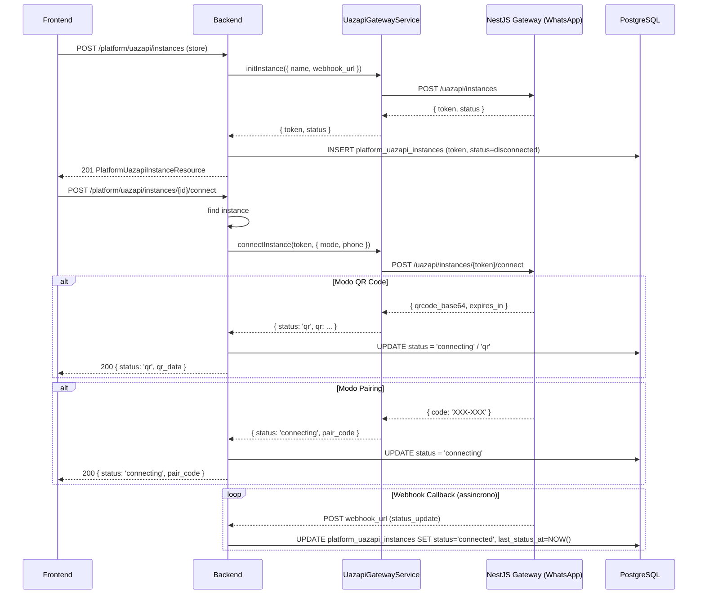
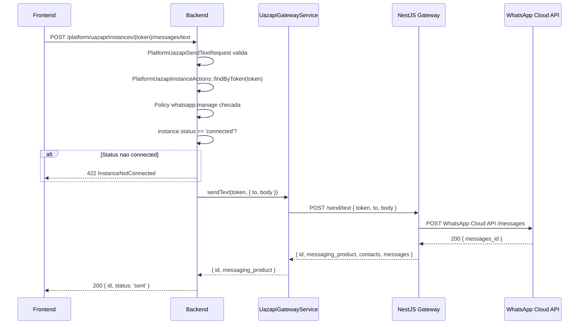
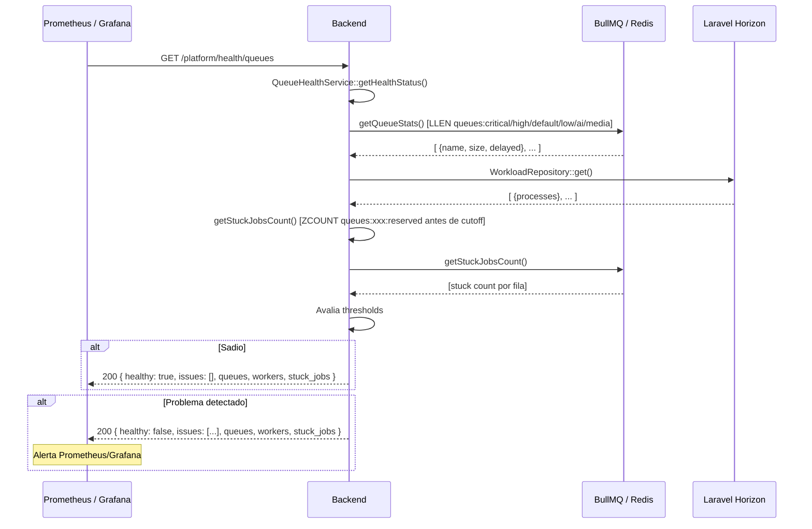
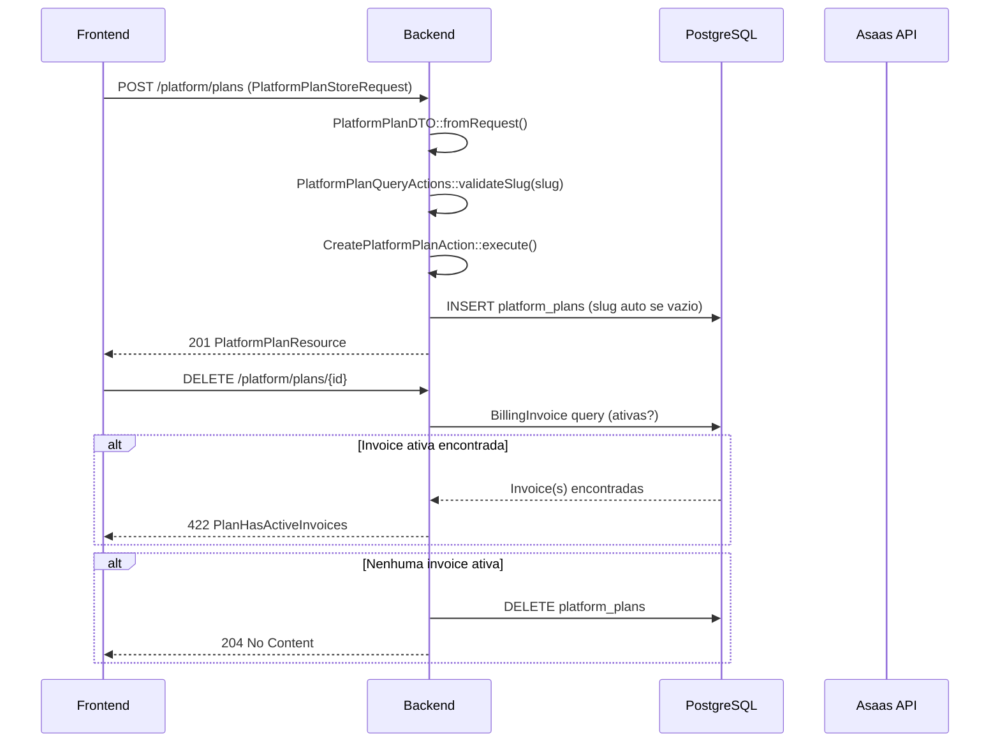
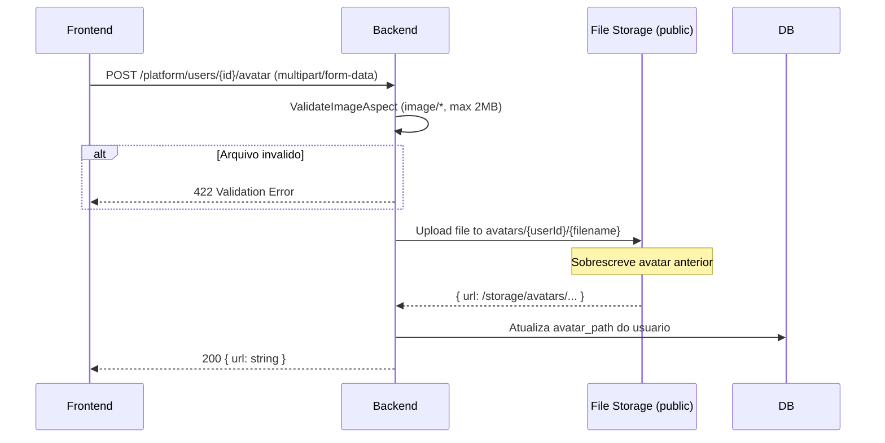
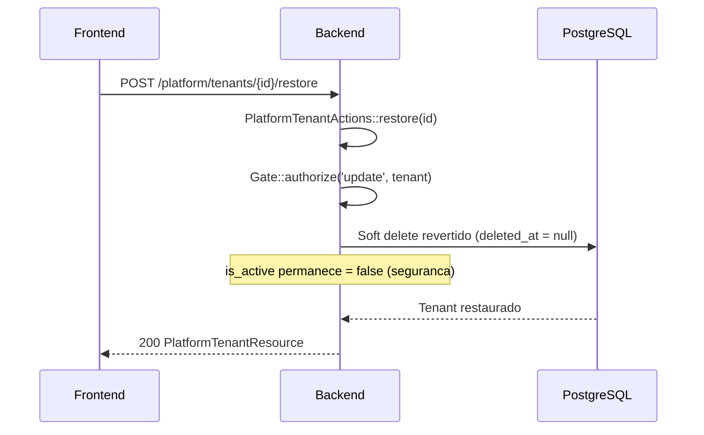
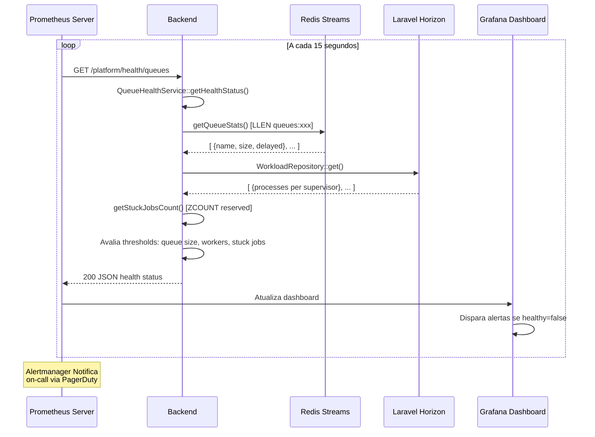
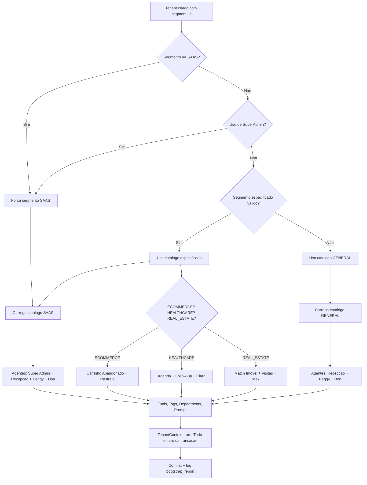

# PRD-PLATFORM-001 - Modulo Platform InteraZap

> **Modulo:** Platform (Administracao da Plataforma SaaS)
> **Status:** rascunho
> **Autor:** PM
> **Data:** 2026-03-28
> **Versao:** 0.1
> **Tags:** plataforma, multi-tenant, billing, planos, whatsapp, uazapi, observabilidade

---

## 1. CONTEXTO

### 1.1 Posicionamento no Ecossistema

O modulo Platform e o nucleo administrativo da plataforma InteraZap,responsavel por toda a gerencia centralizada dos tenants (empresas/clientes),
planos de assinatura, integracoes WhatsApp via gateway Uazapi, usuarios de plataforma e monitoramento de filas. Este modulo opera
em um nivel deprivilegio superior ao dos tenants individuais: enquanto os demais modulos (CRM, Chat, Billing, AI, etc.) funcionam
dentro do contexto de um tenant especifico, o Platform opera no plano da plataforma como umtodo, gerenciando o ciclo de vida completo
dos tenants, suas assinaturas e os recursos disponiveis.

O modulo Platform e consumido exclusivamente por usuarios com роль SuperAdmin ou papel de administrador de plataforma. Esses usuarios
tendem a ser colaboradores internos da InteraZap ou operadores de SaaS que gerenciam a base de clientes. A interface nao deve ser
exposta a usuarios finais dos tenants.

### 1.2 Historico e Evolucao

O modulo Platform foi construdo a partir de um modelo multi-tenant ja existente na arquitetura InteraZap, que ja utilizava `BelongsToTenant`
em todas as entidades. A principal evolucao foi a formalizacao de um dominio dedicado com:

- Modelo `PlatformTenant` como entidade raiz, com status de billing próprio (ativo, grace, bloqueado, purge)
- Plano de assinatura com limites tecnicos (usuarios, armazenamento, instancias WhatsApp, negociacoes, IA)
- Integracao via gateway NestJS (`UazapiGatewayService`) para orquestrar conexoes WhatsApp de todos os tenants
- `PlatformPlanEnforcementService` para enforcement de limites em tempo real em toda a plataforma
- `PlatformTenantBootstrapAction` para provisionamento automatico de dados padrao por segmento
- `QueueHealthService` para monitoramento interno de filas BullMQ
- `PlatformTenantBootstrapCatalogService` com catálogos por segmento: GENERAL, SAAS, ECOMMERCE, HEALTHCARE, REAL_ESTATE

### 1.3 Arquitetura Geral

A arquitetura segue o padrao DDD com Actions puras e 분리 de concerns clara:

```
HTTP Request (Sanctum Auth)
  -> FormRequest (validacao)
    -> DTO::fromRequest()
      -> Action::execute()  [logica de negocio pura]
        -> Model (persistencia)
        -> Resource (formatacao)
  -> JsonResponse / StreamedResponse (CSV)
```

A arquitetura de bootstrap segue um padrao catalog-driven, onde um catalogo por segmento
(`PlatformTenantBootstrapCatalogService`) fornece agentes padrao, funis, tags e departamentos
especificos para cada tipo de negocio. O tenant recebe um conjunto completo de dados iniciais
sem intervencao manual.

### 1.4 Decisoes Arquiteturais Chave

| Decisao                                             | Justificativa                                                                                  |
| --------------------------------------------------- | ---------------------------------------------------------------------------------------------- |
| UUID como primary key em todas as entidades         | Garante que IDs internos nunca vazem informacao sequencial; facilita migracoes e replica       |
| `final class` em Controllers, Actions e DTOs        | Impoe imutabilidade de interface e previne heranca acidental                                   |
| `readonly` DTOs com `fromRequest()` / `fromArray()` | Garante que DTOs sao imutaveis e podem ser reconstruidos de qualquer fonte                     |
| `BelongsToTenant` trait em PlatformUazapiInstance   | Even in the platform admin domain, instance ownership is per-tenant for multi-tenant isolation |
| Catalog-driven bootstrap                            | Permite segmentacao sem alterar codigo; catálogos podem ser extendidos via config              |
| SuperAdmin força segmento SAAS                      | Garante que tenants criados por super-admins sempre tengan catálogos SaaS padrao               |
| Storage calculado em cache 5 min                    | Calculo de storage e I/O intensivo; cache reduz carga sem perder precisao                      |
| Rate limiting em /health/\*                         | Endpoints internos de monitoramento nao devem ser abusados externamente                        |
| Asaas como gateway de pagamento                     | Integracao com Asaas para gestao de faturas, cobranca e cobrancas recorrentes                  |
| Gateway como fachada HTTP                           | O Backend nunca chama diretamente o WhatsApp provider; usa NestJS Gateway como proxy           |

### 1.5 Modulos Dependentes

O modulo Platform possui relacoes de dependencia com os seguintes modulos:

- **Auth**: Modelo `AuthUser` utilizado para contagem de usuarios por tenant
- **Billing**: `BillingInvoice`, `BillingTenantStatus`, `BillingCollectionLog`, `BillingPurgeReport`
- **Chat**: `ChatInstance` utilizado para contagem de instancias WhatsApp por tenant
- **CRM**: `CRMNegotiation`, `CRMNegotiationFile`, `CRMNegotiationFunnel`, `CRMReasonLoss`, `CRMTag`, `CRMDepartment`
- **AI**: `AiPromptSegment`, `AiPromptTenant`, `AiAgent`, `AiAgentSkill`, `AiAgentChannel`, `AiAgentFile`

### 1.6 Segmented Default Catalog

O `PlatformTenantBootstrapCatalogService` suporta os seguintes segmentos, cada um com
agentes, funis, tags e departamentos customizados:

| Segmento    | Codigo                          | Uso                                      |
| ----------- | ------------------------------- | ---------------------------------------- |
| GENERAL     | Padrao                          | Uso geral / multi-segmento               |
| SAAS        | FORCED_SUPER_ADMIN_SEGMENT_CODE | Tenants criados por SuperAdmin (forcado) |
| ECOMMERCE   | ECOMMERCE                       | E-commerce e retail                      |
| HEALTHCARE  | HEALTHCARE                      | Clinicas e saude                         |
| REAL_ESTATE | REAL_ESTATE                     | Imobiliarias                             |

Cada segmento define:

- `prompt_suffix`: Sufixo do prompt AI do tenant
- `agents[]`: Lista de agentes padrao com skills, files, channels e tools
- `funnels[]`: Funis de negociacao com etapas
- `loss_reasons[]`: Motivos de perda
- `tags[]`: Tags padrao CRM
- `departments[]`: Departamentos

### 1.7 Fluxo de Dados Entre Dominios

```
PlatformTenantController
  | create()
  v
PlatformTenantActions::create() ---> PlatformTenantBootstrapAction::execute()
                                              |
                                              v
                                     AiPromptTenant (AI)
                                     AiAgent + AiAgentSkill + AiAgentChannel (AI)
                                     CRMNegotiationFunnel + CRMNegotiationFunnelStep (CRM)
                                     CRMReasonLoss (CRM)
                                     CRMTag (CRM)
                                     CRMDepartment (CRM)

PlatformTenantDetailsResource
  | PlatformPlanEnforcementService
  v
  AuthUser.count() ---> (Auth)
  ChatInstance.count() ---> (Chat)
  CRMNegotiation.count() + CRMNegotiationFile.sum(size) ---> (CRM)

UazapiGatewayService
  | GatewayHttpClient (HTTP)
  v
  NestJS Gateway (whatsapp provider)
```

---

## 2. OBJETIVO

### 2.1 Objetivo Geral

Prover um sistema completo de administracao da plataforma SaaS InteraZap que permita a operadores internos (SuperAdmin) e administradores de plataforma gerenciar todo o ciclo de vida dos clientes da plataforma, desde a contratacao e onboarding automatico, passando pela operacao diaria e enforcement de limites, ate a cobranca, bloqueio e purge de tenants inadimplentes.

O modulo Platform e o ponto unico de controle centralizado onde toda alogica de administracao, governance e observabilidade da plataforma InteraZap reside. Ele nao opera dentro do contexto de um tenant individual, mas sim no plano meta da plataforma, enxergando todos os tenants e seus recursos.

### 2.2 Objetivos Especificos

**2.2.1 Gestao do Ciclo de Vida de Tenants**

Permitir que SuperAdmins executem todas as operacoes de gestao de tenants (empresas/clientes):

- Criacao de novos tenants com dados cadastrais completos (razao social, CNPJ, endereco, contato)
- Edicao de dados cadastrais e de endereco
- Ativacao e inativacao de tenants sem exclusao (toggle de is_active)
- Soft delete para exclusao logica com possibilidade de restauracao
- Force delete para remocao fisica definitiva (apos purge_deadline)
- Restore de tenants logicamente excluidos
- Visualizacao detalhada com metricas de uso de recursos

**2.2.2 Onboarding Automatico via Bootstrap**

Garantir que cada novo tenant receba um ambiente operacional completo e funcional no momento da criacao:

- Geracao automatica de agentes AI customizados por segmento de negocio (GENERAL, SAAS, ECOMMERCE, HEALTHCARE, REAL_ESTATE)
- Provisionamento de funis de negociacao CRM com etapas pre-configuradas
- Criacao de motivos de perda padrao
- Geracao de tags CRM com cores automaticas
- Criacao de departamentos organizacionais
- Sincronizacao de prompt AI do tenant com o segmento selecionado
- Tudo isso executado atomicamente dentro da mesma transacao da criacao do tenant

**2.2.3 Gestao de Planos de Assinatura**

Permitir que SuperAdmins configurem e gerenciem planos de assinatura com granularidade total:

- CRUD de planos com nomenclatura, precificacao mensal e integracao Asaas
- Configuracao de limites tecnicos por plano: quantidade de usuarios, espaco de armazenamento, numero de instancias WhatsApp, quantidade de negociacoes CRM
- Configuracao de modo de relatórios: BASIC (volume de chat), ADVANCED (+ CRM, agentes, AI), FULL (+ SLA, CSAT/NPS, exportacao)
- Ativacao e inativacao de planos sem exclusao
- Protecao contra exclusao de planos com faturas ativas vinculadas
- Validacao de slug unico antes da criacao

**2.2.4 Enforcement Automatico de Limites**

Garantir que o sistema enforceie automaticamente os limites de cada plano em todas as operacoes:

- `canCreateUser()`: Verifica contagem de usuarios vs limite do plano ativo
- `canCreateInstance()`: Verifica instancias WhatsApp vs limite do plano
- `canCreateNegotiation()`: Verifica negociacoes vs limite quando modo e LIMITED
- `canUploadFile()`: Verifica espaco em disco (CRM files + Chat media) vs limite
- `canDownloadFile()`: Verifica se ha espaco disponivel para download
- `isAiEnabled()`: Verifica se funcionalidades de IA estao habilitadas
- `getReportsMode()`: Retorna o modo de relatórios conforme plano ativo
- `canViewReport()`: Verifica se o tenant pode ver um relatorio especifico
- Todos os metodos retornam true/default quando nao ha plano ativo (comportamento generoso)

**2.2.5 Integracao WhatsApp via Gateway**

Orquestrar todas as conexoes WhatsApp de todos os tenants de forma centralizada:

- Criacao de instancias no gateway Uazapi (NestJS Gateway)
- Conexao via QR Code (exibicao para scan pelo administrador)
- Conexao via pareamento direto (codigo PIN/code)
- Desconexao e logout de sessoes
- Remocao completa de instancias
- Verificacao de status em tempo real (polling)
- Envio de mensagens de texto e arquivos
- Atualizacao de imagem de perfil da instancia
- Gerenciamento de presenca (available/unavailable)
- Sincronizacao de contatos
- Download de midia de mensagens
- Envio de contatos (vCard), localizacao, templates e react
- Edicao e exclusao de mensagens enviadas

**2.2.6 Gestao de Usuarios de Plataforma**

Permitir gerenciamento centralizado de usuarios que pertencem a tenants especificos:

- Listagem de usuarios de todos os tenants (SuperAdmin)
- Criacao, edicao e exclusao de usuarios cross-tenant
- Upload e remocao de avatar de usuario
- Toggle de status ativo/inativo de usuarios
- Vinculacao de usuarios a tenants especificos

**2.2.7 Gestao Financeira Centralizada**

Prover visibilidade consolidada de todas as faturas de todos os tenants:

- Listagem de invoices de todos os tenants em uma unica tela
- Criacao de faturas manuais (cobrancas avulsas)
- Exclusao de faturas (estorno)
- Filtros por tenant, status e data

**2.2.8 Monitoramento de Observabilidade**

Fornecer metricas de sade das filas BullMQ para alertas e dashboards:

- Tamanho atual de cada fila (critical, high, default, low, ai, media)
- Quantidade de jobs atrasados (delayed) por fila
- Quantidade de jobs travados (reserved antes de threshold)
- Contagem de workers ativos (via Laravel Horizon)
- Status de saude consolidado (healthy: true/false)
- Lista de problemas detectados com thresholds configuraveis
- Timestamp da verificacao em ISO 8601

**2.2.9 Exportacao de Dados**

Permitir exportacao de dados de tenants para integracoes externas:

- Exportacao de tenants para CSV com stream (memoria constante)
- Suporte a filtros idênticos à listagem (busca, status, data, trashed)
- BOM UTF-8 para compatibilidade com Microsoft Excel
- Delimitador brasileiro (ponto e virgula)
- Sanitizacao de celulas para previnir injeccao de formulas

### 2.3 Objetivos NAO Escopo

O modulo Platform NAO tem como objetivo:

- **Auto-atendimento de tenants**: A interface de self-service para tenants gerenciarem sua propria conta fica no modulo Auth/Configuration, nao aqui
- **Implementacao de logica de pagamento**: Cobrancas recorrentes, faturas automaticas, webhooks Asaas e gestao de inadimplencia ficam no modulo Billing
- **Autenticacao de tenants**: Login, registro, redefinicao de senha e gestao de sessoes ficam no modulo Auth
- **Execucao de automacoes AI**: Agentes, prompts e pipelines AI ficam no modulo AI, nao no Platform
- **Operacao de CRM**: negociacoes, contatos, funis e tarefas ficam no modulo CRM
- **Operacao de Chat**: tickets, conversas e atendimento ficam no modulo Chat
- **Execucao de relatorios**: A geracao de relatorios analiticos fica no modulo Reports

---

## 3. REGRAS DE NEGOCIO

### 3.1 Regras Gerais de Tenant

| ID     | Regra                                                                                                                                    | Prioridade |
| ------ | ---------------------------------------------------------------------------------------------------------------------------------------- | ---------- |
| RN-001 | Todo tenant deve ter um `tenant_code` unico de 8 caracteres alfanumericos maiusculos, gerado automaticamente na criacao se nao fornecido | Critica    |
| RN-002 | `tenant_code` deve ser unico globalmente; caso de colisao, gerar novo codigo ate conseguir                                               | Critica    |
| RN-003 | CNPJ e telefone devem ter Digitos apenas (sem pontuacao) armazenados no banco; normalizados via DTO                                      | Alta       |
| RN-004 | Campo `state` deve ser armazenado em maiusculo (UF de 2 digitos, ex: SP, MG)                                                             | Media      |
| RN-005 | Campos de data de billing (`grace_deadline`, `purge_deadline`) sao `date` (nao datetime)                                                 | Media      |
| RN-006 | `billing_webhook_token` deve ser gerado automaticamente via UUID na criacao se nao fornecido                                             | Alta       |
| RN-007 | `asaas_customer_id` pode ser null ate a primeira sincronizacao com gateway Asaas                                                         | Media      |
| RN-008 | Todos os tenants devem pertencer a um `AiPromptSegment`; se nenhum for especificado, usar o segmento GENERAL                             | Alta       |
| RN-009 | Tenants criados por SuperAdmin devem ser forçados ao segmento SAAS, ignorando qualquer segment_id fornecido                              | Critica    |
| RN-010 | Tenant com `is_active = false` deve continuar funcionando se `billing_status` nao for LOCKED ou PENDING_PURGE                            | Media      |
| RN-011 | Soft deletes em todos os tenants; exclusao fisica apenas via `forceDelete` com autorizacao explicita                                     | Alta       |
| RN-012 | Restore de tenant excluido restaura `is_active = false` por padrao                                                                       | Media      |
| RN-013 | Metodo `isLocked()` retorna true se `billing_status === BillingTenantStatus::LOCKED`                                                     | Alta       |
| RN-014 | Metodo `isInGrace()` retorna true se `billing_status === BillingTenantStatus::GRACE`                                                     | Alta       |
| RN-015 | Metodo `isPendingPurge()` retorna true se `billing_status === BillingTenantStatus::PENDING_PURGE`                                        | Alta       |

### 3.2 Regras de Bootstrap de Tenant

| ID     | Regra                                                                                                                                                                                                                    | Prioridade |
| ------ | ------------------------------------------------------------------------------------------------------------------------------------------------------------------------------------------------------------------------ | ---------- |
| RN-020 | Ao criar tenant, `PlatformTenantBootstrapAction::execute()` deve ser chamado dentro da mesma transacao                                                                                                                   | Critica    |
| RN-021 | Bootstrap deve ser catalog-driven: o `PlatformTenantBootstrapCatalogService` fornece todos os dados default por segmento                                                                                                 | Alta       |
| RN-022 | Se `dry_run = true`, o bootstrap retorna o relatorio sem persistir dados                                                                                                                                                 | Media      |
| RN-023 | Bootstrap cria: AiPromptTenant (1), AiAgent (3+), AiAgentSkill (por agente), AiAgentChannel (por agente), AiAgentFile (por agente), CRMNegotiationFunnel, CRMNegotiationFunnelStep, CRMReasonLoss, CRMTag, CRMDepartment | Alta       |
| RN-024 | Segmento HEALTHCARE deve criar agentes que NAO diagnosticam, NAO prescrevem e orientam SAMU 192 para urgencias                                                                                                           | Critica    |
| RN-025 | Segmento REAL_ESTATE deve criar agentes focados em match de imovel e agendamento de visitas                                                                                                                              | Alta       |
| RN-026 | Segmento ECOMMERCE deve criar agentes focados em carrinho abandonado, rastreio de pedidos e pos-venda                                                                                                                    | Alta       |
| RN-027 | Tags sao criadas com cor automaticamente gerada a partir de `md5(nome)` para consistencia visual                                                                                                                         | Media      |
| RN-028 | Funis de negociacao devem ter steps ordenados pelo campo `order`                                                                                                                                                         | Alta       |
| RN-029 | Agents ja existentes com mesmo nome no tenant devem ser atualizados (upsert), nao duplicados                                                                                                                             | Alta       |
| RN-030 | Bootstrap deve executar dentro de `TenantContext::run()` para garantir isolamento de tenant                                                                                                                              | Critica    |
| RN-031 | `AgentToolEnum` deve ser importado corretamente ao referenciar ferramentas nos catálogos                                                                                                                                 | Alta       |

### 3.3 Regras de Plano de Assinatura

| ID     | Regra                                                                                              | Prioridade |
| ------ | -------------------------------------------------------------------------------------------------- | ---------- |
| RN-040 | Planos podem ser criados com `slug` automatico (Slug de name) se nao fornecido                     | Media      |
| RN-041 | Slug do plano deve ser unico globalmente; validacao via `validateSlug()` antes de salvar           | Critica    |
| RN-042 | `storage_mode` pode ser UNLIMITED (sem limite de bytes) ou LIMITED (com `storage_limit_bytes`)     | Alta       |
| RN-043 | `negotiations_mode` pode ser UNLIMITED ou LIMITED com `negotiations_limit`                         | Alta       |
| RN-044 | `reports_mode` pode ser BASIC, ADVANCED ou FULL — define quais relatorios o tenant pode acessar    | Alta       |
| RN-045 | Campo `ai_enabled` booleano controla se funcionalidades de IA estao disponiveis para o tenant      | Alta       |
| RN-046 | `whatsapp_integrations_limit` define maximo de instancias WhatsApp; 0 ou null significa ilimitado  | Media      |
| RN-047 | `asaas_product_id` linka o plano a um produto no gateway Asaas para cobranca automatica            | Media      |
| RN-048 | `price_monthly` e `decimal:2` (ex: 99.90); null significa plano custom/gratuito                    | Media      |
| RN-049 | Exclusao de plano so e permitida se NAO houver invoices ativas (PAID, PENDING, OVERDUE) vinculadas | Critica    |
| RN-050 | Toggle de plano (`PATCH /plans/{id}/toggle`) ativa/inativa sem excluir                             | Media      |

### 3.4 Regras de Enforcement de Plano

| ID     | Regra                                                                                               | Prioridade |
| ------ | --------------------------------------------------------------------------------------------------- | ---------- |
| RN-060 | `canCreateUser()` retorna false se `count >= limit_users`; se limit <= 0 retorna true (ilimitado)   | Critica    |
| RN-061 | `canCreateInstance()` retorna false se `count >= whatsapp_integrations_limit`                       | Critica    |
| RN-062 | `canCreateNegotiation()` retorna false se `count >= negotiations_limit` quando mode e LIMITED       | Critica    |
| RN-063 | `canUploadFile()` compara `(usado + novo_arquivo) <= limite` em bytes                               | Alta       |
| RN-064 | `canDownloadFile()` compara `usado < limite` em bytes                                               | Alta       |
| RN-065 | Storage sem plano ativo usa `MAX_STORAGE_LIMIT_BYTES = 50GB` como default                           | Media      |
| RN-066 | Storage mode UNLIMITED tambem usa 50GB como teto fisico                                             | Media      |
| RN-067 | `getReportsMode()` retorna BASIC como padrao se tenant sem plano ativo                              | Alta       |
| RN-068 | Admin (role=admin) pode ver qualquer relatorio independentedo modo                                  | Alta       |
| RN-069 | `getCurrentPlan()` consulta invoices mais recentes com status ativo (PAID, PENDING, OVERDUE, DRAFT) | Alta       |
| RN-070 | `isAiEnabled()` retorna `true` como default se tenant sem plano                                     | Media      |

### 3.5 Regras de Integracao WhatsApp (UazapiGatewayService)

| ID     | Regra                                                                                                                   | Prioridade |
| ------ | ----------------------------------------------------------------------------------------------------------------------- | ---------- |
| RN-080 | Criacao de instancia no gateway deve ser feita via `UazapiGatewayService::initInstance()` ANTES de persistir localmente | Critica    |
| RN-081 | `connectInstance()` pode receber `mode` (chat, retail, etc) e `phone` para pareamento direto                            | Media      |
| RN-082 | QR Code deve ser retornado para exibicao no frontend apos `connectInstance()` com status qr                             | Alta       |
| RN-083 | `disconnectInstance()` deve fazer logout da sessao no gateway antes de atualizar status local                           | Alta       |
| RN-084 | `deleteInstance()` remove a instancia do gateway e da base local                                                        | Alta       |
| RN-085 | `sendText()` e `sendFile()` requerem `token` da instancia no header da requisicao                                       | Alta       |
| RN-086 | `updateProfileImage()` aceita URL, base64 ou 'remove' como valor de `image`                                             | Media      |
| RN-087 | `updatePresence()` aceita 'available' ou 'unavailable' como valor                                                       | Media      |
| RN-088 | Todos os metodos de envio usam `tokenHeaders()` para passar token da instancia                                          | Alta       |
| RN-089 | `syncContactsList()` recebe array de contatos e sincroniza com o gateway                                                | Media      |
| RN-090 | Metodo `downloadMedia()` pode retornar `fileURL`, `mimetype`, `base64Data` ou `generate_mp3`                            | Media      |
| RN-091 | `sendTemplate()` requer `number`, `templateId`, `language` e `components` no payload                                    | Media      |

### 3.6 Regras de Status de Instancia WhatsApp

| ID     | Regra                                                                       | Prioridade |
| ------ | --------------------------------------------------------------------------- | ---------- |
| RN-095 | Status possiveis: `connected`, `disconnected`, `connecting`, `qr`           | Alta       |
| RN-096 | Campo `config` e JSONB para armazenar configuracoes arbitarias da instancia | Media      |
| RN-097 | Campo `metadata` e JSONB para dados de negocio arbitrarios                  | Media      |
| RN-098 | Campo `last_status_at` registra timestamp da ultima atualizacao de status   | Media      |
| RN-099 | `webhook_url` deve ser configurado para receber eventos do gateway          | Media      |
| RN-100 | Instancias pertencem a tenant via `BelongsToTenant` trait                   | Critica    |

### 3.7 Regras de Monitoramento de Filas

| ID     | Regra                                                                                         | Prioridade |
| ------ | --------------------------------------------------------------------------------------------- | ---------- |
| RN-110 | Filas monitoradas: critical, high, default, low, ai, media                                    | Alta       |
| RN-111 | `getQueueStats()` retorna `size` (numero de jobs) e `delayed` (jobs atrasados) por fila       | Alta       |
| RN-112 | `getWorkerCount()` retorna -1 se Horizon nao estiver instalado ou configurado                 | Media      |
| RN-113 | `getStuckJobsCount()` conta jobs reservados antes de `now - threshold` (default 600s)         | Alta       |
| RN-114 | `getHealthStatus()` retorna `healthy: false` se qualquer fila exceder `max_queue_size` (1000) | Alta       |
| RN-115 | `getHealthStatus()` retorna `healthy: false` se nao houver workers ativos                     | Critica    |
| RN-116 | `getHealthStatus()` retorna `healthy: false` se `stuck_jobs > max_stuck_jobs` (10)            | Alta       |
| RN-117 | Todas as metricas incluem `checked_at` em ISO 8601                                            | Media      |
| RN-118 | Threshold configuravel via `config('queue.health.*')`                                         | Media      |

### 3.8 Regras de Billing de Plataforma

| ID     | Regra                                                                                             | Prioridade |
| ------ | ------------------------------------------------------------------------------------------------- | ---------- |
| RN-130 | Invoices de plataforma listam faturas de todos os tenants                                         | Alta       |
| RN-131 | Permissao para invoices: SuperAdmin ou role admin (sem filtro por tenant)                         | Critica    |
| RN-132 | Campo `media_transcription_*` controla limites de transcricao de audio, video e imagem por tenant | Media      |
| RN-133 | `collection_count` e `last_collection_sent_at` rastreiam cobrancas enviadas                       | Media      |
| RN-134 | `grace_deadline` e `purge_deadline` sao calculados pelo modulo Billing                            | Media      |

### 3.9 Regras de Seguranca e RBAC

| ID     | Regra                                                                                                            | Prioridade |
| ------ | ---------------------------------------------------------------------------------------------------------------- | ---------- |
| RN-140 | `platform.tenants.manage` necessaria para criar, editar, excluir, restaurar, forcar exclusao e toggle de tenants | Critica    |
| RN-141 | `platform.plans.manage` necessaria para criar, editar, excluir e toggle de planos                                | Critica    |
| RN-142 | `whatsapp.manage` necessaria para gerenciar instancias Uazapi                                                    | Critica    |
| RN-143 | Billing invoices requer SuperAdmin ou role admin (sem granularidade especifica)                                  | Critica    |
| RN-144 | SuperAdmin pode gerenciar usuarios de qualquer tenant via `/platform/users`                                      | Alta       |
| RN-145 | Endpoint `/health/*` usa throttle `observability` (rate limit especifico)                                        | Alta       |
| RN-146 | Todos os outros endpoints `/platform/*` usam `auth:sanctum`                                                      | Critica    |
| RN-147 | Nao expor tokens de gateway, webhooks ou credenciais Asaas em logs                                               | Critica    |
| RN-148 | CNPJ validado: 14 digitos numericos (formato basico, sem digito verificador)                                     | Media      |
| RN-149 | Telefone validado: DDD + 8 ou 9 digitos apos normalizacao (11-12 digitos)                                        | Media      |

### 3.10 Regras de Exportacao

| ID     | Regra                                                                                                | Prioridade |
| ------ | ---------------------------------------------------------------------------------------------------- | ---------- |
| RN-160 | Export de tenants usa stream `fopen('php://output')` para evitar uso de memoria                      | Alta       |
| RN-161 | CSV usa BOM UTF-8 (`\xEF\xBB\xBF`) para compatibilidade com Excel                                    | Media      |
| RN-162 | Delimitador CSV e `;` (padrao brasileiro)                                                            | Media      |
| RN-163 | Nome do arquivo: `tenants_export_{YYYYMMDD}.csv`                                                     | Media      |
| RN-164 | Celulas que comecam com `=`, `+`, `-`, `@` sao prefixadas com `'` para previnir injeccao de formulas | Critica    |
| RN-165 | Export respeita filtros aplicados (search, is_active, trashed, date range)                           | Alta       |

### 3.11 Regras de Gestao de Usuarios de Plataforma

| ID     | Regra                                                                                   | Prioridade |
| ------ | --------------------------------------------------------------------------------------- | ---------- |
| RN-170 | `/platform/users` lista usuarios de TODOS os tenants; filtro por `tenant_id` disponivel | Alta       |
| RN-171 | SuperAdmin pode criar usuario em qualquer tenant via POST /platform/users               | Critica    |
| RN-172 | SuperAdmin pode atualizar usuario de qualquer tenant via PUT /platform/users/{id}       | Alta       |
| RN-173 | SuperAdmin pode deletar usuario de qualquer tenant via DELETE /platform/users/{id}      | Alta       |
| RN-174 | Toggle de usuario (PATCH /users/{id}/toggle) ativa/inativa sem excluir                  | Media      |
| RN-175 | Upload de avatar aceita apenas imagens (image/\*), max 2MB                              | Alta       |
| RN-176 | Avatar e armazenado em Storage::disk('public') com path unico por usuario               | Media      |
| RN-177 | Delete de avatar (DELETE /users/{id}/avatar) remove o arquivo fisico                    | Media      |
| RN-178 | Listagem de usuarios suporta filtro por role (admin, user, etc.)                        | Media      |
| RN-179 | Busca por usuarios (search) pesquisa name e email                                       | Media      |
| RN-180 | Paginação em listagem de usuarios segue o padrao da plataforma (per_page, page)         | Media      |

### 3.12 Regras de Monitoramento de Saude de Filas

| ID     | Regra                                                                                              | Prioridade |
| ------ | -------------------------------------------------------------------------------------------------- | ---------- |
| RN-185 | `getQueueStats()` retorna size e delayed para cada uma das 6 filas                                 | Alta       |
| RN-186 | `getQueueSize()` usa `Redis::llen` para filas Redis; fallback para `Queue::size()`                 | Media      |
| RN-187 | `getDelayedCount()` usa `Redis::zcard` para filas delayed; so funciona com driver Redis            | Media      |
| RN-188 | Jobs travados sao aqueles com `reserved_at < now - threshold` (default 600s)                       | Alta       |
| RN-189 | Contagem de stuck jobs varre todas as filas monitoradas                                            | Alta       |
| RN-190 | `getWorkerCount()` retorna -1 quando Horizon nao esta instalado; retorna 0 quando nao ha workers   | Media      |
| RN-191 | `getHealthStatus()` retorna `healthy: true` apenas se TODAS as condicoes estao OK                  | Alta       |
| RN-192 | `getHealthStatus()` lista TODOS os problemas em `issues[]`, nao para no primeiro                   | Media      |
| RN-193 | Thresholds `max_queue_size` (1000) e `max_stuck_jobs` (10) sao lidos de `config('queue.health.*')` | Media      |
| RN-194 | `getQueueConfig()` retorna `config('queue.queues')` com configuracao de cada fila                  | Media      |
| RN-195 | Todas as metricas de health incluem `checked_at` em ISO 8601 para rastreabilidade                  | Media      |
| RN-196 | Erros de conexao Redis sao silenciados (try/catch), retornando 0 ou fallback                       | Alta       |
| RN-197 | Endpoint de health usa throttle `observability` (rate limit especifico)                            | Alta       |
| RN-198 | `setQueues()` permite customizar quais filas sao monitoradas em testes                             | Media      |

### 3.13 Regras de Transcricao de Midia

| ID     | Regra                                                                                              | Prioridade |
| ------ | -------------------------------------------------------------------------------------------------- | ---------- |
| RN-200 | `media_transcription_audio_enabled` controla se transcricao de audio esta habilitada               | Media      |
| RN-201 | `media_transcription_video_enabled` controla se transcricao de video esta habilitada               | Media      |
| RN-202 | `media_transcription_image_enabled` controla se analise de imagem esta habilitada                  | Media      |
| RN-203 | `media_transcription_audio_max_minutes` define duracao maxima de audio transcrito (default 10 min) | Media      |
| RN-204 | `media_transcription_video_max_seconds` define duracao maxima de video (default 60s)               | Media      |
| RN-205 | `media_transcription_image_max_per_message` define maximo de imagens por mensagem (default 5)      | Media      |
| RN-206 | Todos os campos de transcricao tem `false` como default                                            | Media      |

### 3.14 Regras de Billing e Cobranca

| ID     | Regra                                                                                       | Prioridade |
| ------ | ------------------------------------------------------------------------------------------- | ---------- |
| RN-210 | `collection_count` rastreia o numero de cobrancas enviadas ao tenant                        | Media      |
| RN-211 | `last_collection_sent_at` registra timestamp da ultima cobranca enviada                     | Media      |
| RN-212 | `grace_deadline` e calculado pelo modulo Billing e armazenado como date                     | Media      |
| RN-213 | `purge_deadline` e calculado pelo modulo Billing e armazenado como date                     | Alta       |
| RN-214 | `billing_lock_reason` registra o motivo do bloqueio (ex: inadimplencia, violacao de termos) | Media      |
| RN-215 | `asaas_customer_id` linka o tenant a um cliente no gateway Asaas                            | Media      |
| RN-216 | Invoices de plataforma listam TODOS os tenants sem filtro de tenant (SuperAdmin)            | Alta       |
| RN-217 | Criacao de invoice manual via POST /platform/billing/invoices                               | Media      |
| RN-218 | Exclusao de invoice via DELETE remove o registro (estorno)                                  | Media      |

### 3.15 Regras de Segmentacao e Catologo

| ID     | Regra                                                                                 | Prioridade |
| ------ | ------------------------------------------------------------------------------------- | ---------- |
| RN-220 | `PlatformTenantBootstrapCatalogService` define o catalogo por segmento de negocio     | Alta       |
| RN-221 | Segmento padrao (DEFAULT_SEGMENT_CODE) e GENERAL quando nenhum especificado           | Alta       |
| RN-222 | SuperAdmin forca segmento SAAS independentemente do segment_id fornecido              | Critica    |
| RN-223 | Segmento HEALTHCARE cria agentes com instrucoes explicitas para NAO diagnosticar      | Critica    |
| RN-224 | Segmento HEALTHCARE cria agentes que orientam SAMU 192 para sinais de urgencia        | Critica    |
| RN-225 | Segmento REAL_ESTATE cria agentes focados em match de imovel e agendamento de visitas | Alta       |
| RN-226 | Segmento ECOMMERCE cria agentes focados em carrinho abandonado e rastreio             | Alta       |
| RN-227 | Agentes com mesmo nome sao atualizados (upsert), nunca duplicados                     | Alta       |
| RN-228 | Tags CRM sao geradas com cor automatica: `md5(nome)[0..5]` prefixed with '#'          | Media      |
| RN-229 | Funis CRM tem steps ordenados pelo campo `order`; primeira etapa tem order=1          | Alta       |
| RN-230 | `syncPrompt()` concatena `segment.content + "\n\n" + catalog.prompt_suffix`           | Alta       |
| RN-231 | `AiToolEnum` e referenciado nos catalogos de agentes para listar ferramentas          | Media      |
| RN-232 | Arquivos de agente (files) sao criados com `slug` unico dentro do agente              | Media      |
| RN-233 | Departments sao criados com descricoes pre-definidas em constantes                    | Media      |

---

## 4. FLUXOS

### 4.1 Fluxo Principal - Criacao de Tenant com Bootstrap



### 4.2 Fluxo de Detalhes Completos de Tenant



### 4.3 Fluxo de Integracao WhatsApp - Conexao de Instancia



### 4.4 Fluxo de Enforcement de Plano

```mermaid
flowchart TD
    A[Usuario tenta criar recurso] --> B{Plano existe?}
    B -->|Nao| C[Permite (limites default)]
    B -->|Sim| D{Recurso = Usuario?}
    D -->|Sim| E{count >= limit_users?}
    E -->|Sim| F[403 PlanLimitExceeded]
    E -->|Nao| C
    D -->|Recurso = Instancia| G{count >= whatsapp_integrations_limit?}
    G -->|Sim| H[403 PlanLimitExceeded]
    G -->|Nao| C
    D -->|Recurso = Arquivo| I{usado + novo <= storage_limit?}
    I -->|Nao| J[403 StorageLimitExceeded]
    I -->|Sim| C
    D -->|Recurso = Negociacao| K{mode = LIMITED?}
    K -->|Nao| C
    K -->|Sim| L{count >= negotiations_limit?}
    L -->|Sim| M[403 PlanLimitExceeded]
    L -->|Nao| C
    C --> N[Permite operacao]
```

### 4.5 Fluxo de Envio de Mensagem WhatsApp



### 4.6 Fluxo de Monitoramento de Filas



### 4.7 Fluxo de Exportacao de Tenants

```mermaid
sequenceDiagram
    participant FE as Frontend
    participant API as Backend
    participant DB as PostgreSQL

    FE->>API: GET /platform/tenants/export?search=&is_active=&trashed=
    API->>API: PlatformTenantController::export()
    API->>API: extractFilters() [search, is_active, trashed, date range]
    API->>API: PlatformTenantActions::queryForExport(filters)
    API->>DB: Query com filtros aplicados
    API->>API: Stream CSV com fputcsv
    Note over API: BOM UTF-8 prefixado<br/>Delimiter = ;<br/>Celulas sanitizadas
    API-->>FE: StreamedResponse (Content-Disposition: attachment)
    Note over FE: Download direto no browser
```

### 4.8 Fluxo de Gestao de Planos



### 4.9 Fluxo de Upload de Avatar de Usuario



### 4.10 Fluxo de Restore de Tenant Excluido



### 4.11 Fluxo de Health Check Completo (Prometheus)



### 4.12 Fluxo de Catalog-Driven Bootstrap por Segmento



---

## 5. ENTIDADES E MODELOS

### 5.1 PlatformTenant

```
Entidade: PlatformTenant
Tabela: platform_tenants
Tipo: Entidade Raiz Agregada (Multi-Tenant Root)

Atributos de Identidade:
  - id: UUID (PK, Str::orderedUuid, non-incrementing)
  - tenant_code: string(8) UNIQUE (ex: "A3K9X2PQ")
  - name: string (razao social ou nome fantasia)
  - primary_email: string? (email principal do responsavel)

Atributos de Endereco:
  - document: string? (CNPJ/CPF, 14/11 digitos normalizados)
  - phone: string? (telefone normalizado, DDD + numero)
  - street: string?
  - number: string?
  - complement: string?
  - district: string?
  - city: string?
  - state: string? (UF em maiusculo, ex: "SP")
  - zip_code: string? (CEP normalizado, 8 digitos)

Atributos de Billing (Cobranca):
  - billing_status: BillingTenantStatus (enum: ACTIVE, GRACE, LOCKED, PENDING_PURGE, etc.)
  - billing_locked_at: datetime?
  - billing_lock_reason: string?
  - grace_deadline: date?
  - purge_deadline: date?
  - last_collection_sent_at: datetime?
  - collection_count: int (default 0)
  - billing_webhook_token: string(36) UNIQUE (UUID para webhook Asaas)
  - asaas_customer_id: string? (ID do cliente no gateway Asaas)

Atributos de Segmento e Plano:
  - segment_id: UUID? (FK -> ai_prompt_segments)
  - plan_id: UUID? (FK -> platform_plans)
  - is_active: boolean (default true)

Atributos de Midia/Transcricao:
  - media_transcription_audio_enabled: boolean (default false)
  - media_transcription_image_enabled: boolean (default false)
  - media_transcription_video_enabled: boolean (default false)
  - media_transcription_audio_max_minutes: int (default 10)
  - media_transcription_image_max_per_message: int (default 5)
  - media_transcription_video_max_seconds: int (default 60)

Timestamps: created_at, updated_at, deleted_at (SoftDeletes)

Relacionamentos:
  - segment: BelongsTo(AiPromptSegment)
  - plan: BelongsTo(PlatformPlan)
  - aiPrompt: HasOne(AiPromptTenant)
  - chatInstances: HasMany(ChatInstance)
  - collectionLogs: HasMany(BillingCollectionLog)
  - purgeReport: HasOne(BillingPurgeReport) -> latestOfMany

Metodos de Dominio:
  - isLocked(): bool — billing_status == LOCKED
  - isInGrace(): bool — billing_status == GRACE
  - isPendingPurge(): bool — billing_status == PENDING_PURGE
  - booted(): UUID auto-gerado, billing_webhook_token auto-gerado

Constraints:
  - UNIQUE(tenant_code)
  - UNIQUE(asaas_customer_id) exceto null
  - UNIQUE(billing_webhook_token)
```

### 5.2 PlatformPlan

```
Entidade: PlatformPlan
Tabela: platform_plans
Tipo: Entidade de Configuracao

Atributos de Identidade:
  - id: UUID (PK, Str::orderedUuid, non-incrementing)
  - name: string (nome do plano, ex: "Starter", "Professional")
  - slug: string UNIQUE (slugify de name)
  - is_active: boolean (default true)

Atributos de Limites:
  - limit_users: int? (null/0 = ilimitado)
  - storage_mode: PlatformStorageMode (enum: UNLIMITED, LIMITED)
  - storage_limit_bytes: int? (ex: 10 * 1024 * 1024 * 1024 = 10GB)
  - whatsapp_integrations_limit: int? (null/0 = ilimitado)
  - negotiations_mode: PlatformNegotiationsMode (enum: UNLIMITED, LIMITED)
  - negotiations_limit: int? (ex: 1000)
  - ai_enabled: boolean (default true)

Atributos de Relatorios:
  - reports_mode: PlatformReportsMode (enum: BASIC, ADVANCED, FULL)
    BASIC: reports.chat.volume
    ADVANCED: BASIC + crm.funnel, crm.salesperson_performance, crm.loss_reason,
                      crm.contact_crm, chat.agent_performance, ai.autopilot_performance, ai.sentiment
    FULL: ADVANCED + reports.sla.resolution, reports.csat_nps, reports.export
    ADMIN_ONLY: + reports.ai.usage_cost, reports.billing.revenue (apenas admins)

Atributos de precificacao:
  - price_monthly: decimal(8,2)? (ex: 99.90, null = gratuito/custom)
  - asaas_product_id: string? (ID do produto no gateway Asaas)

Timestamps: created_at, updated_at, deleted_at (SoftDeletes)

Metodos de Dominio:
  - isStorageLimited(): bool — storage_mode == LIMITED
  - isNegotiationsLimited(): bool — negotiations_mode == LIMITED
  - booted(): UUID auto-gerado, slug auto-gerado se vazio

Constraints:
  - UNIQUE(slug)
```

### 5.3 PlatformUazapiInstance

```
Entidade: PlatformUazapiInstance
Tabela: platform_uazapi_instances
Tipo: Entidade de Integracao Externa
Usa: BelongsToTenant trait (isolamento multi-tenant)

Atributos de Identidade:
  - id: UUID (PK, Str::orderedUuid, non-incrementing)
  - tenant_id: UUID (FK -> platform_tenants, via BelongsToTenant)
  - name: string (nome amigavel da instancia, ex: "Atendimento Principal")
  - system_name: string? (nome no gateway)
  - token: string (token de acesso no gateway, unico)
  - status: string (enum-like: connected, disconnected, connecting, qr)

Atributos de Configuracao:
  - webhook_url: string? (URL para receber eventos do gateway)
  - config: jsonb (configuracoes arbitarias: proxy, timeout, etc.)
  - metadata: jsonb (dados de negocio: numero_whatsapp, nome_vendedor, etc.)

Timestamps: created_at, updated_at, last_status_at

Relacionamentos:
  - tenant: BelongsTo(PlatformTenant)

Metodos de Dominio:
  - booted(): UUID auto-gerado

Constraints:
  - UNIQUE(token)
```

### 5.4 PlatformBillingInvoice (Resource/View Only)

```
Entidade: PlatformBillingInvoice
Tipo: Resource de leitura (dados de Billing Domain)

Atributos expostos:
  - id: UUID
  - tenant_id: UUID
  - invoice_number: string
  - status: BillingInvoiceStatus
  - amount: decimal
  - due_date: date
  - paid_at: datetime?
  - plan_id: UUID?
  - asaas_billing_id: string?

Nota: A entidade real e BillingInvoice no dominio Billing.
      PlatformBillingInvoiceResource e um resource de apresentacao.
```

### 5.5 Enums do Dominio

```
PlatformStorageMode:
  - UNLIMITED: Armazenamento sem limite configurado (usa 50GB fisico)
  - LIMITED: Armazenamento com limite em bytes

PlatformNegotiationsMode:
  - UNLIMITED: Negociacoes sem limite
  - LIMITED: Negociacoes com limite configurado

PlatformReportsMode:
  - BASIC: Relatorios basicos de volume de chat
  - ADVANCED: + CRM, Agent, AI
  - FULL: + SLA, CSAT/NPS, Exportacao

BillingTenantStatus (Billing Domain):
  - ACTIVE: Tenant ativo e em dia
  - GRACE: Em periodo de gracia pos vencimento
  - LOCKED: Bloqueado por inadimplencia
  - PENDING_PURGE: Agendado para exclusao

WhatsApp Instance Status (Uazapi):
  - connected: Sessao ativa e conectada
  - disconnected: Sessao nao conectada
  - connecting: Em processo de conexao (QR/Pair pendente)
  - qr: QR Code aguardando scan
```

---

## 6. ENDPOINTS

### 6.1 Platform Tenant Controller

```
GET    /platform/tenants
  Autenticacao: auth:sanctum
  Autorizacao: platform.tenants.manage
  Query Params:
    - search: string? (busca em name, document, primary_email)
    - is_active: boolean? (true/false)
    - trashed: boolean? (true = inclui excluidos)
    - per_page: int (default 15, max 100)
    - page: int
    - sort_by: string (name, created_at, billing_status)
    - sort_dir: string (asc, desc)
    - created_from: date? (YYYY-MM-DD)
    - created_to: date? (YYYY-MM-DD)
  Response: 200 { data: [PlatformTenantResource], meta, links }
  Uso: Lista paginada de tenants com filtros

POST   /platform/tenants
  Autenticacao: auth:sanctum
  Autorizacao: platform.tenants.manage
  Body: PlatformTenantStoreRequest
    - name: string (required, max 255)
    - email: string? (valid email)
    - document: string? (CNPJ 14 digitos ou CPF 11 digitos)
    - phone: string? (DDD + numero)
    - segment_id: string? (UUID, SuperAdmin força SAAS)
    - is_active: boolean? (default true)
    - street/number/complement/district/city/state/zip_code: strings?
  Response: 201 PlatformTenantResource
  Efeito colateral: PlatformTenantBootstrapAction::execute()
  Uso: Criar novo tenant com provisionamento automatico

GET    /platform/tenants/export
  Autenticacao: auth:sanctum
  Autorizacao: platform.tenants.manage
  Query Params: Mesmos de index (search, is_active, trashed, created_from, created_to)
  Response: 200 StreamedResponse (text/csv; charset=UTF-8)
  Content-Disposition: attachment; filename="tenants_export_{YYYYMMDD}.csv"
  Colunas: Nome, CNPJ, Telefone, Email, Cidade/UF, Data de Cadastro, Status
  Uso: Exportacao de base de tenants em CSV

GET    /platform/tenants/{id}
  Autenticacao: auth:sanctum
  Autorizacao: platform.tenants.manage
  Response: 200 PlatformTenantResource
  Uso: Ver dados de um tenant especifico

GET    /platform/tenants/{id}/details
  Autenticacao: auth:sanctum
  Autorizacao: platform.tenants.manage
  Response: 200 PlatformTenantDetailsResource
    {
      company: { id, name, tenant_code, document, address fields, is_active, created_at },
      contracted_plan: { id, name, slug, price_monthly, is_active } | null,
      resources: {
        users: { current, limit, available },
        instances: { current, limit, available },
        storage: { used_bytes, limit_bytes, available_bytes, used_gb, limit_gb, available_gb, mode },
        ai: { enabled },
        negotiations: { current, limit, available, mode }
      }
    }
  Uso: Painel de detalhes com metricas de uso vs limites do plano

PUT    /platform/tenants/{id}
  Autenticacao: auth:sanctum
  Autorizacao: platform.tenants.manage
  Body: PlatformTenantUpdateRequest
  Response: 200 PlatformTenantResource
  Uso: Atualizar dados cadastrais e de endereco do tenant

DELETE /platform/tenants/{id}
  Autenticacao: auth:sanctum
  Autorizacao: platform.tenants.manage
  Response: 204 No Content
  Comportamento: Soft delete (deleted_at = now)
  Uso: Excluir tenant logicamente

PATCH  /platform/tenants/{id}/toggle-active
  Autenticacao: auth:sanctum
  Autorizacao: platform.tenants.manage
  Response: 200 PlatformTenantResource (is_active alternado)
  Uso: Ativar/inativar tenant sem excluir

POST   /platform/tenants/{id}/restore
  Autenticacao: auth:sanctum
  Autorizacao: platform.tenants.manage
  Response: 200 PlatformTenantResource
  Comportamento: Restaura soft delete, is_active = false
  Uso: Restaurar tenant excluido

DELETE /platform/tenants/{id}/force
  Autenticacao: auth:sanctum
  Autorizacao: platform.tenants.manage
  Response: 204 No Content
  Comportamento: Exclusao fisica permanente
  Cuidado: operation irreversivel
  Uso: Purge definitivo apos periodo de exclusao
```

### 6.2 Platform Plan Controller

```
GET    /platform/plans
  Autenticacao: auth:sanctum
  Autorizacao: platform.plans.manage
  Query Params:
    - search: string? (busca em name)
    - per_page: int (default 15)
  Response: 200 { data: [PlatformPlanResource], meta, links }

POST   /platform/plans
  Autenticacao: auth:sanctum
  Autorizacao: platform.plans.manage
  Body: PlatformPlanStoreRequest
    - name: string (required)
    - slug: string? (auto-gerado se vazio)
    - limit_users: int?
    - storage_mode: string (UNLIMITED | LIMITED)
    - storage_limit_bytes: int? (bytes)
    - ai_enabled: boolean (default true)
    - whatsapp_integrations_limit: int?
    - negotiations_mode: string (UNLIMITED | LIMITED)
    - negotiations_limit: int?
    - reports_mode: string (BASIC | ADVANCED | FULL)
    - price_monthly: float? (decimal 8,2)
    - asaas_product_id: string?
    - is_active: boolean (default true)
  Response: 201 PlatformPlanResource

GET    /platform/plans/validate-slug
  Autenticacao: auth:sanctum
  Autorizacao: platform.plans.manage
  Query Params:
    - slug: string (required)
    - plan_id: string? (UUID, para exclusao na auto-validacao)
  Response: 200 { available: boolean }
  Uso: Validacao de slug antes de submeter formulario

GET    /platform/plans/{id}
  Autenticacao: auth:sanctum
  Autorizacao: platform.plans.manage
  Response: 200 PlatformPlanResource

PUT    /platform/plans/{id}
  Autenticacao: auth:sanctum
  Autorizacao: platform.plans.manage
  Body: PlatformPlanUpdateRequest
  Response: 200 PlatformPlanResource

DELETE /platform/plans/{id}
  Autenticacao: auth:sanctum
  Autorizacao: platform.plans.manage
  Response: 204 No Content
  Validacao de dominio: Verifica invoices ativas
    Se invoice ativa: 422 { error: "Plano possui faturas ativas" }
  Response de erro tipico: 422

PATCH  /platform/plans/{id}/toggle
  Autenticacao: auth:sanctum
  Autorizacao: platform.plans.manage
  Response: 200 PlatformPlanResource (is_active alternado)
```

### 6.3 Platform Uazapi Instance Controller

```
GET    /platform/uazapi/instances
  Autenticacao: auth:sanctum
  Autorizacao: whatsapp.manage
  Query Params:
    - tenant_id: string? (UUID, filtro por tenant)
    - status: string? (connected, disconnected, connecting, qr)
    - per_page: int
  Response: 200 { data: [PlatformUazapiInstanceResource], meta, links }
  Nota: Filtra por tenant do usuario autenticado (multi-tenant)

POST   /platform/uazapi/instances
  Autenticacao: auth:sanctum
  Autorizacao: whatsapp.manage
  Body: PlatformUazapiInstanceRequest
    - tenant_id: string (UUID, required)
    - name: string (required)
    - webhook_url: string? (URL valida)
  Response: 201 PlatformUazapiInstanceResource
  Comportamento: Chama UazapiGatewayService::initInstance() no gateway
  Erro: 422 se gateway retornar erro

GET    /platform/uazapi/instances/{id}
  Autenticacao: auth:sanctum
  Autorizacao: whatsapp.manage
  Response: 200 PlatformUazapiInstanceResource

GET    /platform/uazapi/instances/{id}/status
  Autenticacao: auth:sanctum
  Autorizacao: whatsapp.manage
  Response: 200 { status, last_status_at, qr_data?, pair_code? }
  Comportamento: Chama UazapiGatewayService::status(token)
  Uso: Polling de status no frontend

POST   /platform/uazapi/instances/{id}/connect
  Autenticacao: auth:sanctum
  Autorizacao: whatsapp.manage
  Body: PlatformUazapiConnectRequest
    - mode: string? (chat, retail, etc.)
    - phone: string? (pareamento direto)
  Response: 200
    QR: { status: 'qr', qr_data: string, expires_in: int }
    Pair: { status: 'connecting', pair_code: 'XXX-XXX' }
  Comportamento: UazapiGatewayService::connectInstance()

POST   /platform/uazapi/instances/{id}/disconnect
  Autenticacao: auth:sanctum
  Autorizacao: whatsapp.manage
  Response: 200 { status: 'disconnected' }
  Comportamento: UazapiGatewayService::disconnectInstance()

PATCH  /platform/uazapi/instances/{id}/admin-fields
  Autenticacao: auth:sanctum
  Autorizacao: whatsapp.manage
  Body: PlatformUazapiInstanceUpdateAdminFieldsRequest
    - webhook_url: string?
    - config: jsonb?
    - metadata: jsonb?
  Response: 200 PlatformUazapiInstanceResource

PATCH  /platform/uazapi/instances/{id}/name
  Autenticacao: auth:sanctum
  Autorizacao: whatsapp.manage
  Body: PlatformUazapiInstanceUpdateNameRequest
    - name: string (required)
  Response: 200 PlatformUazapiInstanceResource

POST   /platform/uazapi/instances/{id}/profile-image
  Autenticacao: auth:sanctum
  Autorizacao: whatsapp.manage
  Body: PlatformUazapiInstanceProfileImageRequest
    - image: string (URL, base64 ou 'remove')
  Response: 200 { url: string }

POST   /platform/uazapi/instances/{id}/presence
  Autenticacao: auth:sanctum
  Autorizacao: whatsapp.manage
  Body: PlatformUazapiInstancePresenceRequest
    - presence: string (available | unavailable)
  Response: 200 { updated: true }

DELETE /platform/uazapi/instances/{id}
  Autenticacao: auth:sanctum
  Autorizacao: whatsapp.manage
  Response: 204 No Content
  Comportamento: UazapiGatewayService::deleteInstance(token)
```

### 6.4 Platform Uazapi Message Controller

```
POST   /platform/uazapi/instances/{token}/messages/text
  Autenticacao: auth:sanctum
  Autorizacao: whatsapp.manage
  Body: PlatformUazapiSendTextRequest
    - to: string (numero WhatsApp com DDI, ex: 5511999999999)
    - body: string (texto da mensagem, max 4096 chars)
  Response: 200 { id: string, messaging_product: string, contacts: [], messages: [] }
  Validacao: instance deve estar com status = connected

POST   /platform/uazapi/instances/{token}/messages/file
  Autenticacao: auth:sanctum
  Autorizacao: whatsapp.manage
  Body: PlatformUazapiSendFileRequest
    - to: string
    - url: string (URL do arquivo)
    - caption: string? (legenda)
  Response: 200 { id: string, messaging_product: string }
  Validacao: URL valida, instance connected
```

### 6.5 Platform Billing Invoice Controller

```
GET    /platform/billing/invoices
  Autenticacao: auth:sanctum
  Autorizacao: SuperAdmin ou role admin
  Query Params:
    - tenant_id: string? (UUID)
    - status: string? (paid, pending, overdue, draft)
    - per_page: int
  Response: 200 { data: [PlatformBillingInvoiceResource], meta, links }
  Uso: Visao consolidada de todas as faturas de todos os tenants

POST   /platform/billing/invoices
  Autenticacao: auth:sanctum
  Autorizacao: SuperAdmin ou role admin
  Body: PlatformBillingInvoiceStoreRequest
  Response: 201 PlatformBillingInvoiceResource
  Uso: Criar fatura manual (cobrancas avulsas)

DELETE /platform/billing/invoices/{id}
  Autenticacao: auth:sanctum
  Autorizacao: SuperAdmin ou role admin
  Response: 204 No Content
  Uso: Estornar/excluir fatura manual
```

### 6.6 Platform User Controller

```
GET    /platform/users
  Autenticacao: auth:sanctum
  Autorizacao: SuperAdmin
  Query Params:
    - tenant_id: string? (UUID)
    - search: string?
    - role: string? (admin, user, etc.)
    - per_page: int
  Response: 200 { data: [UserResource], meta, links }
  Nota: Lista usuarios de TODOS os tenants

POST   /platform/users
  Autenticacao: auth:sanctum
  Autorizacao: SuperAdmin
  Body: UserStoreRequest
  Response: 201 UserResource

GET    /platform/users/{id}
  Autenticacao: auth:sanctum
  Autorizacao: SuperAdmin
  Response: 200 UserResource

PUT    /platform/users/{id}
  Autenticacao: auth:sanctum
  Autorizacao: SuperAdmin
  Response: 200 UserResource

DELETE /platform/users/{id}
  Autenticacao: auth:sanctum
  Autorizacao: SuperAdmin
  Response: 204 No Content

POST   /platform/users/{id}/toggle
  Autenticacao: auth:sanctum
  Autorizacao: SuperAdmin
  Response: 200 UserResource (is_active alternado)

POST   /platform/users/{id}/avatar
  Autenticacao: auth:sanctum
  Autorizacao: SuperAdmin
  Body: Multipart file upload (image/*, max 2MB)
  Response: 200 { url: string }

DELETE /platform/users/{id}/avatar
  Autenticacao: auth:sanctum
  Autorizacao: SuperAdmin
  Response: 204 No Content
```

### 6.7 Queue Health Controller

```
GET    /platform/health/queues
  Autenticacao: auth:sanctum
  Middleware: throttle:observability (rate limit especifico)
  Response: 200 {
    healthy: boolean,
    issues: string[],
    queues: [{ name: string, size: int, delayed: int }],
    workers: int | 'unknown',
    stuck_jobs: int,
    thresholds: { max_queue_size: int, max_stuck_jobs: int },
    checked_at: string (ISO 8601)
  }
  Filas monitoradas: critical, high, default, low, ai, media
  Uso: Prometheus scraping, Grafana dashboard

GET    /platform/health/queues/config
  Autenticacao: auth:sanctum
  Middleware: throttle:observability
  Response: 200 { [queueName]: { priority, max_job_age, etc. } }

GET    /platform/health/queues/{queue}
  Autenticacao: auth:sanctum
  Middleware: throttle:observability
  Response: 200 { name: string, size: int, delayed: int, stuck: int }
```

---

## 7. EVENTOS

### 7.1 Eventos de Dominio (Domain Events)

O modulo Platform emite os seguintes eventos de dominio para integracao
com outros modulos (Billing, Notification, Audit):

```
Platform\Events\TenantCreated
  - tenant: PlatformTenant
  - bootstrap_report: array (quantidades de cada recurso criado)
  - triggered_by: AuthUser (usuario que criou)
  - Payload: { tenant_id, tenant_code, name, segment_id, bootstrap_report }
  - listeners esperados: NotificarSuperAdmin, AtualizarDashboard

Platform\Events\TenantActivated
  - tenant: PlatformTenant
  - Payload: { tenant_id, tenant_code, previous_active: bool }

Platform\Events\TenantDeactivated
  - tenant: PlatformTenant
  - Payload: { tenant_id, tenant_code }

Platform\Events\TenantSoftDeleted
  - tenant: PlatformTenant
  - triggered_by: AuthUser
  - Payload: { tenant_id, tenant_code, deleted_by }

Platform\Events\TenantRestored
  - tenant: PlatformTenant
  - Payload: { tenant_id, tenant_code }

Platform\Events\TenantForceDeleted
  - tenant: PlatformTenant
  - triggered_by: AuthUser
  - Payload: { tenant_id, tenant_code }

Platform\Events\TenantBillingStatusChanged
  - tenant: PlatformTenant
  - previous_status: BillingTenantStatus
  - new_status: BillingTenantStatus
  - Payload: { tenant_id, from, to, reason? }

Platform\Events\TenantEnteredGrace
  - tenant: PlatformTenant
  - grace_deadline: Carbon
  - Payload: { tenant_id, grace_deadline }

Platform\Events\TenantScheduledForPurge
  - tenant: PlatformTenant
  - purge_deadline: Carbon
  - Payload: { tenant_id, purge_deadline }

Platform\Events\WhatsAppInstanceCreated
  - instance: PlatformUazapiInstance
  - Payload: { instance_id, tenant_id, name }

Platform\Events\WhatsAppInstanceConnected
  - instance: PlatformUazapiInstance
  - Payload: { instance_id, tenant_id, name, connected_at }

Platform\Events\WhatsAppInstanceDisconnected
  - instance: PlatformUazapiInstance
  - Payload: { instance_id, tenant_id, name, reason? }

Platform\Events\WhatsAppInstanceDeleted
  - instance: PlatformUazapiInstance
  - Payload: { instance_id, tenant_id, name }

Platform\Events\PlanCreated
  - plan: PlatformPlan
  - Payload: { plan_id, name, slug }

Platform\Events\PlanDeleted
  - plan: PlatformPlan (modelo antes da exclusao)
  - Payload: { plan_id, name, slug }

Platform\Events\PlanLimitApproaching (verificacao diaria)
  - tenant: PlatformTenant
  - resource_type: 'users' | 'instances' | 'storage' | 'negotiations'
  - current: int
  - limit: int
  - threshold: float (ex: 0.9 = 90%)
  - Payload: { tenant_id, resource, current, limit, threshold_pct }
```

### 7.2 Eventos de Integração (Webhook / External)

```
Webhook: Asaas Billing Events (recebido em /webhooks/billing)
  - ASSINATURA_CRIADA: Vincula asaas_customer_id ao tenant
  - ASSINATURA_ATUALIZADA: Atualiza status de billing
  - COBRANCA_PAGA: Atualiza billing_status -> ACTIVE
  - COBRANCA_VENCIDA: Atualiza billing_status -> GRACE (primeira vez)
  - COBRANCA_VENCIDA_5DIAS: Atualiza grace_deadline
  - COBRANCA_VENCIDA_15DIAS: Atualiza billing_status -> LOCKED
  - ASSINATURA_CANCELADA: Agenda purge

Webhook: Uazapi WhatsApp Events (recebido via webhook_url configurado)
  - QR_GENERATED: Atualiza status da instancia -> 'qr'
  - DEVICE_CONNECTED: Atualiza status -> 'connected', last_status_at
  - DEVICE_DISCONNECTED: Atualiza status -> 'disconnected'
  - MESSAGE_RECEIVED: Dispara pipeline de Chat
  - MESSAGE_SENT: Log de envio
```

### 7.3 Eventos de Fila (Queue Jobs)

```
ProcessPlatformTenantBootstrapJob
  - queue: ai (jobs pesados de IA)
  - tenant_id: UUID
  - segment_id: UUID
  - retry: 3
  - timeout: 300s

SendTenantWelcomeNotificationJob
  - queue: default
  - tenant_id: UUID
  - Enviado apos bootstrap concluido

EnforcePlanLimitsJob (daily scheduled)
  - Verifica todos os tenants
  - Dispara Platform\Events\PlanLimitApproaching se > 90%

CleanupExpiredTenantsJob (daily scheduled)
  - Query tenants com billing_status = PENDING_PURGE
    e purge_deadline <= today
  - Dispara forceDelete

ExportTenantsJob (async export)
  - queue: default
  - filtros: array
  - user_id: UUID (para notificar quando pronto)
```

---

## 8. SEGURANCA

### 8.1 Autenticacao e Autorizacao

| Camada        | Mecanismo           | Detalhe                                                                |
| ------------- | ------------------- | ---------------------------------------------------------------------- |
| Autenticacao  | Laravel Sanctum     | Token Bearer em todas as requisicoes /platform/\*                      |
| Autorizacao   | Policies + Gates    | PlatformTenantPolicy, PlatformPlanPolicy, PlatformUazapiInstancePolicy |
| SuperAdmin    | Role check          | `hasRole('super-admin')` ou `hasRole('admin')`                         |
| Rate Limiting | throttle middleware | /health/\* usa throttle:observability                                  |
| CORS          | config              | Apenas dominios autorizados                                            |

### 8.2 Permissoes RBAC

| Permissao                 | Descricao                        | Controlador                                                       |
| ------------------------- | -------------------------------- | ----------------------------------------------------------------- |
| `platform.tenants.manage` | CRUD completo de tenants         | PlatformTenantController                                          |
| `platform.plans.manage`   | CRUD completo de planos          | PlatformPlanController                                            |
| `whatsapp.manage`         | Gerenciar instancias WhatsApp    | PlatformUazapiInstanceController, PlatformUazapiMessageController |
| `platform.users.manage`   | Gerenciar usuarios de plataforma | PlatformUserController                                            |
| `platform.billing.view`   | Ver invoices de todos os tenants | PlatformBillingInvoiceController                                  |
| `platform.billing.manage` | Criar/excluir invoices           | PlatformBillingInvoiceController                                  |

### 8.3 Protecoes de Dados

- CNPJ, CPF e telefones sao normalizados (digitos apenas) antes de persistencia
- Campo `billing_webhook_token` e gerado via UUID, nunca exposto em logs
- Campo `asaas_customer_id` nunca exposto em logs de erro
- Tokens de instancia WhatsApp nunca logados completos (mascarar: `tok...xxxx`)
- Arquivos exportados em CSV tem celulas com prefixo `'` para previnir injeccao de formulas Excel
- Soft deletes garantem rastreabilidade mesmo apos exclusao logica
- Todos os endpoints validam input via FormRequest (whitelist, nao blacklist)

### 8.4 Protecoes de Integracao Externa

- UazapiGatewayService age como fachada HTTP; credenciais do gateway ficam no NestJS, nao no Laravel
- Asaas webhook tokens sao validados em cada requisicao
- Circuit breaker em todas as chamadas HTTP externas (via GatewayHttpClient)
- Idempotencia em webhooks via Redis SETNX (token = webhook_event_id)
- Webhook ACK < 150ms: processa em job assincrono apos resposta rapida

### 8.5 Isolamento Multi-Tenant

- `BelongsToTenant` em PlatformUazapiInstance garante isolamento
- Policy verifica que usuario pertence ao tenant da instancia
- Todas as queries em Actions respeitam tenant_id via global scopes
- SuperAdmin endpoints (/platform/users) operam cross-tenant com autorizacao explicita

---

## 9. DTOs E RESOURCES

### 9.1 PlatformTenantDTO

```php
readonly class PlatformTenantDTO
{
    public function __construct(
        public string $name,
        public ?string $primaryEmail = null,      // email do responsavel
        public ?string $document = null,          // CNPJ/CPF normalizado
        public ?string $tenantCode = null,        // auto-gerado se null
        public ?bool $isActive = null,
        public ?string $segmentId = null,
        public ?string $phone = null,             // normalizado (digitos)
        public ?string $street = null,
        public ?string $number = null,
        public ?string $complement = null,
        public ?string $district = null,
        public ?string $city = null,
        public ?string $state = null,             // UF maiusculo
        public ?string $zipCode = null,           // 8 digitos
    );

    // Normalizacoes em fromArray():
    // - document: /\D+/ removido
    // - phone: /\D+/ removido
    // - zipCode: /\D+/ removido
    // - state: strtoupper(trim())
    // - null strings vazias convertidas para null
}
```

### 9.2 PlatformPlanDTO

```php
readonly class PlatformPlanDTO
{
    public function __construct(
        public string $name,
        public ?string $slug = null,
        public ?int $limitUsers = null,
        public ?PlatformStorageMode $storageMode = null,
        public ?int $storageLimitBytes = null,
        public ?bool $aiEnabled = null,
        public ?int $whatsappIntegrationsLimit = null,
        public ?PlatformNegotiationsMode $negotiationsMode = null,
        public ?int $negotiationsLimit = null,
        public ?PlatformReportsMode $reportsMode = null,
        public ?float $priceMonthly = null,
        public ?string $asaasProductId = null,
        public ?bool $isActive = null,
    );
}
```

### 9.3 PlatformUazapiInstanceDTO

```php
readonly class PlatformUazapiInstanceDTO
{
    public function __construct(
        public string $tenantId,
        public string $name,
        public ?string $systemName = null,
        public ?string $token = null,
        public ?string $status = null,            // connected/disconnected/connecting/qr
        public ?string $webhookUrl = null,
        public ?array $config = null,             // JSONB
        public ?array $metadata = null,            // JSONB
    );
}
```

### 9.4 PlatformTenantResource

```json
{
    "id": "uuid",
    "tenant_code": "A3K9X2PQ",
    "name": "Empresa Exemplo Ltda",
    "document": "12345678000199",
    "primary_email": "admin@empresa.com",
    "phone": "11999998888",
    "address": {
        "street": "Rua Exemplo",
        "number": "123",
        "complement": "Sala 1",
        "district": "Bairro",
        "city": "Sao Paulo",
        "state": "SP",
        "zip_code": "01001000"
    },
    "is_active": true,
    "billing_status": "ACTIVE",
    "segment_id": "uuid",
    "plan_id": "uuid",
    "created_at": "2026-03-28T10:00:00Z",
    "updated_at": "2026-03-28T10:00:00Z"
}
```

### 9.5 PlatformTenantDetailsResource

```json
{
    "company": {
        "id": "uuid",
        "name": "Empresa Exemplo Ltda",
        "tenant_code": "A3K9X2PQ",
        "document": "12345678000199",
        "primary_email": "admin@empresa.com",
        "phone": "11999998888",
        "address": "Rua Exemplo, 123, Sala 1, Bairro",
        "is_active": true,
        "created_at": "2026-03-28T10:00:00Z"
    },
    "contracted_plan": {
        "id": "uuid",
        "name": "Professional",
        "slug": "professional",
        "price_monthly": 99.9,
        "is_active": true
    },
    "resources": {
        "users": { "current": 12, "limit": 20, "available": 8 },
        "instances": { "current": 2, "limit": 5, "available": 3 },
        "storage": {
            "used_bytes": 2147483648,
            "limit_bytes": 10737418240,
            "available_bytes": 8589934592,
            "used_gb": 2.0,
            "limit_gb": 10.0,
            "available_gb": 8.0,
            "mode": "LIMITED"
        },
        "ai": { "enabled": true },
        "negotiations": { "current": 45, "limit": 100, "available": 55, "mode": "LIMITED" }
    }
}
```

### 9.6 PlatformPlanResource

```json
{
    "id": "uuid",
    "name": "Professional",
    "slug": "professional",
    "limit_users": 20,
    "storage_mode": "LIMITED",
    "storage_limit_bytes": 10737418240,
    "ai_enabled": true,
    "whatsapp_integrations_limit": 5,
    "negotiations_mode": "LIMITED",
    "negotiations_limit": 100,
    "reports_mode": "ADVANCED",
    "price_monthly": 99.9,
    "asaas_product_id": "prod_xxx",
    "is_active": true,
    "created_at": "2026-03-01T00:00:00Z",
    "updated_at": "2026-03-01T00:00:00Z"
}
```

### 9.7 PlatformUazapiInstanceResource

```json
{
    "id": "uuid",
    "tenant_id": "uuid",
    "name": "Atendimento Principal",
    "system_name": "atendimento-principal",
    "token": "tok_xxxxxxxxxxxxx",
    "status": "connected",
    "webhook_url": "https://api.interazap.com.br/webhooks/uazapi/xxx",
    "config": { "proxy": null, "timeout": 30 },
    "metadata": { "phone": "5511999999999", "seller": "Joao Silva" },
    "last_status_at": "2026-03-28T09:45:00Z",
    "created_at": "2026-03-20T08:00:00Z",
    "updated_at": "2026-03-28T09:45:00Z"
}
```

---

## 10. CRITERIOS DE ACEITACAO

### 10.1 Gestao de Tenants

| ID     | Criterio                                                                                | Teste                                                                              |
| ------ | --------------------------------------------------------------------------------------- | ---------------------------------------------------------------------------------- |
| CA-001 | SuperAdmin pode criar tenant com dados minimos (name) e receber tenant_code auto-gerado | POST /platform/tenants {name} -> 201, tenant_code presente                         |
| CA-002 | SuperAdmin pode criar tenant com todos os campos preenchidos                            | POST com document, phone, address, segment_id -> 201                               |
| CA-003 | CNPJ e telefone sao normalizados (sem pontuacao) no banco                               | Criar tenant com CNPJ "12.345.678/0001-99" -> banco contem "12345678000199"        |
| CA-004 | SuperAdmin pode criar tenant sem segment_id e recebe segmento GENERAL                   | POST sem segment_id -> 201, segment e GENERAL                                      |
| CA-005 | SuperAdmin pode criar tenant COM segment_id especificado                                | POST com segment_id -> 201, segment e o especificado                               |
| CA-006 | SuperAdmin cria tenant e recebe bootstrap automatico com 3+ agentes                     | GET /platform/tenants/{id}/details -> agents count >= 3                            |
| CA-007 | SuperAdmin cria tenant HEALTHCARE e agentes NAO prescrevem                              | Segment HEALTHCARE -> agents[].system_prompt NAO contem "diagnostic" ou "prescrev" |
| CA-008 | Tenant ja existente com mesmo nome de agente e atualizado, nao duplicado                | Criar tenant -> criar tenant igual -> AiAgent::count() == 3                        |
| CA-009 | GET /platform/tenants/{id}/details retorna resources com metricas corretas              | users/instances/negotiations counts == valores reais                               |
| CA-010 | GET /platform/tenants/export retorna CSV com BOM UTF-8                                  | CSV comecando com \xEF\xBB\xBF                                                     |
| CA-011 | Celulas CSV comecando com '=' sao prefixadas com "'"                                    | Export com name="=HACK()" -> "'=HACK()" no CSV                                     |
| CA-012 | SuperAdmin pode soft delete tenant                                                      | DELETE -> 204, deleted_at preenchido                                               |
| CA-013 | SuperAdmin pode restaurar tenant                                                        | POST /restore -> 200, deleted_at = null, is_active = false                         |
| CA-014 | SuperAdmin pode force delete tenant                                                     | DELETE /force -> 204, tenant removido fisicamente                                  |
| CA-015 | SuperAdmin pode toggle is_active                                                        | PATCH /toggle-active -> is_active alternado                                        |
| CA-016 | Tenant com is_active=false continua acessivel                                           | is_active=false -> GET /show retorna 200                                           |
| CA-017 | Tenant com billing_status=LOCKED e bloqueado                                            | isLocked() retorna true                                                            |
| CA-018 | Filtros de busca funcionam em GET /platform/tenants                                     | search, is_active, trashed, created_from, created_to retornam resultados filtrados |
| CA-019 | Pagination funciona corretamente                                                        | per_page=5, page=2 -> retorna 5 resultados corretos                                |
| CA-020 | Ordenacao funciona em todos os campos                                                   | sort_by=created_at&sort_dir=desc -> ordenacao correta                              |

### 10.2 Gestao de Planos

| ID     | Criterio                                                | Teste                                                           |
| ------ | ------------------------------------------------------- | --------------------------------------------------------------- |
| CA-030 | SuperAdmin pode criar plano com todos os campos         | POST /platform/plans -> 201                                     |
| CA-031 | Slug e auto-gerado a partir do name se nao fornecido    | POST {name: "Plano Teste"} -> slug = "plano-teste"              |
| CA-032 | Slug duplicado e rejeitado com available=false          | POST slug existente -> validate-slug retorna {available: false} |
| CA-033 | SuperAdmin nao pode excluir plano com invoices ativas   | DELETE plano com invoice PENDING -> 422                         |
| CA-034 | SuperAdmin pode excluir plano sem invoices ativas       | DELETE plano sem invoice -> 204                                 |
| CA-035 | Toggle de plano ativa/inativa sem excluir               | PATCH /toggle -> is_active alternado                            |
| CA-036 | Plano com storage_mode=LIMITED respeita limite de bytes | Plano 10GB -> canUploadFile() respeita 10GB                     |
| CA-037 | Plano com negotiations_mode=UNLIMITED nao tem limite    | Plano UNLIMITED -> canCreateNegotiation() == true sempre        |
| CA-038 | Plano com reports_mode=BASIC so permite chat.volume     | Plano BASIC -> canViewReport('reports.crm.funnel') == false     |
| CA-039 | Plano com reports_mode=FULL permite todos os relatorios | Plano FULL -> canViewReport('reports.crm.funnel') == true       |

### 10.3 Integracao WhatsApp

| ID     | Criterio                                                     | Teste                                                 |
| ------ | ------------------------------------------------------------ | ----------------------------------------------------- |
| CA-050 | SuperAdmin pode criar instancia e receber token do gateway   | POST /uazapi/instances -> 201, token presente         |
| CA-051 | SuperAdmin pode conectar instancia e receber QR ou pair code | POST /connect -> 200, status qr ou connecting         |
| CA-052 | SuperAdmin pode desconectar instancia                        | POST /disconnect -> 200, status = disconnected        |
| CA-053 | SuperAdmin pode deletar instancia do gateway e local         | DELETE /instances/{id} -> 204, instance removida      |
| CA-054 | SuperAdmin pode enviar mensagem de texto                     | POST /messages/text -> 200, id retornado              |
| CA-055 | SuperAdmin pode enviar arquivo via URL                       | POST /messages/file -> 200                            |
| CA-056 | Envio de mensagem em instancia desconectada retorna erro     | instance status=disconnected -> POST /messages -> 422 |
| CA-057 | SuperAdmin pode atualizar webhook da instancia               | PATCH /admin-fields webhook_url -> 200                |
| CA-058 | SuperAdmin pode atualizar presence da instancia              | POST /presence {available} -> 200                     |
| CA-059 | SuperAdmin pode atualizar imagem de perfil da instancia      | POST /profile-image -> 200                            |
| CA-060 | Filtro por status funciona em GET /uazapi/instances          | ?status=connected -> apenas connected                 |
| CA-061 | Filtro por tenant funciona em GET /uazapi/instances          | ?tenant_id=X -> apenas instancias do tenant           |

### 10.4 Monitoramento de Filas

| ID     | Criterio                                                    | Teste                                                         |
| ------ | ----------------------------------------------------------- | ------------------------------------------------------------- |
| CA-070 | GET /health/queues retorna healthy=true quando tudo OK      | Filas vazias, workers ativos -> healthy: true                 |
| CA-071 | GET /health/queues retorna healthy=false quando fila > 1000 | Fila critical com 1500 jobs -> healthy: false, issue presente |
| CA-072 | GET /health/queues retorna healthy=false quando sem workers | workerCount = 0 -> healthy: false                             |
| CA-073 | GET /health/queues retorna stuck_jobs count                 | Jobs reservados > 600s -> stuck_jobs > 0                      |
| CA-074 | GET /health/queues inclui checked_at em ISO 8601            | checked_at e data valida ISO 8601                             |
| CA-075 | GET /health/queues retorna todas as 6 filas                 | queues contem: critical, high, default, low, ai, media        |
| CA-076 | Rate limiting em /health/\* nao bloqueia requests legitimas | 60 req/min -> todas aceitas                                   |
| CA-077 | Rate limiting em /health/\* bloqueia em excesso             | 61 req/min -> 429 Too Many Requests                           |

### 10.5 Seguranca

| ID     | Criterio                                                 | Teste                                                                 |
| ------ | -------------------------------------------------------- | --------------------------------------------------------------------- |
| CA-090 | Usuario nao autenticado recebe 401 em todos /platform/\* | curl sem token -> 401                                                 |
| CA-091 | Usuario sem permissao platform.tenants.manage recebe 403 | Usuario sem role -> POST /platform/tenants -> 403                     |
| CA-092 | SuperAdmin com permissao acessa todos os endpoints       | SuperAdmin role -> todas requisicoes 200/201/204                      |
| CA-093 | Billing invoices so acessivel a SuperAdmin ou admin      | SuperAdmin -> 200, Usuario normal -> 403                              |
| CA-094 | Token de gateway nao aparece em logs de erro             | Erro em UazapiGatewayService -> log NAO contem token                  |
| CA-095 | Billing webhook token nao aparece em logs                | Qualquer operacao com webhook -> log NAO contem billing_webhook_token |
| CA-096 | UUIDs internos nunca vazam em URLs publicas              | Todos os IDs sao UUIDs, nao sequenciais                               |

### 10.6 Enforcement de Plano

| ID     | Criterio                                                          | Teste                                                        |
| ------ | ----------------------------------------------------------------- | ------------------------------------------------------------ |
| CA-100 | canCreateUser() retorna false quando no limite                    | 20 usuarios, limite 20 -> false                              |
| CA-101 | canCreateInstance() retorna true quando abaixo do limite          | 4 instancias, limite 5 -> true                               |
| CA-102 | canUploadFile() retorna false quando storage + novo > limite      | used=9GB, limit=10GB, novo=2GB -> false                      |
| CA-103 | canDownloadFile() retorna false quando storage cheio              | used == limit -> false                                       |
| CA-104 | Plano semai_enabled desabilita IA                                 | ai_enabled=false -> isAiEnabled() = false                    |
| CA-105 | Tenant sem plano ativo recebe limites generosos (50GB, ilimitado) | getCurrentPlan(null) -> MAX_STORAGE_LIMIT_BYTES = 50GB       |
| CA-106 | getReportsMode() retorna BASIC como padrao para tenant sem plano  | getReportsMode(tenant sem plano) -> BASIC                    |
| CA-107 | getReportsMode() retorna ADVANCED para plano ADVANCED             | Plano ADVANCED -> canViewReport('reports.crm.funnel') = true |
| CA-108 | Plano FULL permite exportacao de relatorios                       | Plano FULL -> canViewReport('reports.export') = true         |

### 10.7 Gestao de Planos

| ID     | Criterio                                                          | Teste                                                           |
| ------ | ----------------------------------------------------------------- | --------------------------------------------------------------- |
| CA-110 | Plano criado com slug vazio gera slug automaticamente             | POST sem slug -> slug = slugify(name)                           |
| CA-111 | Plano atualizado com slug ja existente em outro plano e rejeitado | PUT slug existente em outro plano -> 422                        |
| CA-112 | SuperAdmin pode listar todos os planos                            | GET /platform/plans -> 200, todos planos                        |
| CA-113 | SuperAdmin pode buscar planos por nome                            | GET /platform/plans?search=Pro -> retorna apenas "Professional" |

---

## A. ANEXO: Estrutura de Arquivos do Modulo

```
api/src/Domain/Platform/
  Actions/
    CreatePlatformPlanAction.php
    DeletePlatformPlanAction.php
    PlatformPlanQueryActions.php
    PlatformPlanEnforcementService.php (Service, nao Action)
    PlatformTenantActions.php
    PlatformTenantBootstrapAction.php
    PlatformTenantBootstrapCatalogService.php (Service)
    PlatformUazapiInstanceActions.php
    UpdatePlatformPlanAction.php
  Console/
  DTOs/
    PlatformPlanDTO.php
    PlatformTenantDTO.php
    PlatformUazapiInstanceDTO.php
  Enums/
    PlatformNegotiationsMode.php
    PlatformReportsMode.php
    PlatformStorageMode.php
  Exceptions/
  Http/
    Controllers/
      PlatformBillingInvoiceController.php
      PlatformPlanController.php
      PlatformTenantController.php
      PlatformUazapiInstanceController.php
      PlatformUazapiMessageController.php
      PlatformUserController.php
      QueueHealthController.php
    Requests/
      PlatformBillingInvoiceIndexRequest.php
      PlatformBillingInvoiceStoreRequest.php
      PlatformPlanStoreRequest.php
      PlatformPlanUpdateRequest.php
      PlatformTenantStoreRequest.php
      PlatformTenantUpdateRequest.php
      PlatformUazapiConnectRequest.php
      PlatformUazapiInstancePresenceRequest.php
      PlatformUazapiInstanceProfileImageRequest.php
      PlatformUazapiInstanceRequest.php
      PlatformUazapiInstanceUpdateAdminFieldsRequest.php
      PlatformUazapiInstanceUpdateNameRequest.php
      PlatformUazapiSendFileRequest.php
      PlatformUazapiSendTextRequest.php
    Resources/
      PlatformBillingInvoiceResource.php
      PlatformPlanResource.php
      PlatformTenantDetailsResource.php
      PlatformTenantResource.php
      PlatformUazapiInstanceResource.php
  Models/
    PlatformPlan.php
    PlatformTenant.php
    PlatformUazapiInstance.php
  Policies/
    PlatformBillingInvoicePolicy.php
    PlatformPlanPolicy.php
    PlatformTenantPolicy.php
    PlatformUazapiInstancePolicy.php
  Routes/
    platform.php
  Services/
    PlatformPlanEnforcementService.php
    PlatformTenantBootstrapCatalogService.php
    PlatformUserService.php
    QueueHealthService.php
    UazapiGatewayService.php
```

## B. ANEXO: Comparativo de Planos (Referencia)

| Campo                       | Starter       | Professional   | Enterprise |
| --------------------------- | ------------- | -------------- | ---------- |
| limit_users                 | 5             | 20             | Ilimitado  |
| storage_mode                | LIMITED (5GB) | LIMITED (50GB) | UNLIMITED  |
| ai_enabled                  | true          | true           | true       |
| whatsapp_integrations_limit | 1             | 5              | Ilimitado  |
| negotiations_mode           | LIMITED (100) | LIMITED (500)  | UNLIMITED  |
| reports_mode                | BASIC         | ADVANCED       | FULL       |
| price_monthly               | 29.90         | 99.90          | 299.90     |
