# PRD-REPORTS-001 — Modulo de Relatorios InteraZap

> **Modulo:** Reports
> **Status:** aprovado
> **Autor:** PM
> **Data:** 2026-03-28
> **Versao:** 1.0
> **Tags:** relatorios, analiticos, business-intelligence, rbac, exportacao

---

## 1. CONTEXTO

O modulo de Relatorios (Reports) do InteraZap e o centro de inteligencia de negocios da plataforma. Ele consolida metricas de vendas, atendimento, IA, faturamento e atividade operacional em um unico ponto de acesso, permitindo que gestores e analistas tomemdecisoes baseadas em dados em tempo real. O modulo abrange 14 tipos distintos de relatorios, cada um com foco em um dominio especifico do ecossistema InteraZap.

O modulo Reports e o unico sistema de business intelligence da plataforma InteraZap. Diferentemente de ferramentas genericas de BI (como PowerBI, Metabase ou Tableau), o Reports e construindo sobre a estrutura multi-tenant do InteraZap, garantindo isolamento total entre empresas e fornecendo relatorios pre-configurados que mapeiam diretamente para os KPIs de operacao da plataforma.

### 1.1 Posicionamento no Ecossistema

O InteraZap e uma plataforma SaaS multi-tenant que integra comunicacao inteligente via WhatsApp, CRM, billing e inteligencia artificial. O modulo Reports e o unico ponto de acesso centralizado para metricas de negocio, servindo como a "camada de observabilidade" de toda a plataforma. Sem ele, gestores precisariam consultar tabelas cruas, dashboards isolados ou planilhas manuais para entender o desempenho operacional.

O modulo Reports e consumido por:

- **Gerentes de vendas** — funil, receita, performance de vendedores, motivos de perda
- **Lideres de atendimento (chat)** — SLA, volume, CSAT/NPS, performance de agentes
- **Equipe de IA** — custo de uso de modelos, performance de automacoes (Autopilot)
- **Financeiro/Billing** — faturamento, inadimplencia, receita recorrente
- **Administradores** — atividade da equipe, inventario de contatos CRM

### 1.2 Historico e Evolucao

O modulo Reports foi introduzido como feature 034 e construindo sobre varias tabelas de dominios ja existentes. Sua arquitetura foi projetada para ser extensivel: novos relatorios podem ser adicionados simplesmente criando uma nova action e registrando-a no `ReportActionRegistry`, sem modificacao no controller ou em outras actions existentes.

Cada relatorio consulta tabelas de outros dominios (CRM, Chat, AI, Billing), refletindo a natureza integrada do InteraZap. O isolamento entre tenants e garantido pelo `BelongsToTenant` em todas as queries, de modo que nenhuma query pode vazar dados entre empresas.

### 1.3 Modulos Consumidos pelo Reports

O modulo Reports funciona como um consumidor de dados dos seguintes dominios:

| Dominio | Dados Consumidos                                                                  | Tabelas Fonte                                                                                                             |
| ------- | --------------------------------------------------------------------------------- | ------------------------------------------------------------------------------------------------------------------------- |
| CRM     | Negociacoes, funis, etapas, motivos de perda, contatos, empresas, tags, propostas | `crm_negotiations`, `crm_negotiation_funnel_steps`, `crm_reason_losses`, `crm_contacts`, `crm_companies`, `crm_proposals` |
| Chat    | Tickets, avaliacoes CSAT/NPS, tempo de resposta, volume                           | `chat_tickets`, `chat_tickets_extended`, `chat_ticket_evaluations`                                                        |
| AI      | Logs de uso de IA, execucoes de Autopilot                                         | `ai_usage_logs`, `ai_autopilot_runs`                                                                                      |
| Billing | Faturas, pagamentos, inadimplencia                                                | `billing_invoices`, `billing_payments`                                                                                    |
| Auth    | Usuarios da equipe, logins, atividade                                             | `auth_users`                                                                                                              |

### 1.4 Volume de Dados Esperado

Cada tenant pode acumular milhares de registros em cada dominio. Os relatorios devem funcionar de forma eficiente mesmo com:

- **CRM**: ate 50.000 negociacoes, 100.000 contatos
- **Chat**: ate 500.000 tickets, 1.000.000 mensagens
- **AI**: ate 10.000.000 logs de uso de IA
- **Billing**: ate 1.000 faturas por tenant

Para garantir performance, todas as queries usam indexes apropriados e agregacoes no banco de dados, nunca processando dados na aplicacao PHP.

### 1.3 Arquitetura Geral

A arquitetura segue o padrao DDD com Actions puras:

```
HTTP Request
  -> ReportsFilterRequest (validacao)
    -> ReportsFilterDTO::fromRequest()
      -> Get{ReportName}ReportAction::execute()
        -> Cache::remember(CACHE_TTL = 300s)
          -> DB queries otimizadas
        -> ReportResource (formatacao)
  -> JsonResponse
```

A arquitetura de exportacao segue um caminho separado:

- Export < 10k linhas: geracao sincrona (CSV/XLSX no momento da requisicao)
- Export > 10k linhas: job assincrono via `GenerateReportExportJob` (BullMQ)

Todos os relatorios compartilham o mesmo filtro base (`ReportsFilterRequest`), com variacoes especificas por dominio.

### 1.4 Decisoes Arquiteturais Chave

| Decisao                             | Justificativa                                                                                                                          |
| ----------------------------------- | -------------------------------------------------------------------------------------------------------------------------------------- |
| Cache centralizado com TTL=300s     | Relatorios sao lidos com mais frequencia do que escritos; 5 min de cache reduz carga no PostgreSQL sem comprometer a frescor dos dados |
| DTO unico `ReportsFilterDTO`        | Evita duplicacao de logica de parse entre os 14 endpoints; `fromRequest()` e `fromArray()` cobertos                                    |
| `ReportActionRegistry`              | Registro centralizado permite adicionar relatorios sem tocar no controller; usado tambem para exportacao dinamica                      |
| Queries RAW com `selectRaw`         | Relatorios exigem agregacoes complexas (window functions, date_trunc, cross-joins) que o Eloquent nao cobre de forma legivel           |
| Filtros fixos por tipo de relatorio | Cada dominio tem seus filtros especificos (CRM: funnel/step; Chat: channel/instance; AI: user)                                         |
| Export via stream para CSV          | Evita carregamento de arquivo inteiro em memoria; usado com `response()->streamDownload()`                                             |
| Soft deletes em todas as tabelas    | Relatorios devem excluir logicamente, nunca fisicamente, garantindo rastreabilidade historica                                          |

---

## 2. OBJETIVO

Prover um sistema centralizado de relatorios analiticos cobrindo 14 areas de negocio distintas, com filtragem flexivel por periodo/dimensao, exportacao em multiplos formatos (CSV, XLSX, JSON), cache inteligente com TTL de 5 minutos e controle de acesso refinado por permissao RBAC. O modulo deve ser capaz de responder a perguntas de negocio como:

- Qual e a taxa de conversao entre etapas do funil de vendas?
- Quais motivos de perda estao presentes em quais etapas e responsaveis?
- Qual e o NPS atual e sua evolucao temporal?
- Quanto a empresa esta gastando com IA por dia, por feature e por modelo?
- Quem sao os leads frios (sem interacao em 30 dias)?
- Qual e a taxa de auto-resolucao do chatbot?
- Quais vendedores estao performando melhor em termos de win_rate e ticket medio?
- Qual e o volume de atendimento diario e a distribuicao por prioridade?

### 2.1 Beneficios Esperados

**Para Gerentes de Vendas:**

- Visibilidade em tempo real do pipeline de vendas
- Identificacao rapida de gargalos no funil
- Analise de motivos de perda para otimizacao de processos
- Acompanhamento de performance individual de vendedores

**Para Lideres de Atendimento:**

- Monitoramento de SLA e compliance de primeira resposta
- Analise de CSAT e NPS com drill-down por agente e canal
- Identificacao de tickets em atraso (overdue)
- Heatmap de volume para otimizacao de escala

**Para Equipe de IA:**

- Rastreamento de custos por modelo e provider
- Analise de uso de automacoes (Autopilot)
- Identificacao de oportunidades de otimizacao de prompts
- Controle de budget de tokens por tenant

**Para Financeiro:**

- Acompanhamento de faturamento mensal e acumulado
- Analise de inadimplencia e taxa de atrasos
- Projecao de receita recorrente (MRR)
- Historico de pagamentos e faturas

**Para Administradores:**

- Visibilidade de atividade da equipe
- Identificacao de usuarios inativos
- Auditoria de acessos e exportacoes
- Inventario de contatos e metricas de growth

### 2.2 Escopo Funcional

O modulo Reports oferece as seguintes capacidades:

1. **14 Tipos de Relatorios** - Cada tipo foca em um dominio especifico (CRM, Chat, AI, Billing, Admin)
2. **Filtros Flexiveis** - Periodo customizavel, granularidade (dia/semana/mes), filtros por usuario/canal/produto
3. **Cache Inteligente** - TTL de 300s para reduzir carga, cache key por tenant+filtros
4. **Exportacao** - CSV/XLSX para todos os relatorios, sync ate 10k linhas ou async para grandes volumes
5. **RBAC Granular** - Permissoes separadas por dominio de relatorio
6. **Auditoria** - Log de todas as visualizacoes e exportacoes

### 2.3 O que NAO E

O modulo NAO tem como objetivo:

- Substituir ferramentas de BI genericas (PowerBI, Metabase, Looker)
- Oferecer consultas SQL customizadas ou interfaces de query builder
- Permitir drill-down interativo alem dos filtros pre-configurados
- Fornecer alertas ou notificacoes automaticas baseadas em thresholds
- Agregar dados de fontes externas ao InteraZap

O modulo Reports e opinado e pre-configurado, alinhado aos KPIs especificos da operacao InteraZap.

---

## 3. REGRAS DE NEGOCIO

### 3.1 Regras Gerais (Aplicadas a Todos os Relatorios)

| ID     | Regra                                                                                                             | Prioridade |
| ------ | ----------------------------------------------------------------------------------------------------------------- | ---------- |
| RN-001 | Todo relatorio deve ser filtrado pelo `tenant_id` do usuario autenticado, sem excecao                             | Critica    |
| RN-002 | Relatorios respondem em JSON por padrao; formatos CSV e XLSX disponiveis via parametro `export_format`            | Alta       |
| RN-003 | O filtro `start_date` e obrigatorio e deve ser uma data valida no formato ISO 8601 (YYYY-MM-DD)                   | Alta       |
| RN-004 | O filtro `end_date` e obrigatorio, deve ser posterior a `start_date`, com limite maximo de 1 ano entre as datas   | Alta       |
| RN-005 | O parametro `granularity` aceita apenas `day`, `week` ou `month`; o padrao e `day` quando omitido                 | Media      |
| RN-006 | Todos os relatorios tem cache com TTL de 300 segundos (5 minutos); cache e invalidated automaticamente ao expirar | Alta       |
| RN-007 | A chave de cache segue o pattern `reports:{tenantId}:{reportType}:{hashDosFiltros}`                               | Alta       |
| RN-008 | Todo acesso a relatorio exige permissoes RBAC especificas; usuarios sem permissao recebem 403 Forbidden           | Critica    |
| RN-009 | Campos de data em todas as respostas sao retornados como strings ISO 8601                                         | Media      |
| RN-010 | Numeros decimais sao arredondados a 2 casas decimais para valores monetarios e 1 casa para metricas de tempo      | Media      |
| RN-011 | Queries nunca usam N+1; todo carregamento e feito via JOIN ou subquery em uma unica execucao                      | Alta       |
| RN-012 | Soft deletes sao respeitados em todas as queries (`whereNull('deleted_at')`)                                      | Alta       |
| RN-013 | UUIDs sao usados como chaves primarias em todas as entidades referenciadas nos relatorios                         | Alta       |
| RN-014 | Valores monetarios em cents sao convertidos para decimal antes de retornados (divisao por 100)                    | Media      |
| RN-015 | Campos nulos sao representados como `null` em JSON, nunca como string vazia                                       | Media      |

### 3.2 Regras de CRM (Relatorios de Vendas)

| ID     | Regra                                                                                                             | Prioridade |
| ------ | ----------------------------------------------------------------------------------------------------------------- | ---------- |
| RN-020 | O relatorio Sales Funnel calcula `conversion_rate_to_next` como `(count_proxima_etapa / count_etapa_atual) * 100` | Alta       |
| RN-021 | Etapas do funil sao ordenadas pelo campo `order` da tabela `crm_negotiation_funnel_steps`                         | Alta       |
| RN-022 | O filtro `funnel_id` restringe o funil a uma negociacao especifica; se omitido, inclui todos os funis do tenant   | Media      |
| RN-023 | O filtro `step_id` filtra por etapa especifica; pode ser usado em conjunto com `funnel_id`                        | Media      |
| RN-024 | O filtro `user_id` no Sales Funnel retorna breakdown por responsavel dentro da etapa                              | Media      |
| RN-025 | O campo `overdue_count` no Sales Funnel conta negociacoes abertas com `expected_close` no passado                 | Alta       |
| RN-026 | O campo `avg_days_in_step` calcula a media de dias entre criacao e fechamento (ou agora, se aberta)               | Media      |
| RN-027 | Revenue Sales considera apenas negociacoes com `status = 'won'` para receita real                                 | Alta       |
| RN-028 | `avg_ticket` em Revenue Sales e calculado como `total_revenue / won_count`                                        | Alta       |
| RN-029 | `win_rate` em Revenue Sales e `(won_count / (won_count + lost_count)) * 100`                                      | Alta       |
| RN-030 | Salesperson Performance calcula win_rate, avg_ticket, avg_close_days, avg_lead_score por vendedor                 | Alta       |
| RN-031 | Tarefas concluidas (`tasks_done`) em Salesperson Performance sao aquelas com `status = 'done'` no periodo         | Media      |
| RN-032 | Propostas aceitas (`proposals_accepted`) em Salesperson Performance sao propostas com `accepted_at` not null      | Media      |
| RN-033 | Loss Reason Report filtra apenas `status = 'lost'`                                                                | Alta       |
| RN-034 | `percentage` em Loss Reason e `(count_do_motivo / total_perdidas) * 100`                                          | Alta       |
| RN-035 | Loss Reason Report cruzamento por etapa mostra em quais etapas cada motivo ocorre com mais frequencia             | Media      |
| RN-036 | Product Performance calcula `sold_qty` apenas para `n.status = 'won'`                                             | Alta       |
| RN-037 | `pipeline_qty` e `pipeline_value` em Product Performance referem-se a `n.status = 'open'`                         | Alta       |
| RN-038 | `acceptance_rate` de propostas e `(accepted / sent) * 100`                                                        | Media      |
| RN-039 | Contact CRM calcula cold leads como: (a) contatos sem negociacao E (b) contatos sem ticket em 30 dias             | Alta       |
| RN-040 | `no_negotiation` em Contact CRM sao contatos ativos sem nenhum registro em `crm_negotiations`                     | Alta       |
| RN-041 | `no_chat_30_days` em Contact CRM sao contatos ativos que nao tem ticket criado nos ultimos 30 dias                | Alta       |
| RN-042 | Monthly growth em Contact CRM usa `DATE_TRUNC('month', created_at)`                                               | Media      |
| RN-043 | Top tags em Contact CRM limita a 20 tags mais usadas ordenadas por contagem                                       | Media      |

### 3.3 Regras de Chat/Atendimento

| ID     | Regra                                                                                                                                    | Prioridade |
| ------ | ---------------------------------------------------------------------------------------------------------------------------------------- | ---------- |
| RN-050 | O filtro `channel` aceita apenas `whatsapp`, `telegram` ou `webchat`                                                                     | Alta       |
| RN-051 | O filtro `instance_id` filtra por instancia de atendimento especifica                                                                    | Media      |
| RN-052 | SLA Resolution Report calcula `avg_first_response_min` como `(first_response_at - created_at)` em minutos                                | Alta       |
| RN-053 | SLA Resolution Report calcula `avg_resolution_hours` como `(closed_at - created_at)` em horas                                            | Alta       |
| RN-054 | `sla_first_response_rate` e `(sla_first_ok / total_respondidos) * 100`                                                                   | Alta       |
| RN-055 | `sla_resolution_rate` e `(sla_resolution_ok / total_resolvidos) * 100`                                                                   | Alta       |
| RN-056 | Tickets sem `first_response_at` ou `closed_at` sao excluidos do calculo de medias                                                        | Media      |
| RN-057 | `overdue_tickets` em SLA Resolution conta tickets ABERTOS (sem `closed_at`) com mais de 24h, 48h e 72h                                   | Alta       |
| RN-058 | Agent Performance Report junta `chat_tickets` com `chat_tickets_extended` via `ticket_id`                                                | Alta       |
| RN-059 | `sla_violations` em Agent Performance soma breaches de primeira resposta E resolucao                                                     | Alta       |
| RN-060 | CSAT/NPS: ratings 5 e 4 sao promotores; rating 3 e passivo; ratings 1 e 2 sao detratores                                                 | Alta       |
| RN-061 | NPS Score = `((promoters / total) * 100) - ((detractors / total) * 100)`                                                                 | Alta       |
| RN-062 | CSAT medio e a media aritmetica simples de todos os ratings > 0                                                                          | Alta       |
| RN-063 | `response_rate` em CSAT e `(total_avaliacoes_submetidas / total_elegiveis) * 100`                                                        | Media      |
| RN-064 | `negative_comments` em CSAT/NPS retorna apenas ratings <= 2 com comentario nao vazio, limite de 50                                       | Media      |
| RN-065 | Chat Volume heatmap retorna matriz 7x24 (dia da semana 0-6 x hora 0-23)                                                                  | Media      |
| RN-066 | `auto_resolution_rate` em Chat Volume e `(auto_resolved / total) * 100`, onde auto_resolved = tickets resolvidos SEM `human_takeover_at` | Alta       |
| RN-067 | `human_takeover` em Chat Volume conta tickets que tiveram intervencao humana apos auto-atendimento                                       | Alta       |

### 3.4 Regras de IA

| ID     | Regra                                                                                               | Prioridade |
| ------ | --------------------------------------------------------------------------------------------------- | ---------- |
| RN-070 | AI Usage Cost Report consulta `ai_usage_logs` com agregacao por feature, modelo, provider e usuario | Alta       |
| RN-071 | `total_cost` em AI Usage e `SUM(input_cost + output_cost)`                                          | Alta       |
| RN-072 | `total_tokens` em AI Usage e `SUM(input_tokens + output_tokens)`                                    | Alta       |
| RN-073 | `avg_latency_ms` em AI Usage e a media de `latency_ms` de todas as chamadas no periodo              | Media      |
| RN-074 | Top 10 usuarios em AI Usage e ordenado por `total_cost` DESC                                        | Media      |
| RN-075 | Autopilot Performance Report consulta `ai_autopilot_runs`                                           | Alta       |
| RN-076 | `success_rate` em Autopilot e `(completed / total_runs) * 100`                                      | Alta       |
| RN-077 | `avg_duration_ms` em Autopilot calcula `(completed_at - started_at)` em milissegundos               | Media      |
| RN-078 | Trigger types em Autopilot usam `classifier_result` como dimensao; valores 'unknown' sao agrupados  | Media      |

### 3.5 Regras de Billing/Faturamento

| ID     | Regra                                                                                           | Prioridade |
| ------ | ----------------------------------------------------------------------------------------------- | ---------- |
| RN-080 | Billing Report consulta `billing_invoices`                                                      | Alta       |
| RN-081 | `total_invoiced` e a soma de todas as faturas no periodo                                        | Alta       |
| RN-082 | `overdue_rate` e `(overdue_count / total_count) * 100`                                          | Alta       |
| RN-083 | `avg_days_to_pay` e a media de `(paid_at - created_at)` em dias                                 | Media      |
| RN-084 | `upcoming_due` retorna faturas com status `pending` ou `draft` e `due_date` nos proximos 7 dias | Alta       |
| RN-085 | `monthly_revenue` agrupado por `reference_month`                                                | Media      |

### 3.6 Regras de Seguranca e RBAC

| ID     | Regra                                                                                                                                     | Prioridade |
| ------ | ----------------------------------------------------------------------------------------------------------------------------------------- | ---------- |
| RN-090 | `reports.viewCrm` e necessaria para: sales-funnel, revenue-sales, salesperson-performance, loss-reasons, product-performance, contact-crm | Critica    |
| RN-091 | `reports.viewChat` e necessaria para: sla-resolution, agent-performance, csat-nps, chat-volume                                            | Critica    |
| RN-092 | `reports.viewAi` e necessaria para: ai-usage-cost, autopilot-performance                                                                  | Critica    |
| RN-093 | `reports.viewBilling` e necessaria para: billing                                                                                          | Critica    |
| RN-094 | `reports.viewAdmin` e necessaria para: team-activity                                                                                      | Critica    |
| RN-095 | `reports.export` e necessaria para qualquer endpoint de exportacao                                                                        | Critica    |
| RN-096 | SuperAdmin (role `super-admin`) pode ver todos os relatorios de qualquer tenant                                                           | Alta       |
| RN-097 | Rate limiting: maximo 60 requisicoes por minuto por usuario para leitura de relatorios                                                    | Alta       |
| RN-098 | Rate limiting para exportacao: maximo 10 exportacoes por hora por tenant                                                                  | Alta       |
| RN-099 | Log de auditoria em todas as exportacoes (quem, quando, qual relatorio, formato)                                                          | Media      |
| RN-100 | Tokens de API (machine-to-machine) NAO podem acessar relatorios; apenas usuarios com sessao ativa                                         | Alta       |

### 3.7 Regras de Exportacao

| ID     | Regra                                                                                     | Prioridade |
| ------ | ----------------------------------------------------------------------------------------- | ---------- |
| RN-110 | Exportacao CSV usa `ReportCsvExporter` com stream direto (sem buffering em memoria)       | Alta       |
| RN-111 | Exportacao XLSX usa `ReportXlsxExporter` com `MaatwebsiteExcel`                           | Alta       |
| RN-112 | Nome do arquivo segue o pattern `{report_slug}_{YYYY-MM-DD_HHMMSS}.{formato}`             | Media      |
| RN-113 | Exports > 10.000 linhas disparam `GenerateReportExportJob` para processamento assincrono  | Alta       |
| RN-114 | Job assincrono envia notificacao ao usuario quando o arquivo estiver pronto para download | Alta       |
| RN-115 | Arquivos exportados expiram apos 24 horas                                                 | Media      |
| RN-116 | `FlattensReportData` normaliza dados aninhados em estrutura plana para exportacao         | Media      |

---

## 4. FLUXOS

### 4.1 Fluxo Principal — Carregamento de Relatorio

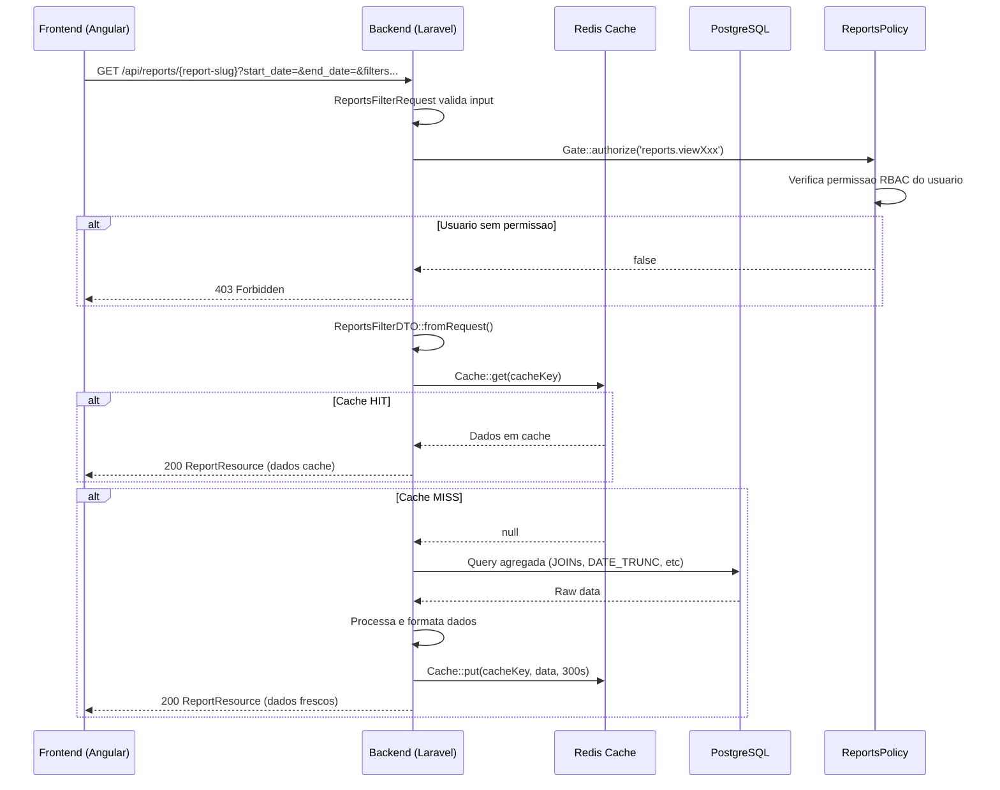

### 4.2 Fluxo de Exportacao

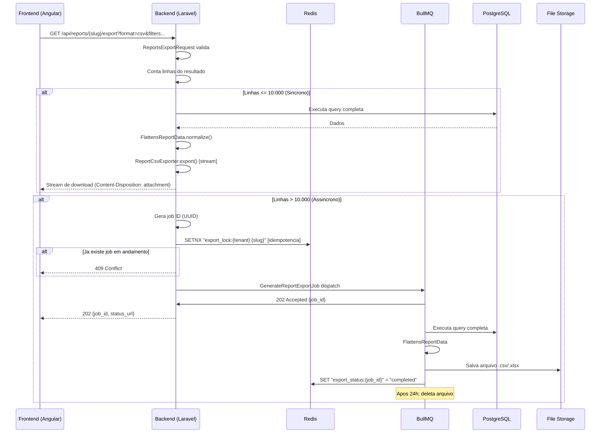

### 4.3 Fluxo de Autorizacao RBAC

```mermaid
flowchart TD
    A[Request GET /api/reports/{slug}] --> B{Gate authorize?}
    B -->|viewCrm| C[slug: sales-funnel, revenue-sales, salesperson-performance,<br/>loss-reasons, product-performance, contact-crm]
    B -->|viewChat| D[slug: sla-resolution, agent-performance,<br/>csat-nps, chat-volume]
    B -->|viewAi| E[slug: ai-usage-cost, autopilot-performance]
    B -->|viewBilling| F[slug: billing]
    B -->|viewAdmin| G[slug: team-activity]
    B -->|none| H[403 Forbidden]

    C --> I{Usuario tem reports.viewCrm?}
    D --> J{Usuario tem reports.viewChat?}
    E --> K{Usuario tem reports.viewAi?}
    F --> L{Usuario tem reports.viewBilling?}
    G --> M{Usuario tem reports.viewAdmin?}

    I -->|Sim| N[Executa GetXxxReportAction]
    I -->|Nao| H
    J -->|Sim| N
    J -->|Nao| H
    K -->|Sim| N
    K -->|Nao| H
    L -->|Sim| N
    L -->|Nao| H
    M -->|Sim| N
    M -->|Nao| H
```

### 4.4 Fluxo de Filtros e Cache

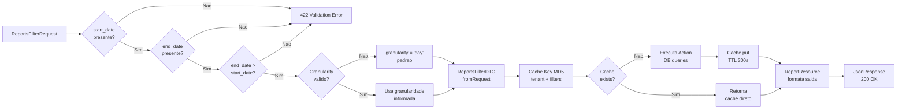

### 4.5 Fluxo de Dados — Sales Funnel

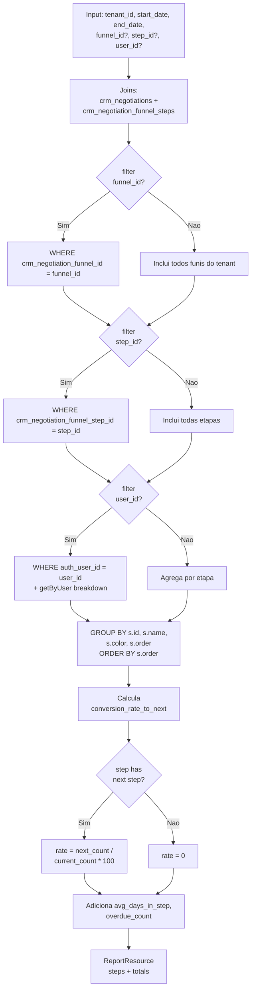

### 4.6 Fluxo de Dados — CSAT/NPS

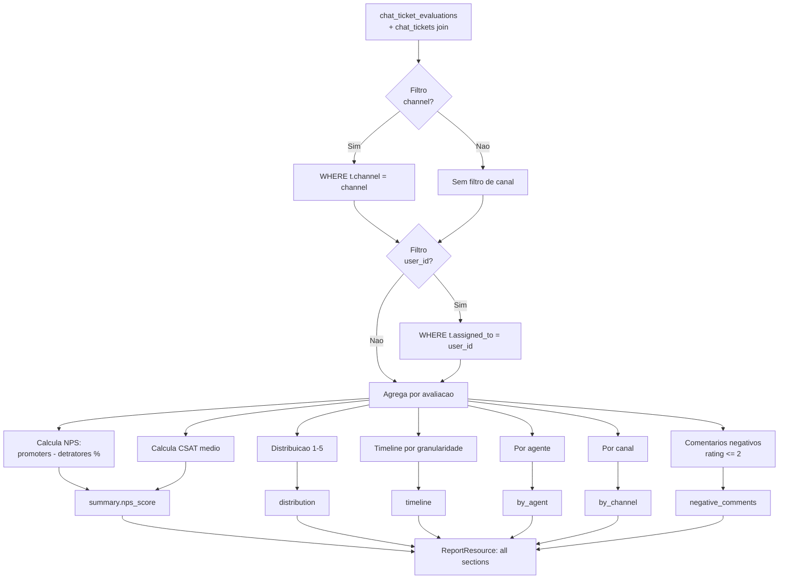

### 4.7 Fluxo de Edge Cases — Periodo Invalido

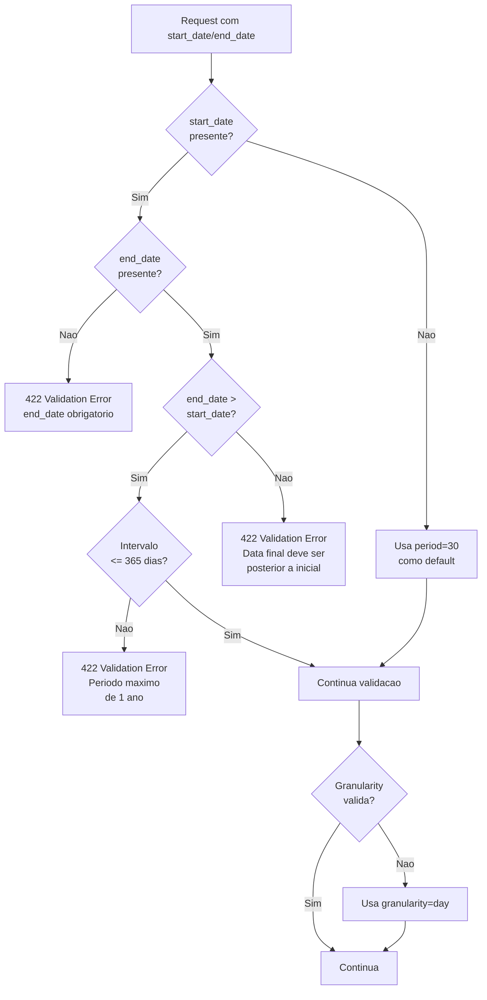

**Cenarios de Erro Tratados:**

1. `start_date` ausente: aplica periodo padrao de 30 dias
2. `end_date` ausente: retorna 422 com mensagem clara
3. `end_date` <= `start_date`: retorna 422
4. Intervalo > 365 dias: retorna 422
5. Granularity invalida: usa `day` como fallback

### 4.8 Fluxo de Edge Cases — Tenant sem Dados

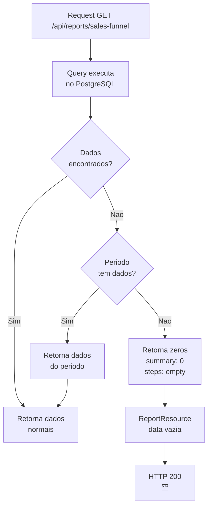

**Cenarios Tratados:**

- Tenant novo sem negociacoes: retorna zeros
- Periodo sem atividade: retorna `total_negotiations: 0`
- Funil sem etapas: retorna `steps: []`
- CSAT sem avaliacoes: retorna `csat_average: 0.0`

### 4.9 Fluxo de Edge Cases — Cache Invalido

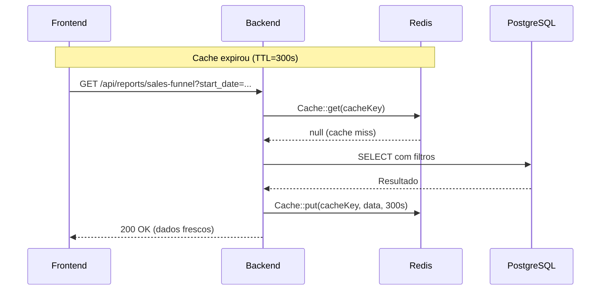

**Nota:** O cache expira automaticamente apos 300 segundos. Nao ha invalidacao manual.

### 4.10 Fluxo de Edge Cases — Rate Limiting

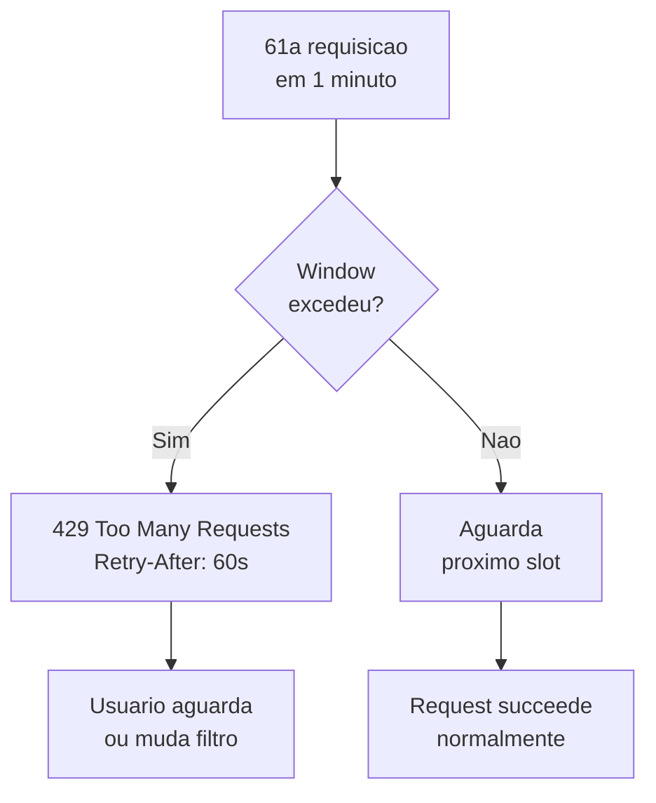

### 4.11 Fluxo de Edge Cases — UUID invalido em Filtro

```mermaid
flowchart TD
    A[user_id=nao-e-uuid] --> B{UUID<br/>valido?}
    B -->|Nao| C[422 Validation Error<br/>user_id deve ser UUID valido]
    B -->|Sim| D[Continua<br/>execucao]
    C --> E[HTTP 422<br/>{errors: {user_id: [...]}}]
```

### 4.12 Fluxo de Edge Cases — SuperAdmin Cross-Tenant

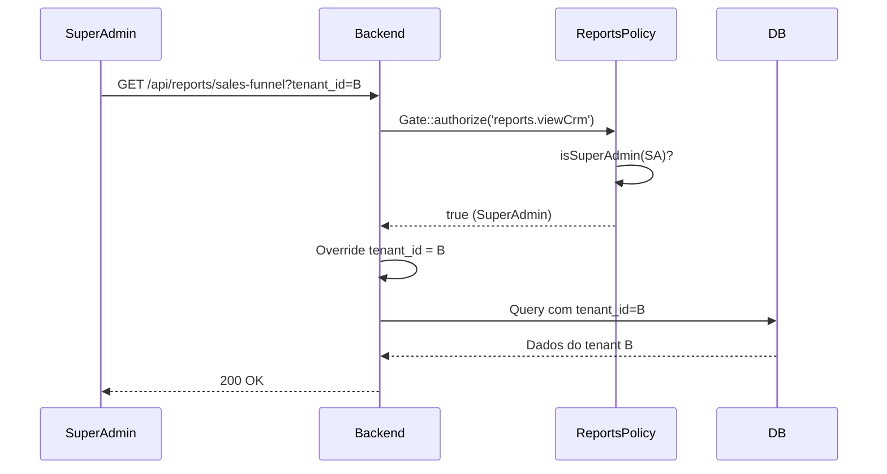

**Nota:** SuperAdmin pode ver dados de qualquer tenant, mas apenas se tiver a permissao RBAC correspondente.

### 4.7 Fluxo de Team Activity

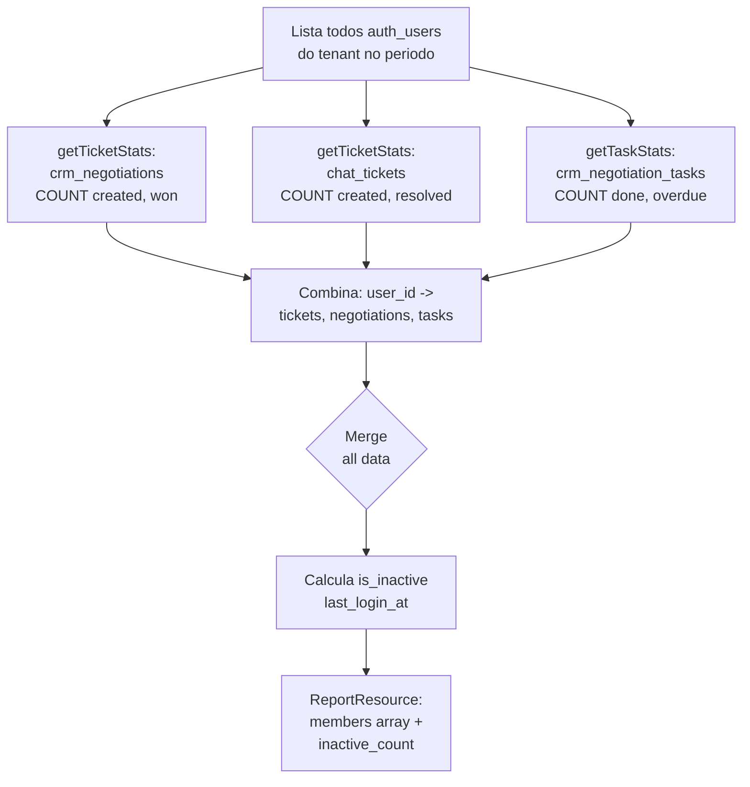

---

## 5. ENTIDADES E MODELOS

### 5.1 Tabelas e Origem de Dados por Relatorio

| Relatorio               | Tabelas Fonte                                                                                       | Dominio |
| ----------------------- | --------------------------------------------------------------------------------------------------- | ------- |
| Sales Funnel            | `crm_negotiations`, `crm_negotiation_funnel_steps`, `auth_users`                                    | CRM     |
| Revenue Sales           | `crm_negotiations`, `auth_users`, `crm_reason_losses`                                               | CRM     |
| Salesperson Performance | `crm_negotiations`, `auth_users`, `crm_negotiation_tasks`, `crm_proposals`                          | CRM     |
| Loss Reasons            | `crm_negotiations`, `crm_reason_losses`, `auth_users`, `crm_negotiation_funnel_steps`               | CRM     |
| SLA Resolution          | `chat_tickets`, `chat_tickets_extended`, `auth_users`                                               | Chat    |
| Agent Performance       | `chat_tickets`, `chat_tickets_extended`, `auth_users`, `chat_ticket_evaluations`                    | Chat    |
| CSAT/NPS                | `chat_ticket_evaluations`, `chat_tickets`, `auth_users`                                             | Chat    |
| Chat Volume             | `chat_tickets`, `chat_tickets_extended`                                                             | Chat    |
| AI Usage Cost           | `ai_usage_logs`                                                                                     | AI      |
| Billing                 | `billing_invoices`                                                                                  | Billing |
| Product Performance     | `crm_negotiations`, `crm_negotiation_products`, `crm_products`, `crm_proposals`                     | CRM     |
| Autopilot Performance   | `ai_autopilot_runs`                                                                                 | AI      |
| Team Activity           | `auth_users`, `chat_tickets`, `crm_negotiations`, `crm_negotiation_tasks`                           | Admin   |
| Contact CRM             | `crm_contacts`, `crm_companies`, `crm_contact_tags`, `crm_tags`, `crm_negotiations`, `chat_tickets` | CRM     |

### 5.2 Modelo de Dados — crm_negotiations (negociacoes/vendas)

| Campo                            | Tipo          | Descricao                                           |
| -------------------------------- | ------------- | --------------------------------------------------- |
| `id`                             | UUID          | PK                                                  |
| `tenant_id`                      | UUID          | FK -> `platform_tenants.id`                         |
| `auth_user_id`                   | UUID          | FK -> `auth_users.id` (responsavel)                 |
| `crm_contact_id`                 | UUID          | FK -> `crm_contacts.id`                             |
| `crm_company_id`                 | UUID          | FK -> `crm_companies.id`                            |
| `crm_negotiation_funnel_id`      | UUID          | FK -> `crm_negotiation_funnels.id`                  |
| `crm_negotiation_funnel_step_id` | UUID          | FK -> `crm_negotiation_funnel_steps.id`             |
| `crm_reason_loss_id`             | UUID          | FK -> `crm_reason_losses.id` (se `status = 'lost'`) |
| `amount`                         | decimal(15,2) | Valor total da negociacao                           |
| `expected_close`                 | date          | Data prevista de fechamento                         |
| `status`                         | enum          | `'open'`, `'won'`, `'lost'`                         |
| `lead_score`                     | integer       | Score de 0 a 100                                    |
| `closed_at`                      | timestamp     | Data/hora de fechamento (se aplicavel)              |
| `deleted_at`                     | timestamp     | Soft delete                                         |
| `created_at`                     | timestamp     | Data de criacao                                     |

### 5.3 Modelo de Dados — crm_negotiation_funnel_steps (etapas do funil)

| Campo                       | Tipo         | Descricao                                                    |
| --------------------------- | ------------ | ------------------------------------------------------------ |
| `id`                        | UUID         | PK                                                           |
| `tenant_id`                 | UUID         | FK                                                           |
| `crm_negotiation_funnel_id` | UUID         | FK                                                           |
| `name`                      | varchar(255) | Nome da etapa (ex: "Qualificacao", "Proposta", "Negociacao") |
| `color`                     | varchar(7)   | Hex color para representacao visual (ex: `#3B82F6`)          |
| `order`                     | integer      | Ordem de navegacao no funil                                  |

### 5.4 Modelo de Dados — chat_tickets (tickets de atendimento)

| Campo               | Tipo        | Descricao                                      |
| ------------------- | ----------- | ---------------------------------------------- |
| `id`                | UUID        | PK                                             |
| `tenant_id`         | UUID        | FK                                             |
| `ticket_number`     | varchar(50) | Numero legivel do ticket (ex: "TKT-00001")     |
| `contact_id`        | UUID        | FK -> `crm_contacts.id`                        |
| `assigned_to`       | UUID        | FK -> `auth_users.id` (agente responsavel)     |
| `instance_id`       | UUID        | FK -> `chat_instances.id`                      |
| `channel`           | enum        | `'whatsapp'`, `'telegram'`, `'webchat'`        |
| `priority`          | enum        | `'low'`, `'medium'`, `'high'`, `'urgent'`      |
| `status`            | enum        | `'pending'`, `'open'`, `'waiting'`, `'closed'` |
| `sentiment`         | varchar(50) | Sentimento detectado (opcional)                |
| `first_response_at` | timestamp   | Primeiro tempo de resposta do agente           |
| `closed_at`         | timestamp   | Data de fechamento                             |
| `deleted_at`        | timestamp   | Soft delete                                    |
| `created_at`        | timestamp   | Data de abertura                               |

### 5.5 Modelo de Dados — chat_tickets_extended (dados extendidos de tickets)

| Campo                         | Tipo      | Descricao                               |
| ----------------------------- | --------- | --------------------------------------- |
| `id`                          | UUID      | PK                                      |
| `tenant_id`                   | UUID      | FK                                      |
| `ticket_id`                   | UUID      | FK -> `chat_tickets.id`                 |
| `sla_first_response_breached` | boolean   | Violacao de SLA de primeira resposta    |
| `sla_resolution_breached`     | boolean   | Violacao de SLA de resolucao            |
| `human_takeover_at`           | timestamp | Momento em que houve intervencao humana |

### 5.6 Modelo de Dados — chat_ticket_evaluations (avaliacoes CSAT/NPS)

| Campo          | Tipo      | Descricao                      |
| -------------- | --------- | ------------------------------ |
| `id`           | UUID      | PK                             |
| `tenant_id`    | UUID      | FK                             |
| `ticket_id`    | UUID      | FK -> `chat_tickets.id`        |
| `rating`       | integer   | Nota de 1 a 5                  |
| `comment`      | text      | Comentario opcional do cliente |
| `submitted_at` | timestamp | Data de submissao da avaliacao |
| `created_at`   | timestamp | Data de criacao do registro    |

### 5.7 Modelo de Dados — ai_usage_logs (logs de uso de IA)

| Campo           | Tipo          | Descricao                                                      |
| --------------- | ------------- | -------------------------------------------------------------- |
| `id`            | UUID          | PK                                                             |
| `tenant_id`     | UUID          | FK                                                             |
| `user_id`       | UUID          | FK -> `auth_users.id` (usuario que disparou)                   |
| `feature`       | varchar(100)  | Feature que usou IA (ex: "autopilot", "summarize", "classify") |
| `model_name`    | varchar(100)  | Nome do modelo (ex: "gpt-4o", "claude-3-opus")                 |
| `provider`      | varchar(50)   | Provedor (ex: "openai", "anthropic")                           |
| `input_tokens`  | bigint        | Tokens de entrada                                              |
| `output_tokens` | bigint        | Tokens de saida                                                |
| `input_cost`    | decimal(10,6) | Custo de input em USD                                          |
| `output_cost`   | decimal(10,6) | Custo de output em USD                                         |
| `latency_ms`    | integer       | Latencia em milissegundos                                      |
| `created_at`    | timestamp     | Data/hora do log                                               |

### 5.8 Modelo de Dados — ai_autopilot_runs (execucoes de automacoes)

| Campo               | Tipo         | Descricao                                           |
| ------------------- | ------------ | --------------------------------------------------- |
| `id`                | UUID         | PK                                                  |
| `tenant_id`         | UUID         | FK                                                  |
| `playbook_id`       | UUID         | FK -> `ai_playbooks.id`                             |
| `classifier_result` | varchar(100) | Resultado do classificador (trigger type)           |
| `status`            | enum         | `'pending'`, `'running'`, `'completed'`, `'failed'` |
| `started_at`        | timestamp    | Inicio da execucao                                  |
| `completed_at`      | timestamp    | Fim da execucao                                     |
| `created_at`        | timestamp    | Data de criacao                                     |

### 5.9 Modelo de Dados — billing_invoices (faturas)

| Campo             | Tipo          | Descricao                                                    |
| ----------------- | ------------- | ------------------------------------------------------------ |
| `id`              | UUID          | PK                                                           |
| `tenant_id`       | UUID          | FK                                                           |
| `reference_month` | varchar(7)    | Mes de referencia (YYYY-MM)                                  |
| `amount`          | decimal(15,2) | Valor total                                                  |
| `status`          | enum          | `'draft'`, `'pending'`, `'paid'`, `'overdue'`, `'cancelled'` |
| `payment_method`  | varchar(50)   | Metodo (ex: "credit_card", "pix", "bank_transfer")           |
| `due_date`        | date          | Data de vencimento                                           |
| `paid_at`         | timestamp     | Data de pagamento                                            |
| `created_at`      | timestamp     | Data de criacao                                              |

### 5.10 Modelo de Dados — crm_contacts (contatos CRM)

| Campo            | Tipo         | Descricao                |
| ---------------- | ------------ | ------------------------ |
| `id`             | UUID         | PK                       |
| `tenant_id`      | UUID         | FK                       |
| `crm_company_id` | UUID         | FK -> `crm_companies.id` |
| `name`           | varchar(255) | Nome do contato          |
| `email`          | varchar(255) | Email                    |
| `phone`          | varchar(50)  | Telefone                 |
| `is_active`      | boolean      | Status ativo/inativo     |
| `deleted_at`     | timestamp    | Soft delete              |
| `created_at`     | timestamp    | Data de criacao          |

### 5.11 Modelo de Dados — crm_products (produtos)

| Campo            | Tipo         | Descricao                       |
| ---------------- | ------------ | ------------------------------- |
| `id`             | UUID         | PK                              |
| `tenant_id`      | UUID         | FK                              |
| `name`           | varchar(255) | Nome do produto                 |
| `type`           | varchar(50)  | Tipo (ex: "product", "service") |
| `stock_quantity` | integer      | Estoque atual                   |
| `deleted_at`     | timestamp    | Soft delete                     |
| `created_at`     | timestamp    | Data de criacao                 |

### 5.12 Relacionamentos Entre Entidades

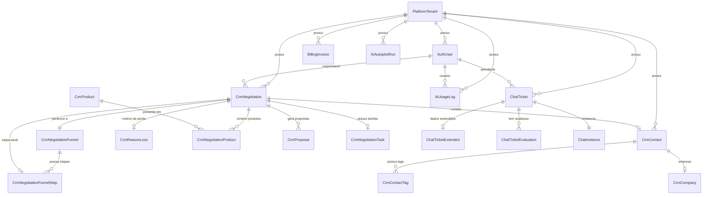

---

## 6. ENDPOINTS

### 6.1 Endpoints de Relatorios (Leitura)

| Metodo | Rota                                   | Permissao RBAC        | Descricao                                  |
| ------ | -------------------------------------- | --------------------- | ------------------------------------------ |
| GET    | `/api/reports/sales-funnel`            | `reports.viewCrm`     | Funil de vendas com conversao entre etapas |
| GET    | `/api/reports/revenue-sales`           | `reports.viewCrm`     | Receita, ticket medio e win rate           |
| GET    | `/api/reports/salesperson-performance` | `reports.viewCrm`     | Performance individual de vendedores       |
| GET    | `/api/reports/loss-reasons`            | `reports.viewCrm`     | Analise de motivos de perda                |
| GET    | `/api/reports/sla-resolution`          | `reports.viewChat`    | Metricas de SLA e tempo de resolucao       |
| GET    | `/api/reports/agent-performance`       | `reports.viewChat`    | Performance individual de agentes          |
| GET    | `/api/reports/csat-nps`                | `reports.viewChat`    | CSAT medio e NPS score                     |
| GET    | `/api/reports/chat-volume`             | `reports.viewChat`    | Volume de atendimento e heatmap            |
| GET    | `/api/reports/ai-usage-cost`           | `reports.viewAi`      | Uso e custo de IA por feature/modelo       |
| GET    | `/api/reports/billing`                 | `reports.viewBilling` | Faturamento, inadimplencia e MRR           |
| GET    | `/api/reports/product-performance`     | `reports.viewCrm`     | Performance de produtos e propostas        |
| GET    | `/api/reports/autopilot-performance`   | `reports.viewAi`      | Execucoes de automacoes                    |
| GET    | `/api/reports/team-activity`           | `reports.viewAdmin`   | Atividade e inatividade da equipe          |
| GET    | `/api/reports/contact-crm`             | `reports.viewCrm`     | Contatos CRM, cold leads e tags            |

### 6.2 Endpoint de Exportacao

| Metodo | Rota                         | Permissao RBAC   | Descricao                        |
| ------ | ---------------------------- | ---------------- | -------------------------------- |
| GET    | `/api/reports/{slug}/export` | `reports.export` | Exporta relatorio em CSV ou XLSX |

### 6.3 Parametros de Query (Filtros Comuns)

| Parametro        | Tipo   | Obrigatorio | Valores                               | Padrao | Descricao                          |
| ---------------- | ------ | ----------- | ------------------------------------- | ------ | ---------------------------------- |
| `start_date`     | date   | Sim         | YYYY-MM-DD                            | —      | Data inicial do periodo            |
| `end_date`       | date   | Sim         | YYYY-MM-DD                            | —      | Data final do periodo              |
| `granularity`    | string | Nao         | `day` \| `week` \| `month`            | `day`  | Granularidade de series temporais  |
| `user_id`        | uuid   | Nao         | UUID valido                           | null   | Filtrar por usuario especifico     |
| `funnel_id`      | uuid   | Nao         | UUID valido                           | null   | Filtrar por funil especifico (CRM) |
| `step_id`        | uuid   | Nao         | UUID valido                           | null   | Filtrar por etapa especifica (CRM) |
| `channel`        | string | Nao         | `whatsapp` \| `telegram` \| `webchat` | null   | Filtrar por canal (Chat)           |
| `instance_id`    | uuid   | Nao         | UUID valido                           | null   | Filtrar por instancia (Chat)       |
| `reason_loss_id` | uuid   | Nao         | UUID valido                           | null   | Filtrar por motivo de perda (CRM)  |
| `product_id`     | uuid   | Nao         | UUID valido                           | null   | Filtrar por produto (CRM)          |
| `export_format`  | string | Nao         | `json` \| `csv` \| `xlsx`             | `json` | Formato de saida                   |

### 6.4 Códigos de Resposta HTTP

| Codigo | Condicao                                           |
| ------ | -------------------------------------------------- |
| 200    | Sucesso — relatorio retornado                      |
| 202    | Accepted — exportacao assincrona iniciada          |
| 400    | Bad Request — parametros invalidos                 |
| 401    | Unauthorized — token ausente ou invalido           |
| 403    | Forbidden — permissao RBAC insuficiente            |
| 404    | Not Found — slug de relatorio inexistente          |
| 409    | Conflict — exportacao ja em andamento              |
| 422    | Unprocessable Entity — validacao de filtros falhou |
| 429    | Too Many Requests — rate limit excedido            |
| 500    | Internal Server Error — erro inesperado            |

### 6.5 Exemplo de Request — Sales Funnel

```http
GET /api/reports/sales-funnel?start_date=2026-01-01&end_date=2026-03-31&granularity=month&funnel_id=660e8400-e29b-41d4-a716-446655440001&user_id=550e8400-e29b-41d4-a716-446655440000
Authorization: Bearer 1|abc123def456...
Accept: application/json
```

### 6.6 Exemplo de Request — CSAT/NPS

```http
GET /api/reports/csat-nps?start_date=2026-01-01&end_date=2026-03-31&granularity=week&channel=whatsapp&user_id=550e8400-e29b-41d4-a716-446655440000
Authorization: Bearer 1|abc123def456...
Accept: application/json
```

### 6.7 Exemplo de Request — Exportacao

```http
GET /api/reports/sales-funnel/export?start_date=2026-01-01&end_date=2026-03-31&format=csv
Authorization: Bearer 1|abc123def456...
Accept: text/csv
```

### 6.8 Validacoes de Filtros por Relatorio

| Relatorio               | Filtros Especificos                      |
| ----------------------- | ---------------------------------------- |
| Sales Funnel            | `funnel_id`, `step_id`, `user_id`        |
| Revenue Sales           | `funnel_id`, `user_id`                   |
| Salesperson Performance | `funnel_id`, `user_id`                   |
| Loss Reasons            | `funnel_id`, `user_id`, `reason_loss_id` |
| SLA Resolution          | `channel`, `instance_id`, `user_id`      |
| Agent Performance       | `channel`, `instance_id`, `user_id`      |
| CSAT/NPS                | `channel`, `user_id`                     |
| Chat Volume             | `channel`, `instance_id`                 |
| AI Usage Cost           | `user_id`                                |
| Billing                 | (nenhum filtro especifico alem de datas) |
| Product Performance     | `product_id`, `funnel_id`                |
| Autopilot Performance   | (nenhum filtro especifico alem de datas) |
| Team Activity           | `user_id`                                |
| Contact CRM             | (nenhum filtro especifico alem de datas) |

---

## 7. EVENTOS

### 7.1 Eventos de Exportacao

| Evento                  | Origem     | Destino                      | Payload                                                              |
| ----------------------- | ---------- | ---------------------------- | -------------------------------------------------------------------- |
| `ReportExportStarted`   | Laravel    | Frontend (WebSocket/polling) | `{ job_id, report_slug, format, tenant_id, user_id, started_at }`    |
| `ReportExportCompleted` | BullMQ Job | Frontend + Email             | `{ job_id, report_slug, download_url, expires_at, file_size_bytes }` |
| `ReportExportFailed`    | BullMQ Job | Frontend                     | `{ job_id, error, failed_at }`                                       |

### 7.2 Eventos de Auditoria

| Evento           | Origem     | Destino   | Campos                                                                       |
| ---------------- | ---------- | --------- | ---------------------------------------------------------------------------- |
| `ReportViewed`   | Controller | Audit Log | `user_id, tenant_id, report_slug, filters_hash, viewed_at`                   |
| `ReportExported` | Controller | Audit Log | `user_id, tenant_id, report_slug, format, row_count, file_size, exported_at` |

### 7.3 Fluxo de Eventos — Exportacao Assincrona

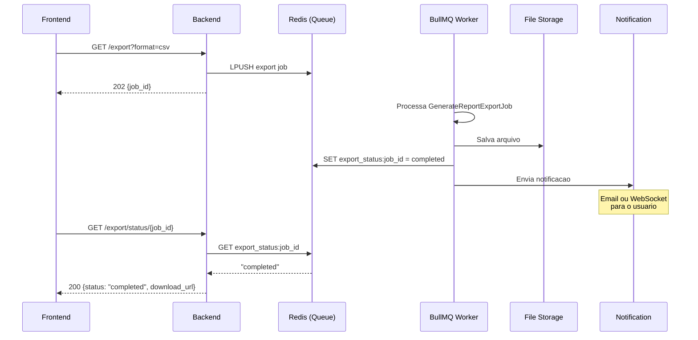

### 7.4 Webhooks (Futuro)

Em versoes futuras, o modulo Reports podera disparar webhooks para sistemas externos quando metricas ultrapassarem thresholds configurados:

| Trigger                | Condicao                | Webhook Payload                                       |
| ---------------------- | ----------------------- | ----------------------------------------------------- |
| `nps_below_threshold`  | NPS < valor configurado | `{ tenant_id, report, nps_score, threshold, period }` |
| `sla_breach_rate_high` | Taxa de violacao > X%   | `{ tenant_id, report, breach_rate, threshold }`       |
| `revenue_below_target` | Receita < meta mensal   | `{ tenant_id, report, revenue, target, period }`      |

---

## 8. SEGURANCA

### 8.1 Controle de Acesso (RBAC)

O sistema de permissoes segue o modelo RBAC do Spatie, com permissoes granulares por dominio de relatorio:

| Permissao             | Relatorios Autorizados                                                                               |
| --------------------- | ---------------------------------------------------------------------------------------------------- |
| `reports.viewCrm`     | Sales Funnel, Revenue Sales, Salesperson Performance, Loss Reasons, Product Performance, Contact CRM |
| `reports.viewChat`    | SLA Resolution, Agent Performance, CSAT/NPS, Chat Volume                                             |
| `reports.viewAi`      | AI Usage Cost, Autopilot Performance                                                                 |
| `reports.viewBilling` | Billing                                                                                              |
| `reports.viewAdmin`   | Team Activity                                                                                        |
| `reports.export`      | Qualquer endpoint de exportacao                                                                      |

### 8.2 Isolamento Multi-Tenant

O isolamento e aplicado em tres camadas:

1. **Middleware**: `BelongsToTenant` trait adiciona scope global em todos os models
2. **Controller**: `tenantId($request)` extrai o tenant_id do usuario autenticado
3. **Action**: Cada query inclui `WHERE tenant_id = $dto->tenantId`

### 8.3 Regras Inviolaveis

- **NUNCA** retornar dados de outro tenant em nenhuma circunstancia
- **NUNCA** logar parametros de filtros que possam conter informacoes sensiveis
- **NUNCA** permitir acesso via token de API (machine-to-machine) a relatorios
- **NUNCA** expor queries SQL brutas ou stack traces em ambientes de producao
- **SEMPRE** usar prepared statements (bindings de parametros) para evitar SQL injection
- **SEMPRE** validar UUIDs com `exists:` rule antes de usar em queries

### 8.4 Rate Limiting

| Tipo                           | Limite      | Janela      |
| ------------------------------ | ----------- | ----------- |
| Leitura de relatorios          | 60 req/min  | Por usuario |
| Exportacao                     | 10 req/hora | Por tenant  |
| Endpoints publicos (se houver) | 10 req/min  | Por IP      |

### 8.5 Auditoria

Todas as visualizacoes e exportacoes de relatorios sao registradas na tabela `audits` com:

- `user_id`, `tenant_id`
- `report_slug`, `filters` (hash, nao valores)
- `ip_address`, `user_agent`
- `created_at`

---

## 9. DTOs E RESOURCES

### 9.1 ReportsFilterDTO

```php
final readonly class ReportsFilterDTO
{
    public function __construct(
        public string $tenantId,
        public Carbon $startDate,
        public Carbon $endDate,
        public string $granularity = 'day',
        public ?string $userId = null,
        public ?string $funnelId = null,
        public ?string $stepId = null,
        public ?string $channel = null,
        public ?string $instanceId = null,
        public ?string $reasonLossId = null,
        public ?string $productId = null,
        public string $exportFormat = 'json',
    ) {}

    public static function fromRequest(FormRequest $request, string $tenantId): self { ... }
    public static function fromArray(array $data): self { ... }
}
```

### 9.2 ReportResource (Estrutura de Resposta Padrao)

```json
{
  "success": true,
  "message": "Relatorio de funil de vendas",
  "data": {
    "meta": {
      "report": "sales-funnel",
      "generated_at": "2026-03-28T14:30:00Z",
      "period": {
        "start": "2026-01-01",
        "end": "2026-03-31"
      },
      "filters": {
        "granularity": "day",
        "funnel_id": null,
        "step_id": null,
        "user_id": "550e8400-e29b-41d4-a716-446655440000"
      }
    },
    "report_data": {
      "steps": [ ... ],
      "total_negotiations": 142,
      "total_pipeline_value": 2850000.00,
      "by_user": [ ... ]
    }
  }
}
```

### 9.3 Sales Funnel — Estrutura de Dados

```json
{
    "steps": [
        {
            "step_name": "Qualificacao",
            "step_color": "#3B82F6",
            "step_order": 1,
            "count": 80,
            "total_amount": 1200000.0,
            "avg_days_in_step": 3.2,
            "conversion_rate_to_next": 75.0,
            "overdue_count": 5
        },
        {
            "step_name": "Proposta",
            "step_color": "#F59E0B",
            "step_order": 2,
            "count": 60,
            "total_amount": 950000.0,
            "avg_days_in_step": 5.7,
            "conversion_rate_to_next": 66.67,
            "overdue_count": 3
        }
    ],
    "total_negotiations": 140,
    "total_pipeline_value": 2150000.0,
    "by_user": []
}
```

### 9.4 CSAT/NPS — Estrutura de Dados

```json
{
    "summary": {
        "nps_score": 42.5,
        "csat_avg": 4.1,
        "total_evaluations": 892,
        "promoters": 489,
        "passives": 234,
        "detractors": 169,
        "response_rate": 68.5
    },
    "distribution": [
        { "rating": 1, "count": 42 },
        { "rating": 2, "count": 127 },
        { "rating": 3, "count": 234 },
        { "rating": 4, "count": 312 },
        { "rating": 5, "count": 177 }
    ],
    "timeline": [
        { "period": "2026-01-01", "csat_avg": 4.0, "count": 210 },
        { "period": "2026-01-08", "csat_avg": 4.2, "count": 235 }
    ],
    "by_agent": [
        { "agent_name": "Maria Santos", "csat_avg": 4.8, "count": 45 },
        { "agent_name": "Joao Silva", "csat_avg": 3.9, "count": 67 }
    ],
    "by_channel": [
        { "channel": "whatsapp", "csat_avg": 4.3, "count": 712 },
        { "channel": "webchat", "csat_avg": 3.8, "count": 180 }
    ],
    "negative_comments": [
        {
            "rating": 1,
            "comment": "Atendimento muito demorado para resolver meu problema",
            "submitted_at": "2026-03-25T10:15:00Z",
            "ticket_number": "TKT-00892",
            "channel": "whatsapp"
        }
    ]
}
```

### 9.5 AI Usage Cost — Estrutura de Dados

```json
{
    "summary": {
        "total_input_tokens": 15420000,
        "total_output_tokens": 8920000,
        "total_tokens": 24340000,
        "total_cost": 142.87,
        "avg_latency_ms": 1250.4,
        "call_count": 24891
    },
    "by_feature": [
        {
            "feature": "autopilot",
            "total_tokens": 12000000,
            "total_cost": 78.5,
            "avg_latency_ms": 2100.0,
            "call_count": 15000
        },
        {
            "feature": "summarize",
            "total_tokens": 5400000,
            "total_cost": 32.4,
            "avg_latency_ms": 800.0,
            "call_count": 8900
        }
    ],
    "by_model": [
        {
            "model_name": "gpt-4o",
            "provider": "openai",
            "total_tokens": 18000000,
            "total_cost": 108.0,
            "call_count": 18000
        },
        {
            "model_name": "claude-3-haiku",
            "provider": "anthropic",
            "total_tokens": 6340000,
            "total_cost": 34.87,
            "call_count": 6891
        }
    ],
    "top_users": [
        {
            "user_name": "Sistema Autopilot",
            "total_tokens": 9800000,
            "total_cost": 62.4,
            "call_count": 12000
        }
    ],
    "daily_cost": [
        { "period": "2026-01-01", "total_cost": 4.85, "call_count": 820 },
        { "period": "2026-01-02", "total_cost": 5.12, "call_count": 910 }
    ]
}
```

### 9.6 Billing — Estrutura de Dados

```json
{
    "summary": {
        "total_invoiced": 128500.0,
        "total_paid": 112000.0,
        "total_pending": 9500.0,
        "total_overdue": 7000.0,
        "overdue_rate": 8.5,
        "avg_days_to_pay": 5.3
    },
    "by_payment_method": [
        { "payment_method": "credit_card", "count": 45, "total_amount": 78200.0 },
        { "payment_method": "pix", "count": 28, "total_amount": 32000.0 },
        { "payment_method": "bank_transfer", "count": 12, "total_amount": 18300.0 }
    ],
    "monthly_revenue": [
        { "period": "2026-01", "total_amount": 42000.0, "paid_amount": 42000.0, "count": 30 },
        { "period": "2026-02", "total_amount": 45000.0, "paid_amount": 38500.0, "count": 33 }
    ],
    "upcoming_due": [
        {
            "id": "880e8400-e29b-41d4-a716-446655440099",
            "reference_month": "2026-03",
            "amount": 48000.0,
            "due_date": "2026-04-05",
            "status": "pending"
        }
    ]
}
```

### 9.7 Team Activity — Estrutura de Dados

```json
{
    "members": [
        {
            "user_id": "550e8400-e29b-41d4-a716-446655440000",
            "user_name": "Rafael Silva",
            "last_login_at": "2026-03-28T09:15:00Z",
            "tickets_created": 45,
            "tickets_resolved": 38,
            "negotiations_created": 12,
            "negotiations_won": 8,
            "tasks_done": 22,
            "notes_created": 15,
            "events_created": 7,
            "is_inactive": false
        }
    ],
    "inactive_count": 2
}
```

### 9.8 Contact CRM — Estrutura de Dados

```json
{
    "summary": {
        "total": 4520,
        "active": 3890,
        "inactive": 630,
        "new_in_period": 342
    },
    "by_company": [
        { "company_name": "Acme Corp", "contact_count": 89 },
        { "company_name": "TechStart", "contact_count": 67 }
    ],
    "cold_leads": {
        "no_negotiation": 1234,
        "no_chat_30_days": 876
    },
    "monthly_growth": [
        { "period": "2026-01", "new_contacts": 98 },
        { "period": "2026-02", "new_contacts": 112 }
    ],
    "top_tags": [
        { "tag_name": "VIP", "tag_color": "#EF4444", "count": 342 },
        { "tag_name": "Lead", "tag_color": "#3B82F6", "count": 289 }
    ]
}
```

---

## 10. CRITERIOS DE ACEITACAO

### 10.1 Criticos (Devem estar funcionando no launch)

| ID     | Criterio                                                                                 | Metodo de Verificacao                                                                                |
| ------ | ---------------------------------------------------------------------------------------- | ---------------------------------------------------------------------------------------------------- |
| CA-001 | Todos os 14 relatorios retornam 200 com dados corretos para um tenant com dados          | Teste Feature em cada endpoint com dados reais                                                       |
| CA-002 | Filtro de periodo (`start_date`/`end_date`) funciona corretamente em todos os relatorios | Teste com datas diferentes; verificar que `created_at` dos dados esta no intervalo                   |
| CA-003 | Dados de um tenant NAO aparecem quando acessados por usuario de outro tenant             | Teste Feature: criar 2 tenants, user A executa relatorio, verificar que dados sao apenas do tenant A |
| CA-004 | Permissoes RBAC sao verificadas em todos os 14 endpoints                                 | Teste: usuario sem `reports.viewCrm` tenta acessar sales-funnel -> 403                               |
| CA-005 | Cache funciona: segunda requisicao identica nao executa query no banco                   | Teste: primeira chamada query log; segunda chamada identica NAO executa query                        |
| CA-006 | Cache expira apos 300 segundos                                                           | Teste: aguardar 301s, terceira requisicao deve executar query novamente                              |
| CA-007 | Exportacao CSV gera arquivo valido com `Content-Disposition: attachment`                 | Teste Feature: GET /export?format=csv -> arquivo com extensao .csv e conteudo correto                |
| CA-008 | Exportacao XLSX gera arquivo valido                                                      | Teste Feature: GET /export?format=xlsx -> arquivo Excel valido com abas                              |
| CA-009 | Validacao rejeita `end_date` anterior a `start_date` com 422                             | Teste Feature: POST com datas invalidas -> 422 + mensagem de erro                                    |
| CA-010 | Soft deletes sao respeitados: registros deletados nao aparecem nos relatorios            | Teste: criar e deletar negociacao, executar sales-funnel, negociacao NAO aparece                     |

### 10.2 Funcionais (Comportamentos esperados)

| ID     | Criterio                                                               | Metodo de Verificacao                                                      |
| ------ | ---------------------------------------------------------------------- | -------------------------------------------------------------------------- |
| CA-011 | Sales Funnel calcula `conversion_rate_to_next` corretamente            | Verificar: etapa A=100, B=75 -> rate=75.0%; etapa final -> rate=0%         |
| CA-012 | CSAT/NPS calcula NPS score corretamente: promoters%-detractors%        | Teste com dados controlados: 10 promotores, 5 detratores -> NPS=50         |
| CA-013 | Loss Reasons retorna breakdown por etapa e por responsavel             | Verificar: `by_step` e `by_user` retornam matrizes corretas                |
| CA-014 | Cold leads em Contact CRM identifica contatos sem interacao em 30 dias | Teste: criar contato sem ticket em 30 dias -> aparece em `no_chat_30_days` |
| CA-015 | AI Usage Cost agrega corretamente por feature e por modelo             | Teste: mesmo modelo em multiplas features -> valores somados corretamente  |
| CA-016 | Billing Report calcula `overdue_rate` como percentual correto          | Teste: 10 faturas, 2 vencidas -> overdue_rate=20.0                         |
| CA-017 | Team Activity retorna usuarios inativos com `is_inactive=true`         | Teste: criar usuario `is_active=false` -> aparece com `is_inactive=true`   |
| CA-018 | Granularity `week` e `month` retorna dados agrupados corretamente      | Teste: verificar DATE_TRUNC em timeline queries                            |
| CA-019 | Salesperson Performance calcula win_rate, avg_ticket, avg_close_days   | Teste com dados conhecidos -> valores esperados verificados                |
| CA-020 | Product Performance calcula `acceptance_rate` de propostas             | Teste: 5 enviadas, 3 aceitas -> rate=60.0%                                 |

### 10.3 Performance

| ID     | Criterio                                                                                              | Metodo de Verificacao                      |
| ------ | ----------------------------------------------------------------------------------------------------- | ------------------------------------------ |
| CA-021 | Relatorio responde em < 2s para periodo de 1 ano com ate 10k registros                                | Benchmark: tempo de resposta < 2000ms      |
| CA-022 | Cache reduz tempo de resposta em > 90% na segunda chamada                                             | Comparar tempo primeira vs segunda chamada |
| CA-023 | Exportacao CSV com 10k linhas completa em < 30s                                                       | Benchmark de exportacao                    |
| CA-024 | Queries nao causam N+1: numero de queries executadas e constante independente do numero de resultados | Log de queries: 1 query principal, sem N+1 |

### 10.4 Seguranca

| ID     | Criterio                                    | Metodo de Verificacao                             |
| ------ | ------------------------------------------- | ------------------------------------------------- |
| CA-025 | Token invalido retorna 401                  | Teste: request sem Authorization header -> 401    |
| CA-026 | Token expirado retorna 401                  | Teste: usar token Sanctum expirado -> 401         |
| CA-027 | Rate limiting bloqueia apos 60 req/min      | Teste: 61a requisicao em 1 min -> 429             |
| CA-028 | Exportacao sem `reports.export` retorna 403 | Teste: usuario sem permissao de exportacao -> 403 |
| CA-029 | Slug invalido retorna 404                   | Teste: GET /reports/relatorio-inexistente -> 404  |
| CA-030 | UUID invalido em filtros retorna 422        | Teste: `user_id=nao-e-uuid` -> 422                |

### 10.5 UX/Frontend

| ID     | Criterio                                                       | Metodo de Verificacao                                                  |
| ------ | -------------------------------------------------------------- | ---------------------------------------------------------------------- |
| CA-031 | Componente `af-report-filters` exibe todos os campos de filtro | Inspecionar UI: start_date, end_date, granularity, filtros especificos |
| CA-032 | Relatorio exibe estados de loading durante fetch               | Verificar skeleton/spinner durante requisicao                          |
| CA-033 | Relatorio exibe estado vazio quando nao ha dados               | Testar com periodo sem dados -> empty state visivel                    |
| CA-034 | Relatorio exibe estado de erro quando API retorna erro         | Simular erro 500 -> error state visivel                                |
| CA-035 | Botao de exportacao abre dialog com formatos CSV e XLSX        | Verificar: click no botao export -> modal com opcoes                   |
| CA-036 | Filtros sao persistidos no URL para compartilhamento           | Aplicar filtros, copiar URL, abrir em outra aba -> filtros mantidos    |

### 10.6 Infraestrutura e Deploy

| ID     | Criterio                                               | Metodo de Verificacao                                       |
| ------ | ------------------------------------------------------ | ----------------------------------------------------------- |
| CA-037 | Todos os indexes de banco necessarios existem          | `EXPLAIN` nas queries principais; verificar index scan      |
| CA-038 | Cache Redis esta configurado e operacional             | `php artisan cache:table` executado; testes de cache passam |
| CA-039 | Queue BullMQ esta configurada para exports assincronos | `php artisan queue:listen` ou supervisor config verificado  |
| CA-040 | Variaveis de ambiente necessarias estao documentadas   | Verificar: `CACHE_DRIVER=redis`, `QUEUE_CONNECTION=redis`   |

---

## Historico de Revisoes

| Data       | Versao | Autor | Mudanca                                                                                                                                                             |
| ---------- | ------ | ----- | ------------------------------------------------------------------------------------------------------------------------------------------------------------------- |
| 2026-03-28 | 1.0    | PM    | Criacao inicial do PRD com todas as 14 areas de relatorios, baseada na analise completa do codigo fonte em `api/src/Domain/Reports/` e `app/src/app/pages/reports/` |
