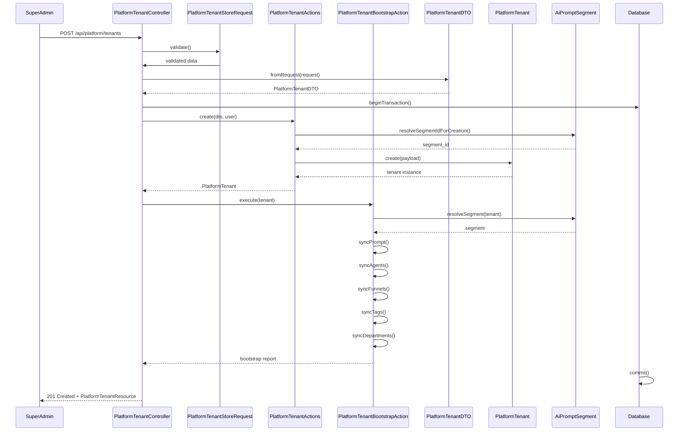
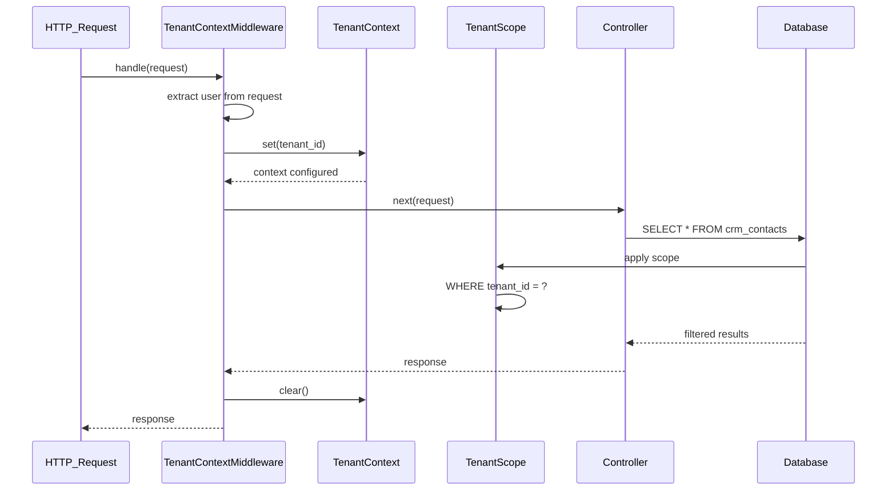
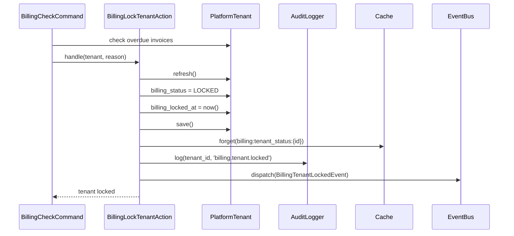
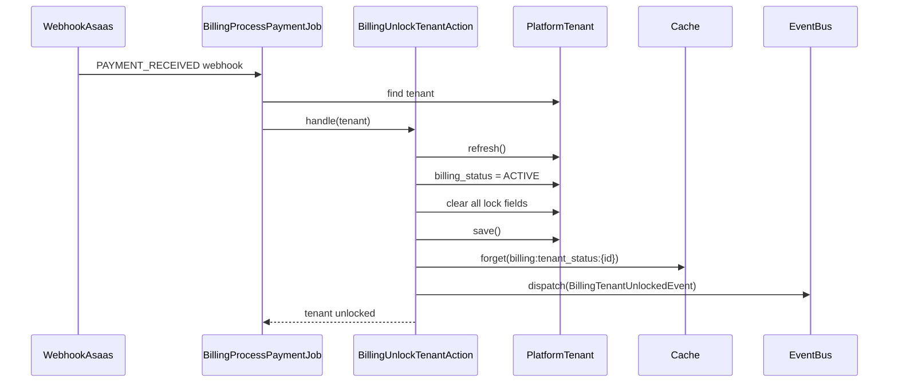
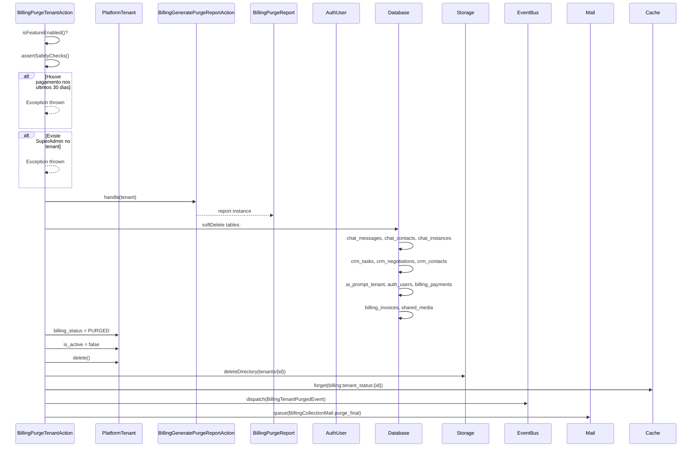
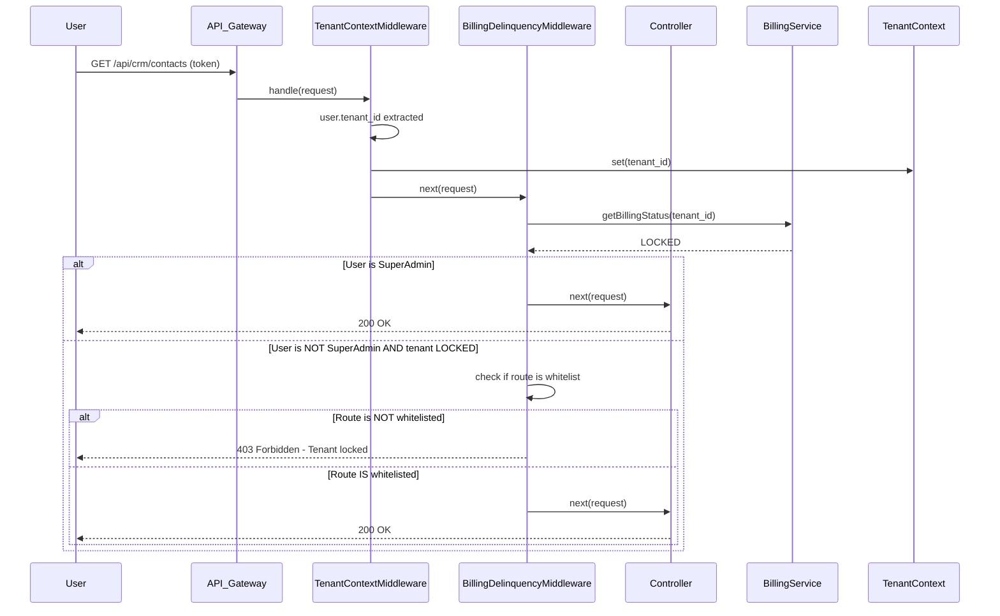
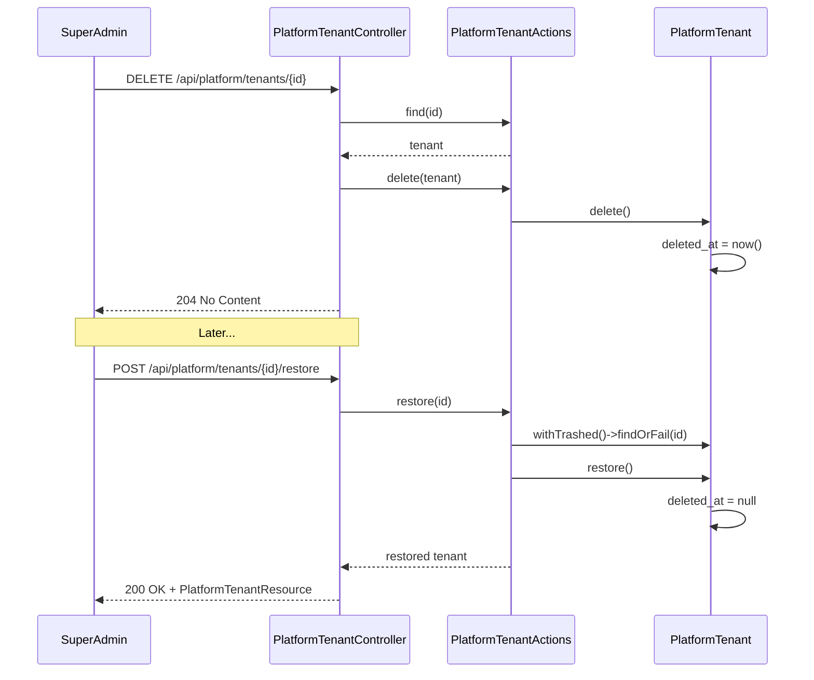

# PRD-TENANTS-001 — Modulo de Tenants InteraZap

> **Modulo:** Tenants / Multi-Tenancy
> **Status:** rascunho
> **Autor:** PM
> **Data:** 2026-03-28
> **Versao:** 1.0
> **Tags:** multi-tenant, tenant-isolation, platform, billing-status, RBAC, soft-delete, bootstrap

---

## 1. CONTEXTO

### 1.1 Posicionamento no Ecossistema

O modulo de Tenants e o nucleo da arquitetura multi-tenant do InteraZap. Ele representa a entidade central que define o isolamento de dados, controle de acesso baseado em organizacao, ciclo de vida de cobranca e gestao de recursos para cada cliente da plataforma SaaS.

O InteraZap e uma plataforma SaaS multi-tenant para comunicacao inteligente via WhatsApp com CRM, billing, AI e reporting integrados. Cada tenant representa uma organizacao/cliente distinta que opera de forma completamente isolada das demais, com usuarios propios, agentes de IA, instancias de chat, negociacoes e dados financeiros segregados.

### 1.2 Modelo de Dados Multi-Tenant

A arquitetura multi-tenant do InteraZap segue o padrao de isolacao por `tenant_id` em todas as entidades de negocio:

```
PlatformTenant (Raiz Agregadora)
    |
    +-- AuthUser (Usuarios autenticados)
    |       |
    |       +-- Spatie Roles & Permissions
    |
    +-- CRMContact
    |       +-- CRMNegotiation
    |               +-- CRMNegotiationFile
    |               +-- CRMTask
    |
    +-- ChatInstance
    |       +-- ChatMessage
    |       +-- ChatContact
    |
    +-- AiAgent
    |       +-- AiAgentSkill
    |       +-- AiAgentChannel
    |       +-- AiAgentFile
    |       +-- AiPromptTenant
    |
    +-- BillingInvoice
    |       +-- BillingPayment
    |
    +-- PlatformPlan (relacionamento)
    +-- AiPromptSegment (relacionamento)
```

Todas as entidades de negocio utilizam o trait `BelongsToTenant` que aplica automaticamente o `TenantScope` em todas as consultas, garantindo que nenhum dado seja acessado fora do contexto do tenant autenticado.

### 1.3 Historico e Evolucao

O modulo de Tenants evoluiu atraves de multiplas fases:

**Fase 1 - Infraestrutura Basica:**

- Criacao da tabela `platform_tenants` com campos basicos (id, name, document)
- Trait `BelongsToTenant` para isolacao automatica
- Global Scope `TenantScope` para filtragem por tenant_id

**Fase 2 - Autenticacao e Autorizacao:**

- Integracao com Laravel Sanctum para autenticacao via token
- Modelo `AuthUser` com relacao a `PlatformTenant`
- Integracao com Spatie Permissions para RBAC
- Papel especial `SUPER_ADMIN` com bypass de tenant scope

**Fase 3 - Gestao de Billing:**

- Campo `billing_status` com statuses: ACTIVE, GRACE, LOCKED, PENDING_PURGE, PURGED
- Data de bloqueio por inadimplencia (`billing_locked_at`)
- Prazo de cura (`grace_deadline`) e purge (`purge_deadline`)
- Integracao com modulo Billing para gestao de ciclo de receita

**Fase 4 - Bootstrap de Tenant:**

- `PlatformTenantBootstrapAction` para provisionamento automatico
- Catalogo de defaults por segmento: GENERAL, SAAS, ECOMMERCE, HEALTHCARE, REAL_ESTATE
- Criacao automatica de agentes, funis, tags, departamentos e prompt de IA

**Fase 5 - Recursos de Midia:**

- Configuracoes de transcricao de audio/video/imagem
- Limites maximos por tipo de midia
- Integracao com servicos de transcricao

### 1.4 Arquitetura Geral

A arquitetura do modulo Tenants segue o padrao DDD (Domain-Driven Design):

```
HTTP Request
  -> FormRequest (validacao)
    -> Controller (autorizacao via Policy + delegate)
      -> DTO::fromRequest()
        -> Action::execute() (logica de negocio pura)
          -> Model::update() / Model::create()
          -> TenantContext::set() (contexto de tenant)
          -> Event::dispatch() (eventos internos)
        -> Resource::make() (formatacao de resposta)
  -> JsonResponse
```

**Decisoes Arquiteturais Chave:**

| Decisao                                 | Justificativa                                                                               |
| --------------------------------------- | ------------------------------------------------------------------------------------------- |
| UUID como PK em todos os models         | Evita enumeracao de IDs e facilita distribuicao horizontal                                  |
| Trait `BelongsToTenant` + `TenantScope` | Isolacao automatica em nivel de query; nenhum developer pode esquecer de filtrar por tenant |
| SuperAdmin bypass de tenant scope       | SuperAdmin e plataforma precisa acessar qualquer tenant para suporte e gestao               |
| `TenantContext` com stack para nesting  | Permite operacoes cross-tenant em background jobs sem perder contexto original              |
| `TenantContextMiddleware` por request   | Garante que todo request HTTP tenha o contexto de tenant corretamente configurado           |
| Bootstrap on-demand na criacao          | Proporciona tenant ja operacional imediatamente apos criacao                                |
| Soft delete com cascade                 | Permite recuperacao de tenant excluido e mantem audit trail                                 |

### 1.5 Integracoes com Outros Modulos

O modulo Tenants e integrado com todos os outros modulos da plataforma:

**Auth (Autenticacao):**

- `AuthUser` possui `tenant_id` que referencia `PlatformTenant`
- Middleware de autenticacao extrai `tenant_id` do usuario autenticado
- Spatie Permissions com guarda `sanctum` para controle de acessos

**Billing (Cobranca):**

- `PlatformTenant.billing_status` controla ciclo de inadimplencia
- `BillingLockTenantAction`, `BillingUnlockTenantAction`, `BillingPurgeTenantAction`
- Eventos: `BillingTenantGraceEvent`, `BillingTenantLockedEvent`, `BillingTenantUnlockedEvent`, `BillingTenantPurgedEvent`

**CRM:**

- Contagens de negociacoes para calculo de limites de plano
- Funis e etapas de negociacao criados no bootstrap
- Tags e departamentos inicializados por segmento

**Chat:**

- `ChatInstance` relacionada ao tenant para multiplas instancias WhatsApp
- Contagem de instancias para validacao de limites de plano

**AI:**

- `AiPromptSegment` define o segmento de prompts por defeito
- `AiPromptTenant` armazenado por tenant
- Agentes AI provisionados no bootstrap conforme catalogo

**Configuration:**

- Configuracoes de transcricao de midia por tenant
- Limites de audio/video/imagem

### 1.6 Ciclo de Vida do Tenant

```
CRIADO (New Tenant)
  |
  v [POST /api/platform/tenants]
BOOTSTRAP: agentes, funis, tags, departamentos, prompt AI
  |
  v [ativo e operacional]
ATIVO (ACTIVE)
  |
  +-- [pagamento em dia] --> permanece ACTIVE
  |
  +-- [pagamento vencido] --> GRACE (5 dias)
  |       |
  |       v [sem pagamento]
  |   BLOQUEADO (LOCKED)
  |       |
  |       +-- [regularizacao] --> ACTIVE
  |       |
  |       v [30 dias bloqueado]
  |   PENDENTE PURGE (PENDING_PURGE)
  |       |
  |       +-- [regularizacao] --> ACTIVE
  |       |
  |       v [prazo expirado]
  |   PURGADO (PURGED) --> soft delete + dados removidos
  |
  +-- [delete manual por SuperAdmin] --> SOFT DELETED
        |
        v [restore por SuperAdmin]
      RESTORED --> volta para status anterior
```

### 1.7 Estados de Billing

O campo `billing_status` controla o acesso do tenant a plataforma:

| Status        | Label                | Acesso  | Descricao                                                                  |
| ------------- | -------------------- | ------- | -------------------------------------------------------------------------- |
| ACTIVE        | Ativo                | TOTAL   | Tenant com acesso completo a todas as funcionalidades                      |
| GRACE         | Periodo de gracia    | TOTAL   | Atraso de ate 5 dias; sistema envia lembretes                              |
| LOCKED        | Bloqueado            | PARCIAL | Middleware bloqueia funcionalidades operacionais; apenas rotas de cobranca |
| PENDING_PURGE | Pendente de exclusao | MINIMO  | Exclusao agendada; apenas SuperAdmin pode intervir                         |
| PURGED        | Excluido             | NENHUM  | Todos os dados removidos; apenas relatorio LGPD disponivel                 |

---

## 2. OBJETIVO

### 2.1 Proposta de Valor

O modulo de Tenants prove a infraestrutura fundamental para operacao multi-tenant do InteraZap, garantindo:

1. **Isolamento Completo de Dados:** Cada tenant opera com dados completamente segregados, impossibilitando vazamento cross-tenant
2. **Gestao Centralizada de Ciclo de Vida:** Desde a criacao ate a purgacao, todo o ciclo de vida do tenant e gerenciado de forma centralizada
3. **Provisionamento Automatico:** Novos tenants sao criados ja operacionais com agentes, funis e configuracoes padronizadas por segmento
4. **Controle de Acesso Granular:** Sistema de permissoes por tenant com bypass para SuperAdmin
5. **Integracao com Billing:** Status de billing afeta diretamente o acesso do tenant a plataforma

### 2.2 Objetivos Funcionais

OF-001: Permitir criacao de novo tenant com todos os dados bootstrapados automaticamente
OF-002: Permitir visualizacao detalhada de tenant incluindo empresa, plano e recursos consumidos
OF-003: Permitir atualizacao de dados cadastrais do tenant (nome, email, endereco)
OF-004: Permitir listagem paginada e filtrada de tenants com busca por nome, email, CNPJ
OF-005: Permitir soft delete de tenant com possibilidade de restore
OF-006: Permitir force delete (exclusao permanente) de tenant purgado
OF-007: Permitir ativacao e inativacao manual de tenant
OF-008: Exportar lista de tenants para CSV com dados basicos
OF-009: Garantir que todos os dados sejam automaticamente filtrados por tenant_id
OF-010: Permitir que SuperAdmin acesse qualquer tenant sem restricao de scope
OF-011: Manter contexto de tenant em background jobs sem perder referencia
OF-012: Controlar acesso baseado no billing_status do tenant

### 2.3 Objetivos Nao Funcionais

ONF-001: Tempo de resposta da API < 200ms para operacoes de leitura
ONF-002: Criacao de tenant com bootstrap completo < 5 segundos
ONF-003: Isolamento de dados garantido em nivel de query builder (nao apenas applicacao)
ONF-004: Middleware executa em < 5ms por request
ONF-005: Sistema deve suportar 500+ tenants ativos simultaneos

---

## 3. REGRAS DE NEGOCIO

### 3.1 Regras de Identificacao

| ID         | Regra                                                                                                                       | Prioridade |
| ---------- | --------------------------------------------------------------------------------------------------------------------------- | ---------- |
| RN-TEN-001 | Todo tenant deve ter um `id` do tipo UUID como chave primaria, nunca auto-increment                                         | Critica    |
| RN-TEN-002 | Todo tenant deve ter um `tenant_code` unico gerado automaticamente (8 caracteres alfanumericos maiusculos) se nao fornecido | Alta       |
| RN-TEN-003 | O campo `tenant_code` deve ser unico no sistema e imutavel apos criacao                                                     | Alta       |
| RN-TEN-004 | Todo tenant deve ter `name` obrigatorio com maximo de 255 caracteres                                                        | Alta       |
| RN-TEN-005 | Todo tenant deve ter `primary_email` para comunicacoes de billing e sistema                                                 | Alta       |
| RN-TEN-006 | O campo `document` (CNPJ/CPF) e opcional mas deve ser unico se fornecido, com maximo de 32 caracteres                       | Media      |
| RN-TEN-007 | O `billing_webhook_token` e gerado automaticamente na criacao (UUID) para validacao de webhooks                             | Alta       |
| RN-TEN-008 | SuperAdmin ao criar tenant tern seu `segment_id` forcado para 'SAAS'                                                        | Alta       |

### 3.2 Regras de Isolamento

| ID         | Regra                                                                                                               | Prioridade |
| ---------- | ------------------------------------------------------------------------------------------------------------------- | ---------- |
| RN-TEN-010 | Todo model que usa `BelongsToTenant` deve aplicar `TenantScope` automaticamente                                     | Critica    |
| RN-TEN-011 | Queries em models tenant-scoped devem SEMPRE incluir filtro por `tenant_id`                                         | Critica    |
| RN-TEN-012 | SuperAdmin (papel `SUPER_ADMIN`) pode fazer bypass do `TenantScope` usando `withoutGlobalScope(TenantScope::class)` | Critica    |
| RN-TEN-013 | O `TenantContextMiddleware` deve extrair `tenant_id` do usuario autenticado e configurar contexto                   | Critica    |
| RN-TEN-014 | O `TenantContext` deve suportar nested context via push/pop para background jobs                                    | Alta       |
| RN-TEN-015 | Operacoes cross-tenant devem usar `TenantContext::run($tenantId, callback)`                                         | Alta       |
| RN-TEN-016 | Middleware deve bloquear requests onde `X-Tenant-ID` header difere do tenant do usuario autenticado                 | Critica    |
| RN-TEN-017 | Respostas de API devem incluir header `X-Tenant-ID` para debugging                                                  | Media      |

### 3.3 Regras de Ciclo de Vida

| ID         | Regra                                                                                                          | Prioridade |
| ---------- | -------------------------------------------------------------------------------------------------------------- | ---------- |
| RN-TEN-020 | A criacao de tenant deve triggers o `PlatformTenantBootstrapAction` para provisionar dados iniciais            | Critica    |
| RN-TEN-021 | O bootstrap deve criar agentes padrao conforme catalogo do segmento                                            | Alta       |
| RN-TEN-022 | O bootstrap deve criar funis de negociacao padrao conforme catalogo                                            | Alta       |
| RN-TEN-023 | O bootstrap deve criar tags e departamentos conforme catalogo                                                  | Alta       |
| RN-TEN-024 | O bootstrap deve criar o `AiPromptTenant` inicial baseado no segmento                                          | Alta       |
| RN-TEN-025 | Soft delete de tenant deve cascade para todos os dados relacionados via `deleted_at`                           | Alta       |
| RN-TEN-026 | Restore de tenant deve recuperar todos os dados com `deleted_at`                                               | Media      |
| RN-TEN-027 | Force delete (exclusao permanente) deve remover dados fisicamente apenas para tenants ja purgados pelo billing | Critica    |
| RN-TEN-028 | Tenant com `billing_status` = PURGED pode passar por force delete                                              | Alta       |
| RN-TEN-029 | Tenant com `billing_status` diferente de PURGED nao pode passar por force delete                               | Critica    |
| RN-TEN-030 | O campo `is_active` controla disponibilidade do tenant independentedo billing_status                           | Media      |

### 3.4 Regras de Billing e Status

| ID         | Regra                                                                                                                         | Prioridade |
| ---------- | ----------------------------------------------------------------------------------------------------------------------------- | ---------- |
| RN-TEN-040 | `billing_status` deve ser um dos valores: ACTIVE, GRACE, LOCKED, PENDING_PURGE, PURGED                                        | Critica    |
| RN-TEN-041 | Tenant com `billing_status` = LOCKED ou PENDING_PURGE ou PURGED deve ter acesso bloqueado pelo `BillingDelinquencyMiddleware` | Critica    |
| RN-TEN-042 | Middleware deve permitir acesso irrestrito para SuperAdmin mesmo com tenant bloqueado                                         | Critica    |
| RN-TEN-043 | Tenant em GRACE continua com acesso total por 5 dias antes do bloqueio                                                        | Alta       |
| RN-TEN-044 | O campo `grace_deadline` define quando termina o periodo de gracia                                                            | Alta       |
| RN-TEN-045 | O campo `purge_deadline` define quando o purge automatico sera executado                                                      | Alta       |
| RN-TEN-046 | `billing_locked_at` registra timestamp do bloqueio por inadimplencia                                                          | Alta       |
| RN-TEN-047 | `billing_lock_reason` registra razao do bloqueio                                                                              | Media      |
| RN-TEN-048 | `isLocked()` retorna true apenas quando billing_status = LOCKED                                                               | Alta       |
| RN-TEN-049 | `isInGrace()` retorna true apenas quando billing_status = GRACE                                                               | Alta       |
| RN-TEN-050 | `isPendingPurge()` retorna true apenas quando billing_status = PENDING_PURGE                                                  | Alta       |
| RN-TEN-051 | Unlock de tenant deve limpar todos os campos de inadimplencia                                                                 | Alta       |
| RN-TEN-052 | Cache Redis de status de billing deve ser invalidado em qualquer mudanca de status                                            | Alta       |

### 3.5 Regras de Recursos de Midia

| ID         | Regra                                                                                   | Prioridade |
| ---------- | --------------------------------------------------------------------------------------- | ---------- |
| RN-TEN-060 | `media_transcription_audio_enabled` controla se transcricao de audio esta ativa         | Media      |
| RN-TEN-061 | `media_transcription_video_enabled` controla se transcricao de video esta ativa         | Media      |
| RN-TEN-062 | `media_transcription_image_enabled` controla se transcricao de imagem esta ativa        | Media      |
| RN-TEN-063 | `media_transcription_audio_max_minutes` define limite de minutos de audio por mensagem  | Media      |
| RN-TEN-064 | `media_transcription_image_max_per_message` define limite de imagens por mensagem       | Media      |
| RN-TEN-065 | `media_transcription_video_max_seconds` define limite de segundos de video por mensagem | Media      |

### 3.6 Regras de Autorizacao

| ID         | Regra                                                                                              | Prioridade |
| ---------- | -------------------------------------------------------------------------------------------------- | ---------- |
| RN-TEN-070 | Apenas SuperAdmin ou usuarios com permissao `platform.tenants.manage` podem criar tenants          | Critica    |
| RN-TEN-071 | Apenas SuperAdmin ou usuarios com permissao `platform.tenants.manage` podem atualizar tenants      | Critica    |
| RN-TEN-072 | Apenas SuperAdmin ou usuarios com permissao `platform.tenants.manage` podem deletar tenants        | Critica    |
| RN-TEN-073 | Qualquer usuario autenticado pode visualizar detalhes do proprio tenant                            | Alta       |
| RN-TEN-074 | Listagem de tenants disponivel apenas para SuperAdmin ou quem tem `platform.tenants.manage`        | Critica    |
| RN-TEN-075 | Toggle de active/inactive disponivel apenas para SuperAdmin ou quem tem `platform.tenants.manage`  | Alta       |
| RN-TEN-076 | Restore de tenant deletado disponivel apenas para SuperAdmin ou quem tem `platform.tenants.manage` | Alta       |
| RN-TEN-077 | Force delete disponivel apenas para SuperAdmin                                                     | Critica    |

### 3.7 Regras de Integracao com Asaas

| ID         | Regra                                                                                       | Prioridade |
| ---------- | ------------------------------------------------------------------------------------------- | ---------- |
| RN-TEN-080 | Todo tenant deve ter `asaas_customer_id` para integracao com gateway de pagamento           | Alta       |
| RN-TEN-081 | `asaas_customer_id` e criado automaticamente na primeira geracao de cobranca se nao existir | Alta       |
| RN-TEN-082 | O `billing_webhook_token` e usado para validar autenticidade de webhooks do Asaas           | Critica    |

### 3.8 Regras de Segmento e Plano

| ID         | Regra                                                                                          | Prioridade |
| ---------- | ---------------------------------------------------------------------------------------------- | ---------- |
| RN-TEN-090 | Todo tenant deve ter `segment_id` que referencia `AiPromptSegment`                             | Alta       |
| RN-TEN-091 | Todo tenant deve ter `plan_id` que referencia `PlatformPlan`                                   | Critica    |
| RN-TEN-092 | Segmento determina o catalogo de bootstrap (GENERAL, SAAS, ECOMMERCE, HEALTHCARE, REAL_ESTATE) | Alta       |
| RN-TEN-093 | SuperAdmin criando tenant tern segmento forcado para SAAS                                      | Alta       |
| RN-TEN-094 | Se nenhum segmento for fornecido na criacao, usar GENERAL como padrao                          | Alta       |

---

## 4. FLUXOS

### 4.1 Fluxo de Criacao de Tenant



### 4.2 Fluxo de Isolamento de Tenant por Request



### 4.3 Fluxo de Billing - Bloqueio por Inadimplencia



### 4.4 Fluxo de Billing - Desbloqueio



### 4.5 Fluxo de Purge de Tenant



### 4.6 Fluxo de Acesso com Tenant Bloqueado



### 4.7 Fluxo de Soft Delete e Restore



---

## 5. ENTIDADES E MODELOS

### 5.1 PlatformTenant

**Localizacao:** `api/src/Domain/Platform/Models/PlatformTenant.php`

**Descricao:** Entidade raiz da arquitetura multi-tenant, representando os clientes do SaaS.

**Tabela:** `platform_tenants`

**Campos:**

| Campo                                     | Tipo        | Nulavel | Descricao                                                        |
| ----------------------------------------- | ----------- | ------- | ---------------------------------------------------------------- |
| id                                        | UUID        | NAO     | Chave primaria                                                   |
| name                                      | string(255) | NAO     | Nome da organizacao                                              |
| tenant_code                               | string(12)  | SIM     | Codigo unico alfanumerico                                        |
| primary_email                             | string(255) | SIM     | Email principal para comunicacoes                                |
| document                                  | string(32)  | SIM     | CNPJ ou CPF                                                      |
| phone                                     | string(20)  | SIM     | Telefone de contato                                              |
| street                                    | string(255) | SIM     | Logradouro do endereco                                           |
| number                                    | string(20)  | SIM     | Numero do endereco                                               |
| complement                                | string(120) | SIM     | Complemento do endereco                                          |
| district                                  | string(120) | SIM     | Bairro                                                           |
| city                                      | string(120) | SIM     | Cidade                                                           |
| state                                     | string(2)   | SIM     | UF                                                               |
| zip_code                                  | string(20)  | SIM     | CEP                                                              |
| is_active                                 | boolean     | NAO     | Se o tenant esta ativo (default: true)                           |
| segment_id                                | UUID        | SIM     | FK para ai_prompt_segments                                       |
| plan_id                                   | UUID        | NAO     | FK para platform_plans                                           |
| billing_status                            | enum        | NAO     | Status de billing (ACTIVE, GRACE, LOCKED, PENDING_PURGE, PURGED) |
| billing_locked_at                         | datetime    | SIM     | Data/hora do bloqueio                                            |
| billing_lock_reason                       | string      | SIM     | Razao do bloqueio                                                |
| billing_grace_deadline                    | date        | SIM     | Termino do periodo de gracia                                     |
| billing_purge_deadline                    | date        | SIM     | Data para purge automatico                                       |
| last_collection_sent_at                   | datetime    | SIM     | Ultimo lembrete enviado                                          |
| collection_count                          | integer     | NAO     | Contagem de lembretes enviados                                   |
| asaas_customer_id                         | string      | SIM     | ID do cliente no gateway Asaas                                   |
| billing_webhook_token                     | string      | SIM     | Token para validacao de webhooks                                 |
| media_transcription_audio_enabled         | boolean     | NAO     | Transcricao de audio habilitada                                  |
| media_transcription_video_enabled         | boolean     | NAO     | Transcricao de video habilitada                                  |
| media_transcription_image_enabled         | boolean     | NAO     | Transcricao de imagem habilitada                                 |
| media_transcription_audio_max_minutes     | integer     | NAO     | Limite de minutos de audio                                       |
| media_transcription_image_max_per_message | integer     | NAO     | Limite de imagens por mensagem                                   |
| media_transcription_video_max_seconds     | integer     | NAO     | Limite de segundos de video                                      |
| created_at                                | datetime    | NAO     | Timestamp de criacao                                             |
| updated_at                                | datetime    | NAO     | Timestamp de atualizacao                                         |
| deleted_at                                | datetime    | SIM     | Timestamp de exclusao logica                                     |

**Relacionamentos:**

```php
// Segmento de prompts de IA
public function segment(): BelongsTo
{
    return $this->belongsTo(AiPromptSegment::class, 'segment_id');
}

// Plano ativo do tenant
public function plan(): BelongsTo
{
    return $this->belongsTo(PlatformPlan::class, 'plan_id');
}

// Prompt do tenant
public function aiPrompt(): HasOne
{
    return $this->hasOne(AiPromptTenant::class, 'tenant_id');
}

// Instancias de chat (WhatsApp)
public function chatInstances(): HasMany
{
    return $this->hasMany(ChatInstance::class, 'tenant_id');
}

// Logs de cobranca
public function collectionLogs(): HasMany
{
    return $this->hasMany(BillingCollectionLog::class, 'tenant_id');
}

// Relatorio de purge mais recente
public function purgeReport(): HasOne
{
    return $this->hasOne(BillingPurgeReport::class, 'tenant_id')->latestOfMany('purged_at');
}
```

**Metodos:**

```php
// Verifica se o tenant esta bloqueado por inadimplencia
public function isLocked(): bool

// Verifica se o tenant esta em periodo de gracia
public function isInGrace(): bool

// Verifica se o tenant esta pendente de purge
public function isPendingPurge(): bool
```

**Casts:**

```php
protected $casts = [
    'is_active' => 'boolean',
    'billing_status' => BillingTenantStatus::class,
    'billing_locked_at' => 'datetime',
    'billing_grace_deadline' => 'date',
    'billing_purge_deadline' => 'date',
    'last_collection_sent_at' => 'datetime',
    'collection_count' => 'integer',
    'media_transcription_audio_enabled' => 'boolean',
    'media_transcription_image_enabled' => 'boolean',
    'media_transcription_video_enabled' => 'boolean',
    'media_transcription_audio_max_minutes' => 'integer',
    'media_transcription_image_max_per_message' => 'integer',
    'media_transcription_video_max_seconds' => 'integer',
];
```

**Soft Deletes:** Sim (trait `SoftDeletes`)

**Factory:** `PlatformTenantFactory`

---

### 5.2 AuthUser

**Localizacao:** `api/src/Domain/Auth/Models/AuthUser.php`

**Descricao:** Modelo de usuario autenticado com suporte a multi-tenancy e RBAC.

**Tabela:** `auth_users`

**Campos Principais:**

| Campo                     | Tipo        | Nulavel | Descricao                    |
| ------------------------- | ----------- | ------- | ---------------------------- |
| id                        | UUID        | NAO     | Chave primaria               |
| tenant_id                 | UUID        | NAO     | FK para platform_tenants     |
| name                      | string(255) | NAO     | Nome do usuario              |
| email                     | string(255) | NAO     | Email unico                  |
| password                  | string      | NAO     | Hash de senha                |
| phone                     | string      | SIM     | Telefone                     |
| avatar_url                | string      | SIM     | URL do avatar                |
| is_active                 | boolean     | NAO     | Se o usuario esta ativo      |
| two_factor_enabled        | boolean     | NAO     | Se 2FA esta habilitado       |
| two_factor_secret         | string      | SIM     | Segredo TOTP                 |
| two_factor_recovery_codes | json        | SIM     | Cores de recuperacao 2FA     |
| email_verified_at         | datetime    | SIM     | Data de verificacao de email |

**Traits Utilizados:**

```php
use BelongsToTenant;           // Isolamento multi-tenant
use HasApiTokens;             // Laravel Sanctum
use HasRoles;                 // Spatie Permissions
use HasFactory;               // Factories
use HasUuids;                 // UUIDs
use Notifiable;               // Notificacoes
use SoftDeletes;              // Soft deletes
use Auditable;                // Auditoria (OwenIt)
```

**Metodos:**

```php
// Verifica se o usuario e SuperAdmin
public function isSuperAdmin(): bool

// Override do can() para verificar token abilities
public function can($abilities, $arguments = []): bool
```

**Relacionamentos:**

```php
// Tenant do usuario
public function tenant(): BelongsTo
{
    return $this->belongsTo(PlatformTenant::class, 'tenant_id');
}
```

**Guard:** `sanctum`

---

### 5.3 BillingTenantStatus (Enum)

**Localizacao:** `api/src/Domain/Billing/Enums/BillingTenantStatus.php`

**Descricao:** Enum com os possiveis status de billing do tenant.

**Valores:**

| Valor         | Label                | Cor UI  | isBlocked() |
| ------------- | -------------------- | ------- | ----------- |
| ACTIVE        | Ativo                | success | false       |
| GRACE         | Periodo de gracia    | warning | false       |
| LOCKED        | Bloqueado            | danger  | true        |
| PENDING_PURGE | Pendente de exclusao | warning | true        |
| PURGED        | Excluido             | default | true        |

**Metodos:**

```php
// Label amigavel para exibicao
public function label(): string

// Cor para exibicao na UI
public function color(): string

// Informa se o tenant esta com acesso bloqueado
public function isBlocked(): bool
```

---

### 5.4 AuthRole

**Localizacao:** `api/src/Domain/Auth/Models/AuthRole.php`

**Descricao:** Modelo de papel de usuario com UUID e prefixo de tabela.

**Tabela:** `auth_roles`

**Constantes:**

```php
public const SUPER_ADMIN = 'super-admin';
public const MANAGER = 'Gerente';
public const AGENT = 'Atendente';
public const SUPER_ADMIN_ID = '00000000-0000-4000-8000-000000000001';
```

**Guard:** `sanctum`

---

### 5.5 TenantScope

**Localizacao:** `api/src/Domain/Shared/Scopes/TenantScope.php`

**Descricao:** Global scope que filtra queries automaticamente por tenant_id.

**Logica:**

```php
public function apply(Builder $builder, Model $model): void
{
    $tenantId = TenantContext::get();

    if ($tenantId === null && auth()->check()) {
        $tenantId = auth()->user()->tenant_id ?? null;
    }

    if ($tenantId === null) {
        return;
    }

    $table = $model->getTable();
    $builder->where("{$table}.tenant_id", $tenantId);
}
```

---

### 5.6 BelongsToTenant (Trait)

**Localizacao:** `api/src/Domain/Shared/Concerns/BelongsToTenant.php`

**Descricao:** Trait para models que pertencem a um tenant.

**Uso:**

```php
final class CRMContact extends Model
{
    use BelongsToTenant;
}
```

**Funcionalidades:**

- Aplica `TenantScope` automaticamente no boot
- Provee relacionamento `tenant()`
- Provee scope `forTenant(Builder $query, string $tenantId)`

---

### 5.7 TenantContext

**Localizacao:** `api/src/Domain/Shared/Support/TenantContext.php`

**Descricao:** Contexto de tenant com suporte a nested execution.

**Metodos Principais:**

```php
// Substitui o contexto atual
TenantContext::set(?string $tenantId): void

// Adiciona um contexto mantendo o anterior
TenantContext::push(?string $tenantId): void

// Restaura o contexto anterior
TenantContext::pop(): void

// Limpa todos os contextos
TenantContext::clear(): void

// Obtem o tenant atual
TenantContext::get(): ?string

// Executa callback com contexto específico
TenantContext::run(?string $tenantId, callable $callback): mixed
```

---

### 5.8 TenantContextMiddleware

**Localizacao:** `api/src/Domain/Shared/Http/Middleware/TenantContextMiddleware.php`

**Descricao:** Middleware que configura o contexto de tenant por request HTTP.

**Logica:**

1. Extrai usuario autenticado do request
2. Obtem `tenant_id` do usuario
3. Verifica header `X-Tenant-ID` para detectar mismatches
4. Se usuario tenta acessar tenant diferente do seu, bloqueia com 403
5. Configura `TenantContext::set(tenant_id)`
6. Adiciona header `X-Tenant-ID` na resposta

---

## 6. ENDPOINTS

### 6.1 Listar Tenants

```
GET /api/platform/tenants
```

**Descricao:** Lista tenants com filtros e paginacao.

**Autorizacao:** SuperAdmin ou `platform.tenants.manage`

**Query Parameters:**

| Parametro    | Tipo    | Descricao                                            |
| ------------ | ------- | ---------------------------------------------------- |
| search       | string  | Busca por nome, email, tenant_code, document         |
| is_active    | boolean | Filtra por status ativo                              |
| trashed      | boolean | Inclui tenants deletados                             |
| sort_by      | string  | Campo de ordenacao (name, document, created_at, etc) |
| sort_dir     | string  | Direcao de ordenacao (asc, desc)                     |
| created_from | date    | Data minima de criacao                               |
| created_to   | date    | Data maxima de criacao                               |
| per_page     | int     | Items por pagina (default: 15, max: 100)             |
| page         | int     | Numero da pagina                                     |

**Resposta 200:**

```json
{
    "success": true,
    "message": "Tenants listados",
    "data": [
        {
            "id": "uuid",
            "name": "Empresa ABC",
            "tenant_code": "ABC12345",
            "primary_email": "contato@empresa.com",
            "document": "12345678000190",
            "phone": "11999999999",
            "is_active": true,
            "segment_id": "uuid",
            "plan_id": "uuid",
            "created_at": "2026-01-15T10:00:00Z"
        }
    ],
    "meta": {
        "current_page": 1,
        "total": 50,
        "per_page": 15,
        "last_page": 4
    },
    "links": {
        "first": "/api/platform/tenants?page=1",
        "last": "/api/platform/tenants?page=4",
        "prev": null,
        "next": "/api/platform/tenants?page=2"
    }
}
```

---

### 6.2 Criar Tenant

```
POST /api/platform/tenants
```

**Descricao:** Cria novo tenant com bootstrap automatico.

**Autorizacao:** SuperAdmin ou `platform.tenants.manage`

**Body:**

```json
{
    "name": "Empresa ABC",
    "tenant_code": "ABC12345",
    "email": "contato@empresa.com",
    "document": "12345678000190",
    "phone": "11999999999",
    "street": "Rua Example",
    "number": "100",
    "complement": "Sala 1",
    "district": "Bairro",
    "city": "Sao Paulo",
    "state": "SP",
    "zip_code": "01001000",
    "is_active": true,
    "segment_id": "uuid"
}
```

**Campos Obrigatorios:**

- `name` (string, max 255)

**Campos Opcionais:**

- `tenant_code` (string, max 12, unico)
- `email` (email valido)
- `document` (string, max 32)
- `segment_id` (UUID valido)
- `phone`, `street`, `number`, `complement`, `district`, `city`, `state`, `zip_code`

**Resposta 201:**

```json
{
    "success": true,
    "message": "Tenant criado com sucesso",
    "data": {
        "id": "uuid",
        "name": "Empresa ABC",
        "tenant_code": "ABC12345",
        "primary_email": "contato@empresa.com",
        "document": "12345678000190",
        "is_active": true,
        "segment_id": "uuid",
        "plan_id": "uuid",
        "billing_status": "active",
        "created_at": "2026-03-28T10:00:00Z"
    }
}
```

---

### 6.3 Obter Tenant

```
GET /api/platform/tenants/{id}
```

**Descricao:** Obtem dados de um tenant especifico.

**Autorizacao:** SuperAdmin ou `platform.tenants.manage` ou proprio tenant

**Resposta 200:**

```json
{
    "success": true,
    "message": "Tenant carregado",
    "data": {
        "id": "uuid",
        "name": "Empresa ABC",
        "tenant_code": "ABC12345",
        "primary_email": "contato@empresa.com",
        "document": "12345678000190",
        "phone": "11999999999",
        "address": "Rua Example, 100, Sala 1, Bairro",
        "street": "Rua Example",
        "number": "100",
        "complement": "Sala 1",
        "district": "Bairro",
        "city": "Sao Paulo",
        "state": "SP",
        "zip_code": "01001000",
        "is_active": true,
        "segment_id": "uuid",
        "plan_id": "uuid",
        "billing_status": "active",
        "created_at": "2026-03-28T10:00:00Z",
        "updated_at": "2026-03-28T10:00:00Z"
    }
}
```

---

### 6.4 Obter Detalhes do Tenant

```
GET /api/platform/tenants/{id}/details
```

**Descricao:** Obtem detalhes completos do tenant incluindo empresa, plano e recursos.

**Autorizacao:** SuperAdmin ou `platform.tenants.manage`

**Resposta 200:**

```json
{
    "success": true,
    "message": "Detalhes do tenant carregados",
    "data": {
        "company": {
            "id": "uuid",
            "name": "Empresa ABC",
            "tenant_code": "ABC12345",
            "document": "12345678000190",
            "primary_email": "contato@empresa.com",
            "phone": "11999999999",
            "address": "Rua Example, 100",
            "city": "Sao Paulo",
            "state": "SP",
            "zip_code": "01001000",
            "is_active": true,
            "created_at": "2026-01-15T10:00:00Z"
        },
        "contracted_plan": {
            "id": "uuid",
            "name": "Plano Profissional",
            "slug": "professional",
            "price_monthly": 299.9,
            "is_active": true
        },
        "resources": {
            "users": {
                "current": 15,
                "limit": 50,
                "available": 35
            },
            "instances": {
                "current": 3,
                "limit": 10,
                "available": 7
            },
            "storage": {
                "used_bytes": 5368709120,
                "limit_bytes": 10737418240,
                "available_bytes": 5368709120,
                "used_gb": 5.0,
                "limit_gb": 10.0,
                "available_gb": 5.0,
                "mode": "LIMITED"
            },
            "ai": {
                "enabled": true
            },
            "negotiations": {
                "current": 150,
                "limit": 500,
                "available": 350,
                "mode": "LIMITED"
            }
        }
    }
}
```

---

### 6.5 Atualizar Tenant

```
PUT /api/platform/tenants/{id}
```

**Descricao:** Atualiza dados cadastrais do tenant.

**Autorizacao:** SuperAdmin ou `platform.tenants.manage`

**Body:**

```json
{
    "name": "Empresa ABC Ltda",
    "email": "novo@empresa.com",
    "phone": "11988888888",
    "street": "Rua Nova",
    "number": "200",
    "city": "Campinas",
    "state": "SP"
}
```

**Resposta 200:**

```json
{
    "success": true,
    "message": "Tenant atualizado com sucesso",
    "data": {
        "id": "uuid",
        "name": "Empresa ABC Ltda",
        "tenant_code": "ABC12345",
        "primary_email": "novo@empresa.com",
        "updated_at": "2026-03-28T12:00:00Z"
    }
}
```

---

### 6.6 Deletar Tenant (Soft Delete)

```
DELETE /api/platform/tenants/{id}
```

**Descricao:** Soft delete do tenant. Todos os dados relacionados tambem sao soft deleted.

**Autorizacao:** SuperAdmin ou `platform.tenants.manage`

**Resposta 204:** No Content

---

### 6.7 Restaurar Tenant

```
POST /api/platform/tenants/{id}/restore
```

**Descricao:** Restaura tenant deletado.

**Autorizacao:** SuperAdmin ou `platform.tenants.manage`

**Resposta 200:**

```json
{
    "success": true,
    "message": "Tenant restaurado",
    "data": {
        "id": "uuid",
        "name": "Empresa ABC",
        "deleted_at": null
    }
}
```

---

### 6.8 Force Delete

```
DELETE /api/platform/tenants/{id}/force
```

**Descricao:** Exclusao permanente. Apenas para tenants com `billing_status = PURGED`.

**Autorizacao:** SuperAdmin apenas

**Resposta 204:** No Content

**Erro 422:** Se tenant nao esta purgado

---

### 6.9 Toggle Active

```
PATCH /api/platform/tenants/{id}/toggle-active
```

**Descricao:** Ativa ou inativa o tenant.

**Autorizacao:** SuperAdmin ou `platform.tenants.manage`

**Resposta 200:**

```json
{
    "success": true,
    "message": "Status atualizado",
    "data": {
        "id": "uuid",
        "is_active": false
    }
}
```

---

### 6.10 Exportar Tenants

```
GET /api/platform/tenants/export
```

**Descricao:** Exporta lista de tenants para CSV.

**Autorizacao:** SuperAdmin ou `platform.tenants.manage`

**Query Parameters:** Mesmos de listagem

**Headers de Resposta:**

```
Content-Type: text/csv; charset=UTF-8
Content-Disposition: attachment; filename="tenants_export_20260328.csv"
```

**Formato CSV:**

```csv
Nome do Tenant;CNPJ;Telefone;Email;Cidade/UF;Data de Cadastro;Status
Empresa ABC;12345678000190;11999999999;contato@empresa.com;Sao Paulo/SP;15/01/2026 10:00:00;Ativo
```

---

## 7. EVENTOS

### 7.1 Eventos de Billing

#### BillingTenantGraceEvent

**Localizacao:** `api/src/Domain/Billing/Events/BillingTenantGraceEvent.php`

**Payload:**

```php
public function __construct(
    public readonly string $tenantId,
    public readonly string $invoiceId,
    public readonly string $graceDeadline,
    public readonly int $daysOverdue,
)
```

**Descricao:** Disparado quando tenant entra em periodo de gracia por inadimplencia.

**Ouvintes Potenciais:**

- Envio de email de notificacao de grace
- Atualizacao de dashboard de inadimplencia
- Log de auditoria

---

#### BillingTenantLockedEvent

**Localizacao:** `api/src/Domain/Billing/Events/BillingTenantLockedEvent.php`

**Payload:**

```php
public function __construct(
    public readonly string $tenantId,
    public readonly string $reason,
    public readonly string $lockedAt,
)
```

**Descricao:** Dispara quando tenant e bloqueado por inadimplencia.

**Acoes Disparadas:**

- Invalidacao de cache de status
- Envio de notificacao ao SuperAdmin
- Atualizacao de metricas de billing
- Log de auditoria completo

---

#### BillingTenantUnlockedEvent

**Localizacao:** `api/src/Domain/Billing/Events/BillingTenantUnlockedEvent.php`

**Payload:**

```php
public function __construct(
    public readonly string $tenantId,
    public readonly string $unlockedAt,
)
```

**Descricao:** Disparado quando tenant e desbloqueado apos regularizacao.

**Acoes Disparadas:**

- Reativacao de acesso ao tenant
- Envio de email de confirmacao
- Log de auditoria

---

#### BillingTenantPurgedEvent

**Localizacao:** `api/src/Domain/Billing/Events/BillingTenantPurgedEvent.php`

**Payload:**

```php
public function __construct(
    public readonly string $tenantId,
    public readonly string $reportId,
    public readonly string $purgedAt,
)
```

**Descricao:** Disparado quando purge de tenant e concluido.

**Acoes Disparadas:**

- Envio de email com relatorio LGPD
- Atualizacao de metricas
- Limpeza de cache

---

### 7.2 Eventos de Plataforma

#### PlatformTenantCreatedEvent (Futuro)

**Payload Planejado:**

```php
public function __construct(
    public readonly string $tenantId,
    public readonly string $tenantCode,
    public readonly string $planId,
    public readonly string $segmentId,
    public readonly array $bootstrapReport,
)
```

**Descricao:** Disparado apos criacao e bootstrap completo do tenant.

---

#### PlatformTenantDeletedEvent (Futuro)

**Payload Planejado:**

```php
public function __construct(
    public readonly string $tenantId,
    public readonly string $deletedBy,
    public readonly bool $isSoftDelete,
)
```

**Descricao:** Disparado quando tenant e deletado (soft ou hard).

---

## 8. SEGURANCA

### 8.1 Isolamento de Dados

**Mecanismo:** O `TenantScope` aplica filtro `tenant_id` em todas as queries de models que usam o trait `BelongsToTenant`.

**Bypass:** SuperAdmin pode fazer bypass usando `withoutGlobalScope(TenantScope::class)`.

**Verificacao:** Em cada request HTTP, o `TenantContextMiddleware` verifica se o usuario nao esta tentando acessar dados de outro tenant.

### 8.2 Autorizacao de Rotas

**Verificacao em Controller:**

```php
$this->authorize('viewAny', PlatformTenant::class);  // index
$this->authorize('create', PlatformTenant::class);   // store
$this->authorize('view', $tenant);                    // show, details
$this->authorize('update', $tenant);                  // update
$this->authorize('delete', $tenant);                  // destroy
```

**Policy:** `PlatformTenantPolicy` verifica:

- `user->isSuperAdmin()` - acesso total
- `user->hasPermissionTo('platform.tenants.manage', 'sanctum')` - permissao especifica

### 8.3 Protecao Contra Cross-Tenant Access

**Middleware:** `TenantContextMiddleware` verifica header `X-Tenant-ID`:

```php
if ($tenantId !== null && $requestedTenant !== null && $tenantId !== $requestedTenant) {
    Log::warning('security.cross_tenant_request_blocked', [...]);
    abort(403, 'Tenant mismatch detected.');
}
```

### 8.4 Rate Limiting

Rotas publicas de tenant (se houver) devem ter rate limiting configurado:

- Criacao de tenant: 10 requests por minuto por IP
- Listagem: 60 requests por minuto por usuario

### 8.5 Auditoria

Todos os eventos de tenant sao logados com `AuditLogger`:

- Bloqueio e desbloqueio por billing
- Criacao e exclusao
- Atualizacoes de status
- Operacoes de restore e force delete

### 8.6 Sanitizacao de CSV

Ao exportar CSV, celulas que iniciam com `=`, `+`, `-`, `@` sao prefixadas com `'` para previnir inject de formulas.

---

## 9. DTOs E RESOURCES

### 9.1 PlatformTenantDTO

**Localizacao:** `api/src/Domain/Platform/DTOs/PlatformTenantDTO.php`

**Descricao:** DTO para criacao e atualizacao de tenant.

```php
final readonly class PlatformTenantDTO
{
    public function __construct(
        public string $name,
        public ?string $primaryEmail = null,
        public ?string $document = null,
        public ?string $tenantCode = null,
        public ?bool $isActive = null,
        public ?string $segmentId = null,
        public ?string $phone = null,
        public ?string $street = null,
        public ?string $number = null,
        public ?string $complement = null,
        public ?string $district = null,
        public ?string $city = null,
        public ?string $state = null,
        public ?string $zipCode = null,
    ) {}

    public static function fromRequest(FormRequest $request): self
    public static function fromArray(array $data): self
    public function toArray(): array
}
```

**Normalizacoes:**

- `state` e convertido para uppercase
- `zip_code`, `zip`, `zipcode` sao normalizados para `zip_code` (apenas digitos)
- `phone` e `document` tem digitos extraidos
- Strings vazias se tornam `null`

---

### 9.2 PlatformTenantResource

**Localizacao:** `api/src/Domain/Platform/Http/Resources/PlatformTenantResource.php`

**Descricao:** Resource para serializacao basica de tenant.

```php
final class PlatformTenantResource extends BaseJsonResource
{
    protected function data(Request $request): array
    {
        return [
            'id' => $this->id,
            'name' => $this->name,
            'tenant_code' => $this->tenant_code,
            'primary_email' => $this->primary_email,
            'email' => $this->primary_email,  // Alias
            'document' => $this->document,
            'phone' => $this->phone,
            'street' => $this->street,
            'number' => $this->number,
            'complement' => $this->complement,
            'district' => $this->district,
            'address' => $address,  // Computed
            'city' => $this->city,
            'state' => $this->state,
            'zip' => $this->zip_code,
            'zip_code' => $this->zip_code,
            'zipcode' => $this->zip_code,
            'is_active' => (bool) $this->is_active,
            'segment_id' => $this->segment_id,
            'created_at' => $this->iso($this->created_at),
            'updated_at' => $this->iso($this->updated_at),
            'deleted_at' => $this->iso($this->deleted_at),
        ];
    }
}
```

---

### 9.3 PlatformTenantDetailsResource

**Localizacao:** `api/src/Domain/Platform/Http/Resources/PlatformTenantDetailsResource.php`

**Descricao:** Resource para serializacao completa de tenant com recursos.

```php
final class PlatformTenantDetailsResource extends JsonResource
{
    public function toArray(Request $request): array
    {
        return [
            'company' => [...],           // Dados da empresa
            'contracted_plan' => [...],   // Plano contratado
            'resources' => [
                'users' => [...],
                'instances' => [...],
                'storage' => [...],
                'ai' => [...],
                'negotiations' => [...],
            ],
        ];
    }
}
```

---

### 9.4 Form Requests

#### PlatformTenantStoreRequest

**Localizacao:** `api/src/Domain/Platform/Http/Requests/PlatformTenantStoreRequest.php`

**Regras de Validacao:**

```php
[
    'name' => ['required', 'string', 'max:255'],
    'tenant_code' => ['nullable', 'string', 'max:12', Rule::unique('platform_tenants', 'tenant_code')],
    'email' => ['nullable', 'email', 'max:255'],
    'document' => ['nullable', 'string', 'max:32'],
    'is_active' => ['sometimes', 'boolean'],
    'segment_id' => ['nullable', 'uuid', 'exists:ai_prompt_segments,id'],
    'phone' => ['nullable', 'string', 'max:20'],
    'address' => ['nullable', 'string', 'max:255'],
    'street' => ['nullable', 'string', 'max:255'],
    'number' => ['nullable', 'string', 'max:20'],
    'complement' => ['nullable', 'string', 'max:120'],
    'district' => ['nullable', 'string', 'max:120'],
    'city' => ['nullable', 'string', 'max:120'],
    'state' => ['nullable', 'string', 'size:2', 'regex:/^[A-Za-z]{2}$/'],
    'zip' => ['nullable', 'string', 'max:20'],
    'zip_code' => ['nullable', 'string', 'max:20'],
    'zipcode' => ['nullable', 'string', 'max:20'],
]
```

---

#### PlatformTenantUpdateRequest

**Localizacao:** `api/src/Domain/Platform/Http/Requests/PlatformTenantUpdateRequest.php`

**Regras de Validacao:** Mesmas de Store, com `Rule::unique()->ignore($tenantId)` para `tenant_code`.

---

## 10. CRITERIOS DE ACEITACAO

### 10.1 Criterios de Criacao de Tenant

- [ ] CA-TEN-001: POST /api/platform/tenants cria tenant com ID UUID
- [ ] CA-TEN-002: Tenant code e gerado automaticamente se nao fornecido (8 caracteres alfanumericos)
- [ ] CA-TEN-003: Tenant code e unico no sistema
- [ ] CA-TEN-004: billing_webhook_token e gerado automaticamente
- [ ] CA-TEN-005: Bootstrap e executado automaticamente apos criacao
- [ ] CA-TEN-006: Agentes sao criados conforme catalogo do segmento
- [ ] CA-TEN-007: Funis de negociacao sao criados
- [ ] CA-TEN-008: Tags e departamentos sao criados
- [ ] CA-TEN-009: Prompt de IA e configurado
- [ ] CA-TEN-010: Resposta retorna 201 com tenant criado
- [ ] CA-TEN-011: SuperAdmin cria tenant com segment_id = 'SAAS'
- [ ] CA-TEN-012: Validacao retorna 422 se name ausente

### 10.2 Criterios de Listagem e Visualizacao

- [ ] CA-TEN-020: GET /api/platform/tenants retorna lista paginada
- [ ] CA-TEN-021: Filtro search funciona por nome, email, tenant_code, document
- [ ] CA-TEN-022: Filtro is_active funciona corretamente
- [ ] CA-TEN-023: Filtro trashed retorna apenas tenants deletados
- [ ] CA-TEN-024: Ordenacao funciona por name, document, created_at
- [ ] CA-TEN-025: GET /api/platform/tenants/{id} retorna tenant especifico
- [ ] CA-TEN-026: GET /api/platform/tenants/{id}/details retorna recursos completos
- [ ] CA-TEN-027: Contagens de recursos estao corretas (users, instances, storage)
- [ ] CA-TEN-028: Plano contratado e retornado com precos

### 10.3 Criterios de Atualizacao

- [ ] CA-TEN-030: PUT /api/platform/tenants/{id} atualiza dados do tenant
- [ ] CA-TEN-031: tenant_code nao pode ser alterado se ja definido
- [ ] CA-TEN-032: Validacao de email funciona
- [ ] CA-TEN-033: Validacao de state (2 caracteres) funciona
- [ ] CA-TEN-034: Resposta retorna tenant atualizado

### 10.4 Criterios de Exclusao

- [ ] CA-TEN-040: DELETE /api/platform/tenants/{id} faz soft delete
- [ ] CA-TEN-041: Dados relacionados tambem sao soft deleted
- [ ] CA-TEN-042: POST /api/platform/tenants/{id}/restore restaura tenant
- [ ] CA-TEN-043: DELETE /api/platform/tenants/{id}/force sรณ funciona para tenants purgados
- [ ] CA-TEN-044: Force delete remove dados permanentemente

### 10.5 Criterios de Toggle Active

- [ ] CA-TEN-050: PATCH /api/platform/tenants/{id}/toggle-active alterna is_active
- [ ] CA-TEN-051: Resposta retorna novo valor de is_active

### 10.6 Criterios de Exportacao

- [ ] CA-TEN-060: GET /api/platform/tenants/export retorna CSV
- [ ] CA-TEN-060: Headers Content-Type e Content-Disposition corretos
- [ ] CA-TEN-061: CSV contem colunas corretas
- [ ] CA-TEN-062: Celulas com caracteres especiais sao sanitizadas

### 10.7 Criterios de Isolamento

- [ ] CA-TEN-070: Queries de models tenant-scoped sempre incluem tenant_id
- [ ] CA-TEN-071: SuperAdmin consegue ver dados de qualquer tenant
- [ ] CA-TEN-072: Usuario normal so ve dados do proprio tenant
- [ ] CA-TEN-073: Header X-Tenant-ID mismatch retorna 403
- [ ] CA-TEN-074: TenantContext e configurado corretamente por request

### 10.8 Criterios de Billing Integration

- [ ] CA-TEN-080: Tenant com billing_status LOCKED tem acesso bloqueado
- [ ] CA-TEN-081: SuperAdmin tem acesso irrestrito mesmo com tenant bloqueado
- [ ] CA-TEN-082: Desbloqueio limpa todos os campos de inadimplencia
- [ ] CA-TEN-083: Purge atualiza billing_status para PURGED
- [ ] CA-TEN-084: Cache de status e invalidado em mudancas

### 10.9 Criterios de Seguranca

- [ ] CA-TEN-090: Apenas SuperAdmin ou com permissao podem criar tenants
- [ ] CA-TEN-091: Apenas SuperAdmin ou com permissao podem deletar tenants
- [ ] CA-TEN-092: Force delete sรณ disponivel para SuperAdmin
- [ ] CA-TEN-093: Auditoria de todas as operacoes
- [ ] CA-TEN-094: Tokens e senhas nunca logados

### 10.10 Criterios de Performance

- [ ] CA-TEN-100: Listagem com 1000+ tenants carrega em < 500ms
- [ ] CA-TEN-101: Criacao com bootstrap completa em < 5s
- [ ] CA-TEN-102: TenantScope adiciona < 5ms por query

---

## APENDICE A - Tabela de Status de Billing

| Status        | Label                | Acceso                | Duracao    | Acoes Possiveis                         |
| ------------- | -------------------- | --------------------- | ---------- | --------------------------------------- |
| ACTIVE        | Ativo                | Total                 | Indefinida | Pagamento normal                        |
| GRACE         | Periodo de gracia    | Total                 | 5 dias     | Pagamento, lock manual por admin        |
| LOCKED        | Bloqueado            | Minimo (billing only) | 30 dias    | Pagamento, unlock manual                |
| PENDING_PURGE | Pendente de exclusao | Minimo                | Ate prazo  | Pagamento, unlock manual, purge         |
| PURGED        | Excluido             | Nenhum                | Permanente | Force delete, visualizacao de relatorio |

---

## APENDICE B - Segmentos de Bootstrap

| Segmento    | Codigo      | Agentes                          | Tags                                 | Departamentos                      |
| ----------- | ----------- | -------------------------------- | ------------------------------------ | ---------------------------------- |
| General     | GENERAL     | Recepcao Inteligente, Peggy, Don | Quente, Morno, Frio, VIP             | Comercial, Suporte, CS, Financeiro |
| SaaS        | SAAS        | + Super Admin SAAS               | Lead-qualificado, Trial              | Pré-vendas, Vendas, Onboarding     |
| Ecommerce   | ECOMMERCE   | + Cart Recovery, Order Tracking  | carrinho-abandonado, primeira-compra | Vendas Online, SAC, Logistica      |
| Healthcare  | HEALTHCARE  | Clara (triagem)                  | urgente, retorno                     | Recepcao, Agendamento              |
| Real Estate | REAL_ESTATE | Max (imobiliario)                | compra, aluguel                      | Vendas, Locação                    |

---

## APENDICE C - Mapeamento de Permissoes

| Permissao               | Descricao                | Papéis Padrao       |
| ----------------------- | ------------------------ | ------------------- |
| platform.tenants.manage | Gerenciar tenants (CRUD) | SuperAdmin          |
| platform.tenants.view   | Visualizar tenants       | SuperAdmin, Gerente |
| platform.tenants.export | Exportar tenants         | SuperAdmin          |

---

## APENDICE D - Rotas Whitelist para Tenants Bloqueados

```
POST   /api/billing/webhooks/asaas
GET    /api/auth/login
POST   /api/auth/forgot-password
GET    /api/platform/tenants/{id}  (apenas para visualizacao de status de cobranca)
```

---

## HISTORICO DE ALTERACOES

| Versao | Data       | Autor | Alteracoes            |
| ------ | ---------- | ----- | --------------------- |
| 1.0    | 2026-03-28 | PM    | Versao inicial do PRD |
