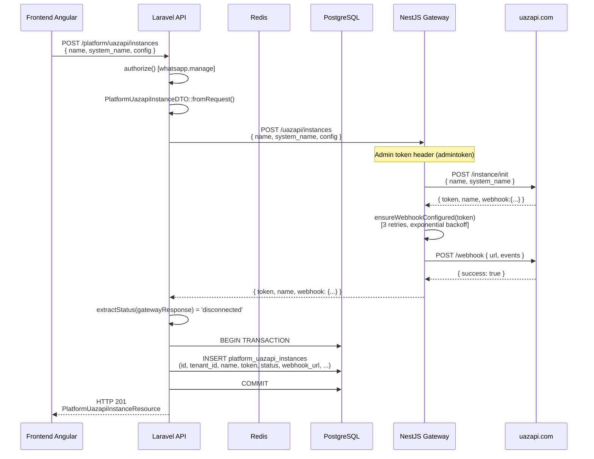
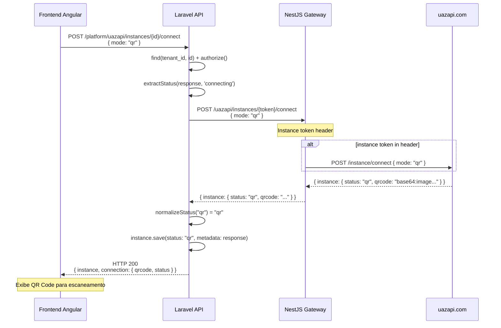
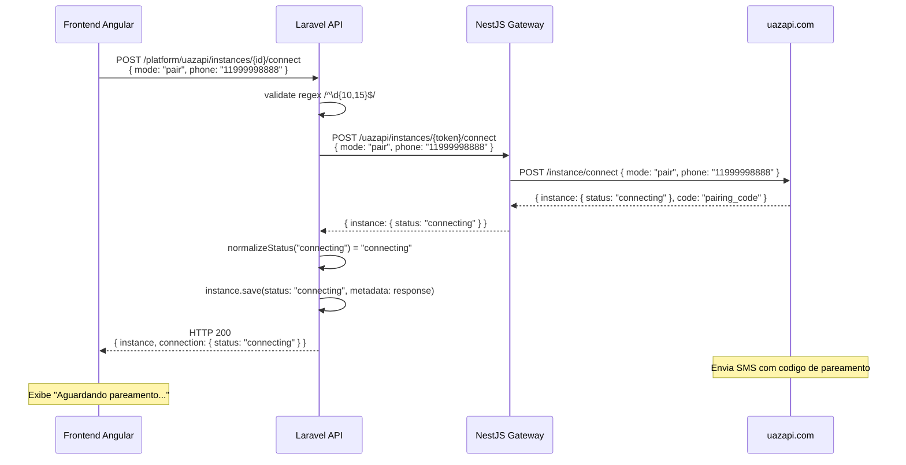
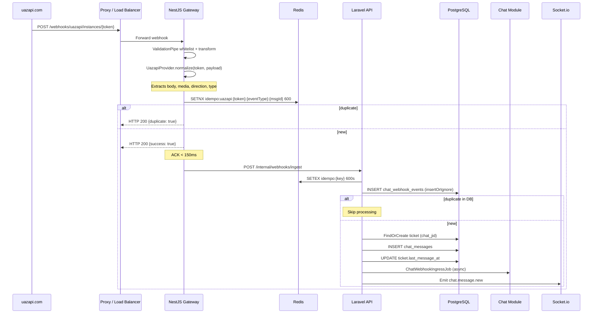
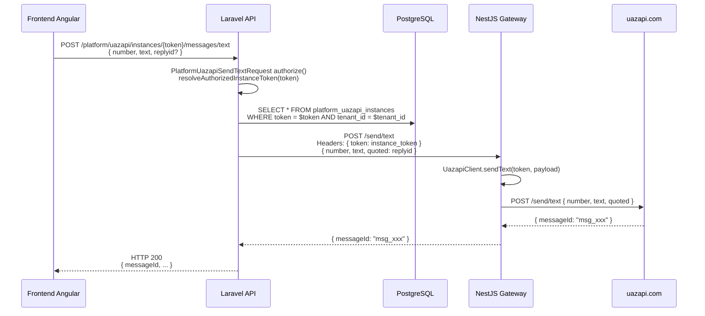
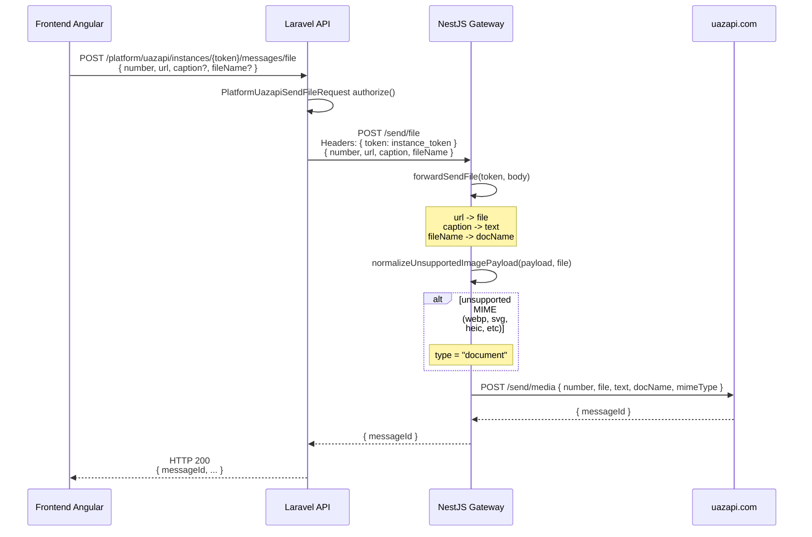
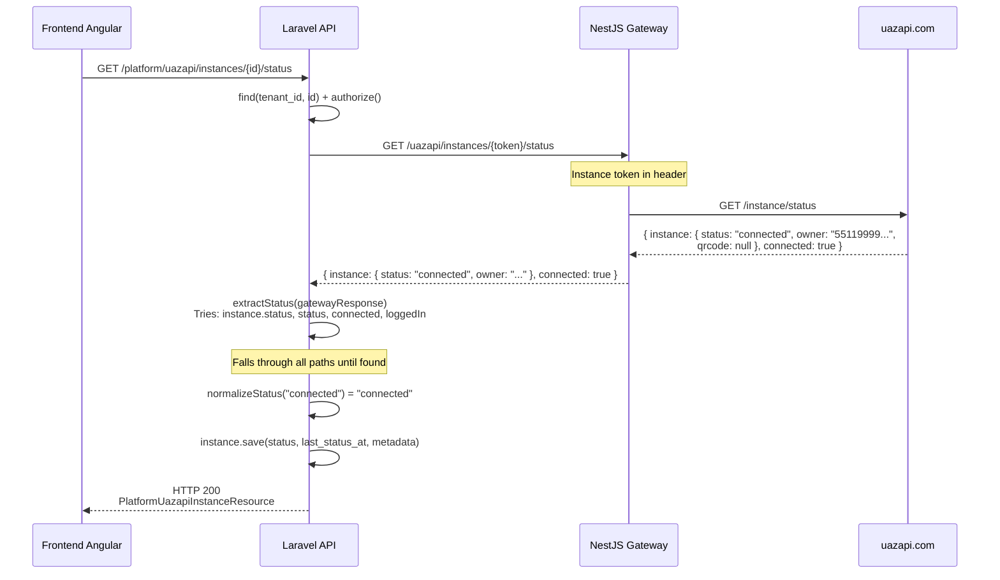
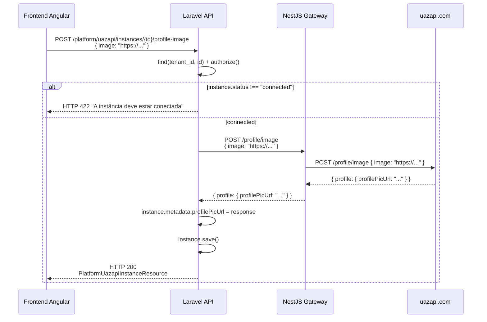
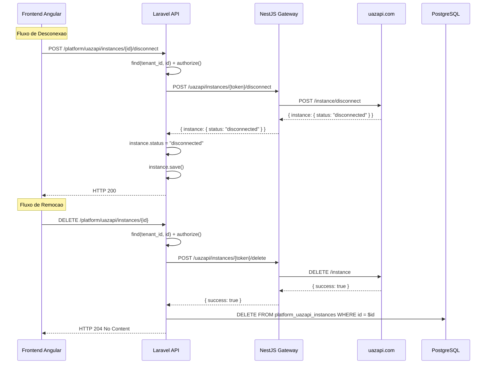

# PRD-UAZAPI-001 — Modulo UAZAPI (Integracao WhatsApp via uazapi.com)

> **Modulo:** Platform / UAZAPI
> **Status:** rascunho
> **Autor:** PM / DOC
> **Data:** 2026-03-28
> **Versao:** 1.0

---

## 1. CONTEXTO

### 1.1 O que e o Modulo UAZAPI

O modulo UAZAPI e o componente de integracao entre o ecossistema AgentFlix e o provedor de mensageria WhatsApp atraves da plataforma uazapi.com. Seu objetivo e permitir que cada tenant do AgentFlix gerencie uma ou mais instancias WhatsApp -- desde a criacao e conexao (QR Code ou Pair Code) ate o envio e recebimento de mensagens, gerenciamento de contatos, atualizacao de perfil e monitoramento de presenca -- tudo de forma totalmente integrada com o modulo Chat, o Gateway NestJS e a interface Angular.

O modulo e parte do dominio Platform porque encapsula a gestao de instancias de conexao (Infrastructure as a Service), isolando a complexidade de comunicacao com provedores externos WhatsApp. Os eventos de mensagem gerados por essas instancias alimentam o modulo Chat (tickets, mensagens, webhooks), enquanto os dados de contato alimentam o modulo CRM.

### 1.2 O Problema que Resolve

O AgentFlix precisa conectar-se ao WhatsApp de forma confiavel e escalavel para viabilizar o atendimento ao cliente via chat. Cada tenant deseja ter controle sobre suas conexoes WhatsApp sem depender de integracoes manuais ou provedores proprietarios. O modulo UAZAPI resolve:

- **Criacao e ciclo de vida de instancias**: cada tenant pode criar, conectar, desconectar e remover instancias WhatsApp via API REST, sem intervencao manual.
- **Autenticacao dupla**: instancia receber QR/Pair codes para parear com o WhatsApp, enquanto o sistema usa token administrativo para operacoes de gerenciamento.
- **Envio de mensagens enriquecidas**: texto, midia (imagem, video, audio, documento), contatos, localizacao, templates e presenca.
- **Recebimento de webhooks**: normalizacao de payloads de eventos (connection, messages, messages_update) vindos do uazapi.com em formato interno padronizado.
- **Resiliencia operacional**: circuit breaker em todas as chamadas HTTP externas, retentativas automaticas na configuracao de webhooks, e normalizacao de status que lida com multiplos formatos de resposta do provedor.
- **Isolamento multi-tenant**: cada instancia pertence a exatamente um tenant, com todas as operacoes validadas contra o tenant_id.

### 1.3 Arquitetura Geral do Modulo

O modulo opera em tres camadas:

```
+------------+        +------------------+        +-----------------+
|  Laravel   |        |  NestJS Gateway  |        |  uazapi.com     |
|  API       | <----> |  (gateway/)      | <----> |  (Provedor)     |
|  (api/)    | HTTP   |                  | HTTP   |                 |
+------------+        +------------------+        +-----------------+
       |                       |
       v                       v
+--------------------+  +------------------+
|  PostgreSQL        |  |  Redis           |
|  (Instance record)  |  |  (Circuit Breaker|
|                    |  |   Cache, PubSub) |
+--------------------+  +------------------+
```

#### 1.3.1 Camada Laravel API (api/src/Domain/Platform/)

O backend Laravel e responsavel por:

- Persistir e gerenciar o ciclo de vida das instancias no PostgreSQL (`PlatformUazapiInstance`).
- Validar todas as requisicoes via FormRequests (autorizacao, tenant isolation, validacao de input).
- Delegar comunicacao HTTP com o provedor ao Gateway NestJS via `UazapiGatewayService`, que age como fachada.
- Manter o modelo de instâncias com status sincronizado, metadados JSONB e configuracoes JSONB.
- Expor endpoints RESTful para o frontend Angular.

**Artefatos principais:**

| Artefato | Caminho |
|----------|---------|
| Model | `src/Domain/Platform/Models/PlatformUazapiInstance.php` |
| Controller (Instancias) | `src/Domain/Platform/Http/Controllers/PlatformUazapiInstanceController.php` |
| Controller (Mensagens) | `src/Domain/Platform/Http/Controllers/PlatformUazapiMessageController.php` |
| Actions | `src/Domain/Platform/Actions/PlatformUazapiInstanceActions.php` |
| Gateway Service | `src/Domain/Platform/Services/UazapiGatewayService.php` |
| DTO | `src/Domain/Platform/DTOs/PlatformUazapiInstanceDTO.php` |
| Policy | `src/Domain/Platform/Policies/PlatformUazapiInstancePolicy.php` |
| Routes | `src/Domain/Platform/Routes/platform.php` |

#### 1.3.2 Camada NestJS Gateway (gateway/src/domains/chat/)

O Gateway NestJS age como proxy HTTP inteligente entre a API Laravel e o provedor uazapi.com:

- **UazapiClient**: cliente HTTP com circuit breaker nomeado `whatsapp:uazapi`. Todas as chamadas HTTP passam por ele. Wrap de circuit breaker em GET e POST. Auto-configura webhooks com retentativas exponenciais.
- **UazapiProvider**: normalizador de payloads de webhook. Extrai corpo textual, midia, direcao, tipo de mensagem, timestamps e metadados de chat de formatos variados.
- **UazapiAdapter**: implementa o contrato `WhatsAppProvider`. Mapeia operacoes internas (sendText, sendMedia, getStatus, disconnect) para endpoints da uazapi.com. Normaliza eventos para o formato interno do gateway.
- **Controllers**: tres controllers (uazapi-instances, uazapi-messages, uazapi-presence) expõem a API REST interna para a camada Laravel.

**Artefatos principais:**

| Artefato | Caminho |
|----------|---------|
| Client HTTP | `gateway/src/domains/chat/providers/uazapi/uazapi.client.ts` |
| Provider/Normalizer | `gateway/src/domains/chat/providers/uazapi/uazapi.provider.ts` |
| Adapter | `gateway/src/domains/chat/providers/uazapi/uazapi.adapter.ts` |
| DTOs | `gateway/src/domains/chat/providers/uazapi/uazapi.dto.ts` |
| Model | `gateway/src/domains/chat/models/uazapi.model.ts` |
| Instances Controller | `gateway/src/domains/chat/controllers/uazapi-instances.controller.ts` |
| Messages Controller | `gateway/src/domains/chat/controllers/uazapi-messages.controller.ts` |

### 1.4 Decisoes Arquiteturais Chave

#### 1.4.1 Arquitetura Two-Tier (API -> Gateway -> Provedor)

Optou-se por uma arquitetura de duas camadas de delegacao em vez de chamadas diretas da API Laravel para o provedor. As razoes incluem:

- **Isolamento de protocolo HTTP**: o NestJS e naturalmente superior para gerenciar conexoes HTTP persistentes, retries com backoff exponencial, e circuit breakers em Node.js.
- **Normalizacao de payloads**: o Gateway normaliza os webhooks antes de entregar ao Laravel, permitindo que outros modulos (Chat, CRM) consumam eventos em formato padronizado.
- **Escala independente**: o Gateway pode ser escalado horizontalmente de forma independente da API Laravel, absorvendo picos de webhooks sem impactar a API REST.
- **Seguranca**: tokens administrativos da uazapi.com ficam no Gateway, nunca expostos diretamente ao frontend.

#### 1.4.2 Circuit Breaker com Nome Dedicado

Todas as chamadas HTTP da Uazapi passam por um circuit breaker com nome `whatsapp:uazapi`. Isso significa que se 5 chamadas consecutivas falharem, o circuito abre e todas as proximas chamadas sao rejeitadas imediatamente (sem tentativa) por 30 segundos. Isso protege contra cascatas de falhas quando o provedor uazapi.com esta fora do ar.

#### 1.4.3 Normalizacao de Status Flexivel

A uazapi.com retorna status em multiplos formatos: string (`"connected"`), booleano (`true`), array com `status`, array com `connected`, array com `loggedIn`. O sistema normaliza todos esses formatos para o enum interno (`connected`, `disconnected`, `connecting`, `qr`) de forma transparente.

#### 1.4.4 Webhook Auto-Configurado com Retentativas

Ao inicializar uma instancia, o Gateway automaticamente configura o webhook na uazapi.com com a URL de callback correta e os eventos desejados. Se a primeira tentativa falhar, o sistema retenta com backoff exponencial (ate 3 tentativas). Isso garante que webhooks comecem a fluir sem configuracao manual.

#### 1.4.5 Dual Token Authentication

- **Instance token**: enviado no header `token` em todas as chamadas de envio de mensagem e operacoes de instancia especificas. Identifica a instancia do tenant.
- **Admin token**: enviado no header `admintoken` em operacoes de gerenciamento (initInstance, listInstances, deleteInstance). Identifica a conta administrativa do AgentFlix junto ao provedor.

### 1.5 Integracao com o Ecossistema AgentFlix

```
UAZAPI Module
    |
    +---> Chat Module:webhooks normalizados
    |        - ChatWebhookIngressJob: processa eventos de mensagem
    |        - Cria/atualiza tickets, mensagens, contatos CRM
    |
    +---> CRM Module: contatos automaticos
    |        - Busca ou cria contato por telefone
    |        - Vincula ticket ao contato
    |
    +---> Gateway Module: broadcast realtime
    |        - Eventos via Redis PubSub -> Socket.io
    |        - Atualizacoes de status em tempo real
    |
    +---> Platform Module: gestao de instancias
    |        - BelongsToTenant: isolamento multi-tenant
    |        - Policy + Permission: whatsapp.manage
    |
    +---> Billing Module: rate limits futuros
           - Limite de instancias por plano
           - Cotas de mensagens por tenant
```

### 1.6 Ambiente e Variaveis de Configuracao

#### Variaveis do Gateway (NestJS)

| Variavel | Descricao | Default |
|----------|-----------|---------|
| `UAZAPI_BASE_URL` | URL base da API uazapi.com | `https://free.uazapi.com` |
| `UAZAPI_ADMIN_TOKEN` | Token administrativo da conta AgentFlix | - |
| `UAZAPI_WEBHOOK_URL` | URL base para receber webhooks | - |
| `UAZAPI_WEBHOOK_EVENTS` | Eventos a assinar (virgula) | `connection,messages,messages_update` |
| `UAZAPI_WEBHOOK_EXCLUDE_MESSAGES` | Mensagens a excluir | `wasSentByApi` |
| `UAZAPI_WEBHOOK_RETRIES` | Tentativas de configuracao de webhook | `3` |

#### Variaveis da API (Laravel)

| Variavel | Descricao |
|----------|-----------|
| `GATEWAY_BASE_URL` | URL base do NestJS Gateway |
| `GATEWAY_API_KEY` | Chave de autenticacao API -> Gateway |

### 1.7 Provedor uazapi.com — Endpoints Utilizados

| Metodo | Path | Uso |
|--------|------|-----|
| POST | `/instance/init` | Criar nova instancia |
| GET | `/instance/all` | Listar instancias |
| POST | `/instance/connect` | Conectar (QR/Pair) |
| POST | `/instance/disconnect` | Desconectar/logout |
| GET | `/instance/status` | Consultar status |
| POST | `/instance/presence` | Definir presenca global |
| DELETE | `/instance` | Remover instancia |
| POST | `/webhook` | Configurar webhook |
| POST | `/send/text` | Enviar mensagem de texto |
| POST | `/send/media` | Enviar midia (todas) |
| POST | `/send/contact` | Enviar contato |
| POST | `/send/location` | Enviar localizacao |
| POST | `/send/template` | Enviar template |
| POST | `/message/presence` | Presenca em conversa |
| POST | `/message/react` | Reagir a mensagem |
| POST | `/message/edit` | Editar mensagem |
| POST | `/message/delete` | Apagar mensagem |
| POST | `/message/download` | Baixar midia |
| POST | `/chat/read` | Marcar como lido |
| GET | `/contacts` | Listar contatos |
| POST | `/contacts/list` | Sincronizar lista |
| POST | `/contact/add` | Adicionar contato |
| POST | `/contact/remove` | Remover contato |
| POST | `/profile/image` | Alterar foto de perfil |

---

## 2. OBJETIVO

### 2.1 Objetivo Geral

Fornecer um modulo completo de gestao de instancias WhatsApp para o ecossistema AgentFlix que permita: (1) criar e destruir instancias de conexao com o provedor uazapi.com; (2) autenticar instancias via QR Code (navegador) ou Pair Code (telefone); (3) consultar e sincronizar o status de conexao em tempo real; (4) enviar mensagens de texto, midia, contatos, localizacao e templates; (5) receber e normalizar eventos de webhook do provedor; (6) gerenciar contatos da agenda da instancia; (7) atualizar perfil e presenca da instancia; e (8) garantir isolamento multi-tenant total em todas as operacoes.

### 2.2 Objetivos Especificos

1. **Gerencia de ciclo de vida de instancias**: todo tenant pode criar N instancias WhatsApp, cada uma com seu proprio token, nome e configuracao. A criacao e.atomic: o Gateway cria a instancia no provedor e o Laravel persiste o registro local em uma transacao.

2. **Autenticacao flexivel (QR/Pair)**: o sistema suporta dois modos de conexao. QR Code: o tenant abre o link no navegador e escaneia com o celular. Pair Code: o tenant informa o numero de telefone e recebe um codigo de pareamento via SMS. Ambos os modos geram um token persistente.

3. **Sincronizacao de status**: o status local (disconnected/connecting/qr/connected) e sincronizado com a realidade do provedor via polling do endpoint `/instance/status`. A normalizacao lida com multiplos formatos de resposta.

4. **Envio de mensagens enriched**: alem de texto puro, agentes podem enviar imagens, videos, audios, documentos, contatos (vCard), localizacoes geograficas e templates de mensagem do WhatsApp Business. O sistema normaliza filenames e MIME types antes de enviar.

5. **Webhook idempotente**: eventos de webhook recebidos da uazapi.com sao normalizados, deduplicados via Redis (SETNX com TTL 600s) e processados de forma assincrona. ACK < 150ms garantido.

6. **Gestao de presenca**: a instancia pode ser configurada como `available` ou `unavailable` globalmente. Em conversas individuais, agentes podem enviar estados de digitacao, gravacao de audio, etc.

7. **Seguranca multi-tenant**: toda operacao valida tenant_id via BelongsToTenant. A Policy verifica permissao `whatsapp.manage`. Tokens nunca sao expostos no resource (apenas preview).

8. **Resiliencia via circuit breaker**: falhas temporarias do provedor uazapi.com nao derrubam a API. O circuit breaker `whatsapp:uazapi` abre apos 5 falhas consecutivas, rejeitando chamadas por 30s.

### 2.3 Resultados de Negocio

- Tenant pode ter multiplas instancias WhatsApp (ex: um para vendas, outro para suporte), cada uma com seu proprio numero e historico.
- Reducao de friccao operacional: conexao 100% via API, sem necessidade de configuracao manual no painel do provedor.
- Isolamento de falhas: se uma instancia cai, as demais continuam funcionando.
- Rastreabilidade completa: todos os webhooks sao logados com payload bruto para auditoria.

---

## 3. REGRAS DE NEGOCIO

### 3.1 Ciclo de Vida de Instancias

| ID    | Regra | Prioridade |
|-------|-------|------------|
| RN-001 | Toda instancia deve pertencer a exatamente um tenant, definido pelo campo `tenant_id` obrigatorio e nao-nulo | Critica |
| RN-002 | O `id` da instancia e um UUID gerado por `Str::orderedUuid()` no momento da criacao, nunca auto-increment | Critica |
| RN-003 | O `token` da instancia e gerado pelo provedor uazapi.com durante a chamada `initInstance` e persiste localmente | Critica |
| RN-004 | O campo `status` segue o enum: `disconnected` (padrao), `connecting`, `qr`, `connected` | Critica |
| RN-005 | O campo `webhook_url` e montado automaticamente como `{UAZAPI_WEBHOOK_URL}/webhooks/uazapi/instances/{token}` e configurado no provedor via `ensureWebhookConfigured` | Alta |
| RN-006 | O campo `config` e um JSONB que armazena configuracoes arbitrarias da instancia (max 255 caracteres por chave) | Media |
| RN-007 | O campo `metadata` e um JSONB que armazena a resposta bruta do gateway e dados de status sincronizados | Media |
| RN-008 | O campo `last_status_at` registra o timestamp da ultima sincronizacao de status | Media |
| RN-009 | A remocao de uma instancia (`destroy`) deleta o registro local E chama `deleteInstance` no gateway para remover do provedor | Critica |
| RN-010 | Instancias com status `connecting` ou `qr` que ficarem mais de 5 minutos sem evoluir para `connected` devem ser marcadas como `disconnected` (cleanup job futuro) | Media |

### 3.2 Autenticacao e Conexao

| ID    | Regra | Prioridade |
|-------|-------|------------|
| RN-011 | O modo de conexao `qr` gera um QR Code que o tenant escaneia com o app WhatsApp | Alta |
| RN-012 | O modo de conexao `pair` requer o parametro `phone` com 10 a 15 digitos numericos (`/^\d{10,15}$/`) | Alta |
| RN-013 | Somente instancias com status `disconnected` podem iniciar conexao. Instancias ja `connected` retornam erro 422 se tentarem conectar novamente | Alta |
| RN-014 | A conexao via `connect` atualiza o status local para `connecting` antes da chamada HTTP (otimista) | Media |
| RN-015 | A desconexao (`disconnect`) atualiza o status para `disconnected` e persiste a resposta do gateway em `metadata` | Alta |
| RN-016 | A exclusao de uma instancia conectada deve desconectar primeiro antes de deletar (ou forcar delete no provedor) | Media |
| RN-017 | O token administrativo (`UAZAPI_ADMIN_TOKEN`) e usado exclusivamente em operacoes de gerenciamento (init, list, delete), nunca em envio de mensagens | Critica |

### 3.3 Sincronizacao de Status

| ID    | Regra | Prioridade |
|-------|-------|------------|
| RN-018 | O metodo `extractStatus` lida com: string direta, booleano, array com `status`, array com `connected` (bool), array com `loggedIn` (bool) | Alta |
| RN-019 | O metodo `normalizeStatus` converte: `true` -> `connected`, `false` -> `disconnected`, strings validas passam transparente | Critica |
| RN-020 | A sincronizacao via `status()` atualiza: `status`, `last_status_at` e `metadata` no mesmo `save()` | Alta |
| RN-021 | Campos booleanos `connected` e `loggedIn` em arrays de resposta sao normalizados para `connected`/`disconnected` | Alta |
| RN-022 | O `last_status_at` e persistido em UTC usando `now()` do Laravel | Media |

### 3.4 Envio de Mensagens

| ID    | Regra | Prioridade |
|-------|-------|------------|
| RN-023 | O `authorize()` do `PlatformUazapiSendTextRequest` valida que o token da instancia pertence ao tenant do usuario logado | Critica |
| RN-024 | O `number` do destinatario deve ter no minimo 6 caracteres alfanumericos (`/^[0-9@.\w-]{6,}$/`) | Alta |
| RN-025 | O corpo do texto (`text`) e obrigatorio e deve ser string nao-vazia | Critica |
| RN-026 | O parametro `quotedMessageId` (replyid) permite responder a uma mensagem especifica | Media |
| RN-027 | O envio de midia (`sendFile`) requer `url` valida (URL absoluta) e aceita `caption` opcional | Alta |
| RN-028 | Campos `linkPreview*` em `sendText` sao opcionais e permitem mostrar preview de links | Media |
| RN-029 | O `UazapiMessagesController` no Gateway normaliza nomes de campos: `url` -> `file`, `caption` -> `text`, `fileName` -> `docName` | Alta |
| RN-030 | Imagens com MIME type nao-suportado pelo WhatsApp (WebP, SVG, HEIC, HEIF, AVIF) sao automaticamente convertidas para `type: document` | Media |
| RN-031 | O Gateway extrai MIME type do payload, de data URI prefix (`data:image/png;base64,...`) ou da extensao do arquivo na URL | Media |
| RN-032 | O `sendText` retorna `messageId` ou `id` extraido da resposta normalizada | Alta |

### 3.5 Webhooks e Eventos

| ID    | Regra | Prioridade |
|-------|-------|------------|
| RN-033 | O DTO `UazapiWebhookDto` suporta tres tipos de evento: `messages`, `messages_update`, `connection` | Critica |
| RN-034 | O normalizador `UazapiProvider.normalize()` extrai `body` de: `message.body`, `content.text`, `content.caption`, `content.url` (nessa ordem de prioridade) | Alta |
| RN-035 | A direcao da mensagem e determinada pelo campo booleano `fromMe`: `true` = outgoing (empresa->cliente), `false` = incoming (cliente->empresa) | Critica |
| RN-036 | Campos de midia (`mediaUrl`, `mimeType`, `fileName`) sao extraidos de multiplas paths: `content.url`, `content.mediaUrl`, `content.media_url`, `content.file` | Alta |
| RN-037 | O `UazapiAdapter.normalizeWebhook()` mapeia: `incoming` -> `inbound`, `outgoing` -> `outbound` para o contrato interno do gateway | Alta |
| RN-038 | A idempotencia e garantida pela chave `{token}:{eventType}:{messageId}` no Redis com TTL 600s | Critica |
| RN-039 | Eventos duplicados retornam `{success:true, duplicate:true}` sem re-processamento | Alta |
| RN-040 | O `UazapiWebhookDto` preserva campos desconhecidos via index signature `[key: string]: unknown` para manter o payload bruto | Media |
| RN-041 | O `UazapiProvider` prefere o payload bruto original (`raw.message`) sobre o DTO validado, porque `ValidationPipe(whitelist:true)` remove campos desconhecidos | Alta |

### 3.6 Presenca e Perfil

| ID    | Regra | Prioridade |
|-------|-------|------------|
| RN-042 | A alteracao de imagem de perfil (`profileImage`) requer que a instancia esteja `connected`, caso contrario retorna 422 | Critica |
| RN-043 | O parametro `image` pode ser: URL HTTP/HTTPS, string Base64 com prefixo `data:image/...;base64,`, ou literal `remove` | Alta |
| RN-044 | A alteracao de presenca global (`presence`) requer que a instancia esteja `connected`, caso contrario retorna 422 | Critica |
| RN-045 | O campo `presence` aceita apenas `available` ou `unavailable` como valores validos | Alta |
| RN-046 | A presenca local (`sendPresence` em conversa) permite estados como `composing`, `recording`, `paused` | Media |
| RN-047 | A `current_presence` e armazenada em `metadata` da instancia para auditoria | Media |

### 3.7 Contatos

| ID    | Regra | Prioridade |
|-------|-------|------------|
| RN-048 | A listagem de contatos (`listContacts`) usa o token da instancia no header `token` | Alta |
| RN-049 | A sincronizacao em batch (`syncContactsList`) permite enviar ate N contatos por vez, cada um com `number` e `name` | Alta |
| RN-050 | A remocao de contato (`removeContact`) recebe `number` ou `jid` para identificacao | Media |
| RN-051 | O `addContact` recebe `phone` (obrigatorio) e `name` (obrigatorio) alem de campos opcionais: organization, email, url | Media |

### 3.8 Seguranca e Autorizacao

| ID    | Regra | Prioridade |
|-------|-------|------------|
| RN-052 | A Policy `PlatformUazapiInstancePolicy` exige a permissao `whatsapp.manage` em todos os metodos | Critica |
| RN-053 | O metodo `viewAny` e `create` tambem exigem `whatsapp.manage` alem de estar autenticado | Alta |
| RN-054 | Os metodos `view`, `update`, `delete` exigem `whatsapp.manage` E que a instancia pertenca ao tenant do usuario (`belongsToTenant`) | Critica |
| RN-055 | O `PlatformUazapiInstanceResource` nunca expoe o token completo: apenas `has_token` (bool) e `token_preview` (ex: `****abc1`) | Critica |
| RN-056 | O campo `webhook_url` e exposto no resource apenas se configurado | Media |
| RN-057 | O `metadata` e exposto no resource para fins de debugging e transparencia | Media |
| RN-058 | Logs nunca devem conter tokens, numeros de telefone ou URLs de webhook completas (ASCARISCO) | Critica |
| RN-059 | O `maskSecrets` no client HTTP do Gateway mascara headers e body antes de logar | Alta |
| RN-060 | Todas as datas no resource sao formatadas como ISO 8601 via `BaseJsonResource::iso()` | Media |

### 3.9 Multi-Tenancy

| ID    | Regra | Prioridade |
|-------|-------|------------|
| RN-061 | Toda query de instancia filtra automaticamente por `tenant_id` via `BelongsToTenant` trait | Critica |
| RN-062 | O `list()` aceita filtro `status` para buscar apenas instancias conectadas ou desconectadas | Media |
| RN-063 | O `list()` aceita filtro `search` que busca por `name` ou `system_name` com `ilike` (ou `like` em SQLite) | Media |
| RN-064 | A paginacao usa `per_page` (padrao 15) e `page` conforme convencao Laravel | Media |
| RN-065 | O `resolveAuthorizedInstanceToken` no MessageController busca a instancia pelo token e valida tenant_id antes de usar | Critica |

### 3.10 Circuit Breaker e Resiliencia

| ID    | Regra | Prioridade |
|-------|-------|------------|
| RN-066 | O circuit breaker `whatsapp:uazapi` abre apos 5 falhas consecutivas de qualquer operacao HTTP | Alta |
| RN-067 | O circuit breaker reseta apos 30 segundos de inatividade (half-open state) | Alta |
| RN-068 | Chamadas rejeitadas por circuit breaker retornam HTTP 503 com mensagem "Uazapi circuit breaker is open" | Alta |
| RN-069 | Erros de Axios sao transformados em `HttpException` com status code da resposta ou 500 | Alta |
| RN-070 | O metodo `retry` no client usa backoff exponencial: `delayMs * attempt` | Media |

### 3.11 Campos Computados e Resources

| ID    | Regra | Prioridade |
|-------|-------|------------|
| RN-071 | O campo `has_token` e um booleano computado: `token !== null && token !== ''` | Media |
| RN-072 | O campo `token_preview` mostra `****` + ultimos 4 caracteres do token para referencia rapida | Media |
| RN-073 | O campo `last_seen_at` no resource mapeia para `last_status_at` (alias) | Media |
| RN-074 | Timestamps `created_at`, `updated_at`, `last_status_at` sao sempre incluidos no resource | Alta |

---

## 4. FLUXOS

### 4.1 Fluxo: Criacao de Instancia



### 4.2 Fluxo: Conexao via QR Code



### 4.3 Fluxo: Conexao via Pair Code (Telefone)



### 4.4 Fluxo: Webhook de Mensagem Recebida



### 4.5 Fluxo: Envio de Mensagem de Texto



### 4.6 Fluxo: Envio de Midia



### 4.7 Fluxo: Sincronizacao de Status



### 4.8 Fluxo: Alteracao de Imagem de Perfil



### 4.9 Fluxo: Desconexao e Remocao



### 4.10 Diagrama de Arquitetura de Componentes

```mermaid
graph TB
    subgraph "Frontend (Angular)"
        FE[Angular App<br/>pages/platform/uazapi]
    end

    subgraph "Laravel API (api/)"
        subgraph "Controllers"
            IC[PlatformUazapiInstanceController]
            MC[PlatformUazapiMessageController]
        end
        subgraph "Actions"
            UA[PlatformUazapiInstanceActions]
        end
        subgraph "Domain"
            M[PlatformUazapiInstance<br/>Model]
            DTO[PlatformUazapiInstanceDTO]
        end
        subgraph "Services"
            GWS[UazapiGatewayService]
        end
        subgraph "Requests"
            CR[PlatformUazapiInstanceRequest]
            CON[PlatformUazapiConnectRequest]
            ST[PlatformUazapiSendTextRequest]
            SF[PlatformUazapiSendFileRequest]
        end
        subgraph "Resources"
            R[PlatformUazapiInstanceResource]
        end
        subgraph "Policies"
            P[PlatformUazapiInstancePolicy]
        end
    end

    subgraph "NestJS Gateway (gateway/)"
        subgraph "Controllers"
            ICGW[UazapiInstancesController]
            MCGW[UazapiMessagesController<br/>UazapiPresenceController]
        end
        subgraph "Uazapi Provider"
            CLIENT[UazapiClient<br/>CircuitBreaker: whatsapp:uazapi]
            PROVIDER[UazapiProvider<br/>normalize()]
            ADAPTER[UazapiAdapter<br/>WhatsAppProvider impl]
        end
        subgraph "DTOs"
            WHDTO[UazapiWebhookDto]
        end
        subgraph "Models"
            UM[uazapi.model.ts]
        end
    end

    subgraph "External"
        UAZAPI[uazapi.com<br/>REST API]
    end

    subgraph "Database"
        PG[(PostgreSQL<br/>platform_uazapi_instances)]
    end

    subgraph "Cache"
        REDIS[(Redis<br/>CircuitBreaker<br/>Idempotency)]
    end

    FE --> IC
    FE --> MC
    IC --> UA
    IC --> CR
    IC --> CON
    UA --> M
    UA --> GWS
    UA --> DTO
    GWS --> ICGW
    MC --> GWS
    MC --> ST
    MC --> SF
    UA --> P
    UA --> R
    ICGW --> CLIENT
    ICGW --> MCGW
    CLIENT --> UAZAPI
    CLIENT --> REDIS
    PROVIDER --> WHDTO
    ADAPTER --> PROVIDER
    ADAPTER --> CLIENT
    UAZAPI --> CLIENT
    M --> PG
    UA --> PG
```

---

## 5. ENTIDADES E MODELOS

### 5.1 PlatformUazapiInstance (Model - Laravel)

**Tabela:** `platform_uazapi_instances`

**Descricao:** Armazena os dados persistentes de cada instancia WhatsApp vinculada a um tenant. E o registro fonte de verdade para o estado local da instancia.

**Namespace:** `Domain\Platform\Models\PlatformUazapiInstance`

**Traits:**

- `BelongsToTenant` — injeta automaticamente `tenant_id` em queries e relacionamentos
- `HasFactory` — habilita factories para testes

**Campos:**

| Campo | Tipo | Descricao |
|-------|------|-----------|
| `id` | `uuid` PK | UUID v7 ordenado, gerado por `Str::orderedUuid()` no evento `creating` |
| `tenant_id` | `uuid` FK | Referencia a `platform_tenants.id`. Nao-nulo via constraints de BD |
| `name` | `string(255)` | Nome amigavel da instancia, retornado pelo gateway na criacao |
| `system_name` | `string(100)` nullable | Nome interno/sistema, configurado pelo tenant na requisicao |
| `token` | `string(255)` | Token da instancia no provedor, usado no header de autenticacao |
| `status` | `string(20)` | Enum local: `disconnected`, `connecting`, `qr`, `connected` |
| `webhook_url` | `string(500)` nullable | URL do webhook configurado no provedor |
| `config` | `jsonb` | Configuracoes arbitrarias da instancia (pares chave-valor) |
| `metadata` | `jsonb` | Resposta bruta do gateway, status detalhado, qrcode, phone |
| `last_status_at` | `timestamp` nullable | Data da ultima sincronizacao de status |
| `created_at` | `timestamp` | auto |
| `updated_at` | `timestamp` | auto |

**Casts:**

```php
'config' => 'array',
'metadata' => 'array',
'last_status_at' => 'datetime',
```

**Relacionamentos:**

```php
public function tenant(): BelongsTo
{
    return $this->belongsTo(PlatformTenant::class, 'tenant_id');
}
```

**fillable:**

```php
['id', 'tenant_id', 'name', 'system_name', 'token', 'status',
 'webhook_url', 'config', 'metadata', 'last_status_at']
```

**Notas de Implementacao:**

- `public $incrementing = false` e `protected $keyType = 'string'` para UUID
- `booted()` registra um listener em `creating` que atribui UUID se nao existir
- Nao usa SoftDeletes — a remocao e fisica via `delete()`

---

### 5.2 NormalizedUazapiEvent (Model - Gateway TypeScript)

**Arquivo:** `gateway/src/domains/chat/models/uazapi.model.ts`

**Descricao:** Tipo TypeScript que representa um evento normalizado apos a extracao do payload bruto da uazapi.com.

```typescript
export type NormalizedUazapiEvent = {
  provider: 'uazapi';
  event_type: 'messages' | 'messages_update' | 'connection';
  instance_webhook_token: string;
  owner?: string;
  base_url?: string;
  direction?: 'incoming' | 'outgoing';
  chat?: Record<string, unknown>;
  message?: {
    id?: string;
    from?: string;
    to?: string;
    chatid?: string;
    body?: string;
    type?: MessageType;
    timestamp?: number | string;
    fromMe?: boolean;
    media?: Record<string, unknown>;
    mediaUrl?: string;
    mimeType?: string;
    fileName?: string;
    senderPhoto?: string;
  };
  raw: Record<string, unknown>;
};
```

---

### 5.3 UazapiWebhookDto (DTO - Gateway)

**Arquivo:** `gateway/src/domains/chat/providers/uazapi/uazapi.dto.ts`

**Descricao:** DTO de validacao para webhooks recebidos da uazapi.com. Usa `class-validator` e preserva campos desconhecidos via index signature.

```typescript
export class UazapiWebhookDto {
  @IsString()
  EventType!: 'messages' | 'messages_update' | 'connection';

  @IsOptional()
  message?: {
    id?: string;
    type?: MessageType;
    from?: string;
    to?: string;
    body?: string;
    timestamp?: number | string;
    [key: string]: unknown;
  };

  @IsOptional()
  chat?: Record<string, unknown>;

  @IsOptional()
  instance?: Record<string, unknown>;

  @IsOptional()
  instanceName?: string;

  @IsOptional()
  BaseUrl?: string;

  @IsOptional()
  owner?: string;

  @IsOptional()
  token?: string;

  [key: string]: unknown;  // preserva campos desconhecidos
}
```

---

### 5.4 WhatsAppProvider Interface (Gateway)

**Arquivo:** `gateway/src/domains/chat/contracts/provider.interface.ts`

**Descricao:** Contrato que todo adaptador de provedor WhatsApp deve implementar. Permite que o sistema troque de provedor sem alterar codigo dependent.

```typescript
export interface WhatsAppProvider {
  readonly name: string;

  sendText(instanceToken: string, request: SendTextRequest): Promise<SendMessageResult>;
  sendMedia(instanceToken: string, request: SendMediaRequest): Promise<SendMessageResult>;
  getStatus(instanceToken: string): Promise<InstanceStatus>;
  disconnect(instanceToken: string): Promise<void>;
  getQrCode(instanceToken: string): Promise<string | null>;
  normalizeWebhook(token: string, rawPayload: unknown): NormalizedWebhookEvent;
}
```

---

### 5.5 PlatformUazapiInstanceDTO (DTO - Laravel)

**Namespace:** `Domain\Platform\DTOs\PlatformUazapiInstanceDTO`

**readonly class** com:

```php
public function __construct(
    public string $name,
    public ?string $systemName = null,
    public array $config = [],
) {}
```

Metodos estaticos:

- `fromRequest(FormRequest): self` — cria DTO validado a partir de request HTTP
- `fromArray(array): self` — cria DTO a partir de array plain
- `toArray(): array` — serializa DTO para payload do gateway

---

### 5.6 PlatformUazapiInstanceResource (Resource - Laravel)

**Namespace:** `Domain\Platform\Http\Resources\PlatformUazapiInstanceResource`

**extends:** `Domain\Shared\Http\Resources\BaseJsonResource`

**Campos expostos ao frontend:**

```php
protected function data(Request $request): array
{
    return [
        'id'              => $this->id,
        'tenant_id'       => $this->tenant_id,
        'name'            => $this->name,
        'system_name'     => $this->system_name,
        'has_token'       => $this->token !== null && $this->token !== '',
        'token_preview'   => $this->token ? '****'.substr($this->token, -4) : null,
        'status'          => $this->status,
        'webhook_url'     => $this->webhook_url,
        'config'          => $this->config ?? [],
        'metadata'        => $this->metadata,
        'last_status_at'  => $this->iso($this->last_status_at),
        'last_seen_at'    => $this->iso($this->last_status_at),
        'created_at'      => $this->iso($this->created_at),
        'updated_at'      => $this->iso($this->updated_at),
    ];
}
```

**Seguranca:** O token completo nunca e exposto. `metadata` e incluido para debugging.

---

### 5.7 Migration (Database)

**Nome:** `YYYY_MM_DD_HHMMSS_create_platform_uazapi_instances_table.php`

**Padrao conforme AGENTS.md** — UUID primary key, tenant_id, timestamps, JSONB para config/metadata. Deve ser criada em `database/migrations/`.

---

## 6. ENDPOINTS

### 6.1 Instancias

#### GET /platform/uazapi/instances

Lista todas as instancias do tenant com suporte a filtros e paginacao.

**Autenticacao:** Bearer Token (Sanctum)

**Permissao:** `whatsapp.manage`

**Query Parameters:**

| Param | Tipo | Descricao | Exemplo |
|-------|------|-----------|---------|
| `status` | string | Filtrar por status | `connected`, `disconnected`, `connecting`, `qr` |
| `search` | string | Busca por nome ou system_name (case-insensitive) | `vendas` |
| `per_page` | int | Itens por pagina (padrao: 15, max: 100) | `25` |
| `page` | int | Numero da pagina | `2` |

**Resposta 200:**

```json
{
  "data": [
    {
      "id": "0191xxx-...",
      "tenant_id": "0191xxx-...",
      "name": "Vendas Principal",
      "system_name": "vendas-01",
      "has_token": true,
      "token_preview": "****abc1",
      "status": "connected",
      "webhook_url": "https://...",
      "config": {},
      "metadata": { "owner": "55119999..." },
      "last_status_at": "2026-03-28T10:00:00Z",
      "last_seen_at": "2026-03-28T10:00:00Z",
      "created_at": "2026-03-28T09:00:00Z",
      "updated_at": "2026-03-28T10:00:00Z"
    }
  ],
  "meta": { "current_page": 1, "per_page": 15, "total": 3 }
}
```

---

#### POST /platform/uazapi/instances

Cria uma nova instancia. Realiza chamamada ao gateway (que cria no provedor) e persiste localmente em transacao.

**Autenticacao:** Bearer Token (Sanctum)

**Permissao:** `whatsapp.manage`

**Request Body:**

```json
{
  "name": "Atendimento Suporte",
  "system_name": "suporte-01",
  "config": {
    "auto_reply": true,
    "department_id": "0191xxx-..."
  }
}
```

| Campo | Tipo | Obrigatorio | Descricao |
|-------|------|-------------|-----------|
| `name` | string | Sim | Nome da instancia (max 100 chars) |
| `system_name` | string | Nao | Nome interno/sistema (max 100 chars) |
| `config` | object | Nao | Pares chave-valor de configuracao |

**Resposta 201:** `PlatformUazapiInstanceResource`

**Resposta 422:** Erro de validacao

**Fluxo:** API -> Gateway -> uazapi.com -> persist -> response

---

#### GET /platform/uazapi/instances/{id}

Exibe detalhes de uma instancia especifica.

**Autenticacao:** Bearer Token (Sanctum)

**Permissao:** `whatsapp.manage` + tenant ownership

**Resposta 200:** `PlatformUazapiInstanceResource`

**Resposta 404:** Instancia nao encontrada ou nao pertence ao tenant

---

#### GET /platform/uazapi/instances/{id}/status

Sincroniza o status da instancia com o provedor.

**Autenticacao:** Bearer Token (Sanctum)

**Permissao:** `whatsapp.manage`

**Resposta 200:**

```json
{
  "data": {
    "instance": {
      "status": "connected",
      "owner": "5511999998888"
    },
    "connected": true
  },
  "meta": { "synced_at": "2026-03-28T10:00:00Z" }
}
```

**Efeitos colaterais:** Atualiza `status`, `last_status_at` e `metadata` no banco.

---

#### POST /platform/uazapi/instances/{id}/connect

Inicia o processo de conexao (QR Code ou Pair Code).

**Autenticacao:** Bearer Token (Sanctum)

**Permissao:** `whatsapp.manage` + tenant ownership

**Request Body:**

```json
{
  "mode": "qr"
}
```
ou
```json
{
  "mode": "pair",
  "phone": "5511999998888"
}
```

| Campo | Tipo | Obrigatorio | Descricao |
|-------|------|-------------|-----------|
| `mode` | string | Nao (padrao: `qr`) | `qr` ou `pair` |
| `phone` | string | Sim se mode=pair | 10-15 digitos |

**Regex do phone:** `/^\d{10,15}$/`

**Resposta 200:**

```json
{
  "instance": { "...PlatformUazapiInstanceResource..." },
  "connection": {
    "status": "qr",
    "qrcode": "base64:image/png;base64,..."
  }
}
```

**Resposta 422:** Instancia ja conectada ou parametros invalidos

---

#### POST /platform/uazapi/instances/{id}/disconnect

Desconecta a sessao ativa (logout).

**Autenticacao:** Bearer Token (Sanctum)

**Permissao:** `whatsapp.manage` + tenant ownership

**Resposta 200:**

```json
{
  "instance": { "...PlatformUazapiInstanceResource..." },
  "response": {
    "instance": { "status": "disconnected" }
  }
}
```

---

#### PATCH /platform/uazapi/instances/{id}/name

Atualiza o nome amigavel da instancia.

**Autenticacao:** Bearer Token (Sanctum)

**Permissao:** `whatsapp.manage` + tenant ownership

**Request Body:**

```json
{
  "name": "Novo Nome da Instancia"
}
```

**Resposta 200:** `PlatformUazapiInstanceResource` atualizada

---

#### PATCH /platform/uazapi/instances/{id}/admin-fields

Atualiza campos de configuracao JSONB (`config`).

**Autenticacao:** Bearer Token (Sanctum)

**Permissao:** `whatsapp.manage` + tenant ownership

**Request Body:**

```json
{
  "config": {
    "auto_reply": false,
    "greeting_message": "Ola! Como podemos ajudar?"
  }
}
```

**Nota:** Merge com config existente (nao sobrescreve).

**Resposta 200:** `PlatformUazapiInstanceResource` atualizada

---

#### POST /platform/uazapi/instances/{id}/profile-image

Altera a foto de perfil da instancia.

**Autenticacao:** Bearer Token (Sanctum)

**Permissao:** `whatsapp.manage` + tenant ownership

**Request Body:**

```json
{
  "image": "https://example.com/avatar.png"
}
```
ou
```json
{
  "image": "data:image/png;base64,iVBORw0KGgo..."
}
```
ou
```json
{
  "image": "remove"
}
```

**Requisito:** Instancia deve estar `connected` (caso contrario 422).

**Resposta 200:**

```json
{
  "instance": { "...PlatformUazapiInstanceResource..." },
  "response": {
    "profile": { "profilePicUrl": "https://..." }
  }
}
```

---

#### POST /platform/uazapi/instances/{id}/presence

Define a presenca global da instancia (available/unavailable).

**Autenticacao:** Bearer Token (Sanctum)

**Permissao:** `whatsapp.manage` + tenant ownership

**Request Body:**

```json
{
  "presence": "available"
}
```
ou
```json
{
  "presence": "unavailable"
}
```

**Requisito:** Instancia deve estar `connected` (caso contrario 422).

**Resposta 200:**

```json
{
  "instance": { "...PlatformUazapiInstanceResource..." },
  "response": { "success": true }
}
```

---

#### DELETE /platform/uazapi/instances/{id}

Remove permanentemente a instancia (do gateway e do banco).

**Autenticacao:** Bearer Token (Sanctum)

**Permissao:** `whatsapp.manage` + tenant ownership

**Resposta 204:** No Content

**Fluxo:** API -> Gateway -> uazapi.com (DELETE) -> DB delete

---

### 6.2 Mensagens

#### POST /platform/uazapi/instances/{token}/messages/text

Envia mensagem de texto.

**Autenticacao:** Bearer Token (Sanctum)

**Request Body:**

```json
{
  "number": "5511988887777",
  "text": "Ola! Como podemos ajudar?",
  "linkPreview": true,
  "linkPreviewTitle": "Site",
  "replyid": "msg_abc123",
  "mentions": "5511999999999"
}
```

| Campo | Tipo | Obrigatorio | Descricao |
|-------|------|-------------|-----------|
| `number` | string | Sim | Numero do destinatario |
| `text` | string | Sim | Conteudo da mensagem |
| `linkPreview` | boolean | Nao | Habilitar preview de link |
| `replyid` | string | Nao | ID da mensagem para responder |
| `mentions` | string | Nao | Numeros mencionados |

**Resposta 200:**

```json
{
  "data": {
    "messageId": "msg_abc123",
    "success": true
  },
  "meta": { "sent_at": "2026-03-28T10:00:00Z" }
}
```

---

#### POST /platform/uazapi/instances/{token}/messages/file

Envia arquivo ou midia.

**Autenticacao:** Bearer Token (Sanctum)

**Request Body:**

```json
{
  "number": "5511988887777",
  "url": "https://example.com/documento.pdf",
  "caption": "Segue o documento solicitado",
  "fileName": "documento.pdf",
  "mimeType": "application/pdf"
}
```

| Campo | Tipo | Obrigatorio | Descricao |
|-------|------|-------------|-----------|
| `number` | string | Sim | Numero do destinatario |
| `url` | URL | Sim | URL do arquivo (HTTP/HTTPS) |
| `caption` | string | Nao | Texto junto a midia |
| `fileName` | string | Nao | Nome do arquivo |
| `mimeType` | string | Nao | Tipo MIME do arquivo |

**Normalizacoes do Gateway:**

- `url` -> `file`
- `caption` -> `text`
- `fileName` -> `docName`
- MIME types nao-suportados (WebP, SVG, HEIC, HEIF, AVIF) -> convertidos para `type: document`

**Resposta 200:**

```json
{
  "data": {
    "messageId": "msg_def456",
    "success": true
  }
}
```

---

### 6.3 Gateway Internos (API -> Gateway)

Estes endpoints sao expostos pelo NestJS Gateway e chamados pela API Laravel. Nao sao acessados diretamente pelo frontend.

| Metodo | Path | Descricao |
|--------|------|-----------|
| POST | `/uazapi/instances` | Inicializar instancia no provedor |
| GET | `/uazapi/instances` | Listar instancias no provedor |
| POST | `/uazapi/instances/{token}/connect` | Conectar instancia |
| POST | `/uazapi/instances/{token}/disconnect` | Desconectar instancia |
| GET | `/uazapi/instances/{token}/status` | Consultar status |
| POST | `/uazapi/instances/{token}/webhook` | Configurar webhook |
| POST | `/uazapi/instances/{token}/delete` | Remover instancia |
| POST | `/uazapi/instances/{token}/profile-image` | Alterar foto |
| POST | `/uazapi/instances/{token}/presence` | Definir presenca global |
| POST | `/send/text` | Enviar texto (token via header) |
| POST | `/send/file` | Enviar arquivo (token via header) |
| POST | `/send/media` | Enviar midia (alias) |
| POST | `/send/contact` | Enviar contato |
| POST | `/send/location` | Enviar localizacao |
| POST | `/send/template` | Enviar template |
| POST | `/message/presence` | Presenca em conversa |
| POST | `/message/react` | Reagir |
| POST | `/message/edit` | Editar |
| POST | `/message/delete` | Apagar |
| POST | `/message/download` | Baixar midia |
| POST | `/chat/read` | Marcar como lido |
| GET | `/contacts` | Listar contatos |
| POST | `/contacts/list` | Sincronizar batch |
| POST | `/contact/add` | Adicionar |
| POST | `/contact/remove` | Remover |

---

### 6.4 Webhook (uazapi.com -> Gateway)

#### POST /webhooks/uazapi/instances/{token}

Recebe webhooks do provedor uazapi.com.

**Autenticacao:** Token no path (nao no header)

**Headers:**

```
Content-Type: application/json
```

**Payload (messages):**

```json
{
  "EventType": "messages",
  "message": {
    "id": "msg_xxx",
    "type": "text",
    "from": "5511988887777",
    "to": "5511999998888",
    "body": "Ola, preciso de ajuda",
    "timestamp": 1711612800,
    "fromMe": false,
    "content": {
      "text": "Ola, preciso de ajuda"
    }
  },
  "chat": {
    "id": "5511988887777",
    "name": "Cliente Exemplo"
  },
  "instance": { "name": "Vendas Principal" },
  "owner": "5511999998888",
  "BaseUrl": "https://free.uazapi.com"
}
```

**Payload (connection):**

```json
{
  "EventType": "connection",
  "instance": { "name": "Vendas Principal" },
  "instanceName": "Vendas Principal",
  "owner": "5511999998888"
}
```

**Resposta 200:** `{ "success": true, "event_id": "..." }` ou `{ "duplicate": true }`

**Requisito de Performance:** ACK < 150ms. Processamento pesado e assincrono.

---

## 7. EVENTOS

### 7.1 Eventos de Webhook Normalizados

O Gateway normaliza todos os eventos recebidos da uazapi.com para o formato `NormalizedWebhookEvent`, que e o contrato interno compartilhado por todos os provedores.

#### Evento: messages (Nova Mensagem)

Disparado quando uma mensagem e recebida ou enviada via instancia.

```typescript
{
  tenantId: string;          // preenchido pelo Chat module
  instanceId: string;        // preenchido pelo Chat module
  instanceWebhookToken: string;
  provider: 'uazapi';
  eventType: 'messages';
  direction: 'inbound' | 'outbound';
  message: {
    id: string;
    from: string;
    to: string;
    type: 'text' | 'image' | 'video' | 'audio' | 'document' | 'sticker' | 'location' | 'contact';
    text: string;
    caption?: string;
    mediaUrl?: string;
    mimeType?: string;
    fileName?: string;
    timestamp: Date;
    isFromMe: boolean;
    isGroup: boolean;
    senderPhoto?: string;
  };
  rawPayload: Record<string, unknown>;
  idempotencyKey: string;    // "{token}:{eventType}:{messageId}"
  receivedAt: Date;
}
```

#### Evento: messages_update (Atualizacao)

Disparado quando o status de uma mensagem e alterada (enviada -> entregue -> lida).

```typescript
{
  eventType: 'messages_update';
  // ... mesmo contrato
}
```

#### Evento: connection (Status de Conexao)

Disparado quando o status da conexao muda.

```typescript
{
  eventType: 'connection';
  connection: {
    status: string;
    connected: boolean;
  };
  // ... resto do contrato
}
```

### 7.2 Eventos Socket.io (Gateway -> Frontend)

O Chat Module utiliza o Gateway WebSocket para transmitir eventos em tempo real.

| Evento | Descricao | Payload |
|--------|-----------|---------|
| `chat.message.new` | Nova mensagem recebida | `{ ticket_id, message }` |
| `chat.message.update` | Status de mensagem alterado | `{ message_id, status }` |
| `chat.ticket.update` | Ticket atualizado | `{ ticket_id, changes }` |
| `chat.instance.status` | Status de instancia mudou | `{ instance_id, status }` |
| `chat.typing` | Indicacao de digitacao | `{ ticket_id, user_id, state }` |

### 7.3 Eventos de Auditoria (Backend Laravel)

| Evento | Trigger | Dados |
|--------|---------|-------|
| `UazapiInstanceCreated` | store() | instance_id, tenant_id, name |
| `UazapiInstanceConnected` | connect() | instance_id, mode, status |
| `UazapiInstanceDisconnected` | disconnect() | instance_id |
| `UazapiInstanceDeleted` | destroy() | instance_id |
| `UazapiMessageSent` | sendText/sendFile | instance_id, to, type |

### 7.4 Jobs em Fila (BullMQ)

| Job | Fila | Trigger | Descricao |
|-----|------|---------|-----------|
| `ChatWebhookIngressJob` | `chat:webhook` | webhook received | Processa mensagem, cria ticket, notifica |
| `ChatMediaDownloadJob` | `chat:media` | message with media | Baixa midia de provedores |
| `ChatSentimentAnalysisJob` | `sentiment` | ticket closed | Analisa sentimento da conversa |
| `ProcessCampaignJob` | `chat:campaign` | campaign scheduled | Dispara mensagens de campanha |

---

## 8. SEGURANCA

### 8.1 Autenticacao

- **API Laravel**: Sanctum (Bearer Token) em todos os endpoints.
- **API Gateway -> uazapi.com**: dual token — admin token (header `admintoken`) para gerenciamento, instance token (header `token`) para operacoes por instancia.

### 8.2 Autorizacao Multi-Tenant

- Trait `BelongsToTenant` em `PlatformUazapiInstance` garante isolamento em todas as queries.
- Policy `PlatformUazapiInstancePolicy` com dois gates: `whatsapp.manage` (permissao) e `belongsToTenant` (propriedade).
- `resolveAuthorizedInstanceToken` valida token da instancia contra tenant_id antes de usar.

### 8.3 Protecao de Tokens

- `PlatformUazapiInstanceResource` NUNCA expoe o token completo. Apenas `has_token` (bool) e `token_preview` (`****xxxx`).
- `maskSecrets` no Gateway mascara headers (`token`, `admintoken`) e body antes de logar.
- Log de auditoria exclui tokens, senhas e numeros de telefone (ASCARISCO).

### 8.4 Validação de Input

- Todos os inputs sao validados via FormRequest Laravel com regex para telefones e URLs.
- O Gateway usa `ValidationPipe(whitelist: true)` que remove campos desconhecidos antes de processar.
- Campos dinamicos sao preservados em `raw: Record<string, unknown>` para rastreabilidade.

### 8.5 Rate Limiting

- Endpoints publicos (webhooks): `throttle:webhooks` via Laravel.
- Endpoints autenticados: rate limit padrao do Sanctum.
- Circuit breaker no Gateway: 5 falhas -> circuito abre por 30s.

### 8.6 Idempotencia

- Chave: `idempo:{provider}:{eventType}:{token}:{discriminator}` no Redis com TTL 600s.
- Gateway: SETNX local com TTL 120s pre-ACK para garantir ACK < 150ms.
- Laravel: SETEX + `insertOrIgnore` no banco para deduplicacao persistente.

### 8.7 Seguranca de Webhook

- URL de webhook inclui token codificado: `/webhooks/uazapi/instances/{token}`.
- Gateway valida existencia do token antes de processar.
- Tokens invalidos retornam 401 sem revelar se o token existe.

---

## 9. DTOs E RESOURCES

### 9.1 DTOs Laravel

#### PlatformUazapiInstanceDTO

```php
final readonly class PlatformUazapiInstanceDTO
{
    public function __construct(
        public string $name,
        public ?string $systemName = null,
        public array $config = [],
    ) {}

    public static function fromRequest(FormRequest $request): self;
    public static function fromArray(array $data): self;
    public function toArray(): array;
}
```

#### FormRequests

| Request | Campos Validados |
|---------|-----------------|
| `PlatformUazapiInstanceRequest` | `name` (required, string, max:100), `system_name` (nullable, max:100), `config` (nullable, array) |
| `PlatformUazapiConnectRequest` | `mode` (nullable, in:qr,pair), `phone` (nullable, regex `/^\d{10,15}$/`) |
| `PlatformUazapiSendTextRequest` | `number` (required, regex `/^[0-9@.\w-]{6,}$/`), `text` (required, string), `replyid`, `linkPreview*`, `mentions` |
| `PlatformUazapiSendFileRequest` | `number` (required, regex), `url` (required, url), `caption` (nullable) |
| `PlatformUazapiInstanceUpdateNameRequest` | `name` (required, string, max:100) |
| `PlatformUazapiInstanceUpdateAdminFieldsRequest` | `config` (required, array) |
| `PlatformUazapiInstanceProfileImageRequest` | `image` (required, string) |
| `PlatformUazapiInstancePresenceRequest` | `presence` (required, in:available,unavailable) |

**Authorize() em SendTextRequest e SendFileRequest:**

```php
public function authorize(): bool
{
    // Valida usuario autenticado
    // Valida token da instance pertence ao tenant
    $instance = PlatformUazapiInstance::query()
        ->where('token', $token)
        ->first();

    return $instance?->tenant_id === $user->tenant_id;
}
```

### 9.2 DTOs TypeScript (Gateway)

#### SendTextDto

```typescript
export class SendTextDto {
  @IsString()
  number!: string;

  @IsString()
  text!: string;

  @IsOptional()
  @IsString()
  quoted?: string;

  @IsOptional()
  linkPreview?: boolean;

  @IsOptional()
  @IsString()
  replyid?: string;
}
```

#### SendFileDto

```typescript
export class SendFileDto {
  @IsString()
  number!: string;

  @IsOptional()
  @IsString()
  url?: string;

  @IsOptional()
  @IsString()
  file?: string;  // alias para url

  @IsOptional()
  @IsString()
  caption?: string;

  @IsOptional()
  @IsString()
  fileName?: string;

  @IsOptional()
  @IsString()
  docName?: string;  // alias para fileName

  @IsOptional()
  @IsString()
  mimeType?: string;

  @IsOptional()
  @IsString()
  type?: string;
}
```

#### ConnectInstanceDto

```typescript
export class ConnectInstanceDto {
  @IsOptional()
  @IsString()
  mode?: 'qr' | 'pair';

  @IsOptional()
  @IsString()
  phone?: string;
}
```

#### UpdateProfileImageDto

```typescript
export class UpdateProfileImageDto {
  @IsString()
  image!: string;  // URL, base64, ou 'remove'
}
```

#### UpdatePresenceDto

```typescript
export class UpdatePresenceDto {
  @IsString()
  presence!: 'available' | 'unavailable';
}
```

### 9.3 Resources

#### PlatformUazapiInstanceResource (Laravel)

```php
final class PlatformUazapiInstanceResource extends BaseJsonResource
{
    protected function data(Request $request): array
    {
        return [
            'id'             => $this->id,
            'tenant_id'      => $this->tenant_id,
            'name'           => $this->name,
            'system_name'    => $this->system_name,
            'has_token'      => $this->token !== null && $this->token !== '',
            'token_preview'  => $this->token ? '****'.substr($this->token, -4) : null,
            'status'         => $this->status,
            'webhook_url'    => $this->webhook_url,
            'config'         => $this->config ?? [],
            'metadata'       => $this->metadata,
            'last_status_at' => $this->iso($this->last_status_at),
            'last_seen_at'   => $this->iso($this->last_status_at),
            'created_at'     => $this->iso($this->created_at),
            'updated_at'     => $this->iso($this->updated_at),
        ];
    }
}
```

**Contrato interno do Resource:**

| Campo | Tipo | Protegido |
|-------|------|-----------|
| `id` | uuid | Nao |
| `tenant_id` | uuid | Nao (para referencia) |
| `name` | string | Nao |
| `system_name` | string? | Nao |
| `has_token` | bool | Computado |
| `token_preview` | string? | **SIM** — mascara |
| `status` | enum | Nao |
| `webhook_url` | string? | Nao |
| `config` | object | Nao |
| `metadata` | object | Nao (debugging) |
| `last_status_at` | ISO8601 | Nao |
| `created_at` | ISO8601 | Nao |

---

## 10. CRITERIOS DE ACEITACAO

### 10.1 Criacao de Instancia

- [ ] `POST /platform/uazapi/instances` cria registro no PostgreSQL e retorna 201 com resource
- [ ] `initInstance` e chamado no gateway, que cria a instancia no provedor
- [ ] Webhook e configurado automaticamente com retentativas
- [ ] `metadata` contem a resposta completa do gateway
- [ ] `status` inicial e `disconnected`
- [ ] `token` e persisted corretamente
- [ ] `tenant_id` e preenchido automaticamente via `BelongsToTenant`
- [ ] Falha na chamada ao gateway faz rollback da transacao

### 10.2 Conexao QR Code

- [ ] `POST /platform/uazapi/instances/{id}/connect` com `{mode:"qr"}` retorna QR Code
- [ ] `qrcode` esta presente na resposta em formato base64
- [ ] `status` e atualizado para `qr` imediatamente
- [ ] QR code e persistido em `metadata`
- [ ] Instancia conectada retorna 422 ao tentar conectar novamente

### 10.3 Conexao Pair Code

- [ ] `POST /platform/uazapi/instances/{id}/connect` com `{mode:"pair",phone:"11999998888"}` inicia pareamento
- [ ] Telefones invalidos (<10 ou >15 digitos) retornam 422
- [ ] `status` e atualizado para `connecting`

### 10.4 Desconexao

- [ ] `POST /platform/uazapi/instances/{id}/disconnect` remove sessao no provedor
- [ ] `status` e atualizado para `disconnected`
- [ ] Resposta do gateway e armazenada em `metadata`

### 10.5 Sincronizacao de Status

- [ ] `GET /platform/uazapi/instances/{id}/status` retorna dados do gateway
- [ ] `last_status_at` e atualizado a cada sincronizacao
- [ ] `metadata` e atualizado com resposta completa
- [ ] `normalizeStatus` converte todos os formatos (string, bool, array)
- [ ] `extractStatus` tenta todas as paths ate encontrar valor

### 10.6 Envio de Mensagens

- [ ] `POST .../messages/text` envia texto e retorna `messageId`
- [ ] `POST .../messages/file` envia midia com caption
- [ ] MIME types nao-suportados sao convertidos para `document`
- [ ] Campos sao normalizados antes de enviar ao provedor (url->file, caption->text)
- [ ] Token e validado contra tenant antes de usar

### 10.7 Presenca e Perfil

- [ ] `POST .../profile-image` altera foto quando `connected`
- [ ] `POST .../profile-image` retorna 422 quando `disconnected`
- [ ] `POST .../presence` altera presenca quando `connected`
- [ ] `POST .../presence` retorna 422 quando `disconnected`
- [ ] `current_presence` e armazenado em `metadata`

### 10.8 Webhooks

- [ ] Gateway ACK em menos de 150ms
- [ ] Idempotencia funciona: eventos duplicados retornam `{duplicate:true}`
- [ ] `normalize()` extrai `body` corretamente de multiplas paths
- [ ] `fromMe=false` = inbound, `fromMe=true` = outbound
- [ ] Campos desconhecidos sao preservados em `raw`

### 10.9 Seguranca

- [ ] Todos os endpoints exigem Bearer Token
- [ ] Policy exige `whatsapp.manage` em todas as operacoes
- [ ] `belongsToTenant` e verificado em view/update/delete
- [ ] Token nunca aparece completo em logs ou responses
- [ ] Telefones e tokens sao mascarados em logs via `maskSecrets`
- [ ] FormRequests validam todos os inputs

### 10.10 Circuit Breaker

- [ ] Apos 5 falhas consecutivas, chamadas retornam 503
- [ ] Apos 30s, circuito tenta novamente (half-open)
- [ ] `CircuitOpenException` e lancada quando circuito esta aberto
- [ ] Retry com backoff exponencial funciona na configuracao de webhook

### 10.11 Multi-Tenancy

- [ ] Lista retorna apenas instancias do tenant autenticado
- [ ] Busca por `search` funciona em `name` e `system_name`
- [ ] Filtro por `status` funciona
- [ ] Paginacao funciona corretamente
- [ ] Tentativa de acessar instancia de outro tenant retorna 404

### 10.12 Testes (Gate)

- [ ] `composer gate:all` passa no backend Laravel (PHPStan, Pest)
- [ ] `pnpm lint && pnpm test` passa no gateway NestJS
- [ ] Todos os FormRequests tem `authorize()` implementado
- [ ] Todos os controllers tem `$this->authorize()` nas actions

---

## 11. DEPENDENCIAS E NOTAS DE IMPLEMENTACAO

### 11.1 Dependencias Externas

| Dependencia | Versao | Uso |
|-------------|--------|-----|
| `uazapi.com` API | - | Provedor WhatsApp |
| `axios` | ^1.x | Cliente HTTP no Gateway |
| `class-validator` | ^0.14 | Validacao de DTOs no Gateway |
| `socket.io` | ^4.x | Realtime no Gateway |
| Laravel Sanctum | ^4.x | Autenticacao na API |
| Spatie Permissions | ^5.x | Permissoes (whatsapp.manage) |

### 11.2 Arquivos que Devem Existir (Implementacao Futura)

Os seguintes arquivos ainda nao existem no codebase mas sao referenciados neste PRD:

| Arquivo | Motivo |
|---------|--------|
| `database/migrations/YYYY_*_create_platform_uazapi_instances_table.php` | Migration de tabela |
| `database/factories/PlatformUazapiInstanceFactory.php` | Factory para testes |
| `gateway/src/domains/chat/contracts/provider.interface.ts` | Interface WhatsAppProvider |
| `gateway/src/domains/chat/providers/uazapi/uazapi.dto.ts` (ja existe) | DTOs SendText, SendFile, ConnectInstance |
| `gateway/src/domains/chat/controllers/uazapi-contacts.controller.ts` | Endpoints de contatos |

### 11.3 Divergencias de Implementacao

| Item | Status | Nota |
|------|--------|------|
| Migration de tabela | **Pendente** | Deve ser criada conforme schema neste PRD |
| Factory de testes | **Pendente** | Necessaria para Pest |
| Interface `WhatsAppProvider` | **Pendente** | Depende do modulo Chat |
| Controller de contatos | **Pendente** | Referenciado no scope |

### 11.4 Extensibilidade

O modulo UAZAPI foi projetado para suportar outros provedores WhatsApp. O padrao `WhatsAppProvider` interface + `ProviderResolver` permite adicionar Zapi, evolution-api, ou outros provedores com impacto zero no codigo existente.

---

*Documento gerado em 2026-03-28. Última atualizacao: versao inicial 1.0.*
