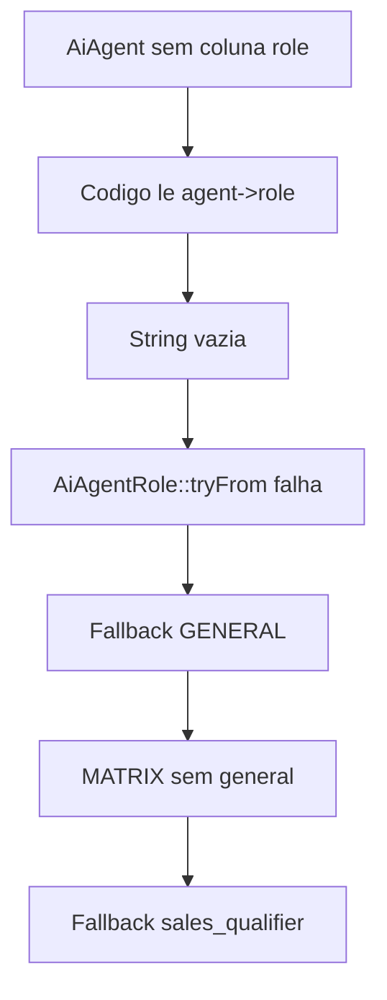

# Tasks: Auditoria e Correção do Autopilot (AUDIT-AI-001)

Feature doc: N/A — auditoria técnica do módulo existente `api/src/Domain/Ai`
Status geral: 🔄 Em Planejamento | 0/8 tasks concluídas
Data da auditoria: 2026-05-19
Escopo: `api/` e integração `gateway/` relacionada a `ai.run.request` / `ai.tool.request`

---

## 1. Resumo Executivo

A auditoria encontrou inconsistências no módulo Autopilot que podem afetar quais tools um agente recebe, qual role é aplicada na execução e quais caminhos de código ainda são seguros de manter. O problema principal é que o sistema usa duas fontes diferentes para role/tools: parte do código lê `$agent->role`, mas a tabela `ai_agents` não possui coluna `role`; a fonte real mais recente parece ser `metadata.role` e `metadata.tool_names`.

Prioridade de correção:

| Prioridade | Tema | Impacto |
|------------|------|---------|
| P1 | Role do agente inconsistente | Tools podem ser expostas ou bloqueadas com papel errado |
| P1 | Role `general` sem matriz própria | Agente geral cai implicitamente em `sales_qualifier` |
| P2 | `AiRunExecutionJob` referencia `AiToolCallJob` inexistente | Caminho legado pode gerar erro fatal se acionado |
| P2 | `ai_autopilot_tools` / `ai_agent_tools` parecem fonte morta ou duplicada | Banco pode mostrar configuração que runtime ignora |
| P3 | `composer analyse` falha em `AiContextBuilderService` | Gate backend não fecha |
| P3 | Publicação duplicada em Redis Stream | Risco de divergência entre fluxos |

---

## 2. Evidências Executadas

### Testes focados

Comando:

```bash
cd api
composer test -- --filter='AiRunExecutionJob|AiRunTrackerJob|ToolDispatcherService|AiToolsContractSanity|DispatchAutopilotRunJob|ConsumeToolRequestsCommand|AiCrmTools|AiToolsWave'
```

Resultado:

- 47 testes passaram
- 643 assertions
- Cobriu contratos das tools, dispatcher, tracker, waves de CRM tools, consumer de tool requests e dispatcher de run

### Análise estática

Comando:

```bash
cd api
composer analyse
```

Resultado:

- Falhou com 1 erro:
  - `api/src/Domain/Ai/Services/AiContextBuilderService.php:66`
  - `Using nullsafe property access "?->timezone" on left side of ?? is unnecessary. Use -> instead.`

---

## 3. Diagnóstico Por Erro

### P1 — Role do agente é inconsistente

**Erro**

O código lê `$agent->role` em pontos críticos, mas o model `AiAgent` e a migration `ai_agents` não possuem coluna `role`.

**Evidência**

- Migration `ai_agents` cria `type`, `metadata`, `model_id`, etc., mas não cria `role`:
  - `api/database/migrations/2026_01_01_000050_create_ai_core_tables.php`
- Model `AiAgent` não possui `role` em `$fillable`:
  - `api/src/Domain/Ai/Models/AiAgent.php`
- Código lê `$agent->role` em:
  - `api/src/Domain/Ai/Http/Controllers/AiAgentController.php`
  - `api/src/Domain/Ai/Actions/AiAgentSubresourceActions.php`
  - `api/src/Domain/Ai/Services/AutopilotRunSnapshotResolver.php`
  - `api/src/Domain/Ai/Services/AiAgentDelegationService.php`
- Seeders mais novos salvam role dentro de `metadata.role`:
  - `api/database/seeders/InteraZapProductAgentsSeeder.php`

**Por que isso é perigoso**

Quando `$agent->role` não existe, o valor pode virar string vazia. O `ToolDispatcherService` tenta converter essa string para `AiAgentRole`; se não conseguir, cai para `GENERAL`. Como `GENERAL` também não tem matriz própria, o serviço acaba usando o fallback `sales_qualifier`.

Fluxo atual simplificado:



**Correção recomendada**

Escolher uma fonte única de verdade para role:

1. Opção recomendada: manter `metadata.role` como fonte atual e criar helper no model.
2. Alternativa: adicionar coluna `role` em `ai_agents` e migrar/backfill `metadata.role`.

Recomendação pragmática:

- Criar método `AiAgent::roleValue(): string` que leia `metadata.role`, valide contra `AiAgentRole` e retorne `general` como fallback explícito.
- Substituir leituras diretas de `$agent->role` e `$agent->getAttribute('role')` por esse método.
- Ajustar requests/DTO para aceitar `role` e persistir em `metadata.role`, se a API pública continuar recebendo `role`.

---

### P1 — Role `general` existe, mas não tem matriz própria

**Erro**

`AiAgentRole::GENERAL` existe e sua descrição diz que o agente geral tem acesso completo, mas `AiPermissionMatrixService::MATRIX` não possui chave `general`.

**Evidência**

- Enum:
  - `api/src/Domain/Ai/Enums/AiAgentRole.php`
- Matriz sem chave `general`:
  - `api/src/Domain/Ai/Services/AiPermissionMatrixService.php`
- Fallback atual:

```php
return self::MATRIX[$role->value] ?? self::MATRIX['sales_qualifier'];
```

**Por que isso é perigoso**

O comportamento real contradiz o contrato do enum. Um agente `general` não recebe uma política própria; ele herda `sales_qualifier` silenciosamente. Isso pode:

- bloquear tools esperadas para suporte, como `close_ticket`;
- liberar um conjunto de vendas para agentes que deveriam ser neutros;
- dificultar auditoria de permissões, porque a role exibida não corresponde à matriz aplicada.

**Correção recomendada**

- Adicionar `general` à matriz.
- Decidir se `general` significa:
  - acesso completo (`ALL_TOOLS`);
  - conjunto mínimo seguro;
  - role proibida em produção, usada apenas como fallback.
- Remover fallback silencioso para `sales_qualifier`; preferir fallback explícito para `general` ou lançar falha controlada.

---

### P2 — `AiRunExecutionJob` referencia `AiToolCallJob` inexistente

**Erro**

`AiRunExecutionJob` chama `AiToolCallJob::dispatch($this->runId)`, mas a classe `AiToolCallJob` não existe no repositório.

**Evidência**

- Chamada:
  - `api/src/Domain/Ai/Jobs/AiRunExecutionJob.php`
- Não há arquivo/classe `AiToolCallJob`.
- `AiAutopilotRunActions::run()` ainda despacha `AiRunExecutionJob`.

**Por que isso é perigoso**

O fluxo principal atual parece ser Redis Stream:

```text
DispatchAutopilotRunJob -> ai.run.request -> gateway -> ai.run.response -> AiRunTrackerJob
```

Mesmo assim, o executor antigo ainda pode ser acionado por `AiAutopilotRunActions::run()`. Se uma execução gerar `hasMoreIterations = true`, o PHP tentará chamar uma classe inexistente e a run falhará.

**Correção recomendada**

Escolher uma das rotas:

1. Remover/depreciar `AiRunExecutionJob` e `AiAutopilotRunActions::run()` se o gateway for o único executor válido.
2. Reimplementar `AiToolCallJob` se o executor Laravel ainda for necessário.
3. Trocar `AiRunExecutionJob` para publicar no mesmo pipeline `ai.run.request`, usando `AutopilotRunStreamPublisher`.

Recomendação: consolidar no gateway e remover o caminho legado depois de cobrir rotas/testes que ainda o chamam.

---

### P2 — Tools em banco parecem fonte morta ou duplicada

**Erro**

O runtime usa enum/classes/metadata para decidir tools, mas também existem tabelas e modelos de tools:

- `ai_autopilot_tools`
- `ai_agent_tools`
- `AiAutopilotTool`
- `AiAutopilotToolDTO`
- `AiAutopilotToolResource`

Na prática, controllers de agent tools persistem `metadata.tool_names`, não o pivot `ai_agent_tools`.

**Evidência**

- Atualização de tools por metadata:
  - `api/src/Domain/Ai/Http/Controllers/AiAgentController.php`
  - `api/src/Domain/Ai/Actions/AiAgentSubresourceActions.php`
- Snapshot de tools lê `metadata.tool_names`:
  - `api/src/Domain/Ai/Services/AutopilotRunSnapshotResolver.php`
- Pivot é criado/semeado:
  - `api/database/migrations/2026_01_01_000050_create_ai_core_tables.php`
  - `api/database/seeders/InteraZapProductAgentsSeeder.php`
- Dispatcher não lê `ai_agent_tools`.

**Por que isso é perigoso**

Existem duas representações concorrentes:

| Fonte | Usada pelo runtime? | Risco |
|-------|----------------------|-------|
| `metadata.tool_names` | Sim | Sem FK/normalização |
| `ai_agent_tools` | Não no dispatcher | Configuração no banco pode ser ignorada |
| `ai_autopilot_tools` | Parcial/catalog/seeder | Pode virar catálogo morto |

**Correção recomendada**

Escolher uma fonte única:

1. Se a fonte oficial for `metadata.tool_names`, remover ou marcar como legado o pivot e modelos não usados.
2. Se a fonte oficial for relacional, alterar controllers/snapshot/dispatcher para ler `ai_agent_tools` com FK em `ai_autopilot_tools`.

Recomendação: para integridade e auditoria, migrar para fonte relacional e manter `metadata.tool_names` apenas como compatibilidade temporária.

---

### P3 — `composer analyse` falha no contexto builder

**Erro**

PHPStan/Larastan acusa nullsafe desnecessário:

```php
$now = now()->setTimezone($ticket->tenant?->timezone ?? 'America/Sao_Paulo');
```

**Evidência**

- Arquivo:
  - `api/src/Domain/Ai/Services/AiContextBuilderService.php`
- Linha apontada:
  - 66

**Por que isso importa**

Mesmo sendo simples, isso bloqueia o gate backend `composer analyse`.

**Correção recomendada**

Trocar para acesso direto se a relação é garantida como não nula:

```php
$now = now()->setTimezone($ticket->tenant->timezone ?? 'America/Sao_Paulo');
```

Ou, se o tenant puder ser nulo na prática, ajustar a tipagem/modelo/teste para refletir isso. A decisão correta depende do contrato de `ChatTicket::tenant`.

---

### P3 — Publicação em Redis Stream está duplicada

**Erro**

`AutopilotRunStreamPublisher` centraliza publicação em `ai.run.request`, mas `InternalAiController` mantém método próprio `publishRunRequestToStream()`.

**Evidência**

- Publisher oficial:
  - `api/src/Domain/Ai/Services/AutopilotRunStreamPublisher.php`
- Duplicação:
  - `api/src/Domain/Ai/Http/Controllers/InternalAiController.php`

**Por que isso é perigoso**

Mudanças futuras em serialização, nome do stream, conexão Redis ou compatibilidade Predis podem ser feitas em um caminho e esquecidas no outro.

**Correção recomendada**

Injetar `AutopilotRunStreamPublisher` no `InternalAiController` e remover o método privado duplicado.

---

## 4. Plano de Correção T.A.C.E

## FASE 3: BACKEND (api/)

### 3.1 — Role e Permissões

- [ ] **TASK-3.1.1** ⏳: Unificar fonte da role do agente

  **T — Tarefa:** Criar fonte única para role do `AiAgent` e substituir leituras diretas de `$agent->role`.

  **A — Arquivos:**
  - `api/src/Domain/Ai/Models/AiAgent.php`
  - `api/src/Domain/Ai/Http/Controllers/AiAgentController.php`
  - `api/src/Domain/Ai/Actions/AiAgentSubresourceActions.php`
  - `api/src/Domain/Ai/Services/AutopilotRunSnapshotResolver.php`
  - `api/src/Domain/Ai/Services/AiAgentDelegationService.php`
  - `api/src/Domain/Ai/Jobs/DispatchAutopilotRunJob.php`

  **C — Comportamento:**
  ANTES:
  - Código lê `$agent->role`, campo inexistente na tabela.
  - Role real dos seeders fica em `metadata.role`.

  DEPOIS:
  - Código usa método único, por exemplo `roleValue()`.
  - `metadata.role` é validado contra `AiAgentRole`.
  - Fallback para `general` é explícito e testado.

  **E — Evidência:**
  - [ ] Teste cria agente com `metadata.role = support_l1` e snapshot retorna tools de suporte
  - [ ] Teste cria agente sem role e aplica fallback `general`
  - [ ] `composer analyse` retorna 0 erros para arquivos alterados

  **Status:** ⏳ Pendente

---

- [ ] **TASK-3.1.2** ⏳: Definir matriz explícita para `general`

  **T — Tarefa:** Adicionar política explícita para `AiAgentRole::GENERAL` no `AiPermissionMatrixService`.

  **A — Arquivos:**
  - `api/src/Domain/Ai/Services/AiPermissionMatrixService.php`
  - `api/tests/Unit/Domain/Ai/Services/AiPermissionMatrixServiceTest.php`

  **C — Comportamento:**
  ANTES:
  - `general` não existe na matriz.
  - `getAvailableTools(GENERAL)` cai em `sales_qualifier`.

  DEPOIS:
  - `general` possui lista própria.
  - Fallback silencioso para `sales_qualifier` é removido ou documentado com teste.

  **E — Evidência:**
  - [ ] Teste garante que `GENERAL` não retorna matriz de `sales_qualifier` por acidente
  - [ ] Teste cobre uma tool esperada para `general`
  - [ ] Teste cobre role inválida/fallback

  **Status:** ⏳ Pendente

---

### 3.2 — Executor de Run

- [ ] **TASK-3.2.1** ⏳: Remover ou corrigir caminho legado `AiRunExecutionJob`

  **T — Tarefa:** Decidir e implementar o destino do executor Laravel legado.

  **A — Arquivos:**
  - `api/src/Domain/Ai/Jobs/AiRunExecutionJob.php`
  - `api/src/Domain/Ai/Actions/AiAutopilotRunActions.php`
  - `api/tests/Feature/AiRunExecutionJobTest.php`
  - `api/tests/Unit/Domain/Ai/Actions/AiAutopilotRunActionsTest.php`

  **C — Comportamento:**
  ANTES:
  - `AiRunExecutionJob` referencia `AiToolCallJob`, que não existe.

  DEPOIS:
  - Caminho legado é removido, ou
  - `AiRunExecutionJob` publica via `AutopilotRunStreamPublisher`, ou
  - `AiToolCallJob` é implementado com testes.

  **E — Evidência:**
  - [ ] `rg "AiToolCallJob"` não encontra referência quebrada, ou classe existe com teste
  - [ ] Teste cobre run com mais de uma iteração/tool call
  - [ ] `composer test -- --filter='AiRunExecutionJob|AiAutopilotRunActions'` passa

  **Status:** ⏳ Pendente

---

### 3.3 — Fonte Única de Tools

- [ ] **TASK-3.3.1** ⏳: Decidir fonte oficial de tools do agente

  **T — Tarefa:** Definir se a fonte de tools será `metadata.tool_names` ou relação `ai_agent_tools`.

  **A — Arquivos:**
  - `api/src/Domain/Ai/Services/AutopilotRunSnapshotResolver.php`
  - `api/src/Domain/Ai/Services/ToolDispatcherService.php`
  - `api/src/Domain/Ai/Http/Controllers/AiAgentController.php`
  - `api/src/Domain/Ai/Actions/AiAgentSubresourceActions.php`
  - `api/database/migrations/2026_01_01_000050_create_ai_core_tables.php`
  - `api/database/seeders/AiAutopilotToolSeeder.php`

  **C — Comportamento:**
  ANTES:
  - Runtime usa `metadata.tool_names`.
  - Banco tem `ai_agent_tools` e `ai_autopilot_tools`, mas dispatcher não usa o pivot.

  DEPOIS:
  - Apenas uma fonte é a oficial.
  - A outra é removida, marcada como legado ou sincronizada temporariamente.

  **E — Evidência:**
  - [ ] Documento/Memory registra a decisão
  - [ ] Teste atualiza tools do agente e confirma que snapshot/dispatcher usam a mesma fonte
  - [ ] Teste impede divergência entre metadata e pivot, se ambos permanecerem durante migração

  **Status:** ⏳ Pendente

---

- [ ] **TASK-3.3.2** ⏳: Implementar leitura consistente de tools

  **T — Tarefa:** Ajustar controllers, snapshot e dispatcher para lerem tools da fonte oficial.

  **A — Arquivos:**
  - `api/src/Domain/Ai/Http/Controllers/AiAgentController.php`
  - `api/src/Domain/Ai/Actions/AiAgentSubresourceActions.php`
  - `api/src/Domain/Ai/Services/AutopilotRunSnapshotResolver.php`
  - `api/src/Domain/Ai/Services/ToolDispatcherService.php`
  - `api/tests/Feature/AiAgentControllerTest.php`
  - `api/tests/Feature/Domain/Ai/Http/Controllers/InternalAiControllerTest.php`

  **C — Comportamento:**
  ANTES:
  - UI/API pode gravar uma representação e runtime consumir outra.

  DEPOIS:
  - Listagem, update, snapshot e execução usam a mesma lista de tools.

  **E — Evidência:**
  - [ ] `GET /api/ai/agents/{id}/tools` retorna a mesma fonte usada pelo gateway
  - [ ] `/internal/ai/tools/{agentId}` retorna tools atualizadas
  - [ ] `composer test -- --filter='AiAgentController|InternalAiController|ToolDispatcherService'` passa

  **Status:** ⏳ Pendente

---

### 3.4 — Gates e Limpeza

- [ ] **TASK-3.4.1** ⏳: Corrigir falha do PHPStan em `AiContextBuilderService`

  **T — Tarefa:** Ajustar acesso ao timezone do tenant conforme contrato real do model.

  **A — Arquivo:** `api/src/Domain/Ai/Services/AiContextBuilderService.php`

  **C — Comportamento:**
  ANTES:
  - `composer analyse` falha por nullsafe desnecessário.

  DEPOIS:
  - Acesso ao tenant fica consistente com a tipagem.
  - Gate de análise estática passa.

  **E — Evidência:**
  - [ ] `composer analyse` retorna 0 erros
  - [ ] Teste de contexto garante timezone esperado quando tenant possui timezone

  **Status:** ⏳ Pendente

---

- [ ] **TASK-3.4.2** ⏳: Consolidar publicação em `ai.run.request`

  **T — Tarefa:** Substituir publicação manual duplicada por `AutopilotRunStreamPublisher`.

  **A — Arquivos:**
  - `api/src/Domain/Ai/Http/Controllers/InternalAiController.php`
  - `api/src/Domain/Ai/Services/AutopilotRunStreamPublisher.php`
  - `api/tests/Feature/Domain/Ai/Http/Controllers/InternalAiControllerTest.php`

  **C — Comportamento:**
  ANTES:
  - `InternalAiController` possui método privado de XADD duplicado.

  DEPOIS:
  - Todo publish de run request usa `AutopilotRunStreamPublisher`.

  **E — Evidência:**
  - [ ] `rg "publishRunRequestToStream" api/src` não encontra duplicação
  - [ ] Testes de `InternalAiController` continuam validando payload em `ai.run.request`
  - [ ] `composer test -- --filter='InternalAiController'` passa

  **Status:** ⏳ Pendente

---

- [ ] **TASK-3.4.3** ⏳: Mapear e remover código morto confirmado

  **T — Tarefa:** Listar artefatos legados confirmados e remover apenas após testes cobrirem o fluxo atual.

  **A — Arquivos candidatos:**
  - `api/src/Domain/Ai/Models/AiAutopilotTool.php`
  - `api/src/Domain/Ai/DTOs/AiAutopilotToolDTO.php`
  - `api/src/Domain/Ai/Http/Resources/AiAutopilotToolResource.php`
  - `api/database/seeders/AiAutopilotToolSeeder.php`
  - tabelas `ai_autopilot_tools` e `ai_agent_tools`, se decisão for remover fonte relacional

  **C — Comportamento:**
  ANTES:
  - Artefatos existem, mas não há evidência de uso no runtime principal.

  DEPOIS:
  - Artefatos são removidos, marcados como legado, ou integrados ao runtime.

  **E — Evidência:**
  - [ ] `rg` documenta todos os usos antes da remoção
  - [ ] Migration de remoção só existe se houver decisão registrada
  - [ ] `composer test -- --filter='Ai|Autopilot|Tool'` passa

  **Status:** ⏳ Pendente

---

## 5. Ordem Recomendada de Implementação

1. Corrigir `AiContextBuilderService` para liberar `composer analyse`.
2. Definir `general` em `AiPermissionMatrixService`.
3. Criar fonte única de role no `AiAgent`.
4. Ajustar snapshots/controllers/delegação para usar role correta.
5. Decidir fonte oficial de tools.
6. Remover ou corrigir `AiRunExecutionJob` / `AiToolCallJob`.
7. Consolidar publicação em `AutopilotRunStreamPublisher`.
8. Só depois remover código morto confirmado.

---

## 6. Gates de Validação

| Gate | Comando | Critério |
|------|---------|----------|
| Testes focados AI | `cd api && composer test -- --filter='Ai|Autopilot|Tool'` | 0 falhas |
| Análise estática | `cd api && composer analyse` | 0 erros |
| Formatação | `cd api && composer format` | sem diff inesperado |
| Gate backend completo | `cd api && composer gate:all` | 0 falhas |
| Busca de referência quebrada | `rg "AiToolCallJob|agent->role|getAttribute\\('role'\\)" api/src` | sem uso quebrado remanescente |

---

## 7. Riscos e Mitigações

| Risco | Severidade | Mitigação |
|-------|------------|-----------|
| Alterar role muda tools expostas em produção | Alta | Criar testes por role e rollout com tenants de teste |
| Remover tabelas de tools quebra seeders ou UI futura | Média | Decidir fonte oficial e manter compat temporária |
| Depreciar `AiRunExecutionJob` quebra rotas manuais de simulação | Média | Mapear chamadas de `AiAutopilotRunActions::run()` antes da remoção |
| Corrigir `general` amplia permissões demais | Alta | Definir matriz mínima segura ou exigir role específica por agente |

---

## 8. Definition of Done

- [ ] Role de agente tem fonte única e documentada.
- [ ] `GENERAL` tem matriz explícita ou não é usado como fallback silencioso.
- [ ] Não existe referência a classe inexistente `AiToolCallJob`, salvo se a classe for implementada.
- [ ] Runtime e API usam a mesma fonte de tools.
- [ ] `composer analyse` passa.
- [ ] Testes focados de AI/autopilot/tools passam.
- [ ] Decisões de role/tools registradas em `.context/DOCS/MEMORY/`.
- [ ] Changelog do dia atualizado ao concluir as correções.
