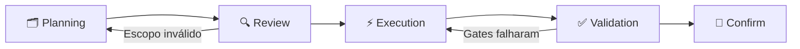
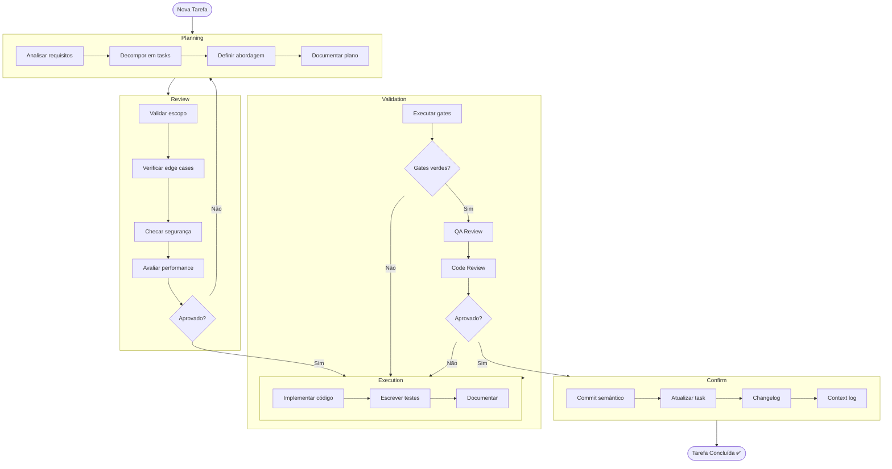

# PREVC Workflow — InteraZap

> Workflow oficial de desenvolvimento do InteraZap. Todas as mudanças — features, bugfixes, refactoring, documentação — seguem este processo.

## Visão Geral

PREVC é o acrônimo para as 5 fases obrigatórias do ciclo de desenvolvimento:

```
Planning → Review → Execution → Validation → Confirm
```

**Regra absoluta**: nenhuma fase pode ser pulada. Mesmo para mudanças "triviais", o ciclo completo deve ser seguido (ajustando a profundidade de cada fase proporcionalmente à complexidade).



---

## Critério de Saída Global

Uma tarefa só é considerada **concluída** quando:

- [ ] Código implementado e funcional
- [ ] Testes escritos e passando
- [ ] Documentação atualizada
- [ ] Gates verdes em todas as camadas afetadas
- [ ] Review sem blockers críticos
- [ ] Commit semântico criado
- [ ] Task marcada como `done`

---

## Fase 1 — Planning (P)

### Objetivo

Entender a especificação, decompor a tarefa, definir abordagem técnica e criar um plano documentado.

### Inputs

- PRD (se existir): `DOCS/PRD/PRD-[MODULO]-[NUMERO].md`
- Issue ou pedido do usuário
- Contexto existente em `.context/DOCS/MEMORY/`

### Atividades

1. **Análise de requisitos**
    - Ler PRD relacionado (se existir)
    - Identificar módulos afetados (referência: `.context/WORKFLOW/modules.yaml`)
    - Mapear dependências entre módulos (referência: `.context/WORKFLOW/dependencies.yaml`)

2. **Decomposição**
    - Quebrar a feature/fix em tasks atômicas
    - Definir ordem de execução (backend → gateway → frontend, geralmente)
    - Identificar agentes necessários (`@BACKEND`, `@FRONTEND`, `@DBA`, etc.)

3. **Definição de abordagem**
    - Escolher patterns (DDD: Controller → DTO → Action → Resource)
    - Avaliar impacto em tenant isolation
    - Avaliar impacto em performance
    - Identificar riscos e mitigações

4. **Documentação do plano**
    - Criar `DOCS/PLANS/PLAN-{000}-{nome-em-letra-minuscula}.md` (usar template: `.context/WORKFLOW/plan-template.md`)
    - Criar tasks derivadas em `DOCS/TASKS/TASKS-{numero-do-plano}.md` (usar template: `.context/WORKFLOW/task-template.md`)

### Outputs

- Plano documentado em `DOCS/PLANS/`
- Tasks criadas em `DOCS/TASKS/`
- Módulos e dependências identificados

### Checklist de Saída

- [ ] Plano criado com escopo claro
- [ ] Tasks derivadas do plano
- [ ] Módulos afetados identificados
- [ ] Dependências mapeadas
- [ ] Agentes necessários definidos
- [ ] Riscos documentados

---

## Fase 2 — Review (R)

### Objetivo

Validar a abordagem planejada antes de qualquer implementação. Prevenir scope creep, gaps de segurança e problemas de design.

### Inputs

- Plano da fase P
- Tasks criadas
- Contexto do projeto

### Atividades

1. **Validação de escopo**
    - Plano resolve exatamente o que foi pedido? (nem mais, nem menos)
    - Há features não solicitadas sendo adicionadas?
    - A complexidade é proporcional ao problema?

2. **Verificação de edge cases**
    - Cenários de erro estão cobertos?
    - Validação de input está prevista?
    - Estados intermediários foram considerados?

3. **Validação de segurança**
    - Tenant isolation está garantido?
    - Inputs externos são validados (FormRequest / ValidationPipe)?
    - Tokens, senhas ou API keys estão protegidos?
    - Rate limiting está previsto para endpoints públicos?

4. **Validação de performance**
    - Queries com N+1 identificadas? (usar eager loading)
    - Operações pesadas estão em queue/async?
    - Índices de banco necessários foram planejados?

5. **Validação de consistência**
    - Segue o pattern DDD do projeto?
    - Nomenclatura segue convenções existentes?
    - Reutiliza componentes shared existentes?

### Decisão

| Resultado              | Ação                               |
| ---------------------- | ---------------------------------- |
| ✅ Aprovado            | Avançar para Execution             |
| ⚠️ Ajustes necessários | Voltar para Planning com feedback  |
| ❌ Rejeitado           | Replanejamento completo necessário |

### Outputs

- Plano aprovado (ou feedback para replanejar)
- Registro de decisão (se relevante, em `DOCS/MEMORY/ai-decisions.md`)

### Checklist de Saída

- [ ] Escopo validado (sem scope creep)
- [ ] Edge cases cobertos
- [ ] Segurança verificada (tenant isolation, validação de input)
- [ ] Performance avaliada
- [ ] Consistência com patterns do projeto
- [ ] Plano aprovado para execução

---

## Fase 3 — Execution (E)

### Objetivo

Implementar código, testes e documentação seguindo o plano aprovado.

### Inputs

- Plano aprovado da fase R
- Tasks priorizadas
- Módulos e paths identificados

### Atividades

1. **Implementação Backend** (quando aplicável)
    - Seguir DDD: Controller → DTO → Action → Resource
    - `declare(strict_types=1)` em todo arquivo PHP
    - `final class` em Controllers, Actions e DTOs
    - UUID PKs, `$fillable` explícito, nunca `$guarded = []`
    - `$this->authorize()` em toda action de controller
    - `BelongsToTenant` trait + tenant filters
    - Eager loading sempre (nunca N+1)
    - Paths: ver tabela em `AGENTS.md`

2. **Implementação Gateway** (quando aplicável)
    - `ValidationPipe` com whitelist
    - Logger por controller e service
    - Circuit breaker em chamadas externas
    - Idempotência em webhooks via Redis SETNX
    - Paths: ver tabela em `AGENTS.md`

3. **Implementação Frontend** (quando aplicável)
    - Nunca usar `any` ou `unknown`
    - `ChangeDetectionStrategy.OnPush` em todo componente
    - `signal()` e `computed()` para estado local
    - `inject()` ao invés de constructor injection
    - `takeUntilDestroyed` em todas subscriptions
    - Verificar `http://localhost:4200/ui-kit` antes de criar componentes visuais
    - Usar `CrudPageComponent` para listagens CRUD
    - Paths: ver tabela em `AGENTS.md`

4. **Testes**
    - Backend: Pest (`tests/Feature/`)
    - Frontend: Vitest (`*.spec.ts`)
    - Gateway: Jest (`test/`)
    - Escrever testes junto com o código, não depois

5. **Documentação**
    - phpDoc em classes e métodos públicos (PHP)
    - jsDoc em interfaces e funções exportadas (TS)
    - Atualizar `.context/` se necessário

### Outputs

- Código implementado
- Testes escritos
- Documentação atualizada

### Checklist de Saída

- [ ] Código implementado conforme plano
- [ ] Testes escritos e passando localmente
- [ ] phpDoc/jsDoc presentes
- [ ] Convenções do stack seguidas
- [ ] Nenhum `any`, `$guarded = []`, ou auto-increment introduzido
- [ ] Documentação atualizada

---

## Fase 4 — Validation (V)

### Objetivo

Garantir qualidade através de gates automatizados e revisão humana/IA.

### Inputs

- Código da fase E
- Testes implementados

### Atividades

1. **Execução dos Gates** (ordem obrigatória)

    ```bash
    # 1. Backend
    cd api && composer gate:all

    # 2. Frontend
    cd app && pnpm run gate:all

    # 3. Gateway
    cd gateway && pnpm lint && pnpm test
    ```

    > ⚠️ **Gates são INEGOCIÁVEIS.** Se falhar → corrigir → re-executar. Não prosseguir com gates vermelhos.

2. **Auto-fix** (quando aplicável)

    ```bash
    cd api && composer format
    cd app && pnpm run format && pnpm run lint:fix
    ```

3. **QA Review**
    - Acionar `@QA` para auditoria de qualidade
    - Verificar cobertura de testes
    - Validar cenários de erro
    - Testar fluxo completo (se cross-layer)

4. **Verificação de segurança**
    - Tenant isolation funcional
    - Nenhum dado sensível em logs
    - Validação de input em todas as camadas
    - Rate limiting em endpoints públicos

5. **Verificação de performance**
    - Sem N+1 queries
    - Operações pesadas em queue
    - Respostas dentro do SLA

6. **Code Review**
    - Acionar `@REVIEWER` para revisão de código
    - Verificar patterns, naming, estrutura
    - Aprovar ou solicitar ajustes

### Decisão

| Resultado                         | Ação                                         |
| --------------------------------- | -------------------------------------------- |
| ✅ Gates verdes + Review aprovado | Avançar para Confirm                         |
| ⚠️ Gates falharam                 | Voltar para Execution, corrigir, re-executar |
| ❌ Review com blockers            | Voltar para Execution com feedback           |

### Outputs

- Gates verdes (evidência)
- Review aprovado
- QA sign-off

### Checklist de Saída

- [ ] `composer gate:all` verde (se backend afetado)
- [ ] `pnpm run gate:all` verde (se frontend afetado)
- [ ] `pnpm lint && pnpm test` verde (se gateway afetado)
- [ ] QA review sem issues críticos
- [ ] Code review aprovado
- [ ] Tenant isolation verificado
- [ ] Performance validada

---

## Fase 5 — Confirm (C)

### Objetivo

Fechar o ciclo com evidências, commit semântico, atualização de estado e changelog.

### Inputs

- Código validado da fase V
- Gates verdes
- Review aprovado

### Atividades

1. **Commit semântico**
    - Acionar `@GIT_COMMIT`
    - Formato: `type(scope): description`
    - Types: `feat`, `fix`, `refactor`, `docs`, `test`, `chore`, `perf`
    - Scope = módulo afetado (ex: `crm`, `chat`, `billing`)

2. **Atualização de estado**
    - Task em `DOCS/TASKS/` → status `done`
    - Preencher seção "Evidências" na task
    - Atualizar `project-state.yaml` se necessário

3. **Changelog**
    - Adicionar entrada em `.context/DOCS/CHANGELOG/CHANGELOG-YYYY-MM.md`
    - Formato: data + tipo + descrição + impacto

4. **Context Log**
    - Atualizar `.context/DOCS/MEMORY/context-log.md` com mudanças significativas

5. **Decisões de IA**
    - Se houve decisão inferida, registrar em `.context/DOCS/MEMORY/ai-decisions.md`

### Outputs

- Commit semântico criado
- Task marcada como `done`
- Changelog atualizado
- Estado do projeto atualizado

### Checklist de Saída

- [ ] Commit semântico criado (conventional commits)
- [ ] Task atualizada para `done` com evidências
- [ ] Changelog entry adicionada
- [ ] Context log atualizado (se mudança significativa)
- [ ] AI decisions log atualizado (se houve inferência)
- [ ] Plano referenciado na task

---

## Fluxo Visual Completo



---

## Referências

| Documento                   | Caminho                                 |
| --------------------------- | --------------------------------------- |
| Contrato de desenvolvimento | `AGENTS.md`                             |
| Validation Flow             | `.context/WORKFLOW/validation-flow.md`  |
| Task Template               | `.context/WORKFLOW/task-template.md`    |
| Plan Template               | `.context/WORKFLOW/plan-template.md`    |
| Development Flow (índice)   | `.context/WORKFLOW/development-flow.md` |
| Módulos                     | `.context/WORKFLOW/modules.yaml`        |
| Dependências                | `.context/WORKFLOW/dependencies.yaml`   |
| Project State               | `.context/WORKFLOW/project-state.yaml`  |
