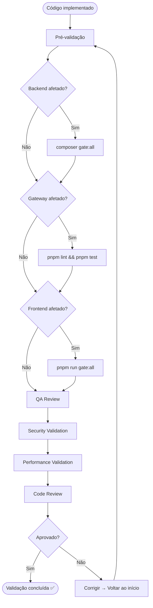

# Validation Flow — InteraZap

> Processo detalhado de validação de qualidade. Corresponde à **fase V (Validation)** do workflow PREVC.

---

## Visão Geral

A validação é a barreira de qualidade entre a implementação e a entrega. Nenhuma mudança pode ser confirmada sem passar por este processo completo.



---

## 1. Pré-validação

Antes de executar os gates automatizados, verifique manualmente:

- [ ] Código compila sem erros em todas as camadas afetadas
- [ ] Testes passam localmente (`pest`, `vitest`, `jest`)
- [ ] Nenhum arquivo temporário ou de debug foi commitado
- [ ] Imports e dependências estão corretos
- [ ] Variáveis de ambiente necessárias estão configuradas

### Auto-fix rápido

```bash
# Backend — formatar código
cd api && composer format

# Frontend — formatar e corrigir lint
cd app && pnpm run format && pnpm run lint:fix
```

---

## 2. Execução dos Gates

### Ordem obrigatória: Backend → Gateway → Frontend

A ordem garante que a base de dados e lógica de negócio estejam corretas antes de validar layers dependentes.

---

### 2.1 Backend Gate

```bash
cd api && composer gate:all
```

**O que valida:**

- PHPStan Level 6 + Larastan (análise estática)
- Rector (refactoring automatizado)
- Pest tests (testes unitários e de feature)
- Code formatting (PSR-12)

**Quando executar:** Sempre que houver mudança em `api/`

**Se falhar:**

1. Ler output do gate para identificar o erro
2. Erros de PHPStan: corrigir tipos, PHPDoc, nullable
3. Erros de teste: corrigir lógica ou atualizar assertivas
4. Erros de format: `cd api && composer format`
5. Re-executar: `cd api && composer gate:all`

---

### 2.2 Gateway Gate

```bash
cd gateway && pnpm lint && pnpm test
```

**O que valida:**

- ESLint (análise estática)
- Jest tests (testes unitários e de integração)

**Quando executar:** Sempre que houver mudança em `gateway/`

**Se falhar:**

1. Erros de lint: corrigir ou revisar regras em `eslint.config.mjs`
2. Erros de teste: corrigir lógica ou atualizar mocks
3. Re-executar: `cd gateway && pnpm lint && pnpm test`

---

### 2.3 Frontend Gate

```bash
cd app && pnpm run gate:all
```

**O que valida:**

- ESLint (análise estática TypeScript/Angular)
- Vitest tests (testes unitários e de componente)
- Build check (compilação Angular)

**Quando executar:** Sempre que houver mudança em `app/`

**Se falhar:**

1. Erros de lint: `cd app && pnpm run lint:fix`
2. Erros de build: revisar imports, types, templates
3. Erros de teste: corrigir lógica ou atualizar fixtures
4. Re-executar: `cd app && pnpm run gate:all`

---

## 3. QA Review

Após gates verdes, acionar o agente `@QA` para:

### Checklist QA

- [ ] Cobertura de testes adequada para a mudança
- [ ] Cenários de erro testados (inputs inválidos, timeouts, etc.)
- [ ] Estados de UI cobertos (loading, empty, error) — se frontend
- [ ] Fluxo completo funcional (se cross-layer)
- [ ] Não há regressões nos flows existentes
- [ ] Dados de teste realistas utilizados

---

## 4. Security Validation

### Tenant Isolation

- [ ] Queries filtram por `tenant_id` / schema do tenant
- [ ] `BelongsToTenant` trait aplicado em novos models
- [ ] Nenhum endpoint acessa dados cross-tenant
- [ ] Teste de isolamento: tenant A não vê dados do tenant B

### Input Validation

- [ ] `FormRequest` em todo endpoint de backend
- [ ] `ValidationPipe` com whitelist no gateway
- [ ] Inputs sanitizados no frontend antes de enviar
- [ ] Nenhum SQL injection, XSS ou command injection possível

### Dados Sensíveis

- [ ] Tokens, senhas e API keys nunca logados
- [ ] Dados sensíveis não expostos em Resources/responses
- [ ] `.env` não commitado

### Rate Limiting

- [ ] Endpoints públicos possuem rate limiting
- [ ] Endpoints de autenticação possuem proteção contra brute force

---

## 5. Performance Validation

### Backend

- [ ] Nenhuma N+1 query (usar eager loading)
- [ ] Queries complexas possuem índices
- [ ] Operações pesadas estão em queue (BullMQ / Laravel Queue)
- [ ] Respostas da API < 200ms para operações simples

### Gateway

- [ ] Webhook ACK < 150ms
- [ ] Circuit breaker em chamadas externas
- [ ] Idempotência em webhooks via Redis SETNX

### Frontend

- [ ] `OnPush` change detection em todos os componentes
- [ ] Lazy loading em rotas
- [ ] `track` em todo `@for`
- [ ] Sem memory leaks (subscriptions com `takeUntilDestroyed`)

---

## 6. Code Review

Acionar agente `@REVIEWER` para revisão final:

### Checklist de Review

- [ ] Código segue patterns do projeto (DDD, naming conventions)
- [ ] Nenhum código morto ou comentado
- [ ] Tipos explícitos (sem `any`, sem `unknown`)
- [ ] Componentes shared reutilizados (não reinventar)
- [ ] PHPDoc / JSDoc presentes em público
- [ ] Commit messages seguem conventional commits

### Classificação de Issues

| Severidade    | Ação                                |
| ------------- | ----------------------------------- |
| 🔴 Critical   | Bloqueia merge — deve ser corrigido |
| 🟡 Major      | Deve ser corrigido antes do merge   |
| 🟢 Minor      | Pode ser corrigido em follow-up     |
| 💭 Suggestion | Opcional, para consideração futura  |

---

## 7. Sign-off Final

Para avançar para a fase **Confirm**:

- [ ] Todos os gates verdes
- [ ] QA review sem issues críticos
- [ ] Security validation aprovada
- [ ] Performance validada
- [ ] Code review sem blockers (🔴 ou 🟡)

Se qualquer item falhar → corrigir → re-executar validação completa.

---

## Referências

| Documento        | Caminho                                 |
| ---------------- | --------------------------------------- |
| PREVC Workflow   | `.context/WORKFLOW/prevc.md`            |
| Development Flow | `.context/WORKFLOW/development-flow.md` |
| Contrato         | `AGENTS.md`                             |
